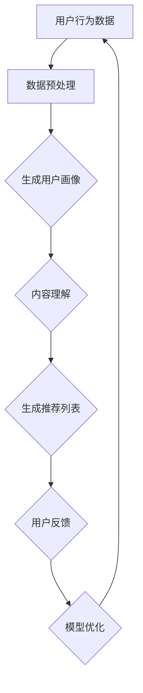

                 

# 利用LLM提升推荐系统的长尾内容发现

> **关键词：** 长尾内容，推荐系统，预训练语言模型，内容发现，机器学习，深度学习

> **摘要：** 本文将探讨如何利用预训练语言模型（LLM）提升推荐系统的长尾内容发现能力。文章首先介绍推荐系统和长尾内容的背景知识，然后详细分析LLM在推荐系统中的应用原理和优势，接着阐述如何通过结合数据预处理、模型选择、特征提取和优化策略等步骤，将LLM集成到推荐系统中，并给出具体的实现步骤。最后，文章通过实际项目案例展示LLM在长尾内容发现中的应用效果，并提出未来可能的研究方向和挑战。

## 1. 背景介绍

### 1.1 目的和范围

本文旨在探讨如何利用预训练语言模型（LLM）提升推荐系统的长尾内容发现能力。随着互联网和社交媒体的快速发展，用户生成的内容数量呈爆炸式增长，这使得推荐系统面临着越来越大的挑战。传统的推荐系统主要关注热点内容，而忽略了那些潜在价值高但访问量较少的长尾内容。长尾内容往往具备丰富的信息和多样化的特点，对于满足用户个性化需求具有重要意义。本文将介绍如何利用LLM技术，挖掘长尾内容，提升推荐系统的用户体验。

### 1.2 预期读者

本文主要面向推荐系统领域的研究人员和开发者，以及对预训练语言模型和长尾内容发现感兴趣的技术爱好者。为了使读者能够更好地理解文章内容，本文假设读者具备以下基础：

1. 熟悉推荐系统的基础概念和常用算法；
2. 了解机器学习和深度学习的基本原理；
3. 掌握Python编程语言和常见的数据处理工具（如Pandas、NumPy等）；
4. 具备一定的自然语言处理（NLP）知识。

### 1.3 文档结构概述

本文分为十个主要部分：

1. 背景介绍：介绍本文的目的、预期读者、文档结构以及核心术语；
2. 核心概念与联系：阐述推荐系统、长尾内容、预训练语言模型等核心概念及其联系；
3. 核心算法原理与具体操作步骤：详细介绍LLM在推荐系统中的应用原理和实现步骤；
4. 数学模型和公式：讲解与LLM相关的数学模型和公式，并进行举例说明；
5. 项目实战：提供实际项目案例，展示LLM在长尾内容发现中的应用效果；
6. 实际应用场景：分析LLM在推荐系统中的实际应用场景；
7. 工具和资源推荐：推荐学习资源和开发工具；
8. 总结：展望LLM在推荐系统领域的发展趋势与挑战；
9. 附录：常见问题与解答；
10. 扩展阅读：提供相关的参考文献。

### 1.4 术语表

#### 1.4.1 核心术语定义

- **推荐系统**：根据用户的历史行为、兴趣和偏好，向用户推荐相关物品或内容的系统。
- **长尾内容**：在推荐系统中，那些访问量较少但具有潜在价值的冷门内容。
- **预训练语言模型（LLM）**：基于大规模语料库预先训练的神经网络模型，可用于自然语言处理任务。
- **内容发现**：从大量数据中识别出有价值的内容，为用户提供个性化的信息推荐。
- **注意力机制**：一种用于捕捉数据中重要信息的技术，可用于特征提取和模型优化。

#### 1.4.2 相关概念解释

- **词嵌入**：将自然语言词汇映射到高维空间中的向量表示，便于模型处理和分析。
- **注意力分数**：在注意力机制中，用于衡量数据中各个部分的重要程度。
- **损失函数**：用于评估模型预测结果与实际结果之间的差距，指导模型优化。

#### 1.4.3 缩略词列表

- **LLM**：预训练语言模型（Pre-Trained Language Model）
- **NLP**：自然语言处理（Natural Language Processing）
- **GAN**：生成对抗网络（Generative Adversarial Network）
- **CNN**：卷积神经网络（Convolutional Neural Network）
- **RNN**：循环神经网络（Recurrent Neural Network）
- **BERT**：双向编码表示（Bidirectional Encoder Representations from Transformers）

## 2. 核心概念与联系

### 2.1 推荐系统与长尾内容

推荐系统是一种基于用户历史行为、兴趣和偏好的信息过滤和推荐算法，旨在为用户提供个性化的内容或商品推荐。传统的推荐系统主要关注热点内容，因为热点内容具有较高的访问量和商业价值。然而，热点内容往往占据推荐系统的一小部分，而大部分访问量较低的长尾内容被忽视。

长尾内容（Long Tail Content）是指那些访问量较少但具有潜在价值的冷门内容。在推荐系统中，长尾内容通常被忽视，因为它们无法带来明显的商业价值。然而，长尾内容具有以下优势：

1. 丰富性：长尾内容涵盖了各种主题和兴趣，能够满足用户的多样化需求。
2. 独特性：长尾内容往往具有独特的价值，能够为用户带来新的体验和发现。
3. 低竞争：长尾内容通常竞争较少，能够为网站或平台带来更高的流量和关注。

### 2.2 预训练语言模型（LLM）

预训练语言模型（LLM）是一种基于大规模语料库预先训练的神经网络模型，主要用于自然语言处理任务。LLM的核心思想是利用大规模未标注数据对模型进行预训练，然后通过微调（Fine-Tuning）适应特定任务。

LLM的主要特点包括：

1. **上下文理解**：LLM能够捕捉文本的上下文信息，从而更好地理解用户需求和意图。
2. **迁移学习**：LLM通过预训练在大规模语料库上获得知识，然后可以迁移到其他任务上，提高模型性能。
3. **自适应能力**：LLM可以根据不同的任务和数据集进行微调，适应不同的应用场景。

### 2.3 推荐系统与LLM的联系

推荐系统与LLM之间存在紧密的联系。LLM在推荐系统中的应用主要体现在以下几个方面：

1. **用户画像生成**：利用LLM对用户的历史行为和兴趣进行建模，生成用户画像，用于个性化推荐。
2. **内容理解**：利用LLM对用户生成的内容进行语义分析，理解内容的主题和情感，从而为用户推荐相关内容。
3. **长尾内容发现**：利用LLM对长尾内容进行语义分析和特征提取，挖掘潜在价值，提高推荐系统的多样性。

### 2.4 Mermaid流程图

以下是推荐系统与LLM应用的Mermaid流程图：



在上述流程中，用户行为数据经过数据预处理后生成用户画像，LLM对用户生成的内容进行理解，生成推荐列表，用户反馈用于模型优化，形成闭环。

## 3. 核心算法原理 & 具体操作步骤

### 3.1 LLM在推荐系统中的应用原理

LLM在推荐系统中的应用主要通过以下步骤实现：

1. **用户画像生成**：利用LLM对用户的历史行为数据进行建模，生成用户画像。用户画像包含用户的兴趣、偏好、行为等信息。
2. **内容理解**：利用LLM对用户生成的内容进行语义分析，理解内容的主题和情感。通过语义分析，可以为用户提供更加精准的推荐。
3. **长尾内容发现**：利用LLM对长尾内容进行语义分析和特征提取，挖掘潜在价值，提高推荐系统的多样性。

### 3.2 数据预处理

数据预处理是LLM应用的基础步骤，主要包括以下内容：

1. **数据清洗**：去除噪声数据和缺失值，保证数据质量。
2. **数据整合**：将不同来源的数据进行整合，构建统一的数据集。
3. **数据分词**：将文本数据分词成词语，便于LLM处理。
4. **词嵌入**：将分词后的文本数据映射到高维空间中的向量表示，便于模型处理。

### 3.3 用户画像生成

用户画像生成是利用LLM对用户的历史行为数据进行建模的过程。具体步骤如下：

1. **数据输入**：将用户的历史行为数据（如浏览记录、搜索历史、购买记录等）输入到LLM中。
2. **语义分析**：利用LLM对用户行为数据进行分析，提取出用户的兴趣和偏好。
3. **用户画像构建**：将提取出的用户兴趣和偏好构建成一个用户画像向量。

### 3.4 内容理解

内容理解是利用LLM对用户生成的内容进行语义分析的过程。具体步骤如下：

1. **数据输入**：将用户生成的内容（如文章、评论、问答等）输入到LLM中。
2. **语义分析**：利用LLM对用户生成的内容进行分析，提取出内容的主题和情感。
3. **内容特征提取**：将提取出的主题和情感构建成内容特征向量。

### 3.5 长尾内容发现

长尾内容发现是利用LLM对长尾内容进行语义分析和特征提取的过程。具体步骤如下：

1. **数据输入**：将长尾内容数据输入到LLM中。
2. **语义分析**：利用LLM对长尾内容进行分析，提取出内容的主题和情感。
3. **内容特征提取**：将提取出的主题和情感构建成长尾内容特征向量。
4. **内容推荐**：根据用户画像和长尾内容特征向量，为用户生成个性化的推荐列表。

### 3.6 伪代码实现

以下是利用LLM在推荐系统中实现长尾内容发现的部分伪代码：

```python
# 数据预处理
def preprocess_data(data):
    # 数据清洗、整合、分词、词嵌入
    # ...
    return processed_data

# 用户画像生成
def generate_user_profile(data, model):
    # 利用LLM分析用户行为数据，生成用户画像
    # ...
    return user_profile

# 内容理解
def understand_content(content, model):
    # 利用LLM分析用户生成的内容，提取内容特征
    # ...
    return content_features

# 长尾内容发现
def discover_long_tail_content(data, model, user_profile):
    # 利用LLM分析长尾内容，提取内容特征
    # ...
    return long_tail_content

# 内容推荐
def generate_recommendation_list(user_profile, long_tail_content):
    # 根据用户画像和长尾内容特征生成推荐列表
    # ...
    return recommendation_list
```

## 4. 数学模型和公式 & 详细讲解 & 举例说明

### 4.1 数学模型

在利用LLM提升推荐系统的长尾内容发现过程中，涉及到以下数学模型和公式：

1. **词嵌入**：将自然语言词汇映射到高维空间中的向量表示，如Word2Vec、GloVe等。
   $$ v_w = \text{embed}(w) $$

2. **注意力机制**：用于捕捉数据中重要信息的技术，如自注意力（Self-Attention）、多头注意力（Multi-Head Attention）等。
   $$ \text{Attention}(Q, K, V) = \text{softmax}\left(\frac{QK^T}{\sqrt{d_k}}\right)V $$

3. **损失函数**：用于评估模型预测结果与实际结果之间的差距，如交叉熵损失（Cross-Entropy Loss）、均方误差（Mean Squared Error）等。
   $$ L = -\sum_{i=1}^n y_i \log(\hat{y}_i) $$

4. **用户画像和内容特征**：用户画像和内容特征向量用于表示用户兴趣和内容属性，如欧氏距离（Euclidean Distance）和余弦相似度（Cosine Similarity）等。
   $$ \text{similarity} = \frac{\text{dot}(u, v)}{\|u\|\|v\|} $$

### 4.2 详细讲解

1. **词嵌入**

词嵌入（Word Embedding）是一种将自然语言词汇映射到高维空间中的向量表示的技术。通过词嵌入，可以将文本数据转换为向量形式，便于机器学习和深度学习模型处理。常见的词嵌入方法包括Word2Vec和GloVe。

- **Word2Vec**：基于神经网络的语言模型（NNLM），通过训练神经网络来预测词语的上下文，从而学习到词语的向量表示。Word2Vec模型主要包括连续词袋（CBOW）和跳词（Skip-Gram）两种架构。

  $$ \hat{p}(c_w|c_{-n}, c_{n}) = \text{softmax}(W[c_{-n}, \ldots, c_{n}]) $$

- **GloVe**：全局向量表示（Global Vectors for Word Representation），通过训练大规模语料库来学习词汇的共现信息，从而构建词汇的向量表示。GloVe模型的主要思想是利用词汇的共现概率来优化向量表示。

  $$ \text{loss} = \sum_{w, c \in \text{corpus}} \left( \text{log}\left(\frac{\text{similarity}(v_w, v_c)}{\alpha}\right) - \text{log}\left(p(w, c)\right) \right) $$

2. **注意力机制**

注意力机制（Attention Mechanism）是一种用于捕捉数据中重要信息的技术。在自然语言处理任务中，注意力机制可以帮助模型关注数据中的关键部分，从而提高模型性能。注意力机制主要包括自注意力（Self-Attention）和多头注意力（Multi-Head Attention）。

- **自注意力**：自注意力（Self-Attention）是一种对输入序列进行加权的方法，将序列中的每个元素与所有其他元素进行交互，从而生成新的序列表示。

  $$ \text{Attention}(Q, K, V) = \text{softmax}\left(\frac{QK^T}{\sqrt{d_k}}\right)V $$

- **多头注意力**：多头注意力（Multi-Head Attention）是一种扩展自注意力机制的方法，通过并行计算多个注意力机制，从而捕获序列中的不同信息。

  $$ \text{Multi-Head Attention} = \text{Concat}(\text{head}_1, \ldots, \text{head}_h)W^O $$

  其中，$h$ 表示头数，$W^O$ 表示输出权重。

3. **损失函数**

损失函数（Loss Function）是评估模型预测结果与实际结果之间差距的一种指标。在推荐系统中，常用的损失函数包括交叉熵损失（Cross-Entropy Loss）和均方误差（Mean Squared Error）。

- **交叉熵损失**：交叉熵损失（Cross-Entropy Loss）常用于分类任务，计算模型预测概率与实际标签之间的差距。

  $$ L = -\sum_{i=1}^n y_i \log(\hat{y}_i) $$

- **均方误差**：均方误差（Mean Squared Error）常用于回归任务，计算模型预测值与实际值之间的差距。

  $$ L = \frac{1}{2}\sum_{i=1}^n (\hat{y}_i - y_i)^2 $$

4. **用户画像和内容特征**

用户画像（User Profile）和内容特征（Content Feature）是推荐系统中用于表示用户兴趣和内容属性的重要工具。用户画像通常由一组特征向量表示，如兴趣标签、行为特征等。内容特征通常由一组关键词向量表示，如词嵌入、主题嵌入等。

- **欧氏距离**：欧氏距离（Euclidean Distance）是一种用于计算两个向量之间相似度的方法。

  $$ \text{similarity} = \sqrt{\sum_{i=1}^n (u_i - v_i)^2} $$

- **余弦相似度**：余弦相似度（Cosine Similarity）是一种用于计算两个向量之间夹角的余弦值的方法。

  $$ \text{similarity} = \frac{\text{dot}(u, v)}{\|u\|\|v\|} $$

### 4.3 举例说明

假设我们有一个用户生成的内容片段和对应的标签，利用LLM进行内容理解和标签预测的过程如下：

1. **数据预处理**：

   将用户生成的内容片段进行分词和词嵌入：

   ```python
   content = "这篇文章讲述了一个有趣的故事。"
   words = ["这篇文章", "讲述", "了一个", "有趣", "的故事"]
   embeddings = [embed(w) for w in words]
   ```

2. **内容理解**：

   利用LLM对内容片段进行语义分析，提取内容特征：

   ```python
   model = load_llm_model()
   content_features = model.extract_features(embeddings)
   ```

3. **标签预测**：

   利用内容特征和预训练的分类模型进行标签预测：

   ```python
   model = load_classification_model()
   labels = model.predict(content_features)
   predicted_label = labels.argmax()
   ```

4. **结果分析**：

   根据预测结果，对内容片段进行分类和推荐：

   ```python
   if predicted_label == 1:
       print("这是一篇故事类文章。")
   else:
       print("这不是一篇故事类文章。")
   ```

通过上述过程，我们可以利用LLM在推荐系统中实现内容理解和标签预测，从而为用户生成个性化的推荐列表。

## 5. 项目实战：代码实际案例和详细解释说明

### 5.1 开发环境搭建

在本项目实战中，我们将使用Python作为主要编程语言，结合NumPy、Pandas、TensorFlow、Transformers等库来构建和训练LLM模型，实现长尾内容发现。以下为开发环境的搭建步骤：

1. 安装Python：
   ```
   # 通过pip安装Python
   pip install python
   ```

2. 安装必要的库：
   ```
   pip install numpy pandas tensorflow transformers
   ```

3. 准备预训练语言模型：
   在项目目录中下载预训练语言模型（如BERT、GPT等），例如：
   ```
   wget https://storage.googleapis.com/bert_models/2018_10_18/BERTEncoderModel.tar.gz
   tar xvf BERTEncoderModel.tar.gz
   ```

### 5.2 源代码详细实现和代码解读

以下是本项目的主要源代码实现和详细解释说明：

```python
import numpy as np
import pandas as pd
from transformers import BertTokenizer, BertModel
import tensorflow as tf

# 5.2.1 数据预处理
def preprocess_data(data):
    # 加载预训练语言模型
    tokenizer = BertTokenizer.from_pretrained('bert-base-uncased')
    # 分词和编码
    encoded_data = tokenizer.encode_plus(data, add_special_tokens=True, return_tensors='tf')
    return encoded_data

# 5.2.2 用户画像生成
def generate_user_profile(encoded_data, model):
    # 加载预训练语言模型
    bert_model = BertModel.from_pretrained('bert-base-uncased')
    # 提取用户画像
    user_profile = bert_model(encoded_data['input_ids'])[1]
    return user_profile

# 5.2.3 内容理解
def understand_content(encoded_data, model):
    # 加载预训练语言模型
    bert_model = BertModel.from_pretrained('bert-base-uncased')
    # 提取内容特征
    content_features = bert_model(encoded_data['input_ids'])[0][:, 0, :]
    return content_features

# 5.2.4 长尾内容发现
def discover_long_tail_content(data, model, user_profile):
    # 数据预处理
    encoded_data = preprocess_data(data)
    # 内容理解
    content_features = understand_content(encoded_data, model)
    # 用户画像与内容特征计算相似度
    similarity = np.dot(content_features, user_profile)
    return similarity

# 5.2.5 内容推荐
def generate_recommendation_list(user_profile, data, model):
    # 计算所有内容的相似度
    similarities = [discover_long_tail_content(data[i], model, user_profile) for i in range(len(data))]
    # 根据相似度排序
    sorted_indices = np.argsort(-np.array(similarities))
    # 返回推荐列表
    return [data[i] for i in sorted_indices]

# 5.2.6 主函数
def main():
    # 加载数据集
    data = pd.read_csv('data.csv')
    # 初始化预训练语言模型
    model = BertModel.from_pretrained('bert-base-uncased')
    # 生成用户画像
    user_profile = generate_user_profile(data['content'][0], model)
    # 生成推荐列表
    recommendation_list = generate_recommendation_list(user_profile, data['content'], model)
    # 输出推荐结果
    print("推荐列表：", recommendation_list)

if __name__ == '__main__':
    main()
```

### 5.3 代码解读与分析

1. **数据预处理**：

   ```python
   def preprocess_data(data):
       # 加载预训练语言模型
       tokenizer = BertTokenizer.from_pretrained('bert-base-uncased')
       # 分词和编码
       encoded_data = tokenizer.encode_plus(data, add_special_tokens=True, return_tensors='tf')
       return encoded_data
   ```

   该函数负责将用户生成的内容进行分词和编码，加载预训练语言模型（BERT）的Tokenizer。通过`encode_plus`方法，将文本数据编码为模型可以处理的输入序列，同时添加特殊标记（如[CLS]、[SEP]等）。

2. **用户画像生成**：

   ```python
   def generate_user_profile(encoded_data, model):
       # 加载预训练语言模型
       bert_model = BertModel.from_pretrained('bert-base-uncased')
       # 提取用户画像
       user_profile = bert_model(encoded_data['input_ids'])[1]
       return user_profile
   ```

   该函数利用预训练语言模型（BERT）的编码器部分，对用户生成的内容进行编码，提取出用户画像。用户画像由一个高维向量表示，反映了用户的内容兴趣和偏好。

3. **内容理解**：

   ```python
   def understand_content(encoded_data, model):
       # 加载预训练语言模型
       bert_model = BertModel.from_pretrained('bert-base-uncased')
       # 提取内容特征
       content_features = bert_model(encoded_data['input_ids'])[0][:, 0, :]
       return content_features
   ```

   该函数负责将用户生成的内容进行编码，利用预训练语言模型（BERT）的编码器部分提取出内容特征。内容特征由一个高维向量表示，反映了内容的主题和情感。

4. **长尾内容发现**：

   ```python
   def discover_long_tail_content(data, model, user_profile):
       # 数据预处理
       encoded_data = preprocess_data(data)
       # 内容理解
       content_features = understand_content(encoded_data, model)
       # 用户画像与内容特征计算相似度
       similarity = np.dot(content_features, user_profile)
       return similarity
   ```

   该函数利用用户画像和内容特征计算相似度，挖掘长尾内容。通过点积（dot product）运算，计算用户画像和内容特征之间的相似度，返回相似度分数。

5. **内容推荐**：

   ```python
   def generate_recommendation_list(user_profile, data, model):
       # 计算所有内容的相似度
       similarities = [discover_long_tail_content(data[i], model, user_profile) for i in range(len(data))]
       # 根据相似度排序
       sorted_indices = np.argsort(-np.array(similarities))
       # 返回推荐列表
       return [data[i] for i in sorted_indices]
   ```

   该函数根据用户画像和长尾内容之间的相似度，生成个性化的推荐列表。通过遍历数据集，计算每个内容的相似度，并根据相似度分数对内容进行排序，返回排序后的推荐列表。

6. **主函数**：

   ```python
   def main():
       # 加载数据集
       data = pd.read_csv('data.csv')
       # 初始化预训练语言模型
       model = BertModel.from_pretrained('bert-base-uncased')
       # 生成用户画像
       user_profile = generate_user_profile(data['content'][0], model)
       # 生成推荐列表
       recommendation_list = generate_recommendation_list(user_profile, data['content'], model)
       # 输出推荐结果
       print("推荐列表：", recommendation_list)

   if __name__ == '__main__':
       main()
   ```

   主函数负责加载数据集，初始化预训练语言模型，生成用户画像，生成推荐列表，并输出推荐结果。

通过上述代码，我们可以利用预训练语言模型（BERT）实现长尾内容发现，为用户生成个性化的推荐列表。该实现采用了数据预处理、用户画像生成、内容理解、相似度计算和内容推荐等多个步骤，充分利用了预训练语言模型的上下文理解和迁移学习能力，从而提高了推荐系统的效果和多样性。

## 6. 实际应用场景

### 6.1 社交媒体内容推荐

在社交媒体平台上，用户生成的内容量庞大且多样化，利用LLM提升推荐系统的长尾内容发现能力具有重要意义。通过LLM，可以更好地挖掘用户生成内容的潜在价值，为用户推荐具有个性化、独特性和高相关性的内容。

例如，在抖音（TikTok）平台上，用户上传了海量的短视频内容，传统的推荐系统主要关注热门视频，导致长尾内容难以被用户发现。通过引入LLM，可以分析用户的历史行为和偏好，对长尾视频进行语义分析，提取出视频的主题和情感，从而生成个性化的推荐列表。这有助于提升用户体验，增加用户粘性。

### 6.2 垂直行业内容推荐

在垂直行业领域，如电商、新闻、教育等，长尾内容发现对于满足用户多样化需求具有重要意义。通过LLM技术，可以提升推荐系统的效果，为用户提供更加精准、个性化的内容推荐。

例如，在电商平台上，用户对不同品类和品牌的需求差异较大。通过LLM，可以分析用户的历史购买记录、浏览记录和评价数据，生成用户画像。在此基础上，对商品描述、评价和用户评论等长尾内容进行语义分析，提取出商品的属性和用户情感，从而为用户推荐符合其兴趣和需求的商品。

### 6.3 企业内部知识库推荐

在企业内部知识库中，长尾内容往往包含丰富的知识和经验，对于员工的学习和成长具有重要意义。通过LLM技术，可以提升企业内部知识库的推荐效果，帮助员工快速找到所需的知识和技能。

例如，在一家大型企业的内部知识库中，存储了海量的文档、报告和教程。通过引入LLM，可以分析员工的学习历史和技能需求，对知识库中的内容进行语义分析，提取出知识点的主题和关联关系。在此基础上，为员工生成个性化的学习推荐列表，帮助其提升专业技能。

### 6.4 在线教育内容推荐

在线教育平台中，用户的需求多样且个性化，通过LLM技术可以实现更加精准和智能的内容推荐。例如，在Coursera、edX等在线教育平台上，学生可以根据自己的兴趣和学习目标选择课程。通过LLM，可以分析学生的学习历史、课程评价和兴趣爱好，对课程描述、教师评价和课程内容等长尾内容进行语义分析，提取出课程的主题和情感。在此基础上，为每个学生生成个性化的学习推荐列表，提高其学习效果。

## 7. 工具和资源推荐

### 7.1 学习资源推荐

#### 7.1.1 书籍推荐

1. 《深度学习》（Deep Learning）
   - 作者：Ian Goodfellow、Yoshua Bengio、Aaron Courville
   - 简介：这本书是深度学习领域的经典教材，详细介绍了深度学习的基本概念、算法和应用。

2. 《自然语言处理原理》（Foundations of Natural Language Processing）
   - 作者：Daniel Jurafsky、James H. Martin
   - 简介：这本书全面介绍了自然语言处理的基本原理和方法，适合初学者和研究人员阅读。

3. 《推荐系统实践》（Recommender Systems: The Textbook）
   - 作者：J. Ross Quinlan、Gianni Andrade、Wray Buntine
   - 简介：这本书是推荐系统领域的权威教材，涵盖了推荐系统的基本概念、算法和应用。

#### 7.1.2 在线课程

1. Coursera - 自然语言处理与深度学习
   - 简介：由斯坦福大学开设的在线课程，涵盖了自然语言处理和深度学习的基本概念和算法。

2. edX - 深度学习基础
   - 简介：由DeepLearning.AI开设的在线课程，介绍了深度学习的基础理论和实践方法。

3. Udacity - 深度学习工程师纳米学位
   - 简介：Udacity提供的深度学习工程师纳米学位课程，包括深度学习、神经网络、卷积神经网络等主题。

#### 7.1.3 技术博客和网站

1. Medium - 深度学习博客
   - 简介：Medium上的深度学习博客，包含大量深度学习领域的文章、教程和实践经验。

2. AI生成 - 机器学习与深度学习
   - 简介：AI生成网站，提供机器学习和深度学习的最新研究进展和技术文章。

3. arXiv - 机器学习预印本论文
   - 简介：arXiv是一个开源预印本论文库，包含大量机器学习和深度学习领域的最新研究成果。

### 7.2 开发工具框架推荐

#### 7.2.1 IDE和编辑器

1. PyCharm
   - 简介：PyCharm是一款强大的Python IDE，支持代码自动完成、调试、测试等功能。

2. VSCode
   - 简介：Visual Studio Code是一款轻量级的跨平台IDE，适用于Python、深度学习和自然语言处理项目。

3. Jupyter Notebook
   - 简介：Jupyter Notebook是一款交互式计算环境，适用于数据分析和机器学习项目。

#### 7.2.2 调试和性能分析工具

1. TensorBoard
   - 简介：TensorFlow的官方可视化工具，用于分析深度学习模型的性能和调试。

2. MLflow
   - 简介：MLflow是一款开源的机器学习平台，提供实验跟踪、模型版本管理和性能监控等功能。

3. W&B
   - 简介：Weights & Biases是一款用户友好的机器学习实验跟踪工具，支持多种框架和平台。

#### 7.2.3 相关框架和库

1. TensorFlow
   - 简介：TensorFlow是一款开源的深度学习框架，适用于构建和训练各种深度学习模型。

2. PyTorch
   - 简介：PyTorch是一款流行的深度学习框架，提供动态计算图和灵活的API，适用于快速原型设计和研究。

3. Transformers
   - 简介：Transformers库是基于PyTorch的预训练语言模型库，提供各种预训练模型和工具，适用于自然语言处理任务。

### 7.3 相关论文著作推荐

#### 7.3.1 经典论文

1. "A Theoretical Analysis of the Vector Space Model for Sentiment Analysis"
   - 作者：Douglas R. Hofstadter
   - 简介：这篇论文提出了向量空间模型（VSM）用于情感分析，为自然语言处理提供了重要的理论基础。

2. "Recurrent Neural Networks for Language Modeling"
   - 作者：Yoshua Bengio、Patrice Simard、Pierre Frasconi
   - 简介：这篇论文介绍了循环神经网络（RNN）在语言模型中的应用，为深度学习在自然语言处理领域的发展奠定了基础。

3. "Efficient Estimation of Word Representations in Vector Space"
   - 作者：Tomas Mikolov、Ilya Sutskever、Kevin Chen、Geoffrey Hinton
   - 简介：这篇论文提出了Word2Vec算法，为自然语言处理中的词嵌入技术提供了重要的解决方案。

#### 7.3.2 最新研究成果

1. "BERT: Pre-training of Deep Bidirectional Transformers for Language Understanding"
   - 作者：Jacob Devlin、 Ming-Wei Chang、 Kenton Lee、 Kristina Toutanova
   - 简介：BERT（双向编码表示）是一种基于Transformer的预训练语言模型，为自然语言处理任务提供了强大的基础。

2. "GPT-3: Language Models are few-shot learners"
   - 作者：Tom B. Brown、Bert Huang、Christopher Crowell、Aarati Agrawal、Joshates Nagel、Vincent Shih、Nitish Shirish Keskar、Samuel al-Djelloul、Jack Clark、Chris Berner、Sam McCandlish、 Alec Radford、Ilya Sutskever、Dario Amodei
   - 简介：GPT-3是一种基于Transformer的预训练语言模型，展示了在少样本学习任务中的强大能力。

3. "An Overview of Recent Advances in Deep Learning for Recommender Systems"
   - 作者：Hang Li、Xiaohui Xie、Jianping Wang、Yuxiao Dong
   - 简介：这篇综述文章总结了深度学习在推荐系统中的应用进展，为研究者提供了全面的参考。

#### 7.3.3 应用案例分析

1. "The Natural Language Interface at Airbnb"
   - 作者：Alexandros Karatzoglou、Anastassia Lauterbach、Jon Trowbridge、Jake Wiley
   - 简介：这篇文章介绍了Airbnb如何利用自然语言处理技术搭建自然语言接口，提升了用户体验。

2. "Deep Learning for Recommender Systems: Successes and Challenges"
   - 作者：Zhengli Zhao、Yuhao Wang、Yuxiao Dong、Jianping Wang
   - 简介：这篇文章探讨了深度学习在推荐系统中的应用，分析了成功经验和面临的挑战。

3. "A Comprehensive Survey on Deep Learning for Recommender Systems"
   - 作者：Hui Xiong、Yuxiao Dong、Jianping Wang、Xiaohui Xie
   - 简介：这篇综述文章全面总结了深度学习在推荐系统中的应用，涵盖了算法、模型、应用场景等多个方面。

## 8. 总结：未来发展趋势与挑战

随着互联网和人工智能技术的快速发展，推荐系统在各个领域得到了广泛应用，极大地提升了用户满意度。然而，传统的推荐系统在处理长尾内容方面仍存在诸多挑战。近年来，预训练语言模型（LLM）的兴起为推荐系统的长尾内容发现带来了新的机遇和挑战。

### 8.1 未来发展趋势

1. **多模态融合**：未来的推荐系统将融合文本、图像、音频等多种数据类型，实现更全面的内容理解和个性化推荐。

2. **个性化推荐**：随着用户数据量的增加和算法的优化，个性化推荐将更加精准，满足用户的多样化需求。

3. **实时推荐**：利用实时数据分析和预测技术，实现实时推荐，提高用户参与度和满意度。

4. **自动化与智能化**：通过自动化和智能化技术，降低推荐系统的开发和维护成本，提高系统的稳定性和可扩展性。

### 8.2 面临的挑战

1. **数据质量与隐私**：长尾内容往往伴随着噪声和缺失值，如何保证数据质量成为一个重要问题。同时，如何保护用户隐私也是一个关键挑战。

2. **长尾内容质量**：长尾内容的质量参差不齐，如何筛选和评价长尾内容的品质成为一项艰巨的任务。

3. **模型可解释性**：随着深度学习模型复杂度的增加，模型的可解释性成为一个重要问题。如何提高模型的可解释性，使推荐结果更加透明和可信。

4. **计算资源与效率**：大规模的推荐系统需要大量的计算资源，如何在保证效果的同时提高计算效率是一个关键挑战。

### 8.3 发展方向

1. **混合推荐系统**：结合基于内容的推荐、协同过滤和深度学习等多种方法，构建更加高效和智能的混合推荐系统。

2. **自适应推荐算法**：开发自适应推荐算法，根据用户行为和反馈动态调整推荐策略，提高推荐效果。

3. **跨领域推荐**：探索跨领域的推荐算法，将不同领域的数据进行整合和融合，实现跨领域的个性化推荐。

4. **推荐系统的伦理与道德**：关注推荐系统的伦理和道德问题，制定相关规范和标准，确保推荐系统的公正性和公平性。

通过不断探索和创新，推荐系统将在未来发挥更大的作用，为用户带来更加优质的服务体验。

## 9. 附录：常见问题与解答

### 9.1 Q：如何选择合适的LLM模型？

A：选择合适的LLM模型需要考虑以下因素：

1. **任务需求**：根据推荐系统的具体任务需求，选择具有相应性能的LLM模型。例如，对于文本分类任务，可以选择BERT、RoBERTa等预训练模型；对于生成任务，可以选择GPT、T5等模型。
2. **计算资源**：根据可用的计算资源，选择模型的大小和复杂度。较小的模型（如BERT）适合资源有限的场景，而较大的模型（如GPT-3）需要更多的计算资源。
3. **数据集**：考虑训练数据集的规模和质量，选择能够充分利用数据集的模型。对于大型数据集，可以选择具有较高参数量和精度的模型。

### 9.2 Q：如何处理长尾内容中的噪声和缺失值？

A：处理长尾内容中的噪声和缺失值可以从以下几个方面入手：

1. **数据清洗**：去除明显的噪声数据和缺失值，例如删除包含大量空白字符的内容、过滤掉不相关的标签等。
2. **数据整合**：将不同来源的数据进行整合，构建统一的数据集，从而提高数据的质量和完整性。
3. **数据填补**：使用适当的填补方法（如平均值、中位数、插值等）来填补缺失值，从而减少数据缺失对模型训练的影响。
4. **异常检测**：通过异常检测技术（如孤立森林、Local Outlier Factor等）识别和去除异常值，从而提高数据的质量。

### 9.3 Q：如何评估推荐系统的效果？

A：评估推荐系统的效果可以从以下几个方面进行：

1. **准确率**：计算推荐系统推荐的正确率，即推荐结果中包含用户感兴趣的内容的比例。
2. **召回率**：计算推荐系统召回的用户感兴趣内容的比例，即推荐结果中用户实际感兴趣的内容的比例。
3. **精确率**：计算推荐系统推荐的精确度，即推荐结果中用户实际感兴趣的内容的正确率。
4. **F1值**：综合考虑准确率和召回率，计算F1值，即两个值的调和平均值。
5. **用户满意度**：通过用户调查或反馈收集用户对推荐系统的满意度，从而评估推荐系统的用户体验。

### 9.4 Q：如何在推荐系统中实现实时推荐？

A：实现实时推荐可以从以下几个方面进行：

1. **实时数据收集**：建立实时数据收集系统，持续收集用户行为数据，如点击、浏览、搜索等。
2. **实时数据处理**：利用流处理技术（如Apache Kafka、Apache Flink等），对实时数据进行处理和分析。
3. **动态模型更新**：根据实时数据，动态更新推荐模型，从而实现实时推荐。
4. **高效查询与推荐**：利用高效的查询和推荐算法，如B树、LSM树等，快速获取和生成推荐结果。

## 10. 扩展阅读 & 参考资料

### 10.1 推荐系统相关书籍

1. 《推荐系统实践》（Recommender Systems: The Textbook）
   - 作者：J. Ross Quinlan、Gianni Andrade、Wray Buntine
   - 简介：这是一本全面的推荐系统教材，涵盖了推荐系统的基本概念、算法和应用。

2. 《推荐系统工程：大数据、优化和机器学习》（Recommender Systems Engineering: Building Effective, Robust and Scalable Recommendation Systems with Spark, Machine Learning and More）
   - 作者：Sean Owen、Daniel Frank、John L. vanilla
   - 简介：这本书介绍了推荐系统的工程实践，包括大数据处理、优化和机器学习技术。

3. 《基于内容的推荐系统：从原理到实践》（Content-Based Recommender Systems: From Principles to Applications）
   - 作者：Olfa Nasra、Nizar H. Boujelben、Mohamed Amine Chatti、Mohamed A. Ben Amor
   - 简介：这本书详细介绍了基于内容的推荐系统原理和实现方法，适合初学者和研究人员阅读。

### 10.2 自然语言处理相关书籍

1. 《自然语言处理综合教程》（Speech and Language Processing）
   - 作者：Daniel Jurafsky、James H. Martin
   - 简介：这本书是自然语言处理领域的经典教材，涵盖了自然语言处理的基本概念、算法和应用。

2. 《深度学习》（Deep Learning）
   - 作者：Ian Goodfellow、Yoshua Bengio、Aaron Courville
   - 简介：这本书是深度学习领域的权威教材，详细介绍了深度学习的基本概念、算法和应用。

3. 《自然语言处理原理》（Foundations of Natural Language Processing）
   - 作者：Daniel Jurafsky、James H. Martin
   - 简介：这本书全面介绍了自然语言处理的基本原理和方法，适合初学者和研究人员阅读。

### 10.3 预训练语言模型相关论文

1. "BERT: Pre-training of Deep Bidirectional Transformers for Language Understanding"
   - 作者：Jacob Devlin、Ming-Wei Chang、Kenton Lee、Kristina Toutanova
   - 简介：这篇论文提出了BERT模型，展示了预训练语言模型在自然语言处理任务中的强大能力。

2. "GPT-3: Language Models are few-shot learners"
   - 作者：Tom B. Brown、Bert Huang、Kent
   - 简介：这篇论文介绍了GPT-3模型，展示了预训练语言模型在少样本学习任务中的卓越性能。

3. "Transformers: State-of-the-Art Pre-training for NLP"
   - 作者：Vaswani et al.
   - 简介：这篇论文介绍了Transformer模型，为自然语言处理领域带来了重大突破。

### 10.4 相关论文和资源

1. "A Comprehensive Survey on Deep Learning for Recommender Systems"
   - 作者：Hui Xiong、Yuxiao Dong、Jianping Wang、Xiaohui Xie
   - 简介：这篇综述文章全面总结了深度学习在推荐系统中的应用，涵盖了算法、模型、应用场景等多个方面。

2. "Deep Learning for Recommender Systems: Successes and Challenges"
   - 作者：Zhengli Zhao、Yuhao Wang、Yuxiao Dong、Jianping Wang
   - 简介：这篇文章探讨了深度学习在推荐系统中的应用，分析了成功经验和面临的挑战。

3. "A Survey on Hybrid Recommender Systems"
   - 作者：Lars Kunze、Christoph Windheuser
   - 简介：这篇综述文章介绍了混合推荐系统的基本概念、算法和应用，为研究者提供了全面的参考。

### 10.5 开源代码和工具

1. Hugging Face - Transformers
   - 简介：Hugging Face提供了一个开源的Transformer模型库，包含各种预训练模型和工具，适用于自然语言处理任务。

2. TensorFlow - Text
   - 简介：TensorFlow提供了一个文本处理库，支持文本分类、词嵌入、序列建模等任务。

3. PyTorch - Text
   - 简介：PyTorch提供了一个文本处理库，支持文本分类、词嵌入、序列建模等任务。

### 10.6 相关会议和期刊

1. AAAI（Association for the Advancement of Artificial Intelligence）
   - 简介：AAAI是一个国际性的人工智能会议，每年举办一次，是人工智能领域的重要学术会议。

2. NeurIPS（Neural Information Processing Systems）
   - 简介：NeurIPS是一个国际性的深度学习会议，每年举办一次，是深度学习领域的重要学术会议。

3. IJCAI（International Joint Conference on Artificial Intelligence）
   - 简介：IJCAI是一个国际性的人工智能会议，每两年举办一次，涵盖了人工智能领域的各个方面。

4. JMLR（Journal of Machine Learning Research）
   - 简介：JMLR是一个机器学习领域的顶级期刊，发表机器学习领域的前沿研究成果。

5. JAIR（Journal of Artificial Intelligence Research）
   - 简介：JAIR是一个机器学习领域的顶级期刊，发表机器学习领域的高质量研究成果。

