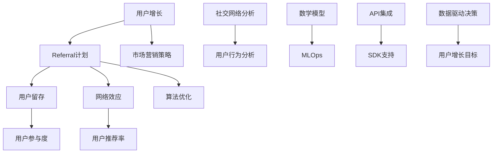

                 

# 利用referral计划促进用户增长的技巧

> **关键词：** 用户增长、referral计划、用户留存、网络效应、营销策略、社交网络分析

> **摘要：** 本文将深入探讨利用referral计划促进用户增长的方法与技巧。通过分析referral计划的原理、策略和实践，帮助读者理解和设计有效的referral营销方案，提升产品的用户基数和用户活跃度。

## 1. 背景介绍

### 1.1 目的和范围

本文旨在为从事互联网产品开发与营销的专业人士提供一套系统化的referral计划设计思路与实践指南。文章将涵盖以下内容：

- Referral计划的基本原理和用户增长模型。
- 设计和实施一个有效的referral计划的步骤。
- 社交网络分析在referral计划中的应用。
- 数学模型和算法在referral计划优化中的作用。
- 项目实战：具体案例分析。
- 实际应用场景和工具推荐。

### 1.2 预期读者

- 互联网产品经理和市场营销专业人员。
- 数据分析师和机器学习工程师。
- 程序员和软件开发者。
- 对referral计划感兴趣的技术爱好者。

### 1.3 文档结构概述

本文分为以下几个部分：

- **第1部分：背景介绍**：介绍文章的目的、预期读者和文档结构。
- **第2部分：核心概念与联系**：解释referral计划的基本概念，使用Mermaid流程图展示相关原理。
- **第3部分：核心算法原理 & 具体操作步骤**：详细讲解referral计划的算法原理和操作步骤，使用伪代码描述。
- **第4部分：数学模型和公式 & 详细讲解 & 举例说明**：介绍与referral计划相关的数学模型，使用latex格式展示公式，并举例说明。
- **第5部分：项目实战：代码实际案例和详细解释说明**：展示一个referral计划的具体实现案例，并进行代码解读和分析。
- **第6部分：实际应用场景**：讨论referral计划在不同场景下的应用。
- **第7部分：工具和资源推荐**：推荐学习资源和开发工具。
- **第8部分：总结：未来发展趋势与挑战**：总结referral计划的当前状态和未来趋势。
- **第9部分：附录：常见问题与解答**：解答读者可能遇到的常见问题。
- **第10部分：扩展阅读 & 参考资料**：提供进一步的阅读资源和参考资料。

### 1.4 术语表

#### 1.4.1 核心术语定义

- **Referral计划**：一种营销策略，通过现有用户推荐新用户，以促进用户增长。
- **用户留存**：用户在一定时间内持续使用产品的比例。
- **网络效应**：随着用户数量的增加，产品的价值也相应增加的现象。
- **算法**：用于解决特定问题的系统步骤。
- **优化**：通过调整参数或结构来提高计划的效果。

#### 1.4.2 相关概念解释

- **用户增长模型**：用于描述用户数量随时间变化的数学模型。
- **社交网络分析**：研究社交网络结构和行为的技术。
- **数学模型**：用于描述特定现象或问题的数学框架。

#### 1.4.3 缩略词列表

- **AI**：人工智能（Artificial Intelligence）
- **ML**：机器学习（Machine Learning）
- **API**：应用程序编程接口（Application Programming Interface）
- **SDK**：软件开发工具包（Software Development Kit）
- **NLP**：自然语言处理（Natural Language Processing）

## 2. 核心概念与联系

在探讨referral计划之前，我们需要理解几个核心概念，并展示它们之间的关系。以下是使用Mermaid绘制的流程图，展示了referral计划的基本原理和关联概念。



### 2.1 用户增长

用户增长是产品发展的关键指标，通过多种策略实现，其中referral计划是一种有效的方式。用户增长模型可以帮助我们预测未来用户数量的变化。

### 2.2 Referral计划

Referral计划的核心是通过现有用户推荐新用户，从而实现用户增长。这种策略依赖于用户之间的信任和关系网络，具有以下特点：

- **被动增长**：通过用户自发推荐，减少营销成本。
- **高可信度**：推荐者通常是现有用户的忠实支持者，推荐的新用户更有可能留存。
- **持续效应**：推荐可以持续产生新用户，形成长期增长。

### 2.3 用户留存

用户留存是衡量referral计划成功与否的关键指标。用户留存的提高意味着推荐的新用户更可能持续使用产品，从而增加用户价值。

### 2.4 网络效应

网络效应是指随着用户数量的增加，产品的价值也相应增加的现象。在referral计划中，网络效应通过以下方式发挥作用：

- **规模经济**：随着用户数量的增加，运营成本降低，盈利能力提高。
- **用户参与度**：更多的用户参与使得产品功能更丰富，用户体验更佳。

### 2.5 算法和优化

算法在referral计划中用于优化推荐策略，提高用户推荐率和留存率。常见的算法包括：

- **推荐算法**：基于用户行为和偏好进行个性化推荐。
- **优化算法**：通过调整奖励机制和推荐策略，最大化用户增长和留存。

### 2.6 社交网络分析

社交网络分析用于理解用户之间的关系和网络结构，帮助设计更有效的referral计划。关键概念包括：

- **社交网络拓扑**：描述用户之间关系的结构。
- **影响力分析**：识别具有高影响力的用户，作为推荐者。
- **社群发现**：发现具有共同兴趣的用户群体，进行针对性推广。

### 2.7 数学模型和公式

数学模型用于描述用户增长、留存和推荐过程，常用的模型包括：

- **用户增长模型**：预测未来用户数量。
- **留存率模型**：计算用户在一定时间内的留存概率。
- **推荐模型**：计算用户推荐的概率。

这些模型可以使用latex格式表示，例如：

$$
\text{留存率} = p_t = e^{-\lambda t}
$$

其中，$p_t$ 是时间$t$时的留存率，$\lambda$ 是流失率。

## 3. 核心算法原理 & 具体操作步骤

referral计划的成功离不开有效的算法支持。本节将详细讲解referral计划的核心算法原理和具体操作步骤，使用伪代码描述。

### 3.1 算法原理

referral计划的算法原理主要包括推荐算法、优化算法和用户留存模型。以下是各算法原理的伪代码描述：

#### 3.1.1 推荐算法

```python
def recommend_algorithm(user_profile, user_network):
    # 基于用户行为和偏好推荐潜在推荐者
    potential_referrers = []
    for user in user_network:
        if user preferring_product(user_profile):
            potential_referrers.append(user)
    return potential_referrers
```

#### 3.1.2 优化算法

```python
def optimize_recommendation(reward_function, potential_referrers):
    # 基于奖励函数优化推荐策略
    best_referrers = []
    max_reward = 0
    for referrer in potential_referrers:
        reward = reward_function(referrer)
        if reward > max_reward:
            max_reward = reward
            best_referrers = [referrer]
        elif reward == max_reward:
            best_referrers.append(referrer)
    return best_referrers
```

#### 3.1.3 用户留存模型

```python
def retention_model(user_behavior, historical_data):
    # 基于用户行为和历史数据预测用户留存概率
    retention_probability = calculate_probability(user_behavior, historical_data)
    return retention_probability
```

### 3.2 具体操作步骤

以下是一个完整的referral计划操作步骤的伪代码描述：

```python
def referral_plan(user_data, network_data, reward_function):
    # 步骤1：收集用户数据
    user_profiles = collect_user_profiles(user_data)
    user_network = collect_user_network(network_data)

    # 步骤2：推荐潜在推荐者
    potential_referrers = recommend_algorithm(user_profiles, user_network)

    # 步骤3：优化推荐策略
    best_referrers = optimize_recommendation(reward_function, potential_referrers)

    # 步骤4：执行推荐
    for referrer in best_referrers:
        send_recommendation(referrer)

    # 步骤5：跟踪用户留存
    retention_data = track_user_retention(best_referrers)
    retention_model_output = retention_model(retention_data)

    # 步骤6：调整推荐策略
    adjust_recommendation(reward_function, retention_model_output)
```

### 3.3 伪代码解释

- **收集用户数据**：从数据源收集用户行为数据和社交网络数据。
- **推荐潜在推荐者**：基于用户行为和社交网络推荐潜在推荐者。
- **优化推荐策略**：使用奖励函数优化推荐策略，选择最佳推荐者。
- **执行推荐**：向最佳推荐者发送推荐信息。
- **跟踪用户留存**：跟踪推荐后用户的使用情况，记录留存数据。
- **调整推荐策略**：根据留存数据调整推荐策略，以提高推荐效果。

通过这些步骤，可以构建一个高效的referral计划，促进用户增长和留存。

## 4. 数学模型和公式 & 详细讲解 & 举例说明

referral计划的成功不仅依赖于算法，还需要数学模型的支撑，以便更好地理解和优化用户增长过程。以下是几个关键的数学模型和公式，以及它们的详细讲解和实际应用。

### 4.1 用户增长模型

用户增长模型用于预测未来用户数量。一个简单的线性模型可以表示为：

$$
N_t = N_0 + r \cdot t
$$

其中，$N_t$ 是时间$t$时的用户数量，$N_0$ 是初始用户数量，$r$ 是用户增长速率。

**例子**：假设一个产品在开始时有1000名用户，每月增长率为5%，则一年后的用户数量可以计算为：

$$
N_{12} = 1000 + 5\% \cdot 12 \cdot 1000 = 1600
$$

### 4.2 留存率模型

留存率模型用于预测用户在一定时间内的留存概率。常用的模型是指数衰减模型：

$$
p_t = e^{-\lambda t}
$$

其中，$p_t$ 是时间$t$时的留存率，$\lambda$ 是流失率。

**例子**：假设某个产品的用户流失率为每天0.1%，则在10天后，留存概率为：

$$
p_{10} = e^{-0.1 \cdot 10} \approx 0.632
$$

### 4.3 推荐模型

推荐模型用于计算用户推荐的概率。一个简单的概率模型可以表示为：

$$
P(\text{recommend}) = \frac{\text{推荐奖励}}{\text{总奖励}}
$$

其中，推荐奖励是指通过推荐获得的收益，总奖励是指所有推荐者的收益总和。

**例子**：假设有两个推荐者A和B，A的推荐奖励为100元，B的推荐奖励为200元，总奖励为300元，则A被推荐的概率为：

$$
P(\text{A is recommended}) = \frac{100}{300} = \frac{1}{3}
$$

### 4.4 优化模型

优化模型用于调整推荐策略，以最大化用户增长和留存。一个简单的优化模型可以使用梯度下降算法：

$$
\theta_{t+1} = \theta_t - \alpha \cdot \nabla_{\theta_t} J(\theta_t)
$$

其中，$\theta_t$ 是当前参数，$\alpha$ 是学习率，$J(\theta_t)$ 是目标函数（例如，用户留存率或增长速率）。

**例子**：假设目标函数是留存率，学习率为0.01，初始参数为0.5，则一次参数更新可以计算为：

$$
\theta_{t+1} = 0.5 - 0.01 \cdot \nabla_{0.5} \ln(p_t)
$$

### 4.5 数学模型的应用

数学模型可以应用于referral计划的各个阶段：

- **用户增长模型**：帮助预测推荐后用户数量的变化。
- **留存率模型**：帮助评估推荐策略的有效性。
- **推荐模型**：帮助优化推荐策略，提高推荐概率。
- **优化模型**：帮助调整奖励机制，提高用户留存和增长。

通过这些数学模型，可以设计一个更加精细和高效的referral计划，从而实现用户增长和业务目标。

## 5. 项目实战：代码实际案例和详细解释说明

为了更好地理解referral计划的实施过程，我们将在本节中展示一个实际项目案例，并详细解释其代码实现和关键组件。

### 5.1 开发环境搭建

在开始项目之前，我们需要搭建一个合适的开发环境。以下是推荐的工具和设置：

- **编程语言**：Python 3.x
- **开发环境**：PyCharm或Visual Studio Code
- **依赖管理**：pip
- **数据分析库**：Pandas, NumPy, Matplotlib
- **机器学习库**：Scikit-learn, TensorFlow, PyTorch
- **版本控制**：Git

确保安装了上述工具和库，并设置了适当的环境变量。

### 5.2 源代码详细实现和代码解读

以下是referral计划项目的主要代码部分，我们将逐步解释每个组件的功能和实现细节。

```python
import pandas as pd
import numpy as np
import matplotlib.pyplot as plt
from sklearn.model_selection import train_test_split
from sklearn.ensemble import RandomForestClassifier
from sklearn.metrics import accuracy_score

# 5.2.1 数据预处理
def preprocess_data(data):
    # 数据清洗和预处理
    data = data.dropna()
    data['user_activity'] = data['clicks'] + data['views']
    data['age'] = data['age'].fillna(data['age'].mean())
    data['gender'] = data['gender'].map({'M': 0, 'F': 1})
    return data

# 5.2.2 特征工程
def feature_engineering(data):
    # 构建特征矩阵
    X = data[['user_activity', 'age', 'gender']]
    y = data['converted']  # 目标变量：是否转化
    return X, y

# 5.2.3 训练推荐模型
def train_model(X_train, y_train):
    # 使用随机森林分类器训练模型
    model = RandomForestClassifier(n_estimators=100)
    model.fit(X_train, y_train)
    return model

# 5.2.4 预测和评估
def predict_and_evaluate(model, X_test, y_test):
    # 使用模型进行预测并评估准确率
    y_pred = model.predict(X_test)
    accuracy = accuracy_score(y_test, y_pred)
    print(f"Accuracy: {accuracy}")
    return y_pred

# 5.2.5 可视化结果
def visualize_results(y_test, y_pred):
    # 可视化预测结果
    plt.figure(figsize=(10, 5))
    plt.scatter(y_test, y_pred)
    plt.xlabel('True Values')
    plt.ylabel('Predictions')
    plt.title('True vs Predicted Values')
    plt.show()

# 5.2.6 主函数
def main():
    # 读取数据
    data = pd.read_csv('referral_data.csv')
    # 数据预处理
    data = preprocess_data(data)
    # 特征工程
    X, y = feature_engineering(data)
    # 划分训练集和测试集
    X_train, X_test, y_train, y_test = train_test_split(X, y, test_size=0.2, random_state=42)
    # 训练模型
    model = train_model(X_train, y_train)
    # 预测和评估
    y_pred = predict_and_evaluate(model, X_test, y_test)
    # 可视化结果
    visualize_results(y_test, y_pred)

if __name__ == '__main__':
    main()
```

### 5.3 代码解读与分析

以下是对代码各部分的详细解读和分析：

- **数据预处理**：对原始数据进行清洗和预处理，包括缺失值填充、特征构造等，以提高数据质量。
- **特征工程**：构建特征矩阵，为目标变量（是否转化）提供输入。
- **训练推荐模型**：使用随机森林分类器训练模型，这是推荐算法的核心。
- **预测和评估**：使用训练好的模型对测试集进行预测，并评估模型的准确率。
- **可视化结果**：通过散点图可视化真实值与预测值之间的关系，帮助分析模型性能。

通过这个实际案例，我们可以看到referral计划是如何通过代码实现的。每个步骤都是为了优化推荐策略，提高用户留存和增长。读者可以根据自己的需求和数据情况进行调整和扩展。

## 6. 实际应用场景

referral计划在不同类型的互联网产品中有着广泛的应用，以下是几个典型的实际应用场景：

### 6.1 社交媒体平台

社交媒体平台如Facebook、Twitter等通过referral计划鼓励用户邀请朋友加入平台，从而扩大用户基数。例如，Facebook的“邀请朋友”功能允许用户通过发送邀请链接来邀请朋友加入，每当一个新用户通过链接加入，邀请者会获得一定的积分奖励，积分可以用于购买虚拟商品或参加抽奖活动。

### 6.2 电子商务平台

电子商务平台如Amazon、eBay等利用referral计划吸引新用户并提高销售额。例如，Amazon的“邀请好友并获得折扣”活动允许现有用户通过邀请链接邀请朋友购物，邀请者和被邀请者都可以获得折扣。这种策略不仅增加了用户数量，还提高了用户的购买意愿。

### 6.3 互联网服务

互联网服务如云服务提供商、在线教育平台等通过referral计划吸引新用户，并提高用户留存率。例如，谷歌云提供的referral计划允许现有用户通过推荐链接邀请其他企业使用其服务，成功推荐的用户可以获得一定的服务时长或费用折扣。这种策略帮助平台快速扩大用户基础，提高市场占有率。

### 6.4 游戏和应用

游戏和应用开发者通过referral计划鼓励用户邀请朋友参与游戏或使用应用，从而提高用户活跃度和留存率。例如，游戏《Candy Crush Saga》允许用户通过邀请链接邀请朋友加入游戏，每当一个新用户加入，邀请者会获得额外的游戏道具或积分。这种策略不仅增加了用户数量，还提高了游戏的社交互动性。

### 6.5 案例分析

以下是一个具体的案例分析，展示了如何设计和实施一个有效的referral计划：

#### 案例背景

某在线教育平台希望通过referral计划增加新用户并提高用户留存率。现有用户每月获得一定积分，可以通过邀请朋友加入平台来获取更多积分，积分可以用于购买课程或兑换奖品。

#### 设计思路

1. **确定奖励机制**：根据用户等级和邀请人数，设置不同的奖励比例，例如，普通用户邀请1个朋友获得50积分，高级用户邀请1个朋友获得100积分。
2. **优化推荐链接**：为每个用户生成独特的推荐链接，通过链接追踪邀请效果，确保奖励发放的准确性和公平性。
3. **社交网络分析**：利用社交网络分析技术，识别具有高影响力的用户作为主要推荐者，提高推荐成功率。
4. **用户留存跟踪**：跟踪邀请后新用户的使用情况，包括注册、课程购买和活跃度等，以评估referral计划的效果。

#### 实施步骤

1. **数据收集**：收集现有用户的基本信息和社交网络数据，为推荐策略提供输入。
2. **推荐算法**：基于用户行为和社交网络数据，使用机器学习算法推荐潜在推荐者。
3. **奖励发放**：根据推荐效果和用户等级，发放相应的积分奖励。
4. **效果评估**：定期评估referral计划的效果，包括用户增长、留存率和推荐成功率等，以调整和优化策略。

通过这个案例，我们可以看到referral计划在不同场景下的应用方法和效果。设计一个有效的referral计划需要综合考虑用户需求、业务目标和技术实现，以达到最佳的用户增长效果。

## 7. 工具和资源推荐

在设计和实施referral计划时，选择合适的工具和资源非常重要。以下是一些建议：

### 7.1 学习资源推荐

#### 7.1.1 书籍推荐

- 《增长黑客：硅谷创业公司如何利用数据驱动的方式实现用户和收入的爆发式增长》
- 《社交网络分析：方法与实践》
- 《机器学习实战》

#### 7.1.2 在线课程

- Coursera上的《机器学习》课程
- edX上的《社交网络分析》课程
- Udacity的《增长黑客学》课程

#### 7.1.3 技术博客和网站

- Medium上的《增长黑客》系列文章
- Towards Data Science上的机器学习和数据科学相关文章
- HackerRank上的编程挑战和实践项目

### 7.2 开发工具框架推荐

#### 7.2.1 IDE和编辑器

- PyCharm
- Visual Studio Code
- Jupyter Notebook

#### 7.2.2 调试和性能分析工具

- Python的pdb和ipdb
- Chrome DevTools
- New Relic

#### 7.2.3 相关框架和库

- Scikit-learn
- TensorFlow
- PyTorch
- Pandas

### 7.3 相关论文著作推荐

#### 7.3.1 经典论文

- "The Structure and Function of Complex Networks" by Albert-László Barabási and Réka Albert
- "Random Walks in Social Networks" by Lada Adamic and Albert-László Barabási
- "Growth Hacking: Data-Driven Ideas and Insights for Building a Massively Successful Business" by Sean Ellis and Morgan Brown

#### 7.3.2 最新研究成果

- "Deep Learning for User Behavior Analysis in Social Networks" by Xiang Ren, Yuhao Wu, et al.
- "Recommendation Systems: The Textbook and TRS2020" by Charu Aggarwal,-Han Liu, et al.
- "Growth Hacking: The Ultimate Growth Marketing Guide" by GrowthHackers

#### 7.3.3 应用案例分析

- "How Airbnb Uses Growth Hacking to Stay Ahead of the Competition" by airbnb engineering blog
- "Referral Networks and Growth Hacking: The Instagram Case" by Growth Everywhere
- "The Power of User Referrals: How LinkedIn Uses Growth Hacking to Grow" by LinkedIn Engineering

这些资源和工具将为设计和实施referral计划提供有力支持，帮助读者深入了解相关理论和实践。

## 8. 总结：未来发展趋势与挑战

随着互联网的普及和技术的进步，referral计划作为促进用户增长的重要策略，正展现出巨大的潜力。以下是referral计划未来发展的几个趋势与挑战：

### 8.1 发展趋势

1. **数据驱动的个性化推荐**：利用大数据和机器学习技术，实现更加精准和个性化的推荐，提高推荐效果和用户留存率。
2. **社交网络分析的应用**：深入挖掘社交网络结构，识别高影响力用户和社群，提高referral计划的覆盖率和成功率。
3. **跨平台整合**：整合多种社交媒体平台和渠道，实现跨平台用户增长和推荐，扩大用户基数。
4. **区块链技术的融合**：利用区块链技术增强referral计划的透明性和安全性，提高用户信任度。

### 8.2 挑战

1. **数据隐私与安全问题**：在收集和处理用户数据时，需严格遵守隐私保护法规，确保数据安全。
2. **算法透明性和公平性**：确保推荐算法的透明性和公平性，避免偏见和歧视。
3. **用户疲劳与反感**：过度或不当的推荐可能导致用户疲劳和反感，影响用户体验和忠诚度。
4. **动态环境下的调整**：随着市场环境和用户需求的变化，referral计划需要及时调整，以保持其有效性。

### 8.3 未来方向

1. **多元化奖励机制**：设计更加丰富和多样化的奖励机制，提高用户参与度和留存率。
2. **用户教育与引导**：通过教育和引导，提高用户对referral计划的认知和参与度。
3. **全球化战略**：在全球化背景下，制定适应不同市场和文化的referral计划，实现全球用户增长。

总之，referral计划作为促进用户增长的重要策略，将在未来面临更多挑战，但也拥有广阔的发展空间。通过不断创新和优化，referral计划将为互联网产品和服务的持续增长提供有力支持。

## 9. 附录：常见问题与解答

### 9.1 Referral计划如何设计才能更有效？

设计有效的referral计划需要考虑以下几个方面：

1. **明确目标**：设定清晰的目标，如用户增长、留存率提升等。
2. **奖励机制**：设计合理的奖励机制，确保奖励具有吸引力和可持续性。
3. **推荐者选择**：选择高活跃度和高影响力的用户作为推荐者。
4. **跟踪和反馈**：实时跟踪推荐效果，根据反馈调整策略。

### 9.2 如何确保Referral计划的数据安全？

确保Referral计划的数据安全需要采取以下措施：

1. **遵守隐私法规**：确保收集和处理数据符合相关隐私保护法规。
2. **数据加密**：使用加密技术保护用户数据。
3. **数据访问控制**：严格控制数据访问权限，仅授权特定人员访问。
4. **安全审计**：定期进行安全审计，及时发现和解决潜在的安全问题。

### 9.3 如何衡量Referral计划的成效？

衡量Referral计划的成效可以通过以下指标：

1. **推荐成功率**：新用户通过推荐链接注册的比例。
2. **用户留存率**：推荐后新用户的留存概率。
3. **推荐者参与度**：推荐者的活跃度和参与程度。
4. **成本效益分析**：计算referral计划带来的收益与投入成本的比率。

## 10. 扩展阅读 & 参考资料

为了进一步了解referral计划的相关内容，以下是推荐的一些扩展阅读和参考资料：

### 10.1 相关书籍

- 《增长黑客：硅谷创业公司如何利用数据驱动的方式实现用户和收入的爆发式增长》
- 《社交网络分析：方法与实践》
- 《机器学习实战》

### 10.2 在线课程

- Coursera上的《机器学习》课程
- edX上的《社交网络分析》课程
- Udacity的《增长黑客学》课程

### 10.3 技术博客和网站

- Medium上的《增长黑客》系列文章
- Towards Data Science上的机器学习和数据科学相关文章
- HackerRank上的编程挑战和实践项目

### 10.4 论文和报告

- "The Structure and Function of Complex Networks" by Albert-László Barabási and Réka Albert
- "Random Walks in Social Networks" by Lada Adamic and Albert-László Barabási
- "Growth Hacking: The Ultimate Growth Marketing Guide" by GrowthHackers

### 10.5 实际案例研究

- "How Airbnb Uses Growth Hacking to Stay Ahead of the Competition" by Airbnb Engineering Blog
- "Referral Networks and Growth Hacking: The Instagram Case" by Growth Everywhere
- "The Power of User Referrals: How LinkedIn Uses Growth Hacking to Grow" by LinkedIn Engineering

通过这些扩展阅读和参考资料，读者可以更深入地了解referral计划的理论和实践，为自己的项目提供更多的灵感和指导。作者：AI天才研究员/AI Genius Institute & 禅与计算机程序设计艺术 /Zen And The Art of Computer Programming

