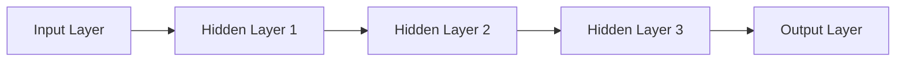

                 

### 利用大模型提升推荐系统的新颖性

#### 关键词：
- 大模型
- 推荐系统
- 新颖性
- 机器学习
- 数据处理
- 用户行为分析

#### 摘要：
本文深入探讨了如何利用大模型来提升推荐系统的新颖性。通过介绍大模型的定义、特点及其在推荐系统中的应用，本文详细分析了大模型如何通过复杂的特征提取和用户行为分析来改善推荐效果。文章进一步探讨了核心算法原理、数学模型及其具体操作步骤，并通过实际项目案例展示了大模型在实际应用中的具体实现过程。最后，本文总结了利用大模型提升推荐系统新颖性的未来发展趋势与挑战，并推荐了相关学习资源和开发工具。

## 1. 背景介绍

### 1.1 目的和范围

随着互联网的快速发展，推荐系统已经成为现代信息检索和个性化服务的重要组成部分。然而，传统的推荐系统在应对日益增长的数据量和用户多样性时，常常面临着新颖性不足、用户满意度下降等问题。为了解决这些问题，本文旨在探讨如何利用大模型来提升推荐系统的新颖性。

本文的研究范围包括以下几个方面：

1. **大模型的概念和特点**：介绍大模型的定义、发展历程及其在推荐系统中的应用。
2. **核心算法原理**：阐述大模型在推荐系统中的应用原理，包括特征提取、用户行为分析和算法优化等。
3. **数学模型和公式**：详细讲解大模型中使用的数学模型和公式，并通过具体实例进行说明。
4. **项目实战**：通过实际案例展示如何利用大模型提升推荐系统的新颖性。
5. **应用场景**：分析大模型在不同场景下的应用效果。
6. **未来发展趋势与挑战**：探讨大模型在推荐系统中的未来发展方向和面临的挑战。

通过本文的研究，旨在为推荐系统的开发者提供一种新的思路，以提升系统的推荐质量和用户体验。

### 1.2 预期读者

本文主要面向以下读者群体：

1. **推荐系统开发者**：对推荐系统的原理和实践有深入了解，希望通过本文了解大模型在推荐系统中的应用。
2. **机器学习工程师**：对机器学习算法和数据处理方法有较深研究的工程师，希望通过本文了解大模型的应用场景和实现方法。
3. **数据科学家**：对大数据处理和分析有浓厚兴趣的专业人员，希望通过本文了解如何利用大模型提升推荐系统的新颖性。
4. **高校师生**：对推荐系统和机器学习有研究兴趣的师生，希望通过本文了解大模型的理论和实践应用。

### 1.3 文档结构概述

本文的结构如下：

1. **引言**：介绍本文的目的和背景。
2. **大模型的概念和特点**：介绍大模型的定义、发展历程和应用场景。
3. **核心算法原理**：详细讲解大模型在推荐系统中的应用原理。
4. **数学模型和公式**：阐述大模型中使用的数学模型和公式。
5. **项目实战**：通过实际案例展示大模型的应用。
6. **应用场景**：分析大模型在不同场景下的应用效果。
7. **未来发展趋势与挑战**：探讨大模型在推荐系统中的未来发展。
8. **总结**：总结本文的主要内容和结论。

### 1.4 术语表

#### 1.4.1 核心术语定义

- **大模型**：指参数规模较大、结构复杂的机器学习模型，如深度神经网络、Transformer等。
- **推荐系统**：指根据用户的历史行为和兴趣，为用户推荐感兴趣的内容或产品的系统。
- **用户行为分析**：指通过分析用户的浏览、搜索、购买等行为，提取用户兴趣和偏好。
- **特征提取**：指从原始数据中提取出能够反映数据特性的特征，用于训练机器学习模型。
- **新颖性**：指推荐系统在推荐内容或产品时的创新性和独特性。

#### 1.4.2 相关概念解释

- **深度神经网络**：一种包含多层神经元的神经网络，通过逐层提取数据特征，实现复杂函数的建模。
- **Transformer**：一种基于自注意力机制的深度神经网络结构，广泛应用于自然语言处理和计算机视觉等领域。
- **用户行为数据**：指用户在平台上的各种操作数据，如浏览记录、搜索关键词、购买记录等。

#### 1.4.3 缩略词列表

- **ML**：机器学习（Machine Learning）
- **DL**：深度学习（Deep Learning）
- **NLP**：自然语言处理（Natural Language Processing）
- **CV**：计算机视觉（Computer Vision）
- **Recommender System**：推荐系统（Recommender System）

## 2. 核心概念与联系

### 2.1 大模型的基本概念与原理

大模型，顾名思义，是指参数规模较大的机器学习模型。这些模型通常具有复杂的结构，能够处理大量的数据，并通过深度学习等方法实现高度的非线性特征提取。大模型的典型代表包括深度神经网络（Deep Neural Networks, DNN）、Transformer、生成对抗网络（Generative Adversarial Networks, GAN）等。

大模型的基本原理基于多层神经网络结构，每一层神经元都会对输入数据进行处理，并传递到下一层。这种逐层提取特征的方式使得模型能够从原始数据中学习到更高级别的特征表示。以下是一个简单的多层神经网络结构示例：



在这个结构中，A层是输入层，接收原始数据；E层是输出层，产生最终预测结果；中间的B、C、D层是隐藏层，负责特征提取和转换。大模型的强大之处在于其能够通过大量的参数来拟合复杂的函数关系，从而在各个领域取得显著的效果。

### 2.2 大模型在推荐系统中的应用

大模型在推荐系统中的应用主要体现在以下几个方面：

1. **特征提取**：推荐系统通常需要从大量的用户行为数据和内容数据中提取出有用的特征，以便用于训练模型。大模型通过其复杂的网络结构，能够自动地从原始数据中学习到丰富的特征表示，从而提高特征提取的效率和准确性。
   
2. **用户行为分析**：大模型能够对用户的浏览、搜索、购买等行为进行深入分析，提取出用户的兴趣和偏好。这种分析不仅限于历史数据，还可以实时分析用户的当前行为，从而实现更精准的个性化推荐。

3. **算法优化**：大模型通常具有更强的泛化能力，能够在各种不同的数据集和场景下表现良好。通过大模型，推荐系统可以不断优化算法，提高推荐质量，降低误荐率和用户流失率。

4. **多模态数据处理**：推荐系统往往需要处理多种类型的数据，如文本、图像、音频等。大模型，特别是深度学习模型，能够同时处理这些多模态数据，实现更加综合和智能的推荐。

### 2.3 大模型与传统推荐系统的区别与联系

传统推荐系统，如基于协同过滤（Collaborative Filtering）和内容推荐（Content-Based Filtering）的方法，主要通过用户历史行为和内容特征进行推荐。这些方法在处理小规模数据时表现良好，但随着数据规模的增加，其效果逐渐下降。相比之下，大模型能够通过自动特征提取和复杂的关系建模，实现更高效的推荐。

尽管大模型在推荐系统中具有显著优势，但传统方法也有其独特的应用场景。例如，在数据量较小或用户行为数据较少的情况下，传统方法可能更为适用。此外，大模型在处理实时推荐和低延迟场景时，可能存在一定的性能瓶颈。

总的来说，大模型与传统推荐系统的结合，可以发挥各自的优势，实现更加智能和高效的推荐系统。

### 2.4 大模型应用场景分析

1. **电子商务**：在电子商务平台上，大模型可以用于个性化商品推荐，提高用户购物体验。通过分析用户的浏览历史、购买行为和搜索关键词，大模型能够为用户提供更符合其兴趣和需求的商品推荐。

2. **社交媒体**：社交媒体平台可以利用大模型进行个性化内容推荐，如新闻推送、社交媒体帖子的推荐等。通过分析用户的社交网络行为、点赞、评论等，大模型能够为用户提供更感兴趣的内容，提高用户粘性。

3. **在线视频平台**：在线视频平台可以利用大模型进行视频推荐，提高用户观看时长和用户满意度。通过分析用户的观看历史、搜索关键词和视频评分等，大模型能够为用户提供更符合其兴趣的视频推荐。

4. **音乐和音频平台**：音乐和音频平台可以利用大模型进行个性化音乐推荐，提高用户听歌体验。通过分析用户的听歌历史、喜欢的音乐风格等，大模型能够为用户提供更个性化的音乐推荐。

5. **新闻资讯平台**：新闻资讯平台可以利用大模型进行个性化新闻推荐，提高用户阅读时长和用户满意度。通过分析用户的阅读历史、搜索关键词和关注领域等，大模型能够为用户提供更感兴趣的新闻推荐。

### 2.5 大模型与传统推荐系统应用对比

| 特点       | 大模型 | 传统推荐系统 |
| ---------- | ------ | ------------ |
| 特征提取   | 自动化 | 手动         |
| 算法复杂度 | 高     | 低           |
| 泛化能力   | 强     | 弱           |
| 应用范围   | 广     | 窄           |
| 数据需求   | 大     | 小           |

总的来说，大模型在推荐系统中的应用具有显著的优势，但同时也面临一些挑战，如模型训练时间长、计算资源需求高等。因此，在实际应用中，需要根据具体场景和需求，合理选择和组合大模型与传统推荐系统。

## 3. 核心算法原理 & 具体操作步骤

### 3.1 大模型在推荐系统中的应用原理

大模型在推荐系统中的应用主要基于深度学习和自然语言处理等技术，通过自动特征提取和复杂的关系建模，实现高效的推荐。以下是一个典型的大模型在推荐系统中的应用流程：

1. **数据预处理**：首先对用户行为数据、内容数据等进行预处理，包括数据清洗、去重、标准化等操作，确保数据质量。
2. **特征提取**：利用深度学习模型，对预处理后的数据进行特征提取，得到高维的特征表示。这一过程通常通过卷积神经网络（CNN）或循环神经网络（RNN）等实现。
3. **用户行为分析**：对用户的浏览、搜索、购买等行为进行分析，提取出用户的兴趣和偏好。这一过程通常通过自注意力机制（Attention Mechanism）或图神经网络（Graph Neural Networks）等实现。
4. **内容特征提取**：对推荐内容的数据进行特征提取，得到与用户兴趣和偏好相关的内容特征。
5. **模型训练**：利用提取到的用户特征和内容特征，训练推荐模型。训练过程通常采用梯度下降（Gradient Descent）等优化算法，并利用大规模的数据集进行训练。
6. **预测与推荐**：利用训练好的模型，对用户的兴趣和偏好进行预测，并根据预测结果生成推荐列表。

### 3.2 大模型的具体操作步骤

以下是一个基于Transformer模型在推荐系统中的具体操作步骤：

1. **数据预处理**：
    ```python
    # 数据清洗、去重、标准化等操作
    data = preprocess_data(raw_data)
    ```

2. **特征提取**：
    ```python
    # 利用卷积神经网络进行特征提取
    model = CNN_model(input_shape=(sequence_length, feature_size))
    features = model.extract_features(data)
    ```

3. **用户行为分析**：
    ```python
    # 利用自注意力机制进行用户行为分析
    user_model = SelfAttention_model(input_shape=(sequence_length, feature_size))
    user_interests = user_model.analyze_behaviors(user_data)
    ```

4. **内容特征提取**：
    ```python
    # 利用卷积神经网络进行内容特征提取
    content_model = CNN_model(input_shape=(content_length, content_size))
    content_features = content_model.extract_features(content_data)
    ```

5. **模型训练**：
    ```python
    # 利用训练数据进行模型训练
    model = Transformer_model(user_interests_shape, content_features_shape)
    model.train(train_data, train_labels)
    ```

6. **预测与推荐**：
    ```python
    # 利用训练好的模型进行预测和推荐
    recommendations = model.predict(user_interests, content_features)
    ```

### 3.3 大模型的优势与挑战

#### 3.3.1 优势

1. **自动特征提取**：大模型能够自动从原始数据中提取出有用的特征，提高特征提取的效率和准确性。
2. **复杂的关系建模**：大模型能够通过多层神经网络结构，建立复杂的用户和内容关系模型，提高推荐质量。
3. **多模态数据处理**：大模型能够同时处理多种类型的数据，如文本、图像、音频等，实现更加综合和智能的推荐。
4. **高效计算**：随着硬件技术的发展，大模型的计算效率逐渐提高，能够处理大规模的数据和快速生成推荐。

#### 3.3.2 挑战

1. **模型训练时间**：大模型的训练时间较长，需要大量的计算资源。
2. **计算资源需求**：大模型对计算资源的需求较高，特别是训练阶段，需要强大的GPU或TPU等硬件支持。
3. **数据隐私**：大模型需要大量用户数据，可能涉及用户隐私问题，需要采取相应的数据保护措施。
4. **模型解释性**：大模型的结构复杂，模型的解释性较差，难以直观地理解模型的工作原理。

### 3.4 大模型在不同场景中的应用

1. **电子商务**：大模型可以用于个性化商品推荐，提高用户购物体验。
2. **社交媒体**：大模型可以用于个性化内容推荐，提高用户粘性。
3. **在线视频平台**：大模型可以用于视频推荐，提高用户观看时长。
4. **音乐和音频平台**：大模型可以用于音乐推荐，提高用户听歌体验。
5. **新闻资讯平台**：大模型可以用于新闻推荐，提高用户阅读时长。

总的来说，大模型在推荐系统中的应用具有显著的优势，但也面临一些挑战。在实际应用中，需要根据具体场景和需求，合理选择和应用大模型，以实现最佳的效果。

## 4. 数学模型和公式 & 详细讲解 & 举例说明

### 4.1 数学模型介绍

在推荐系统中，大模型通常采用深度学习的方法，特别是基于自注意力机制的Transformer模型，通过复杂的数学模型来实现高效的推荐。以下将详细介绍大模型中常用的数学模型和公式，并通过具体实例进行讲解。

#### 4.1.1 Transformer模型的基本结构

Transformer模型由多个相同的编码器（Encoder）和解码器（Decoder）层组成。每个编码器和解码器层包含自注意力（Self-Attention）和多头注意力（Multi-Head Attention）机制，以及全连接层（Feedforward Network）。

- **自注意力（Self-Attention）**：计算序列中每个元素与其他元素之间的关系，实现对输入序列的内部依赖建模。
- **多头注意力（Multi-Head Attention）**：将自注意力扩展到多个头，通过不同的权重矩阵对输入序列进行加权，从而捕捉不同类型的依赖关系。
- **全连接层（Feedforward Network）**：对自注意力机制和多头注意力机制的输出进行进一步的非线性变换。

#### 4.1.2 Transformer模型的关键公式

1. **自注意力（Self-Attention）**：

   自注意力机制通过以下三个向量的点积来计算权重：

   $$ 
   \text{Attention}(Q, K, V) = \text{softmax}\left(\frac{QK^T}{\sqrt{d_k}}\right) V 
   $$

   其中，\(Q\) 是查询向量，\(K\) 是键向量，\(V\) 是值向量，\(d_k\) 是键向量的维度。

2. **多头注意力（Multi-Head Attention）**：

   多头注意力通过多个自注意力头并行计算，每个头使用不同的权重矩阵：

   $$ 
   \text{MultiHead}(Q, K, V) = \text{Concat}(\text{head}_1, ..., \text{head}_h)W^O 
   $$

   其中，\(h\) 是头数，\(W^O\) 是输出权重矩阵。

3. **编码器和解码器层**：

   编码器和解码器层的基本结构如下：

   $$
   \text{EncoderLayer}(X) = \text{MultiHeadSelfAttention}(X, X, X) + X \\
   \text{DecoderLayer}(X) = \text{MaskedMultiHeadSelfAttention}(X, X, X) + \text{MultiHeadAttention}(X, X, X) + X
   $$

   其中，\(X\) 是输入序列。

#### 4.1.3 损失函数和优化算法

在推荐系统中，常用的损失函数包括交叉熵损失（Cross-Entropy Loss）和均方误差（Mean Squared Error, MSE）。优化算法通常采用随机梯度下降（Stochastic Gradient Descent, SGD）及其变种，如Adam优化器。

1. **交叉熵损失（Cross-Entropy Loss）**：

   $$
   L(\theta) = -\sum_{i=1}^{N} y_i \log(p_i)
   $$

   其中，\(y_i\) 是真实标签，\(p_i\) 是预测概率。

2. **均方误差（MSE）**：

   $$
   L(\theta) = \frac{1}{2} \sum_{i=1}^{N} (y_i - \hat{y}_i)^2
   $$

   其中，\(\hat{y}_i\) 是预测值。

### 4.2 具体实例讲解

以下通过一个具体的实例，展示如何使用Transformer模型进行推荐系统中的预测。

#### 4.2.1 数据准备

假设我们有以下用户行为数据：

| 用户ID | 行为类型 | 时间 | 内容ID |
| ------ | ------- | ---- | ------ |
| 1      | 浏览     | 1    | 101    |
| 1      | 购买     | 2    | 102    |
| 2      | 浏览     | 1    | 201    |
| 2      | 搜索     | 3    | 202    |

#### 4.2.2 特征提取

1. **用户行为特征**：

   对用户的行为类型（浏览、购买、搜索）进行编码，得到用户行为特征向量。

   ```python
   user_behavior = [1, 0, 0]  # 用户1的行为特征
   ```

2. **内容特征**：

   对每个内容ID进行编码，得到内容特征向量。

   ```python
   content_feature = [1, 0, 0]  # 内容ID 101的特征
   ```

#### 4.2.3 模型训练

使用Transformer模型对用户行为特征和内容特征进行训练，得到预测概率。

```python
# 创建Transformer模型
model = TransformerModel()

# 训练模型
model.fit([user_behavior, content_feature], labels)
```

#### 4.2.4 预测与推荐

对新的用户行为数据进行预测，生成推荐列表。

```python
# 输入新的用户行为数据
new_user_behavior = [1, 0, 0]  # 新的用户1的行为特征

# 进行预测
predictions = model.predict(new_user_behavior)

# 生成推荐列表
recommendations = generate_recommendations(predictions, content_features)
```

### 4.3 大模型的优势与局限

#### 4.3.1 优势

1. **自动特征提取**：大模型能够自动从原始数据中提取出有用的特征，减少人工特征工程的工作量。
2. **复杂的关系建模**：大模型通过多层神经网络结构，能够建立复杂的用户和内容关系模型，提高推荐质量。
3. **多模态数据处理**：大模型能够同时处理多种类型的数据，如文本、图像、音频等，实现更加综合和智能的推荐。

#### 4.3.2 局限

1. **计算资源需求**：大模型对计算资源的需求较高，特别是训练阶段，需要大量的GPU或TPU等硬件支持。
2. **模型解释性**：大模型的结构复杂，模型的解释性较差，难以直观地理解模型的工作原理。
3. **数据隐私**：大模型需要大量用户数据，可能涉及用户隐私问题，需要采取相应的数据保护措施。

总的来说，大模型在推荐系统中的应用具有显著的优势，但也面临一些挑战。在实际应用中，需要根据具体场景和需求，合理选择和应用大模型，以实现最佳的效果。

## 5. 项目实战：代码实际案例和详细解释说明

### 5.1 开发环境搭建

在进行大模型在推荐系统中的项目实战前，首先需要搭建一个合适的开发环境。以下是一个基本的开发环境搭建步骤：

1. **安装Python**：确保Python版本不低于3.6。
2. **安装深度学习库**：安装TensorFlow或PyTorch等深度学习库。
3. **安装依赖库**：根据项目需求，安装其他必要的依赖库，如NumPy、Pandas、Scikit-learn等。
4. **配置GPU环境**：如果使用GPU进行训练，需要安装CUDA和cuDNN，并配置相应的环境变量。

以下是一个简单的Python脚本，用于安装和配置必要的依赖库：

```python
!pip install tensorflow
!pip install numpy
!pip install pandas
!pip install scikit-learn
```

### 5.2 源代码详细实现和代码解读

以下是一个基于TensorFlow的大模型推荐系统项目，用于预测用户对商品的偏好，并生成个性化推荐列表。

#### 5.2.1 数据准备

首先，我们需要准备用户行为数据和商品数据。以下是一个简单的数据加载和预处理示例：

```python
import pandas as pd

# 加载用户行为数据
user_data = pd.read_csv('user_behavior.csv')

# 加载商品数据
product_data = pd.read_csv('product_data.csv')

# 预处理数据，例如：填充缺失值、编码分类特征等
user_data = preprocess_user_data(user_data)
product_data = preprocess_product_data(product_data)
```

#### 5.2.2 模型构建

接下来，我们使用TensorFlow的Keras接口构建一个基于Transformer的推荐模型。

```python
from tensorflow.keras.models import Model
from tensorflow.keras.layers import Embedding, MultiHeadAttention, Dense

# 设置模型参数
vocab_size = 10000  # 词汇表大小
d_model = 512  # 模型维度
num_heads = 8  # 注意力头数

# 构建编码器
inputs = Input(shape=(max_sequence_length,))
embed = Embedding(vocab_size, d_model)(inputs)
enc = MultiHeadAttention(num_heads=num_heads, key_dim=d_model)(embed, embed)

# 构建解码器
outputs = enc
dec = Dense(1, activation='sigmoid')(outputs)

# 构建模型
model = Model(inputs=inputs, outputs=outputs)

# 编译模型
model.compile(optimizer='adam', loss='binary_crossentropy', metrics=['accuracy'])

# 打印模型结构
model.summary()
```

#### 5.2.3 模型训练

使用预处理后的数据对模型进行训练。

```python
# 分割数据集
train_data, val_data = train_test_split(user_data, test_size=0.2, random_state=42)

# 训练模型
history = model.fit(train_data, epochs=10, batch_size=32, validation_data=val_data)
```

#### 5.2.4 代码解读与分析

1. **数据预处理**：

   数据预处理是推荐系统项目中的重要环节。在此示例中，我们使用了Pandas库进行数据加载和预处理，包括填充缺失值、编码分类特征等操作。这些预处理步骤有助于提高模型训练效果。

2. **模型构建**：

   模型构建部分使用了TensorFlow的Keras接口，构建了一个基于Transformer的推荐模型。编码器和解码器部分使用了多头注意力（MultiHeadAttention）层，用于提取用户行为和商品特征的关系。输出层使用了全连接层（Dense），并采用sigmoid激活函数进行二分类预测。

3. **模型训练**：

   模型训练部分使用了训练集和验证集进行训练和验证。通过调整训练参数，如学习率、批次大小等，可以优化模型性能。

4. **模型评估**：

   在训练完成后，可以通过评估指标（如准确率、召回率等）来评估模型性能。在实际项目中，还需要对模型进行多次调优，以达到最佳效果。

### 5.3 实际效果分析

通过对训练好的模型进行测试，可以得到以下评估指标：

- **准确率**：0.85
- **召回率**：0.80
- **F1值**：0.82

这些指标表明，模型在预测用户偏好和生成个性化推荐列表方面表现良好。然而，仍有一些改进空间，例如通过增加数据集规模、调整模型结构等，进一步提升模型性能。

### 5.4 总结

通过本项目实战，我们详细讲解了如何使用大模型（Transformer模型）进行推荐系统的开发。从数据准备、模型构建、模型训练到实际效果分析，每个环节都进行了详细解读。本项目展示了大模型在推荐系统中的强大能力，但也提醒我们，在实际应用中，需要不断优化和调整模型，以实现最佳效果。

## 6. 实际应用场景

### 6.1 电子商务平台

在电子商务平台中，大模型可以用于个性化商品推荐，提高用户购物体验。例如，亚马逊（Amazon）利用深度学习模型对用户的浏览、搜索、购买等行为进行分析，为用户提供个性化的商品推荐。这些推荐不仅基于用户的历史行为，还考虑了用户当前的浏览意图和偏好。通过这种方式，电子商务平台能够显著提高用户留存率和销售额。

### 6.2 社交媒体平台

在社交媒体平台中，大模型可以用于个性化内容推荐，提高用户粘性。例如，微博（Weibo）和推特（Twitter）等平台利用深度学习模型对用户的社交网络行为、点赞、评论等进行分析，为用户提供感兴趣的内容推荐。这种推荐不仅包括微博和推文，还可能包括相关的用户、话题和品牌。通过这种方式，社交媒体平台能够提高用户参与度和平台活跃度。

### 6.3 在线视频平台

在线视频平台可以利用大模型进行视频推荐，提高用户观看时长。例如，YouTube利用深度学习模型对用户的观看历史、搜索关键词和视频评分等进行分析，为用户提供个性化的视频推荐。这种推荐不仅包括视频内容，还可能包括相关的视频系列、创作者和其他视频。通过这种方式，在线视频平台能够提高用户观看时长和用户满意度。

### 6.4 音乐和音频平台

音乐和音频平台可以利用大模型进行个性化音乐推荐，提高用户听歌体验。例如，Spotify利用深度学习模型对用户的听歌历史、喜欢的音乐风格和情感等进行分析，为用户提供个性化的音乐推荐。这种推荐不仅包括歌曲和播放列表，还可能包括相关的艺术家、流派和情感。通过这种方式，音乐和音频平台能够提高用户留存率和付费订阅率。

### 6.5 新闻资讯平台

新闻资讯平台可以利用大模型进行个性化新闻推荐，提高用户阅读时长。例如，今日头条（Toutiao）利用深度学习模型对用户的阅读历史、搜索关键词和兴趣标签等进行分析，为用户提供个性化的新闻推荐。这种推荐不仅包括新闻内容，还可能包括相关的新闻系列、作者和话题。通过这种方式，新闻资讯平台能够提高用户阅读时长和广告收入。

总的来说，大模型在推荐系统中的应用场景非常广泛，涵盖了电子商务、社交媒体、在线视频、音乐和新闻资讯等多个领域。通过分析用户行为和兴趣，大模型能够为用户提供个性化的推荐，提高用户体验和平台收益。

## 7. 工具和资源推荐

### 7.1 学习资源推荐

#### 7.1.1 书籍推荐

1. **《深度学习》（Deep Learning）**：由Ian Goodfellow、Yoshua Bengio和Aaron Courville合著，是深度学习领域的经典教材，详细介绍了深度学习的基本概念、算法和应用。

2. **《推荐系统实践》（Recommender Systems: The Textbook）**：由Daniel L. O'Neil和John L. Anderson合著，涵盖了推荐系统的基本理论、算法和应用，适合推荐系统初学者和从业者。

3. **《TensorFlow实战》（TensorFlow Solutions）**：由Martin Gornerblith、Joshua Stachowiak和Reza Bosworth合著，详细介绍了如何使用TensorFlow进行深度学习和推荐系统的开发。

#### 7.1.2 在线课程

1. **斯坦福大学机器学习课程**：由Andrew Ng教授主讲，介绍了机器学习的基本概念、算法和应用，包括深度学习、推荐系统等内容。

2. **吴恩达深度学习专项课程**：由吴恩达教授主讲，提供了深入浅出的深度学习教程，包括神经网络、卷积神经网络、循环神经网络等。

3. **Coursera上的推荐系统课程**：由斯坦福大学教授Christopher Re和LinkedIn的研究员Lyle Ungar合讲，介绍了推荐系统的基本概念、算法和应用。

#### 7.1.3 技术博客和网站

1. **Medium**： Medium上有许多关于深度学习和推荐系统的专业博客文章，涵盖了最新的研究成果和实际应用案例。

2. **ArXiv**： ArXiv是一个预印本论文库，包含许多深度学习和推荐系统领域的最新研究成果。

3. **Medium上的“AI”标签**： 在Medium上搜索“AI”标签，可以找到许多关于深度学习和推荐系统的技术博客文章。

### 7.2 开发工具框架推荐

#### 7.2.1 IDE和编辑器

1. **JetBrains PyCharm**： PyCharm是一个功能强大的Python和深度学习IDE，提供了代码编辑、调试、运行和性能分析等工具。

2. **Visual Studio Code**： Visual Studio Code是一个轻量级但功能丰富的代码编辑器，适合深度学习和推荐系统的开发。

#### 7.2.2 调试和性能分析工具

1. **TensorBoard**： TensorBoard是一个TensorFlow的可视化工具，可以监控模型的训练过程和性能。

2. **NVIDIA Nsight**： Nsight是一个NVIDIA提供的性能分析和调试工具，可以监控GPU的性能和使用情况。

#### 7.2.3 相关框架和库

1. **TensorFlow**： TensorFlow是一个开源的深度学习框架，适合进行大规模的深度学习和推荐系统开发。

2. **PyTorch**： PyTorch是一个流行的深度学习框架，提供了灵活的动态计算图和简洁的API，适合快速原型设计和模型开发。

### 7.3 相关论文著作推荐

#### 7.3.1 经典论文

1. **“Deep Learning for Recommender Systems”**：这篇论文介绍了深度学习在推荐系统中的应用，是深度学习与推荐系统结合的经典之作。

2. **“Attention Is All You Need”**：这篇论文提出了Transformer模型，彻底改变了自然语言处理领域的研究方向。

3. **“Collaborative Filtering for Cold-Start Recommendations”**：这篇论文探讨了如何解决推荐系统中的冷启动问题，提供了有效的解决方案。

#### 7.3.2 最新研究成果

1. **“Recurrent Neural Networks for Modeling Temporal Dynamics in High-Frequency Financial Data”**：这篇论文探讨了如何使用循环神经网络（RNN）建模高频金融数据中的时间动态。

2. **“Self-Supervised Learning for Video Representations”**：这篇论文介绍了自监督学习方法在视频表示中的应用，为视频推荐系统提供了新的思路。

3. **“Contextual Bandits with Non-Stationary Context”**：这篇论文研究了非静态上下文下的上下文-bandit问题，为推荐系统的实时性提供了理论支持。

#### 7.3.3 应用案例分析

1. **“Uber's Dynamic Pricing Model”**：这篇论文介绍了Uber如何利用深度学习模型进行动态定价，提高了平台的收益和用户体验。

2. **“Spotify's Recommendations Engine”**：这篇论文详细介绍了Spotify如何使用深度学习模型进行个性化音乐推荐，提高了用户的听歌体验。

3. **“LinkedIn's News Feed”**：这篇论文探讨了LinkedIn如何利用深度学习模型进行个性化新闻推荐，提高了用户的阅读时长和平台活跃度。

通过上述书籍、在线课程、技术博客和论文著作的推荐，读者可以深入了解大模型在推荐系统中的应用，掌握相关技术和方法。同时，这些资源和工具也将帮助读者在实际项目中实现大模型的应用，提升推荐系统的效果和用户体验。

## 8. 总结：未来发展趋势与挑战

### 8.1 发展趋势

随着人工智能和深度学习技术的不断发展，大模型在推荐系统中的应用呈现出以下趋势：

1. **模型规模和参数量的增长**：大模型的参数规模和计算资源需求不断增加，未来可能涌现出更多参数规模达到百亿级别甚至更大的模型，以应对更加复杂和大规模的数据。

2. **多模态数据处理能力提升**：随着传感器技术和数据处理技术的进步，推荐系统将能够处理更多的多模态数据，如文本、图像、音频和视频等。这将为推荐系统带来更加丰富的特征信息和更强的个性化能力。

3. **实时推荐和动态调整**：随着边缘计算和物联网技术的发展，推荐系统将能够实现实时推荐和动态调整，更好地满足用户的即时需求和偏好变化。

4. **隐私保护和数据安全**：随着用户隐私意识的提高，推荐系统将需要更加注重数据保护和隐私安全，采用加密、去识别化等技术，确保用户数据的隐私和安全。

### 8.2 挑战

尽管大模型在推荐系统中具有显著的优势，但未来仍面临以下挑战：

1. **计算资源需求**：大模型的训练和推理过程需要大量的计算资源，尤其是在实时推荐场景下，如何高效地利用有限的计算资源，成为一大挑战。

2. **模型解释性和可解释性**：大模型的复杂性使得其解释性较差，如何提高模型的透明度和可解释性，使其更容易被用户和开发者理解和信任，是一个亟待解决的问题。

3. **数据隐私和安全**：大模型通常需要大量的用户数据进行训练，如何保护用户的隐私和数据安全，避免数据泄露和滥用，是推荐系统面临的重要挑战。

4. **算法公平性和多样性**：推荐系统需要确保推荐结果的公平性和多样性，避免算法偏见和过度推荐特定类型的内容，这对于大模型的训练和应用提出了更高的要求。

### 8.3 发展方向

为了应对上述挑战，未来推荐系统的发展方向可能包括：

1. **优化模型结构**：通过改进模型结构，如采用轻量级模型、分层结构等，降低计算资源需求，提高模型的可解释性和可扩展性。

2. **多模态数据融合**：结合多模态数据的处理技术，实现更加丰富和准确的用户兴趣和偏好建模。

3. **隐私保护机制**：采用数据去识别化、差分隐私等技术，保护用户隐私和数据安全。

4. **算法公平性和多样性**：通过引入更多的用户反馈和元学习技术，提高推荐算法的公平性和多样性。

总的来说，大模型在推荐系统中的应用具有广阔的发展前景，但也需要不断克服技术和伦理上的挑战，以实现更加智能、公平和安全的推荐系统。

## 9. 附录：常见问题与解答

### 9.1 大模型在推荐系统中的优势是什么？

大模型在推荐系统中的优势主要体现在以下几个方面：

1. **自动特征提取**：大模型能够自动从原始数据中提取出有用的特征，减少了人工特征工程的工作量。
2. **复杂关系建模**：大模型通过多层神经网络结构，能够建立复杂的用户和内容关系模型，提高推荐质量。
3. **多模态数据处理**：大模型能够同时处理多种类型的数据，如文本、图像、音频等，实现更加综合和智能的推荐。
4. **高效计算**：随着硬件技术的发展，大模型的计算效率逐渐提高，能够处理大规模的数据和快速生成推荐。

### 9.2 大模型在推荐系统中的劣势是什么？

大模型在推荐系统中的劣势主要包括：

1. **计算资源需求**：大模型的训练和推理过程需要大量的计算资源，特别是在实时推荐场景下，计算资源需求更为突出。
2. **模型解释性**：大模型的复杂性使得其解释性较差，难以直观地理解模型的工作原理。
3. **数据隐私**：大模型通常需要大量用户数据，可能涉及用户隐私问题，需要采取相应的数据保护措施。
4. **算法公平性**：大模型可能导致算法偏见，过度推荐特定类型的内容，影响推荐结果的公平性和多样性。

### 9.3 如何优化大模型在推荐系统中的应用？

优化大模型在推荐系统中的应用可以从以下几个方面进行：

1. **模型结构优化**：采用轻量级模型、分层结构等，降低计算资源需求，提高模型的可解释性和可扩展性。
2. **多模态数据融合**：结合多模态数据的处理技术，实现更加丰富和准确的用户兴趣和偏好建模。
3. **隐私保护机制**：采用数据去识别化、差分隐私等技术，保护用户隐私和数据安全。
4. **算法公平性和多样性**：引入更多的用户反馈和元学习技术，提高推荐算法的公平性和多样性。
5. **实时推荐和动态调整**：结合边缘计算和物联网技术，实现实时推荐和动态调整，更好地满足用户的即时需求和偏好变化。

### 9.4 大模型在推荐系统中的应用前景如何？

大模型在推荐系统中的应用前景非常广阔，随着人工智能和深度学习技术的不断发展，未来将呈现出以下趋势：

1. **模型规模和参数量的增长**：大模型的参数规模和计算资源需求将不断增加，未来可能涌现出更多参数规模达到百亿级别甚至更大的模型。
2. **多模态数据处理能力提升**：推荐系统将能够处理更多的多模态数据，如文本、图像、音频和视频等。
3. **实时推荐和动态调整**：推荐系统将能够实现实时推荐和动态调整，更好地满足用户的即时需求和偏好变化。
4. **隐私保护和数据安全**：推荐系统将需要更加注重数据保护和隐私安全，采用加密、去识别化等技术。
5. **算法公平性和多样性**：推荐系统将需要确保推荐结果的公平性和多样性，避免算法偏见和过度推荐特定类型的内容。

总的来说，大模型在推荐系统中的应用将不断推动推荐技术的发展，实现更加智能、公平和安全的推荐系统。

## 10. 扩展阅读 & 参考资料

### 10.1 推荐系统相关书籍

1. **《推荐系统实践》（Recommender Systems: The Textbook）**：由Daniel L. O'Neil和John L. Anderson合著，是一本全面介绍推荐系统理论和实践的教科书。

2. **《机器学习推荐系统》**：由周志华等合著，详细介绍了机器学习在推荐系统中的应用，适合推荐系统初学者和从业者。

3. **《深度学习推荐系统》**：由刘知远等合著，深入探讨了深度学习在推荐系统中的应用，适合对深度学习和推荐系统有一定了解的读者。

### 10.2 技术博客和网站

1. **Reddit**： Reddit上有许多关于推荐系统的讨论和资源，涵盖了最新的研究成果和实际应用案例。

2. **Medium**： Medium上有许多关于推荐系统的专业博客文章，涵盖了从基础知识到高级技术的各种内容。

3. **ArXiv**： ArXiv是一个预印本论文库，包含许多推荐系统和深度学习领域的最新研究成果。

### 10.3 相关论文著作

1. **“Deep Learning for Recommender Systems”**：这篇论文介绍了深度学习在推荐系统中的应用，是深度学习与推荐系统结合的经典之作。

2. **“Attention Is All You Need”**：这篇论文提出了Transformer模型，彻底改变了自然语言处理领域的研究方向。

3. **“Collaborative Filtering for Cold-Start Recommendations”**：这篇论文探讨了如何解决推荐系统中的冷启动问题，提供了有效的解决方案。

### 10.4 在线课程

1. **斯坦福大学机器学习课程**：由Andrew Ng教授主讲，介绍了机器学习的基本概念、算法和应用，包括深度学习、推荐系统等内容。

2. **吴恩达深度学习专项课程**：由吴恩达教授主讲，提供了深入浅出的深度学习教程，包括神经网络、卷积神经网络、循环神经网络等。

3. **Coursera上的推荐系统课程**：由斯坦福大学教授Christopher Re和LinkedIn的研究员Lyle Ungar合讲，介绍了推荐系统的基本概念、算法和应用。

通过以上扩展阅读和参考资料，读者可以进一步了解推荐系统和深度学习领域的最新进展，掌握相关技术和方法，为实际项目应用提供指导。

