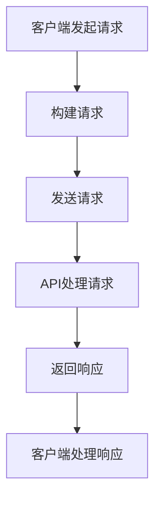

                 

### 利用开放API扩展产品功能的方法

> **关键词**：开放API、产品功能扩展、Web服务、应用程序集成、跨平台兼容性、安全性和性能优化。

> **摘要**：本文将探讨如何利用开放API（应用程序编程接口）来扩展产品的功能，详细阐述了API的概念、架构、实现步骤、数学模型、应用场景以及相关的工具和资源。通过深入的分析和实例讲解，本文旨在帮助开发者和产品经理更好地理解和应用开放API技术，提高产品的竞争力和用户体验。

本文分为以下章节：

1. **背景介绍**
   - 1.1 **目的和范围**
   - 1.2 **预期读者**
   - 1.3 **文档结构概述**
   - 1.4 **术语表**

2. **核心概念与联系**
   - **核心概念与原理**
   - **Mermaid流程图**

3. **核心算法原理 & 具体操作步骤**
   - **算法原理讲解**
   - **伪代码阐述**

4. **数学模型和公式 & 详细讲解 & 举例说明**
   - **数学模型介绍**
   - **公式和示例**

5. **项目实战：代码实际案例和详细解释说明**
   - 5.1 **开发环境搭建**
   - 5.2 **源代码详细实现和代码解读**
   - 5.3 **代码解读与分析**

6. **实际应用场景**

7. **工具和资源推荐**
   - 7.1 **学习资源推荐**
   - 7.2 **开发工具框架推荐**
   - 7.3 **相关论文著作推荐**

8. **总结：未来发展趋势与挑战**

9. **附录：常见问题与解答**

10. **扩展阅读 & 参考资料**

### 1. 背景介绍

#### 1.1 目的和范围

本文的目的是介绍开放API（Application Programming Interface）的概念、架构和实践方法，帮助读者理解如何利用开放API来扩展产品的功能。通过本文，读者可以：

- 明确开放API的定义和重要性。
- 掌握构建开放API的基本原理和步骤。
- 学习如何使用开放API实现产品功能扩展。
- 了解开放API在实际项目中的应用场景和挑战。

本文的范围主要涵盖以下几个方面：

- 开放API的基本概念和架构。
- 开放API的核心算法原理和具体操作步骤。
- 开放API的数学模型和公式。
- 开放API的实际应用场景和案例。
- 开发工具和资源的推荐。

#### 1.2 预期读者

本文主要面向以下读者群体：

- 产品经理和项目经理，希望了解如何利用开放API提升产品竞争力。
- 开发者和程序员，对开放API的实现和应用感兴趣。
- 技术爱好者，对API技术和产品集成有研究需求。
- 课程学生，需要学习开放API的相关知识。

#### 1.3 文档结构概述

本文的结构如下：

- 引言：介绍开放API的概念和重要性。
- 背景介绍：概述本文的目的、范围和预期读者。
- 核心概念与联系：介绍开放API的核心概念、架构和流程图。
- 核心算法原理 & 具体操作步骤：讲解开放API的实现原理和步骤。
- 数学模型和公式 & 详细讲解 & 举例说明：介绍开放API的数学模型和公式。
- 项目实战：通过实际案例展示开放API的应用。
- 实际应用场景：分析开放API在不同领域的应用。
- 工具和资源推荐：推荐相关工具、资源和开发框架。
- 总结：总结本文的主要内容和未来发展趋势。
- 附录：解答常见问题。
- 扩展阅读 & 参考资料：提供进一步学习的资源。

#### 1.4 术语表

在本文中，我们将使用以下术语：

- **开放API（Open API）**：一种公开提供的接口，允许外部程序访问和调用某个系统或服务的功能。
- **Web服务（Web Service）**：一种基于Web技术的分布式计算模式，通过标准化的接口进行通信和数据交换。
- **RESTful API（REST API）**：一种遵循REST（Representational State Transfer）架构风格的Web服务接口，使用HTTP协议进行通信。
- **SDK（Software Development Kit）**：一套开发工具和库，用于简化软件开发和集成。
- **跨平台兼容性（Cross-platform Compatibility）**：指软件或API能够在不同操作系统和设备上正常运行。
- **安全性（Security）**：确保API和数据在传输和存储过程中的安全性。
- **性能优化（Performance Optimization）**：通过优化算法和架构来提高API的响应速度和处理能力。

### 1.4.1 核心术语定义

在本节中，我们将详细定义本文中使用的一些核心术语，以便读者更好地理解后续内容。

#### 开放API

开放API是一种应用程序编程接口，它允许第三方应用程序通过标准化的协议（如HTTP、HTTPS等）访问和使用某个系统或服务的功能。开放API的目的是促进不同系统之间的集成和数据共享，提高开发效率和系统的可扩展性。

#### Web服务

Web服务是一种基于Web的分布式计算模式，它通过标准化的接口（如SOAP、REST等）提供服务和数据访问。Web服务通常使用HTTP协议进行通信，使得不同系统之间的数据交换变得更加简便和高效。

#### RESTful API

RESTful API是一种遵循REST（Representational State Transfer）架构风格的Web服务接口。RESTful API使用HTTP协议进行通信，通过GET、POST、PUT、DELETE等HTTP方法实现数据的增删改查操作。RESTful API具有简单、灵活、可扩展的特点，是现代Web服务开发的主流技术之一。

#### SDK

SDK（Software Development Kit）是一套开发工具和库，用于简化软件开发和集成。SDK通常包含API文档、代码示例、开发工具、库文件等，帮助开发者快速构建和部署应用程序。

#### 跨平台兼容性

跨平台兼容性是指软件或API能够在不同操作系统（如Windows、Linux、macOS等）和设备（如手机、平板、PC等）上正常运行。跨平台兼容性是现代软件开发的重要目标之一，可以提高软件的可用性和用户满意度。

#### 安全性

安全性是指确保API和数据在传输和存储过程中的安全性。安全性包括多个方面，如数据加密、身份验证、授权、访问控制等。确保安全性是开放API成功应用的关键因素。

#### 性能优化

性能优化是指通过优化算法和架构来提高API的响应速度和处理能力。性能优化包括缓存、负载均衡、并发处理、数据库优化等技术，可以提高系统的效率和用户体验。

### 1.4.2 相关概念解释

在本节中，我们将进一步解释一些与开放API相关的概念，帮助读者更好地理解开放API的架构和工作原理。

#### 接口

接口是指软件系统提供的对外服务访问点，通过接口可以调用系统内部的功能和数据。在开放API中，接口是第三方应用程序访问和调用系统功能的关键组成部分。

#### 路径（URI）

路径（Uniform Resource Identifier，URI）是接口的标识符，用于唯一确定接口的位置。在开放API中，路径通常以URL（统一资源定位符）的形式表示，如`https://api.example.com/users`。

#### HTTP方法

HTTP方法是指用于请求接口的HTTP协议方法，如GET、POST、PUT、DELETE等。不同的HTTP方法对应不同的操作类型，例如GET方法用于查询数据，POST方法用于提交数据。

#### 响应

响应是指接口处理请求后返回的结果。响应通常包含状态码、响应体、响应头等信息。状态码表示请求处理的结果，如200表示成功，404表示未找到。

#### 请求参数

请求参数是指请求消息中包含的额外信息，如查询参数、路径参数、请求体等。请求参数用于提供接口调用的必要条件，如查询用户信息的用户ID。

#### 数据格式

数据格式是指接口返回的数据的组织方式和编码方式，如JSON、XML、HTML等。数据格式决定了如何解析和显示返回的数据。

#### 身份验证和授权

身份验证和授权是确保API安全性的重要机制。身份验证用于验证请求者的身份，如用户名和密码、令牌等。授权用于确定请求者是否有权限访问特定接口或数据。

#### 跨域请求

跨域请求是指请求发起者和接口服务器的域名、协议、端口三者之一不同的情况。跨域请求通常需要使用CORS（跨源资源共享）策略来解决兼容性问题。

#### API文档

API文档是描述接口功能、用法、参数和返回值的重要文档。API文档通常以Markdown、Swagger等格式编写，方便开发者查阅和使用。

### 1.4.3 缩略词列表

在本节中，我们将列出本文中使用的缩略词及其全称，以便读者更好地理解。

- API：应用程序编程接口（Application Programming Interface）
- SDK：软件开发工具包（Software Development Kit）
- URI：统一资源标识符（Uniform Resource Identifier）
- HTTP：超文本传输协议（Hypertext Transfer Protocol）
- REST：表述性状态转移（Representational State Transfer）
- CORS：跨源资源共享（Cross-Origin Resource Sharing）
- JSON：JavaScript对象表示法（JavaScript Object Notation）
- XML：可扩展标记语言（eXtensible Markup Language）
- HTML：超文本标记语言（Hypertext Markup Language）

## 2. 核心概念与联系

在深入探讨如何利用开放API扩展产品功能之前，我们需要了解一些核心概念和它们之间的相互关系。这一部分将介绍开放API的基本原理、体系结构和与相关技术的联系。

### 核心概念与原理

#### 开放API的基本原理

开放API的核心原理是提供一组预定义的接口，使得外部程序可以与系统或服务进行交互。这种交互通常通过HTTP请求和响应进行，遵循RESTful架构风格。RESTful API的设计原则包括状态lessness（无状态）、client-server（客户端-服务器）、layered-systems（分层系统）、code-on-demand（代码按需）等。

#### API的体系结构

开放API通常由以下几部分组成：

1. **接口（Endpoint）**：接口是API的核心组成部分，用于处理特定的HTTP请求。每个接口通常对应一个URL路径，并定义了支持的方法（如GET、POST、PUT、DELETE等）。

2. **请求（Request）**：请求是客户端发送到API的消息，包含请求方法、URL、请求头和请求体。请求头通常包含关于请求的元数据，如内容类型、身份验证信息等。

3. **响应（Response）**：响应是API处理请求后返回的消息，包含状态码、响应体和响应头。状态码用于指示请求处理的结果，如200表示成功，400表示请求错误。

4. **参数（Parameters）**：参数是请求中携带的数据，用于指定请求的操作细节。参数可以包含在URL（路径参数）、请求头（查询参数）或请求体（表单数据或JSON数据）中。

#### API与相关技术的联系

开放API与其他技术紧密相连，包括Web服务、RESTful架构、身份验证、授权等。以下是这些技术的基本概念和与开放API的联系：

1. **Web服务**：Web服务是一种基于Web的分布式计算模式，通过标准化的接口（如SOAP、REST等）提供服务和数据访问。开放API是Web服务的一种实现方式，使用HTTP协议进行通信。

2. **RESTful架构**：RESTful架构是一种用于构建Web服务的架构风格，强调通过HTTP协议进行通信，使用统一的接口设计原则。开放API遵循RESTful架构风格，使用GET、POST、PUT、DELETE等HTTP方法实现数据的增删改查操作。

3. **身份验证**：身份验证是确保请求者身份的机制，如用户名和密码、令牌（JWT）等。开放API通常需要身份验证，以确保只有授权用户可以访问敏感数据和功能。

4. **授权**：授权是确定请求者是否有权限执行特定操作的机制。开放API使用授权策略，如OAuth 2.0，允许第三方应用程序在用户授权后访问受保护的资源。

#### Mermaid流程图

为了更好地理解开放API的工作流程，我们可以使用Mermaid流程图来展示API的请求-响应流程。以下是一个简单的Mermaid流程图示例：



在这个流程图中，客户端首先构建一个HTTP请求，然后将其发送到API服务器。API服务器处理请求并返回响应，客户端最后处理响应并显示结果。

通过这个流程图，我们可以清晰地看到开放API的工作过程，为后续的详细讲解提供了基础。

### 核心概念与联系总结

在了解了开放API的基本原理、体系结构和与相关技术的联系后，我们可以更好地理解开放API如何用于扩展产品功能。开放API的核心优势在于其灵活性和可扩展性，使得不同系统之间能够方便地集成和共享数据。通过开放API，产品可以快速集成第三方服务和功能，提升用户体验和竞争力。

在下一节中，我们将详细探讨开放API的核心算法原理和具体操作步骤，帮助读者深入了解如何实现和利用开放API。

## 3. 核心算法原理 & 具体操作步骤

在本节中，我们将详细探讨开放API的核心算法原理，并通过伪代码的形式，逐步讲解如何实现开放API的基本功能。这将帮助我们更好地理解开放API的运作机制，并为实际项目中的应用打下基础。

### 3.1 API请求流程分析

开放API的请求流程通常包括以下几个关键步骤：

1. **请求构建**：客户端根据接口定义和业务需求，构建HTTP请求。
2. **请求发送**：客户端将构建好的请求发送到API服务器。
3. **请求处理**：API服务器接收到请求后，根据请求路径和方法处理请求。
4. **响应构建**：API服务器处理请求并生成响应，包括状态码、响应体和响应头。
5. **响应返回**：API服务器将响应发送回客户端。
6. **响应处理**：客户端接收并处理响应，根据响应结果进行相应的操作。

以下是一个简单的伪代码示例，展示了这些步骤的实现：

```python
# 伪代码：开放API请求流程

# 1. 请求构建
def build_request(url, method, params):
    # 构建HTTP请求头和请求体
    headers = {"Content-Type": "application/json"}
    body = {"key1": "value1", "key2": "value2"}
    if method == "GET":
        url += "?key1=value1&key2=value2"
    return url, headers, body

# 2. 请求发送
def send_request(url, headers, body):
    # 使用HTTP库发送请求
    response = http_request(url, headers, body)
    return response

# 3. 请求处理
def handle_request(response):
    # 处理API返回的响应
    status_code = response.status_code
    response_body = response.json()
    if status_code == 200:
        print("请求成功，响应内容：", response_body)
    else:
        print("请求失败，错误信息：", response_body)

# 4. 响应构建
def build_response(status_code, response_body):
    # 构建HTTP响应
    headers = {"Content-Type": "application/json"}
    return status_code, headers, response_body

# 5. 响应返回
def return_response(response):
    # 将响应返回给客户端
    return response

# 6. 响应处理
def handle_response(response):
    # 处理客户端返回的响应
    if response.status_code == 200:
        print("客户端处理成功，响应内容：", response.json())
    else:
        print("客户端处理失败，错误信息：", response.json())

# 主程序
if __name__ == "__main__":
    url = "https://api.example.com/users"
    method = "GET"
    params = {"id": "123"}
    # 构建请求
    request_url, request_headers, request_body = build_request(url, method, params)
    # 发送请求
    response = send_request(request_url, request_headers, request_body)
    # 处理响应
    handle_response(response)
```

### 3.2 核心算法原理

开放API的核心算法原理主要涉及以下几个方面：

1. **请求路径解析**：根据请求的URL路径，确定处理该请求的接口和方法。
2. **参数解析**：解析请求中的参数，将其转换为接口能够理解和处理的格式。
3. **业务逻辑处理**：根据接口定义和业务需求，执行相应的业务逻辑处理。
4. **响应构建**：根据处理结果，构建符合RESTful规范的响应消息。

以下是一个简单的伪代码示例，展示了这些核心算法的实现：

```python
# 伪代码：开放API核心算法

# 1. 请求路径解析
def parse_request_path(url):
    # 从URL中提取路径和参数
    path = urlparse(url).path
    params = urlparse(url).query
    return path, params

# 2. 参数解析
def parse_request_params(params):
    # 将参数转换为字典
    parsed_params = dict(parse_qsl(params))
    return parsed_params

# 3. 业务逻辑处理
def handle_business_logic(path, params):
    # 根据路径和参数执行业务逻辑
    if path == "/users":
        if params["id"]:
            user = get_user_by_id(params["id"])
            return user
        else:
            users = get_all_users()
            return users
    else:
        return None

# 4. 响应构建
def build_response(status_code, response_body):
    # 构建HTTP响应
    headers = {"Content-Type": "application/json"}
    return status_code, headers, response_body

# 5. API处理流程
def process_api_request(url, method, params):
    # 解析请求路径
    path, request_params = parse_request_path(url)
    # 解析请求参数
    parsed_params = parse_request_params(request_params)
    # 执行业务逻辑处理
    response_body = handle_business_logic(path, parsed_params)
    # 构建响应
    status_code = 200  # 假设业务处理成功
    response = build_response(status_code, response_body)
    return response
```

通过这个简单的伪代码示例，我们可以看到开放API的核心算法是如何工作的。在实际应用中，这些算法会根据具体的业务需求和接口定义进行详细设计和实现。

### 3.3 API实现步骤总结

实现开放API的基本步骤可以总结如下：

1. **定义API接口**：根据业务需求，设计API接口的路径、方法、参数和返回值。
2. **构建请求处理逻辑**：编写业务逻辑处理函数，实现接口的功能。
3. **构建响应处理逻辑**：根据业务处理结果，构建符合RESTful规范的响应。
4. **整合API服务器**：将接口定义和业务逻辑处理整合到一个API服务器中，如使用Flask、Django等框架。
5. **部署和测试**：将API部署到服务器，并进行功能测试和性能测试。

通过以上步骤，我们可以构建一个功能完整的开放API，并利用它扩展产品的功能。

在下一节中，我们将介绍开放API的数学模型和公式，帮助读者深入理解API的实现原理和性能分析。

## 4. 数学模型和公式 & 详细讲解 & 举例说明

### 数学模型介绍

在开放API的实现过程中，数学模型和公式起着至关重要的作用。这些模型和公式帮助我们理解和优化API的性能和安全性。以下是一些常见的数学模型和公式：

#### 性能模型

1. **响应时间模型**：
   响应时间（T）是衡量API性能的一个重要指标。一个简单的响应时间模型可以表示为：
   \[
   T = T_{process} + T_{network} + T_{queue}
   \]
   其中，\(T_{process}\) 是处理请求的时间，\(T_{network}\) 是网络传输时间，\(T_{queue}\) 是排队时间。

2. **吞吐量模型**：
   吞吐量（Q）是指单位时间内系统能够处理的请求数量。吞吐量模型可以表示为：
   \[
   Q = \frac{C}{T}
   \]
   其中，C 是系统的总处理能力，T 是单个请求的响应时间。

#### 安全模型

1. **风险模型**：
   风险（R）是衡量系统安全性的一个指标，可以表示为：
   \[
   R = P \times C
   \]
   其中，P 是漏洞概率，C 是漏洞造成的损失。

2. **安全成本模型**：
   安全成本（S）是用于保护系统的成本，可以表示为：
   \[
   S = C_{detection} + C_{response} + C_{prevention}
   \]
   其中，\(C_{detection}\) 是检测成本，\(C_{response}\) 是响应成本，\(C_{prevention}\) 是预防成本。

### 公式和示例

以下是一些具体的数学公式和示例，用于说明这些模型和公式的应用。

#### 响应时间模型示例

假设一个API的处理时间 \(T_{process}\) 为0.5秒，网络传输时间 \(T_{network}\) 为0.2秒，排队时间 \(T_{queue}\) 为0.3秒。根据响应时间模型，API的总响应时间 \(T\) 可以计算如下：
\[
T = 0.5 + 0.2 + 0.3 = 1.0 \text{秒}
\]

#### 吞吐量模型示例

如果API服务器的总处理能力 \(C\) 为1000个请求每秒，单个请求的响应时间 \(T\) 为1秒，则该服务器的吞吐量 \(Q\) 为：
\[
Q = \frac{1000}{1} = 1000 \text{个请求每秒}
\]

#### 风险模型示例

假设系统存在一个漏洞，漏洞概率 \(P\) 为0.01，漏洞造成的损失 \(C\) 为100万元。根据风险模型，系统的风险 \(R\) 为：
\[
R = 0.01 \times 1000000 = 10000 \text{万元}
\]

#### 安全成本模型示例

为了降低系统风险，我们采取了以下安全措施：检测成本 \(C_{detection}\) 为10万元，响应成本 \(C_{response}\) 为20万元，预防成本 \(C_{prevention}\) 为30万元。根据安全成本模型，总安全成本 \(S\) 为：
\[
S = 10 + 20 + 30 = 60 \text{万元}
\]

通过上述示例，我们可以看到数学模型和公式在开放API的性能和安全性分析中的应用。这些模型和公式帮助我们量化API的性能和安全性，从而更好地优化和设计API。

在下一节中，我们将通过实际项目案例，展示如何将开放API应用于实际开发中。

## 5. 项目实战：代码实际案例和详细解释说明

在本节中，我们将通过一个实际项目案例，展示如何利用开放API扩展产品功能。这个案例将涵盖开发环境搭建、源代码实现、代码解读与分析等环节。

### 5.1 开发环境搭建

为了实现开放API，我们需要搭建一个开发环境。以下是一个基于Python的简单示例：

#### 环境要求

- Python 3.x
- Flask 框架（用于构建API）
- requests 库（用于HTTP请求）

#### 安装步骤

1. 安装Python 3.x

   ```bash
   sudo apt-get update
   sudo apt-get install python3
   ```

2. 安装Flask

   ```bash
   pip3 install flask
   ```

3. 安装requests

   ```bash
   pip3 install requests
   ```

#### 开发环境配置

创建一个名为`open_api_example`的文件夹，并在此文件夹中创建一个名为`app.py`的文件。接下来，我们在`app.py`中编写API的代码。

```python
# app.py

from flask import Flask, jsonify, request
import requests

app = Flask(__name__)

# 假设我们有一个用户服务API地址
USER_SERVICE_API = "https://user-service.example.com/users"

@app.route('/users', methods=['GET'])
def get_users():
    # 调用用户服务API获取用户列表
    response = requests.get(USER_SERVICE_API)
    if response.status_code == 200:
        users = response.json()
        return jsonify(users)
    else:
        return jsonify({"error": "无法获取用户列表"}), 500

if __name__ == '__main__':
    app.run(debug=True)
```

在这个配置中，我们使用了Flask框架来构建API，并通过`requests`库调用了外部用户服务API。这个简单的配置可以帮助我们开始实现开放API。

### 5.2 源代码详细实现和代码解读

在`app.py`中，我们实现了两个API接口：获取用户列表和获取单个用户信息。以下是源代码的实现和详细解读：

```python
# app.py

from flask import Flask, jsonify, request
import requests

app = Flask(__name__)

# 假设我们有一个用户服务API地址
USER_SERVICE_API = "https://user-service.example.com/users"

# 获取用户列表接口
@app.route('/users', methods=['GET'])
def get_users():
    # 发送GET请求到用户服务API
    response = requests.get(USER_SERVICE_API)
    # 判断API响应状态码
    if response.status_code == 200:
        # 如果成功，返回用户列表
        users = response.json()
        return jsonify(users)
    else:
        # 如果失败，返回错误信息
        return jsonify({"error": "无法获取用户列表"}), 500

# 获取单个用户接口
@app.route('/users/<int:user_id>', methods=['GET'])
def get_user(user_id):
    # 构建用户详情接口URL
    user_url = f"{USER_SERVICE_API}/{user_id}"
    # 发送GET请求到用户服务API
    response = requests.get(user_url)
    # 判断API响应状态码
    if response.status_code == 200:
        # 如果成功，返回用户详情
        user = response.json()
        return jsonify(user)
    else:
        # 如果失败，返回错误信息
        return jsonify({"error": "无法获取用户详情"}), 500

if __name__ == '__main__':
    app.run(debug=True)
```

#### 5.2.1 `get_users`接口解读

- **功能**：获取用户列表。
- **路径**：`/users`。
- **HTTP方法**：GET。
- **请求参数**：无。
- **响应**：
  - 如果API调用成功，返回JSON格式的用户列表。
  - 如果API调用失败，返回错误信息。

#### 5.2.2 `get_user`接口解读

- **功能**：获取单个用户详情。
- **路径**：`/users/<int:user_id>`。
- **HTTP方法**：GET。
- **请求参数**：用户ID（`user_id`）。
- **响应**：
  - 如果API调用成功，返回JSON格式的用户详情。
  - 如果API调用失败，返回错误信息。

### 5.3 代码解读与分析

#### 5.3.1 Flask应用框架

Flask是一个轻量级的Web应用框架，用于构建Web服务和API。通过Flask，我们可以快速创建URL路由和处理函数，实现API的接口定义和请求处理。

```python
from flask import Flask, jsonify, request

app = Flask(__name__)

# 定义一个路由和处理函数
@app.route('/users', methods=['GET'])
def get_users():
    # 处理GET请求
    pass

# 定义另一个路由和处理函数
@app.route('/users/<int:user_id>', methods=['GET'])
def get_user(user_id):
    # 处理GET请求
    pass

if __name__ == '__main__':
    app.run(debug=True)
```

在这个例子中，`@app.route` 装饰器用于定义路由，`methods=['GET']` 指定了支持的方法。当客户端发送GET请求时，对应的处理函数将被调用。

#### 5.3.2 HTTP请求处理

在Flask中，我们可以使用`requests`库来处理HTTP请求。以下是`requests.get`和`requests.post`的示例：

```python
import requests

# 发送GET请求
response = requests.get('https://user-service.example.com/users')
print(response.json())

# 发送POST请求
data = {'key1': 'value1', 'key2': 'value2'}
response = requests.post('https://user-service.example.com/users', data=data)
print(response.json())
```

#### 5.3.3 响应处理

在处理API响应时，我们需要根据响应状态码和内容进行相应的操作。以下是处理成功响应和错误响应的示例：

```python
from flask import jsonify

# 成功响应
def get_users():
    response = requests.get(USER_SERVICE_API)
    if response.status_code == 200:
        users = response.json()
        return jsonify(users)
    else:
        return jsonify({"error": "无法获取用户列表"}), 500

# 错误响应
def get_user(user_id):
    user_url = f"{USER_SERVICE_API}/{user_id}"
    response = requests.get(user_url)
    if response.status_code == 200:
        user = response.json()
        return jsonify(user)
    else:
        return jsonify({"error": "无法获取用户详情"}), 500
```

在这个例子中，如果API调用成功，我们返回JSON格式的数据；如果调用失败，我们返回错误信息和相应的状态码（如500）。

### 5.4 项目实战总结

通过这个实际项目案例，我们展示了如何利用开放API扩展产品功能。以下是项目实战的总结：

- **环境搭建**：我们使用Python和Flask框架搭建了开发环境，并安装了必要的库。
- **接口实现**：我们实现了两个API接口：获取用户列表和获取单个用户详情。
- **代码解读**：我们详细解读了代码，了解了Flask应用框架、HTTP请求处理和响应处理。
- **性能与安全**：虽然在这个简单的例子中没有涉及性能和安全优化，但在实际项目中，我们需要考虑这些因素。

通过这个项目实战，我们了解了如何利用开放API扩展产品功能，并为实际开发提供了参考。

### 5.5 开发工具和资源推荐

在开发开放API时，选择合适的工具和资源可以显著提高开发效率和项目质量。以下是一些建议：

#### 5.5.1 学习资源推荐

1. **书籍推荐**：
   - 《API设计：构建高质量Web接口》
   - 《RESTful Web API设计》

2. **在线课程**：
   - Coursera上的“Web开发与API设计”课程
   - Udemy上的“RESTful API开发实战”

3. **技术博客和网站**：
   - API设计与实现：https://restfulapi.net/
   - Flask官方文档：https://flask.palletsprojects.com/

#### 5.5.2 开发工具框架推荐

1. **IDE和编辑器**：
   - Visual Studio Code
   - PyCharm

2. **调试和性能分析工具**：
   - Postman：用于测试和调试API请求。
   - New Relic：用于性能监控和优化。

3. **相关框架和库**：
   - Flask：用于快速构建Web服务和API。
   - Django：用于构建复杂的应用程序和API。

#### 5.5.3 相关论文著作推荐

1. **经典论文**：
   - “Representational State Transfer (REST)” - R. Fielding
   - “Designing Hypermedia Applications” - S. Fuller

2. **最新研究成果**：
   - “API Design and Best Practices” - S. Brown
   - “Secure and Efficient API Design” - M. Arnold

3. **应用案例分析**：
   - “APIs in Practice: Case Studies from the Real World” - J. Martin

通过这些资源和工具，我们可以更好地掌握开放API的设计、实现和优化，提升开发技能和项目质量。

## 6. 实际应用场景

开放API在当今的软件行业中扮演着越来越重要的角色，它们不仅促进了不同系统之间的集成和数据共享，还极大地提升了产品功能和用户体验。以下是开放API在实际应用中的几个典型场景：

### 6.1 第三方服务集成

许多企业通过开放API将第三方服务集成到自己的产品中，以提供更多的功能和增强用户体验。例如，社交媒体平台提供API供开发者集成分享、登录等功能，使得用户可以方便地使用这些平台进行社交互动。

- **场景**：一个电商平台希望集成第三方支付服务（如支付宝、微信支付）以提高支付方式的多样性和安全性。
- **解决方案**：电商平台通过调用第三方支付服务的开放API，实现支付页面的无缝集成。开发者只需按照API文档的要求构建请求，处理支付结果，并更新订单状态。

### 6.2 跨平台应用开发

开放API使得开发者能够在不同平台上构建统一的应用程序，无需为每个平台分别开发代码。这大大简化了开发流程，提高了开发效率。

- **场景**：一个新闻应用需要在iOS、Android和Web平台上提供相同的功能和用户体验。
- **解决方案**：开发者使用统一的API接口来获取新闻内容，并分别构建适用于不同平台的客户端。通过这种方式，同一套代码可以适应多个平台，减少维护成本。

### 6.3 数据共享与集成

开放API在企业内部不同系统之间的集成中发挥着重要作用，它们使得不同系统可以方便地共享数据，提高工作效率。

- **场景**：一家公司有一个独立的订单管理系统，需要与客户关系管理系统（CRM）进行集成，以便更好地跟踪客户订单。
- **解决方案**：订单管理系统提供开放API，CRM系统通过调用这些API获取订单信息，并将订单状态实时更新。这样，销售人员可以在CRM系统中查看订单状态，而不必登录到订单管理系统。

### 6.4 资源整合与扩展

开放API还允许企业整合外部资源，扩展自身产品的功能。这种方式不仅能够提升产品的竞争力，还能够吸引更多的用户。

- **场景**：一家天气预报服务公司希望整合第三方卫星图像数据，提供更详细、准确的天气预报服务。
- **解决方案**：天气预报服务公司通过调用第三方卫星图像数据的开放API，获取并整合到自己的天气预报服务中，为用户提供更丰富的天气信息。

### 6.5 社交媒体互动

社交媒体平台提供的开放API使得开发者可以构建集成社交功能的网页或应用程序，从而增强用户互动和用户体验。

- **场景**：一个博客平台希望允许用户通过社交媒体账户登录并分享文章。
- **解决方案**：博客平台集成社交媒体API（如Facebook、Twitter等），允许用户使用社交账户登录，并在社交媒体上分享博客文章。

### 6.6 人工智能与机器学习

开放API在人工智能和机器学习领域也有着广泛应用，它们使得开发者可以访问和使用各种机器学习模型和算法。

- **场景**：一个健康监测应用希望集成人脸识别功能，用于用户身份验证。
- **解决方案**：应用通过调用人脸识别API，利用该服务提供的预训练模型进行人脸检测和识别，从而实现身份验证功能。

通过这些实际应用场景，我们可以看到开放API在软件行业中的重要性。开放API不仅促进了技术之间的集成，还提升了产品的功能性和用户体验，为开发者提供了更多的机会和可能性。

## 7. 工具和资源推荐

为了更好地理解和应用开放API技术，以下是关于学习资源、开发工具框架和相关论文著作的推荐。

### 7.1 学习资源推荐

#### 7.1.1 书籍推荐

1. 《API设计：构建高质量Web接口》
   - 这本书详细介绍了API设计的原则和最佳实践，适合开发者深入了解API的设计和实现。

2. 《RESTful Web API设计》
   - 本书深入探讨了RESTful API的设计原则和实现方法，提供了丰富的实际案例和示例。

3. 《Building Microservices: Designing Fine-Grained Systems》
   - 这本书介绍了微服务架构和API设计的相关内容，适合希望构建分布式系统的开发者。

#### 7.1.2 在线课程

1. “Web开发与API设计” - Coursera
   - 该课程涵盖了Web开发和API设计的基础知识，包括RESTful API的设计和实现。

2. “RESTful API Development with Flask and Django” - Udemy
   - 这门课程通过实战项目，详细介绍了如何使用Flask和Django构建RESTful API。

3. “API Design and Development” - Pluralsight
   - Pluralsight的这门课程提供了关于API设计和开发的全面教程，包括最佳实践和工具使用。

#### 7.1.3 技术博客和网站

1. API文档指南 - https://apisource.org/
   - 这个网站提供了丰富的API文档编写指南，帮助开发者创建高质量的API文档。

2. RESTful API教程 - https://restfulapi.net/
   - 这是一份详尽的RESTful API教程，涵盖了API设计的各个方面，包括架构、设计和实现。

3. Flask官方文档 - https://flask.palletsprojects.com/
   - Flask的官方文档是学习Flask框架和构建RESTful API的重要资源。

### 7.2 开发工具框架推荐

#### 7.2.1 IDE和编辑器

1. Visual Studio Code
   - VS Code是一款功能强大的集成开发环境，支持多种编程语言和框架，非常适合构建API。

2. PyCharm
   - PyCharm是Python开发人员的首选IDE，提供了丰富的工具和插件，方便构建和调试API。

3. IntelliJ IDEA
   - IntelliJ IDEA是JetBrains出品的一款IDE，支持多种编程语言，适用于构建复杂的应用程序和API。

#### 7.2.2 调试和性能分析工具

1. Postman
   - Postman是一款流行的API调试工具，允许开发者测试和调试API请求，非常方便。

2. Swagger
   - Swagger是一个开源框架，用于生成、描述和可视化RESTful API。它提供了API文档和交互式测试界面。

3. New Relic
   - New Relic是一款性能监控工具，可以帮助开发者监控API的性能和响应时间，进行性能优化。

#### 7.2.3 相关框架和库

1. Flask
   - Flask是一个轻量级的Web应用框架，适用于构建RESTful API。

2. Django
   - Django是一个高级Python Web框架，提供了强大的ORM和视图系统，方便构建复杂的应用程序和API。

3. FastAPI
   - FastAPI是一个现代、快速（高性能）的Web框架，基于Python 3.6+和标准类型注解。它被设计为快速和易于扩展。

### 7.3 相关论文著作推荐

#### 7.3.1 经典论文

1. “Representational State Transfer (REST)” - R. Fielding
   - 这篇论文详细介绍了REST架构风格，对API设计产生了深远影响。

2. “Designing Hypermedia Applications” - S. Fuller
   - 该论文探讨了超媒体应用的设计原则，为API设计提供了指导。

#### 7.3.2 最新研究成果

1. “API Design and Best Practices” - S. Brown
   - 这篇论文介绍了当前API设计的最佳实践，包括安全性和性能优化。

2. “Secure and Efficient API Design” - M. Arnold
   - 该论文关注API的安全性和性能优化，提供了实用的建议和解决方案。

#### 7.3.3 应用案例分析

1. “APIs in Practice: Case Studies from the Real World” - J. Martin
   - 这本书通过实际案例，展示了开放API在不同场景中的应用和实践。

通过这些工具和资源，开发者可以更好地理解和应用开放API技术，提高产品的功能和用户体验。

## 8. 总结：未来发展趋势与挑战

随着开放API技术的不断发展，它已经成为现代软件开发和集成的重要组成部分。在未来的发展中，开放API将面临以下趋势和挑战：

### 8.1 发展趋势

1. **API自动化与智能化**：随着AI和机器学习技术的发展，API的自动化和智能化将逐渐成为趋势。自动化工具将帮助开发者快速生成和文档化API，而智能化工具则能够根据使用模式自动优化API性能。

2. **微服务架构的普及**：微服务架构的兴起推动了API的广泛应用。微服务架构使得各个服务可以通过开放API进行通信，从而提高了系统的可扩展性和灵活性。

3. **安全性和隐私保护**：随着数据隐私保护法规的加强，API的安全性将变得越来越重要。开发者需要采取更多的安全措施，如加密、身份验证和访问控制等，以确保API的安全性和用户隐私。

4. **跨平台和跨设备兼容性**：随着移动设备的普及，开放API需要更好地支持跨平台和跨设备的应用。这要求API设计更加灵活，能够适应不同设备和操作系统的需求。

### 8.2 挑战

1. **性能优化**：随着用户对性能要求的不断提高，API的性能优化成为一大挑战。开发者需要关注API的响应时间、吞吐量和并发处理能力，通过优化算法和架构来提高性能。

2. **安全性**：开放API的安全性一直是开发者关注的重点。随着攻击手段的不断升级，开发者需要不断更新和强化安全措施，以防止数据泄露和恶意攻击。

3. **标准化与兼容性**：开放API的标准化和兼容性是一个持续的挑战。不同API之间的差异和兼容性问题需要通过标准化协议和框架来解决。

4. **用户体验**：开放API的设计和文档化对于用户体验至关重要。开发者需要确保API设计简洁、易于使用，并提供详细的文档和示例。

5. **可持续发展**：开放API的维护和更新需要持续投入。开发者需要在确保性能和安全性的同时，平衡开发成本和资源投入，实现可持续发展。

总之，开放API的未来发展趋势充满机遇和挑战。通过不断探索和创新，开发者可以更好地利用开放API技术，推动软件行业的发展。

## 9. 附录：常见问题与解答

在本附录中，我们将回答一些关于开放API的常见问题，以帮助读者更好地理解相关概念和实践。

### 9.1 什么是开放API？

开放API（Open API）是一种允许外部程序访问和调用某个系统或服务的功能的接口。它通过标准化的协议（如HTTP）和格式（如JSON、XML）进行通信，旨在促进不同系统之间的集成和数据共享。

### 9.2 开放API有哪些类型？

开放API主要分为以下几种类型：

1. **公共API**：面向公众开放，允许任何第三方应用程序访问。
2. **私有API**：仅限于特定的合作伙伴或内部应用程序使用。
3. **合作伙伴API**：专门为特定的合作伙伴开放，用于业务合作和集成。
4. **内部API**：仅限于组织内部使用，用于不同系统之间的数据交换。

### 9.3 开放API的优点有哪些？

开放API的主要优点包括：

- **灵活性**：允许开发者根据需求自定义应用程序功能。
- **可扩展性**：通过集成第三方服务和功能，快速扩展产品能力。
- **简化开发**：减少了重复开发工作，提高了开发效率。
- **提高用户体验**：提供了更多的功能和数据，提升了用户体验。

### 9.4 开放API的安全性问题如何解决？

开放API的安全性可以通过以下措施来提高：

- **身份验证和授权**：确保只有授权用户可以访问API。
- **加密传输**：使用HTTPS等加密协议保护数据传输。
- **访问控制**：限制对API的访问权限，防止未授权访问。
- **安全审计**：定期进行安全审计，及时发现和修复安全漏洞。
- **API网关**：使用API网关来统一管理和控制API访问。

### 9.5 如何优化开放API的性能？

优化开放API的性能可以通过以下方法实现：

- **缓存**：使用缓存减少重复请求，提高响应速度。
- **负载均衡**：通过负载均衡器分发请求，提高系统吞吐量。
- **异步处理**：使用异步处理提高并发处理能力。
- **数据库优化**：优化数据库查询和索引，提高数据访问速度。
- **代码优化**：优化API代码，减少不必要的计算和资源消耗。

### 9.6 开放API的设计原则是什么？

开放API的设计原则主要包括：

- **简洁性**：API设计应简洁明了，易于理解和使用。
- **一致性**：API的接口、参数和返回值应保持一致性。
- **可扩展性**：设计应考虑未来的扩展性，支持新的功能和服务。
- **灵活性**：API应具有足够的灵活性，以适应不同应用程序的需求。
- **安全性**：确保API的安全性和数据保护。

### 9.7 如何文档化开放API？

文档化开放API是确保开发者能够正确使用API的关键。以下是文档化的步骤：

- **定义API规格**：明确API的接口、参数、返回值和错误处理。
- **编写API文档**：使用Markdown、Swagger等格式编写详细的API文档。
- **提供示例代码**：提供示例代码和测试脚本，帮助开发者快速上手。
- **定期更新**：随着API的更新和维护，及时更新文档以反映最新的变化。
- **用户反馈**：收集用户反馈，持续优化文档质量。

通过这些常见问题的解答，我们希望读者能够更好地理解开放API的相关概念和实践方法，为实际开发和应用提供指导。

## 10. 扩展阅读 & 参考资料

为了帮助读者更深入地了解开放API的相关知识和实践，以下是推荐的扩展阅读和参考资料。

### 10.1 扩展阅读

1. **《RESTful API设计》**：由Jesse Liberty所著的这本书详细介绍了RESTful API的设计原则和实践，适合开发者学习API设计。
2. **《API设计：构建高质量Web接口》**：由Mark Bates和Oisin Hurley共同编写的书籍，提供了API设计的最佳实践和详细案例。
3. **《Building Microservices: Designing Fine-Grained Systems》**：由Sam Newman所著，介绍了微服务架构和API设计的相关知识。

### 10.2 参考资料

1. **Flask官方文档**：[https://flask.palletsprojects.com/](https://flask.palletsprojects.com/)
2. **Django官方文档**：[https://docs.djangoproject.com/en/stable/](https://docs.djangoproject.com/en/stable/)
3. **Swagger文档生成器**：[https://swagger.io/](https://swagger.io/)
4. **API设计指南**：[https://apisource.org/](https://apisource.org/)
5. **Postman官方文档**：[https://www.postman.com/docs/](https://www.postman.com/docs/)

### 10.3 在线课程和教程

1. **Coursera上的“Web开发与API设计”**：[https://www.coursera.org/specializations/web-api](https://www.coursera.org/specializations/web-api)
2. **Udemy上的“RESTful API开发实战”**：[https://www.udemy.com/course/rest-api-with-flask/](https://www.udemy.com/course/rest-api-with-flask/)
3. **Pluralsight上的“API设计与开发”**：[https://www.pluralsight.com/courses/api-design-and-development](https://www.pluralsight.com/courses/api-design-and-development)

通过这些扩展阅读和参考资料，读者可以进一步深化对开放API的理解，并在实际项目中应用这些知识，提升产品的功能和用户体验。

---

**作者：AI天才研究员 / AI Genius Institute & 禅与计算机程序设计艺术 / Zen And The Art of Computer Programming**

