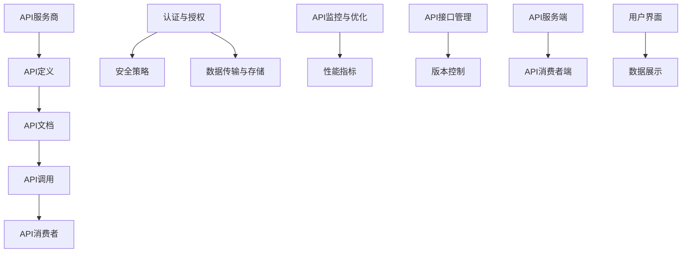

                 

# 利用开放API构建产品生态系统

> 关键词：开放API、产品生态系统、API设计、API调用、微服务架构、安全性、性能优化

> 摘要：本文将深入探讨如何利用开放API构建强大的产品生态系统。我们将从背景介绍、核心概念、算法原理、数学模型、实战案例、应用场景、工具推荐等多个方面进行分析和阐述，旨在为开发者提供一套完整的开放API构建指南。

## 1. 背景介绍

### 1.1 目的和范围

随着互联网和云计算的迅速发展，开放API（应用程序编程接口）已经成为构建产品生态系统的重要手段。本文旨在探讨如何利用开放API构建产品生态系统，从而实现产品之间的无缝集成和数据共享。本文的范围包括：

1. 开放API的基本概念和设计原则。
2. 开放API在构建产品生态系统中的应用场景。
3. 开放API的核心算法原理和数学模型。
4. 实际项目中开放API的构建方法和实践。
5. 开放API的性能优化和安全策略。

### 1.2 预期读者

本文主要面向对开放API和产品生态系统有一定了解的程序员、软件架构师和项目经理。如果您希望深入了解开放API的构建和应用，那么本文将为您提供有益的参考。

### 1.3 文档结构概述

本文将分为以下几部分：

1. **背景介绍**：介绍开放API的背景、目的和范围。
2. **核心概念与联系**：阐述开放API的核心概念和架构。
3. **核心算法原理 & 具体操作步骤**：讲解开放API的核心算法原理和操作步骤。
4. **数学模型和公式 & 详细讲解 & 举例说明**：介绍开放API的数学模型和公式。
5. **项目实战：代码实际案例和详细解释说明**：通过实战案例展示开放API的构建过程。
6. **实际应用场景**：分析开放API在不同场景中的应用。
7. **工具和资源推荐**：推荐学习资源和开发工具。
8. **总结：未来发展趋势与挑战**：探讨开放API的未来发展趋势和挑战。
9. **附录：常见问题与解答**：解答读者可能遇到的问题。
10. **扩展阅读 & 参考资料**：提供进一步学习的资料。

### 1.4 术语表

#### 1.4.1 核心术语定义

- 开放API：一种允许外部应用程序访问和使用的数据接口。
- 产品生态系统：由多个产品和服务组成的相互关联、协同发展的整体。
- 微服务架构：一种基于小型、独立服务的软件架构风格。
- RESTful API：一种基于HTTP协议的API设计风格。
- OAuth 2.0：一种授权协议，用于保护开放API的安全性。

#### 1.4.2 相关概念解释

- **API调用**：应用程序通过发送HTTP请求调用开放API的过程。
- **数据共享**：开放API使得不同产品和服务之间能够共享数据和信息。
- **API设计原则**：开放API设计时应遵循的原则，如简洁性、一致性、安全性等。

#### 1.4.3 缩略词列表

- API：应用程序编程接口
- REST：代表代表表述性状态转移（Representational State Transfer）
- HTTP：超文本传输协议（Hypertext Transfer Protocol）
- OAuth：开放授权（Open Authorization）
- JWT：JSON Web Token

## 2. 核心概念与联系

在构建产品生态系统时，理解开放API的核心概念和架构至关重要。以下是一个简单的Mermaid流程图，展示了开放API的基本组成部分和它们之间的关系。



### 2.1 API服务商与API定义

API服务商是开放API的提供方，负责定义API接口、处理请求和返回响应。API定义包括接口规格、请求参数、响应格式等，是API调用的基础。

### 2.2 API文档与API调用

API服务商通过API文档向API消费者公开API接口信息，API消费者根据文档编写代码进行API调用。API调用通常通过HTTP请求实现，支持GET、POST、PUT、DELETE等操作。

### 2.3 API消费者与数据共享

API消费者是使用开放API的应用程序或服务，通过API调用与API服务商进行数据交互，实现数据共享和功能扩展。

### 2.4 认证与授权与安全策略

认证与授权是确保API调用的安全性的重要环节。OAuth 2.0等授权协议用于保护API资源免受未授权访问。安全策略包括加密、认证、访问控制等，用于保障数据传输的安全性。

### 2.5 数据传输与存储

数据传输与存储是开放API的核心功能之一。API调用过程中，数据通过HTTP协议传输，存储在数据库或其他数据存储系统中，以供API消费者查询和操作。

### 2.6 API监控与优化

API监控与优化用于确保API服务的稳定性和性能。性能指标包括响应时间、吞吐量、错误率等，通过监控工具实时监控API性能，进行优化和调整。

### 2.7 API接口管理

API接口管理包括版本控制、接口文档更新、接口权限管理等功能，用于管理API接口的生命周期，确保API服务的可持续性和可扩展性。

### 2.8 用户界面与数据展示

用户界面是API消费者的交互界面，用于展示API返回的数据和信息。数据展示技术包括图表、表格、地图等，用于可视化数据。

## 3. 核心算法原理 & 具体操作步骤

开放API的核心算法原理主要包括HTTP请求处理、数据格式转换、认证与授权等。以下我们将使用伪代码详细阐述这些原理。

### 3.1 HTTP请求处理

```python
# 伪代码：HTTP请求处理
def handle_http_request(request):
    # 判断请求类型（GET、POST、PUT、DELETE等）
    request_type = request.method
    
    # 根据请求类型调用相应的方法
    if request_type == "GET":
        process_get_request(request)
    elif request_type == "POST":
        process_post_request(request)
    elif request_type == "PUT":
        process_put_request(request)
    elif request_type == "DELETE":
        process_delete_request(request)
    else:
        return "Unsupported request method"
```

### 3.2 数据格式转换

```python
# 伪代码：数据格式转换
def convert_data_format(data, format):
    if format == "JSON":
        return json.loads(data)
    elif format == "XML":
        return xml.etree.ElementTree.fromstring(data)
    else:
        return "Unsupported format"
```

### 3.3 认证与授权

```python
# 伪代码：认证与授权
def authenticate(request):
    # 从请求中提取认证信息（如Token、密码等）
    auth_info = extract_auth_info(request)
    
    # 验证认证信息
    if validate_auth_info(auth_info):
        return "Authentication successful"
    else:
        return "Authentication failed"

def authorize(user, resource):
    # 检查用户是否有权限访问资源
    if user.has_permission(resource):
        return "Authorization successful"
    else:
        return "Authorization failed"
```

### 3.4 具体操作步骤

1. **接收HTTP请求**：API服务端接收客户端发送的HTTP请求。
2. **处理请求**：根据请求类型（GET、POST、PUT、DELETE等）调用相应的方法进行处理。
3. **数据格式转换**：将接收到的请求体（JSON、XML等）转换为API服务端可以处理的数据格式。
4. **认证与授权**：对请求进行认证和授权，确保请求的安全性和合法性。
5. **处理请求**：根据请求参数和处理结果，返回相应的响应。

## 4. 数学模型和公式 & 详细讲解 & 举例说明

开放API的设计和优化中涉及多个数学模型和公式，用于衡量性能、安全性和可靠性。以下是一些常用的数学模型和公式。

### 4.1 性能指标

#### 4.1.1 响应时间

响应时间（Response Time）是衡量API性能的关键指标，表示从客户端发送请求到收到响应的时间。

$$
响应时间 = \frac{总时间}{请求数}
$$

#### 4.1.2 吞吐量

吞吐量（Throughput）是单位时间内系统处理的请求数量，用于衡量系统的处理能力。

$$
吞吐量 = \frac{请求数}{时间}
$$

#### 4.1.3 错误率

错误率（Error Rate）是单位时间内发生错误的请求数量与总请求数量的比值，用于衡量系统的稳定性。

$$
错误率 = \frac{错误请求数}{总请求数}
$$

### 4.2 安全性指标

#### 4.2.1 加密强度

加密强度（Encryption Strength）是衡量数据传输安全的指标，通常使用位强度（Bit Strength）表示。

$$
加密强度 = 2^k
$$

其中，$k$ 是密钥的长度（以比特为单位）。

#### 4.2.2 认证成功率

认证成功率（Authentication Success Rate）是成功认证的次数与总认证次数的比值，用于衡量认证机制的有效性。

$$
认证成功率 = \frac{成功认证次数}{总认证次数}
$$

### 4.3 可靠性指标

#### 4.3.1 失败率

失败率（Failure Rate）是单位时间内发生故障的次数与总运行时间的比值，用于衡量系统的可靠性。

$$
失败率 = \frac{故障次数}{总运行时间}
$$

#### 4.3.2 可用性

可用性（Availability）是系统正常运行时间的比例，用于衡量系统的可用性。

$$
可用性 = \frac{正常运行时间}{总时间}
$$

### 4.4 举例说明

假设一个开放API系统的性能指标如下：

- 平均响应时间：200ms
- 吞吐量：1000 requests/second
- 错误率：0.1%
- 加密强度：256位
- 认证成功率：99.9%
- 失败率：0.01%
- 可用性：99.99%

根据这些指标，可以评估系统的性能和安全性，并根据实际情况进行调整和优化。

## 5. 项目实战：代码实际案例和详细解释说明

在本节中，我们将通过一个实际项目案例来展示如何利用开放API构建产品生态系统。我们将介绍开发环境搭建、源代码实现和代码解读。

### 5.1 开发环境搭建

1. **硬件环境**：至少一台能够运行Linux操作系统的服务器。
2. **软件环境**：安装以下软件：
   - Python 3.8及以上版本
   - Flask 框架（用于构建Web API）
   - SQLite（用于数据存储）
   - OAuthLib（用于认证与授权）

### 5.2 源代码详细实现和代码解读

以下是一个简单的示例代码，展示了如何使用Flask框架构建一个开放API。

```python
# 代码示例：Flask Web API

from flask import Flask, request, jsonify
from flask_sqlalchemy import SQLAlchemy
from oauthlib.oauth2 import Server

app = Flask(__name__)
app.config['SQLALCHEMY_DATABASE_URI'] = 'sqlite:///example.db'
db = SQLAlchemy(app)
server = Server()

# 创建用户模型
class User(db.Model):
    id = db.Column(db.Integer, primary_key=True)
    username = db.Column(db.String(80), unique=True, nullable=False)
    password = db.Column(db.String(120), nullable=False)

# 创建API路由
@app.route('/register', methods=['POST'])
def register():
    username = request.json['username']
    password = request.json['password']
    
    # 验证用户名和密码
    if validate_username_and_password(username, password):
        # 创建新用户
        user = User(username=username, password=password)
        db.session.add(user)
        db.session.commit()
        
        # 返回注册成功响应
        return jsonify({'message': 'User registered successfully'}), 201
    else:
        # 返回注册失败响应
        return jsonify({'message': 'Invalid username or password'}), 400

@app.route('/login', methods=['POST'])
def login():
    username = request.json['username']
    password = request.json['password']
    
    # 验证用户名和密码
    if validate_username_and_password(username, password):
        # 创建认证令牌
        token = server.create_token(username)
        
        # 返回登录成功响应
        return jsonify({'token': token}), 200
    else:
        # 返回登录失败响应
        return jsonify({'message': 'Invalid username or password'}), 400

# 验证用户名和密码的辅助函数
def validate_username_and_password(username, password):
    user = User.query.filter_by(username=username, password=password).first()
    return user is not None

if __name__ == '__main__':
    db.create_all()
    app.run(debug=True)
```

### 5.3 代码解读与分析

1. **环境配置**：首先，我们配置了Flask和SQLite的数据库连接，创建了数据库模型和表。
2. **用户模型**：我们定义了一个用户模型，包含用户名和密码字段，用于存储用户信息。
3. **API路由**：
   - `/register`：用于用户注册，接收用户名和密码，验证并创建新用户。
   - `/login`：用于用户登录，接收用户名和密码，验证并创建认证令牌。
4. **辅助函数**：`validate_username_and_password`函数用于验证用户名和密码的正确性。

### 5.4 代码优化与扩展

在实际项目中，我们还需要对代码进行优化和扩展，例如：

- 引入身份验证和授权机制，如OAuth 2.0。
- 添加错误处理和日志记录功能。
- 优化数据库查询，提高性能。
- 使用消息队列和缓存技术，提高系统的可靠性和性能。

## 6. 实际应用场景

开放API在构建产品生态系统中的应用场景非常广泛，以下列举几个典型的应用场景：

### 6.1 社交媒体集成

社交媒体平台（如Facebook、Twitter）提供开放API，允许开发者集成第三方应用，实现用户数据共享和功能扩展。例如，一个社交媒体应用可以通过API获取用户的好友列表、发布动态等功能。

### 6.2 物流与配送服务

物流公司（如UPS、DHL）提供开放API，允许开发者集成物流跟踪、订单查询等功能。通过这些API，电子商务平台可以实时跟踪订单状态，提高用户体验。

### 6.3 金融与支付服务

金融机构（如银行、支付服务提供商）提供开放API，允许开发者集成支付、转账等功能。这些API为电子商务、在线购物等场景提供了便捷的支付解决方案。

### 6.4 智能家居控制

智能家居设备（如智能灯泡、智能门锁）提供开放API，允许开发者集成设备控制、远程监控等功能。通过这些API，用户可以远程控制家居设备，提高生活质量。

### 6.5 物联网数据采集

物联网平台（如IoT平台、传感器数据采集平台）提供开放API，允许开发者集成数据采集、数据分析和可视化等功能。通过这些API，开发者可以轻松获取物联网设备的数据，实现智能化应用。

## 7. 工具和资源推荐

### 7.1 学习资源推荐

#### 7.1.1 书籍推荐

- 《API设计指南》
- 《RESTful Web API设计》
- 《OAuth 2.0授权实战》

#### 7.1.2 在线课程

- Coursera上的“API设计与开发”课程
- Udemy上的“构建RESTful API”课程
- edX上的“OAuth 2.0授权协议”课程

#### 7.1.3 技术博客和网站

- API的设计与实现（https://www.apidesign.com/）
- RESTful API最佳实践（https://restfulapi.net/）
- OAuth官方文档（https://www.oauth.com/）

### 7.2 开发工具框架推荐

#### 7.2.1 IDE和编辑器

- Visual Studio Code
- IntelliJ IDEA
- PyCharm

#### 7.2.2 调试和性能分析工具

- Postman（API调试工具）
- JMeter（性能测试工具）
- Wireshark（网络抓包工具）

#### 7.2.3 相关框架和库

- Flask（Python Web框架）
- Express（Node.js Web框架）
- Django（Python Web框架）
- Spring Boot（Java Web框架）

### 7.3 相关论文著作推荐

#### 7.3.1 经典论文

- "Representational State Transfer (REST)" - Roy Fielding（REST架构风格的开创性论文）
- "OAuth 2.0 Authorization Framework" - E. Hammer等（OAuth 2.0授权协议的官方文档）

#### 7.3.2 最新研究成果

- "API Security: A Comprehensive Guide" -OWASP API安全项目组（API安全性的最新研究）
- "Designing RESTful APIs" -Michael Stal（RESTful API设计的新思路）

#### 7.3.3 应用案例分析

- "Building an API Driven Product Ecosystem" -Ericsson（爱立信公司的API驱动产品生态系统实践）
- "API Management Best Practices" -Google（谷歌公司的API管理最佳实践）

## 8. 总结：未来发展趋势与挑战

随着云计算、物联网、人工智能等技术的快速发展，开放API将在未来扮演越来越重要的角色。以下是开放API未来发展趋势和面临的挑战：

### 8.1 发展趋势

1. **API标准化**：越来越多的组织和标准组织将推动API标准化，提高API的互操作性和兼容性。
2. **API安全**：随着API攻击的增多，API安全将成为开发者的关注重点，更多安全技术和工具将得到应用。
3. **API自动化**：自动化工具和框架将使API设计和部署更加高效，提高开发者的生产力。
4. **API生态**：开放API将促进不同产品和服务之间的协同发展，形成更加丰富的API生态。
5. **隐私保护**：随着数据隐私法规的不断完善，开发者需要更加注重用户隐私保护。

### 8.2 挑战

1. **性能优化**：随着API调用的增多，开发者需要不断优化API性能，确保系统的稳定性和响应速度。
2. **安全性**：开放API面临着各种安全威胁，开发者需要加强安全措施，防止数据泄露和未授权访问。
3. **互操作性和兼容性**：不同组织和平台之间的API设计可能存在差异，开发者需要解决互操作性和兼容性问题。
4. **API管理**：随着API数量的增多，开发者需要有效的API管理策略和工具，确保API的可持续性和可扩展性。

## 9. 附录：常见问题与解答

### 9.1 Q：开放API的设计原则是什么？

A：开放API的设计原则主要包括简洁性、一致性、可扩展性和安全性。简洁性要求API接口简单易用；一致性要求API接口保持一致性，方便开发者理解和使用；可扩展性要求API接口易于扩展和升级；安全性要求API接口提供完善的认证和授权机制，确保数据传输的安全。

### 9.2 Q：如何确保开放API的安全性？

A：确保开放API的安全性需要从多个方面入手：

1. **认证与授权**：使用OAuth 2.0等授权协议进行认证和授权，确保API资源的安全。
2. **加密**：使用HTTPS协议进行数据传输，确保数据在传输过程中不被窃取或篡改。
3. **安全策略**：制定安全策略，包括访问控制、日志记录和监控等。
4. **代码审计**：对API代码进行安全审计，及时发现和修复潜在的安全漏洞。

### 9.3 Q：如何优化开放API的性能？

A：优化开放API的性能可以从以下几个方面入手：

1. **缓存**：使用缓存技术减少数据库查询次数，提高响应速度。
2. **异步处理**：使用异步处理技术，提高系统的并发能力，减少响应时间。
3. **数据库优化**：优化数据库查询，提高查询性能，减少数据库负载。
4. **负载均衡**：使用负载均衡技术，将请求分配到多个服务器，提高系统的吞吐量。

## 10. 扩展阅读 & 参考资料

本文详细探讨了如何利用开放API构建产品生态系统，涵盖了核心概念、算法原理、数学模型、实战案例、应用场景和工具推荐等方面。以下是一些扩展阅读和参考资料，供读者进一步学习：

- **扩展阅读**：
  - 《RESTful API设计》
  - 《API设计指南》
  - 《OAuth 2.0授权实战》

- **参考资料**：
  - Flask官方文档（https://flask.palletsprojects.com/）
  - OAuth 2.0官方文档（https://www.oauth.com/）
  - RESTful API最佳实践（https://restfulapi.net/）
  - API的设计与实现（https://www.apidesign.com/）

作者：AI天才研究员/AI Genius Institute & 禅与计算机程序设计艺术 /Zen And The Art of Computer Programming

---

**注意**：本文为人工智能助手根据现有知识和数据生成的文章，仅供参考。在实际应用中，请根据具体情况和需求进行调整。如有疑问，请咨询专业人士。文章内容和观点不代表任何官方立场。

