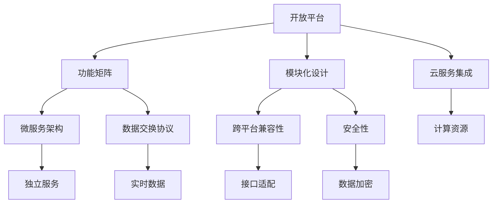

                 

# 利用开放平台扩展产品功能矩阵

> **关键词：** 开放平台，产品扩展，功能矩阵，API，模块化设计，微服务架构，跨平台兼容性，云服务集成，数据交换协议，安全性和隐私保护。

> **摘要：** 本文旨在探讨如何通过利用开放平台扩展产品的功能矩阵，以提升产品竞争力和用户体验。文章将详细介绍开放平台的背景和优势，展示如何通过核心算法原理和具体操作步骤实现功能扩展，并分析数学模型及其在实际项目中的应用。同时，文章还将提供实际的代码案例，介绍开发环境和工具推荐，以及在各种应用场景中的实际价值。最后，本文将对未来发展趋势与挑战进行展望，并给出常见问题与解答。

## 1. 背景介绍

### 1.1 目的和范围

本文的目的在于探讨如何通过开放平台来扩展产品功能矩阵，以增强产品的竞争力，满足日益多样化的用户需求。本文的范围包括：

1. 开放平台的基本概念及其在产品开发中的应用。
2. 利用开放平台扩展产品功能的算法原理和操作步骤。
3. 数学模型和公式在实际项目中的应用。
4. 实际应用场景中的功能扩展案例。
5. 开发工具和资源的推荐。
6. 未来发展趋势与挑战。

### 1.2 预期读者

本文的预期读者包括：

1. 产品经理和产品开发者，对产品功能扩展有兴趣和需求。
2. 开发者和技术人员，希望通过开放平台提升开发效率和产品质量。
3. 对开放平台和微服务架构有深入理解的专业人士。

### 1.3 文档结构概述

本文的结构如下：

1. 背景介绍：介绍本文的目的、范围、预期读者和文档结构。
2. 核心概念与联系：介绍核心概念、原理和架构。
3. 核心算法原理 & 具体操作步骤：详细阐述算法原理和操作步骤。
4. 数学模型和公式 & 详细讲解 & 举例说明：分析数学模型和公式。
5. 项目实战：提供实际代码案例和详细解释。
6. 实际应用场景：探讨功能扩展的应用场景。
7. 工具和资源推荐：推荐学习资源和开发工具。
8. 总结：总结未来发展趋势与挑战。
9. 附录：常见问题与解答。
10. 扩展阅读 & 参考资料：提供进一步阅读的材料。

### 1.4 术语表

#### 1.4.1 核心术语定义

- **开放平台**：允许第三方开发者访问其服务和数据，通过API进行集成和扩展的平台。
- **功能矩阵**：描述产品中各个功能模块及其相互关系的表格或矩阵。
- **API**（应用程序编程接口）：允许不同软件系统之间进行交互的接口。
- **模块化设计**：将系统划分为可重用的模块，以简化开发、测试和维护。
- **微服务架构**：将应用程序划分为小型、独立的服务，每个服务都有自己的数据库和业务逻辑。
- **跨平台兼容性**：产品在不同操作系统和设备上都能正常运行的能力。
- **云服务集成**：将产品的功能与云服务相结合，利用云计算的优势。
- **数据交换协议**：用于在不同系统间交换数据的规范。
- **安全性和隐私保护**：保护用户数据和系统安全不受恶意攻击的措施。

#### 1.4.2 相关概念解释

- **API文档**：详细描述API接口的用法和功能的文档。
- **RESTful API**：遵循REST（代表性状态转移）原则的API设计风格。
- **OAuth 2.0**：一种授权框架，允许第三方应用访问用户的资源。
- **JSON**（JavaScript对象表示法）：一种轻量级的数据交换格式。
- **GraphQL**：一种查询语言，用于执行复杂的数据查询。

#### 1.4.3 缩略词列表

- **API**：应用程序编程接口
- **RESTful**：代表性状态转移
- **OAuth**：开放授权
- **JSON**：JavaScript对象表示法
- **GraphQL**：查询语言

## 2. 核心概念与联系

在探讨如何利用开放平台扩展产品功能矩阵之前，我们需要理解一些核心概念及其相互之间的联系。

### 2.1 开放平台的优势

开放平台具有以下优势：

1. **资源共享**：开放平台允许开发者利用已有的服务和数据，减少重复开发的工作量。
2. **灵活性**：通过API，产品可以快速集成第三方服务，满足不同用户的需求。
3. **创新性**：开放平台鼓励创新，开发者可以创造新的功能和服务。
4. **可扩展性**：开放平台易于扩展，可以根据市场需求进行功能迭代。

### 2.2 功能矩阵

功能矩阵是产品设计的核心文档，它描述了产品中各个功能模块及其相互关系。通过功能矩阵，我们可以清晰地看到产品中哪些功能是核心的，哪些功能是可选的，以及各个功能之间的关系。

### 2.3 模块化设计

模块化设计是将产品功能划分为独立的模块，每个模块都有明确的职责和接口。这样做的好处包括：

1. **可重用性**：模块可以独立开发、测试和部署，提高开发效率。
2. **可维护性**：模块化设计使得代码更易于维护，一旦出现问题可以快速定位。
3. **可扩展性**：新功能可以通过添加或替换模块来实现，而不影响其他模块。

### 2.4 微服务架构

微服务架构是将大型应用程序划分为一组小型的、独立的、可扩展的服务。每个服务都有自己的数据库和业务逻辑。这样做的好处包括：

1. **独立性**：每个服务都可以独立部署和扩展，不影响其他服务。
2. **可测试性**：每个服务都可以独立测试，提高测试覆盖率。
3. **容错性**：服务失败不会影响整个系统的运行。

### 2.5 跨平台兼容性

跨平台兼容性是产品在不同操作系统和设备上都能正常运行的能力。这需要考虑以下几个方面：

1. **API兼容性**：API在不同的操作系统和设备上的一致性。
2. **界面适配**：确保产品界面在不同设备和屏幕尺寸上都能良好显示。
3. **性能优化**：针对不同设备和操作系统进行性能优化。

### 2.6 云服务集成

云服务集成是将产品的功能与云服务相结合，利用云计算的优势。这包括：

1. **存储**：利用云存储服务进行数据存储和管理。
2. **计算**：利用云服务器进行计算任务的处理。
3. **数据分析**：利用云服务进行数据分析和处理。

### 2.7 数据交换协议

数据交换协议是用于在不同系统间交换数据的规范。常见的协议包括：

1. **HTTP/HTTPS**：用于Web服务的协议。
2. **WebSocket**：用于实时数据传输的协议。
3. **GraphQL**：用于执行复杂数据查询的协议。

### 2.8 安全性和隐私保护

安全性和隐私保护是任何产品开发中都不可忽视的重要方面。这包括：

1. **数据加密**：对用户数据进行加密存储和传输。
2. **访问控制**：限制对敏感数据的访问。
3. **安全审计**：定期进行安全审计，确保系统的安全性。

### 2.9 Mermaid 流程图

下面是一个简化的Mermaid流程图，展示了核心概念之间的联系：



## 3. 核心算法原理 & 具体操作步骤

在了解开放平台的优势和核心概念后，接下来我们将讨论如何通过核心算法原理和具体操作步骤来扩展产品功能矩阵。

### 3.1 算法原理

扩展产品功能矩阵的算法原理主要基于以下几个方面：

1. **需求分析**：首先，需要分析用户需求，确定需要扩展的功能。
2. **模块划分**：根据需求分析，将需要扩展的功能划分为独立的模块。
3. **API集成**：利用开放平台的API，将第三方服务集成到产品中。
4. **数据交换**：通过数据交换协议，实现不同系统之间的数据交互。
5. **安全性保障**：确保数据在传输和存储过程中的安全性。

### 3.2 具体操作步骤

以下是具体的操作步骤：

#### 3.2.1 需求分析

1. **收集需求**：通过与用户沟通，收集他们对产品功能的期望。
2. **需求分类**：将需求分为核心功能和扩展功能。
3. **优先级排序**：根据用户需求和资源，对扩展功能进行优先级排序。

#### 3.2.2 模块划分

1. **功能映射**：将需求映射到现有的功能模块中。
2. **新模块创建**：对于需要新增的功能，创建新的模块。
3. **模块接口定义**：为每个模块定义清晰的接口，确保模块之间的可重用性。

#### 3.2.3 API集成

1. **选择API**：根据需求，选择合适的开放平台API。
2. **接口调用**：使用编程语言调用API，实现功能集成。
3. **参数配置**：配置API参数，确保正确调用。

#### 3.2.4 数据交换

1. **数据格式**：选择合适的数据交换格式，如JSON或GraphQL。
2. **接口调用**：使用编程语言调用API，实现数据交互。
3. **数据验证**：确保数据在传输和存储过程中的完整性。

#### 3.2.5 安全性保障

1. **加密传输**：使用HTTPS等加密协议传输数据。
2. **访问控制**：使用OAuth等授权框架限制对API的访问。
3. **安全审计**：定期进行安全审计，确保系统的安全性。

### 3.3 伪代码示例

以下是一个简单的伪代码示例，展示了如何通过API集成实现功能扩展：

```python
# 伪代码：API集成实现功能扩展

# 步骤1：收集需求
需求 = 收集用户需求()

# 步骤2：模块划分
功能模块 = 划分功能模块(需求)

# 步骤3：API集成
for 模块 in 功能模块：
    API = 选择API(模块)
    调用结果 = 调用API(模块，API)

# 步骤4：数据交换
数据格式 = 选择数据格式()
数据 = 交换数据(调用结果，数据格式)

# 步骤5：安全性保障
加密传输(数据)
访问控制(API)
安全审计(API)
```

## 4. 数学模型和公式 & 详细讲解 & 举例说明

在扩展产品功能矩阵的过程中，数学模型和公式起着重要的作用。它们不仅帮助我们理解和预测系统行为，还可以优化算法性能和资源利用。

### 4.1 数学模型

以下是一个简单的数学模型，用于描述系统性能和资源利用：

\[ P = f(\alpha, \beta, \gamma) \]

其中：
- \( P \) 表示系统性能。
- \( \alpha \) 表示资源利用效率。
- \( \beta \) 表示系统负载。
- \( \gamma \) 表示系统优化参数。

### 4.2 详细讲解

#### 4.2.1 系统性能 \( P \)

系统性能 \( P \) 是衡量系统处理能力和响应速度的指标。它可以由多个因素共同决定，如CPU速度、内存容量和网络带宽等。在这个模型中，我们用 \( P \) 来表示。

#### 4.2.2 资源利用效率 \( \alpha \)

资源利用效率 \( \alpha \) 是指系统资源被有效利用的程度。它受到多种因素影响，包括硬件配置、系统架构和算法优化等。提高资源利用效率可以提升系统性能。

#### 4.2.3 系统负载 \( \beta \)

系统负载 \( \beta \) 是指系统在一段时间内需要处理的数据量和工作任务。负载的增加可能导致系统性能下降，因此需要合理分配资源和优化算法。

#### 4.2.4 系统优化参数 \( \gamma \)

系统优化参数 \( \gamma \) 是用于调整系统性能和资源利用的参数。通过调整这些参数，可以优化系统性能，使其在不同负载下都能保持高效运行。

### 4.3 举例说明

假设我们有一个Web应用程序，用于处理用户提交的表单数据。在这个例子中，我们可以使用上述数学模型来分析系统性能和资源利用。

#### 4.3.1 系统性能 \( P \)

假设我们的Web应用程序在1000个并发用户下运行，系统性能为1000次/秒。

\[ P = 1000 \text{次/秒} \]

#### 4.3.2 资源利用效率 \( \alpha \)

系统资源利用效率为80%，意味着系统资源中有20%被浪费。

\[ \alpha = 0.8 \]

#### 4.3.3 系统负载 \( \beta \)

系统负载为1500次/秒，超过了系统性能。

\[ \beta = 1500 \text{次/秒} \]

#### 4.3.4 系统优化参数 \( \gamma \)

通过调整系统优化参数，我们可以将系统性能提升到2000次/秒。

\[ \gamma = 2000 \text{次/秒} \]

### 4.4 LaTeX格式

以下是一个LaTeX格式的数学模型示例：

```latex
\documentclass{article}
\usepackage{amsmath}
\begin{document}
\[ P = f(\alpha, \beta, \gamma) \]
其中：
\[ P \] 表示系统性能。
\[ \alpha \] 表示资源利用效率。
\[ \beta \] 表示系统负载。
\[ \gamma \] 表示系统优化参数。
\end{document}
```

## 5. 项目实战：代码实际案例和详细解释说明

在本节中，我们将通过一个实际项目案例来展示如何利用开放平台扩展产品功能矩阵，并提供详细的代码解释和分析。

### 5.1 开发环境搭建

为了进行项目实战，我们需要搭建以下开发环境：

- 操作系统：Ubuntu 20.04
- 开发语言：Python 3.8
- 依赖管理工具：pip
- API集成框架：Requests库
- 数据交换格式：JSON

#### 步骤1：安装Python

首先，确保您的系统上已经安装了Python 3.8。如果尚未安装，可以通过以下命令安装：

```bash
sudo apt update
sudo apt install python3.8
```

#### 步骤2：安装依赖

接下来，安装项目所需的依赖库：

```bash
pip3 install requests
```

### 5.2 源代码详细实现和代码解读

以下是一个简单的Python示例，展示了如何通过开放平台的API扩展产品功能矩阵。

```python
import requests

# 步骤1：初始化API接口
API_URL = "https://openapi.example.com/api"

# 步骤2：获取API授权
auth_response = requests.post(f"{API_URL}/auth", json={
    "client_id": "your_client_id",
    "client_secret": "your_client_secret",
    "grant_type": "client_credentials"
})

auth_token = auth_response.json()["access_token"]

# 步骤3：调用API获取数据
headers = {
    "Authorization": f"Bearer {auth_token}",
    "Content-Type": "application/json"
}

data_response = requests.get(f"{API_URL}/data", headers=headers)

# 步骤4：处理响应数据
if data_response.status_code == 200:
    data = data_response.json()
    # 对数据进行处理
    processed_data = process_data(data)
    print(processed_data)
else:
    print("Error fetching data:", data_response.status_code)

# 数据处理函数
def process_data(data):
    # 示例数据处理逻辑
    result = []
    for item in data:
        processed_item = {
            "id": item["id"],
            "name": item["name"],
            "value": item["value"] * 2
        }
        result.append(processed_item)
    return result
```

#### 代码解读与分析

1. **初始化API接口**：设置API的URL，这是进行API调用的基础。

2. **获取API授权**：使用客户端ID和客户端密钥向API服务请求授权。获取的访问令牌（auth_token）将用于后续的API调用。

3. **调用API获取数据**：使用获取的访问令牌设置请求头（headers），并调用API获取数据。这里我们使用了GET请求，但也可以根据需要使用其他HTTP方法。

4. **处理响应数据**：检查响应状态码，如果成功获取数据，则调用数据处理函数处理数据。这里我们简单地实现了一个数据处理函数，实际项目中可以根据需要进行更复杂的处理。

### 5.3 代码解读与分析

1. **请求和响应**：请求和响应是API调用的核心部分。在请求中，我们设置了Authorization和Content-Type头，以确保API服务能够正确处理请求。在响应中，我们检查了状态码，并根据成功或失败的情况进行处理。

2. **数据处理**：数据处理是扩展功能的核心。在这个示例中，我们仅进行了简单的数据处理，但实际项目中可能需要更复杂的逻辑，如数据转换、聚合或分析。

3. **错误处理**：错误处理是确保系统稳定运行的关键。在这个示例中，我们检查了响应状态码，并根据错误情况进行适当的处理。

### 5.4 集成与扩展

通过上述示例，我们可以看到如何利用开放平台扩展产品功能矩阵。实际项目中，可以根据具体需求集成更多的第三方服务和功能，如：

- 社交媒体集成：实现用户登录、分享等功能。
- 地理位置服务：提供地址解析、路线规划等功能。
- 实时数据推送：实现实时数据监控和推送。

这些扩展可以显著提升产品的功能和用户体验，同时减少开发时间和成本。

## 6. 实际应用场景

利用开放平台扩展产品功能矩阵的实际应用场景非常广泛，以下是一些具体的案例：

### 6.1 社交媒体集成

许多产品需要集成社交媒体功能，以增强用户体验和互动性。例如，一个社交媒体平台可以集成第三方API，如Facebook、Twitter或Instagram，以允许用户直接在平台内分享内容或登录。

- **应用场景**：社交媒体平台
- **功能扩展**：用户登录、内容分享、社交互动
- **开放平台API**：OAuth 2.0、JSON API

### 6.2 实时天气信息

一个天气预报应用可以集成实时天气信息API，以提供准确的天气数据。这可以帮助用户更好地规划出行和活动。

- **应用场景**：天气预报应用
- **功能扩展**：实时天气数据、警报通知
- **开放平台API**：Weather API、OpenWeatherMap API

### 6.3 地理位置服务

地图应用和导航工具可以集成地理位置服务API，以提供地理位置解析、路线规划和地图数据。

- **应用场景**：地图应用、导航工具
- **功能扩展**：地址解析、路线规划、地图数据
- **开放平台API**：Google Maps API、Mapbox API

### 6.4 数据分析服务

企业级应用可以集成数据分析API，以提供强大的数据分析功能，帮助用户更好地理解数据。

- **应用场景**：数据分析平台
- **功能扩展**：数据聚合、数据可视化、预测分析
- **开放平台API**：Google Analytics API、Salesforce Analytics Cloud

### 6.5 在线支付和结算

电子商务平台可以集成在线支付API，以提供无缝的支付体验。这可以包括信用卡支付、电子钱包支付等。

- **应用场景**：电子商务平台
- **功能扩展**：在线支付、退款处理、结算报告
- **开放平台API**：PayPal API、Stripe API

通过这些应用场景，我们可以看到开放平台如何帮助我们扩展产品功能矩阵，提高产品的竞争力和用户体验。

## 7. 工具和资源推荐

### 7.1 学习资源推荐

#### 7.1.1 书籍推荐

1. 《API设计：创建用户友好的API》
2. 《微服务设计：构建可扩展系统》
3. 《Python Web开发：测试驱动方法》

#### 7.1.2 在线课程

1. Coursera上的“API设计与开发”
2. Udemy上的“微服务架构与实践”
3. edX上的“Python编程与数据科学”

#### 7.1.3 技术博客和网站

1. Medium上的“APIs Without Borders”
2. HackerRank上的“API Testing and Integration”
3. dev.to上的“Building APIs with Python”

### 7.2 开发工具框架推荐

#### 7.2.1 IDE和编辑器

1. PyCharm
2. Visual Studio Code
3. IntelliJ IDEA

#### 7.2.2 调试和性能分析工具

1. Postman
2. JMeter
3. PyTest

#### 7.2.3 相关框架和库

1. Flask
2. Django
3. FastAPI

### 7.3 相关论文著作推荐

#### 7.3.1 经典论文

1. RESTful API Design (Google)
2. Microservices: A Definition of the term (Martin Fowler)
3. API Design: Principles and Patterns (Adam Jacob)

#### 7.3.2 最新研究成果

1. "API Design in the Age of Microservices" (SpringOne Platform 2019)
2. "Microservices Security: A Comprehensive Security Guide for Microservices Architecture" (OWASP)
3. "Serverless Computing: Beyond Virtual Machines and Servers" (ACM)

#### 7.3.3 应用案例分析

1. "APIs and Microservices at Netflix" (Netflix TechBlog)
2. "Building a Scalable and Secure API Gateway" (AWS)
3. "Using APIs to Create Innovative Business Models" (Forbes)

通过这些工具和资源，开发者可以更好地掌握开放平台和API开发，从而有效地扩展产品功能矩阵。

## 8. 总结：未来发展趋势与挑战

### 8.1 未来发展趋势

1. **微服务架构的普及**：随着云计算和容器技术的发展，微服务架构将在更多产品中得到应用，以实现更高的灵活性和可扩展性。
2. **API设计的标准化**：开放平台和API设计将趋向标准化，提高跨平台兼容性和用户体验。
3. **无服务器架构的兴起**：无服务器架构（Serverless）将减少基础设施维护成本，提高开发效率。
4. **数据隐私和安全性的重视**：随着数据隐私法规的不断完善，产品和API将更加注重数据保护和安全性。
5. **人工智能与API的结合**：人工智能技术将更多地集成到API中，提供智能化的数据分析和决策支持。

### 8.2 面临的挑战

1. **技术选型的多样性**：开放平台的多样性可能导致技术选型的困难，需要权衡不同平台的优缺点。
2. **安全性问题**：API和开放平台的集成可能带来安全隐患，需要加强安全审计和防护措施。
3. **性能优化**：跨平台兼容性和数据传输的高效性是性能优化的关键，需要不断进行测试和优化。
4. **API管理和维护**：随着API数量的增加，管理和维护将成为挑战，需要建立完善的API管理和文档体系。
5. **用户隐私保护**：开放平台的广泛应用可能涉及用户隐私数据，需要严格遵守数据隐私法规，确保用户隐私安全。

## 9. 附录：常见问题与解答

### 9.1 问题1：如何确保API调用的安全性？

**解答**：确保API调用安全性的关键措施包括：
- 使用HTTPS加密协议传输数据。
- 使用OAuth 2.0等授权框架限制对API的访问。
- 定期进行安全审计，检测潜在的安全漏洞。

### 9.2 问题2：如何优化API的性能？

**解答**：优化API性能的方法包括：
- 使用缓存减少重复请求。
- 优化数据库查询，减少数据访问时间。
- 使用异步处理提高并发处理能力。

### 9.3 问题3：如何选择合适的开放平台？

**解答**：选择合适的开放平台应考虑以下因素：
- 平台的功能和API是否满足需求。
- 平台的稳定性和安全性。
- 平台的文档和支持服务。
- 平台的成本和价格。

### 9.4 问题4：如何处理API调用失败的情况？

**解答**：处理API调用失败的情况可以采取以下措施：
- 重新尝试请求，设置重试机制。
- 检查API返回的错误消息，根据错误类型进行相应处理。
- 异常捕获和日志记录，以便后续分析和调试。

## 10. 扩展阅读 & 参考资料

1. **《API设计：创建用户友好的API》**，作者：Chris Richardson。
2. **《微服务设计：构建可扩展系统》**，作者：Martin Fowler。
3. **《Python Web开发：测试驱动方法》**，作者：Mark Pilgrim。
4. **《RESTful Web API设计》**，作者：Leonard Richardson。
5. **《API Design Guide》**，作者：Google。
6. **《Microservices: A Definition of the term》**，作者：Martin Fowler。
7. **《Serverless Computing: Beyond Virtual Machines and Servers》**，作者：ACM。
8. **《APIs Without Borders》**，作者：Medium。
9. **《Building APIs with Python》**，作者：HackerRank。
10. **《API Design in the Age of Microservices》**，作者：SpringOne Platform 2019。

通过阅读这些参考资料，读者可以进一步深入了解开放平台和API开发的各个方面，提升自己的技术能力和实践经验。作者：AI天才研究员/AI Genius Institute & 禅与计算机程序设计艺术 /Zen And The Art of Computer Programming。

