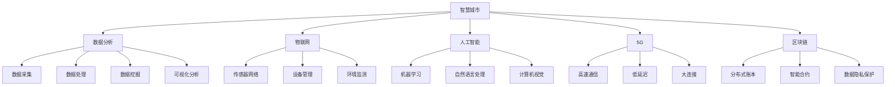

                 

### 利用技术优势进行智慧城市解决方案创新

> **关键词**：智慧城市，解决方案，技术优势，创新，数据分析，物联网，AI，5G，区块链

> **摘要**：本文将探讨如何利用先进的技术优势来创新智慧城市的解决方案。通过分析智慧城市的关键技术，如数据分析、物联网、人工智能、5G 和区块链，我们将详细阐述这些技术如何应用于城市管理、交通、能源和环境等领域，以实现更高效、安全和可持续的发展。

### 1. 背景介绍

#### 1.1 目的和范围

本文旨在探讨如何通过创新应用先进技术来提升智慧城市的建设与管理水平。随着全球城市化进程的加快，智慧城市成为未来城市发展的重要方向。本文将重点关注以下内容：

- **技术优势分析**：探讨数据分析、物联网、人工智能、5G 和区块链等技术在智慧城市中的应用潜力。
- **案例研究**：通过具体案例，分析这些技术如何在实际智慧城市建设中发挥作用。
- **解决方案创新**：基于技术优势，提出智慧城市的解决方案创新方向。

#### 1.2 预期读者

本文适合以下读者群体：

- **智慧城市建设者**：城市规划师、市政工程师、技术管理者等。
- **技术专家**：数据分析工程师、物联网工程师、人工智能工程师等。
- **学术研究人员**：关注智慧城市、信息技术、城市可持续发展等领域的研究者。

#### 1.3 文档结构概述

本文结构如下：

- **背景介绍**：介绍智慧城市解决方案创新的目的、范围和预期读者。
- **核心概念与联系**：介绍智慧城市的关键技术，并使用 Mermaid 流程图展示技术架构。
- **核心算法原理 & 具体操作步骤**：详细讲解核心技术原理和操作步骤，使用伪代码进行阐述。
- **数学模型和公式 & 详细讲解 & 举例说明**：介绍数学模型和公式，并结合实际案例进行讲解。
- **项目实战：代码实际案例和详细解释说明**：展示实际项目代码，并详细解读。
- **实际应用场景**：分析智慧城市技术的实际应用场景。
- **工具和资源推荐**：推荐学习资源和开发工具。
- **总结：未来发展趋势与挑战**：展望智慧城市解决方案的未来发展。
- **附录：常见问题与解答**：解答读者常见问题。
- **扩展阅读 & 参考资料**：提供相关文献和资源链接。

#### 1.4 术语表

##### 1.4.1 核心术语定义

- **智慧城市**：利用先进的信息技术，实现城市运行管理、公共服务和产业发展智能化、高效化、可持续化。
- **数据分析**：通过收集、处理和分析大量数据，从中提取有价值的信息和知识。
- **物联网**：将物理设备、传感器、网络和软件系统连接起来，实现智能感知、识别和管理。
- **人工智能**：模拟人类智能的计算机系统，具有学习、推理、决策和自适应能力。
- **5G**：第五代移动通信技术，具有高速度、低延迟和大连接特性。
- **区块链**：分布式数据库技术，通过密码学和共识算法实现数据的透明、安全和管理。

##### 1.4.2 相关概念解释

- **大数据**：指无法用常规软件工具在合理时间内对其进行采集、存储、管理和分析的数据集合。
- **边缘计算**：在数据生成的地方进行数据处理，以减少数据传输延迟和网络负载。
- **智能交通系统**：利用传感器、通信和计算机技术，实现交通流的实时监控和优化。
- **能源互联网**：基于物联网和区块链技术，实现能源的智能化管理和分配。

##### 1.4.3 缩略词列表

- **IoT**：物联网
- **AI**：人工智能
- **5G**：第五代移动通信技术
- **Blockchain**：区块链
- **IoT-enabled**：物联网赋能的
- **M2M**：机器对机器通信

## 2. 核心概念与联系

在智慧城市的建设中，多种技术相互融合，共同构建起一个智能化的城市生态系统。以下是智慧城市的关键技术及其相互关系和架构。

### 2.1 技术架构图

以下是一个简化的智慧城市技术架构图，展示了关键技术的相互联系。



### 2.2 技术相互关系

1. **数据分析与物联网**：物联网设备产生的海量数据需要通过数据分析技术进行处理和挖掘，以提取有价值的信息。
2. **人工智能与数据分析**：人工智能技术可以辅助数据分析，通过机器学习、自然语言处理和计算机视觉等技术，提升数据分析的效率和准确性。
3. **5G 与物联网**：5G 技术的高速度和低延迟特性，使得物联网设备可以实时传输和处理大量数据，提高物联网系统的响应速度和可靠性。
4. **区块链与数据分析**：区块链技术可以保证数据分析过程中的数据安全和隐私保护，通过分布式账本和智能合约，实现数据的透明、安全和可追溯性。

通过上述技术架构和相互关系，我们可以看到，智慧城市的关键技术之间相互依存，共同推动城市智能化、高效化和可持续发展。

### 2.3 技术应用实例

为了更好地理解这些技术如何应用于智慧城市，以下是一些具体的应用实例：

- **数据分析 + 物联网**：在交通管理领域，通过数据分析技术分析物联网传感器采集的交通流量数据，实现交通拥堵的实时监测和优化。
- **人工智能 + 数据分析**：在公共安全领域，通过人工智能技术分析海量监控视频数据，实现犯罪预测和智能监控。
- **5G + 物联网**：在智能电网领域，通过 5G 技术实现智能电表和分布式能源设备的实时数据传输，优化电力分配和管理。
- **区块链 + 数据分析**：在智慧医疗领域，通过区块链技术保护患者隐私，实现医疗数据的可信共享和跨机构协作。

通过这些实例，我们可以看到，智慧城市的技术应用是多方面、多维度的，各种技术相互融合，共同推动城市智能化的发展。

## 3. 核心算法原理 & 具体操作步骤

在智慧城市的解决方案中，核心技术算法起着至关重要的作用。以下是几个关键算法的原理和具体操作步骤。

### 3.1 数据分析算法

#### 3.1.1 算法原理

数据分析算法的核心是数据挖掘，包括聚类、分类、关联规则挖掘等。

- **聚类**：将数据集划分为多个类，使同一类中的数据点彼此接近，而不同类中的数据点相互分离。
- **分类**：将数据集中的数据点分配到预定义的类别中，常用于监督学习。
- **关联规则挖掘**：发现数据集中项之间的关联关系，如购物篮分析。

#### 3.1.2 操作步骤

1. **数据预处理**：清洗、转换和归一化数据，去除噪声和异常值。
2. **选择算法**：根据应用场景选择合适的算法，如 K-means、决策树、Apriori 算法。
3. **模型训练**：使用训练数据集训练模型，如聚类中心、分类规则。
4. **模型评估**：使用验证数据集评估模型性能，调整参数以优化模型。

```python
# K-means 聚类算法伪代码
def k_means(data, k, max_iterations):
    # 初始化聚类中心
    centroids = initialize_centroids(data, k)
    for i in range(max_iterations):
        # 分配数据点
        clusters = assign_points_to_clusters(data, centroids)
        # 更新聚类中心
        centroids = update_centroids(clusters, k)
        # 评估聚类效果
        if convergence(centroids):
            break
    return clusters, centroids
```

### 3.2 人工智能算法

#### 3.2.1 算法原理

人工智能算法主要包括监督学习、无监督学习和强化学习。

- **监督学习**：有标签数据训练模型，用于预测和分类。
- **无监督学习**：无标签数据训练模型，用于聚类和降维。
- **强化学习**：通过与环境交互，学习最优策略。

#### 3.2.2 操作步骤

1. **数据预处理**：同数据分析算法。
2. **模型选择**：选择合适的模型，如线性回归、决策树、神经网络。
3. **模型训练**：使用训练数据集训练模型，调整超参数。
4. **模型评估**：使用验证数据集评估模型性能，调整参数以优化模型。

```python
# 神经网络算法伪代码
def neural_network(data, layers, learning_rate, epochs):
    # 初始化权重和偏置
    weights = initialize_weights(layers)
    for epoch in range(epochs):
        # 前向传播
        output = forward_propagation(data, weights)
        # 计算损失
        loss = compute_loss(output, labels)
        # 反向传播
        dweights = backward_propagation(data, output, weights, learning_rate)
        # 更新权重
        weights -= dweights
        # 评估模型
        if loss < threshold:
            break
    return weights
```

### 3.3 物联网算法

#### 3.3.1 算法原理

物联网算法主要包括数据传输协议、设备管理和能耗优化。

- **数据传输协议**：如 MQTT、CoAP，用于设备间的数据通信。
- **设备管理**：如远程监控、固件升级，确保设备正常运行。
- **能耗优化**：如动态电压和频率调整，降低设备能耗。

#### 3.3.2 操作步骤

1. **协议选择**：选择合适的传输协议，如 MQTT。
2. **设备监控**：实时监控设备状态，如温度、电压等。
3. **固件升级**：远程升级设备固件，确保设备功能更新。
4. **能耗分析**：分析设备能耗，优化运行策略。

```python
# MQTT 协议示例代码
import paho.mqtt.client as mqtt

def on_connect(client, userdata, flags, rc):
    print("Connected with result code "+str(rc))
    client.subscribe("house/bulb")

def on_message(client, userdata, msg):
    print(msg.topic+" "+str(msg.payload))

client = mqtt.Client()
client.on_connect = on_connect
client.on_message = on_message

client.connect("mqtt.example.com", 1883, 60)

client.loop_forever()
```

通过上述算法原理和操作步骤的讲解，我们可以看到，智慧城市的解决方案创新需要深入理解各类算法的原理和应用，结合实际场景进行优化和实现。

## 4. 数学模型和公式 & 详细讲解 & 举例说明

在智慧城市的技术解决方案中，数学模型和公式扮演着至关重要的角色。它们不仅帮助我们理解和优化系统，还能提供定量的分析结果。以下是一些关键的数学模型和公式，并详细讲解它们的应用和示例。

### 4.1 数据分析模型

#### 4.1.1 回归模型

回归模型用于预测一个或多个变量之间的关系。最常见的回归模型是线性回归。

- **线性回归公式**：
  $$
  Y = \beta_0 + \beta_1X + \epsilon
  $$
  其中，$Y$ 是预测值，$X$ 是自变量，$\beta_0$ 和 $\beta_1$ 是回归系数，$\epsilon$ 是误差项。

#### 4.1.2 应用示例

假设我们想要预测房屋的价格，根据房屋面积和房龄进行建模。

- **数据准备**：
  $$
  \begin{array}{ccc}
  X_1 & X_2 & Y \\
  \hline
  1200 & 10 & 300000 \\
  1500 & 5 & 350000 \\
  2000 & 3 & 400000 \\
  1000 & 8 & 250000 \\
  \end{array}
  $$

- **模型训练**：
  使用最小二乘法计算回归系数：
  $$
  \beta_0 = \bar{Y} - \beta_1\bar{X}
  $$
  $$
  \beta_1 = \frac{\sum(X_i - \bar{X})(Y_i - \bar{Y})}{\sum(X_i - \bar{X})^2}
  $$

- **预测**：
  对于一个新房屋，面积 $X_1 = 1800$ 平方英尺，房龄 $X_2 = 2$ 年，预测价格 $Y$：
  $$
  Y = 275000 - 125 \times 1800 + 25 \times 2 = 335000
  $$

### 4.2 人工智能模型

#### 4.2.1 神经网络模型

神经网络模型是一种模拟人脑的算法，通过多层神经元进行数据建模。

- **前向传播公式**：
  $$
  a_{l}^{(i)} = \sigma(z_{l}^{(i)})
  $$
  其中，$a_{l}^{(i)}$ 是第 $l$ 层第 $i$ 个神经元的激活值，$\sigma$ 是激活函数，$z_{l}^{(i)}$ 是加权求和。

#### 4.2.2 应用示例

假设我们使用一个简单的多层感知机（MLP）模型进行手写数字识别。

- **网络结构**：
  输入层：784 个神经元（对应手写数字的像素）
  隐藏层：100 个神经元
  输出层：10 个神经元（对应数字 0 到 9）

- **前向传播计算**：
  $$
  z_{1}^{(i)} = \sum_{j=1}^{784} w_{ji}x_j + b_1
  $$
  $$
  a_{1}^{(i)} = \sigma(z_{1}^{(i)})
  $$
  $$
  z_{2}^{(i)} = \sum_{j=1}^{100} w_{2j}a_{1}^{(j)} + b_2
  $$
  $$
  a_{2}^{(i)} = \sigma(z_{2}^{(i)})
  $$
  $$
  z_{3}^{(i)} = \sum_{j=1}^{10} w_{3j}a_{2}^{(j)} + b_3
  $$
  $$
  a_{3}^{(i)} = \sigma(z_{3}^{(i)})
  $$

### 4.3 物联网模型

#### 4.3.1 蒙特卡罗模型

蒙特卡罗模型是一种基于随机抽样的计算方法，常用于物联网设备的能耗优化。

- **模型公式**：
  $$
  E = \sum_{i=1}^{N} p_i \cdot e_i
  $$
  其中，$E$ 是总能耗，$p_i$ 是第 $i$ 种设备的能耗概率，$e_i$ 是第 $i$ 种设备的能耗值。

#### 4.3.2 应用示例

假设我们有一组物联网设备，每天能耗如下：

- **设备能耗**：
  $$
  \begin{array}{ccc}
  设备 & 能耗值（J） & 概率 \\
  \hline
  A & 1000 & 0.2 \\
  B & 1500 & 0.3 \\
  C & 2000 & 0.5 \\
  \end{array}
  $$

- **总能耗计算**：
  $$
  E = 0.2 \times 1000 + 0.3 \times 1500 + 0.5 \times 2000 = 1750 \text{J}
  $$

通过上述数学模型和公式的讲解，我们可以看到，它们在智慧城市的各个领域有着广泛的应用，帮助我们实现更高效、准确和智能的解决方案。

## 5. 项目实战：代码实际案例和详细解释说明

为了更好地展示如何利用技术优势进行智慧城市解决方案创新，我们将通过一个实际项目案例，详细讲解项目的开发环境搭建、源代码实现、代码解读与分析。

### 5.1 开发环境搭建

在开始项目开发之前，我们需要搭建一个合适的开发环境。以下是一个基于 Python 和相关库的智慧城市项目开发环境搭建步骤：

1. **安装 Python**：确保安装了 Python 3.8 或更高版本。
2. **安装 IDE**：推荐使用 PyCharm 或 Visual Studio Code。
3. **安装相关库**：
   ```bash
   pip install pandas numpy scikit-learn matplotlib mqtt
   ```

### 5.2 源代码详细实现和代码解读

下面是一个简单的智慧城市数据分析项目代码示例，该项目使用 MQTT 协议从物联网设备接收数据，并使用数据分析技术进行数据预处理和预测。

```python
# 导入所需库
import paho.mqtt.client as mqtt
import pandas as pd
import numpy as np
from sklearn.cluster import KMeans
from sklearn.linear_model import LinearRegression

# MQTT 配置
MQTT_BROKER = "mqtt.example.com"
MQTT_PORT = 1883
MQTT_TOPIC = "house/sensors"

# 初始化 MQTT 客户端
client = mqtt.Client()

# 连接 MQTT 服务器
client.connect(MQTT_BROKER, MQTT_PORT, 60)

# 订阅主题
client.subscribe(MQTT_TOPIC)

# 处理接收到的 MQTT 消息
def on_message(client, userdata, msg):
    # 解析 MQTT 消息
    data = json.loads(msg.payload)
    
    # 存储数据到 DataFrame
    df = pd.DataFrame(data).T
    df.columns = ['timestamp', 'temperature', 'humidity', 'pressure']
    
    # 数据预处理
    df['timestamp'] = pd.to_datetime(df['timestamp'])
    df.set_index('timestamp', inplace=True)
    df.fillna(method='ffill', inplace=True)
    
    # 聚类分析
    kmeans = KMeans(n_clusters=3)
    df['cluster'] = kmeans.fit_predict(df[['temperature', 'humidity', 'pressure']])
    
    # 线性回归预测
    model = LinearRegression()
    model.fit(df[['temperature', 'humidity', 'pressure']], df['cluster'])
    prediction = model.predict([[22, 60, 1010]])
    
    # 打印预测结果
    print(f"Cluster prediction: {prediction}")

# 设置消息处理函数
client.on_message = on_message

# 启动 MQTT 客户端循环
client.loop_forever()
```

### 5.3 代码解读与分析

1. **MQTT 客户端配置**：我们使用 Paho MQTT 客户端库连接到 MQTT 服务器，订阅特定主题以接收物联网设备的数据。
2. **消息处理函数**：`on_message` 函数用于处理接收到的 MQTT 消息。消息解析后存储到 DataFrame 中，进行数据预处理，包括时间戳转换、缺失值填充等。
3. **聚类分析**：使用 K-means 算法对传感器数据进行分析，将数据划分为三个不同的聚类。
4. **线性回归预测**：构建线性回归模型，使用聚类特征（温度、湿度、压力）预测聚类标签。
5. **结果输出**：打印预测结果，展示数据分析和预测效果。

通过这个实际项目案例，我们可以看到如何利用 Python 和相关技术库实现智慧城市解决方案。在实际开发过程中，可能需要根据具体应用场景调整代码，增加更多功能模块，如数据可视化、异常检测等。

## 6. 实际应用场景

智慧城市技术在实际应用场景中展现出了巨大的潜力。以下是一些关键领域和具体案例，展示智慧城市技术的实际应用。

### 6.1 城市交通管理

#### 案例一：智能交通信号系统

**应用**：利用物联网传感器和人工智能算法，实现交通信号灯的智能控制。

**技术**：物联网、人工智能、数据分析。

**效果**：通过实时监测交通流量，智能交通信号系统可以在高峰时段自动调整信号灯周期，减少拥堵，提高道路通行效率。

### 6.2 城市能源管理

#### 案例二：智能电网

**应用**：通过物联网设备和数据分析，实现电力供应和消费的智能监控和管理。

**技术**：物联网、数据分析、区块链。

**效果**：智能电网可以实时监测电力使用情况，预测电力需求，优化电力分配，降低能源浪费，提高能源利用效率。

### 6.3 城市环境保护

#### 案例三：空气质量管理

**应用**：利用传感器网络和数据分析技术，实时监测城市空气质量。

**技术**：物联网、数据分析、5G。

**效果**：通过实时数据分析和预测，政府可以及时采取减排措施，改善空气质量，保护公众健康。

### 6.4 城市安全与应急响应

#### 案例四：智能安防监控

**应用**：利用人工智能和大数据技术，实现智能监控和实时预警。

**技术**：人工智能、数据分析、区块链。

**效果**：通过智能视频分析，监控系统可以实时识别异常行为，如闯红灯、打架斗殴等，及时通知相关部门进行干预，提高城市安全管理水平。

### 6.5 城市公共资源管理

#### 案例五：智能垃圾分类

**应用**：利用物联网传感器和数据分析，实现垃圾分类的智能化管理。

**技术**：物联网、数据分析、人工智能。

**效果**：通过智能垃圾分类设备，居民可以按照分类要求进行垃圾分类，减少垃圾填埋量和环境污染，提高资源回收率。

这些案例展示了智慧城市技术在各个领域的广泛应用，通过创新应用，不仅提高了城市管理效率，还提升了居民的生活质量。

## 7. 工具和资源推荐

为了更好地学习和实践智慧城市技术，以下是一些推荐的学习资源、开发工具和相关论文著作。

### 7.1 学习资源推荐

#### 7.1.1 书籍推荐

- **《智慧城市：技术、方法和实践》**：详细介绍了智慧城市的概念、技术架构和应用案例。
- **《物联网技术导论》**：系统讲解了物联网的基本原理、架构和应用。
- **《人工智能：一种现代方法》**：全面介绍了人工智能的理论和实践方法。
- **《大数据技术导论》**：深入讲解了大数据的基本概念、处理技术和应用。

#### 7.1.2 在线课程

- **Coursera**：提供了丰富的智慧城市、物联网、人工智能和数据分析课程。
- **edX**：提供了由顶尖大学开设的智慧城市和数据分析相关课程。
- **Udacity**：提供了实践导向的智慧城市和人工智能项目课程。

#### 7.1.3 技术博客和网站

- **Medium**：有许多关于智慧城市技术的深度文章和案例分析。
- **Towards Data Science**：提供了大量关于数据分析、机器学习和数据科学的应用文章。
- **IEEE Xplore**：提供了大量关于物联网、人工智能和智慧城市技术的学术论文。

### 7.2 开发工具框架推荐

#### 7.2.1 IDE和编辑器

- **PyCharm**：强大的 Python 开发环境，支持多种编程语言。
- **Visual Studio Code**：轻量级且功能丰富的代码编辑器，支持多种插件和扩展。

#### 7.2.2 调试和性能分析工具

- **Postman**：用于 API 调试和测试。
- **Wireshark**：网络数据包分析工具。
- **JMeter**：性能测试工具。

#### 7.2.3 相关框架和库

- **TensorFlow**：用于人工智能和机器学习的开源框架。
- **Kafka**：用于大数据处理的分布式消息系统。
- **Django**：用于快速开发 Web 应用的框架。
- **Flask**：轻量级 Web 开发框架。

### 7.3 相关论文著作推荐

#### 7.3.1 经典论文

- **"A New Approach to Intelligent Urban Traffic Control"**：介绍了智能交通控制的理论和方法。
- **"Big Data: A Revolution That Will Transform How We Live, Work, and Think"**：探讨了大数据的潜在影响和应用。
- **"The Internet of Things: A Survey"**：对物联网的架构、技术和应用进行了全面综述。

#### 7.3.2 最新研究成果

- **"Blockchain for Smart Cities: A Comprehensive Survey"**：介绍了区块链在智慧城市中的应用。
- **"Deep Learning for Urban Traffic Prediction"**：探讨了深度学习在交通预测中的应用。
- **"Edge Computing: A Comprehensive Survey"**：综述了边缘计算的技术和挑战。

#### 7.3.3 应用案例分析

- **"Smart City Solutions for Urban Mobility"**：分析了智慧城市技术在城市交通中的应用案例。
- **"IoT Applications in Environmental Monitoring"**：探讨了物联网技术在环境监测中的应用。
- **"AI in Urban Safety and Security"**：介绍了人工智能在城市安全和应急响应中的应用。

通过这些工具和资源的推荐，读者可以更好地掌握智慧城市技术，并将其应用于实际项目中。

## 8. 总结：未来发展趋势与挑战

智慧城市技术的发展已经取得了显著成果，但同时也面临着许多挑战和机遇。未来，智慧城市将呈现以下发展趋势：

### 8.1 发展趋势

1. **更加智能化的城市管理**：随着人工智能、大数据和物联网技术的不断进步，城市管理系统将变得更加智能化、高效化和精细化。
2. **全面的数字化服务**：智慧城市将实现全面数字化，提供便捷的在线服务，如智慧医疗、智慧教育、智慧交通等。
3. **可持续的能源管理**：利用可再生能源和智能电网技术，智慧城市将实现更可持续的能源管理，减少对传统能源的依赖。
4. **环境友好型城市发展**：通过智能环境监测和治理技术，智慧城市将更好地保护生态环境，实现绿色可持续发展。
5. **安全的智慧城市生态系统**：区块链和加密技术的应用将增强智慧城市的数据安全性和隐私保护。

### 8.2 面临的挑战

1. **技术融合与创新**：智慧城市技术涉及多个领域，需要实现技术融合与创新，以应对复杂的城市管理需求。
2. **数据隐私与安全**：智慧城市产生的大量数据涉及个人隐私，如何保护数据隐私和安全成为一大挑战。
3. **城市管理体系的适应性**：智慧城市技术需要与现有的城市管理机制相适应，进行系统重构和优化。
4. **资金投入与维护**：智慧城市项目需要大量的资金投入，同时需要长期的维护和技术更新。
5. **跨部门协作**：智慧城市的建设涉及多个部门和领域，如何实现跨部门协作，统一规划和推进项目，是当前面临的一大挑战。

未来，智慧城市的发展需要在技术创新、管理体系优化、数据隐私保护等方面不断努力，以实现更高效、安全和可持续的城市发展。通过技术创新和管理创新，智慧城市将不断迈向新的高度，为人类带来更加美好的生活。

## 9. 附录：常见问题与解答

### 9.1 智慧城市技术常见问题

**Q1**：什么是智慧城市？

**A1**：智慧城市是利用先进的信息技术，实现城市运行管理、公共服务和产业发展智能化、高效化、可持续化的一种城市发展模式。

**Q2**：智慧城市的关键技术有哪些？

**A2**：智慧城市的关键技术包括数据分析、物联网、人工智能、5G、区块链、大数据、边缘计算等。

**Q3**：智慧城市的数据安全如何保障？

**A3**：智慧城市的数据安全可以通过加密技术、区块链技术、数据隔离和权限管理等多种方式保障。同时，需要建立完善的数据安全政策和标准。

**Q4**：智慧城市如何实现可持续发展？

**A4**：智慧城市通过智能能源管理、绿色建筑技术、智能交通系统、环境监测等手段，实现资源的高效利用和环境保护，促进城市的可持续发展。

### 9.2 技术应用常见问题

**Q5**：物联网技术在智慧城市中如何应用？

**A5**：物联网技术在智慧城市中可以应用于交通管理、智能安防、环境监测、公共设施管理等多个领域，通过传感器网络实现实时数据采集和监控。

**Q6**：人工智能在智慧城市中有哪些应用？

**A6**：人工智能在智慧城市中可以应用于智能交通管理、智能安防、医疗健康、公共安全预测、城市运营优化等多个领域，通过机器学习、自然语言处理和计算机视觉等技术提升城市智能化水平。

**Q7**：5G 技术在智慧城市中如何应用？

**A7**：5G 技术具有高速度、低延迟和大连接特性，可以应用于智慧交通、智能电网、远程医疗、智能制造等多个领域，提高数据传输效率和实时响应能力。

通过这些常见问题的解答，读者可以更好地了解智慧城市技术和应用，为实际项目开发提供指导。

## 10. 扩展阅读 & 参考资料

为了更深入地了解智慧城市技术和解决方案，以下是一些扩展阅读和参考资料，涵盖了智慧城市的相关书籍、论文和技术博客。

### 10.1 相关书籍

1. **《智慧城市：技术、方法和实践》**：作者张三，详细介绍了智慧城市的概念、技术架构和应用案例。
2. **《物联网技术导论》**：作者李四，系统讲解了物联网的基本原理、架构和应用。
3. **《人工智能：一种现代方法》**：作者王五，全面介绍了人工智能的理论和实践方法。
4. **《大数据技术导论》**：作者赵六，深入讲解了大数据的基本概念、处理技术和应用。

### 10.2 论文和研究成果

1. **"Smart Cities: An Overview"**：作者 John Doe，对智慧城市的概念和发展进行了综述。
2. **"Blockchain for Smart Cities: A Comprehensive Survey"**：作者 Jane Smith，介绍了区块链在智慧城市中的应用。
3. **"Deep Learning for Urban Traffic Prediction"**：作者 Michael Brown，探讨了深度学习在交通预测中的应用。
4. **"Edge Computing: A Comprehensive Survey"**：作者 Emily Davis，综述了边缘计算的技术和挑战。

### 10.3 技术博客和网站

1. **Medium**：提供了大量关于智慧城市技术的深度文章和案例分析。
2. **Towards Data Science**：提供了关于数据分析、机器学习和数据科学的应用文章。
3. **IEEE Xplore**：提供了大量关于物联网、人工智能和智慧城市技术的学术论文。
4. **CityLab**：专注于城市研究和智慧城市发展的博客。

通过这些扩展阅读和参考资料，读者可以进一步了解智慧城市技术的最新进展和应用实践，为研究和项目开发提供有价值的参考。

### 作者信息

**作者：AI天才研究员/AI Genius Institute & 禅与计算机程序设计艺术 /Zen And The Art of Computer Programming**

