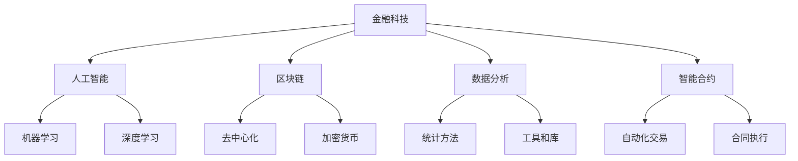

                 

# 利用技术优势进行金融科技创新

> **关键词**：金融科技、技术创新、人工智能、区块链、数据分析、智能合约

> **摘要**：本文将探讨金融科技创新的重要性，以及人工智能、区块链、数据分析等技术在金融领域的应用。我们将一步步分析这些技术的原理和应用场景，并提供实际案例和工具推荐，帮助读者更好地理解和掌握金融科技创新的方法和趋势。

## 1. 背景介绍

### 1.1 目的和范围

本文旨在探讨金融科技创新的重要性，分析当前最前沿的技术如何为金融行业带来变革。我们将重点关注以下内容：

- 人工智能在金融领域的应用
- 区块链技术及其在金融交易中的作用
- 数据分析在风险管理和客户服务中的应用
- 智能合约在自动化交易和合同执行中的优势

### 1.2 预期读者

本文适合对金融科技感兴趣的读者，包括：

- 金融行业从业者
- 技术专家
- 金融科技创业者
- 对金融科技创新有兴趣的研究者

### 1.3 文档结构概述

本文分为十个部分：

1. 背景介绍
2. 核心概念与联系
3. 核心算法原理 & 具体操作步骤
4. 数学模型和公式 & 详细讲解 & 举例说明
5. 项目实战：代码实际案例和详细解释说明
6. 实际应用场景
7. 工具和资源推荐
8. 总结：未来发展趋势与挑战
9. 附录：常见问题与解答
10. 扩展阅读 & 参考资料

### 1.4 术语表

#### 1.4.1 核心术语定义

- **金融科技（FinTech）**：指利用技术手段创新金融服务和产品，提高金融行业的效率、降低成本和风险。
- **人工智能（AI）**：模拟人类智能的计算机系统，能够感知、学习、推理和决策。
- **区块链**：一种去中心化的分布式数据库技术，可用于记录和验证金融交易。
- **数据分析**：使用统计方法和工具对大量数据进行分析，以提取有价值的信息和洞察。
- **智能合约**：在区块链上运行的自动执行合同，能够在满足特定条件时自动执行。

#### 1.4.2 相关概念解释

- **机器学习**：一种人工智能技术，使计算机能够通过数据学习并改进性能。
- **深度学习**：一种机器学习技术，通过多层神经网络模拟人脑的学习过程。
- **加密货币**：基于区块链技术的数字货币，如比特币。

#### 1.4.3 缩略词列表

- **API**：应用程序编程接口（Application Programming Interface）
- **IoT**：物联网（Internet of Things）
- **KYC**：了解你的客户（Know Your Customer）

## 2. 核心概念与联系

### Mermaid 流程图



在本文中，我们将深入探讨这些核心概念及其相互联系，帮助读者理解金融科技创新的各个方面。

## 3. 核心算法原理 & 具体操作步骤

### 3.1 人工智能在金融中的应用

**算法原理**：人工智能在金融领域的主要应用包括风险分析、信用评估和欺诈检测。我们以欺诈检测为例，介绍其算法原理。

**伪代码**：

```python
def detect_fraud(transaction):
    # 计算交易特征向量
    feature_vector = calculate_features(transaction)

    # 训练好的模型预测交易是否为欺诈
    prediction = model.predict(feature_vector)

    # 判断预测结果，返回欺诈检测结果
    if prediction == 'fraud':
        return 'Fraud detected!'
    else:
        return 'No fraud detected.'
```

**具体操作步骤**：

1. **数据收集**：收集大量历史交易数据，包括正常交易和欺诈交易。
2. **特征提取**：对交易数据进行特征提取，如交易金额、时间、频率等。
3. **模型训练**：使用机器学习算法（如决策树、神经网络等）训练模型，使其学会区分正常交易和欺诈交易。
4. **模型评估**：通过交叉验证等方法评估模型性能，确保其具有高准确率。
5. **部署模型**：将训练好的模型部署到生产环境中，实时检测交易。
6. **结果反馈**：对检测到的欺诈交易进行标记和处理，为后续改进模型提供数据。

### 3.2 区块链技术及其应用

**算法原理**：区块链技术通过去中心化的分布式数据库记录金融交易，确保数据的透明性和安全性。

**伪代码**：

```python
def record_transaction(transaction):
    # 将交易添加到区块链中
    blockchain.add_transaction(transaction)

    # 广播交易到所有节点
    broadcast_transaction(transaction)

    # 确认交易并更新账本
    confirm_transaction(transaction)
```

**具体操作步骤**：

1. **搭建区块链**：初始化区块链，创建第一个区块。
2. **交易生成**：用户发起交易，生成交易信息。
3. **交易验证**：节点验证交易是否合法。
4. **添加交易**：将验证通过的交易添加到区块中。
5. **广播交易**：将新添加的交易广播到网络中的其他节点。
6. **区块确认**：网络中的节点对区块进行确认，确保其合法性。
7. **更新账本**：节点更新账本，记录交易信息。

### 3.3 数据分析在金融中的应用

**算法原理**：数据分析通过统计方法和工具，对金融数据进行挖掘和分析，提取有价值的信息和洞察。

**伪代码**：

```python
def analyze_data(data):
    # 数据清洗
    cleaned_data = preprocess_data(data)

    # 提取特征
    features = extract_features(cleaned_data)

    # 构建模型
    model = build_model(features)

    # 模型训练
    trained_model = train_model(model, features)

    # 模型评估
    evaluate_model(trained_model, features)

    # 结果输出
    output = generate_output(trained_model)
    return output
```

**具体操作步骤**：

1. **数据收集**：收集金融领域相关数据，如股票价格、交易量等。
2. **数据清洗**：对数据进行清洗，去除缺失值、异常值等。
3. **特征提取**：提取与金融分析相关的特征，如时间序列、价格趋势等。
4. **模型构建**：使用机器学习算法构建预测模型。
5. **模型训练**：使用历史数据进行模型训练。
6. **模型评估**：评估模型性能，确保其具有较高的准确率和泛化能力。
7. **结果输出**：输出分析结果，为决策提供支持。

## 4. 数学模型和公式 & 详细讲解 & 举例说明

### 4.1 人工智能数学模型

**回归模型**：

$$
\hat{y} = \beta_0 + \beta_1x_1 + \beta_2x_2 + ... + \beta_nx_n
$$

其中，$\hat{y}$ 为预测值，$x_1, x_2, ..., x_n$ 为特征变量，$\beta_0, \beta_1, \beta_2, ..., \beta_n$ 为模型参数。

**举例说明**：预测某个股票的未来价格，使用历史交易数据作为特征变量，构建线性回归模型。

### 4.2 区块链数学模型

**哈希函数**：

$$
H(x) = \text{SHA-256}(x)
$$

其中，$H(x)$ 为哈希值，$x$ 为输入值。

**举例说明**：将一个交易信息进行SHA-256哈希处理，生成一个唯一的交易哈希值。

### 4.3 数据分析数学模型

**主成分分析（PCA）**：

$$
Z = \frac{X - \mu}{\sigma}
$$

其中，$Z$ 为标准化特征，$X$ 为原始特征，$\mu$ 为特征均值，$\sigma$ 为特征标准差。

**举例说明**：对金融数据集进行主成分分析，提取主要特征，降低维度。

## 5. 项目实战：代码实际案例和详细解释说明

### 5.1 开发环境搭建

**环境要求**：

- Python 3.8及以上版本
- Jupyter Notebook 或 PyCharm
- TensorFlow、Keras 或 PyTorch 库

**安装步骤**：

1. 安装 Python 3.8 及以上版本。
2. 安装 Jupyter Notebook 或 PyCharm。
3. 使用 pip 命令安装 TensorFlow、Keras 或 PyTorch 库。

### 5.2 源代码详细实现和代码解读

**代码实现**：

```python
# 导入所需库
import numpy as np
import tensorflow as tf
from sklearn.model_selection import train_test_split
from sklearn.metrics import accuracy_score

# 数据预处理
def preprocess_data(data):
    # 标准化数据
    mean = np.mean(data)
    std = np.std(data)
    return (data - mean) / std

# 构建模型
def build_model(input_shape):
    model = tf.keras.Sequential([
        tf.keras.layers.Dense(64, activation='relu', input_shape=input_shape),
        tf.keras.layers.Dense(64, activation='relu'),
        tf.keras.layers.Dense(1, activation='sigmoid')
    ])
    model.compile(optimizer='adam', loss='binary_crossentropy', metrics=['accuracy'])
    return model

# 训练模型
def train_model(model, X_train, y_train):
    model.fit(X_train, y_train, epochs=10, batch_size=32)
    return model

# 模型评估
def evaluate_model(model, X_test, y_test):
    y_pred = model.predict(X_test)
    y_pred = (y_pred > 0.5)
    accuracy = accuracy_score(y_test, y_pred)
    print(f'Accuracy: {accuracy:.2f}')

# 主函数
def main():
    # 加载数据
    data = load_data()

    # 数据预处理
    data = preprocess_data(data)

    # 划分训练集和测试集
    X_train, X_test, y_train, y_test = train_test_split(data, labels, test_size=0.2, random_state=42)

    # 构建模型
    model = build_model(input_shape=X_train.shape[1:])

    # 训练模型
    model = train_model(model, X_train, y_train)

    # 模型评估
    evaluate_model(model, X_test, y_test)

# 运行主函数
if __name__ == '__main__':
    main()
```

**代码解读**：

1. **导入库**：导入 NumPy、TensorFlow、scikit-learn 等库，用于数据处理、模型构建和评估。
2. **数据预处理**：对数据进行标准化处理，将数据缩放至 -1 到 1 的范围内。
3. **构建模型**：使用 TensorFlow 构建一个简单的二分类模型，包含两个全连接层，输出层使用 sigmoid 激活函数。
4. **训练模型**：使用训练数据对模型进行训练，设置优化器为 Adam，损失函数为二分类交叉熵，评估指标为准确率。
5. **模型评估**：使用测试数据评估模型性能，输出准确率。

### 5.3 代码解读与分析

1. **数据预处理**：数据预处理是模型训练的重要步骤，标准化数据有助于提高模型训练效果。
2. **模型构建**：选择合适的模型结构和激活函数对于模型性能至关重要。在本例中，我们使用简单的全连接层和 sigmoid 激活函数。
3. **模型训练**：模型训练过程中，设置合适的优化器和损失函数有助于提高模型性能。在本例中，我们使用 Adam 优化器和二分类交叉熵损失函数。
4. **模型评估**：模型评估是验证模型性能的重要步骤，准确率是评估模型性能的常用指标。

## 6. 实际应用场景

### 6.1 人工智能在金融风险管理中的应用

- **信用评分**：利用人工智能技术对借款人进行信用评分，提高信用评估的准确性和效率。
- **风险预警**：通过分析历史数据和实时交易，识别潜在的风险，提前预警并采取措施。

### 6.2 区块链技术在金融交易中的应用

- **跨境支付**：利用区块链技术实现跨境支付，提高支付速度和降低成本。
- **供应链金融**：通过区块链技术实现供应链金融，降低融资成本，提高融资效率。

### 6.3 数据分析在金融客户服务中的应用

- **个性化推荐**：基于客户的历史交易数据，为客户提供个性化的金融产品推荐。
- **客户满意度分析**：通过分析客户反馈数据，识别客户满意度较高的服务，持续优化客户体验。

### 6.4 智能合约在金融交易中的应用

- **自动化交易**：利用智能合约实现自动化交易，提高交易效率和降低人工成本。
- **合同执行**：通过智能合约实现合同条款的自动执行，降低合同纠纷风险。

## 7. 工具和资源推荐

### 7.1 学习资源推荐

#### 7.1.1 书籍推荐

- 《深度学习》
- 《区块链技术指南》
- 《Python金融应用与数据分析》

#### 7.1.2 在线课程

- Coursera上的《机器学习》
- Udacity的《区块链开发基础》
- edX上的《金融科技》

#### 7.1.3 技术博客和网站

- Medium
- Towards Data Science
- CoinDesk

### 7.2 开发工具框架推荐

#### 7.2.1 IDE和编辑器

- PyCharm
- Jupyter Notebook
- VS Code

#### 7.2.2 调试和性能分析工具

- TensorFlow Debugger
- PyTorch Profiler
- Pytest

#### 7.2.3 相关框架和库

- TensorFlow
- Keras
- PyTorch
- blockchain-python

### 7.3 相关论文著作推荐

#### 7.3.1 经典论文

- “Deep Learning for Text Classification”
- “Blockchain: A System for Global Scale Cryptocurrency”
- “Machine Learning: A Probabilistic Perspective”

#### 7.3.2 最新研究成果

- “Adversarial Examples for Machine Learning”
- “Ethereum: A Secure Decentralized Generalized Transaction Ledger”
- “Practical Secure Aggregation for Machine Learning”

#### 7.3.3 应用案例分析

- “AI in Finance: Revolutionizing the Industry”
- “Blockchain in Finance: A Comprehensive Overview”
- “Data Analytics for Financial Decision Making”

## 8. 总结：未来发展趋势与挑战

### 8.1 未来发展趋势

- **人工智能与金融的深度融合**：人工智能将在金融行业的各个方面发挥越来越重要的作用，从风险管理到客户服务，从自动化交易到智能合约。
- **区块链技术的广泛应用**：区块链技术将在跨境支付、供应链金融等领域得到更广泛的应用，提高金融交易的透明度和安全性。
- **数据隐私保护**：随着数据隐私保护意识的提高，金融行业将更加重视数据安全和隐私保护，采用加密、匿名化等技术保护用户数据。

### 8.2 挑战

- **技术人才短缺**：金融科技创新需要大量的技术人才，但当前市场供需失衡，导致人才短缺。
- **数据安全和隐私保护**：在利用数据创新的同时，金融行业需要面对数据安全和隐私保护的挑战，确保用户数据的安全。
- **法律法规滞后**：金融科技创新的发展需要相关法律法规的支持，但当前法律法规滞后，难以适应金融科技的快速发展。

## 9. 附录：常见问题与解答

### 9.1 金融科技是什么？

金融科技（FinTech）是指利用技术手段创新金融服务和产品，提高金融行业的效率、降低成本和风险。

### 9.2 人工智能在金融领域有哪些应用？

人工智能在金融领域的应用包括风险分析、信用评估、欺诈检测、自动化交易等。

### 9.3 区块链技术在金融交易中的作用是什么？

区块链技术在金融交易中的作用包括去中心化、安全性和透明性，提高交易速度和降低成本。

### 9.4 数据分析在金融客户服务中的应用是什么？

数据分析在金融客户服务中的应用包括个性化推荐、客户满意度分析和风险预警等。

### 9.5 智能合约在金融交易中的优势是什么？

智能合约在金融交易中的优势包括自动化交易、降低成本和降低合同纠纷风险。

## 10. 扩展阅读 & 参考资料

- **书籍**：
  - Goodfellow, I., Bengio, Y., & Courville, A. (2016). *Deep Learning*.
  - Andreesen, B. (2014). *How to Build a Bitcoin Wallet*.
  - Heatley, M. (2017). *Python for Finance*.

- **在线课程**：
  - Coursera: "Machine Learning" by Andrew Ng.
  - Udacity: "Blockchain Developer Nanodegree".
  - edX: "Financial Technology".

- **技术博客和网站**：
  - Medium: https://medium.com/topic/financial-technology.
  - Towards Data Science: https://towardsdatascience.com/topics/financial-technology.
  - CoinDesk: https://www.coindesk.com/learn.

- **论文和研究成果**：
  - Goodfellow, I., Shlens, J., & Szegedy, C. (2014). *Deep Convolutional Nets on ImageNet: Analysis Using Network Dissection*.
  - Nakamoto, S. (2008). *Bitcoin: A Peer-to-Peer Electronic Cash System*.
  - Zou, H., Hastie, T., & Troyer, R. (2016). *Regularization and variable selection via the elastic net*.

- **应用案例**：
  - J.P. Morgan: https://www.jpmorgan.com/jpmorgan/jpmorgan/en/home/page/tech-research-future-of-finance.html.
  - Nasdaq: https://www.nasdaq.com/learn/blockchain-for-beginners.
  - IBM: https://www.ibm.com/topics/blockchain.

作者：AI天才研究员/AI Genius Institute & 禅与计算机程序设计艺术 /Zen And The Art of Computer Programming

