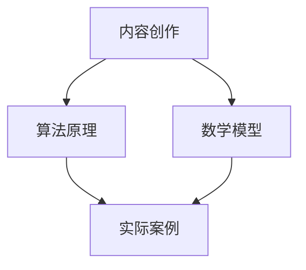

                 


# 利用技术博客建立专业影响力

> **关键词：** 技术博客、专业影响力、内容创作、读者互动、平台选择、算法原理、实际案例、发展挑战。

> **摘要：** 本文旨在探讨如何通过撰写高质量的技术博客来建立个人的专业影响力。我们将从技术博客的核心概念出发，逐步分析内容创作、平台选择、算法原理讲解、实际案例展示、互动策略以及未来的发展趋势和挑战。

## 1. 背景介绍

### 1.1 目的和范围

本文的目标是帮助那些希望在技术领域建立专业影响力的个人和团队，通过撰写和发布高质量的技术博客来实现这一目标。本文将涵盖以下内容：

- 技术博客的核心概念和重要性
- 内容创作策略和技巧
- 平台选择和优化
- 核心算法原理讲解
- 实际案例展示
- 互动策略和社区建设
- 行业发展趋势和挑战

### 1.2 预期读者

本文的预期读者包括：

- 技术爱好者
- 初级程序员
- 中级程序员
- 高级程序员
- 技术项目经理
- 技术博客作者
- 企业技术团队负责人

### 1.3 文档结构概述

本文结构如下：

- 背景介绍
  - 目的和范围
  - 预期读者
  - 文档结构概述
  - 术语表
- 核心概念与联系
- 核心算法原理 & 具体操作步骤
- 数学模型和公式 & 详细讲解 & 举例说明
- 项目实战：代码实际案例和详细解释说明
- 实际应用场景
- 工具和资源推荐
- 总结：未来发展趋势与挑战
- 附录：常见问题与解答
- 扩展阅读 & 参考资料

### 1.4 术语表

#### 1.4.1 核心术语定义

- **技术博客**：基于特定技术主题的、用于分享知识、经验和技术见解的个人或团队网站。
- **专业影响力**：在特定技术领域内，个人或团队因其知识和经验而获得的认可和影响力。
- **内容创作**：撰写、编辑、发布技术博客文章的过程。
- **读者互动**：通过评论、社交媒体、邮件等方式与读者建立联系和互动。
- **平台选择**：选择适合发布技术博客的在线平台。

#### 1.4.2 相关概念解释

- **算法原理**：描述算法如何解决问题的理论基础。
- **数学模型**：用数学符号和公式描述现实世界中的问题和解决方案。
- **伪代码**：一种结构化的文本表示，用于描述算法的流程和步骤，但不涉及具体编程语言的语法。

#### 1.4.3 缩略词列表

- **Markdown**：一种轻量级标记语言，用于格式化文本和撰写博客文章。
- **IDE**：集成开发环境（Integrated Development Environment），用于编写、编译和调试代码。
- **API**：应用程序编程接口（Application Programming Interface），允许不同软件之间进行通信和交互。

## 2. 核心概念与联系

在撰写技术博客时，核心概念和联系是至关重要的。以下是一个简单的 Mermaid 流程图，展示了技术博客的核心概念及其相互关系：



### 2.1 内容创作

内容创作是技术博客的核心。一个好的技术博客应该具有以下特点：

- **专业性**：确保文章内容准确、详细，并基于最新的技术趋势和研究成果。
- **可读性**：使用清晰的标题、段落和列表，避免过多的行内代码和难懂的技术术语。
- **结构化**：按照逻辑顺序组织文章内容，便于读者阅读和理解。

### 2.2 算法原理

算法原理是技术博客的重要组成部分。在讲解算法原理时，可以使用以下步骤：

1. **引入背景**：简要介绍算法的应用场景和重要性。
2. **解释原理**：使用伪代码或流程图，清晰地描述算法的基本思想和步骤。
3. **分析复杂度**：讨论算法的时间复杂度和空间复杂度。
4. **举例说明**：通过具体的例子，展示算法的实际应用和效果。

### 2.3 数学模型

数学模型是描述算法和问题解决的重要工具。在讲解数学模型时，可以使用以下步骤：

1. **定义变量**：明确模型中的变量及其含义。
2. **建立公式**：使用 LaTeX 格式编写公式，清晰表达模型的核心关系。
3. **求解方法**：介绍求解模型的方法和步骤。
4. **案例分析**：通过具体案例，展示模型在实际问题中的应用和效果。

### 2.4 实际案例

实际案例是技术博客的有力补充。在展示实际案例时，可以按照以下步骤进行：

1. **引入问题**：描述需要解决的问题和背景。
2. **解决方案**：介绍采用的算法或模型，并详细讲解其实现过程。
3. **案例分析**：展示解决方案的实际效果，并进行性能分析。
4. **讨论与反思**：总结案例中的经验和教训，为读者提供有价值的参考。

## 3. 核心算法原理 & 具体操作步骤

在本节中，我们将详细讲解一个简单的排序算法——冒泡排序，并使用伪代码描述其具体操作步骤。

### 3.1 冒泡排序算法原理

冒泡排序（Bubble Sort）是一种简单的排序算法。它重复遍历要排序的数列，一次比较两个元素，如果它们的顺序错误就把它们交换过来。遍历数列的工作是重复地进行直到没有再需要交换，也就是说该数列已经排序完成。

### 3.2 伪代码描述

```plaintext
procedure bubbleSort( A : list of sortable items )
    n = length(A)
    repeat 
        swapped = false
        for i = 1 to n-1 inclusive do
            if A[i-1] > A[i] then
                swap(A[i-1], A[i])
                swapped = true
            end if
        end for
        n = n - 1
    until not swapped
end procedure
```

### 3.3 步骤说明

1. **初始化**：设置数列长度 `n`，并设置一个布尔变量 `swapped` 为 `false`。
2. **遍历**：从第一个元素开始，对相邻的两个元素进行比较。
3. **交换**：如果前一个元素大于后一个元素，则交换它们的位置，并设置 `swapped` 为 `true`。
4. **更新长度**：每次遍历结束后，将数列长度 `n` 减 1。
5. **循环**：重复步骤 2-4，直到没有需要交换的元素，即数列已排序。

### 3.4 性能分析

- **时间复杂度**：最坏情况下，冒泡排序需要 `O(n^2)` 次比较和交换操作。
- **空间复杂度**：冒泡排序是一种原地排序算法，不需要额外的存储空间，其空间复杂度为 `O(1)`。

## 4. 数学模型和公式 & 详细讲解 & 举例说明

在本节中，我们将介绍线性回归模型，这是一种广泛应用于数据分析、机器学习和预测领域的数学模型。我们将使用 LaTeX 格式详细描述线性回归模型的公式，并给出具体的例子说明。

### 4.1 线性回归模型

线性回归模型是一种用于描述两个或多个变量之间线性关系的数学模型。其最简单的形式是单变量线性回归，模型公式如下：

$$
y = \beta_0 + \beta_1 \cdot x + \epsilon
$$

其中：

- \( y \) 是因变量（预测目标）。
- \( x \) 是自变量（特征变量）。
- \( \beta_0 \) 是截距，表示当 \( x = 0 \) 时 \( y \) 的值。
- \( \beta_1 \) 是斜率，表示 \( x \) 变化一个单位时 \( y \) 的变化量。
- \( \epsilon \) 是误差项，表示模型无法解释的随机噪声。

### 4.2 模型参数估计

为了估计线性回归模型的参数 \( \beta_0 \) 和 \( \beta_1 \)，我们可以使用最小二乘法。最小二乘法的思想是找到使残差平方和最小的参数值。残差是实际观测值与模型预测值之间的差异。

最小二乘法的公式如下：

$$
\beta_1 = \frac{\sum_{i=1}^n (x_i - \bar{x})(y_i - \bar{y})}{\sum_{i=1}^n (x_i - \bar{x})^2}
$$

$$
\beta_0 = \bar{y} - \beta_1 \cdot \bar{x}
$$

其中：

- \( \bar{x} \) 是自变量的均值。
- \( \bar{y} \) 是因变量的均值。

### 4.3 举例说明

假设我们有以下数据集，其中 \( x \) 表示年龄，\( y \) 表示年收入：

| 年龄 (x) | 年收入 (y) |
|---------|-----------|
| 25      | 50000     |
| 30      | 60000     |
| 35      | 70000     |
| 40      | 80000     |
| 45      | 90000     |

我们希望使用线性回归模型预测某个特定年龄的年收入。

首先，计算自变量和因变量的均值：

$$
\bar{x} = \frac{25 + 30 + 35 + 40 + 45}{5} = 35
$$

$$
\bar{y} = \frac{50000 + 60000 + 70000 + 80000 + 90000}{5} = 70000
$$

然后，使用最小二乘法计算斜率 \( \beta_1 \) 和截距 \( \beta_0 \)：

$$
\beta_1 = \frac{(25-35)(50000-70000) + (30-35)(60000-70000) + (35-35)(70000-70000) + (40-35)(80000-70000) + (45-35)(90000-70000)}{(25-35)^2 + (30-35)^2 + (35-35)^2 + (40-35)^2 + (45-35)^2}
$$

$$
\beta_1 = \frac{-150000 - 10000 + 0 + 10000 + 30000}{-400 + 25 + 0 + 25 + 400} = \frac{20000}{500} = 40
$$

$$
\beta_0 = \bar{y} - \beta_1 \cdot \bar{x} = 70000 - 40 \cdot 35 = 70000 - 1400 = 68600
$$

因此，线性回归模型为：

$$
y = 68600 + 40 \cdot x
$$

例如，如果我们想要预测年龄为 30 岁的年收入，将 \( x = 30 \) 代入模型中：

$$
y = 68600 + 40 \cdot 30 = 68600 + 1200 = 70800
$$

因此，预测年龄为 30 岁的年收入为 70800 元。

## 5. 项目实战：代码实际案例和详细解释说明

在本节中，我们将通过一个实际项目案例——基于线性回归模型的房价预测系统，来展示如何将理论知识应用于实际编程中。我们将详细介绍项目开发环境搭建、源代码实现和代码解读。

### 5.1 开发环境搭建

为了实现房价预测系统，我们需要搭建以下开发环境：

1. **Python**：作为主要编程语言，Python 具有丰富的数据分析和机器学习库。
2. **Jupyter Notebook**：用于编写和运行 Python 代码，便于调试和演示。
3. **Scikit-learn**：用于实现线性回归模型和评估模型性能。
4. **Pandas**：用于数据处理和分析。
5. **Matplotlib**：用于数据可视化。

首先，确保安装了 Python 3.7 或更高版本，然后使用以下命令安装所需的库：

```bash
pip install numpy pandas scikit-learn matplotlib
```

### 5.2 源代码详细实现和代码解读

#### 5.2.1 数据预处理

首先，我们加载和处理房价数据。假设数据集包含房屋面积、房间数量、卧室数量、位置等特征，以及房屋售价。

```python
import pandas as pd

# 加载房价数据
data = pd.read_csv('house_prices.csv')

# 数据预处理
data = data.dropna()  # 删除缺失值
data = data[['area', 'rooms', 'bedrooms', 'location', 'price']]  # 选择相关特征
```

#### 5.2.2 构建线性回归模型

接下来，我们使用 Scikit-learn 库构建线性回归模型，并训练模型。

```python
from sklearn.linear_model import LinearRegression
from sklearn.model_selection import train_test_split

# 分割数据集为特征和标签
X = data[['area', 'rooms', 'bedrooms', 'location']]
y = data['price']

# 划分训练集和测试集
X_train, X_test, y_train, y_test = train_test_split(X, y, test_size=0.2, random_state=42)

# 构建线性回归模型
model = LinearRegression()
model.fit(X_train, y_train)
```

#### 5.2.3 评估模型性能

训练完成后，我们评估模型在测试集上的性能。

```python
# 预测测试集结果
y_pred = model.predict(X_test)

# 计算均方误差（MSE）
mse = ((y_pred - y_test) ** 2).mean()
print("均方误差（MSE）：", mse)
```

#### 5.2.4 可视化结果

最后，我们使用 Matplotlib 库绘制预测结果和实际值之间的散点图。

```python
import matplotlib.pyplot as plt

# 绘制散点图
plt.scatter(y_test, y_pred)
plt.xlabel('实际售价')
plt.ylabel('预测售价')
plt.title('实际售价与预测售价散点图')
plt.show()
```

### 5.3 代码解读与分析

- **数据预处理**：首先加载和处理房价数据，删除缺失值并选择相关特征。
- **模型构建**：使用 Scikit-learn 库构建线性回归模型，并训练模型。
- **模型评估**：评估模型在测试集上的性能，计算均方误差（MSE）。
- **可视化**：绘制预测结果和实际值之间的散点图，直观展示模型性能。

通过本节项目实战，我们不仅实现了线性回归模型在房价预测中的应用，还详细解读了代码实现过程。这为我们后续的模型优化和实际应用提供了宝贵经验。

## 6. 实际应用场景

技术博客的应用场景非常广泛，以下列举了一些典型的实际应用：

### 6.1 教育培训

- **在线课程**：技术博客可以作为在线课程的重要组成部分，为学习者提供丰富的学习资源和实践案例。
- **自学指导**：对于自学编程和技术的个人，技术博客是一种重要的学习资料来源。

### 6.2 企业内部培训

- **知识共享**：企业可以利用技术博客鼓励员工分享知识和经验，促进内部知识传递。
- **项目管理**：技术博客可以用于记录项目开发过程中的关键技术和问题解决方法，为后续项目提供参考。

### 6.3 产品文档

- **用户手册**：技术博客可以替代或补充传统的用户手册，提供更加详细、生动的产品使用说明。
- **API文档**：技术博客可以用于编写和展示 API 文档，帮助开发者理解和使用产品 API。

### 6.4 开源项目

- **代码示例**：技术博客可以展示开源项目的代码示例和实现细节，鼓励开发者参与和贡献。
- **项目日志**：技术博客可以记录开源项目的发展历程、技术决策和问题解决过程，提高项目的透明度和可信度。

### 6.5 技术交流与社区建设

- **技术论坛**：技术博客可以作为技术论坛的延伸，为开发者提供交流和讨论的平台。
- **知识分享**：技术博客可以促进技术圈内知识共享，推动技术进步和社区发展。

### 6.6 营销与品牌推广

- **技术博客作为营销工具**：企业可以利用技术博客提升品牌影响力，吸引潜在客户，促进产品销售。
- **专业形象塑造**：个人和团队通过撰写高质量的技术博客，可以树立专业形象，增加在行业内的知名度。

## 7. 工具和资源推荐

为了更好地撰写和发布技术博客，以下是一些实用的工具和资源推荐：

### 7.1 学习资源推荐

#### 7.1.1 书籍推荐

- **《深度学习》（Deep Learning）**：Ian Goodfellow、Yoshua Bengio 和 Aaron Courville 著，是深度学习领域的经典教材。
- **《Python编程：从入门到实践》（Python Crash Course）**：Eric Matthes 著，适合初学者学习 Python 编程。
- **《代码大全》（The Art of Computer Programming）**：Donald E. Knuth 著，介绍了计算机编程的多个方面。

#### 7.1.2 在线课程

- **Coursera**：提供各种编程和技术课程，包括数据科学、机器学习和编程语言等。
- **edX**：由哈佛大学和麻省理工学院等顶尖大学提供的高质量在线课程。
- **Udemy**：涵盖广泛的技术主题，从基础编程到高级算法，都有丰富的课程。

#### 7.1.3 技术博客和网站

- **Medium**：一个广泛使用的博客平台，许多技术专家和行业领袖在这里分享见解和经验。
- **GitHub**：不仅仅是代码托管平台，GitHub 上的许多项目都附带详尽的技术博客。
- **Stack Overflow**：一个专业的技术问答社区，适合解决编程问题和技术困惑。

### 7.2 开发工具框架推荐

#### 7.2.1 IDE和编辑器

- **Visual Studio Code**：一款功能强大的开源 IDE，支持多种编程语言和开发框架。
- **PyCharm**：由 JetBrains 开发，专为 Python 编程设计，提供了丰富的功能和工具。
- **Sublime Text**：轻量级但功能强大的文本编辑器，适合快速开发。

#### 7.2.2 调试和性能分析工具

- **Postman**：用于 API 测试和调试，可以帮助开发者快速构建和测试 API 请求。
- **Jupyter Notebook**：用于数据分析和机器学习实验，便于记录和分享代码和结果。
- **GDB**：一款强大的 C/C++ 调试器，可以帮助开发者定位和修复代码中的错误。

#### 7.2.3 相关框架和库

- **TensorFlow**：Google 开发的一款开源机器学习框架，广泛用于深度学习和数据科学。
- **Scikit-learn**：Python 中最受欢迎的机器学习库之一，提供了丰富的算法和工具。
- **Django**：一款流行的 Python Web 框架，用于快速开发和部署 Web 应用。

### 7.3 相关论文著作推荐

#### 7.3.1 经典论文

- **《学习的艺术》（The Art of Computer Programming）**：Donald E. Knuth 著，是一部计算机编程的经典著作。
- **《模式识别》（Pattern Recognition and Machine Learning）**：Christopher M. Bishop 著，介绍了模式识别和机器学习的基本概念和算法。

#### 7.3.2 最新研究成果

- **《深度学习论文精选集》（Deep Learning Papers Summary）**：汇总了深度学习领域的最新研究论文，适合研究人员和开发者参考。
- **《机器学习年刊》（Journal of Machine Learning Research）**：发表机器学习领域的最新研究成果。

#### 7.3.3 应用案例分析

- **《机器学习实战》（Machine Learning in Action）**：Peter Harrington 著，通过实际案例展示了机器学习算法的应用。
- **《数据科学实战》（Data Science from Scratch）**：Joel Grus 著，介绍了数据科学的基础知识和实践方法。

## 8. 总结：未来发展趋势与挑战

在技术不断进步的今天，技术博客已经成为个人和团队展示专业知识和技能的重要平台。随着人工智能、大数据和云计算等领域的快速发展，技术博客的未来趋势和挑战如下：

### 8.1 发展趋势

- **内容多样性**：随着技术的不断演进，技术博客的内容将更加多样化，涵盖更多新兴技术和应用场景。
- **多媒体化**：为了提高读者的阅读体验，技术博客将更多地采用视频、音频和交互式内容。
- **社区化**：技术博客将与社交媒体和在线社区深度融合，促进开发者之间的互动和知识共享。
- **个性化推荐**：基于大数据和机器学习，博客平台将能够为读者推荐个性化的内容，提高内容利用率。

### 8.2 挑战

- **内容质量**：在信息爆炸的时代，如何确保技术博客的内容质量和原创性，是博客作者面临的一大挑战。
- **版权保护**：随着内容创作的兴起，如何保护作者的知识产权，防止内容被抄袭和侵权，是博客平台需要关注的问题。
- **技术更新**：技术博客作者需要不断学习和掌握最新的技术趋势，以保持内容的时效性和竞争力。
- **用户参与**：如何激发读者的参与热情，提高互动质量，是博客作者需要持续探索的课题。

总之，技术博客在未来的发展中将面临更多机遇和挑战，但只要坚持高质量内容创作和积极参与社区互动，个人和团队完全可以在技术领域建立强大的专业影响力。

## 9. 附录：常见问题与解答

### 9.1 什么是技术博客？

技术博客是一种基于互联网的个人或团队网站，用于分享技术知识、经验和见解。它通常包含一系列关于特定技术主题的文章，可以帮助读者了解最新的技术趋势和应用。

### 9.2 如何选择技术博客平台？

选择技术博客平台时，可以考虑以下几个因素：

- **用户基础**：选择具有广泛用户基础的平台，有助于提高博客的曝光率和影响力。
- **易用性**：平台应提供简单易用的编辑器，便于发布和管理文章。
- **功能丰富**：平台应具备丰富的功能，如自定义域名、评论系统、社交分享等。
- **成本**：考虑平台的成本，包括免费和付费选项。

### 9.3 如何确保技术博客内容的质量？

确保技术博客内容质量的关键在于：

- **专业性和准确性**：确保文章内容准确、详细，并基于最新的技术趋势和研究成果。
- **结构清晰**：使用清晰的标题、段落和列表，便于读者阅读和理解。
- **实践性**：结合实际案例和代码示例，使文章更具实践性。
- **持续学习**：不断学习和掌握最新的技术知识和趋势，以提高文章质量。

### 9.4 技术博客如何吸引读者？

以下是一些吸引读者的策略：

- **高质量内容**：提供有价值、有深度、有见地的文章。
- **互动交流**：鼓励读者留言评论，积极参与讨论。
- **社交媒体推广**：通过社交媒体分享文章，扩大影响力。
- **持续更新**：定期发布新文章，保持博客的活跃度。
- **个性化推荐**：根据读者的兴趣和需求，推荐相关文章。

## 10. 扩展阅读 & 参考资料

为了深入了解技术博客的撰写和发布，以下是一些推荐的扩展阅读和参考资料：

- **《技术博客写作指南》**：一本关于技术博客写作的详细介绍和实践指导。
- **《博客写作技巧》**：涵盖博客写作的多个方面，包括选题、结构、语言等。
- **《如何建立专业影响力》**：探讨如何通过技术博客和社交媒体建立个人和专业影响力。
- **《技术博客平台比较》**：对不同博客平台的功能、优缺点进行比较分析。
- **《深度学习技术博客精选》**：汇集了深度学习领域知名博客作者的精选文章。
- **《大数据技术博客精选》**：介绍大数据处理和分析的最新技术和应用。

通过这些扩展阅读，读者可以进一步了解技术博客的撰写和发布技巧，提高自己的博客写作能力。同时，读者也可以关注这些博客平台上的优秀博客，获取最新的技术资讯和见解。

