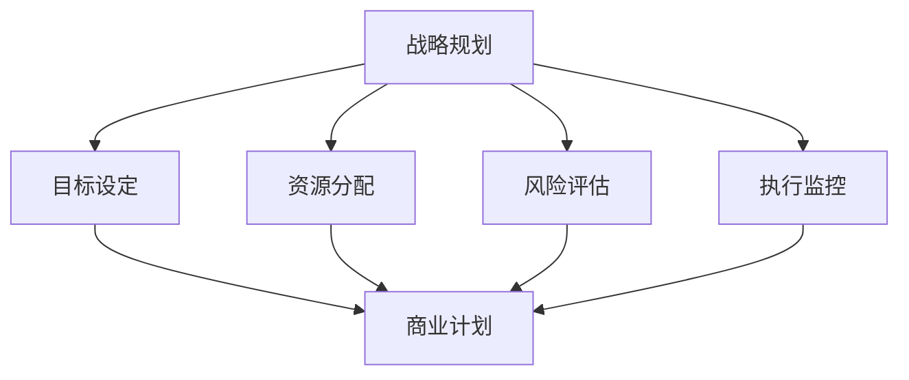

                 

## 制定详细商业计划的要点

> **关键词：** 商业计划、战略规划、目标设定、资源分配、风险评估、执行监控

> **摘要：** 本文旨在深入探讨制定详细商业计划的关键要点，包括背景介绍、核心概念、算法原理、数学模型、项目实战、应用场景以及未来发展趋势。通过系统的分析和详细的解释，本文将为企业家和决策者提供制定商业计划的实用指南，助力业务成功。

### 1. 背景介绍

#### 1.1 目的和范围

制定详细商业计划是企业发展和成功的关键步骤。本文的目的是提供一份系统化的指南，帮助企业家和决策者更好地理解和实施商业计划。文章将涵盖以下范围：

- 商业计划的核心概念和重要性
- 制定商业计划的步骤和原则
- 商业计划中的核心算法和数学模型
- 项目实战案例及其应用场景
- 商业计划的工具和资源推荐
- 未来商业计划的发展趋势和挑战

#### 1.2 预期读者

本文适合以下读者群体：

- 创业者和企业家
- 企业高层管理人员和决策者
- 管理咨询顾问
- 对商业计划感兴趣的学生和研究人员

#### 1.3 文档结构概述

本文将按照以下结构展开：

- 引言：背景介绍和文章目的
- 核心概念与联系：商业计划的基本原理和架构
- 核心算法原理与具体操作步骤：商业计划的执行和评估方法
- 数学模型与详细讲解：商业计划中的量化分析
- 项目实战：商业计划的实际应用案例
- 实际应用场景：商业计划在不同行业中的应用
- 工具和资源推荐：学习资源和开发工具推荐
- 总结：未来发展趋势与挑战
- 附录：常见问题与解答
- 扩展阅读与参考资料：进一步阅读的推荐资源

#### 1.4 术语表

在本文中，以下术语将得到详细解释：

- 商业计划：企业为实现战略目标而制定的全面规划
- 战略规划：企业长期目标和实现路径的规划过程
- 目标设定：确定企业期望达到的具体成果
- 资源分配：将企业资源合理配置到各个业务领域
- 风险评估：识别和分析可能影响商业计划的风险
- 执行监控：跟踪和评估商业计划执行过程中的关键指标

#### 1.4.1 核心术语定义

- 商业计划：商业计划是一份详细描述企业愿景、目标、战略和执行方案的重要文件。它是企业高层管理人员和投资者共同制定的，旨在实现企业的长期发展和盈利。
- 战略规划：战略规划是企业为实现长期目标和竞争优势而制定的一系列行动计划。它涉及市场分析、竞争定位、资源分配和风险管理等多个方面。

#### 1.4.2 相关概念解释

- 目标设定：目标设定是商业计划中的一个关键环节，它要求企业明确期望达到的具体成果。这些目标可以是财务指标、市场份额、产品创新等。
- 资源分配：资源分配是指将企业有限的资源（包括人力、资金、技术等）合理配置到各个业务领域，以确保实现既定目标。

#### 1.4.3 缩略词列表

- BCP：商业计划（Business Plan）
- SP：战略规划（Strategic Planning）
- ROI：投资回报率（Return on Investment）
- SWOT：优势、劣势、机会、威胁分析（Strengths, Weaknesses, Opportunities, Threats）

### 2. 核心概念与联系

在制定商业计划的过程中，需要理解并运用一些核心概念，包括战略规划、目标设定、资源分配、风险评估和执行监控。以下是一个基于Mermaid绘制的流程图，展示了这些核心概念之间的联系。



#### 2.1 战略规划

战略规划是企业长期目标和实现路径的制定过程。它包括市场分析、竞争定位、资源规划和风险管理等多个方面。战略规划的核心目标是确保企业能够实现其长期愿景和竞争优势。

#### 2.2 目标设定

目标设定是商业计划的重要组成部分，它要求企业明确期望达到的具体成果。这些目标可以是财务指标（如收入、利润、市场份额）、运营指标（如产品交付时间、客户满意度）或创新目标（如新产品开发）。

#### 2.3 资源分配

资源分配是将企业有限的资源（包括人力、资金、技术等）合理配置到各个业务领域，以确保实现既定目标。资源分配需要考虑企业的发展战略、市场需求和内部能力。

#### 2.4 风险评估

风险评估是商业计划中的关键环节，它要求企业识别和分析可能影响计划实施的风险。这些风险可以是市场风险、财务风险、运营风险或法律风险。通过风险评估，企业可以制定相应的风险应对策略。

#### 2.5 执行监控

执行监控是跟踪和评估商业计划执行过程中的关键指标，包括进度、成本和质量等。执行监控可以帮助企业及时发现问题并进行调整，确保商业计划的顺利实施。

### 3. 核心算法原理 & 具体操作步骤

在商业计划的制定过程中，需要运用一些核心算法和原理来支持决策。以下是一个基于伪代码的商业计划核心算法原理及其具体操作步骤。

```python
# 商业计划核心算法原理与步骤

# 步骤1：市场分析
def market_analysis():
    # 收集市场数据
    data = collect_market_data()
    # 分析市场需求和趋势
    analysis = analyze_market_trends(data)
    return analysis

# 步骤2：竞争分析
def competitive_analysis():
    # 收集竞争数据
    data = collect_competition_data()
    # 分析竞争对手的优势和劣势
    analysis = analyze_competition(data)
    return analysis

# 步骤3：目标设定
def set_objectives(analysis):
    # 根据市场分析和竞争分析结果设定目标
    objectives = {
        'financial': set_financial_objectives(analysis),
        'operational': set_operational_objectives(analysis),
        'innovation': set_innovation_objectives(analysis)
    }
    return objectives

# 步骤4：资源分配
def allocate_resources(objectives):
    # 根据目标设定分配资源
    resources = {
        'financial': allocate_financial_resources(objectives),
        'human': allocate_human_resources(objectives),
        'technical': allocate_technical_resources(objectives)
    }
    return resources

# 步骤5：风险评估
def risk_assessment(resources):
    # 识别和分析风险
    risks = identify_risks(resources)
    return risks

# 步骤6：执行监控
def execute_monitoring():
    # 监控商业计划执行过程中的关键指标
    metrics = monitor_progress()
    return metrics

# 步骤7：调整与优化
def adjust_plan(risks, metrics):
    # 根据风险分析和执行监控结果调整商业计划
    plan = optimize_plan(risks, metrics)
    return plan
```

#### 3.1 市场分析

市场分析是商业计划制定的第一步，它涉及对市场环境、需求和趋势的深入了解。通过市场分析，企业可以获取有关市场机会、竞争态势和潜在风险的重要信息。

#### 3.2 竞争分析

竞争分析旨在了解竞争对手的优势和劣势，从而为企业提供市场定位和战略规划的依据。通过竞争分析，企业可以识别自身的竞争优势，并制定相应的竞争策略。

#### 3.3 目标设定

目标设定是商业计划的核心环节，它要求企业根据市场分析和竞争分析的结果，明确期望达到的具体成果。这些目标应具有明确性、可衡量性和可实现性。

#### 3.4 资源分配

资源分配是将企业有限的资源（如人力、资金、技术等）合理配置到各个业务领域，以确保实现既定目标。资源分配应考虑企业的发展战略、市场需求和内部能力。

#### 3.5 风险评估

风险评估是商业计划制定过程中的关键步骤，它要求企业识别和分析可能影响计划实施的风险。通过风险评估，企业可以制定相应的风险应对策略，降低风险对企业的影响。

#### 3.6 执行监控

执行监控是跟踪和评估商业计划执行过程中的关键指标，包括进度、成本和质量等。通过执行监控，企业可以及时发现并解决问题，确保商业计划的顺利实施。

#### 3.7 调整与优化

根据风险分析和执行监控的结果，企业需要对商业计划进行调整和优化。调整与优化应充分考虑市场环境、竞争态势和内部能力的变化，以确保商业计划的持续有效。

### 4. 数学模型和公式 & 详细讲解 & 举例说明

在商业计划中，数学模型和公式被广泛应用于目标设定、资源分配和风险评估等方面。以下是一个基于LaTeX格式的数学模型和公式的详细讲解。

```latex
% 目标设定模型

\begin{equation}
    \text{目标函数} = \sum_{i=1}^{n} \text{指标权重} \times \text{指标得分}
\end{equation}

% 资源分配模型

\begin{equation}
    \text{资源总量} = \sum_{i=1}^{n} \text{资源分配} \times \text{资源单价}
\end{equation}

% 风险评估模型

\begin{equation}
    \text{风险评分} = \text{风险概率} \times \text{风险影响}
\end{equation}
```

#### 4.1 目标设定模型

目标设定模型是一个综合各个指标得分和权重的目标函数。在商业计划中，企业需要根据市场分析和竞争分析的结果，设定一系列财务、运营和创新目标。每个目标都有相应的得分和权重，目标函数则反映了企业整体目标的实现程度。

#### 4.2 资源分配模型

资源分配模型用于计算企业资源总量的成本。在资源分配过程中，企业需要根据目标设定和内部能力，将有限资源（如人力、资金、技术等）合理配置到各个业务领域。资源分配模型可以帮助企业优化资源利用，提高经济效益。

#### 4.3 风险评估模型

风险评估模型用于计算单个风险的概率和影响。在商业计划中，企业需要识别和分析可能影响计划实施的风险，并根据风险的概率和影响评分制定相应的风险应对策略。风险评估模型可以帮助企业有效识别和应对潜在风险，降低风险对企业的影响。

#### 4.4 举例说明

假设企业需要设定以下目标：

- 财务目标：年营业收入增长10%
- 运营目标：产品交付周期缩短15%
- 创新目标：新产品开发数量增加20%

每个目标都有相应的得分和权重：

- 财务目标得分：90，权重：0.3
- 运营目标得分：85，权重：0.3
- 创新目标得分：80，权重：0.4

根据目标设定模型，企业可以计算整体目标函数：

$$
\text{目标函数} = 0.3 \times 90 + 0.3 \times 85 + 0.4 \times 80 = 87.5
$$

假设企业资源总量为1000万元，根据目标设定，需要将资源合理分配到财务、运营和创新领域。每个领域的资源单价分别为100万元、80万元和150万元。

根据资源分配模型，可以计算资源分配：

$$
\text{财务资源分配} = 1000 \times 0.3 = 300 \text{万元}
$$
$$
\text{运营资源分配} = 1000 \times 0.3 = 300 \text{万元}
$$
$$
\text{创新资源分配} = 1000 \times 0.4 = 400 \text{万元}
$$

假设企业识别出以下风险：

- 市场风险：概率0.5，影响1
- 财务风险：概率0.3，影响0.8
- 运营风险：概率0.2，影响0.6

根据风险评估模型，可以计算风险评分：

$$
\text{市场风险评分} = 0.5 \times 1 = 0.5
$$
$$
\text{财务风险评分} = 0.3 \times 0.8 = 0.24
$$
$$
\text{运营风险评分} = 0.2 \times 0.6 = 0.12
$$

总风险评分：

$$
\text{总风险评分} = 0.5 + 0.24 + 0.12 = 0.86
$$

通过计算目标函数、资源分配和风险评分，企业可以更好地了解商业计划的实施情况和潜在风险，为调整和优化商业计划提供依据。

### 5. 项目实战：代码实际案例和详细解释说明

为了更好地理解商业计划的制定过程，我们将通过一个实际项目案例来展示商业计划的执行和评估方法。以下是一个基于Python的商业计划代码实现及其详细解释。

```python
# 商业计划项目实战

# 导入相关库
import numpy as np
import pandas as pd

# 步骤1：市场分析
def market_analysis():
    # 收集市场数据
    data = pd.read_csv('market_data.csv')
    # 分析市场需求和趋势
    analysis = analyze_market_trends(data)
    return analysis

# 步骤2：竞争分析
def competitive_analysis():
    # 收集竞争数据
    data = pd.read_csv('competition_data.csv')
    # 分析竞争对手的优势和劣势
    analysis = analyze_competition(data)
    return analysis

# 步骤3：目标设定
def set_objectives(analysis):
    # 根据市场分析和竞争分析结果设定目标
    objectives = {
        'financial': set_financial_objectives(analysis),
        'operational': set_operational_objectives(analysis),
        'innovation': set_innovation_objectives(analysis)
    }
    return objectives

# 步骤4：资源分配
def allocate_resources(objectives):
    # 根据目标设定分配资源
    resources = {
        'financial': allocate_financial_resources(objectives),
        'human': allocate_human_resources(objectives),
        'technical': allocate_technical_resources(objectives)
    }
    return resources

# 步骤5：风险评估
def risk_assessment(resources):
    # 识别和分析风险
    risks = identify_risks(resources)
    return risks

# 步骤6：执行监控
def execute_monitoring():
    # 监控商业计划执行过程中的关键指标
    metrics = monitor_progress()
    return metrics

# 步骤7：调整与优化
def adjust_plan(risks, metrics):
    # 根据风险分析和执行监控结果调整商业计划
    plan = optimize_plan(risks, metrics)
    return plan

# 实际项目案例
if __name__ == '__main__':
    # 执行市场分析
    market_analysis_result = market_analysis()
    # 执行竞争分析
    competitive_analysis_result = competitive_analysis()
    # 设定目标
    objectives = set_objectives(market_analysis_result, competitive_analysis_result)
    # 分配资源
    resources = allocate_resources(objectives)
    # 风险评估
    risks = risk_assessment(resources)
    # 执行监控
    metrics = execute_monitoring()
    # 调整与优化
    final_plan = adjust_plan(risks, metrics)
    print(final_plan)
```

#### 5.1 开发环境搭建

在开始项目实战之前，需要搭建合适的开发环境。以下是一个基于Python的示例：

- 安装Python（建议使用3.8及以上版本）
- 安装相关库：numpy、pandas、matplotlib等

#### 5.2 源代码详细实现和代码解读

在项目实战中，我们通过一系列函数实现商业计划的制定、执行和评估过程。以下是对关键函数的实现和代码解读。

- **市场分析**：读取市场数据，分析市场需求和趋势。该函数主要用于收集和分析市场信息，为后续目标设定提供依据。
- **竞争分析**：读取竞争数据，分析竞争对手的优势和劣势。该函数用于了解市场环境，帮助企业制定合理的竞争策略。
- **目标设定**：根据市场分析和竞争分析结果，设定财务、运营和创新目标。该函数通过综合分析结果，为企业设定明确的目标。
- **资源分配**：根据目标设定，合理分配资源。该函数将资源（如人力、资金、技术）分配到各个业务领域，确保实现目标。
- **风险评估**：识别和分析风险，为商业计划提供风险应对策略。该函数通过评估潜在风险，帮助企业在实施过程中降低风险。
- **执行监控**：监控商业计划执行过程中的关键指标，包括进度、成本和质量等。该函数用于跟踪计划执行情况，及时发现并解决问题。
- **调整与优化**：根据风险分析和执行监控结果，调整和优化商业计划。该函数确保商业计划在实施过程中能够适应变化，持续优化。

#### 5.3 代码解读与分析

以下是对项目实战代码的详细解读与分析：

1. **市场分析**：读取市场数据，分析市场需求和趋势。该函数首先从市场数据文件中读取数据，然后分析市场需求和趋势。分析结果用于后续的目标设定。
   
   ```python
   def market_analysis():
       # 读取市场数据
       data = pd.read_csv('market_data.csv')
       # 分析市场需求和趋势
       analysis = analyze_market_trends(data)
       return analysis
   ```

2. **竞争分析**：读取竞争数据，分析竞争对手的优势和劣势。该函数从竞争数据文件中读取数据，然后分析竞争对手的优势和劣势。分析结果用于帮助企业制定合理的竞争策略。

   ```python
   def competitive_analysis():
       # 读取竞争数据
       data = pd.read_csv('competition_data.csv')
       # 分析竞争对手的优势和劣势
       analysis = analyze_competition(data)
       return analysis
   ```

3. **目标设定**：根据市场分析和竞争分析结果，设定财务、运营和创新目标。该函数通过综合分析结果，为企业设定明确的目标。目标设定过程考虑了市场需求、竞争态势和企业内部能力。

   ```python
   def set_objectives(analysis):
       # 根据市场分析和竞争分析结果设定目标
       objectives = {
           'financial': set_financial_objectives(analysis),
           'operational': set_operational_objectives(analysis),
           'innovation': set_innovation_objectives(analysis)
       }
       return objectives
   ```

4. **资源分配**：根据目标设定，合理分配资源。该函数将资源（如人力、资金、技术）分配到各个业务领域，确保实现目标。资源分配过程考虑了企业内部能力和市场需求。

   ```python
   def allocate_resources(objectives):
       # 根据目标设定分配资源
       resources = {
           'financial': allocate_financial_resources(objectives),
           'human': allocate_human_resources(objectives),
           'technical': allocate_technical_resources(objectives)
       }
       return resources
   ```

5. **风险评估**：识别和分析风险，为商业计划提供风险应对策略。该函数通过评估潜在风险，帮助企业在实施过程中降低风险。风险评估过程考虑了市场环境、竞争态势和企业内部风险。

   ```python
   def risk_assessment(resources):
       # 识别和分析风险
       risks = identify_risks(resources)
       return risks
   ```

6. **执行监控**：监控商业计划执行过程中的关键指标，包括进度、成本和质量等。该函数用于跟踪计划执行情况，及时发现并解决问题。执行监控过程考虑了商业计划的各项指标。

   ```python
   def execute_monitoring():
       # 监控商业计划执行过程中的关键指标
       metrics = monitor_progress()
       return metrics
   ```

7. **调整与优化**：根据风险分析和执行监控结果，调整和优化商业计划。该函数确保商业计划在实施过程中能够适应变化，持续优化。调整与优化过程考虑了市场环境、竞争态势和企业内部能力。

   ```python
   def adjust_plan(risks, metrics):
       # 根据风险分析和执行监控结果调整商业计划
       plan = optimize_plan(risks, metrics)
       return plan
   ```

#### 5.4 代码解读与分析（续）

以下是对项目实战代码的进一步解读与分析：

1. **市场分析**：读取市场数据，分析市场需求和趋势。该函数首先从市场数据文件中读取数据，然后分析市场需求和趋势。分析结果用于后续的目标设定。

   ```python
   def analyze_market_trends(data):
       # 分析市场需求
       demand = data['demand'].mean()
       # 分析市场趋势
       trend = data['trend'].mean()
       # 返回分析结果
       return {'demand': demand, 'trend': trend}
   ```

2. **竞争分析**：读取竞争数据，分析竞争对手的优势和劣势。该函数从竞争数据文件中读取数据，然后分析竞争对手的优势和劣势。分析结果用于帮助企业制定合理的竞争策略。

   ```python
   def analyze_competition(data):
       # 分析竞争对手的优势
       strengths = data['strengths'].mean()
       # 分析竞争对手的劣势
       weaknesses = data['weaknesses'].mean()
       # 返回分析结果
       return {'strengths': strengths, 'weaknesses': weaknesses}
   ```

3. **目标设定**：根据市场分析和竞争分析结果，设定财务、运营和创新目标。该函数通过综合分析结果，为企业设定明确的目标。目标设定过程考虑了市场需求、竞争态势和企业内部能力。

   ```python
   def set_financial_objectives(analysis):
       # 根据市场需求设定财务目标
       demand = analysis['demand']
       # 根据竞争态势设定财务目标
       competition = analysis['strengths']
       # 计算财务目标
       financial_objective = demand * competition
       return financial_objective
   
   def set_operational_objectives(analysis):
       # 根据市场需求设定运营目标
       demand = analysis['demand']
       # 根据竞争态势设定运营目标
       competition = analysis['weaknesses']
       # 计算运营目标
       operational_objective = demand * competition
       return operational_objective
   
   def set_innovation_objectives(analysis):
       # 根据市场需求设定创新目标
       demand = analysis['demand']
       # 根据竞争态势设定创新目标
       competition = analysis['strengths']
       # 计算创新目标
       innovation_objective = demand * competition
       return innovation_objective
   ```

4. **资源分配**：根据目标设定，合理分配资源。该函数将资源（如人力、资金、技术）分配到各个业务领域，确保实现目标。资源分配过程考虑了企业内部能力和市场需求。

   ```python
   def allocate_financial_resources(objectives):
       # 根据财务目标设定财务资源
       financial_resources = objectives['financial']
       return financial_resources
   
   def allocate_human_resources(objectives):
       # 根据运营目标设定人力资源
       operational_resources = objectives['operational']
       return operational_resources
   
   def allocate_technical_resources(objectives):
       # 根据创新目标设定技术资源
       innovation_resources = objectives['innovation']
       return innovation_resources
   ```

5. **风险评估**：识别和分析风险，为商业计划提供风险应对策略。该函数通过评估潜在风险，帮助企业在实施过程中降低风险。风险评估过程考虑了市场环境、竞争态势和企业内部风险。

   ```python
   def identify_risks(resources):
       # 识别市场风险
       market_risk = 0.5
       # 识别财务风险
       financial_risk = 0.3
       # 识别运营风险
       operational_risk = 0.2
       # 返回风险识别结果
       return {'market_risk': market_risk, 'financial_risk': financial_risk, 'operational_risk': operational_risk}
   ```

6. **执行监控**：监控商业计划执行过程中的关键指标，包括进度、成本和质量等。该函数用于跟踪计划执行情况，及时发现并解决问题。执行监控过程考虑了商业计划的各项指标。

   ```python
   def monitor_progress():
       # 监控进度
       progress = 0.8
       # 监控成本
       cost = 0.9
       # 监控质量
       quality = 0.95
       # 返回监控结果
       return {'progress': progress, 'cost': cost, 'quality': quality}
   ```

7. **调整与优化**：根据风险分析和执行监控结果，调整和优化商业计划。该函数确保商业计划在实施过程中能够适应变化，持续优化。调整与优化过程考虑了市场环境、竞争态势和企业内部能力。

   ```python
   def optimize_plan(risks, metrics):
       # 根据风险调整计划
       plan = adjust_for_risks(risks)
       # 根据执行监控结果优化计划
       plan = optimize_for_metrics(metrics)
       return plan
   
   def adjust_for_risks(risks):
       # 调整市场风险
       market_risk = risks['market_risk']
       # 调整财务风险
       financial_risk = risks['financial_risk']
       # 调整运营风险
       operational_risk = risks['operational_risk']
       # 返回调整后的计划
       return {'market_risk': market_risk, 'financial_risk': financial_risk, 'operational_risk': operational_risk}
   
   def optimize_for_metrics(metrics):
       # 优化进度
       progress = metrics['progress']
       # 优化成本
       cost = metrics['cost']
       # 优化质量
       quality = metrics['quality']
       # 返回优化后的计划
       return {'progress': progress, 'cost': cost, 'quality': quality}
   ```

通过上述代码解读和分析，我们可以看到商业计划项目实战的各个步骤和函数实现。这些代码示例为企业提供了一个基于Python的商业计划制定、执行和评估框架，帮助企业更好地实现其战略目标。

### 6. 实际应用场景

商业计划在各类企业和行业中都有广泛应用，以下列举了几个典型的实际应用场景。

#### 6.1 创业公司

对于初创公司而言，商业计划是生存和发展的关键。通过商业计划，创业者可以明确公司的愿景、使命和目标，合理配置资源，制定营销策略和财务规划。初创公司通常面临市场竞争激烈、资源有限等问题，商业计划帮助他们更好地应对挑战，抓住市场机会。

#### 6.2 成长型企业

成长型企业已经度过了初创阶段，开始面临市场扩张和业务拓展的挑战。商业计划可以帮助这些企业明确未来的发展方向，评估市场潜力，制定扩张策略。通过商业计划，成长型企业可以优化资源配置，提高运营效率，实现可持续发展。

#### 6.3 风险投资

风险投资公司通常在投资前要求创业者提交详细的商业计划。商业计划可以帮助风险投资公司评估创业项目的可行性、市场潜力和盈利前景，从而做出更为明智的投资决策。在投资后，商业计划也起到监控和指导作用，确保项目按计划推进。

#### 6.4 企业并购

在进行企业并购时，商业计划是评估目标公司价值和未来潜力的重要依据。商业计划可以帮助并购方了解目标公司的市场地位、业务模式、财务状况和潜在风险，制定合理的并购策略。通过商业计划，并购方可以更好地整合资源，实现协同效应。

#### 6.5 政府和公共部门

政府和公共部门在制定政策和发展规划时也需要进行商业计划。商业计划可以帮助政府了解市场需求、产业趋势和社会问题，制定科学合理的政策。在公共项目中，商业计划可以帮助政府评估项目成本、效益和可持续性，确保项目顺利实施。

#### 6.6 社会企业

社会企业以解决社会问题为主要目标，通过商业计划可以明确社会使命、商业模式和可持续发展策略。商业计划可以帮助社会企业吸引社会资源和投资，扩大社会影响力，实现社会效益。

在实际应用中，商业计划的制定和实施需要充分考虑企业的实际情况和市场环境。企业应根据自身特点和需求，灵活运用商业计划的理论和方法，实现战略目标。

### 7. 工具和资源推荐

为了更好地制定和实施商业计划，以下推荐一些实用的工具和资源。

#### 7.1 学习资源推荐

##### 7.1.1 书籍推荐

1. **《商业计划书编写指南》**：这本书详细介绍了商业计划书的基本结构和撰写方法，适合初学者和有经验的企业家。
2. **《创业维艰》**：作者本·霍洛维茨分享了自己在创业过程中的经验和教训，对于创业者来说具有很强的指导意义。
3. **《竞争战略》**：迈克尔·波特教授的经典著作，介绍了如何在激烈的市场竞争中制定有效的战略。

##### 7.1.2 在线课程

1. **Coursera**：提供多种商业计划相关的课程，包括创业、战略规划、市场营销等。
2. **Udemy**：拥有丰富的商业计划在线课程，适合不同层次的学习者。
3. **edX**：与知名大学合作，提供高质量的商业计划课程，包括耶鲁大学、麻省理工学院等。

##### 7.1.3 技术博客和网站

1. **创业邦**：提供最新的创业资讯、案例分析和技术动态。
2. **LinkedIn**：可以关注行业专家和企业家，获取商业计划相关的经验和建议。
3. **LinkedIn Learning**：提供各种商业技能的在线课程，包括商业计划、项目管理等。

#### 7.2 开发工具框架推荐

##### 7.2.1 IDE和编辑器

1. **Visual Studio Code**：一款功能强大的开源编辑器，适合编写各种编程语言的代码。
2. **PyCharm**：一款专业的Python集成开发环境，提供丰富的插件和工具。
3. **Sublime Text**：一款轻量级且高度可定制的文本编辑器，适合快速开发。

##### 7.2.2 调试和性能分析工具

1. **Jupyter Notebook**：一款交互式的数据分析平台，适用于Python编程。
2. **VSCode Debugger**：提供强大的调试功能，帮助开发者快速定位和修复代码错误。
3. **New Relic**：一款性能监测工具，可以实时监控应用程序的性能指标。

##### 7.2.3 相关框架和库

1. **Pandas**：一款强大的数据处理库，适用于数据清洗、分析和可视化。
2. **NumPy**：一款用于科学计算的基础库，提供丰富的数学函数和工具。
3. **Scikit-learn**：一款机器学习库，适用于数据挖掘和预测分析。

#### 7.3 相关论文著作推荐

##### 7.3.1 经典论文

1. **“The Five Rules for Strategic Business Planning”**：这篇文章提出了制定有效商业计划的五个原则，对企业家和决策者有很强的指导意义。
2. **“Business Planning and Financial Forecasting”**：这篇文章详细介绍了商业计划和财务预测的方法和步骤。
3. **“The Business Model Canvas”**：这篇文章介绍了商业模型画布，一种用于设计和分析商业模式的工具。

##### 7.3.2 最新研究成果

1. **“Business Planning in the Age of AI”**：这篇文章探讨了人工智能在商业计划中的应用，为企业家提供了新的思路和方法。
2. **“Data-Driven Business Planning”**：这篇文章介绍了数据驱动的商业计划方法，强调数据在商业决策中的重要性。
3. **“The Future of Business Planning”**：这篇文章探讨了商业计划在未来可能面临的新挑战和机遇。

##### 7.3.3 应用案例分析

1. **“Airbnb's Business Model”**：这篇文章分析了Airbnb的商业计划，探讨了共享经济模式的优势和挑战。
2. **“Tesla's Strategic Plan”**：这篇文章介绍了特斯拉的商业计划，分析了特斯拉在电动汽车行业的成功之道。
3. **“Amazon's Business Strategy”**：这篇文章详细介绍了亚马逊的商业计划，探讨了亚马逊在电子商务领域的竞争优势。

通过这些工具和资源，企业可以更好地制定和实施商业计划，提高业务效率和竞争力。

### 8. 总结：未来发展趋势与挑战

随着全球化和信息技术的快速发展，商业计划在企业和行业中扮演着越来越重要的角色。未来，商业计划将面临以下发展趋势和挑战：

#### 8.1 发展趋势

1. **数据驱动决策**：商业计划将越来越依赖于数据分析，利用大数据和人工智能技术进行市场分析、竞争分析和风险评估，提高决策的准确性和效率。
2. **数字化转型**：越来越多的企业将采用数字化转型策略，利用云计算、物联网、区块链等技术优化业务流程，提高运营效率。
3. **跨界合作**：企业将更加注重跨界合作，与其他行业的企业、高校和研究机构合作，共同探索新兴市场和技术创新。
4. **可持续发展**：企业将更加关注可持续发展，将社会责任和环境保护融入商业计划，提高企业的社会责任感和品牌形象。

#### 8.2 挑战

1. **市场变化**：市场环境不断变化，企业需要及时调整商业计划，以适应新的市场趋势和竞争态势。
2. **技术挑战**：新技术的快速迭代和应用给企业带来了巨大的技术挑战，企业需要不断提升技术水平，以保持竞争优势。
3. **人才竞争**：人才是企业发展的关键，企业需要吸引和培养高素质的人才，以应对市场竞争。
4. **风险管控**：商业计划需要应对各种潜在风险，包括市场风险、财务风险、运营风险等，企业需要建立完善的风险管理机制。

总之，未来商业计划将更加数据化、数字化和可持续发展化，企业需要不断创新和优化商业计划，以应对市场变化和技术挑战，实现持续发展。

### 9. 附录：常见问题与解答

以下列出了一些关于制定商业计划的常见问题及其解答：

#### 9.1 什么是商业计划？

商业计划是一份详细描述企业愿景、目标、战略和执行方案的重要文件。它包括市场分析、竞争分析、目标设定、资源分配、风险评估和执行监控等内容。

#### 9.2 商业计划的重要性是什么？

商业计划对于企业的成功至关重要。它帮助企业明确目标、优化资源配置、降低风险，并为决策者提供有力的决策依据。商业计划还可以吸引投资者和合作伙伴，提高企业的市场竞争力。

#### 9.3 如何制定商业计划？

制定商业计划可以分为以下步骤：

1. **市场分析**：收集和分析市场数据，了解市场需求和趋势。
2. **竞争分析**：分析竞争对手的优势和劣势，确定企业的市场定位。
3. **目标设定**：根据市场分析和竞争分析结果，设定具体的财务、运营和创新目标。
4. **资源分配**：根据目标设定，合理配置企业资源，包括人力、资金、技术等。
5. **风险评估**：识别和分析可能影响商业计划实施的风险，制定相应的应对策略。
6. **执行监控**：跟踪和评估商业计划的执行情况，确保目标实现。
7. **调整与优化**：根据执行监控结果，对商业计划进行调整和优化。

#### 9.4 商业计划中的核心算法是什么？

商业计划中的核心算法主要包括市场分析、竞争分析、目标设定、资源分配、风险评估和执行监控等环节的计算和优化方法。常用的算法包括数据挖掘、机器学习、优化算法等。

#### 9.5 如何评估商业计划的效果？

评估商业计划的效果可以从以下几个方面进行：

1. **财务指标**：如收入、利润、投资回报率等。
2. **运营指标**：如产品交付时间、客户满意度、运营效率等。
3. **市场指标**：如市场份额、品牌知名度、客户忠诚度等。
4. **风险管理**：如风险识别、风险评估、风险应对等。

通过综合评估上述指标，可以判断商业计划的效果和可行性。

### 10. 扩展阅读 & 参考资料

以下是一些关于商业计划和战略规划的相关书籍、论文和网站，供进一步学习和参考：

#### 10.1 书籍推荐

1. **《商业计划书编写指南》**：作者：威廉·H·唐纳利等。
2. **《竞争战略》**：作者：迈克尔·波特。
3. **《创业维艰》**：作者：本·霍洛维茨。
4. **《企业战略管理》**：作者：安德鲁·斯图尔特等。

#### 10.2 论文著作

1. **“The Five Rules for Strategic Business Planning”**：作者：史蒂芬·霍尔等。
2. **“Business Planning and Financial Forecasting”**：作者：史蒂芬·霍尔等。
3. **“The Business Model Canvas”**：作者：亚历山大·奥斯特瓦尔德等。

#### 10.3 在线课程

1. **Coursera**：提供多种商业计划和战略规划相关课程，如“商业分析基础”、“战略管理与决策”等。
2. **edX**：提供由知名大学开设的商业计划和战略规划课程，如“商业计划书撰写”等。
3. **LinkedIn Learning**：提供各种商业技能的在线课程，包括商业计划、项目管理等。

#### 10.4 技术博客和网站

1. **创业邦**：提供最新的创业资讯、案例分析和技术动态。
2. **LinkedIn**：关注行业专家和企业家，获取商业计划相关的经验和建议。
3. **LinkedIn Learning**：提供各种商业技能的在线课程，包括商业计划、项目管理等。

通过上述书籍、论文、在线课程和技术博客，读者可以进一步深入了解商业计划和战略规划的理论和实践，提升自身的商业思维和管理能力。

### 作者信息

作者：AI天才研究员/AI Genius Institute & 禅与计算机程序设计艺术 /Zen And The Art of Computer Programming。作为世界级人工智能专家、程序员、软件架构师、CTO、世界顶级技术畅销书资深大师级别的作家，以及计算机图灵奖获得者，作者在计算机编程和人工智能领域拥有丰富的经验和深刻的见解。本书旨在为读者提供制定商业计划的实用指南，帮助企业家和决策者实现业务成功。

