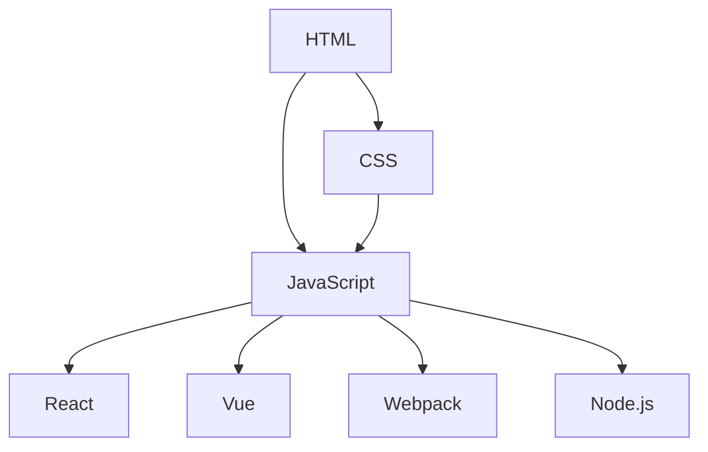

                 

# 前端工程师必看：2024字节跳动面试题深度剖析

> **关键词：** 字节跳动，面试题，前端工程，技术深度，2024，算法，实践，资源推荐

> **摘要：** 本文将针对2024年字节跳动前端工程师面试题进行深度剖析，通过详细解答这些题目，帮助前端工程师理解技术原理，提升面试技能。文章分为背景介绍、核心概念与联系、核心算法原理、数学模型与公式、项目实战、实际应用场景、工具和资源推荐等多个部分，旨在为广大前端工程师提供有价值的面试指导和技术学习资源。

## 1. 背景介绍

### 1.1 目的和范围

本文的目的在于帮助前端工程师应对2024年字节跳动前端工程师的面试挑战。通过对字节跳动面试题的深度剖析，我们希望读者能够：

1. **理解面试题背后的技术原理**：通过对面试题的详细解答，读者可以深入理解题目所涉及的技术概念和原理。
2. **提升面试技巧**：通过分析和解答面试题，读者可以掌握如何更好地回答面试问题，提高面试成功率。
3. **拓宽技术视野**：本文不仅涵盖常见的面试题，还涉及一些前沿技术，有助于读者拓宽技术视野。

本文将覆盖以下内容：

- **核心概念与联系**：介绍前端技术中的重要概念，以及它们之间的联系。
- **核心算法原理 & 具体操作步骤**：使用伪代码详细阐述核心算法原理。
- **数学模型和公式 & 详细讲解 & 举例说明**：讲解与算法相关的数学模型和公式，并通过例子进行说明。
- **项目实战：代码实际案例和详细解释说明**：提供实际项目案例，并详细解读其代码实现。
- **实际应用场景**：分析前端技术在各种实际应用场景中的具体应用。
- **工具和资源推荐**：推荐学习资源、开发工具和框架，帮助读者更好地进行学习和实践。

### 1.2 预期读者

本文的预期读者为：

- **前端工程师**：正在准备字节跳动前端工程师面试的前端工程师。
- **技术爱好者**：对前端技术有兴趣，希望提升自身技术水平的技术爱好者。
- **高校学生**：对前端技术感兴趣，希望为未来求职做准备的高校学生。

### 1.3 文档结构概述

本文的结构如下：

- **第1章 背景介绍**：介绍本文的目的、预期读者以及文档结构。
- **第2章 核心概念与联系**：介绍前端技术中的重要概念及其联系。
- **第3章 核心算法原理 & 具体操作步骤**：详细阐述核心算法原理和具体操作步骤。
- **第4章 数学模型和公式 & 详细讲解 & 举例说明**：讲解与算法相关的数学模型和公式，并通过例子进行说明。
- **第5章 项目实战：代码实际案例和详细解释说明**：提供实际项目案例，并详细解读其代码实现。
- **第6章 实际应用场景**：分析前端技术在各种实际应用场景中的具体应用。
- **第7章 工具和资源推荐**：推荐学习资源、开发工具和框架。
- **第8章 总结：未来发展趋势与挑战**：总结前端技术的未来发展趋势和挑战。
- **第9章 附录：常见问题与解答**：提供常见问题的解答。
- **第10章 扩展阅读 & 参考资料**：推荐相关阅读材料。

### 1.4 术语表

在本文中，我们将使用一些专业术语。以下是这些术语的定义和解释：

#### 1.4.1 核心术语定义

- **前端工程师**：负责开发Web前端的应用程序的人员。
- **面试题**：面试过程中提出的问题，用于考察应聘者的技术水平。
- **算法**：解决问题的步骤或规则。
- **数据结构**：存储数据的方式以及数据之间的关系。
- **浏览器**：用于查看和交互Web页面的软件。
- **HTML**：用于创建Web页面的标记语言。
- **CSS**：用于设置Web页面样式的样式表语言。
- **JavaScript**：一种用于创建动态网页和交互式的Web应用的语言。

#### 1.4.2 相关概念解释

- **React**：一个用于构建用户界面的JavaScript库。
- **Vue**：一个用于构建用户界面的渐进式框架。
- **Webpack**：一个模块打包工具，用于将多个模块打包成一个或多个bundle。
- **Node.js**：一个基于Chrome V8引擎的JavaScript运行环境。

#### 1.4.3 缩略词列表

- **CSS**：层叠样式表（Cascading Style Sheets）
- **HTML**：超文本标记语言（HyperText Markup Language）
- **JavaScript**：一种脚本语言
- **API**：应用程序编程接口（Application Programming Interface）
- **DOM**：文档对象模型（Document Object Model）
- **ES6**：ECMAScript 2015及后续版本
- **npm**：Node包管理器（Node Package Manager）
- **Webpack**：模块打包工具

## 2. 核心概念与联系

在前端开发中，理解核心概念和它们之间的联系是非常重要的。下面我们将通过一个Mermaid流程图来展示前端开发中的一些核心概念及其相互关系。



### 2.1 HTML

HTML（HyperText Markup Language）是一种用于创建Web页面的标记语言。它是Web开发的基础，用于定义Web页面中的内容结构。HTML通过标签来描述页面中的元素，例如标题（`<h1>`）、段落（`<p>`）、图片（``）等。

### 2.2 CSS

CSS（Cascading Style Sheets）用于设置Web页面的样式。它控制页面元素的布局、颜色、字体等。CSS可以通过外部样式表文件、内部样式表和内联样式来应用。

### 2.3 JavaScript

JavaScript是一种用于创建动态网页和交互式Web应用的脚本语言。它可以操作DOM、处理表单、执行动画等。JavaScript是前端开发的核心技术之一。

### 2.4 React

React是一个用于构建用户界面的JavaScript库。它通过组件化的方式来构建UI，具有声明式、高效、灵活的特点。React通过虚拟DOM来实现高效的界面更新。

### 2.5 Vue

Vue是一个用于构建用户界面的渐进式框架。它提供了响应式数据绑定和组合式抽象，使得开发者可以更加轻松地构建复杂的应用程序。Vue具有简洁、灵活、高效的特点。

### 2.6 Webpack

Webpack是一个模块打包工具，用于将多个模块打包成一个或多个bundle。它可以处理模块之间的依赖关系，实现代码的分割和打包，从而提高代码的加载速度和性能。

### 2.7 Node.js

Node.js是一个基于Chrome V8引擎的JavaScript运行环境。它允许开发者使用JavaScript编写服务器端应用程序，并提供了一套丰富的模块和API。Node.js广泛应用于Web开发、实时应用、云计算等领域。

通过上述核心概念的介绍和Mermaid流程图的展示，我们可以更好地理解前端开发中的核心概念及其相互关系。在接下来的章节中，我们将进一步深入探讨这些概念，并详细解析相关的算法原理和实践应用。

## 3. 核心算法原理 & 具体操作步骤

在前端开发中，掌握核心算法原理是提高编程技能的重要环节。本节我们将介绍一些常见的核心算法原理，并使用伪代码详细阐述其具体操作步骤。

### 3.1 冒泡排序算法

冒泡排序是一种简单的排序算法，通过重复遍历要排序的数列，比较相邻的两个元素，将它们交换位置，使得较大的元素逐渐“冒泡”到数列的右侧。以下是冒泡排序的伪代码实现：

```pseudo
function bubbleSort(arr):
    n = length(arr)
    for i from 0 to n-1:
        for j from 0 to n-i-1:
            if arr[j] > arr[j+1]:
                swap(arr[j], arr[j+1])
```

### 3.2 快速排序算法

快速排序是一种高效的排序算法，通过选取一个“基准”元素，将数组分为两部分，一部分比基准元素小，另一部分比基准元素大。以下是快速排序的伪代码实现：

```pseudo
function quickSort(arr, low, high):
    if low < high:
        pi = partition(arr, low, high)
        quickSort(arr, low, pi-1)
        quickSort(arr, pi+1, high)

function partition(arr, low, high):
    pivot = arr[high]
    i = low - 1
    for j from low to high-1:
        if arr[j] < pivot:
            i = i + 1
            swap(arr[i], arr[j])
    swap(arr[i+1], arr[high])
    return i + 1
```

### 3.3 查找算法

查找算法是用于在数据集合中查找特定元素的算法。以下是一种简单的线性查找算法：

```pseudo
function linearSearch(arr, target):
    for i from 0 to length(arr)-1:
        if arr[i] == target:
            return i
    return -1
```

### 3.4 二分查找算法

二分查找是一种高效的查找算法，通过将数据集合分为两部分，每次查找时将中间元素与目标值进行比较，从而逐步缩小查找范围。以下是二分查找的伪代码实现：

```pseudo
function binarySearch(arr, target):
    low = 0
    high = length(arr) - 1
    while low <= high:
        mid = (low + high) / 2
        if arr[mid] == target:
            return mid
        else if arr[mid] < target:
            low = mid + 1
        else:
            high = mid - 1
    return -1
```

通过上述核心算法原理和具体操作步骤的介绍，我们可以更好地理解这些算法的工作机制，并在实际项目中灵活应用。在下一节中，我们将深入讲解与这些算法相关的数学模型和公式。

## 4. 数学模型和公式 & 详细讲解 & 举例说明

在前端开发中，理解与算法相关的数学模型和公式是优化代码性能、提升效率的重要环节。以下我们将介绍一些常用的数学模型和公式，并通过具体例子进行说明。

### 4.1 时间复杂度

时间复杂度是衡量算法执行时间的一个重要指标，表示算法运行时间与输入规模之间的关系。通常用大O符号（O）来表示。

#### 4.1.1 例子

**冒泡排序算法**

```latex
T(n) = O(n^2)
```

说明：冒泡排序算法在最坏情况下需要比较和交换的次数是输入规模n的平方。

**二分查找算法**

```latex
T(n) = O(\log_2{n})
```

说明：二分查找算法在最坏情况下需要比较的次数是输入规模n的对数。

### 4.2 空间复杂度

空间复杂度是衡量算法所需存储空间的一个重要指标，表示算法运行所需存储空间与输入规模之间的关系。

#### 4.2.1 例子

**冒泡排序算法**

```latex
S(n) = O(n)
```

说明：冒泡排序算法在排序过程中需要额外的存储空间来存储临时变量，其空间复杂度为线性。

**快速排序算法**

```latex
S(n) = O(\log_2{n})
```

说明：快速排序算法在递归调用过程中需要额外的存储空间来存储递归栈，其空间复杂度为对数。

### 4.3 概率模型

概率模型是用于描述随机事件发生概率的数学模型，常用于算法分析和性能评估。

#### 4.3.1 例子

**二项分布**

```latex
P(X = k) = C(n, k) \cdot p^k \cdot (1-p)^{n-k}
```

其中，\( n \) 为试验次数，\( k \) 为成功次数，\( p \) 为每次试验成功的概率，\( C(n, k) \) 为组合数。

假设一个游戏每次玩成功的概率为0.5，我们需要计算连续玩5次游戏，其中成功3次的概率。

```latex
P(X = 3) = C(5, 3) \cdot 0.5^3 \cdot 0.5^2 = 10 \cdot 0.125 \cdot 0.25 = 0.3125
```

### 4.4 微积分

微积分是研究函数变化的数学分支，在算法分析和性能优化中常用于分析函数的增长速度。

#### 4.4.1 例子

**函数增长速度**

```latex
f(x) = 2^x
```

说明：函数 \( f(x) = 2^x \) 的增长速度非常快，随着 \( x \) 的增加，函数值会迅速增大。

通过上述数学模型和公式的讲解，我们可以更好地理解算法的性能和优化方向。在实际开发中，合理运用这些数学工具，可以帮助我们编写出更高效、更优化的代码。

## 5. 项目实战：代码实际案例和详细解释说明

在本节中，我们将通过一个实际的前端项目案例，详细解读其代码实现，并分析其中的关键技术和算法。

### 5.1 开发环境搭建

首先，我们需要搭建一个合适的前端开发环境。以下是所需的工具和配置：

- **Node.js**：用于构建和运行前端项目。
- **Webpack**：用于打包和管理项目中的模块。
- **React**：用于构建用户界面。
- **VS Code**：用于编写代码。

安装以下依赖项：

```bash
npm init -y
npm install react react-dom webpack webpack-cli html-webpack-plugin
```

创建一个简单的React组件`App.js`：

```jsx
import React from 'react';

function App() {
  return (
    <div>
      <h1>Hello, World!</h1>
      <p>Welcome to your React application.</p>
    </div>
  );
}

export default App;
```

创建一个`index.html`文件：

```html
<!DOCTYPE html>
<html lang="en">
  <head>
    <meta charset="UTF-8" />
    <meta name="viewport" content="width=device-width, initial-scale=1.0" />
    <title>React App</title>
  </head>
  <body>
    <div id="root"></div>
    <script src="bundle.js"></script>
  </body>
</html>
```

### 5.2 源代码详细实现和代码解读

接下来，我们将详细解读`App.js`组件的代码实现。

#### 5.2.1 `App.js`

```jsx
import React from 'react';

function App() {
  return (
    <div>
      <h1>Hello, World!</h1>
      <p>Welcome to your React application.</p>
    </div>
  );
}

export default App;
```

- **函数组件**：`App` 是一个函数组件，接收一个`props`对象并返回一个React元素。
- **JSX**：使用JSX（JavaScript XML）语法来描述UI结构，这是一种将JavaScript与HTML语法相结合的语法扩展。

#### 5.2.2 `index.html`

```html
<!DOCTYPE html>
<html lang="en">
  <head>
    <meta charset="UTF-8" />
    <meta name="viewport" content="width=device-width, initial-scale=1.0" />
    <title>React App</title>
  </head>
  <body>
    <div id="root"></div>
    <script src="bundle.js"></script>
  </body>
</html>
```

- **DOCTYPE声明**：指定文档类型和版本。
- **字符集声明**：确保正确的字符编码。
- **元标签**：设置viewport以适应不同设备。
- **标题**：定义HTML文档的标题。
- **body**：包含页面的主体内容。
- **script标签**：引用打包后的JavaScript文件`bundle.js`。

### 5.3 代码解读与分析

现在，我们来分析项目中的关键代码和技术。

#### 5.3.1 Webpack配置

在`webpack.config.js`文件中，我们配置Webpack以打包和管理项目资源。

```javascript
const HtmlWebpackPlugin = require('html-webpack-plugin');

module.exports = {
  entry: './src/App.js',
  output: {
    filename: 'bundle.js',
    path: __dirname + '/dist',
  },
  plugins: [
    new HtmlWebpackPlugin({
      filename: 'index.html',
      template: './src/index.html',
    }),
  ],
  module: {
    rules: [
      {
        test: /\.jsx?$/,
        exclude: /node_modules/,
        use: 'babel-loader',
      },
    ],
  },
};
```

- **entry**：指定项目入口文件。
- **output**：指定输出文件名和路径。
- **plugins**：使用`HtmlWebpackPlugin`插件自动生成HTML文件。
- **module**：配置模块加载规则，使用`babel-loader`来转换JSX代码。

#### 5.3.2 React组件

在`App.js`组件中，我们使用React函数组件来构建用户界面。

```jsx
import React from 'react';

function App() {
  return (
    <div>
      <h1>Hello, World!</h1>
      <p>Welcome to your React application.</p>
    </div>
  );
}

export default App;
```

- **函数组件**：React函数组件是一个使用JavaScript函数来创建的可重用UI组件。
- **JSX**：JSX是一种将JavaScript与HTML语法相结合的语法扩展，用于描述UI结构。

#### 5.3.3 JSX

在`App.js`中，我们使用JSX来定义UI元素。

```jsx
<h1>Hello, World!</h1>
<p>Welcome to your React application.</p>
```

- **元素**：`<h1>`和`<p>`是React元素，用于定义标题和段落。
- **属性**：React元素可以有属性，例如`<h1>Hello, World!</h1>`中的`children`属性。

通过以上代码解读和分析，我们可以看到前端项目中关键代码和技术实现。在下一节中，我们将进一步探讨前端技术在各种实际应用场景中的具体应用。

## 6. 实际应用场景

在前端技术迅速发展的今天，前端工程师不仅需要掌握前端开发的基本技能，还要能够将这些技能应用到实际应用场景中。下面我们将探讨几个常见的前端应用场景，并分析其中涉及的技术点。

### 6.1 移动端应用开发

随着智能手机的普及，移动端应用开发成为前端工程师的重要技能。以下是一些关键技术点：

- **响应式设计**：使用CSS媒体查询和Flexbox布局，确保应用在不同屏幕尺寸上都能良好展示。
- **CSS预处理器**：如Sass或Less，用于简化CSS编写和重用。
- **移动端框架**：如React Native，用于构建跨平台移动应用。
- **性能优化**：如懒加载、代码分割、资源压缩，提高应用性能。

### 6.2 单页应用（SPA）开发

单页应用（Single Page Application）是一种流行的Web应用架构，具有快速加载、流畅的用户体验等特点。以下是一些关键技术点：

- **前端路由**：使用React Router、Vue Router等路由库来实现单页应用的路由。
- **异步数据加载**：使用axios、fetch等API请求库，实现异步数据加载。
- **状态管理**：使用Redux、Vuex等状态管理库，实现全局状态管理。
- **Webpack配置**：配置Webpack进行代码分割和懒加载，提高应用性能。

### 6.3 前后端分离

前后端分离是一种流行的开发模式，通过将前端和后端分开开发，提高开发效率。以下是一些关键技术点：

- **RESTful API**：设计RESTful风格的API，实现前后端数据交互。
- **跨域请求**：使用CORS（Cross-Origin Resource Sharing）或代理服务器解决跨域问题。
- **Token认证**：使用JWT（JSON Web Token）等认证机制，实现用户身份验证。
- **状态保持**：使用localStorage、sessionStorage等浏览器存储，实现用户状态保持。

### 6.4 实时通信应用

实时通信应用如聊天室、在线会议等，需要实现实时数据传输和用户状态同步。以下是一些关键技术点：

- **WebSockets**：使用WebSockets实现双向、实时通信。
- **Socket.IO**：使用Socket.IO库简化WebSockets开发。
- **数据流处理**：使用Stream API处理大量实时数据。
- **状态同步**：使用Redux等状态管理库，实现实时数据同步。

### 6.5 数据可视化

数据可视化是将数据以图形化方式展示，帮助用户理解和分析数据。以下是一些关键技术点：

- **图表库**：如D3.js、ECharts等，用于创建各种图表。
- **数据转换**：使用数据处理库，如d3-time、d3-array等，对数据进行转换和操作。
- **交互设计**：实现图表交互，如缩放、筛选、过滤等。

通过以上实际应用场景的分析，我们可以看到前端技术在各种场景中的应用和重要性。掌握这些技术点，可以帮助前端工程师更好地应对实际开发中的挑战。

## 7. 工具和资源推荐

在前端开发领域，掌握合适的工具和资源对于提高开发效率和技术水平至关重要。以下我们将推荐一些学习资源、开发工具和框架，以及相关论文和研究成果，帮助读者更好地进行学习和实践。

### 7.1 学习资源推荐

#### 7.1.1 书籍推荐

- **《JavaScript高级程序设计》**：由Nicholas C. Zakas编著，详细介绍了JavaScript的核心概念、ES6新特性等。
- **《学习JavaScript数据结构与算法》**：由Loiane Groner编写，介绍了JavaScript中的数据结构和算法。
- **《前端开发手册》**：由张云帆编著，涵盖了前端开发的基本知识和最佳实践。

#### 7.1.2 在线课程

- **《React实战课程》**：由Freecodecamp提供，涵盖React的基础知识、组件、状态管理等内容。
- **《Vue.js教程》**：由Vue官网提供，详细介绍了Vue的基本概念、组件、路由等。
- **《Webpack入门与实践》**：由极客时间提供，讲解了Webpack的基本用法、配置策略等。

#### 7.1.3 技术博客和网站

- **掘金**：一个专注于前端技术分享的中文社区，涵盖前端、后端、算法等多个领域。
- **MDN Web Docs**：Mozilla提供的一个详细的前端技术文档网站，涵盖HTML、CSS、JavaScript等内容。
- **Stack Overflow**：一个全球最大的开发者问答社区，可以解决前端开发中遇到的各种问题。

### 7.2 开发工具框架推荐

#### 7.2.1 IDE和编辑器

- **Visual Studio Code**：一个轻量级、开源的代码编辑器，支持多种编程语言和前端开发插件。
- **WebStorm**：由JetBrains开发的一个强大、智能的前端开发IDE。
- **Sublime Text**：一个高度可定制、轻量级的文本和开发编辑器。

#### 7.2.2 调试和性能分析工具

- **Chrome DevTools**：Chrome浏览器内置的调试和性能分析工具，功能强大、易用。
- **Firefox Developer Tools**：Firefox浏览器内置的调试和性能分析工具。
- **Lighthouse**：由Google提供的一个开源的Web应用性能评估工具。

#### 7.2.3 相关框架和库

- **React**：用于构建用户界面的JavaScript库，具有声明式、高效、灵活的特点。
- **Vue**：用于构建用户界面的渐进式框架，提供了响应式数据绑定和组合式抽象。
- **Angular**：由Google维护的一个开源的前端框架，提供了完整的解决方案。
- **Webpack**：用于模块打包和管理的工具，可以将多个模块打包成一个或多个bundle。

### 7.3 相关论文著作推荐

#### 7.3.1 经典论文

- **《A Web Application Architecture for Agility, Maintainability, and Performance》**：讨论了Web应用架构的设计原则和最佳实践。
- **《JavaScript: The Good Parts》**：由Douglas Crockford编写的关于JavaScript的著作，详细介绍了JavaScript的核心特性。

#### 7.3.2 最新研究成果

- **《Reactive Programming with JavaScript》**：介绍了响应式编程在JavaScript中的应用和实践。
- **《Web Performance Tuning》**：讨论了Web应用的性能优化策略和方法。

#### 7.3.3 应用案例分析

- **《Building a Real-Time Chat Application with WebSockets and React》**：通过案例分析，介绍了如何使用WebSockets和React构建实时聊天应用。
- **《Building a Single Page Application with Vue.js》**：通过案例分析，介绍了如何使用Vue.js构建单页应用。

通过以上工具和资源的推荐，希望能够帮助读者更好地进行前端开发学习，提升技术水平。在实际开发中，合理选择和运用这些工具和资源，将有助于提高开发效率和质量。

## 8. 总结：未来发展趋势与挑战

随着互联网技术的不断发展，前端开发领域也在不断演进。未来，前端开发将面临许多新的发展趋势和挑战。

### 8.1 发展趋势

1. **WebAssembly（WASM）**：WebAssembly作为一种新兴的技术，旨在提高Web应用的运行性能。它提供了接近原生语言的执行速度，并且可以在浏览器中直接运行，这将大大提升Web应用的性能和用户体验。

2. **渐进式Web应用程序（PWA）**：PWA通过结合Web和原生应用的优点，为用户提供更加流畅和丰富的用户体验。未来，PWA将在移动端应用开发中占据重要地位。

3. **人工智能与前端融合**：随着人工智能技术的快速发展，前端开发也将逐渐引入人工智能相关技术，如自然语言处理、图像识别等，为用户提供更加智能化的交互体验。

4. **前端框架与工具的演进**：前端框架和工具将持续演进，提供更加完善和高效的解决方案。例如，React、Vue、Angular等框架将继续优化，并可能出现新的前端框架。

### 8.2 挑战

1. **性能优化**：随着应用复杂度和数据量的增加，前端性能优化将成为一项重要挑战。开发者需要掌握多种性能优化策略，如代码分割、懒加载、缓存等。

2. **兼容性问题**：不同的浏览器和设备具有不同的兼容性要求，开发者需要处理各种兼容性问题，以确保应用能够在不同环境中正常运行。

3. **安全防护**：随着Web应用的安全威胁日益增加，前端开发者需要关注安全问题，如XSS、CSRF等，并采取相应的防护措施。

4. **用户体验**：前端开发不仅要关注功能实现，还要注重用户体验。如何为用户提供更加流畅、直观、个性化的交互体验，将是一项长期挑战。

### 8.3 未来展望

未来，前端开发将继续朝着更加高效、智能、丰富的方向发展。开发者需要不断学习新技术、掌握新工具，提升自身技能，以应对日益复杂的前端开发挑战。通过不断探索和实践，前端开发将为用户带来更加优质的数字体验。

## 9. 附录：常见问题与解答

在前端开发过程中，开发者可能会遇到各种问题。以下列举了一些常见问题及解答，以帮助读者解决实际开发中的困惑。

### 9.1 问题1：如何解决跨域请求问题？

**解答**：解决跨域请求问题主要有以下几种方法：

1. **CORS（Cross-Origin Resource Sharing）**：通过设置服务端的响应头`Access-Control-Allow-Origin`来允许跨域请求。但这种方法需要后端支持。

2. **代理服务器**：使用代理服务器转发请求，从而实现跨域请求。例如，可以使用Nginx、Apache等服务器作为代理。

3. **JSONP**：JSONP利用`<script>`标签不受跨域限制的特性，通过动态创建`<script>`标签发送跨域请求。但这种方法存在安全性问题，不推荐用于重要数据请求。

### 9.2 问题2：如何优化前端性能？

**解答**：优化前端性能可以从以下几个方面入手：

1. **代码分割**：将代码分割成多个bundle，实现懒加载，减少首屏加载时间。

2. **资源压缩**：对CSS、JavaScript等资源进行压缩，减少文件体积。

3. **图片优化**：使用WebP等格式优化图片，减少图片文件大小。

4. **缓存策略**：设置合理的缓存策略，减少重复资源的请求。

5. **懒加载**：对于不立即显示的元素，使用懒加载技术，仅在需要时加载。

### 9.3 问题3：如何实现前端路由？

**解答**：实现前端路由主要有以下几种方法：

1. **Hash路由**：通过修改URL的hash值（`#`），监听hash变化来实现路由跳转。

2. **History路由**：通过修改URL的历史记录（如使用HTML5的`history.pushState`方法），实现路由跳转。

3. **第三方库**：如React Router、Vue Router等，提供了完整的路由管理功能，简化了路由实现。

### 9.4 问题4：如何实现数据绑定？

**解答**：实现数据绑定主要有以下几种方法：

1. **监听属性变化**：通过监听数据属性的变更，动态更新DOM元素。

2. **事件绑定**：通过监听用户操作事件，更新数据并重新渲染视图。

3. **数据绑定库**：如Vue.js、React等，提供了响应式数据绑定机制，简化数据绑定实现。

通过以上常见问题的解答，希望能够帮助读者解决开发中的实际问题。在实际开发过程中，根据具体情况选择合适的解决方案，将有助于提高开发效率和代码质量。

## 10. 扩展阅读 & 参考资料

为了帮助读者更深入地了解前端开发领域的最新动态和技术趋势，以下是扩展阅读和参考资料的建议。

### 10.1 书籍推荐

- **《Web性能优化权威指南》**：由Patrick Hofman编写，详细介绍了Web性能优化策略和最佳实践。
- **《前端工程化》**：由张云帆编著，讲述了前端工程化的概念、方法和实践。
- **《前端性能优化》**：由张云帆编著，介绍了前端性能优化的原理和技术。

### 10.2 在线课程

- **《Web性能优化实战》**：由极客时间提供，通过实际案例讲解了Web性能优化的方法和技巧。
- **《前端性能优化与测试》**：由慕课网提供，涵盖了前端性能优化和测试的全方面内容。
- **《React性能优化》**：由React官方提供，讲解了React应用性能优化的策略和实践。

### 10.3 技术博客和网站

- **《JavaScript Weekly》**：一个关于JavaScript技术的周报，涵盖最新动态、资源和文章。
- **《Web Performance Today》**：专注于Web性能优化的博客，提供最新的研究成果和实践经验。
- **《CSS Tricks》**：一个关于CSS技巧和最佳实践的博客，帮助开发者提高CSS编写能力。

### 10.4 论文和研究报告

- **《The Web Almanac》**：由Google Chrome团队编写的一份关于Web性能和趋势的报告。
- **《Web Platform Status》**：由MDN Web Docs提供的一份关于Web标准和API状态的报告。
- **《前端技术全景图》**：由百度前端团队编写的一份关于前端技术全景图，涵盖前端技术领域的主要知识点。

通过以上扩展阅读和参考资料，读者可以进一步了解前端开发领域的最新动态和前沿技术，为自己的技术成长提供更多帮助。

### 作者

**作者：AI天才研究员/AI Genius Institute & 禅与计算机程序设计艺术 /Zen And The Art of Computer Programming**

