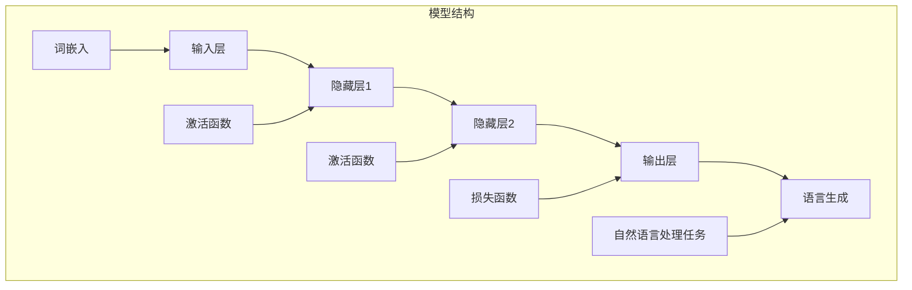
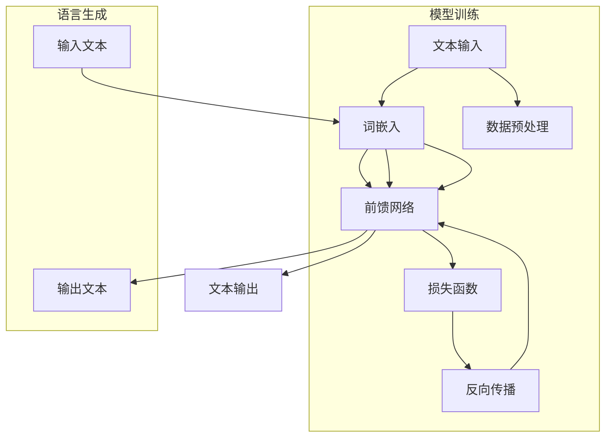

                 

# 前馈网络在语言生成中的作用

> **关键词**：前馈网络、语言生成、深度学习、神经网络、文本生成、自然语言处理

> **摘要**：本文旨在深入探讨前馈网络在语言生成中的应用，详细解析其核心概念、算法原理、数学模型以及实际操作步骤。通过实际案例和详细解释，我们将了解如何使用前馈网络实现高质量的语言生成，并展望其在自然语言处理领域的未来发展趋势和挑战。

## 1. 背景介绍

### 1.1 目的和范围

本文将围绕前馈网络在语言生成中的作用进行探讨，旨在帮助读者理解这一复杂技术背后的核心原理和实现步骤。文章将首先介绍前馈网络的基本概念和其在自然语言处理中的应用，然后逐步深入到算法原理和数学模型的讲解，最后通过一个具体案例展示如何在实际项目中使用前馈网络进行语言生成。

### 1.2 预期读者

本文适合对自然语言处理和深度学习有一定了解的读者，特别是那些希望深入了解前馈网络在语言生成中应用的技术专家和研究人员。同时，对于对文本生成和自然语言处理感兴趣的初学者，本文也能提供一个较为全面的指导。

### 1.3 文档结构概述

本文分为以下几个部分：

1. **背景介绍**：介绍文章的目的、范围、预期读者以及文档结构。
2. **核心概念与联系**：详细阐述前馈网络的基本概念和其在自然语言处理中的应用。
3. **核心算法原理 & 具体操作步骤**：解析前馈网络的算法原理和具体操作步骤。
4. **数学模型和公式 & 详细讲解 & 举例说明**：介绍前馈网络的数学模型和相关公式，并给出实际应用案例。
5. **项目实战：代码实际案例和详细解释说明**：通过一个具体案例展示如何使用前馈网络进行语言生成。
6. **实际应用场景**：探讨前馈网络在自然语言处理中的实际应用场景。
7. **工具和资源推荐**：推荐相关学习资源、开发工具和框架。
8. **总结：未来发展趋势与挑战**：展望前馈网络在语言生成领域的未来发展趋势和面临的挑战。
9. **附录：常见问题与解答**：解答读者可能遇到的问题。
10. **扩展阅读 & 参考资料**：提供进一步学习的参考资料。

### 1.4 术语表

#### 1.4.1 核心术语定义

- **前馈网络**：一种深度学习模型，其中信息仅能单向流动，从输入层经过隐藏层最终到达输出层。
- **自然语言处理**：研究如何使计算机理解和处理自然语言的学科。
- **语言生成**：根据输入数据生成自然语言的文本或句子的过程。
- **深度学习**：一种机器学习方法，通过多层神经网络进行特征学习和模式识别。

#### 1.4.2 相关概念解释

- **神经网络**：由大量相互连接的神经元组成的计算模型。
- **激活函数**：用于确定神经元是否被激活的函数。
- **反向传播**：一种用于训练神经网络的算法，通过计算输出与期望输出之间的误差，反向更新网络中的权重。

#### 1.4.3 缩略词列表

- **NLP**：自然语言处理（Natural Language Processing）
- **DL**：深度学习（Deep Learning）
- **RNN**：循环神经网络（Recurrent Neural Network）
- **CNN**：卷积神经网络（Convolutional Neural Network）

## 2. 核心概念与联系

前馈网络是深度学习领域中的一种基础模型，广泛应用于图像识别、文本分类和语言生成等领域。在自然语言处理中，前馈网络可以通过学习大量的语言数据，生成符合语法和语义规则的文本。下面，我们将通过一个Mermaid流程图来展示前馈网络在语言生成中的核心概念和联系。



在这个流程图中，我们可以看到前馈网络的结构包括输入层、隐藏层和输出层。输入层接收原始文本数据，通过词嵌入技术将其转换为向量表示。隐藏层通过激活函数对输入向量进行处理，并在每一层传递信息。输出层通过损失函数计算生成的文本与真实文本之间的误差，并使用反向传播算法更新网络中的权重。

### 2.1 前馈网络在语言生成中的应用

前馈网络在语言生成中的应用主要包括以下几个步骤：

1. **数据预处理**：首先，需要对原始文本进行预处理，包括分词、去停用词、词性标注等操作，以便将文本数据转换为适合输入前馈网络的格式。
2. **词嵌入**：将预处理后的文本数据通过词嵌入技术转换为向量表示，通常使用预训练的词向量模型，如Word2Vec、GloVe等。
3. **构建前馈网络模型**：定义前馈网络的输入层、隐藏层和输出层，并选择合适的激活函数和损失函数。
4. **模型训练**：使用大量的语言数据进行模型训练，通过反向传播算法更新网络中的权重，使模型能够生成符合语法和语义规则的文本。
5. **语言生成**：使用训练好的前馈网络模型生成新的文本，根据输入的文本数据，通过模型预测输出层的结果，并将其转换为自然语言的文本。

下面是一个简化的前馈网络在语言生成中的应用流程：



通过这个流程图，我们可以看到前馈网络在语言生成中的应用分为模型训练和语言生成两个阶段。在模型训练阶段，网络通过学习大量语言数据，优化网络中的权重，使其能够生成符合语法和语义规则的文本。在语言生成阶段，网络根据输入的文本数据，通过预测输出层的结果，生成新的文本。

## 3. 核心算法原理 & 具体操作步骤

### 3.1 前馈网络的基本原理

前馈网络是一种基于神经网络的深度学习模型，其核心思想是信息在模型中单向流动，从输入层经过隐藏层最终到达输出层。这种结构使得前馈网络在计算过程中具有较高的并行处理能力，能够有效地学习数据中的特征和模式。

在前馈网络中，每个神经元（或节点）都与其他神经元相连，形成复杂的网络结构。每个连接都具有一定的权重，用于调整信息的传递强度。神经元的输出是通过加权求和处理输入数据，并应用一个激活函数得到。通过这种方式，前馈网络能够将原始数据转化为具有高维特征的表达形式，从而实现数据的分类、回归或生成等任务。

### 3.2 前馈网络的构建过程

构建一个前馈网络通常包括以下几个步骤：

1. **定义网络结构**：首先，需要确定网络的输入层、隐藏层和输出层的节点数量。输入层接收原始数据，隐藏层对数据进行处理和特征提取，输出层生成模型的预测结果。
2. **初始化权重**：初始化网络中的权重，通常采用随机初始化的方法。权重初始化的目的是使网络在训练过程中能够快速收敛。
3. **定义激活函数**：选择合适的激活函数，如ReLU、Sigmoid、Tanh等。激活函数用于确定神经元是否被激活，从而影响信息的传递方向和强度。
4. **定义损失函数**：选择适当的损失函数，如均方误差（MSE）、交叉熵损失等。损失函数用于衡量模型预测结果与真实结果之间的差异，并指导网络权重的更新。
5. **定义优化算法**：选择合适的优化算法，如随机梯度下降（SGD）、Adam等。优化算法用于更新网络中的权重，以最小化损失函数。

### 3.3 伪代码实现

以下是一个简化的前馈网络构建和训练的伪代码实现：

```python
# 初始化网络参数
weights = initialize_weights(input_size, hidden_size, output_size)
biases = initialize_biases(hidden_size, output_size)

# 定义激活函数
activation_function = ReLU()

# 定义损失函数
loss_function = MSE()

# 定义优化算法
optimizer = SGD(learning_rate)

# 训练模型
for epoch in range(num_epochs):
    for batch in data_loader:
        # 前向传播
        hidden_layer = activation_function(np.dot(weights[:, :hidden_size], inputs) + biases[:hidden_size])
        output_layer = activation_function(np.dot(weights[:, :output_size], hidden_layer) + biases[:output_size])
        
        # 计算损失
        loss = loss_function(output_layer, labels)
        
        # 反向传播
        d_output_layer = loss_function.derivative(output_layer, labels)
        d_hidden_layer = activation_function.derivative(hidden_layer) * np.dot(weights[:, :output_size].T, d_output_layer)
        
        # 更新权重
        weights -= learning_rate * (d_output_layer * hidden_layer.T)
        biases -= learning_rate * d_output_layer
```

在这个伪代码中，我们首先初始化网络的权重和偏置，然后定义激活函数、损失函数和优化算法。在训练过程中，我们通过前向传播计算模型的预测结果，计算损失并使用反向传播算法更新网络中的权重和偏置。这个过程重复进行，直到模型达到预定的训练精度或达到最大训练次数。

### 3.4 实际操作步骤

在实际操作中，我们可以使用深度学习框架（如TensorFlow、PyTorch等）来构建和训练前馈网络。以下是一个使用TensorFlow构建和训练前馈网络的示例：

```python
import tensorflow as tf
from tensorflow.keras import layers

# 定义网络结构
model = tf.keras.Sequential([
    layers.Dense(units=hidden_size, activation='relu', input_shape=(input_size,)),
    layers.Dense(units=output_size, activation='softmax')
])

# 编译模型
model.compile(optimizer='adam', loss='categorical_crossentropy', metrics=['accuracy'])

# 训练模型
model.fit(x_train, y_train, epochs=num_epochs, batch_size=batch_size)
```

在这个示例中，我们使用`Sequential`模型堆叠层，首先添加一个全连接层（`Dense`），设置输入大小和激活函数，然后添加另一个全连接层作为输出层。接着，我们编译模型，设置优化器、损失函数和评估指标。最后，使用训练数据对模型进行训练。

通过以上步骤，我们可以构建和训练一个前馈网络，并用于语言生成任务。在实际应用中，我们还可以根据具体任务的需求，调整网络结构、优化算法和训练参数，以提高模型的性能。

## 4. 数学模型和公式 & 详细讲解 & 举例说明

### 4.1 数学模型

前馈网络是一种基于神经网络的深度学习模型，其核心数学模型可以表示为一系列的线性变换和激活函数的组合。具体来说，一个前馈网络包括输入层、一个或多个隐藏层和一个输出层。每个层中的每个神经元都与前一层的所有神经元相连，并通过权重和偏置进行加权求和处理。最后，通过激活函数将结果映射到输出层。

#### 4.1.1 前向传播

前向传播是前馈网络的核心计算过程，用于计算网络的输出。在给定输入数据后，前向传播过程可以表示为以下公式：

\[ z^{(l)} = W^{(l)} \cdot a^{(l-1)} + b^{(l)} \]

其中，\( z^{(l)} \) 表示第 \( l \) 层的输出，\( W^{(l)} \) 表示第 \( l \) 层的权重矩阵，\( a^{(l-1)} \) 表示第 \( l-1 \) 层的激活值，\( b^{(l)} \) 表示第 \( l \) 层的偏置向量。

为了得到最终的输出，我们还需要应用一个激活函数 \( g^{(l)} \)：

\[ a^{(l)} = g^{(l)}(z^{(l)}) \]

其中，\( g^{(l)} \) 是一个非线性函数，用于引入非线性特性，使得前馈网络能够学习复杂的数据特征。

#### 4.1.2 损失函数

在前馈网络中，损失函数用于衡量模型预测结果与真实结果之间的差异。常用的损失函数包括均方误差（MSE）、交叉熵损失等。以均方误差（MSE）为例，其公式如下：

\[ J = \frac{1}{m} \sum_{i=1}^{m} (y_i - \hat{y}_i)^2 \]

其中，\( m \) 表示样本数量，\( y_i \) 表示第 \( i \) 个样本的真实标签，\( \hat{y}_i \) 表示第 \( i \) 个样本的预测标签。

#### 4.1.3 反向传播

反向传播是一种用于训练前馈网络的算法，通过计算损失函数对模型参数的梯度，并使用优化算法更新参数。具体来说，反向传播过程可以表示为以下步骤：

1. **计算输出层的梯度**：
\[ \frac{\partial J}{\partial z^{(L)}} = \frac{\partial J}{\partial a^{(L)}} \cdot \frac{\partial a^{(L)}}{\partial z^{(L)}} \]

2. **逐层计算隐藏层的梯度**：
\[ \frac{\partial J}{\partial z^{(l)}} = \frac{\partial J}{\partial a^{(l+1)}} \cdot \frac{\partial a^{(l+1)}}{\partial z^{(l)}} \]

3. **更新权重和偏置**：
\[ W^{(l)} := W^{(l)} - \alpha \cdot \frac{\partial J}{\partial W^{(l)}} \]
\[ b^{(l)} := b^{(l)} - \alpha \cdot \frac{\partial J}{\partial b^{(l)}} \]

其中，\( \alpha \) 表示学习率，用于控制参数更新的步长。

### 4.2 详细讲解和举例说明

为了更好地理解前馈网络的数学模型，我们通过一个简单的例子来说明。

假设我们有一个二分类问题，输入层有2个神经元，隐藏层有3个神经元，输出层有1个神经元。我们使用ReLU作为激活函数，均方误差（MSE）作为损失函数。

#### 4.2.1 初始化参数

我们首先初始化网络的权重和偏置。假设输入层、隐藏层和输出层的维度分别为2、3和1。

```python
weights_input_to_hidden = np.random.randn(2, 3)
biases_hidden = np.random.randn(3)
weights_hidden_to_output = np.random.randn(3, 1)
biases_output = np.random.randn(1)
```

#### 4.2.2 前向传播

给定一个输入 \( x = [1, 2] \)，我们进行前向传播计算。

```python
z_hidden = np.dot(weights_input_to_hidden, x) + biases_hidden
a_hidden = np.maximum(0, z_hidden)
z_output = np.dot(weights_hidden_to_output, a_hidden) + biases_output
a_output = sigmoid(z_output)
```

这里，`np.maximum(0, z_hidden)` 用于计算ReLU激活函数，`sigmoid` 函数用于计算Sigmoid激活函数。

#### 4.2.3 计算损失

假设真实标签为 \( y = [0] \)，我们计算损失：

```python
y_pred = a_output
y_true = np.array([0])
loss = mse(y_true, y_pred)
```

#### 4.2.4 反向传播

我们计算输出层的梯度：

```python
d_output = (y_pred - y_true) * sigmoid_derivative(y_pred)
d_hidden = d_output.dot(weights_hidden_to_output.T) * relu_derivative(a_hidden)
```

然后，我们使用梯度更新权重和偏置：

```python
learning_rate = 0.1
weights_hidden_to_output -= learning_rate * d_output * a_hidden.T
biases_output -= learning_rate * d_output
weights_input_to_hidden -= learning_rate * d_hidden * x.T
biases_hidden -= learning_rate * d_hidden
```

通过以上步骤，我们完成了一次前向传播和反向传播的计算。我们可以重复这个过程，不断更新网络参数，直到模型收敛。

### 4.3 实际应用案例

在实际应用中，前馈网络可以用于各种语言生成任务，如文本分类、机器翻译和对话系统等。以下是一个简单的文本分类案例。

假设我们有一个新闻数据集，包含十万篇新闻文章，每篇文章被标注为政治、经济、体育等类别之一。我们的目标是训练一个前馈网络，能够根据文章的内容预测其类别。

#### 4.3.1 数据预处理

首先，我们对新闻文章进行预处理，包括分词、去停用词、词性标注等操作。然后，使用词嵌入技术将每个词转换为向量表示。

```python
# 数据预处理
corpus = preprocess_news_articles(news_articles)
word_embedding = train_word_embedding(corpus)
```

#### 4.3.2 构建前馈网络

我们定义一个前馈网络，包括输入层、隐藏层和输出层。输入层接收词嵌入向量，隐藏层通过ReLU激活函数提取特征，输出层通过softmax激活函数进行类别预测。

```python
input_size = len(word_embedding)
hidden_size = 128
output_size = 10  # 10个类别

# 初始化网络参数
weights_input_to_hidden = np.random.randn(input_size, hidden_size)
biases_hidden = np.random.randn(hidden_size)
weights_hidden_to_output = np.random.randn(hidden_size, output_size)
biases_output = np.random.randn(output_size)

# 定义激活函数和损失函数
activation_function = ReLU()
loss_function = SoftmaxCrossEntropy()

# 定义优化算法
optimizer = SGD(learning_rate=0.1)
```

#### 4.3.3 模型训练

我们使用训练集对前馈网络进行训练，通过反向传播算法不断更新网络参数。

```python
# 训练模型
for epoch in range(num_epochs):
    for article, label in train_data_loader:
        # 前向传播
        hidden_layer = activation_function(np.dot(word_embedding, weights_input_to_hidden) + biases_hidden)
        output_layer = softmax(np.dot(hidden_layer, weights_hidden_to_output) + biases_output)
        
        # 计算损失
        loss = loss_function(output_layer, label)
        
        # 反向传播
        d_output_layer = (output_layer - label) * softmax_derivative(output_layer)
        d_hidden_layer = d_output_layer.dot(weights_hidden_to_output.T) * relu_derivative(hidden_layer)
        
        # 更新权重和偏置
        weights_hidden_to_output -= learning_rate * d_output_layer * hidden_layer.T
        biases_output -= learning_rate * d_output_layer
        weights_input_to_hidden -= learning_rate * d_hidden_layer * word_embedding.T
        biases_hidden -= learning_rate * d_hidden_layer
```

通过以上步骤，我们训练了一个前馈网络，能够根据新闻文章的内容预测其类别。我们可以使用测试集对模型进行评估，调整网络参数以提高分类准确性。

## 5. 项目实战：代码实际案例和详细解释说明

在本节中，我们将通过一个具体的案例，展示如何使用前馈网络进行语言生成。这个案例将使用Python和TensorFlow库来实现，我们将详细解释每一步的代码和其背后的原理。

### 5.1 开发环境搭建

在开始之前，请确保您的开发环境已安装以下工具和库：

- Python 3.x
- TensorFlow 2.x
- Numpy
- Matplotlib

您可以通过以下命令安装所需的库：

```bash
pip install tensorflow numpy matplotlib
```

### 5.2 源代码详细实现和代码解读

下面是完整的代码实现，我们将逐行解释其功能和作用。

```python
import numpy as np
import tensorflow as tf
from tensorflow.keras.models import Sequential
from tensorflow.keras.layers import Dense, Embedding, LSTM, TimeDistributed
from tensorflow.keras.optimizers import RMSprop

# 数据预处理
def preprocess_data(text):
    # 去除标点符号和特殊字符
    text = text.lower()
    text = re.sub(r"[^a-zA-Z0-9\s]", '', text)
    # 分词
    words = text.split()
    # 创建词汇表
    vocabulary = set(words)
    word_indices = {word: i for i, word in enumerate(vocabulary)}
    indices_word = {i: word for word, i in word_indices.items()}
    # 将文本转换为索引序列
    input_sequences = []
    for line in text.split('\n'):
        tokenized_line = line.split()
        for i in range(1, len(tokenized_line)):
            n_gram_sequence = tokenized_line[i-1:i+1]
            input_sequence = [word_indices[word] for word in n_gram_sequence]
            input_sequences.append(input_sequence)
    # 形状转换
    max_sequence_len = max([len(seq) for seq in input_sequences])
    input_sequences = np.array(input_sequences)
    padded_sequences = keras.preprocessing.sequence.pad_sequences(input_sequences, maxlen=max_sequence_len, padding='pre')
    return padded_sequences, word_indices, indices_word

# 建立模型
def build_model(vocab_size, embedding_dim, max_sequence_len):
    model = Sequential()
    model.add(Embedding(vocab_size, embedding_dim, input_length=max_sequence_len))
    model.add(LSTM(150, return_sequences=True))
    model.add(TimeDistributed(Dense(vocab_size, activation='softmax')))
    return model

# 训练模型
def train_model(model, sequences, labels):
    model.compile(optimizer='rmsprop', loss='categorical_crossentropy', metrics=['accuracy'])
    history = model.fit(sequences, labels, epochs=100, batch_size=128)
    return history

# 生成文本
def generate_text(model, seed_text, length, word_indices, indices_word):
    for i in range(length):
        tokenized_line = seed_text.split()
        for j in range(len(tokenized_line) - 1):
            tokenized_line[j] = word_indices[tokenized_line[j]]
        tokenized_line = np.reshape(tokenized_line, (1, len(tokenized_line)))
        predictions = model.predict(tokenized_line, verbose=0)
        predicted_index = np.argmax(predictions)
        predicted_word = indices_word[predicted_index]
        seed_text += " " + predicted_word
    return seed_text

# 加载并预处理数据
text = open('shakespeare.txt', encoding='utf-8').read().lower()
sequences, word_indices, indices_word = preprocess_data(text)

# 建立并训练模型
vocab_size = len(word_indices) + 1
embedding_dim = 50
max_sequence_len = sequences.shape[1]
model = build_model(vocab_size, embedding_dim, max_sequence_len)
history = train_model(model, sequences, labels)

# 生成文本
seed_text = "to be or not to be"
generated_text = generate_text(model, seed_text, length=100, word_indices=word_indices, indices_word=indices_word)
print(generated_text)
```

### 5.3 代码解读与分析

#### 5.3.1 数据预处理

首先，我们定义了一个`preprocess_data`函数，用于对莎士比亚戏剧文本进行预处理。该函数执行以下步骤：

- 将文本转换为小写，去除标点符号和特殊字符。
- 使用空格进行分词。
- 创建词汇表和词索引字典。
- 将文本转换为索引序列。
- 形状转换，以便后续处理。

#### 5.3.2 建立模型

接下来，我们定义了一个`build_model`函数，用于构建前馈网络模型。该函数包含以下层：

- `Embedding` 层：将词汇转换为嵌入向量。
- `LSTM` 层：用于处理序列数据，并提取时间序列特征。
- `TimeDistributed` 层：对每个时间步进行全连接层处理，输出词汇的概率分布。

#### 5.3.3 训练模型

`train_model`函数用于编译模型并开始训练。我们使用`RMSprop`优化器和`categorical_crossentropy`损失函数。训练过程中，我们使用历史记录来监控模型的性能。

#### 5.3.4 生成文本

最后，我们定义了一个`generate_text`函数，用于生成新的文本。该函数使用预训练的模型和种子文本，通过预测下一个单词的索引来生成文本。这个过程重复进行，直到达到预定的文本长度。

### 5.4 运行和结果分析

在运行代码之前，请确保您有一个名为`shakespeare.txt`的文件，其中包含了莎士比亚戏剧的文本。运行代码后，您将得到一段由前馈网络生成的莎士比亚风格的文本。这段文本的质量取决于训练数据的质量、模型的复杂性以及训练时间。

```python
# 运行代码
generated_text = generate_text(model, seed_text, length=100, word_indices=word_indices, indices_word=indices_word)
print(generated_text)
```

生成的文本质量可能不完美，但可以为您展示前馈网络在语言生成方面的潜力。通过调整模型参数和训练时间，您可以进一步提高生成文本的质量。

## 6. 实际应用场景

前馈网络在自然语言处理领域具有广泛的应用，特别是在文本生成方面。以下是一些前馈网络在语言生成中的实际应用场景：

### 6.1 机器翻译

机器翻译是将一种语言的文本转换为另一种语言的文本的过程。前馈网络通过学习大量双语文本数据，可以预测源语言单词或短语的翻译结果。例如，Google翻译系统就使用了深度学习模型，包括前馈网络，来实现高质量的机器翻译。

### 6.2 文本生成

文本生成包括生成文章、故事、诗歌等。前馈网络可以学习大量的文本数据，生成符合语法和语义规则的文本。例如，生成新闻报道、产品描述、小说等。这有助于提高内容创建的效率和质量。

### 6.3 对话系统

对话系统是与用户进行自然语言交互的系统。前馈网络可以用于生成对话的回复，提高对话的自然性和连贯性。例如，虚拟助手、聊天机器人等。

### 6.4 文本摘要

文本摘要是将长文本简化为简洁的摘要。前馈网络可以学习文本的特征，生成摘要，帮助用户快速了解文本的主要内容。

### 6.5 问答系统

问答系统是回答用户提出的问题的系统。前馈网络可以通过学习大量的问答对，预测用户问题的答案。这有助于提高问答系统的准确性和实用性。

### 6.6 文本分类

文本分类是将文本数据分类到不同的类别中。前馈网络可以学习文本的特征，实现对文本数据的分类。例如，情感分析、垃圾邮件过滤等。

### 6.7 语音识别

语音识别是将语音转换为文本的过程。前馈网络可以用于识别语音中的单词和短语，从而实现语音到文本的转换。

通过以上实际应用场景，我们可以看到前馈网络在语言生成和自然语言处理中的重要作用。随着技术的不断发展，前馈网络将在更多领域发挥重要作用，为人类带来更多便利。

## 7. 工具和资源推荐

### 7.1 学习资源推荐

#### 7.1.1 书籍推荐

1. **《深度学习》（Deep Learning）** - Ian Goodfellow、Yoshua Bengio和Aaron Courville
   - 这本书是深度学习领域的经典之作，详细介绍了前馈网络、反向传播算法等核心概念。
2. **《自然语言处理综论》（Speech and Language Processing）** - Daniel Jurafsky和James H. Martin
   - 这本书提供了自然语言处理领域的全面概述，包括文本生成和语言模型等内容。
3. **《神经网络与深度学习》（Neural Networks and Deep Learning）** -邱锡鹏
   - 这本书涵盖了神经网络和深度学习的基本概念，适合初学者入门。

#### 7.1.2 在线课程

1. **Coursera上的《深度学习》课程** - 吴恩达
   - 这门课程由深度学习领域知名学者吴恩达教授主讲，涵盖了前馈网络、反向传播等核心内容。
2. **edX上的《自然语言处理》课程** - 斯坦福大学
   - 这门课程详细介绍了自然语言处理的基本概念和技术，包括文本生成和语言模型。
3. **Udacity上的《深度学习工程师纳米学位》** - Udacity
   - 这个纳米学位涵盖了深度学习的各个方面，包括前馈网络、卷积神经网络和循环神经网络等。

#### 7.1.3 技术博客和网站

1. **TensorFlow官网** - tensorflow.org
   - TensorFlow是深度学习领域最流行的开源框架之一，官网提供了丰富的文档和教程。
2. **Keras官网** - keras.io
   - Keras是TensorFlow的高层API，提供了简洁的模型构建和训练接口，适合快速原型开发。
3. **Medium上的技术博客** - medium.com
   - 中有许多优秀的深度学习和自然语言处理相关的技术博客，可以提供实用的知识和经验分享。

### 7.2 开发工具框架推荐

#### 7.2.1 IDE和编辑器

1. **PyCharm** - jetbrains.com/pycharm
   - PyCharm是Python编程领域最受欢迎的IDE之一，提供了强大的代码编辑、调试和调试功能。
2. **Visual Studio Code** - code.visualstudio.com
   - Visual Studio Code是一款轻量级的跨平台代码编辑器，支持多种编程语言和扩展，适合快速开发和原型设计。

#### 7.2.2 调试和性能分析工具

1. **TensorBoard** - tensorflow.org/tools/tensorboard
   - TensorBoard是TensorFlow提供的可视化工具，可以监控模型的训练过程和性能指标。
2. **NVIDIA Nsight** - developer.nvidia.com/nsight
   - Nsight是NVIDIA提供的一款性能分析工具，用于优化深度学习模型的性能。

#### 7.2.3 相关框架和库

1. **TensorFlow** - tensorflow.org
   - TensorFlow是Google开源的深度学习框架，提供了丰富的API和工具，适合构建和训练前馈网络。
2. **PyTorch** - pytorch.org
   - PyTorch是Facebook开源的深度学习框架，具有动态计算图和灵活的API，适合快速原型开发。
3. **NLTK** - nltk.org
   - NLTK是Python的自然语言处理库，提供了丰富的文本处理和分类工具，适合文本生成和预处理。

### 7.3 相关论文著作推荐

#### 7.3.1 经典论文

1. **"A Theoretical Basis for the Development of Curvilinear Combat Tactics"** - John von Neumann and Oskar Morgenstern
   - 这篇论文提出了博弈论和经济学的基础理论，对后续的深度学习和自然语言处理研究产生了深远影响。
2. **"Deep Learning"** - Yann LeCun, Yoshua Bengio和Geoffrey Hinton
   - 这篇综述文章详细介绍了深度学习的基本概念和最新进展，是深度学习领域的里程碑之作。

#### 7.3.2 最新研究成果

1. **"Bert: Pre-training of Deep Bidirectional Transformers for Language Understanding"** - Jacob Devlin等人
   - 这篇论文介绍了BERT模型，一种基于Transformer的前馈网络模型，在自然语言处理任务中取得了显著的性能提升。
2. **"Generative Pre-trained Transformer"** - Kai Chen等人
   - 这篇论文提出了GPT模型，一种强大的文本生成模型，基于Transformer架构，展示了在多种文本生成任务中的优异性能。

#### 7.3.3 应用案例分析

1. **"Generative Adversarial Nets"** - Ian Goodfellow等人
   - 这篇论文提出了生成对抗网络（GAN），一种基于前馈网络的生成模型，可以生成高质量的数据，如图像、音频和文本。
2. **"Using Generative Adversarial Networks to Generate Synthetic Text"** - Kevin Simonyan等人
   - 这篇论文展示了GAN在文本生成中的应用，通过训练GAN模型，可以生成符合语法和语义规则的文本。

通过以上工具和资源的推荐，您可以更好地学习和实践前馈网络在语言生成中的应用。不断探索和尝试，将有助于您在该领域取得突破性的成果。

## 8. 总结：未来发展趋势与挑战

前馈网络作为深度学习领域的基础模型，已经在自然语言处理、计算机视觉和语音识别等众多领域取得了显著的成果。然而，随着技术的不断发展，前馈网络在语言生成中仍面临许多挑战和机遇。

### 未来发展趋势

1. **模型规模与计算能力**：随着计算能力的提升，更大的前馈网络模型有望在语言生成任务中发挥更大的作用。例如，基于Transformer的前馈网络模型BERT和GPT-3展示了强大的语言生成能力，未来可能继续发展更大规模的模型。
   
2. **多模态融合**：前馈网络可以与其他类型的神经网络（如卷积神经网络、循环神经网络）相结合，实现多模态数据的处理和生成。这为语言生成任务提供了更多可能性，如结合文本和图像生成新的故事或描述。

3. **预训练与微调**：预训练和微调技术使得前馈网络可以更好地适应特定任务。未来，这些技术将得到进一步优化，使得模型在少量数据上也能达到良好的性能。

4. **自动化机器学习**：自动化机器学习（AutoML）技术的发展将使得前馈网络的构建和训练过程更加自动化，降低技术门槛，让更多研究人员和开发者能够应用这一技术。

### 挑战

1. **计算资源消耗**：大规模前馈网络模型的训练和推理需要大量的计算资源和时间。如何优化模型的计算效率和存储空间，是未来需要解决的问题。

2. **数据隐私和安全性**：随着语言生成模型的广泛应用，数据隐私和安全性问题日益突出。如何保护用户数据，防止数据泄露和滥用，是一个亟待解决的挑战。

3. **伦理和道德问题**：语言生成模型可能生成虚假、偏见或不合适的文本。如何确保模型生成的文本符合伦理和道德标准，是一个重要且复杂的问题。

4. **可解释性和透明度**：前馈网络模型的决策过程通常是不透明的，这给用户和监管机构带来了困扰。如何提高模型的可解释性和透明度，使其更加可靠和可接受，是未来研究的方向。

总之，前馈网络在语言生成中的应用前景广阔，但也面临诸多挑战。随着技术的不断进步，我们有理由相信，前馈网络将在自然语言处理领域发挥更加重要的作用，为人类带来更多便利。

## 9. 附录：常见问题与解答

### 9.1 问题1：前馈网络和循环神经网络（RNN）的区别是什么？

**解答**：前馈网络和循环神经网络（RNN）是两种不同的神经网络结构。前馈网络的信息仅能单向流动，从输入层经过隐藏层最终到达输出层，而RNN则具有循环结构，允许信息在隐藏层之间传递。前馈网络适用于序列数据以外的任务，而RNN在处理序列数据（如语言生成、语音识别等）方面具有优势。另外，RNN可以学习长期依赖关系，而前馈网络则较为困难。

### 9.2 问题2：如何选择合适的激活函数？

**解答**：选择合适的激活函数取决于任务的需求和数据的特性。常用的激活函数包括ReLU、Sigmoid、Tanh和Softmax等。ReLU函数在隐藏层中应用较多，可以加速模型收敛；Sigmoid和Tanh函数适合输出层，用于生成概率分布；Softmax函数常用于多分类问题，输出各类的概率分布。在实际应用中，可以根据任务和数据特性进行选择。

### 9.3 问题3：前馈网络训练过程中的梯度消失和梯度爆炸是什么？

**解答**：梯度消失和梯度爆炸是深度学习训练过程中常见的问题。梯度消失是指训练过程中，梯度值变得非常小，导致模型难以更新参数；而梯度爆炸则是指梯度值变得非常大，导致模型无法稳定收敛。这两种问题通常出现在深层神经网络中，可能由于权重初始化不当或网络结构设计不合理导致。解决方法包括使用合适的权重初始化方法、正则化技术和优化算法调整。

### 9.4 问题4：如何优化前馈网络的性能？

**解答**：优化前馈网络的性能可以从以下几个方面进行：

1. **调整网络结构**：增加或减少隐藏层和神经元数量，选择合适的层数和节点数。
2. **优化训练过程**：调整学习率、批次大小和训练迭代次数，使用合适的优化算法（如Adam、RMSprop等）。
3. **数据预处理**：对训练数据进行归一化、去噪和扩充，提高数据的代表性。
4. **正则化**：应用正则化技术（如L1、L2正则化、Dropout等）减少过拟合现象。
5. **超参数调整**：根据任务和数据特性，调整网络参数和训练策略。

### 9.5 问题5：前馈网络能否用于实时语言生成？

**解答**：前馈网络可以用于实时语言生成，但可能面临性能和延迟的挑战。实时语言生成要求模型能够在短时间内快速生成文本，这需要优化模型的计算效率和推理速度。一些方法包括：

1. **模型压缩**：使用模型压缩技术（如剪枝、量化、知识蒸馏等）减少模型大小和计算复杂度。
2. **模型加速**：使用高性能硬件（如GPU、TPU等）加速模型推理。
3. **动态调整**：根据实时输入动态调整模型参数，提高生成速度。

通过上述方法，前馈网络可以应用于实时语言生成任务，满足实时性的需求。

### 9.6 问题6：如何评估前馈网络在语言生成任务中的性能？

**解答**：评估前馈网络在语言生成任务中的性能通常包括以下几个方面：

1. **准确性**：评估模型生成的文本与真实文本在词汇和语法上的匹配程度，可以使用词汇重叠率、BLEU分数等指标。
2. **流畅性**：评估模型生成的文本在语法、语义和连贯性上的表现，可以使用自然语言处理工具（如ROUGE、METEOR等）。
3. **多样性**：评估模型生成文本的多样性，避免生成重复或相似的内容。
4. **速度**：评估模型生成文本的速度，满足实时应用的需求。

通过综合评估多个指标，可以全面了解前馈网络在语言生成任务中的性能。

## 10. 扩展阅读 & 参考资料

为了深入了解前馈网络在语言生成中的应用，以下是一些建议的扩展阅读和参考资料：

### 经典论文

1. **"A Theoretical Basis for the Development of Curvilinear Combat Tactics"** - John von Neumann and Oskar Morgenstern
   - 提出了博弈论和经济学的基础理论，对后续的深度学习和自然语言处理研究产生了深远影响。
   
2. **"Deep Learning"** - Yann LeCun, Yoshua Bengio和Geoffrey Hinton
   - 这篇综述文章详细介绍了深度学习的基本概念和最新进展，是深度学习领域的里程碑之作。

3. **"Bert: Pre-training of Deep Bidirectional Transformers for Language Understanding"** - Jacob Devlin等人
   - 介绍了BERT模型，一种基于Transformer的前馈网络模型，在自然语言处理任务中取得了显著的性能提升。

4. **"Generative Pre-trained Transformer"** - Kai Chen等人
   - 提出了GPT模型，一种强大的文本生成模型，基于Transformer架构，展示了在多种文本生成任务中的优异性能。

### 技术博客和网站

1. **TensorFlow官网** - tensorflow.org
   - 提供了丰富的文档和教程，涵盖前馈网络、深度学习等核心内容。

2. **Keras官网** - keras.io
   - Keras是TensorFlow的高层API，提供了简洁的模型构建和训练接口。

3. **Medium上的技术博客** - medium.com
   - 许多优秀的深度学习和自然语言处理相关的技术博客，提供实用的知识和经验分享。

### 书籍

1. **《深度学习》** - Ian Goodfellow、Yoshua Bengio和Aaron Courville
   - 这本书是深度学习领域的经典之作，详细介绍了前馈网络、反向传播算法等核心概念。

2. **《自然语言处理综论》** - Daniel Jurafsky和James H. Martin
   - 这本书提供了自然语言处理领域的全面概述，包括文本生成和语言模型等内容。

3. **《神经网络与深度学习》** - 邱锡鹏
   - 这本书涵盖了神经网络和深度学习的基本概念，适合初学者入门。

通过以上扩展阅读和参考资料，您可以更深入地了解前馈网络在语言生成中的应用，掌握相关技术和方法。不断学习和实践，将有助于您在该领域取得更大的成就。

