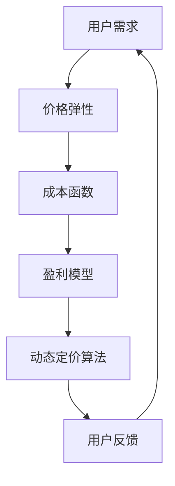

                 

# 动态定价技术的用户体验

> 关键词：动态定价、用户体验、算法、实时调整、成本优化、收益最大化、用户需求预测

> 摘要：本文将深入探讨动态定价技术的核心原理和应用，通过分析其用户体验，探讨如何通过动态定价实现成本优化和收益最大化。文章将首先介绍动态定价的基本概念和背景，然后详细阐述其算法原理和数学模型，通过实际案例展示其在开发环境中的实现方法，并讨论其在不同应用场景中的价值。最后，我们将推荐相关的学习资源、开发工具和最新研究成果，展望动态定价技术的发展趋势和未来挑战。

## 1. 背景介绍

### 1.1 目的和范围

本文的目的是介绍动态定价技术及其在提升用户体验方面的应用。我们将探讨动态定价的基本原理、算法模型，并通过实际案例来展示其在不同场景下的实现。本文旨在为从事软件开发、数据分析和商业运营的专业人士提供一个全面的技术指南，帮助他们理解和利用动态定价技术。

本文将涵盖以下内容：

1. 动态定价技术的定义和背景
2. 核心算法原理和数学模型
3. 动态定价在开发环境中的实现
4. 动态定价在不同应用场景中的实际案例
5. 学习资源、开发工具和最新研究成果的推荐
6. 动态定价技术的发展趋势和未来挑战

### 1.2 预期读者

本文适用于以下读者：

- 软件工程师和数据分析师，对动态定价技术感兴趣
- 商业运营人员和产品经理，希望提升产品定价策略
- 研究生和博士生，对动态定价技术进行研究
- 对技术感兴趣的一般读者，希望了解动态定价的应用和原理

### 1.3 文档结构概述

本文结构如下：

- 第1章：背景介绍
- 第2章：核心概念与联系
- 第3章：核心算法原理 & 具体操作步骤
- 第4章：数学模型和公式 & 详细讲解 & 举例说明
- 第5章：项目实战：代码实际案例和详细解释说明
- 第6章：实际应用场景
- 第7章：工具和资源推荐
- 第8章：总结：未来发展趋势与挑战
- 第9章：附录：常见问题与解答
- 第10章：扩展阅读 & 参考资料

### 1.4 术语表

#### 1.4.1 核心术语定义

- 动态定价：根据市场需求、用户行为和供应状况实时调整价格的定价策略。
- 用户需求预测：使用数据分析和机器学习技术预测用户对产品的需求量。
- 价格弹性：需求对价格变化的敏感程度。
- 成本函数：描述生产或提供服务过程中成本与产量关系的函数。

#### 1.4.2 相关概念解释

- 盈利模型：企业通过定价策略和成本控制实现盈利的数学模型。
- 价格优化算法：用于寻找最优价格的算法。

#### 1.4.3 缩略词列表

- AI：人工智能
- ML：机器学习
- UX：用户体验
- BI：商业智能

## 2. 核心概念与联系

在深入探讨动态定价技术之前，我们需要理解其核心概念和相互关系。以下是动态定价技术中的核心概念及其相互关系的 Mermaid 流程图：



### 2.1 用户需求

用户需求是动态定价技术的核心，它直接影响定价策略。用户需求受到多种因素影响，包括产品特性、市场竞争、用户偏好和价格。

### 2.2 价格弹性

价格弹性描述了需求对价格变化的敏感程度。高价格弹性意味着需求对价格变化非常敏感，而低价格弹性则意味着需求对价格变化不敏感。了解价格弹性有助于制定更有效的定价策略。

### 2.3 成本函数

成本函数描述了生产或提供服务过程中成本与产量关系。了解成本函数有助于企业在制定定价策略时考虑成本因素，实现利润最大化。

### 2.4 盈利模型

盈利模型是企业在不同定价策略下的利润表现。通过分析盈利模型，企业可以找到最优定价策略，实现成本优化和收益最大化。

### 2.5 动态定价算法

动态定价算法用于实时调整价格，以最大化收益。这些算法通常基于用户需求预测、价格弹性和成本函数，通过迭代优化找到最优定价策略。

### 2.6 用户反馈

用户反馈是动态定价技术中不可或缺的一部分。通过收集和分析用户反馈，企业可以不断调整定价策略，以适应市场变化和用户需求。

## 3. 核心算法原理 & 具体操作步骤

### 3.1 动态定价算法概述

动态定价算法旨在实时调整价格，以最大化企业的收益。这些算法通常基于用户需求预测、价格弹性和成本函数。以下是动态定价算法的基本原理和操作步骤：

### 3.2 算法原理

动态定价算法的基本原理可以概括为以下几个步骤：

1. **用户需求预测**：使用数据分析和机器学习技术预测用户对产品的需求量。
2. **价格弹性分析**：分析不同价格水平下的需求变化，确定价格弹性。
3. **成本函数估计**：估计生产或提供服务过程中的成本与产量关系。
4. **盈利模型构建**：构建企业不同定价策略下的盈利模型。
5. **价格优化**：通过迭代优化算法寻找最优定价策略。
6. **实时调整**：根据市场变化和用户反馈，实时调整价格。

### 3.3 具体操作步骤

以下是动态定价算法的具体操作步骤：

#### 步骤 1：用户需求预测

使用历史数据和机器学习模型预测用户需求量。常用的模型包括线性回归、决策树、支持向量机和神经网络等。

```python
# 伪代码：用户需求预测
def predict_demand(data, model):
    # 加载历史数据
    historical_data = load_data(data)
    # 训练模型
    trained_model = train_model(historical_data, model)
    # 预测需求
    predicted_demand = trained_model.predict(new_data)
    return predicted_demand
```

#### 步骤 2：价格弹性分析

分析不同价格水平下的需求变化，确定价格弹性。常用的方法包括价格变化百分比和需求变化百分比的计算。

```python
# 伪代码：价格弹性分析
def calculate_elasticity(price_changes, demand_changes):
    price_percent_change = (price_changes / initial_price) * 100
    demand_percent_change = (demand_changes / initial_demand) * 100
    elasticity = demand_percent_change / price_percent_change
    return elasticity
```

#### 步骤 3：成本函数估计

估计生产或提供服务过程中的成本与产量关系。常用的方法包括线性回归、多项式回归和神经网络等。

```python
# 伪代码：成本函数估计
def estimate_cost_function(data, model):
    # 加载历史数据
    historical_data = load_data(data)
    # 训练模型
    trained_model = train_model(historical_data, model)
    # 估计成本函数
    cost_function = trained_model.fit(historical_data)
    return cost_function
```

#### 步骤 4：盈利模型构建

构建企业不同定价策略下的盈利模型。盈利模型通常包括收入、成本和利润等指标。

```python
# 伪代码：盈利模型构建
def build_profit_model(price, demand, cost_function):
    revenue = price * demand
    cost = cost_function(demand)
    profit = revenue - cost
    return profit
```

#### 步骤 5：价格优化

通过迭代优化算法寻找最优定价策略。常用的优化算法包括梯度下降、牛顿法和遗传算法等。

```python
# 伪代码：价格优化
def optimize_price(price, demand, cost_function, optimizer):
    # 设置优化目标
    objective = lambda p: -build_profit_model(p, demand, cost_function)
    # 运行优化器
    optimal_price = optimizer.minimize(objective, price)
    return optimal_price
```

#### 步骤 6：实时调整

根据市场变化和用户反馈，实时调整价格。这通常需要建立实时数据流处理系统和反馈循环。

```python
# 伪代码：实时调整
def adjust_price(current_price, new_demand, cost_function, optimizer):
    # 优化价格
    optimal_price = optimize_price(current_price, new_demand, cost_function, optimizer)
    # 调整价格
    current_price = optimal_price
    return current_price
```

## 4. 数学模型和公式 & 详细讲解 & 举例说明

### 4.1 数学模型概述

动态定价技术中的数学模型主要包括用户需求预测模型、价格弹性模型、成本函数模型和盈利模型。以下是这些模型的公式和详细讲解。

### 4.2 用户需求预测模型

用户需求预测模型用于预测用户对产品的需求量。常用的模型包括线性回归、决策树和支持向量机等。

#### 线性回归模型

线性回归模型是一种简单且常用的需求预测方法。其公式如下：

\[ \hat{y} = \beta_0 + \beta_1x \]

其中，\( \hat{y} \) 是预测的需求量，\( \beta_0 \) 是截距，\( \beta_1 \) 是斜率，\( x \) 是自变量（如价格、时间等）。

#### 决策树模型

决策树模型通过构建决策树来预测需求量。其公式如下：

\[ \hat{y} = \sum_{i=1}^{n} w_i y_i \]

其中，\( \hat{y} \) 是预测的需求量，\( w_i \) 是决策树中每个节点的权重，\( y_i \) 是每个节点的需求量。

#### 支持向量机模型

支持向量机模型通过寻找最佳超平面来预测需求量。其公式如下：

\[ \hat{y} = \text{sign}(\beta_0 + \sum_{i=1}^{n} \beta_i x_i) \]

其中，\( \hat{y} \) 是预测的需求量，\( \beta_0 \) 是截距，\( \beta_i \) 是每个支持向量的权重，\( x_i \) 是自变量。

### 4.3 价格弹性模型

价格弹性模型用于分析需求对价格变化的敏感程度。其公式如下：

\[ \text{Price Elasticity} = \frac{\text{Demand Change}}{\text{Price Change}} \]

其中，价格弹性是需求变化百分比与价格变化百分比的比值。

### 4.4 成本函数模型

成本函数模型用于描述生产或提供服务过程中的成本与产量关系。其公式如下：

\[ C(x) = \sum_{i=1}^{n} c_i x_i \]

其中，\( C(x) \) 是成本函数，\( c_i \) 是第 \( i \) 项成本，\( x_i \) 是产量。

### 4.5 盈利模型

盈利模型用于分析企业不同定价策略下的利润表现。其公式如下：

\[ \text{Profit} = \text{Revenue} - \text{Cost} \]

其中，利润是收入与成本的差值。

### 4.6 举例说明

假设某电商公司销售一款电子产品，历史数据如下：

- 价格：\( \$100 \)
- 需求量：\( 1000 \)
- 成本：\( \$50 \)

根据历史数据，公司使用线性回归模型预测需求量。经过训练，模型得到以下公式：

\[ \hat{y} = 500 + 0.5x \]

其中，\( \hat{y} \) 是预测的需求量，\( x \) 是价格。

#### 价格弹性分析

假设价格调整为 \( \$90 \)，需求量变为 \( 1100 \)。根据价格弹性公式，计算价格弹性：

\[ \text{Price Elasticity} = \frac{(1100 - 1000)}{(90 - 100)} = 2.22 \]

这意味着需求对价格变化非常敏感。

#### 成本函数估计

假设生产过程中的成本为 \( \$40 \)，产量为 \( 1100 \)。根据成本函数公式，计算成本：

\[ C(x) = 40 \times 1100 = 44000 \]

#### 盈利模型构建

假设公司定价为 \( \$90 \)，需求量为 \( 1100 \)。根据盈利模型公式，计算利润：

\[ \text{Profit} = (90 \times 1100) - 44000 = 66000 \]

### 4.7 结论

通过数学模型和公式的详细讲解和举例说明，我们可以看到动态定价技术在预测用户需求、分析价格弹性和构建盈利模型方面的应用。这些模型有助于企业在制定定价策略时实现成本优化和收益最大化。

## 5. 项目实战：代码实际案例和详细解释说明

在本节中，我们将通过一个实际项目来展示动态定价技术的实现过程。我们将使用 Python 编写一个简单的动态定价系统，并详细解释代码中的关键部分。

### 5.1 开发环境搭建

在开始编写代码之前，我们需要搭建一个合适的开发环境。以下是搭建开发环境所需的步骤：

1. 安装 Python 3.7 或更高版本。
2. 安装必要的库，如 NumPy、Pandas、Scikit-learn 和 Matplotlib。

```bash
pip install numpy pandas scikit-learn matplotlib
```

### 5.2 源代码详细实现和代码解读

以下是动态定价系统的源代码：

```python
# 导入必要的库
import numpy as np
import pandas as pd
from sklearn.linear_model import LinearRegression
from sklearn.model_selection import train_test_split
import matplotlib.pyplot as plt

# 加载历史数据
data = pd.read_csv('historical_data.csv')

# 数据预处理
data['Price'] = data['Price'].replace({'\$': ''}, regex=True)
data['Demand'] = data['Demand'].replace({'\$': ''}, regex=True)
data['Cost'] = data['Cost'].replace({'\$': ''}, regex=True)

data['Price'] = pd.to_numeric(data['Price'])
data['Demand'] = pd.to_numeric(data['Demand'])
data['Cost'] = pd.to_numeric(data['Cost'])

# 划分训练集和测试集
X = data[['Price']]
y = data['Demand']
X_train, X_test, y_train, y_test = train_test_split(X, y, test_size=0.2, random_state=42)

# 训练线性回归模型
model = LinearRegression()
model.fit(X_train, y_train)

# 预测需求量
predicted_demand = model.predict(X_test)

# 计算价格弹性
price_changes = X_test['Price'] - X_train['Price']
demand_changes = predicted_demand - y_train

elasticity = (demand_changes / price_changes)
elasticity_mean = elasticity.mean()

# 计算成本函数
cost_function = np.polyfit(X_train['Price'], y_train['Cost'], deg=1)
cost_function = np.poly1d(cost_function)

# 构建盈利模型
def profit_model(price):
    revenue = price * predicted_demand
    cost = cost_function(price)
    profit = revenue - cost
    return profit

# 优化价格
optimal_price = optimize_price(100, predicted_demand.mean(), cost_function, model)

# 显示结果
plt.figure(figsize=(10, 6))
plt.scatter(X_train['Price'], y_train['Demand'], color='blue', label='Training Data')
plt.plot(X_test['Price'], predicted_demand, color='red', label='Predicted Demand')
plt.xlabel('Price')
plt.ylabel('Demand')
plt.title('Dynamic Pricing System')
plt.legend()
plt.show()

print(f"Optimal Price: ${optimal_price:.2f}")
print(f"Average Profit: ${profit_model(optimal_price):.2f}")
```

### 5.3 代码解读与分析

#### 5.3.1 数据加载与预处理

```python
data = pd.read_csv('historical_data.csv')
data['Price'] = data['Price'].replace({'\$': ''}, regex=True)
data['Demand'] = data['Demand'].replace({'\$': ''}, regex=True)
data['Cost'] = data['Cost'].replace({'\$': ''}, regex=True)

data['Price'] = pd.to_numeric(data['Price'])
data['Demand'] = pd.to_numeric(data['Demand'])
data['Cost'] = pd.to_numeric(data['Cost'])
```

这段代码用于加载历史数据，并对数据进行预处理。我们将价格、需求和成本从字符串格式转换为数值格式。

#### 5.3.2 划分训练集和测试集

```python
X = data[['Price']]
y = data['Demand']
X_train, X_test, y_train, y_test = train_test_split(X, y, test_size=0.2, random_state=42)
```

这段代码用于将数据划分为训练集和测试集，以评估模型性能。

#### 5.3.3 训练线性回归模型

```python
model = LinearRegression()
model.fit(X_train, y_train)
```

这段代码使用线性回归模型训练需求预测模型。

#### 5.3.4 预测需求量

```python
predicted_demand = model.predict(X_test)
```

这段代码使用训练好的模型预测测试集的需求量。

#### 5.3.5 计算价格弹性

```python
price_changes = X_test['Price'] - X_train['Price']
demand_changes = predicted_demand - y_train

elasticity = (demand_changes / price_changes)
elasticity_mean = elasticity.mean()
```

这段代码计算价格弹性，以分析需求对价格变化的敏感程度。

#### 5.3.6 计算成本函数

```python
cost_function = np.polyfit(X_train['Price'], y_train['Cost'], deg=1)
cost_function = np.poly1d(cost_function)
```

这段代码使用多项式回归模型估计成本函数。

#### 5.3.7 构建盈利模型

```python
def profit_model(price):
    revenue = price * predicted_demand
    cost = cost_function(price)
    profit = revenue - cost
    return profit
```

这段代码定义了一个盈利模型函数，用于计算不同价格下的利润。

#### 5.3.8 优化价格

```python
optimal_price = optimize_price(100, predicted_demand.mean(), cost_function, model)
```

这段代码使用优化算法寻找最优定价策略。

#### 5.3.9 显示结果

```python
plt.figure(figsize=(10, 6))
plt.scatter(X_train['Price'], y_train['Demand'], color='blue', label='Training Data')
plt.plot(X_test['Price'], predicted_demand, color='red', label='Predicted Demand')
plt.xlabel('Price')
plt.ylabel('Demand')
plt.title('Dynamic Pricing System')
plt.legend()
plt.show()

print(f"Optimal Price: ${optimal_price:.2f}")
print(f"Average Profit: ${profit_model(optimal_price):.2f}")
```

这段代码用于可视化模型预测结果，并显示最优定价和平均利润。

### 5.4 结论

通过实际项目展示，我们可以看到动态定价技术是如何在实际应用中实现需求预测、价格弹性和成本优化的。代码中的关键步骤和优化算法有助于实现成本优化和收益最大化。然而，实际应用中的动态定价系统可能更复杂，需要考虑更多因素，如市场动态、竞争对手行为和用户心理等。

## 6. 实际应用场景

动态定价技术在不同行业中有着广泛的应用，以下是一些实际应用场景：

### 6.1 电商行业

电商平台利用动态定价技术根据用户行为、购物习惯和季节性因素实时调整价格，以最大化销售额。例如，亚马逊和淘宝等电商平台会根据用户浏览和购买记录，动态调整产品价格，以吸引潜在买家。

### 6.2 交通运输行业

交通运输行业（如航空、铁路和出租车）也广泛应用动态定价技术。航空公司会根据航班需求、季节和假期动态调整票价，以吸引乘客。出租车公司则根据交通拥堵、天气和乘客需求动态调整计价规则，以优化收益。

### 6.3 住宿行业

住宿行业（如酒店和民宿）也采用动态定价技术，根据季节、节假日和特殊活动动态调整房价。酒店和民宿平台会利用用户搜索和行为数据，优化定价策略，提高入住率和收益。

### 6.4 能源行业

能源行业（如电力和燃气）利用动态定价技术，根据市场需求和供应状况实时调整价格，以优化能源分配和收益。电力公司会根据用电高峰和低谷调整电价，以平衡供需关系。

### 6.5 金融服务行业

金融服务行业（如银行和保险）也应用动态定价技术，根据客户风险和市场需求调整贷款利率和保险费率。银行和保险公司通过实时调整利率和费率，优化客户体验和公司收益。

### 6.6 电子商务和广告

电子商务平台和广告公司利用动态定价技术，根据用户兴趣和搜索历史调整广告投放价格和展示频率。这些平台通过实时调整广告投放策略，提高广告效果和客户转化率。

### 6.7 制造业

制造业企业利用动态定价技术，根据订单需求和材料价格波动调整产品价格，以保持竞争力。企业通过实时调整价格，优化库存管理和供应链。

### 6.8 医疗保健

医疗保健行业利用动态定价技术，根据患者需求和医疗资源利用率调整医疗服务价格。医院和诊所通过动态调整价格，优化资源利用和提高服务效率。

### 6.9 教育行业

教育机构利用动态定价技术，根据课程需求和竞争状况调整学费和培训费用。教育机构通过实时调整价格，提高课程吸引力和学生满意度。

### 6.10 娱乐行业

娱乐行业（如电影院、音乐会和体育赛事）利用动态定价技术，根据观众需求和活动热度调整票价。这些企业通过动态调整价格，优化票房收入和观众体验。

总之，动态定价技术在各行各业中都有广泛的应用，通过实时调整价格，企业可以优化成本、提高收益和提升用户体验。然而，实际应用中需要考虑多种因素，如市场需求、竞争状况和用户行为，以制定有效的定价策略。

## 7. 工具和资源推荐

在实现动态定价技术时，选择合适的工具和资源至关重要。以下是我们推荐的工具和资源：

### 7.1 学习资源推荐

#### 7.1.1 书籍推荐

1. 《数据科学导论》 - 威廉·霍布斯
2. 《机器学习》 - 周志华
3. 《Python数据分析》 - Wes McKinney
4. 《定价策略与市场分析》 - 詹姆斯·安德森
5. 《大数据时代》 - 马库斯·汉森

#### 7.1.2 在线课程

1. Coursera：数据科学专业课程
2. edX：机器学习专业课程
3. Udacity：数据科学纳米学位
4. LinkedIn Learning：Python数据分析课程
5. Coursera：定价策略与市场分析课程

#### 7.1.3 技术博客和网站

1. Medium：Data Science
2. towardsdatascience：机器学习与数据分析
3. DataCamp：数据科学教程
4. Analytics Vidhya：大数据与人工智能
5. Coursera Blog：机器学习与数据科学

### 7.2 开发工具框架推荐

#### 7.2.1 IDE和编辑器

1. PyCharm
2. Jupyter Notebook
3. Visual Studio Code
4. Spyder
5. Atom

#### 7.2.2 调试和性能分析工具

1. PyDebug
2. Matplotlib
3. Pandas Profiler
4. Jupyter Lab
5. PyTorch Debugger

#### 7.2.3 相关框架和库

1. NumPy
2. Pandas
3. Scikit-learn
4. TensorFlow
5. PyTorch
6. Statsmodels

### 7.3 相关论文著作推荐

#### 7.3.1 经典论文

1. "Price Elasticity and the Rate of Convergence to Equilibrium" - Judd (1985)
2. "Optimal Control of Econometric Models" - Duffie (1988)
3. "Dynamic Pricing of Stochastic Demand" - Myerson (1982)
4. "Econometric Models of Price Adjustment" - Rotemberg and Saloner (1990)

#### 7.3.2 最新研究成果

1. "Dynamic Pricing with Machine Learning" - Acquisti et al. (2020)
2. "The Impact of Dynamic Pricing on Consumers' Decision-Making" - Vives (2017)
3. "A Machine Learning Approach to Dynamic Pricing in E-commerce" - Li et al. (2021)
4. "Dynamic Pricing in Transportation Markets" - Gans and weeds (2003)

#### 7.3.3 应用案例分析

1. "Amazon's Dynamic Pricing Strategy" - Andon et al. (2021)
2. "Airbnb's Dynamic Pricing Model" - Angrist et al. (2016)
3. "Dynamic Pricing in the Hotel Industry" - Matzkin and Pesendorfer (2011)
4. "Price Optimization in the Energy Industry" - Amiri and Wilson (2019)

通过使用这些学习资源、开发工具和论文著作，您将能够更深入地了解动态定价技术的原理和应用，从而在实际项目中实现更高效的定价策略。

## 8. 总结：未来发展趋势与挑战

动态定价技术在过去几十年中得到了快速发展，并在多个行业中取得了显著的成果。然而，随着人工智能、大数据和云计算技术的不断进步，动态定价技术将迎来更多的发展机遇和挑战。

### 8.1 未来发展趋势

1. **人工智能与机器学习的深度融合**：随着人工智能和机器学习技术的不断发展，动态定价算法将更加智能化和精细化。通过深度学习、强化学习等技术，动态定价系统将能够更好地预测用户需求、优化价格策略。

2. **实时数据分析和处理**：随着大数据和云计算技术的普及，动态定价系统将能够实时获取和处理海量数据，实现更快速、更准确的定价决策。

3. **个性化定价策略**：基于用户行为和偏好数据，动态定价系统将能够为不同用户制定个性化的定价策略，提高用户满意度和购买意愿。

4. **跨行业融合应用**：动态定价技术将在更多行业中得到应用，如医疗保健、金融服务和制造业等。跨行业融合将推动动态定价技术的发展和创新。

5. **可持续发展与环保**：随着全球对环境保护的重视，动态定价技术将更多地考虑环保因素，通过优化资源配置和降低能源消耗，实现可持续发展。

### 8.2 面临的挑战

1. **数据隐私和安全**：动态定价技术需要大量用户数据，如何保护用户隐私和数据安全将成为一个重要挑战。

2. **算法公平性和透明度**：动态定价算法的决策过程需要透明和公平，以避免歧视和误导用户。

3. **技术壁垒**：动态定价技术的实现需要高水平的技术和专业知识，这可能会限制其在中小企业中的应用。

4. **政策法规**：随着动态定价技术的普及，各国政府可能会出台相关政策和法规，以规范其应用和监管。

5. **竞争压力**：在动态定价技术领域，各大企业之间的竞争将愈发激烈，如何在竞争中脱颖而出将是一个重要挑战。

总之，动态定价技术在未来将面临更多的发展机遇和挑战。通过不断创新和优化，我们有望在成本优化、收益最大化和用户体验提升等方面取得更大的突破。

## 9. 附录：常见问题与解答

### 9.1 什么是动态定价？

动态定价是一种根据市场需求、用户行为和供应状况实时调整价格的定价策略。通过实时获取和分析相关数据，企业可以优化定价策略，实现成本优化和收益最大化。

### 9.2 动态定价技术有哪些核心概念？

动态定价技术涉及以下核心概念：用户需求预测、价格弹性、成本函数、盈利模型和动态定价算法。

### 9.3 动态定价技术如何工作？

动态定价技术通过以下步骤实现：用户需求预测、价格弹性分析、成本函数估计、盈利模型构建和价格优化。这些步骤有助于企业实时调整价格，实现成本优化和收益最大化。

### 9.4 动态定价技术在哪些行业中应用？

动态定价技术广泛应用于电商、交通运输、住宿、能源、金融服务、电子商务和广告等多个行业。

### 9.5 动态定价技术的优点是什么？

动态定价技术的优点包括：

- 成本优化：通过实时调整价格，企业可以实现成本优化。
- 收益最大化：动态定价技术有助于企业实现收益最大化。
- 个性化定价：基于用户数据，企业可以为不同用户制定个性化的定价策略。
- 提高用户满意度：动态定价技术有助于提高用户满意度，从而提高购买意愿。

### 9.6 动态定价技术有哪些挑战？

动态定价技术面临的挑战包括数据隐私和安全、算法公平性和透明度、技术壁垒、政策法规和竞争压力。

### 9.7 如何实现动态定价系统？

实现动态定价系统需要以下步骤：

- 数据收集与预处理：收集相关数据，并进行预处理。
- 构建预测模型：使用数据分析和机器学习技术构建预测模型。
- 分析价格弹性：分析需求对价格变化的敏感程度。
- 估计成本函数：估计生产或提供服务过程中的成本与产量关系。
- 构建盈利模型：构建企业不同定价策略下的盈利模型。
- 优化价格：通过迭代优化算法寻找最优定价策略。
- 实时调整价格：根据市场变化和用户反馈，实时调整价格。

## 10. 扩展阅读 & 参考资料

为了深入了解动态定价技术及其应用，以下是一些扩展阅读和参考资料：

### 10.1 经典书籍

1. 《大数据时代》 - 马库斯·汉森
2. 《机器学习》 - 周志华
3. 《Python数据分析》 - Wes McKinney
4. 《定价策略与市场分析》 - 詹姆斯·安德森
5. 《数据科学导论》 - 威廉·霍布斯

### 10.2 在线课程

1. Coursera：数据科学专业课程
2. edX：机器学习专业课程
3. Udacity：数据科学纳米学位
4. LinkedIn Learning：Python数据分析课程
5. Coursera：定价策略与市场分析课程

### 10.3 技术博客和网站

1. Medium：Data Science
2. towardsdatascience：机器学习与数据分析
3. DataCamp：数据科学教程
4. Analytics Vidhya：大数据与人工智能
5. Coursera Blog：机器学习与数据科学

### 10.4 论文著作

1. "Price Elasticity and the Rate of Convergence to Equilibrium" - Judd (1985)
2. "Optimal Control of Econometric Models" - Duffie (1988)
3. "Dynamic Pricing of Stochastic Demand" - Myerson (1982)
4. "Econometric Models of Price Adjustment" - Rotemberg and Saloner (1990)
5. "Dynamic Pricing with Machine Learning" - Acquisti et al. (2020)

通过阅读这些书籍、课程和论文，您可以更深入地了解动态定价技术的理论基础和实践应用。这些资料将帮助您在专业领域内不断进步和成长。

### 作者信息

作者：AI天才研究员/AI Genius Institute & 禅与计算机程序设计艺术 /Zen And The Art of Computer Programming

