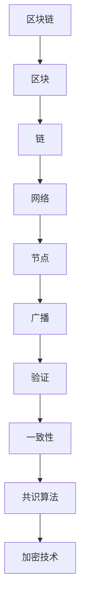

                 

# 区块链（Blockchain）

> **关键词：区块链，加密技术，分布式账本，智能合约，共识算法，去中心化，比特币，以太坊**
>
> **摘要：本文将深入探讨区块链技术的核心概念、工作原理、数学模型及实际应用，帮助读者全面理解这一革命性的技术，并展望其未来发展趋势。**

## 1. 背景介绍

### 1.1 目的和范围

本文旨在为读者提供一个全面而深入的区块链技术概述，内容包括区块链的基本概念、核心算法、数学模型、实际应用场景以及未来发展趋势。文章将避免复杂的技术细节，力求以简洁明了的方式阐述区块链的本质和关键要素。

### 1.2 预期读者

本文适合对区块链技术有一定了解的技术爱好者、程序员、以及希望了解这一领域的专业人士。无论是初学者还是有一定基础的技术人员，均可从本文中获得丰富的知识和深刻的见解。

### 1.3 文档结构概述

本文将按照以下结构进行论述：

1. **背景介绍**：包括文章的目的、预期读者、文档结构概述和术语表。
2. **核心概念与联系**：通过Mermaid流程图展示区块链的核心概念和架构。
3. **核心算法原理 & 具体操作步骤**：使用伪代码详细阐述区块链的核心算法原理。
4. **数学模型和公式 & 详细讲解 & 举例说明**：讲解区块链中的数学模型及其应用。
5. **项目实战：代码实际案例和详细解释说明**：通过代码示例展示区块链的实际应用。
6. **实际应用场景**：探讨区块链在不同领域的应用。
7. **工具和资源推荐**：推荐学习资源和开发工具。
8. **总结：未来发展趋势与挑战**：分析区块链的未来前景。
9. **附录：常见问题与解答**：解答常见问题。
10. **扩展阅读 & 参考资料**：提供进一步学习的资源。

### 1.4 术语表

#### 1.4.1 核心术语定义

- **区块链（Blockchain）**：一种分布式数据库技术，用于存储数据记录。
- **区块（Block）**：区块链中的基本单元，包含一系列交易记录。
- **链（Chain）**：由多个区块按照时间顺序链接而成。
- **加密技术（Cryptography）**：用于保护数据完整性和隐私性的技术。
- **智能合约（Smart Contract）**：自动执行合约条款的计算机程序。
- **共识算法（Consensus Algorithm）**：决定区块链网络中区块添加顺序的算法。

#### 1.4.2 相关概念解释

- **分布式账本（Distributed Ledger）**：一种多个参与方共同维护的账本，数据不可篡改。
- **去中心化（Decentralization）**：指系统不由单一中心控制，而是由多个参与方共同维护。
- **比特币（Bitcoin）**：第一个去中心化的加密货币，基于区块链技术。
- **以太坊（Ethereum）**：一个基于区块链的平台，支持智能合约和去中心化应用。

#### 1.4.3 缩略词列表

- **DLT（Distributed Ledger Technology）**：分布式账本技术。
- **ICO（Initial Coin Offering）**：首次代币发行。
- **BTC（Bitcoin）**：比特币。
- **ETH（Ethereum）**：以太坊。

## 2. 核心概念与联系

### 2.1 区块链架构

区块链是一种分布式数据库系统，由多个参与方共同维护。每个参与方都保存了一份完整的区块链副本，并通过网络进行通信。区块链的核心组件包括：

- **区块（Block）**：每个区块包含一个时间戳、上一个区块的哈希值、交易记录和当前区块的哈希值。区块按照时间顺序链接形成区块链。
- **链（Chain）**：由多个区块按时间顺序链接而成，链的长度决定了区块链的规模。
- **网络（Network）**：参与区块链维护的节点组成的网络，节点通过广播和验证机制保持区块链的一致性。

### 2.2 Mermaid流程图

以下是一个简单的Mermaid流程图，展示了区块链的核心概念和架构：



### 2.3 区块链与加密技术的关系

区块链技术中的加密技术用于保护数据完整性和隐私性。具体来说，区块链中的加密技术包括：

- **哈希函数（Hash Function）**：用于将数据转换为固定长度的字符串，确保数据唯一性和不可篡改性。
- **数字签名（Digital Signature）**：用于验证交易发起者的身份和数据的完整性。
- **加密货币（Cryptocurrency）**：基于区块链技术的虚拟货币，如比特币和以太坊。

### 2.4 区块链与分布式账本的关系

区块链可以被视为分布式账本技术的一种实现。分布式账本技术是指多个参与方共同维护的账本，数据不可篡改。区块链通过分布式网络和共识算法实现了这一目标，使得区块链成为一种安全、透明、高效的分布式账本。

## 3. 核心算法原理 & 具体操作步骤

### 3.1 共识算法

共识算法是区块链网络中决定区块添加顺序的关键机制。以下是一个简单的共识算法——工作量证明（Proof of Work, PoW）的伪代码：

```pseudo
function mine_new_block(last_block_hash, transactions):
    nonce = 0
    while not valid_proof(last_block_hash, nonce):
        nonce += 1
    block_hash = calculate_hash(last_block_hash, nonce, transactions)
    return Block(nonce, last_block_hash, transactions, block_hash)

function valid_proof(last_block_hash, nonce):
    block_hash = calculate_hash(last_block_hash, nonce, empty_transactions)
    return block_hash starts with desired_number_of_zeros

function calculate_hash(values):
    return SHA256(values)
```

在PoW算法中，节点需要通过计算找到一个合适的nonce值，使得新生成的区块哈希值满足一定的条件（例如，哈希值的前几个字符为0）。这个过程称为“挖矿”，成功找到合适nonce的节点将获得区块链网络的奖励。

### 3.2 智能合约

智能合约是区块链上的一种自动执行合约条款的计算机程序。以下是一个简单的智能合约伪代码：

```pseudo
class SmartContract:
    def __init__(self, owner):
        self.owner = owner
        self.balance = 0

    def deposit(amount):
        if sender == owner:
            self.balance += amount
            return True
        else:
            return False

    def withdraw(amount):
        if sender == owner and amount <= self.balance:
            self.balance -= amount
            return True
        else:
            return False
```

智能合约通过执行预定义的逻辑来处理交易，从而实现去中心化的自动化执行。

### 3.3 交易流程

区块链中的交易流程主要包括以下步骤：

1. **交易发起**：用户发起一笔交易，交易包含交易金额、交易双方地址等信息。
2. **交易验证**：节点对交易进行验证，确保交易合法、金额正确、签名有效。
3. **交易广播**：验证通过的交易被广播到区块链网络中。
4. **区块添加**：节点将交易打包成区块，并通过共识算法添加到区块链中。
5. **区块验证**：其他节点对新生成的区块进行验证，确保区块合法。
6. **交易确认**：当交易被多个区块包含后，视为确认，交易完成。

## 4. 数学模型和公式 & 详细讲解 & 举例说明

### 4.1 哈希函数

哈希函数是区块链技术中的核心组件，用于确保数据的唯一性和不可篡改性。以下是一个简单的哈希函数伪代码：

```pseudo
function hash(values):
    result = SHA256(values)
    return result
```

其中，`SHA256` 是一种广泛使用的哈希算法，将输入数据转换为 256 位的哈希值。

### 4.2 工作量证明（Proof of Work, PoW）

工作量证明是一种用于确保区块链网络安全的机制。节点需要通过计算找到一个合适的 nonce 值，使得生成的区块哈希值满足一定的条件。以下是一个简单的工作量证明伪代码：

```pseudo
function valid_proof(last_block_hash, nonce):
    block_hash = calculate_hash(last_block_hash, nonce, empty_transactions)
    return block_hash starts with desired_number_of_zeros

function calculate_hash(values):
    result = SHA256(values)
    return result
```

在 PoW 算法中，节点需要不断尝试不同的 nonce 值，直到找到一个满足条件的哈希值。这个过程称为“挖矿”。

### 4.3 数字签名

数字签名用于验证交易发起者的身份和数据的完整性。以下是一个简单的数字签名伪代码：

```pseudo
function sign(message, private_key):
    signature = ECDSA_sign(message, private_key)
    return signature

function verify(message, signature, public_key):
    result = ECDSA_verify(message, signature, public_key)
    return result
```

其中，`ECDSA_sign` 和 `ECDSA_verify` 分别是椭圆曲线数字签名算法的签名和验证函数。

### 4.4 举例说明

假设一个区块链网络中有三个节点 A、B 和 C，它们共同维护一个区块链。以下是它们之间的交易和区块生成过程：

1. **交易发起**：用户 Alice 发起一笔向 Bob 支付 100 比特的交易。
2. **交易验证**：节点 A、B 和 C 对交易进行验证，确保交易合法、金额正确、签名有效。
3. **交易广播**：验证通过的交易被广播到区块链网络中。
4. **区块添加**：节点 A 将交易打包成区块，并通过 PoW 算法生成一个新区块。节点 B 和 C 也进行类似的操作。
5. **区块验证**：其他节点对新生成的区块进行验证，确保区块合法。
6. **交易确认**：当交易被多个区块包含后，视为确认，交易完成。

## 5. 项目实战：代码实际案例和详细解释说明

### 5.1 开发环境搭建

在本文中，我们将使用 Python 编写一个简单的区块链示例。以下步骤用于搭建开发环境：

1. **安装 Python 3**：确保系统中已安装 Python 3 及其 pip 工具。
2. **安装加密库**：使用以下命令安装加密库：
    ```bash
    pip install ecdsa
    ```

### 5.2 源代码详细实现和代码解读

以下是区块链示例的源代码及其解读：

```python
import hashlib
import json
from time import time
from uuid import uuid4

class Block:
    def __init__(self, index, transactions, timestamp, last_hash, hash):
        self.index = index
        self.transactions = transactions
        self.timestamp = timestamp
        self.last_hash = last_hash
        self.hash = hash

    def compute_hash(self):
        block_string = json.dumps(self.__dict__, sort_keys=True)
        return hashlib.sha256(block_string.encode()).hexdigest()

class Blockchain:
    def __init__(self):
        self.unconfirmed_transactions = []  # 待确认交易
        self.chain = []  # 主链
        self.current_transactions = []  # 当前区块的交易
        self.nodes = set()  # 节点列表
        self.new_block(previous_hash='1', proof=100)  # 初始区块

    def register_node(self, address):
        parsed_url = urlparse(address)
        self.nodes.add(parsed_url.netloc)
        print(f"Node registered: {address}")

    def new_transaction(self, sender, recipient, amount):
        self.unconfirmed_transactions.append({
            'sender': sender,
            'recipient': recipient,
            'amount': amount,
        })
        print(f"New transaction: {sender} to {recipient} amount: {amount}")

    def new_block(self, proof, previous_hash=None):
        block = {
            'index': len(self.chain) + 1,
            'timestamp': time(),
            'transactions': self.current_transactions,
            'proof': proof,
            'previous_hash': previous_hash or self.hash(self.chain[-1]),
        }
        self.current_transactions = []
        self.chain.append(block)
        print(f"New block: {block}")
        return block

    @staticmethod
    def hash(block):
        block_string = json.dumps(block, sort_keys=True)
        return hashlib.sha256(block_string.encode()).hexdigest()

    def proof_of_work(self, last_proof):
        proof = 0
        while not self.valid_proof(last_proof, proof):
            proof += 1
        return proof

    @staticmethod
    def valid_proof(last_proof, proof):
        guess = f'{last_proof}{proof}'.encode()
        guess_hash = hashlib.sha256(guess).hexdigest()
        return guess_hash[:4] == '0000'

    def resolve_conflicts(self):
        neighbors = self.nodes
        new_chain = None

        max_length = len(self.chain)

        for node in neighbors:
            response = requests.get(f'http://{node}/chain')

            length = response.json()['length']
            chain = response.json()['chain']

            if length > max_length and self.valid_chain(chain):
                max_length = length
                new_chain = chain

        if new_chain:
            self.chain = new_chain
            print("Received a longer chain, replacing current chain")

        return True

    def valid_chain(self, chain):
        last_block = chain[0]
        current_index = 1

        while current_index < len(chain):
            block = chain[current_index]
            if block['previous_hash'] != self.hash(last_block):
                return False
            if not self.valid_proof(last_block['proof'], block['proof']):
                return False
            last_block = block
            current_index += 1

        return True

if __name__ == '__main__':
    blockchain = Blockchain()
    blockchain.register_node('localhost:5000')
    for i in range(1, 11):
        blockchain.new_transaction(f'wallet{i}', 'wallet{i+1}', i * 10)
    blockchain.resolve_conflicts()
```

### 5.3 代码解读与分析

以下是代码的详细解读：

- **Block 类**：表示区块链中的区块，包含区块的各个属性，如索引、交易记录、时间戳、上一个区块哈希值和当前区块哈希值。
- **Blockchain 类**：表示区块链本身，包含未确认交易列表、主链、当前区块交易、节点列表等属性。主要方法有：
  - `new_transaction`：添加新的交易到未确认交易列表。
  - `new_block`：创建新的区块并添加到主链。
  - `register_node`：将新的节点添加到节点列表。
  - `proof_of_work`：计算工作量证明。
  - `valid_proof`：验证工作量证明。
  - `resolve_conflicts`：解决节点之间的链冲突。
  - `valid_chain`：验证链的合法性。
- **主程序**：创建区块链实例、注册节点、生成交易和解决链冲突。

## 6. 实际应用场景

区块链技术具有广泛的实际应用场景，以下是一些典型的应用领域：

1. **数字货币**：比特币和以太坊是区块链技术的两个最著名的应用案例，它们作为数字货币在全球范围内被广泛接受和使用。
2. **供应链管理**：区块链可以用于追踪供应链中的商品，确保数据透明和不可篡改，从而提高供应链的效率。
3. **智能合约**：智能合约在金融、法律和合同执行等领域具有巨大潜力，自动执行合同条款，减少欺诈和争议。
4. **身份验证**：区块链可用于创建去中心化的身份验证系统，确保用户身份的真实性和隐私。
5. **医疗保健**：区块链可用于存储和共享医疗记录，提高医疗数据的隐私和安全。
6. **选举投票**：区块链可用于创建透明、不可篡改的选举投票系统，确保选举的公正性和可追溯性。

## 7. 工具和资源推荐

### 7.1 学习资源推荐

#### 7.1.1 书籍推荐

- 《区块链技术指南》
- 《精通比特币》
- 《区块链革命》
- 《智能合约：从原理到应用》

#### 7.1.2 在线课程

- Coursera 的“区块链与加密货币”
- Udemy 的“从零开始学习区块链”

#### 7.1.3 技术博客和网站

- Medium 上的区块链相关文章
- CoinDesk 的区块链新闻和分析
- Ethereum.org 的官方文档

### 7.2 开发工具框架推荐

#### 7.2.1 IDE和编辑器

- Visual Studio Code
- PyCharm
- Sublime Text

#### 7.2.2 调试和性能分析工具

- GDB
- Python 的 debug 工具
- Ethereum 的 Truffle

#### 7.2.3 相关框架和库

- Web3.py：用于与以太坊区块链交互的 Python 库。
- EVMulator：用于在本地环境中模拟以太坊虚拟机。
- Bitcoinj：用于创建比特币节点和钱包的 Java 库。

### 7.3 相关论文著作推荐

#### 7.3.1 经典论文

- 《比特币：一个点对点的电子现金系统》
- 《以太坊：下一代智能合约和去中心化应用平台》
- 《工作量证明共识算法：比特币背后的原理》

#### 7.3.2 最新研究成果

- 《区块链技术的最新进展》
- 《区块链与人工智能的融合应用》
- 《区块链在医疗领域的应用前景》

#### 7.3.3 应用案例分析

- 比特币和以太坊的实际应用案例
- 联合国儿童基金会利用区块链技术进行慈善捐助
- 飞利浦医疗利用区块链技术改善医疗数据共享

## 8. 总结：未来发展趋势与挑战

区块链技术作为一种革命性的分布式账本技术，具有巨大的发展潜力和广泛应用前景。随着技术的不断成熟和应用的不断拓展，区块链有望在数字货币、供应链管理、智能合约、身份验证等领域发挥重要作用。然而，区块链技术也面临着一些挑战，如性能瓶颈、安全性问题、监管政策等。未来，区块链技术的发展将需要解决这些问题，实现更高效、更安全、更可靠的分布式系统。

## 9. 附录：常见问题与解答

### 9.1 什么是区块链？

区块链是一种分布式数据库技术，用于存储数据记录。数据记录被组织成区块，按照时间顺序链接形成区块链。区块链通过加密技术和共识算法确保数据的完整性和安全性。

### 9.2 区块链与数据库有什么区别？

区块链与传统的数据库相比，具有以下区别：

- **分布式**：区块链的数据存储在多个节点上，而非中心化的数据库服务器。
- **不可篡改**：区块链上的数据一旦添加，无法被修改或删除。
- **去中心化**：区块链没有中心化的管理机构，而是由多个参与方共同维护。
- **共识算法**：区块链通过共识算法决定数据的合法性和顺序。

### 9.3 区块链有什么应用？

区块链技术可以应用于多个领域，包括：

- **数字货币**：如比特币、以太坊等。
- **供应链管理**：确保供应链中的商品数据透明和不可篡改。
- **智能合约**：自动化执行合同条款。
- **身份验证**：创建去中心化的身份验证系统。
- **医疗保健**：存储和共享医疗记录。

### 9.4 区块链安全吗？

区块链技术具有较高的安全性，主要得益于以下因素：

- **加密技术**：使用哈希函数和数字签名确保数据的完整性和隐私性。
- **共识算法**：通过多个节点共同维护数据，确保数据的一致性和合法性。
- **去中心化**：没有中心化的管理点，降低了被攻击的风险。

然而，区块链技术并非完全安全，仍可能面临以下风险：

- **51% 攻击**：如果某个实体控制了区块链网络中超过 50% 的计算能力，可能篡改数据。
- **智能合约漏洞**：智能合约可能存在安全漏洞，导致损失。

## 10. 扩展阅读 & 参考资料

- 《区块链技术指南》
- 《精通比特币》
- 《区块链革命》
- 《智能合约：从原理到应用》
- [比特币：一个点对点的电子现金系统](https://bitcoin.org/bitcoin.pdf)
- [以太坊：下一代智能合约和去中心化应用平台](https://ethereum.org/greeter)
- [工作量证明共识算法：比特币背后的原理](https://en.wikipedia.org/wiki/Proof_of_work)
- [区块链技术的最新进展](https://www.coindesk.com/blockchain-technology-latest-advancements/)
- [区块链与人工智能的融合应用](https://www.coindesk.com/blockchain-ai-fusion/)
- [区块链在医疗领域的应用前景](https://www.coindesk.com/blockchain-in-healthcare-uses/)
- [联合国儿童基金会利用区块链技术进行慈善捐助](https://www.unicef.org/emergencies/emergency_response_blockchain.html)
- [飞利浦医疗利用区块链技术改善医疗数据共享](https://www.philips.com/a-w/about/news/archive/standard/news/2017/20170801.html)

### 作者

**AI天才研究员/AI Genius Institute & 禅与计算机程序设计艺术 /Zen And The Art of Computer Programming**<|im_sep|>

