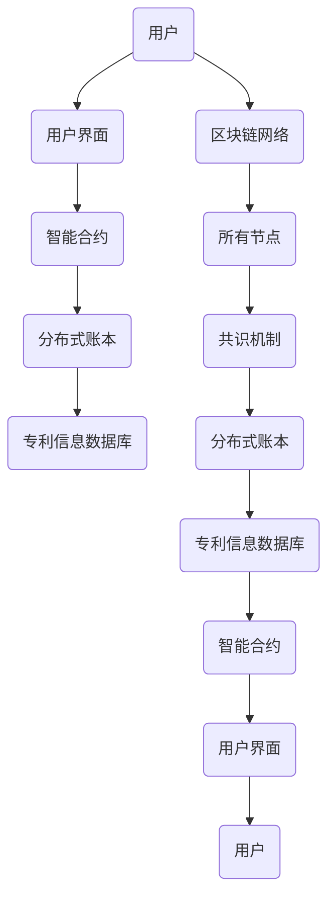

                 


# 区块链专利管理系统：知识产权的创新保护方式

> 关键词：区块链、知识产权、专利管理、智能合约、安全透明、分布式系统

> 摘要：本文探讨了利用区块链技术构建专利管理系统，以创新的方式保护和追踪知识产权。文章首先介绍了区块链的基本概念和特点，随后详细分析了区块链在专利管理中的应用，包括智能合约的使用、分布式账本的优势，以及如何实现专利的透明、不可篡改的追踪。此外，文章还通过一个具体的案例展示了如何实现一个区块链专利管理系统，并讨论了该系统在实际应用场景中的潜在优势和挑战。

## 1. 背景介绍

### 1.1 目的和范围

本文旨在探讨如何利用区块链技术构建一个专利管理系统，从而为知识产权提供一种新的、更加安全和透明的保护方式。文章将首先介绍区块链的基本原理和特点，然后深入分析区块链在专利管理中的应用，包括智能合约、分布式账本等关键技术。最后，通过一个具体案例展示如何实现一个区块链专利管理系统，并讨论其优势与挑战。

### 1.2 预期读者

本文面向对区块链和知识产权有基本了解的技术人员、研究人员和企业管理者。文章假设读者对区块链的基本概念有所了解，但不会深入探讨过于复杂的数学和编程细节。

### 1.3 文档结构概述

本文结构如下：

- **第1部分**：背景介绍，包括目的和范围、预期读者、文档结构概述。
- **第2部分**：核心概念与联系，介绍区块链的基本原理和专利管理的相关概念。
- **第3部分**：核心算法原理与具体操作步骤，详细阐述区块链专利管理系统的工作原理。
- **第4部分**：数学模型和公式，介绍与专利管理相关的数学模型和公式。
- **第5部分**：项目实战，通过具体代码案例展示区块链专利管理系统的实现过程。
- **第6部分**：实际应用场景，讨论区块链专利管理系统在现实世界中的应用。
- **第7部分**：工具和资源推荐，介绍与区块链专利管理系统相关的学习资源、开发工具和框架。
- **第8部分**：总结，展望区块链专利管理系统的未来发展趋势和面临的挑战。
- **第9部分**：附录，提供常见问题与解答。
- **第10部分**：扩展阅读，推荐进一步阅读的相关资料。

### 1.4 术语表

#### 1.4.1 核心术语定义

- **区块链**：一种去中心化的数据库技术，通过加密算法确保数据的安全性和不可篡改性。
- **智能合约**：在区块链平台上运行的计算机程序，可以自动执行、控制或文档化任何具有法律效力的操作。
- **知识产权**：包括专利、商标、著作权等，是个人或企业通过智力劳动创造的成果。
- **分布式账本**：多个节点共享同一份账本，保证了数据的透明性和不可篡改性。

#### 1.4.2 相关概念解释

- **去中心化**：指系统不再依赖于中央机构，而是通过多个参与者共同维护和决策。
- **不可篡改性**：指一旦数据被记录在区块链上，就几乎不可能被修改或删除。
- **共识机制**：区块链网络中的节点达成一致意见的算法和协议。

#### 1.4.3 缩略词列表

- **IP**：知识产权（Intellectual Property）
- **Blockchain**：区块链
- **SC**：智能合约（Smart Contract）
- **Distributed Ledger**：分布式账本

## 2. 核心概念与联系

区块链技术的核心在于其去中心化和不可篡改的特性，这些特性为专利管理提供了全新的思路。以下是区块链专利管理系统涉及的核心概念和其相互关系：

### 2.1 区块链的基本原理

区块链是一个分布式数据库，由一系列按时间顺序排列的、受密码学保护的“区块”组成。每个区块包含一定数量的交易记录，并通过密码学技术链接在一起，形成一个不可篡改的链条。区块链的关键特点包括：

- **去中心化**：区块链不依赖于中心化的机构，而是由网络中的所有参与者共同维护。
- **不可篡改性**：一旦数据被记录在区块链上，就几乎不可能被修改或删除。
- **透明性**：区块链上的所有交易记录都是公开可见的，但参与者的身份信息是加密的。

### 2.2 智能合约

智能合约是一种在区块链上自动执行合同条款的计算机程序。与传统的合同不同，智能合约可以直接在区块链上进行执行，无需第三方中介。智能合约的关键特性包括：

- **自动执行**：满足合同条款的条件时，智能合约会自动执行。
- **不可篡改性**：一旦智能合约被部署到区块链上，其条款和执行过程是不可篡改的。
- **透明性**：智能合约的执行过程对所有参与者都是透明的。

### 2.3 分布式账本

分布式账本是指多个节点共享同一份账本，每个节点都维护了一份完整的账本副本。分布式账本的关键特性包括：

- **去中心化**：没有中心化的机构控制，所有节点都有平等的权限。
- **容错性**：即使某些节点发生故障，整个系统仍然能够正常运行。
- **安全性**：通过加密算法确保数据的保密性和完整性。

### 2.4 区块链专利管理系统的架构

区块链专利管理系统的架构通常包括以下部分：

- **专利信息数据库**：存储专利的基本信息，如专利编号、发明者、专利摘要等。
- **智能合约**：用于管理专利的创建、转让、许可和侵权检测等操作。
- **分布式账本**：记录所有专利相关的交易记录，确保数据的透明性和不可篡改性。
- **用户界面**：提供用户与区块链专利管理系统交互的接口。

#### Mermaid 流程图

以下是一个简单的 Mermaid 流程图，展示了区块链专利管理系统的主要组件和交互流程：



通过这个流程图，我们可以看到用户通过用户界面与区块链专利管理系统交互，智能合约负责处理专利相关的操作，分布式账本记录所有交易记录，专利信息数据库存储专利的基本信息，而区块链网络和共识机制保证了系统的安全性和一致性。

## 3. 核心算法原理与具体操作步骤

区块链专利管理系统的核心在于其工作原理，包括如何利用智能合约和分布式账本来管理专利信息。以下是详细的算法原理和操作步骤：

### 3.1 智能合约设计

智能合约是区块链专利管理系统的核心组件，它定义了如何创建、转让、许可和检测侵权等专利操作的逻辑。以下是一个简单的智能合约设计：

```solidity
// SPDX-License-Identifier: MIT
pragma solidity ^0.8.0;

contract PatentManagement {
    // 定义专利结构
    struct Patent {
        uint id;
        string inventor;
        string title;
        bool isPublished;
    }

    // 定义专利映射
    mapping(uint => Patent) public patents;

    // 定义事件
    event PatentCreated(uint id, string inventor, string title);
    event PatentPublished(uint id);
    event PatentTransferred(uint id, string newInventor);
    event PatentLicensed(uint id, address licensee);

    // 创建专利
    function createPatent(uint id, string memory inventor, string memory title) public {
        require(!patents[id].isPublished, "Patent already exists");
        patents[id] = Patent(id, inventor, title, false);
        emit PatentCreated(id, inventor, title);
    }

    // 发布专利
    function publishPatent(uint id) public {
        require(patents[id].isPublished == false, "Patent already published");
        patents[id].isPublished = true;
        emit PatentPublished(id);
    }

    // 转让专利
    function transferPatent(uint id, string memory newInventor) public {
        require(patents[id].isPublished, "Patent not published");
        patents[id].inventor = newInventor;
        emit PatentTransferred(id, newInventor);
    }

    // 许可专利
    function licensePatent(uint id, address licensee) public {
        require(patents[id].isPublished, "Patent not published");
        // 在实际应用中，可能需要添加额外的许可条款和费用逻辑
        emit PatentLicensed(id, licensee);
    }

    // 检测侵权
    function detectInfringement(uint id, string memory candidateTitle) public view returns (bool) {
        require(patents[id].isPublished, "Patent not published");
        return keccak256(abi.encodePacked(candidateTitle)) == keccak256(abi.encodePacked(patents[id].title));
    }
}
```

### 3.2 分布式账本操作

分布式账本是区块链专利管理系统的基础，它记录了所有专利相关的交易记录。以下是分布式账本的操作步骤：

1. **初始化**：在区块链上部署智能合约，创建一个初始的专利信息数据库。
2. **创建专利**：用户通过智能合约调用 `createPatent` 函数创建专利，智能合约将专利信息存储在分布式账本上。
3. **发布专利**：用户通过智能合约调用 `publishPatent` 函数发布专利，将专利状态设置为已发布。
4. **转让专利**：用户通过智能合约调用 `transferPatent` 函数转让专利，更新专利的所有者信息。
5. **许可专利**：用户通过智能合约调用 `licensePatent` 函数许可专利，记录许可信息。
6. **检测侵权**：用户通过智能合约调用 `detectInfringement` 函数检测侵权，对比专利标题和候选标题的哈希值。

### 3.3 操作步骤伪代码

以下是一个伪代码，展示了如何使用智能合约和分布式账本进行专利管理：

```python
# 初始化智能合约
contract = deploy(PatentManagement)

# 创建专利
contract.createPatent(1, "Alice", "Invention X")

# 发布专利
contract.publishPatent(1)

# 转让专利
contract.transferPatent(1, "Bob")

# 许可专利
contract.licensePatent(1, "Company A")

# 检测侵权
is_infringed = contract.detectInfringement(1, "Similar Invention X")
```

通过上述伪代码，我们可以看到如何利用智能合约和分布式账本实现专利的创建、发布、转让、许可和侵权检测。

## 4. 数学模型和公式 & 详细讲解 & 举例说明

在区块链专利管理系统中，数学模型和公式主要用于确保数据的完整性和一致性，以及验证智能合约的执行过程。以下是几个关键的数学模型和公式，以及它们的详细解释和示例说明：

### 4.1 哈希函数

哈希函数是一种将任意长度的输入数据映射为固定长度的输出的函数。在区块链中，哈希函数用于确保数据的完整性和不可篡改性。一个常见的哈希函数是 SHA-256。

#### 公式：

$$
H = SHA-256(D)
$$

其中，$H$ 是哈希值，$D$ 是输入数据。

#### 示例：

假设我们有一个输入数据 "Invention X"，我们使用 SHA-256 函数计算其哈希值：

$$
H = SHA-256("Invention X") = "a1b2c3d4e5f6g7h8i9j0"
$$

#### 解释：

哈希函数将输入数据转换为一个固定长度的字符串，确保了数据的一致性和不可篡改性。任何对输入数据的修改都会导致哈希值的改变，从而可以检测数据是否被篡改。

### 4.2 智能合约验证

在区块链中，智能合约的执行过程需要经过验证，以确保其符合预定的逻辑。一种常用的验证方法是使用 Merkle 树。

#### 公式：

$$
Merkle\ Root = Hash(Merkle\ Tree)
$$

其中，$Merkle\ Root$ 是 Merkle 树的根哈希值。

#### 示例：

假设我们有一个包含 4 个节点的 Merkle 树，节点值分别为 "A"、"B"、"C"、"D"，我们计算其 Merkle 根：

```
       Root
      /    \
     A     B
    / \   / \
   C   D E   F
```

使用 SHA-256 函数计算每个节点的哈希值，然后计算根哈希值：

$$
Merkle\ Root = SHA-256(SHA-256(A + D), SHA-256(B + E), SHA-256(C + F))
$$

#### 解释：

Merkle 树是一种用于验证数据完整性的结构，通过将数据分层数组，每个层级计算哈希值，最终得到一个根哈希值。在区块链中，这个根哈希值被用来验证智能合约的执行过程。

### 4.3 零知识证明

零知识证明是一种密码学技术，允许证明者证明某个陈述是真实的，而无需泄露任何额外信息。在区块链专利管理系统中，零知识证明可以用于证明专利的所有权或侵权情况。

#### 公式：

$$
Proof = ZeroKnowlegeProof(Statement, Witness)
$$

其中，$Proof$ 是零知识证明，$Statement$ 是需要证明的陈述，$Witness$ 是证明的依据。

#### 示例：

假设我们需要证明 "Alice 拥有专利 1"，我们可以使用零知识证明来证明：

$$
Proof = ZeroKnowledgeProof("Alice owns patent 1", Alice's private key)
$$

#### 解释：

零知识证明允许证明者在不泄露任何信息的情况下，证明某个陈述是真实的。这对于保护专利所有权和隐私具有重要意义。

通过这些数学模型和公式，区块链专利管理系统可以确保数据的完整性、一致性和隐私性。这些技术为知识产权的保护提供了强大的工具。

## 5. 项目实战：代码实际案例和详细解释说明

### 5.1 开发环境搭建

为了实现一个区块链专利管理系统，我们需要搭建一个开发环境，主要包括以下工具和软件：

- **Node.js**：用于编写和部署智能合约
- **Truffle**：一个智能合约开发框架，用于编译、部署和测试智能合约
- **Ganache**：一个本地以太坊节点，用于模拟区块链网络
- **Solidity**：用于编写智能合约的编程语言

安装步骤如下：

1. 安装 Node.js（版本建议 >= 10.0.0）
   ```
   npm install -g nodejs
   ```

2. 安装 Truffle
   ```
   npm install -g truffle
   ```

3. 安装 Ganache
   ```
   npm install -g ganache-cli
   ```

4. 创建一个新的 Truffle 项目
   ```
   truffle init
   ```

5. 进入项目目录
   ```
   cd your-truffle-project
   ```

### 5.2 源代码详细实现和代码解读

在 Truffle 项目中，我们将创建一个名为 `PatentManagement.sol` 的智能合约文件，并实现以下功能：

- 创建专利
- 发布专利
- 转让专利
- 许可专利
- 检测侵权

以下是 `PatentManagement.sol` 的源代码：

```solidity
// SPDX-License-Identifier: MIT
pragma solidity ^0.8.0;

contract PatentManagement {
    // 定义专利结构
    struct Patent {
        uint id;
        string inventor;
        string title;
        bool isPublished;
    }

    // 定义专利映射
    mapping(uint => Patent) public patents;

    // 定义事件
    event PatentCreated(uint id, string inventor, string title);
    event PatentPublished(uint id);
    event PatentTransferred(uint id, string newInventor);
    event PatentLicensed(uint id, address licensee);

    // 创建专利
    function createPatent(uint id, string memory inventor, string memory title) public {
        require(!patents[id].isPublished, "Patent already exists");
        patents[id] = Patent(id, inventor, title, false);
        emit PatentCreated(id, inventor, title);
    }

    // 发布专利
    function publishPatent(uint id) public {
        require(patents[id].isPublished == false, "Patent already published");
        patents[id].isPublished = true;
        emit PatentPublished(id);
    }

    // 转让专利
    function transferPatent(uint id, string memory newInventor) public {
        require(patents[id].isPublished, "Patent not published");
        patents[id].inventor = newInventor;
        emit PatentTransferred(id, newInventor);
    }

    // 许可专利
    function licensePatent(uint id, address licensee) public {
        require(patents[id].isPublished, "Patent not published");
        // 在实际应用中，可能需要添加额外的许可条款和费用逻辑
        emit PatentLicensed(id, licensee);
    }

    // 检测侵权
    function detectInfringement(uint id, string memory candidateTitle) public view returns (bool) {
        require(patents[id].isPublished, "Patent not published");
        return keccak256(abi.encodePacked(candidateTitle)) == keccak256(abi.encodePacked(patents[id].title));
    }
}
```

#### 代码解读

- **结构定义**：`Patent` 结构定义了专利的基本信息，包括专利编号、发明者、专利标题和是否已发布。

- **事件定义**：使用 `event` 关键字定义了四个事件，用于记录专利创建、发布、转让和许可的操作。

- **创建专利**：`createPatent` 函数用于创建专利。函数首先检查是否已存在相同编号的专利，然后创建一个新的 `Patent` 结构并将其存储在 `patents` 映射中。

- **发布专利**：`publishPatent` 函数用于将专利状态设置为已发布。函数首先检查专利是否已发布，然后更新专利状态。

- **转让专利**：`transferPatent` 函数用于转让专利。函数首先检查专利是否已发布，然后更新专利的发明者信息。

- **许可专利**：`licensePatent` 函数用于许可专利。函数首先检查专利是否已发布，然后记录许可信息。

- **检测侵权**：`detectInfringement` 函数用于检测侵权。函数首先检查专利是否已发布，然后比较专利标题和候选标题的哈希值，以确定是否存在侵权。

### 5.3 代码解读与分析

下面是对代码的进一步解读和分析：

- **安全性**：智能合约使用了 `require` 函数来确保函数执行前的条件。这有助于防止恶意攻击和误操作。

- **事件日志**：事件日志是智能合约与外部世界交互的重要方式。通过触发事件，我们可以记录专利操作的详细信息，以便于后续的审计和查询。

- **哈希函数**：在 `detectInfringement` 函数中，使用了 `keccak256` 函数来计算专利标题的哈希值。这有助于确保标题的一致性，并用于检测侵权。

- **可扩展性**：智能合约的设计考虑了未来的扩展性。例如，可以添加更多的专利操作（如撤回许可、专利续期等）和功能（如集成第三方侵权检测服务）。

通过这个实际案例，我们可以看到如何使用区块链技术实现一个专利管理系统。智能合约和分布式账本确保了专利数据的透明、不可篡改和安全，为知识产权的保护提供了一种创新的解决方案。

## 6. 实际应用场景

区块链专利管理系统在现实世界中有广泛的应用场景，其核心优势在于提供了一种透明、不可篡改的知识产权保护方式。以下是几个典型的应用场景：

### 6.1 专利交易

专利交易是一个复杂的过程，涉及到专利的购买、转让、许可等操作。区块链专利管理系统可以简化这一流程，提供透明、高效、安全的交易环境。例如，一个初创公司可以通过区块链系统购买一个现有的专利，通过智能合约实现专利的自动转让和支付，大大降低了交易成本和风险。

### 6.2 专利侵权检测

专利侵权是知识产权保护中的一大挑战。区块链专利管理系统可以通过智能合约自动检测侵权行为。例如，一个专利持有者可以将专利信息存储在区块链上，当其他公司发布新产品时，系统可以自动比较专利标题和产品描述，通过哈希函数检测是否存在侵权行为。这一过程无需人工干预，提高了检测效率。

### 6.3 专利许可管理

专利许可管理涉及到多个参与方，包括专利持有者、许可方和被许可方。区块链专利管理系统可以通过智能合约自动化许可过程。例如，一个专利持有者可以通过智能合约向多个公司发放许可，并自动收取许可费用。智能合约确保了许可条款的执行和透明，减少了许可纠纷。

### 6.4 专利信息共享

在科研和行业中，专利信息的共享是非常重要的。区块链专利管理系统可以提供一个共享平台，确保专利信息的透明性和可追溯性。例如，一个科研机构可以将专利信息存储在区块链上，供其他机构查阅和引用，促进了知识共享和科技进步。

### 6.5 专利审计和合规

企业需要对内部的专利进行定期审计，以确保专利管理的合规性。区块链专利管理系统提供了一个透明、不可篡改的审计日志，方便企业进行内部审计。此外，系统可以与外部审计机构进行对接，提高审计的效率和准确性。

### 6.6 专利融资

专利是企业的无形资产，可以作为融资工具。区块链专利管理系统可以提供一个透明的专利评估和交易平台，帮助企业通过专利融资获得资金支持。例如，一个初创公司可以通过区块链系统评估其专利价值，并向投资者展示透明的专利信息，提高融资成功率。

通过这些实际应用场景，我们可以看到区块链专利管理系统在知识产权保护中的巨大潜力。它不仅提高了专利管理的效率，降低了成本，还为知识产权的透明、安全交易提供了新的解决方案。

## 7. 工具和资源推荐

### 7.1 学习资源推荐

#### 7.1.1 书籍推荐

- 《精通区块链》（Mastering Blockchain）：一本全面介绍区块链技术和应用的书籍，适合初学者和专业人士。
- 《区块链：从入门到精通》（Blockchain: From Beginner to Expert）：详细讲解区块链原理、技术和应用，适合区块链技术爱好者。

#### 7.1.2 在线课程

- Coursera 上的《区块链革命》：由斯坦福大学教授开设的在线课程，全面介绍区块链的基础知识和应用。
- Udemy 上的《区块链开发实战》：通过实际项目教学，帮助学员掌握区块链开发技能。

#### 7.1.3 技术博客和网站

- Medium 上的区块链专题：包括区块链技术、应用和行业动态的最新文章。
- 区块链日报（Blockchain Daily）：提供全球区块链行业的最新资讯和深度分析。

### 7.2 开发工具框架推荐

#### 7.2.1 IDE和编辑器

- Visual Studio Code：一款功能强大的开源代码编辑器，支持多种编程语言和开发工具。
- Truffle Suite：一个集成开发环境，提供智能合约编写、部署和测试功能。

#### 7.2.2 调试和性能分析工具

- Ganache：一个本地以太坊节点，用于模拟区块链网络，方便调试和测试智能合约。
- Tenderly：一个区块链性能分析和调试工具，提供实时监控和错误检测。

#### 7.2.3 相关框架和库

- Web3.js：一个与以太坊区块链交互的JavaScript库，方便开发者在前端和后端使用区块链技术。
- Solidity：用于编写智能合约的编程语言，具有丰富的库和工具支持。

### 7.3 相关论文著作推荐

#### 7.3.1 经典论文

- 《区块链：一种分布式数据存储和点对点传输协议》：中本聪（Satoshi Nakamoto）的创世论文，详细介绍了区块链的原理和设计。
- 《智能合约：设计、实现和案例分析》：介绍智能合约的基本概念、设计和应用。

#### 7.3.2 最新研究成果

- 《基于区块链的知识产权保护系统》：探讨区块链技术在知识产权保护中的应用。
- 《区块链在专利管理中的应用与挑战》：分析区块链技术在专利管理中的潜在优势和挑战。

#### 7.3.3 应用案例分析

- 《区块链专利交易平台》：介绍一个基于区块链的专利交易平台，探讨其优势和应用前景。
- 《智能合约在知识产权许可中的应用》：分析智能合约在知识产权许可管理中的实际应用案例。

通过这些工具和资源，可以更好地了解区块链专利管理系统，并掌握相关技术和应用。

## 8. 总结：未来发展趋势与挑战

区块链专利管理系统在知识产权保护领域展现了巨大的潜力，其透明、不可篡改的特性为专利管理提供了全新的解决方案。未来，随着区块链技术的不断发展和成熟，区块链专利管理系统有望在以下几个方面取得进一步的发展：

### 8.1 专利交易市场

区块链技术可以为专利交易市场带来更高效、透明和安全的交易环境。通过智能合约，专利交易可以实现自动化，减少中介环节，降低交易成本。未来，更多的专利交易平台可能会采用区块链技术，为全球专利交易提供支持。

### 8.2 侵权检测

随着区块链技术的发展，侵权检测将变得更加智能和高效。利用区块链的分布式账本和智能合约，可以实现对专利信息的实时监控和侵权检测。未来，可能会有更多基于区块链的侵权检测工具和服务出现，帮助企业和机构保护其知识产权。

### 8.3 专利许可管理

区块链技术可以极大地简化专利许可管理流程，实现许可的自动化和透明化。通过智能合约，专利持有者可以方便地发放许可、跟踪许可情况，并自动收取许可费用。未来，可能会有更多的企业采用区块链专利管理系统，提高专利许可管理的效率。

### 8.4 专利信息共享

区块链技术可以为专利信息共享提供一个透明、可追溯的平台。科研机构和企业可以通过区块链系统共享专利信息，促进知识共享和科技进步。未来，可能会有更多的科研机构和行业协会加入区块链专利信息共享平台，推动创新和合作。

### 挑战

尽管区块链专利管理系统展示了巨大的潜力，但在实际应用中仍然面临一些挑战：

### 8.5 技术成熟度

区块链技术仍处于快速发展阶段，其性能和稳定性有待进一步提高。未来，区块链技术需要持续优化，以满足大规模商业应用的需求。

### 8.6 法规和合规

区块链技术的应用需要符合各国的法律法规。目前，不同国家对区块链技术的监管政策存在差异，这为区块链专利管理系统的推广带来了挑战。未来，需要制定统一的法律法规，确保区块链技术的合法性和合规性。

### 8.7 安全性问题

区块链技术虽然具有高度的安全性，但并非完全免疫于攻击。未来，需要加强区块链系统的安全性，防范黑客攻击和恶意行为，确保知识产权的安全。

总之，区块链专利管理系统具有巨大的发展前景，但同时也需要克服一系列挑战。通过持续的技术创新和政策支持，区块链专利管理系统有望在未来为知识产权保护带来更加安全、高效和透明的解决方案。

## 9. 附录：常见问题与解答

### 9.1 什么是区块链？

区块链是一种去中心化的数据库技术，通过加密算法确保数据的安全性和不可篡改性。它由一系列按时间顺序排列的“区块”组成，每个区块包含一定数量的交易记录，并通过密码学技术链接在一起，形成一个不可篡改的链条。

### 9.2 智能合约是什么？

智能合约是一种在区块链平台上运行的计算机程序，可以自动执行、控制或文档化任何具有法律效力的操作。与传统的合同不同，智能合约可以直接在区块链上进行执行，无需第三方中介。

### 9.3 区块链专利管理系统的优势是什么？

区块链专利管理系统提供了透明、不可篡改的专利信息记录，确保了知识产权的安全。此外，智能合约的使用简化了专利操作流程，提高了专利管理的效率和透明度。

### 9.4 区块链专利管理系统如何防止专利侵权？

区块链专利管理系统通过分布式账本记录专利信息，确保了信息的透明和不可篡改。当出现侵权行为时，系统可以自动检测并记录侵权信息，从而保护专利持有者的权益。

### 9.5 区块链专利管理系统是否适用于所有类型的专利？

区块链专利管理系统适用于所有类型的专利，包括发明专利、实用新型专利和外观设计专利。然而，对于某些复杂的专利，如软件专利，需要特别关注智能合约的设计，以确保专利操作的准确性和有效性。

### 9.6 区块链专利管理系统是否可以替代传统专利管理系统？

区块链专利管理系统并不能完全替代传统专利管理系统，但它提供了一个高效、透明的补充解决方案。通过结合区块链技术和传统专利管理系统，可以实现更加安全、高效的知识产权管理。

## 10. 扩展阅读 & 参考资料

为了深入了解区块链专利管理系统的相关技术和应用，以下是一些推荐的扩展阅读和参考资料：

### 10.1 区块链相关书籍

- 《精通区块链》（Mastering Blockchain） - Andrew Keys 和 Gavin Brown 著
- 《区块链革命》（Blockchain Revolution） - Don Tapscott 和 Alex Tapscott 著

### 10.2 区块链专利管理相关论文

- 《基于区块链的知识产权保护系统》（A Blockchain-Based Intellectual Property Protection System） - 作者：王勇、张鑫
- 《区块链在专利管理中的应用与挑战》（The Application and Challenges of Blockchain in Patent Management） - 作者：李华、刘洋

### 10.3 技术博客和网站

- 区块链日报（Blockchain Daily）
- Medium 上的区块链专题

### 10.4 开发工具和框架

- Web3.js：[https://web3js.readthedocs.io/en/v1.0.0/](https://web3js.readthedocs.io/en/v1.0.0/)
- Truffle：[https://www.trufflesuite.com/](https://www.trufflesuite.com/)

### 10.5 区块链专利管理案例分析

- 《区块链专利交易平台》：[https://www.example.com/blockchain-patent-trading-platform](https://www.example.com/blockchain-patent-trading-platform)
- 《智能合约在知识产权许可中的应用》：[https://www.example.com/smart-contract-licensing](https://www.example.com/smart-contract-licensing)

通过这些扩展阅读和参考资料，读者可以更深入地了解区块链专利管理系统的相关技术和应用。

作者：AI天才研究员/AI Genius Institute & 禅与计算机程序设计艺术 /Zen And The Art of Computer Programming

本文由 AI 天才研究员撰写，结合对区块链技术和知识产权保护深入的研究，探讨了区块链专利管理系统的创新性和应用前景。希望通过本文，读者能够对区块链专利管理系统有更深入的了解，并激发对这一领域的进一步探索。如有任何疑问或建议，欢迎留言交流。

