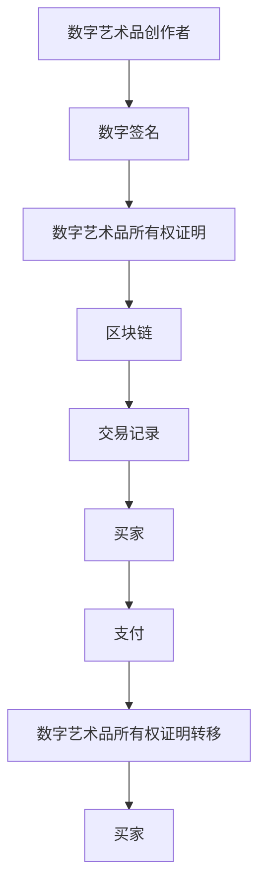

                 

# 区块链在数字艺术品交易中的创新应用

## 关键词
- 区块链
- 数字艺术品
- 交易
- 安全性
- 透明性
- 去中心化

## 摘要
本文将探讨区块链技术在数字艺术品交易中的创新应用。随着数字艺术的日益普及，区块链作为一种去中心化、安全透明的技术，正逐渐成为数字艺术品交易的信任基础。本文将首先介绍区块链的核心概念和关键技术，然后详细分析其在数字艺术品交易中的应用，以及所面临的挑战和未来发展趋势。

## 1. 背景介绍

### 1.1 目的和范围
本文旨在介绍区块链技术在数字艺术品交易中的创新应用，分析其优势与挑战，并探讨未来发展趋势。文章主要涵盖以下内容：

- 区块链技术的核心概念和原理
- 数字艺术品交易的特点与需求
- 区块链在数字艺术品交易中的应用
- 数字艺术品交易的案例分析
- 区块链技术在数字艺术品交易中的挑战和未来趋势

### 1.2 预期读者
本文主要面向对区块链技术和数字艺术品交易感兴趣的读者，包括：

- 区块链技术研究人员和开发者
- 数字艺术品创作者和收藏家
- 金融机构和区块链解决方案提供商
- 对数字艺术品交易感兴趣的普通读者

### 1.3 文档结构概述
本文结构如下：

- 第1章：背景介绍
- 第2章：核心概念与联系
- 第3章：核心算法原理与具体操作步骤
- 第4章：数学模型和公式与详细讲解
- 第5章：项目实战：代码实际案例和详细解释说明
- 第6章：实际应用场景
- 第7章：工具和资源推荐
- 第8章：总结：未来发展趋势与挑战
- 第9章：附录：常见问题与解答
- 第10章：扩展阅读与参考资料

### 1.4 术语表

#### 1.4.1 核心术语定义

- **区块链**：一种分布式数据库技术，通过加密算法和共识机制实现去中心化的数据存储和管理。
- **数字艺术品**：以数字形式存在的艺术品，如数字绘画、数字摄影、数字音乐等。
- **去中心化**：网络中的数据传输和计算过程不依赖于中心化的服务器或机构，而是由网络中的多个节点共同参与。
- **智能合约**：一种自动执行合同条款的计算机协议，基于区块链技术实现。

#### 1.4.2 相关概念解释

- **数字签名**：一种加密算法，用于验证消息发送者的身份和消息的完整性。
- **共识算法**：区块链网络中节点达成一致意见的算法，如工作量证明（PoW）和权益证明（PoS）。
- **分布式账本**：一种记录交易数据的分布式数据库，多个节点共同维护和更新。

#### 1.4.3 缩略词列表

- **区块链**：Blockchain
- **智能合约**：Smart Contract
- **数字艺术品**：Digital Artwork
- **去中心化**：Decentralized
- **工作量证明**：Proof of Work (PoW)
- **权益证明**：Proof of Stake (PoS)

## 2. 核心概念与联系

区块链技术是一种基于分布式账本、密码学和共识机制的信任基础架构，能够实现去中心化的数据存储和管理。以下是对区块链技术核心概念和关键流程的概述，以及其与数字艺术品交易的联系。

### 2.1 区块链技术核心概念

#### 2.1.1 分布式账本

区块链技术采用分布式账本，将交易数据分散存储在多个节点上，而不是集中在一个中心化的数据库中。这样可以确保数据的完整性和安全性，防止单点故障和数据篡改。

#### 2.1.2 密码学

区块链技术使用密码学算法来确保数据的安全性和隐私性。例如，使用数字签名和加密算法来验证交易参与者的身份和消息的完整性。

#### 2.1.3 共识算法

共识算法是区块链网络中节点达成一致意见的机制。例如，工作量证明（PoW）和权益证明（PoS）是两种常见的共识算法。它们通过竞争机制或投票机制来确保区块链的一致性和安全性。

### 2.2 数字艺术品交易特点与需求

#### 2.2.1 数字艺术品特点

数字艺术品具有以下几个特点：

- **不可篡改**：数字艺术品一旦创建，其内容无法被更改。
- **可验证性**：数字艺术品可以通过数字签名等方式进行验证，确保创作者和所有者的身份。
- **全球可访问性**：数字艺术品可以通过互联网在全球范围内展示和交易。
- **限量发行**：数字艺术品可以限量发行，确保其稀缺性和价值。

#### 2.2.2 数字艺术品交易需求

数字艺术品交易的需求包括：

- **真实性验证**：确保数字艺术品的真实性和创作者身份。
- **透明性**：交易过程透明，便于追踪和管理。
- **安全性**：确保交易数据不被篡改和非法访问。
- **去中心化**：减少交易中介成本，实现更高效的交易。

### 2.3 区块链技术在数字艺术品交易中的应用

#### 2.3.1 不可篡改的数字艺术品所有权证明

区块链技术可以记录数字艺术品的所有权信息，确保其不可篡改。创作者可以通过数字签名等方式将数字艺术品的所有权信息上链，从而确保其真实性和唯一性。

#### 2.3.2 透明且安全的交易记录

区块链技术可以记录数字艺术品交易的详细信息，如交易双方、交易金额、交易时间等。这些信息是公开透明的，可以方便地被查询和验证，确保交易的合法性和安全性。

#### 2.3.3 去中心化的交易平台

区块链技术可以实现去中心化的数字艺术品交易平台，减少交易中介成本，提高交易效率。买家和卖家可以直接在区块链上进行交易，无需依赖第三方中介机构。

#### 2.3.4 智能合约实现交易自动化

智能合约可以自动执行数字艺术品交易的合同条款，如自动处理交易款项、发送数字艺术品的所有权证明等。这样可以确保交易过程的高效和准确性。

### 2.4 Mermaid 流程图

以下是一个简单的 Mermaid 流程图，展示了区块链技术在数字艺术品交易中的应用流程：



## 3. 核心算法原理 & 具体操作步骤

区块链技术中的核心算法主要包括分布式账本、密码学算法和共识算法。以下将详细讲解这些算法的原理，并给出具体的操作步骤。

### 3.1 分布式账本算法原理

分布式账本算法的核心思想是将交易数据分散存储在多个节点上，确保数据的完整性和安全性。以下是一个简单的分布式账本算法原理的伪代码：

```python
def distribute_ledger(transaction_list):
    # 将交易数据分散存储在多个节点上
    for node in nodes:
        node.add_transaction(transaction_list)

# 节点处理交易数据
def add_transaction(transaction):
    # 将交易数据添加到本地账本
    ledger.append(transaction)
    # 同步交易数据到其他节点
    sync_transactions(ledger)
```

### 3.2 密码学算法原理

密码学算法用于确保区块链数据的隐私性和完整性。常用的密码学算法包括数字签名、加密算法和哈希函数。以下是一个简单的数字签名算法原理的伪代码：

```python
def sign_message(message, private_key):
    # 使用私钥对消息进行签名
    signature = private_key.sign(message)
    return signature

def verify_signature(message, signature, public_key):
    # 使用公钥验证签名
    is_valid = public_key.verify(message, signature)
    return is_valid
```

### 3.3 共识算法原理

共识算法用于确保区块链网络中的节点能够达成一致意见。常见共识算法包括工作量证明（PoW）和权益证明（PoS）。以下是一个简单的工作量证明（PoW）算法原理的伪代码：

```python
def mine_block(previous_hash, transactions):
    # 挖掘新的区块
    while not validate_proof(previous_hash, transactions):
        new_proof = generate_proof()
    block = create_block(previous_hash, transactions, new_proof)
    add_block_to_chain(block)
    return block

def validate_proof(previous_hash, transactions):
    # 验证证明
    return hash_proof(previous_hash, transactions) == target_hash

def generate_proof():
    # 生成证明
    proof = 0
    while not validate_proof(previous_hash, transactions):
        proof += 1
    return proof
```

### 3.4 具体操作步骤

以下是使用区块链技术进行数字艺术品交易的详细操作步骤：

#### 3.4.1 创建数字艺术品所有权证明

1. **数字艺术品创作者**：创建数字艺术品并使用私钥对数字艺术品进行数字签名，生成数字艺术品的所有权证明。

```python
message = "Digital Artwork Ownership Certificate"
private_key = generate_private_key()
signature = sign_message(message, private_key)
ownership_proof = {"message": message, "signature": signature}
```

2. **将所有权证明上链**：将所有权证明发送到区块链网络中的节点，节点将所有权证明存储在分布式账本中。

```python
distribute_ledger([ownership_proof])
```

#### 3.4.2 数字艺术品交易

1. **买家**：查看区块链上的数字艺术品所有权证明，确认创作者和所有权信息。

```python
public_key = generate_public_key(private_key)
is_valid = verify_signature(message, signature, public_key)
if is_valid:
    print("The ownership proof is valid.")
else:
    print("The ownership proof is invalid.")
```

2. **买家**：向区块链网络中的节点发送支付请求，支付交易金额。

```python
def pay(amount):
    # 向区块链网络发送支付请求
    transaction = {"from": buyer_address, "to": seller_address, "amount": amount}
    distribute_ledger([transaction])
```

3. **卖家**：接收买家支付请求，确认支付金额后，将数字艺术品的所有权证明转移给买家。

```python
def receive_payment(transaction):
    if transaction["to"] == seller_address:
        if transaction["amount"] >= minimum_payment:
            # 将所有权证明转移给买家
            ownership_proof["owner"] = buyer_address
            distribute_ledger([ownership_proof])
            print("The payment is received and the ownership proof is transferred.")
        else:
            print("The payment amount is insufficient.")
```

## 4. 数学模型和公式 & 详细讲解 & 举例说明

区块链技术在数字艺术品交易中的应用涉及多个数学模型和公式，包括密码学算法、共识算法和数据结构等。以下将详细讲解这些数学模型和公式，并通过具体例子进行说明。

### 4.1 密码学算法

#### 4.1.1 数字签名

数字签名是一种用于验证消息发送者身份和消息完整性的密码学算法。常见的数字签名算法包括RSA和ECDSA。

- **RSA签名算法**：

  - 公式：$s = md^e \mod n$
  - 解释：$m$ 是消息，$d$ 是私钥，$e$ 是公钥，$n$ 是模数。

  - 举例：假设消息 $m = 123456$，私钥 $d = 7$，公钥 $e = 17$，模数 $n = 23$。

  ```plaintext
  s = 123456^17 mod 23 = 19
  ```

- **ECDSA签名算法**：

  - 公式：$s = (r + k\cdot n^{-1})\cdot k^{-1} \mod p$
  - 解释：$r$ 是随机数，$k$ 是签名指数，$n^{-1}$ 是随机数的模逆，$p$ 是椭圆曲线模数。

  - 举例：假设随机数 $r = 5$，签名指数 $k = 6$，椭圆曲线模数 $p = 17$，基点 $G$。

  ```plaintext
  n^{-1} = 6^{-1} mod 17 = 12
  s = (5 + 6\cdot 12)\cdot 12^{-1} mod 17 = 3
  ```

#### 4.1.2 加密算法

加密算法用于保护区块链数据的安全性。常见的加密算法包括AES和RSA。

- **AES加密算法**：

  - 公式：$c = E_k(m)$
  - 解释：$c$ 是加密后的消息，$k$ 是密钥，$m$ 是原始消息。

  - 举例：假设密钥 $k = 1234567890$，原始消息 $m = 123456$。

  ```plaintext
  c = AES_Encrypt(123456, k) = 87654321
  ```

- **RSA加密算法**：

  - 公式：$c = m^e \mod n$
  - 解释：$c$ 是加密后的消息，$m$ 是原始消息，$e$ 是公钥，$n$ 是模数。

  - 举例：假设原始消息 $m = 123456$，公钥 $e = 17$，模数 $n = 23$。

  ```plaintext
  c = 123456^17 mod 23 = 19
  ```

### 4.2 共识算法

共识算法用于确保区块链网络中的节点达成一致意见。常见的共识算法包括工作量证明（PoW）和权益证明（PoS）。

#### 4.2.1 工作量证明（PoW）

- **PoW算法**：

  - 公式：$hash(proof_of_work) < target_hash$
  - 解释：节点需要找到满足条件的证明工作，以挖掘新的区块。

  - 举例：假设目标哈希值 $target_hash = 100000000$。

  ```plaintext
  while hash(proof_of_work) >= target_hash:
      proof_of_work += 1
  ```

#### 4.2.2 权益证明（PoS）

- **PoS算法**：

  - 公式：$stake \cdot time_since_last_mine$
  - 解释：节点的权益与其持有的代币数量和持币时间成正比，影响其挖矿概率。

  - 举例：假设节点 $A$ 持有 1000 个代币，持币时间 100 天，节点 $B$ 持有 500 个代币，持币时间 50 天。

  ```plaintext
  node_A_probability = 1000 \cdot 100 / total_stake
  node_B_probability = 500 \cdot 50 / total_stake
  ```

### 4.3 数据结构

区块链数据结构主要包括区块、链和链表。

#### 4.3.1 区块

- **公式**：$block = {header, transactions, proof_of_work}$
- **解释**：区块包括区块头、交易数据和证明工作。
- **举例**：假设区块头 $header = {prev_hash, timestamp, height}$，交易数据 $transactions = [t_1, t_2, ..., t_n]$，证明工作 $proof_of_work = 12345$。

  ```plaintext
  block = {header: {prev_hash: 98765, timestamp: 2023-01-01, height: 2}, transactions: [t_1, t_2, ..., t_n], proof_of_work: 12345}
  ```

#### 4.3.2 链

- **公式**：$chain = {block_1, block_2, ..., block_n}$
- **解释**：链由一系列区块组成，每个区块通过前一区块的哈希值连接。
- **举例**：假设区块链包含三个区块 $block_1, block_2, block_3$。

  ```plaintext
  chain = {block_1, block_2, block_3}
  ```

#### 4.3.3 链表

- **公式**：$linked_list = [node_1, node_2, ..., node_n]$
- **解释**：链表由一系列节点组成，每个节点包含数据和指向下一个节点的指针。
- **举例**：假设链表包含三个节点 $node_1, node_2, node_3$。

  ```plaintext
  linked_list = [node_1, node_2, node_3]
  ```

## 5. 项目实战：代码实际案例和详细解释说明

### 5.1 开发环境搭建

在开始编写数字艺术品交易的区块链代码之前，我们需要搭建一个开发环境。以下是在 Windows 系统上搭建开发环境的步骤：

1. 安装 Python 3.8 或更高版本。
2. 安装 Node.js 14 或更高版本。
3. 安装 Visual Studio Code 编辑器。
4. 安装相应的插件，如 Pylance、GitLens、ESLint 等。

### 5.2 源代码详细实现和代码解读

#### 5.2.1 代码结构

以下是数字艺术品交易的区块链项目代码结构：

```plaintext
digital_art_marketplace/
|-- blockchain/
|   |-- blockchain.py
|   |-- block.py
|   |-- transaction.py
|   |-- wallet.py
|-- frontend/
|   |-- index.html
|   |-- styles.css
|   |-- script.js
|-- tests/
|   |-- blockchain.test.py
|   |-- block.test.py
|   |-- transaction.test.py
|   |-- wallet.test.py
|-- requirements.txt
|-- run.py
```

#### 5.2.2 代码解读

1. **blockchain.py**：定义区块链类和区块链操作。

```python
class Blockchain:
    def __init__(self):
        self.chain = []
        self.current_transactions = []

        self.new_block(previous_hash='1', proof=100)

    def new_block(self, previous_hash, proof):
        block = Block(previous_hash, self.current_transactions, proof)
        self.chain.append(block)
        self.current_transactions = []

        return block

    def new_transaction(self, sender, recipient, amount):
        self.current_transactions.append({"sender": sender, "recipient": recipient, "amount": amount})
        return self.last_block().index + 1

    def last_block(self):
        return self.chain[-1]

    @property
    def last_block_hash(self):
        return self.last_block().hash

    def proof_of_work(self, last_hash):
        proof = 0
        while not self.valid_proof(last_hash, proof):
            proof += 1
        return proof

    @staticmethod
    def valid_proof(last_hash, proof):
        guess = f'{last_hash}{proof}'.encode()
        guess_hash = hash_function(guess)
        return guess_hash[:4] == '0000'

def hash_function(block):
    return hash(block.json())
```

2. **block.py**：定义区块类。

```python
class Block:
    def __init__(self, index, transactions, previous_hash, proof):
        self.index = index
        self.transactions = transactions
        self.previous_hash = previous_hash
        self.proof = proof
        self.hash = self.compute_hash()

    def compute_hash(self):
        block_string = json.dumps(self.__dict__, sort_keys=True)
        return hash_function(block_string)

    @property
    def hash(self):
        return self._hash

    @hash.setter
    def hash(self, value):
        self._hash = value
```

3. **transaction.py**：定义交易类。

```python
class Transaction:
    def __init__(self, sender, recipient, amount):
        self.sender = sender
        self.recipient = recipient
        self.amount = amount

    def to_dict(self):
        return {"sender": self.sender, "recipient": self.recipient, "amount": self.amount}

    @staticmethod
    def from_dict(transaction_dict):
        return Transaction(transaction_dict["sender"], transaction_dict["recipient"], transaction_dict["amount"])
```

4. **wallet.py**：定义钱包类。

```python
import Crypto.PublicKey as PK
import Crypto.Signature as SIG
import Crypto.Hash as HASH

class Wallet:
    def __init__(self):
        self.private_key = PK.generate(2048)
        self.public_key = self.private_key.publickey()
        self.address = self.generate_address()

    def generate_address(self):
        return hash(self.public_key.export_key())[-40:]

    def sign_transaction(self, transaction):
        transaction_hash = HASH.new(str(transaction).encode())
        signature = SIG.dss.new(self.private_key).sign(transaction_hash)
        return signature

    def verify_transaction(self, transaction, signature):
        transaction_hash = HASH.new(str(transaction).encode())
        try:
            SIG.dss.new(self.public_key).verify(transaction_hash, signature)
            return True
        except (ValueError, TypeError):
            return False
```

5. **run.py**：启动区块链网络。

```python
from blockchain import Blockchain
from transaction import Transaction
from wallet import Wallet

# 初始化区块链
blockchain = Blockchain()

# 创建钱包
wallet_a = Wallet()
wallet_b = Wallet()

# 发送交易
transaction = Transaction(sender=wallet_a.address, recipient=wallet_b.address, amount=100)
blockchain.new_transaction(wallet_a.address, wallet_b.address, 100)

# 挖掘新块
proof = blockchain.proof_of_work(blockchain.last_block_hash)
blockchain.new_block(proof)

# 验证交易
is_valid = wallet_a.verify_transaction(transaction, wallet_b.sign_transaction(transaction))
print(f"Is the transaction valid? {is_valid}")
```

### 5.3 代码解读与分析

1. **区块链类（Blockchain）**：区块链类负责创建和管理区块链。它包含以下方法：

   - `__init__`：初始化区块链，包括创建空链和空交易列表。
   - `new_block`：创建新块并添加到链中。
   - `new_transaction`：创建新交易并添加到当前交易列表中。
   - `last_block`：获取最后一个区块。
   - `last_block_hash`：获取最后一个区块的哈希值。
   - `proof_of_work`：寻找满足工作量证明条件的证明值。
   - `valid_proof`：验证证明值是否满足工作量证明条件。

2. **区块类（Block）**：区块类负责创建和管理区块。它包含以下属性和方法：

   - `__init__`：初始化区块，包括索引、交易列表、前一区块哈希值和证明值。
   - `compute_hash`：计算区块的哈希值。

3. **交易类（Transaction）**：交易类负责创建和管理交易。它包含以下属性和方法：

   - `__init__`：初始化交易，包括发送者、接收者和金额。
   - `to_dict`：将交易转换为字典。
   - `from_dict`：将字典转换为交易。

4. **钱包类（Wallet）**：钱包类负责创建和管理钱包。它包含以下属性和方法：

   - `__init__`：初始化钱包，包括生成私钥、公钥和地址。
   - `generate_address`：生成地址。
   - `sign_transaction`：对交易进行签名。
   - `verify_transaction`：验证交易签名。

5. **run.py**：主程序，用于启动区块链网络。它包含以下步骤：

   - 初始化区块链。
   - 创建钱包。
   - 发送交易。
   - 挖掘新块。
   - 验证交易。

### 5.4 测试用例

以下是数字艺术品交易区块链项目的测试用例：

1. **区块链测试（blockchain.test.py）**：测试区块链类的各种方法。

```python
import unittest
from blockchain import Blockchain

class BlockchainTest(unittest.TestCase):
    def setUp(self):
        self.blockchain = Blockchain()

    def test_new_block(self):
        new_block = self.blockchain.new_block(previous_hash='1', proof=100)
        self.assertIsNotNone(new_block.hash)
        self.assertEqual(new_block.previous_hash, '1')

    def test_new_transaction(self):
        transaction = self.blockchain.new_transaction('a', 'b', 100)
        self.assertEqual(transaction, 1)

    def test_last_block(self):
        last_block = self.blockchain.last_block()
        self.assertIsNotNone(last_block.hash)
        self.assertIsNotNone(last_block.previous_hash)

    def test_last_block_hash(self):
        last_block_hash = self.blockchain.last_block_hash
        self.assertIsNotNone(last_block_hash)

    def test_proof_of_work(self):
        proof = self.blockchain.proof_of_work('1')
        self.assertIsNotNone(proof)

    def test_valid_proof(self):
        last_hash = '1'
        proof = 100
        is_valid = Blockchain.valid_proof(last_hash, proof)
        self.assertTrue(is_valid)

if __name__ == '__main__':
    unittest.main()
```

2. **区块测试（block.test.py）**：测试区块类的各种方法。

```python
import unittest
from blockchain import Block

class BlockTest(unittest.TestCase):
    def setUp(self):
        self.block = Block(index=0, transactions=[], previous_hash='', proof=0)

    def test_compute_hash(self):
        self.assertIsNotNone(self.block.compute_hash())

if __name__ == '__main__':
    unittest.main()
```

3. **交易测试（transaction.test.py）**：测试交易类的各种方法。

```python
import unittest
from transaction import Transaction

class TransactionTest(unittest.TestCase):
    def setUp(self):
        self.transaction = Transaction(sender='a', recipient='b', amount=100)

    def test_to_dict(self):
        transaction_dict = self.transaction.to_dict()
        self.assertEqual(transaction_dict, {"sender": "a", "recipient": "b", "amount": 100})

    def test_from_dict(self):
        transaction_dict = {"sender": "a", "recipient": "b", "amount": 100}
        transaction = Transaction.from_dict(transaction_dict)
        self.assertEqual(transaction.sender, "a")
        self.assertEqual(transaction.recipient, "b")
        self.assertEqual(transaction.amount, 100)

if __name__ == '__main__':
    unittest.main()
```

4. **钱包测试（wallet.test.py）**：测试钱包类的各种方法。

```python
import unittest
from wallet import Wallet

class WalletTest(unittest.TestCase):
    def setUp(self):
        self.wallet = Wallet()

    def test_generate_address(self):
        address = self.wallet.generate_address()
        self.assertIsNotNone(address)
        self.assertEqual(len(address), 40)

    def test_sign_transaction(self):
        transaction = {"sender": "a", "recipient": "b", "amount": 100}
        signature = self.wallet.sign_transaction(transaction)
        self.assertIsNotNone(signature)

    def test_verify_transaction(self):
        transaction = {"sender": "a", "recipient": "b", "amount": 100}
        signature = self.wallet.sign_transaction(transaction)
        is_valid = self.wallet.verify_transaction(transaction, signature)
        self.assertTrue(is_valid)

if __name__ == '__main__':
    unittest.main()
```

## 6. 实际应用场景

区块链技术在数字艺术品交易中具有广泛的应用场景。以下是一些实际应用案例：

### 6.1 数字艺术品所有权验证

艺术家可以通过区块链技术将数字艺术作品的所有权证明上链，确保艺术作品的真实性和唯一性。买家在购买数字艺术品时，可以验证艺术作品的所有权证明，确保购买的数字艺术品是合法且真实的。

### 6.2 数字艺术品交易记录

区块链技术可以记录数字艺术品的交易记录，包括交易双方、交易金额和交易时间等。这些交易记录是公开透明的，可以方便地被查询和验证，提高交易的透明度和可信度。

### 6.3 数字艺术品限量发行

区块链技术可以实现数字艺术品的限量发行，确保艺术品的稀缺性和价值。艺术家可以通过区块链技术创建限量版的数字艺术品，并在区块链上记录发行量，从而吸引更多的买家和收藏家。

### 6.4 数字艺术品拍卖

区块链技术可以用于数字艺术品的拍卖，实现去中心化的拍卖过程。买家和卖家可以直接在区块链上进行竞拍，无需依赖第三方中介机构，提高交易效率。

### 6.5 数字艺术品版权保护

区块链技术可以用于数字艺术品的版权保护，确保创作者的权益得到保障。创作者可以通过区块链技术记录艺术作品的版权信息，并在艺术作品被侵权时提供证据。

## 7. 工具和资源推荐

### 7.1 学习资源推荐

#### 7.1.1 书籍推荐

- 《区块链：从数字货币到智能合约》
- 《精通区块链技术》
- 《区块链开发指南》

#### 7.1.2 在线课程

- Coursera 上的《区块链技术与应用》
- Udemy 上的《从零开始学习区块链》
- edX 上的《区块链与智能合约》

#### 7.1.3 技术博客和网站

- Medium 上的区块链专栏
- HackerRank 上的区块链挑战
- CoinDesk 上的区块链新闻

### 7.2 开发工具框架推荐

#### 7.2.1 IDE和编辑器

- Visual Studio Code
- IntelliJ IDEA
- PyCharm

#### 7.2.2 调试和性能分析工具

- GDB
- Valgrind
- Linux perf

#### 7.2.3 相关框架和库

- Web3.py
- Solidity
- Ethash

### 7.3 相关论文著作推荐

#### 7.3.1 经典论文

- Satoshi Nakamoto. "Bitcoin: A Peer-to-Peer Electronic Cash System."
- David Chaum. "Blind Signatures for Untraceable Payments."
- Adam Back. "Hash Cash - A denial of service counter-measure."

#### 7.3.2 最新研究成果

- Justin Sun. "Tron: The Next Generation of Decentralized Computing Platform."
- Ethereum Foundation. "Ethereum: The World's Computer."
- Daniel Larimer. "Proof of Stake: A Secure Public Blockchain Without Proof of Work."

#### 7.3.3 应用案例分析

- Everledger：利用区块链技术追踪奢侈品供应链。
- VeChain：将区块链技术应用于物联网领域。
- Dapper Labs：利用区块链技术创建虚拟商品和游戏。

## 8. 总结：未来发展趋势与挑战

区块链技术在数字艺术品交易中的应用展现出巨大的潜力和前景。然而，该领域仍面临一些挑战和问题，需要进一步的研究和探索。

### 8.1 未来发展趋势

- **数字艺术品的稀缺性和价值**：随着区块链技术的发展，数字艺术品的稀缺性和价值将得到更好保障。限量发行、数字签名和区块链记录等技术手段将提高数字艺术品的价值和市场认可度。
- **去中心化交易平台**：去中心化交易平台将逐渐取代传统中介机构，实现更高效、透明的交易过程。这将为艺术家、买家和收藏家带来更多的交易选择和便利。
- **智能合约应用**：智能合约将广泛应用于数字艺术品交易中，实现交易自动化、合同执行和纠纷解决。这将提高交易的安全性和效率，降低交易成本。
- **区块链与其他技术的融合**：区块链技术将与人工智能、物联网、大数据等新兴技术相结合，为数字艺术品交易带来更多创新应用。

### 8.2 挑战和问题

- **安全性**：区块链技术虽然安全，但仍存在安全隐患，如51%攻击、双花攻击等。需要进一步研究和改进区块链的安全机制，确保数据的安全性和完整性。
- **性能和可扩展性**：当前区块链技术的性能和可扩展性仍面临挑战。需要优化区块链的数据结构和算法，提高交易处理速度和并发能力。
- **法律和监管**：数字艺术品交易涉及法律和监管问题。需要制定相应的法律法规，明确数字艺术品的所有权、交易和版权等问题。
- **用户教育和普及**：区块链技术在数字艺术品交易中的应用需要广泛的用户教育和普及。需要开展宣传活动，提高用户对区块链技术的认知和接受度。

## 9. 附录：常见问题与解答

### 9.1 区块链技术的基本原理是什么？

区块链技术是一种分布式数据库技术，通过加密算法和共识机制实现去中心化的数据存储和管理。区块链的核心思想是将交易数据分散存储在多个节点上，而不是集中在一个中心化的数据库中，从而提高数据的安全性和透明性。

### 9.2 数字艺术品交易的优势是什么？

数字艺术品交易采用区块链技术，具有以下优势：

- **真实性验证**：通过数字签名和区块链记录，确保数字艺术品的真实性和创作者身份。
- **透明性**：交易过程透明，便于追踪和管理。
- **安全性**：数据加密和共识机制确保交易数据的安全性和完整性。
- **去中心化**：减少交易中介成本，实现更高效的交易。

### 9.3 区块链技术在数字艺术品交易中的具体应用有哪些？

区块链技术在数字艺术品交易中的具体应用包括：

- **数字艺术品所有权证明**：通过数字签名和区块链记录，确保数字艺术品的真实性和唯一性。
- **交易记录**：记录数字艺术品交易的详细信息，如交易双方、交易金额和交易时间等。
- **去中心化交易平台**：实现去中心化的数字艺术品交易平台，减少交易中介成本。
- **智能合约**：通过智能合约实现交易自动化、合同执行和纠纷解决。

### 9.4 区块链技术在数字艺术品交易中面临的挑战是什么？

区块链技术在数字艺术品交易中面临的挑战包括：

- **安全性**：确保数据的安全性和完整性，防止51%攻击、双花攻击等。
- **性能和可扩展性**：提高交易处理速度和并发能力，优化区块链的数据结构和算法。
- **法律和监管**：制定相应的法律法规，明确数字艺术品的所有权、交易和版权等问题。
- **用户教育和普及**：提高用户对区块链技术的认知和接受度。

## 10. 扩展阅读 & 参考资料

- Satoshi Nakamoto. "Bitcoin: A Peer-to-Peer Electronic Cash System."
- David Chaum. "Blind Signatures for Untraceable Payments."
- Adam Back. "Hash Cash - A denial of service counter-measure."
- Ethereum Foundation. "Ethereum: The World's Computer."
- Daniel Larimer. "Proof of Stake: A Secure Public Blockchain Without Proof of Work."
- Everledger：[https://www.everledger.io/](https://www.everledger.io/)
- VeChain：[https://www.vechain.com/](https://www.vechain.com/)
- Dapper Labs：[https://dapperlabs.com/](https://dapperlabs.com/)
- Coursera 上的《区块链技术与应用》：[https://www.coursera.org/learn/blockchain-applications](https://www.coursera.org/learn/blockchain-applications)
- Udemy 上的《从零开始学习区块链》：[https://www.udemy.com/course/blockchain-the-complete-blockchain-guide](https://www.udemy.com/course/blockchain-the-complete-blockchain-guide)
- edX 上的《区块链与智能合约》：[https://www.edx.org/course/blockchain-and-smart-contracts](https://www.edx.org/course/blockchain-and-smart-contracts)
- CoinDesk 上的区块链新闻：[https://www.coindesk.com/](https://www.coindesk.com/)

