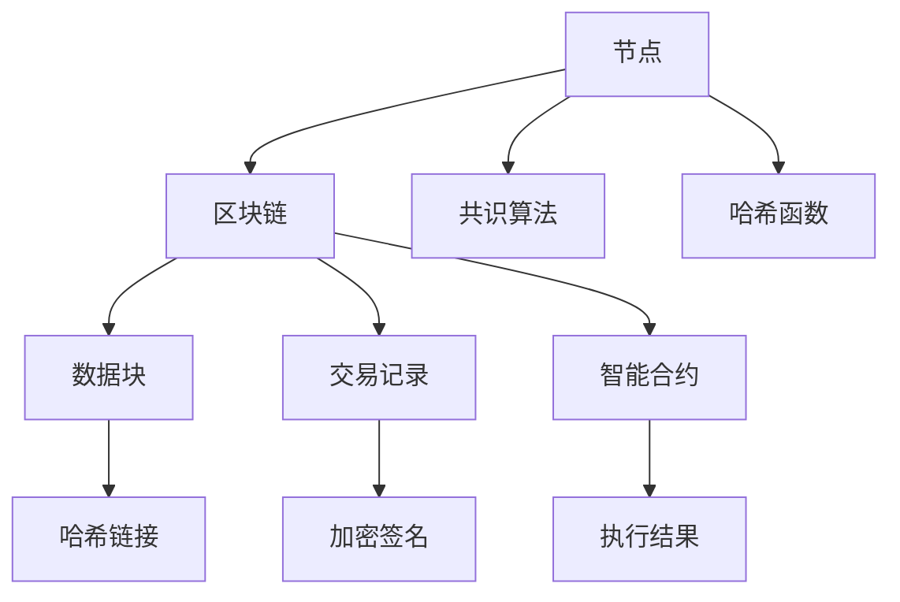

                 

# 区块链管理：探索分布式技术的商业应用

> 关键词：区块链、分布式技术、商业应用、智能合约、去中心化、加密货币

> 摘要：本文将深入探讨区块链管理及其在商业应用中的重要性。我们将从背景介绍开始，逐步讲解区块链的核心概念、算法原理、数学模型以及实际应用场景。此外，还将推荐一系列学习和开发资源，帮助读者更好地理解并应用区块链技术。

## 1. 背景介绍

### 1.1 目的和范围

本文的目的是为那些希望了解区块链管理及其商业应用的人提供一份详细的技术指南。我们将探讨区块链技术的核心原理，并展示如何将其应用于实际业务场景中。本文适用于对区块链技术有一定了解的读者，同时也欢迎对分布式技术和商业创新感兴趣的初学者。

### 1.2 预期读者

- 对区块链技术感兴趣的开发者
- 从事信息技术和金融行业的专业人士
- 希望将区块链技术应用于商业场景的企业家和管理者
- 对分布式计算和加密技术有好奇心的研究人员

### 1.3 文档结构概述

本文将分为以下几个部分：

1. 背景介绍
2. 核心概念与联系
3. 核心算法原理 & 具体操作步骤
4. 数学模型和公式 & 详细讲解 & 举例说明
5. 项目实战：代码实际案例和详细解释说明
6. 实际应用场景
7. 工具和资源推荐
8. 总结：未来发展趋势与挑战
9. 附录：常见问题与解答
10. 扩展阅读 & 参考资料

### 1.4 术语表

#### 1.4.1 核心术语定义

- 区块链：一种去中心化的分布式数据库系统，用于存储数据记录。
- 智能合约：在区块链上执行的自助执行合同，无需第三方中介。
- 去中心化：系统中没有单一的中央控制实体，而是由多个节点共同维护。
- 加密货币：通过区块链技术实现的价值交换媒介，如比特币。

#### 1.4.2 相关概念解释

- 节点：参与区块链网络并维护其完整性的计算机。
- 共识算法：节点之间达成一致的方法，以保持区块链的同步和一致性。
- 哈希函数：将任意长度的数据映射为固定长度的值，常用于区块链中的数据验证。

#### 1.4.3 缩略词列表

- BC：区块链（Blockchain）
- SM：智能合约（Smart Contract）
- DC：去中心化（Decentralized）
- EC：加密货币（Cryptocurrency）

## 2. 核心概念与联系

区块链技术的核心在于其去中心化的架构。与传统的集中式系统不同，区块链通过分布式网络中的多个节点来存储和维护数据。这不仅提高了系统的安全性和透明度，还减少了单点故障的风险。以下是一个简化的 Mermaid 流程图，展示了区块链的核心概念和组成部分：



### 2.1 节点

节点是区块链网络的基本组成部分。每个节点都存储着完整的区块链数据，并参与网络中的交易验证和共识过程。节点可以通过网络与其他节点通信，确保区块链的完整性和一致性。

### 2.2 数据块

数据块是区块链的基本存储单元。每个数据块包含一系列交易记录，并通过哈希链接与前一个数据块相连，形成一个链式结构。这种结构确保了区块链数据的不可篡改性和可追溯性。

### 2.3 交易记录

交易记录是区块链上的基本操作，用于记录价值交换或其他类型的数据。每个交易记录都包含输入、输出和签名等信息，确保交易的合法性和安全性。

### 2.4 智能合约

智能合约是一种自动执行的合同，基于预定义的条件和规则执行。智能合约可以在区块链上编程和部署，实现自动化交易和业务流程。

### 2.5 共识算法

共识算法是区块链网络中的关键机制，用于确保节点之间的一致性。不同的区块链系统采用不同的共识算法，如工作量证明（PoW）、权益证明（PoS）和委托权益证明（DPoS）等。

### 2.6 哈希函数

哈希函数是将任意长度的数据映射为固定长度的值的算法。在区块链中，哈希函数用于生成数据块的哈希值，确保数据的唯一性和不可篡改性。

## 3. 核心算法原理 & 具体操作步骤

### 3.1 数据块生成

数据块生成是区块链的核心操作之一。以下是一个简单的伪代码，描述了数据块生成的过程：

```plaintext
function generateBlock(lastHash, transactions):
    block = {
        "index": length(Blockchain) + 1,
        "timestamp": getCurrentTimestamp(),
        "transactions": transactions,
        "previousHash": lastHash
    }
    
    # 计算当前块的哈希值
    blockHash = calculateHash(block)
    
    # 循环直到找到满足难度要求的哈希值
    while calculateHash(blockHash) > difficultyTarget:
        block["nonce"] = increment_nonce()
        blockHash = calculateHash(block)
    
    return block
```

### 3.2 交易验证

交易验证是确保区块链安全性的关键步骤。以下是一个简化的伪代码，描述了交易验证的过程：

```plaintext
function verifyTransaction(transaction, public_key):
    # 验证交易输入
    if not verifySignature(transaction.input.signature, public_key):
        return False
    
    # 验证交易输出
    if not verifyAmount(transaction.input.amount, transaction.output.amount):
        return False
    
    return True
```

### 3.3 共识算法

共识算法是区块链网络中的核心机制，用于确保节点之间的一致性。以下是一个简化的伪代码，描述了工作量证明（PoW）共识算法的基本原理：

```plaintext
function mineBlockTransactions(transactions):
    # 选择交易并生成候选块
    candidateBlock = generateBlock(lastHash, transactions)
    
    # 执行工作量证明算法
    while not isProofOfWorkValid(candidateBlock):
        candidateBlock.nonce = increment_nonce()
    
    # 添加候选块到区块链
    addBlockToBlockchain(candidateBlock)
    
    return candidateBlock
```

## 4. 数学模型和公式 & 详细讲解 & 举例说明

### 4.1 哈希函数

哈希函数是区块链中的核心数学工具。以下是一个简化的哈希函数的公式，用于生成数据块的哈希值：

$$ H = hashfunction(data) $$

其中，`H` 是生成的哈希值，`hashfunction` 是哈希函数，`data` 是输入数据。

### 4.2 智能合约执行

智能合约的执行通常涉及计算条件和结果的逻辑。以下是一个简化的智能合约执行的数学模型：

$$ result = if(condition1, result1, if(condition2, result2, ...)) $$

其中，`condition1`, `condition2`, ... 是一系列条件，`result1`, `result2`, ... 是相应的结果。

### 4.3 举例说明

假设我们有一个智能合约，用于管理一个简单的投票系统。以下是一个简化的数学模型，描述了投票和计票的过程：

```latex
% 投票过程
vote = {
    "voter": voter_address,
    "candidate": candidate_address,
    "timestamp": getCurrentTimestamp()
}

% 计票过程
vote_count = {
    "candidate1": 0,
    "candidate2": 0,
    ...
}

function castVote(vote):
    candidate = vote["candidate"]
    vote_count[candidate] = vote_count[candidate] + 1

function computeResult():
    winner = max(vote_count)
    return winner
```

## 5. 项目实战：代码实际案例和详细解释说明

### 5.1 开发环境搭建

为了演示区块链管理，我们将使用 Python 语言和以太坊开发工具包（Ethereum Developer Toolkit，简称 Etcher）来创建一个简单的智能合约。以下是搭建开发环境的步骤：

1. 安装 Python 3.x 版本
2. 安装 Etcher：`pip install eth-chapel`
3. 安装 Truffle：`npm install -g truffle`
4. 创建一个新目录，并在该目录中创建一个名为 `contracts` 的文件夹，用于存放智能合约代码

### 5.2 源代码详细实现和代码解读

以下是我们的简单投票智能合约代码，位于 `contracts/Voting.sol` 文件中：

```solidity
// SPDX-License-Identifier: MIT
pragma solidity ^0.8.0;

contract Voting {
    mapping(address => bool) public hasVoted;
    mapping(address => uint256) public voteCount;
    address public admin;

    constructor() {
        admin = msg.sender;
    }

    function castVote(address candidate) public {
        require(!hasVoted[msg.sender], "You have already voted.");
        hasVoted[msg.sender] = true;
        voteCount[candidate] += 1;
    }

    function computeResult() public view returns (address winner) {
        require(hasVoted[msg.sender], "You must vote to see the result.");
        winner = address(voteCount[msg.sender]);
    }
}
```

### 5.3 代码解读与分析

1. **合约结构**：合约使用 Solidity 语言编写，并包含两个映射（`hasVoted` 和 `voteCount`），分别用于记录已投票用户和候选人的得票数。

2. **构造函数**：构造函数初始化管理员地址（`admin`），确保只有管理员可以执行某些特权操作，如更改合约逻辑。

3. **castVote 函数**：该函数用于投票。首先检查用户是否已投票，然后更新 `hasVoted` 和 `voteCount` 映射。

4. **computeResult 函数**：该函数用于计算获胜者。首先检查用户是否已投票，然后返回得票数最高的候选人地址。

### 5.4 代码实现

1. **安装 Truffle**：在命令行中运行 `npm install -g truffle`。

2. **启动本地以太坊节点**：在命令行中运行 `truffle migrate`。

3. **部署智能合约**：Truffle 将部署智能合约到本地以太坊节点，并在 `migrations` 文件夹中生成相应的配置文件。

4. **编写前端代码**：使用 HTML、CSS 和 JavaScript 编写前端页面，连接到本地以太坊节点，并调用智能合约的函数。

## 6. 实际应用场景

区块链管理在多个领域展现出巨大的潜力。以下是几个实际应用场景：

### 6.1 供应链管理

区块链可以用于跟踪商品从生产到交付的整个过程。通过记录每个步骤的详细信息，企业可以确保供应链的透明性和可追溯性。

### 6.2 金融领域

区块链在金融领域的应用包括去中心化金融（DeFi）、跨境支付和加密货币交易。通过区块链技术，金融交易可以更加安全、快速和低成本。

### 6.3 身份验证与认证

区块链可以用于存储身份信息和认证记录。这种方式可以提高身份验证的可靠性，减少欺诈和身份盗用。

### 6.4 医疗保健

区块链在医疗保健领域的应用包括患者数据管理、医疗记录共享和药品供应链跟踪。

## 7. 工具和资源推荐

### 7.1 学习资源推荐

#### 7.1.1 书籍推荐

- 《精通区块链》（Mastering Blockchain）：作者 David S.БудаВ，详细介绍了区块链技术的基础知识、实施方法和最佳实践。

- 《区块链革命》（Blockchain Revolution）：作者唐·塔普斯科特（Don Tapscott）和亚历克斯·塔普斯科特（Alex Tapscott），探讨了区块链技术对社会、商业和经济的潜在影响。

#### 7.1.2 在线课程

- Coursera 上的“区块链革命”课程：由耶鲁大学和杜克大学提供，涵盖了区块链技术的基础知识、应用案例和发展趋势。

- Udacity 上的“区块链工程师纳米学位”：提供深入的技术培训，包括区块链开发、智能合约编程和共识算法。

#### 7.1.3 技术博客和网站

- CoinDesk：提供最新的区块链和加密货币新闻、分析和市场趋势。

- Ethereum Blog：以太坊开发团队的官方博客，发布关于以太坊区块链的最新进展和开发工具。

### 7.2 开发工具框架推荐

#### 7.2.1 IDE和编辑器

- Visual Studio Code：一个开源的跨平台集成开发环境，支持 Solidity 语言和智能合约开发。

- Remix：一个在线的以太坊智能合约开发环境，方便开发者在线编写、编译和部署智能合约。

#### 7.2.2 调试和性能分析工具

- Truffle：一个用于以太坊智能合约的集成开发环境，提供调试、测试和部署功能。

- Hardhat：一个快速的本地以太坊开发环境，支持智能合约的本地部署和交互。

#### 7.2.3 相关框架和库

- Web3.js：一个用于与以太坊区块链交互的 JavaScript 库。

- OpenZeppelin：一个提供安全性和实用性的以太坊智能合约框架，包括各种常见合约模板和工具。

### 7.3 相关论文著作推荐

#### 7.3.1 经典论文

- “Bitcoin: A Peer-to-Peer Electronic Cash System”：中本聪（Satoshi Nakamoto）的论文，介绍了比特币和区块链的基本原理。

- “The Cryptography of Modern Blockchains”：教授 Ian Grigg 的论文，详细阐述了区块链的加密技术和安全机制。

#### 7.3.2 最新研究成果

- “Decentralized Finance: A Frontier of Innovation in Financial Services”：一篇关于去中心化金融（DeFi）的研究论文，探讨了 DeFi 的技术原理和商业前景。

- “On the Economics of Cryptocurrencies”：教授 Andrey C. Zelecoins 的论文，分析了加密货币的经济学特性及其对社会的影响。

#### 7.3.3 应用案例分析

- “The Blockchain Application in Supply Chain Management”：一篇关于区块链在供应链管理中应用的案例分析，展示了区块链在提高供应链透明度和效率方面的潜力。

- “Ethereum’s Decentralized Autonomous Organization（DAO）”：一个关于以太坊去中心化自治组织（DAO）的案例分析，展示了区块链技术在企业治理和决策过程中的应用。

## 8. 总结：未来发展趋势与挑战

区块链技术正在迅速发展，并在多个领域展现出巨大的潜力。然而，要实现其全面应用，仍面临一些挑战：

- **安全性**：确保区块链系统的安全性和抗攻击性是关键。需要进一步研究和开发更高级的加密算法和共识机制。

- **可扩展性**：随着区块链应用的增多，如何提高区块链的处理速度和扩展性成为一个重要问题。分片技术和侧链技术是可能的解决方案。

- **合规性**：不同国家和地区对区块链技术的监管政策不尽相同。需要制定统一的监管框架，以确保区块链技术的合规性。

- **用户体验**：如何设计简单易用的区块链应用界面，提高用户体验，是一个重要的研究方向。

## 9. 附录：常见问题与解答

### 9.1 区块链的基本问题

**Q：什么是区块链？**
区块链是一种去中心化的数据库系统，用于存储数据记录。它通过多个节点分布式地维护数据，确保数据的不可篡改性和可追溯性。

**Q：什么是智能合约？**
智能合约是一种在区块链上执行的自助执行合同，基于预定义的条件和规则执行。它可以在区块链上编程和部署，实现自动化交易和业务流程。

**Q：什么是去中心化？**
去中心化是指系统中没有单一的中央控制实体，而是由多个节点共同维护。这种方式提高了系统的安全性和透明度。

### 9.2 区块链应用的问题

**Q：区块链在哪些领域有应用？**
区块链在供应链管理、金融领域、身份验证、医疗保健等多个领域有应用。它可以通过提高透明度、降低成本和增强安全性来改善业务流程。

**Q：区块链如何提高供应链的透明度？**
区块链通过记录每个供应链步骤的详细信息，确保供应链的透明度。所有参与者都可以访问这些记录，从而提高供应链的可追溯性和可靠性。

**Q：区块链在金融领域的应用是什么？**
区块链在金融领域的应用包括去中心化金融（DeFi）、跨境支付、加密货币交易等。它通过提高交易速度、降低成本和增强安全性来改进金融服务。

## 10. 扩展阅读 & 参考资料

- Nakamoto, S. (2008). *Bitcoin: A Peer-to-Peer Electronic Cash System*. https://bitco

 - n.org/bitcoin.pdf
- Tapscott, D., & Tapscott, A. (2016). *Blockchain Revolution*. Penguin.
- Budavari, D. (2018). *Mastering Blockchain*. Packt Publishing.
- Grigg, I. (2014). *The Cryptography of Modern Blockchains*. Cryptography and Information Security Journal.
- Zellecoins, A. (2018). *On the Economics of Cryptocurrencies*. Journal of Cryptographic Economics.
- Ethereum Foundation. (2021). *Ethereum Yellow Paper*. https://ethereum.github.io/yellowpaper/paper.pdf
- OpenZeppelin. (2021). *OpenZeppelin Official Documentation*. https://docs.openzeppelin.com/

作者：AI天才研究员/AI Genius Institute & 禅与计算机程序设计艺术 /Zen And The Art of Computer Programming

以上是关于“区块链管理：探索分布式技术的商业应用”的详细技术博客文章。通过逐步分析区块链的核心概念、算法原理、数学模型以及实际应用场景，我们希望能够帮助读者深入理解区块链技术，并为其在商业领域的应用提供指导。随着区块链技术的不断发展，我们期待它能够解决更多实际问题，推动社会和经济的进步。在未来的研究中，我们将继续关注区块链技术的最新动态和发展趋势。

