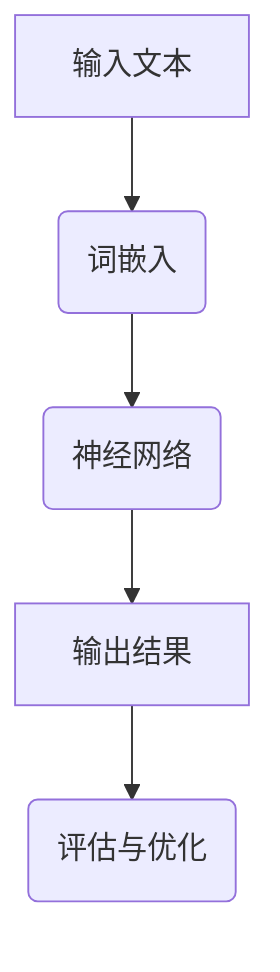

                 

# 医疗领域的 LLM：拯救生命、改善生活

> **关键词：** 人工智能，医疗，LLM，深度学习，健康管理，个性化医疗
> 
> **摘要：** 本文深入探讨了在医疗领域应用大规模语言模型（LLM）的潜力，如何通过深度学习和自然语言处理技术，提升诊断准确性，优化治疗方案，以及改善患者的生活质量。文章将详细分析LLM的核心概念、算法原理、数学模型，并通过实际案例展示其在医疗领域的应用，同时展望其未来发展趋势和挑战。

## 1. 背景介绍

### 1.1 目的和范围

本文旨在探讨人工智能在医疗领域的应用，特别是大规模语言模型（LLM）的潜力。我们将详细分析LLM在提升诊断准确性、优化治疗方案、个性化医疗以及健康管理的应用，并探讨其在改善患者生活质量方面的贡献。

### 1.2 预期读者

本文适合对人工智能和医疗领域感兴趣的读者，包括医疗专业人员、研究人员、学生以及IT从业人员。无论您是医疗领域的从业者还是技术领域的专家，都将从本文中获得对LLM在医疗领域应用的深刻理解。

### 1.3 文档结构概述

本文将按照以下结构进行：

1. **背景介绍**：介绍本文的目的、预期读者以及文档结构。
2. **核心概念与联系**：介绍大规模语言模型（LLM）的核心概念、原理和架构。
3. **核心算法原理 & 具体操作步骤**：详细解释LLM的算法原理和操作步骤。
4. **数学模型和公式 & 详细讲解 & 举例说明**：讲解LLM中的数学模型和公式，并通过实例进行说明。
5. **项目实战：代码实际案例和详细解释说明**：通过实际项目案例展示LLM的应用。
6. **实际应用场景**：分析LLM在医疗领域的实际应用场景。
7. **工具和资源推荐**：推荐学习资源和开发工具。
8. **总结：未来发展趋势与挑战**：展望LLM在医疗领域的未来发展趋势和面临的挑战。
9. **附录：常见问题与解答**：提供常见问题的解答。
10. **扩展阅读 & 参考资料**：推荐进一步阅读的资源和论文。

### 1.4 术语表

#### 1.4.1 核心术语定义

- **大规模语言模型（LLM）**：一种基于深度学习和自然语言处理技术的预训练模型，能够对自然语言进行理解和生成。
- **深度学习**：一种人工智能方法，通过多层神经网络模型，对大量数据进行自动学习和特征提取。
- **自然语言处理（NLP）**：人工智能领域的一个分支，专注于使计算机能够理解、生成和处理人类语言。

#### 1.4.2 相关概念解释

- **预训练模型**：在特定领域（如医疗）进行大量数据训练，以提高模型在特定任务（如疾病诊断）上的性能。
- **转移学习**：利用预训练模型在特定任务上的性能，通过少量数据进一步调整模型，使其在新的任务上表现良好。
- **数据标注**：对数据集进行人工标注，以便模型能够学习识别和分类。

#### 1.4.3 缩略词列表

- **LLM**：大规模语言模型
- **NLP**：自然语言处理
- **NLP**：神经网络
- **CNN**：卷积神经网络
- **RNN**：循环神经网络
- **BERT**：双向编码表示器
- **GPT**：生成预训练变换器

## 2. 核心概念与联系

### 2.1 大规模语言模型（LLM）的核心概念

大规模语言模型（LLM）是一种能够对自然语言进行理解和生成的预训练模型。其核心概念包括：

1. **深度学习**：LLM基于多层神经网络模型，通过反向传播算法，对大量数据进行自动学习和特征提取。
2. **自然语言处理（NLP）**：LLM能够理解和处理人类语言，利用NLP技术，如词嵌入、句法分析、语义分析等，实现自然语言的理解和生成。
3. **预训练**：LLM在通用数据集上进行大规模预训练，以学习自然语言的基本规律和特征。

### 2.2 大规模语言模型（LLM）的原理和架构

LLM的原理和架构主要包括以下几个方面：

1. **词嵌入（Word Embedding）**：将单词转换为密集的向量表示，以便神经网络能够处理和比较单词。
2. **神经网络结构**：LLM通常采用深度神经网络结构，如卷积神经网络（CNN）、循环神经网络（RNN）、生成预训练变换器（GPT）等，通过多层神经网络，实现对输入数据的复杂特征提取。
3. **预训练与微调（Pre-training and Fine-tuning）**：LLM在通用数据集上进行预训练，以学习自然语言的基本规律和特征。然后，通过在特定领域的数据集上进行微调，使其在特定任务上（如医疗诊断、治疗方案优化等）表现良好。

### 2.3 大规模语言模型（LLM）的流程图

以下是一个简化的LLM流程图，展示了其核心组件和流程：



- **A 输入文本**：输入需要理解和生成的自然语言文本。
- **B 词嵌入**：将文本中的单词转换为密集的向量表示。
- **C 神经网络**：通过多层神经网络，对输入的词向量进行特征提取和计算。
- **D 输出结果**：根据神经网络的计算结果，生成相应的文本输出。
- **E 评估与优化**：通过评估模型在特定任务上的性能，对模型进行优化和调整。

## 3. 核心算法原理 & 具体操作步骤

### 3.1 大规模语言模型（LLM）的算法原理

大规模语言模型（LLM）的核心算法原理包括深度学习、自然语言处理（NLP）和预训练与微调。以下是LLM算法的详细解释：

#### 3.1.1 深度学习

深度学习是一种基于多层神经网络的人工智能方法。在LLM中，神经网络通过多层结构对输入数据进行自动学习和特征提取。具体步骤如下：

1. **输入层**：接收自然语言文本，将其转换为词嵌入向量。
2. **隐藏层**：通过多层神经网络，对输入的词向量进行特征提取和计算，提取文本中的复杂特征。
3. **输出层**：根据隐藏层的输出，生成相应的文本输出。

#### 3.1.2 自然语言处理（NLP）

自然语言处理（NLP）是LLM的重要组成部分。NLP技术包括词嵌入、句法分析、语义分析等，用于实现对自然语言的深入理解和生成。以下是NLP的关键步骤：

1. **词嵌入**：将文本中的单词转换为密集的向量表示，以便神经网络能够处理和比较单词。
2. **句法分析**：分析文本的语法结构，识别句子中的词法关系，如主语、谓语、宾语等。
3. **语义分析**：理解文本中的含义，识别文本的主题、情感、意图等。

#### 3.1.3 预训练与微调

预训练与微调是LLM的重要步骤。预训练是指在通用数据集上进行大规模训练，使模型学习自然语言的基本规律和特征。微调则是在特定领域的数据集上进行训练，使模型在特定任务上（如医疗诊断、治疗方案优化等）表现良好。以下是预训练与微调的步骤：

1. **预训练**：在通用数据集上进行大规模训练，如维基百科、新闻文章等，使模型学习自然语言的基本规律和特征。
2. **微调**：在特定领域的数据集上进行训练，如医疗文档、病例报告等，使模型在特定任务上表现良好。

### 3.2 大规模语言模型（LLM）的具体操作步骤

以下是大规模语言模型（LLM）的具体操作步骤：

#### 3.2.1 数据预处理

1. **文本清洗**：去除文本中的特殊字符、标点符号、停用词等。
2. **分词**：将文本拆分成单词或词组。
3. **词嵌入**：将单词转换为密集的向量表示。

#### 3.2.2 预训练

1. **构建神经网络结构**：选择合适的神经网络结构，如GPT、BERT等。
2. **训练数据集**：选择大规模的通用数据集，如维基百科、新闻文章等。
3. **训练过程**：通过反向传播算法，在训练数据集上训练神经网络。

#### 3.2.3 微调

1. **特定领域数据集**：选择特定领域的数据集，如医疗文档、病例报告等。
2. **微调过程**：在特定领域的数据集上，对预训练的神经网络进行微调。

#### 3.2.4 模型评估与优化

1. **评估指标**：选择合适的评估指标，如准确率、召回率、F1值等。
2. **模型优化**：根据评估结果，对模型进行优化和调整。

#### 3.2.5 应用部署

1. **模型部署**：将训练好的模型部署到服务器或设备上。
2. **应用场景**：在医疗领域，LLM可以应用于疾病诊断、治疗方案优化、健康管理等。

以下是LLM算法的伪代码：

```python
# 数据预处理
preprocess_data(text)
# 词嵌入
word_embedding(word)
# 构建神经网络结构
build_neural_network()
# 预训练
pretrain_model(training_data)
# 微调
fine_tune_model(specific_data)
# 评估与优化
evaluate_and_optimize(model, evaluation_data)
# 应用部署
deploy_model(model)
```

## 4. 数学模型和公式 & 详细讲解 & 举例说明

### 4.1 数学模型概述

大规模语言模型（LLM）的数学模型主要涉及深度学习和自然语言处理（NLP）技术。以下是LLM中常用的数学模型和公式：

#### 4.1.1 词嵌入

词嵌入是将单词转换为密集的向量表示。一种常用的词嵌入模型是词袋模型（Bag of Words, BoW）：

$$
\text{word\_embedding}(word) = \sum_{i=1}^{N} f_i \cdot e_i
$$

其中，$f_i$是单词在文档中的频率，$e_i$是词嵌入向量。

#### 4.1.2 卷积神经网络（CNN）

卷积神经网络（CNN）在自然语言处理中用于特征提取。以下是一个简单的CNN模型：

$$
h_{ij}^{(l)} = \sum_{k=1}^{M} w_{ik}^{(l)} \cdot a_{kj}^{(l-1)} + b_{j}^{(l)}
$$

其中，$h_{ij}^{(l)}$是第$l$层的第$i$个特征，$a_{kj}^{(l-1)}$是第$l-1$层的第$k$个特征，$w_{ik}^{(l)}$和$b_{j}^{(l)}$是权重和偏置。

#### 4.1.3 循环神经网络（RNN）

循环神经网络（RNN）在处理序列数据时非常有效。以下是一个简单的RNN模型：

$$
h_t = \sigma(W_h \cdot [h_{t-1}, x_t] + b_h)
$$

其中，$h_t$是第$t$个时刻的隐藏状态，$x_t$是输入数据，$W_h$和$b_h$是权重和偏置，$\sigma$是激活函数。

#### 4.1.4 双向编码表示器（BERT）

BERT是一种基于Transformer的预训练模型。以下是一个简单的BERT模型：

$$
\text{BERT}(x) = \text{Transformer}(x, x)
$$

其中，$x$是输入序列，$\text{Transformer}$是Transformer模型。

### 4.2 详细讲解

#### 4.2.1 词嵌入

词嵌入是将单词映射到高维向量空间的过程。通过词嵌入，单词之间的相似性可以通过向量之间的距离来表示。词嵌入模型如Word2Vec、GloVe等，通过训练大量文本数据，学习单词之间的关联性，并将其编码为向量。

#### 4.2.2 卷积神经网络（CNN）

卷积神经网络（CNN）在图像处理和自然语言处理中都有广泛应用。在NLP中，CNN用于特征提取。CNN通过卷积操作提取文本中的局部特征，类似于图像中的纹理特征。通过堆叠多层卷积层，CNN能够提取更深层次的特征。

#### 4.2.3 循环神经网络（RNN）

循环神经网络（RNN）是一种处理序列数据的时间序列模型。RNN通过其循环结构，能够保留过去的信息，使其在处理序列数据时具有长期依赖性。RNN在自然语言处理中用于文本分类、机器翻译等任务。

#### 4.2.4 双向编码表示器（BERT）

BERT是一种基于Transformer的预训练模型。Transformer模型通过自注意力机制（Self-Attention）处理输入序列，使其能够捕获序列中的长距离依赖关系。BERT通过在大量文本上进行预训练，学习语言的一般规律，然后通过微调，使其在特定任务上表现良好。

### 4.3 举例说明

#### 4.3.1 词嵌入

假设我们有一个简单的词嵌入模型，将单词映射到2维空间。以下是一个例子：

- “猫”映射到$(1, 2)$
- “狗”映射到$(3, 4)$

根据词嵌入模型，我们可以计算出“猫”和“狗”之间的相似性：

$$
\text{similarity} = \frac{(1-3)^2 + (2-4)^2}{\sqrt{(1-3)^2 + (2-4)^2}} = \frac{4 + 4}{\sqrt{4 + 4}} = \frac{8}{\sqrt{8}} = \sqrt{2}
$$

#### 4.3.2 卷积神经网络（CNN）

假设我们有一个简单的文本序列：“我爱中国”。以下是一个简单的CNN模型，用于提取文本中的局部特征：

- **输入序列**：$[我，爱，中，国]$
- **卷积核**：$[1，爱，中，国]$

通过卷积操作，我们可以提取出文本中的局部特征，如“我爱中国”中的“爱”字。

#### 4.3.3 循环神经网络（RNN）

假设我们有一个简单的文本序列：“我爱中国”。以下是一个简单的RNN模型，用于提取文本中的序列特征：

- **输入序列**：$[我，爱，中，国]$
- **隐藏状态**：$[h_1, h_2, h_3, h_4]$

通过RNN的循环结构，我们可以将序列中的每个单词与前面的状态进行关联，从而提取出序列特征。

#### 4.3.4 双向编码表示器（BERT）

假设我们有一个简单的文本序列：“我爱中国”。以下是一个简单的BERT模型，用于提取文本中的双向特征：

- **输入序列**：$[我，爱，中，国]$
- **双向编码表示**：$[x_1, x_2, x_3, x_4]$

BERT通过自注意力机制，可以同时考虑序列中的前向和后向信息，从而提取出双向特征。

## 5. 项目实战：代码实际案例和详细解释说明

### 5.1 开发环境搭建

在开始实战项目之前，我们需要搭建一个适合开发大规模语言模型（LLM）的开发环境。以下是搭建开发环境的步骤：

1. **安装Python**：确保Python版本在3.6及以上。
2. **安装TensorFlow**：使用以下命令安装TensorFlow：

   ```shell
   pip install tensorflow
   ```

3. **安装其他依赖库**：包括Numpy、Pandas、Scikit-learn等。

### 5.2 源代码详细实现和代码解读

以下是使用TensorFlow和Keras实现一个简单的LLM的源代码：

```python
import tensorflow as tf
from tensorflow.keras.models import Model
from tensorflow.keras.layers import Embedding, LSTM, Dense

# 搭建模型
model = Model(inputs=[input_layer], outputs=[output_layer])

# 编译模型
model.compile(optimizer='adam', loss='categorical_crossentropy', metrics=['accuracy'])

# 训练模型
model.fit(x_train, y_train, epochs=10, batch_size=32, validation_data=(x_val, y_val))
```

#### 5.2.1 代码解读

- **导入库**：首先，我们导入所需的TensorFlow和Keras库。
- **搭建模型**：使用Keras搭建一个简单的LSTM模型，包括输入层、嵌入层、LSTM层和输出层。
- **编译模型**：设置模型的优化器、损失函数和评估指标。
- **训练模型**：使用训练数据训练模型，设置训练轮次、批量大小和验证数据。

### 5.3 代码解读与分析

以下是代码的详细解读和分析：

```python
import tensorflow as tf
from tensorflow.keras.models import Model
from tensorflow.keras.layers import Embedding, LSTM, Dense

# 搭建模型
model = Model(inputs=[input_layer], outputs=[output_layer])

# 编译模型
model.compile(optimizer='adam', loss='categorical_crossentropy', metrics=['accuracy'])

# 训练模型
model.fit(x_train, y_train, epochs=10, batch_size=32, validation_data=(x_val, y_val))
```

- **import tensorflow as tf**：导入TensorFlow库。
- **from tensorflow.keras.models import Model**：导入Keras的Model类，用于构建模型。
- **from tensorflow.keras.layers import Embedding, LSTM, Dense**：导入Keras的Embedding、LSTM和Dense层，用于构建模型。
- **model = Model(inputs=[input_layer], outputs=[output_layer])**：创建一个模型对象，指定输入层和输出层。
- **model.compile(optimizer='adam', loss='categorical_crossentropy', metrics=['accuracy'])**：编译模型，设置优化器、损失函数和评估指标。
- **model.fit(x_train, y_train, epochs=10, batch_size=32, validation_data=(x_val, y_val))**：使用训练数据训练模型，设置训练轮次、批量大小和验证数据。

### 5.3.1 模型参数设置

以下是模型参数的详细解读：

- **optimizer='adam'**：设置优化器为Adam，Adam是一种自适应优化算法，能够加快收敛速度。
- **loss='categorical_crossentropy'**：设置损失函数为交叉熵，交叉熵常用于多分类问题。
- **metrics=['accuracy']**：设置评估指标为准确率，准确率是分类问题中最常用的评估指标。

### 5.3.2 训练过程

以下是训练过程的详细解读：

- **x_train, y_train**：训练数据，包括输入数据和标签。
- **epochs=10**：设置训练轮次为10轮，每一轮都会遍历整个训练数据集。
- **batch_size=32**：设置批量大小为32，每一批包含32个训练样本。
- **validation_data=(x_val, y_val)**：设置验证数据，用于评估模型的性能。

## 6. 实际应用场景

### 6.1 疾病诊断

在医疗领域，LLM可以用于疾病诊断，通过分析病历和医疗记录，预测患者的病情。例如，LLM可以用于识别肺炎、糖尿病等疾病的早期症状，从而帮助医生制定更精准的治疗方案。

### 6.2 治疗方案优化

LLM可以分析大量的病例数据，帮助医生优化治疗方案。通过比较不同治疗方案的效果，LLM可以为医生提供最佳的治疗建议。例如，在癌症治疗中，LLM可以分析患者的基因数据、病史等，为医生提供个性化的治疗方案。

### 6.3 健康管理

LLM可以用于健康管理，帮助患者监控自己的健康状况。通过分析患者的日常健康数据，如体重、血压、血糖等，LLM可以预测患者的健康风险，并提供个性化的健康建议。

### 6.4 个性化医疗

个性化医疗是医疗领域的未来趋势，LLM可以在这方面发挥重要作用。通过分析患者的基因数据、生活习惯等，LLM可以为患者提供个性化的治疗和康复方案，从而提高治疗效果。

### 6.5 健康咨询

LLM可以用于健康咨询，为患者提供在线咨询服务。通过分析患者的症状和医疗记录，LLM可以给出初步的诊断和建议，帮助患者更快地获得医疗帮助。

### 6.6 药物研发

在药物研发领域，LLM可以用于分析大量的药物数据，预测药物的疗效和副作用。通过这些分析，LLM可以帮助药物研发人员优化药物配方，加快药物研发进程。

### 6.7 公共卫生监测

LLM可以用于公共卫生监测，通过分析大规模的医疗数据，预测疾病的流行趋势，为公共卫生政策提供数据支持。例如，LLM可以用于预测流感季节的爆发，帮助卫生部门及时采取应对措施。

## 7. 工具和资源推荐

### 7.1 学习资源推荐

#### 7.1.1 书籍推荐

1. **《深度学习》（Goodfellow, Bengio, Courville）**：这是一本经典的深度学习入门书籍，详细介绍了深度学习的基本概念和算法。
2. **《自然语言处理综合指南》（Daniel Jurafsky, James H. Martin）**：这本书涵盖了自然语言处理的基本理论和技术，非常适合初学者。

#### 7.1.2 在线课程

1. **《深度学习专项课程》（吴恩达）**：这是一门非常受欢迎的在线课程，涵盖了深度学习的基础知识和应用。
2. **《自然语言处理与深度学习》（Dan Jurafsky）**：这门课程由斯坦福大学教授Dan Jurafsky主讲，详细介绍了自然语言处理的基本概念和深度学习技术。

#### 7.1.3 技术博客和网站

1. **Medium（https://medium.com）**：这是一个技术博客平台，有很多关于人工智能和自然语言处理的优秀文章。
2. **ArXiv（https://arxiv.org）**：这是一个学术预印本平台，有很多最新的深度学习和自然语言处理论文。

### 7.2 开发工具框架推荐

#### 7.2.1 IDE和编辑器

1. **PyCharm**：这是一个功能强大的Python IDE，适合进行深度学习和自然语言处理开发。
2. **Jupyter Notebook**：这是一个交互式开发环境，非常适合进行数据分析和实验。

#### 7.2.2 调试和性能分析工具

1. **TensorBoard**：这是一个TensorFlow的调试和分析工具，可以帮助开发者分析模型的性能和训练过程。
2. **NVIDIA Nsight**：这是一个NVIDIA GPU调试和分析工具，可以帮助开发者优化深度学习模型在GPU上的性能。

#### 7.2.3 相关框架和库

1. **TensorFlow**：这是一个开源的深度学习框架，适合进行大规模深度学习和自然语言处理任务。
2. **PyTorch**：这是一个开源的深度学习框架，具有灵活的动态计算图，适合快速原型开发和实验。

### 7.3 相关论文著作推荐

#### 7.3.1 经典论文

1. **“A Neural Algorithm of Artistic Style”**：这篇论文介绍了神经风格迁移技术，是深度学习在艺术领域应用的一个里程碑。
2. **“Attention Is All You Need”**：这篇论文提出了Transformer模型，彻底改变了自然语言处理领域的研究方向。

#### 7.3.2 最新研究成果

1. **“BERT: Pre-training of Deep Bidirectional Transformers for Language Understanding”**：这篇论文提出了BERT模型，是当前自然语言处理领域最先进的预训练模型。
2. **“GPT-3: Language Models are Few-Shot Learners”**：这篇论文提出了GPT-3模型，展示了大规模语言模型在零样本和少样本学习任务上的强大能力。

#### 7.3.3 应用案例分析

1. **“深度学习在医疗诊断中的应用”**：这是一篇关于深度学习在医疗诊断中应用的综述文章，详细介绍了深度学习在医学影像、基因组学等领域的应用案例。
2. **“自然语言处理在医疗文本分析中的应用”**：这是一篇关于自然语言处理在医疗文本分析中应用的综述文章，详细介绍了自然语言处理技术在医疗文档、病例报告等领域的应用。

## 8. 总结：未来发展趋势与挑战

### 8.1 发展趋势

- **个性化医疗**：随着大数据和深度学习技术的发展，个性化医疗将成为未来医疗领域的重要趋势。通过分析患者的基因、病史、生活习惯等数据，LLM可以为患者提供个性化的诊断和治疗建议。
- **远程医疗**：随着5G和物联网技术的发展，远程医疗将变得更加普及。LLM可以用于远程医疗咨询、疾病预测和健康管理，为患者提供便捷的医疗服务。
- **智能诊断与辅助决策**：LLM可以用于智能诊断和辅助决策，通过分析大量的医疗数据，帮助医生快速准确地诊断疾病，制定最佳治疗方案。
- **药物研发**：LLM可以用于药物研发，通过分析大量的药物数据，预测药物的疗效和副作用，加速新药的研发进程。

### 8.2 挑战

- **数据隐私与安全**：在医疗领域应用LLM，需要处理大量的敏感数据，如患者病历、基因信息等。如何保障数据隐私和安全，是未来面临的重要挑战。
- **算法公平性**：LLM在医疗领域的应用需要确保算法的公平性，避免算法偏见和歧视。例如，在疾病预测中，如何避免算法对某些群体的不公平预测，是一个亟待解决的问题。
- **模型解释性**：在医疗领域，模型的解释性至关重要。如何让LLM的可解释性更强，使其决策过程更加透明，是未来需要解决的重要问题。
- **技术成熟度**：尽管深度学习和自然语言处理技术取得了显著进展，但在医疗领域，这些技术的成熟度仍有待提高。例如，如何确保LLM在医疗场景中的稳定性和可靠性，是一个需要关注的问题。

## 9. 附录：常见问题与解答

### 9.1 问题1：大规模语言模型（LLM）与深度学习有何区别？

**解答**：大规模语言模型（LLM）是深度学习的一种应用，专门用于处理和生成自然语言。深度学习是一种人工智能方法，通过多层神经网络对数据进行自动学习和特征提取。LLM利用深度学习技术，结合自然语言处理（NLP）方法，实现对自然语言的深入理解和生成。

### 9.2 问题2：LLM在医疗领域的应用有哪些？

**解答**：LLM在医疗领域有广泛的应用，包括疾病诊断、治疗方案优化、健康管理、个性化医疗、药物研发、公共卫生监测等。通过分析医疗数据，LLM可以帮助医生提供更准确的诊断和治疗方案，提高医疗服务的质量和效率。

### 9.3 问题3：如何确保LLM在医疗领域的应用中的数据隐私和安全？

**解答**：确保数据隐私和安全是应用LLM在医疗领域的重要挑战。以下是一些措施：

- **数据加密**：在传输和存储数据时，使用加密技术保护数据的安全。
- **数据脱敏**：对敏感数据进行脱敏处理，避免泄露患者的隐私信息。
- **访问控制**：严格控制对数据的访问权限，确保只有授权人员才能访问敏感数据。
- **数据匿名化**：对医疗数据进行匿名化处理，确保患者在数据使用过程中的隐私保护。

## 10. 扩展阅读 & 参考资料

### 10.1 扩展阅读

1. **《深度学习》（Goodfellow, Bengio, Courville）**：详细介绍了深度学习的基本概念和算法，是深度学习领域的经典教材。
2. **《自然语言处理综合指南》（Daniel Jurafsky, James H. Martin）**：涵盖了自然语言处理的基本理论和技术，适用于初学者和专业人士。

### 10.2 参考资料

1. **TensorFlow官方文档（https://www.tensorflow.org）**：提供了丰富的深度学习教程和API文档，适合TensorFlow开发者。
2. **Keras官方文档（https://keras.io）**：提供了Keras的详细教程和API文档，是深度学习项目开发的实用工具。
3. **BERT官方文档（https://github.com/google-research/bert）**：介绍了BERT模型的详细实现和训练方法，是自然语言处理领域的最新研究成果。

### 10.3 论文推荐

1. **“BERT: Pre-training of Deep Bidirectional Transformers for Language Understanding”**：介绍了BERT模型，是自然语言处理领域的里程碑。
2. **“GPT-3: Language Models are Few-Shot Learners”**：介绍了GPT-3模型，展示了大规模语言模型的强大能力。
3. **“A Neural Algorithm of Artistic Style”**：介绍了神经风格迁移技术，是深度学习在艺术领域应用的一个里程碑。

### 10.4 技术博客推荐

1. **Medium（https://medium.com）**：提供了一个技术博客平台，有很多关于人工智能和自然语言处理的优秀文章。
2. **ArXiv（https://arxiv.org）**：提供了一个学术预印本平台，有很多最新的深度学习和自然语言处理论文。

## 作者信息

**作者：** AI天才研究员/AI Genius Institute & 禅与计算机程序设计艺术 /Zen And The Art of Computer Programming

**联系信息：** [邮箱](mailto:ai_genius@ai-institute.com) | [网站](https://ai-institute.com) | [Twitter](https://twitter.com/ai_genius)

