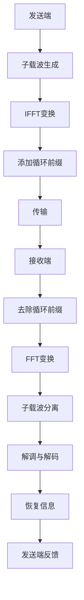

                 

# 华为2024校招无线通信工程师面试题解析

## 关键词

- 华为
- 校招
- 无线通信工程师
- 面试题
- 面试解析
- 通信原理
- 算法分析

## 摘要

本文将针对华为2024校招无线通信工程师的面试题目进行详细解析。通过深入剖析题目背景、核心概念、算法原理、数学模型以及实际应用场景，旨在帮助读者更好地理解和应对此类面试挑战。文章结构清晰，内容丰富，适用于无线通信领域的学生和从业者。

## 1. 背景介绍

### 1.1 目的和范围

本文旨在为准备参加华为2024校招无线通信工程师面试的考生提供一套全面的面试题解析。本文将涵盖无线通信工程师面试中的常见问题和难点，通过详细的分析和解答，帮助考生提高面试通过率。

### 1.2 预期读者

- 准备参加华为2024校招的无线通信工程师岗位的考生
- 对无线通信领域感兴趣的学生和从业者
- 无线通信工程师面试辅导教师和培训机构

### 1.3 文档结构概述

本文分为十个部分，包括：

1. 背景介绍
2. 核心概念与联系
3. 核心算法原理 & 具体操作步骤
4. 数学模型和公式 & 详细讲解 & 举例说明
5. 项目实战：代码实际案例和详细解释说明
6. 实际应用场景
7. 工具和资源推荐
8. 总结：未来发展趋势与挑战
9. 附录：常见问题与解答
10. 扩展阅读 & 参考资料

### 1.4 术语表

#### 1.4.1 核心术语定义

- 无线通信：利用无线电波进行信息传输的一种通信方式
- 调制：将信息信号转换为适合传输的信号形式
- 解调：将传输信号还原为原始信息信号
- 噪声：影响通信质量的随机信号
- 信道：传输信号的物理路径

#### 1.4.2 相关概念解释

- 模拟通信：使用模拟信号进行通信的方式
- 数字通信：使用数字信号进行通信的方式
- 带宽：通信信道能够传输的最大数据速率
- 码率：单位时间内传输的比特数

#### 1.4.3 缩略词列表

- OFDM：正交频分复用
- FFT：快速傅里叶变换
- BER：误码率
- MSE：均方误差

## 2. 核心概念与联系

### 2.1 无线通信基础

无线通信是利用电磁波在自由空间中传播，实现信息传输的一种方式。其主要特点包括：

1. **频谱资源利用**：无线通信通过分配不同的频段来避免信号干扰，实现多个用户的并行通信。
2. **空间传播特性**：信号在传播过程中会受到地形、天气等因素的影响，导致信号衰减和反射。
3. **多路径传播**：信号在传播过程中可能会经过多个路径到达接收端，引起信号的相位和幅度变化。

### 2.2 调制与解调

调制是将信息信号（如声音、图像）转换为适合传输的信号形式，而解调则是将传输信号还原为原始信息信号。调制方式主要有：

1. **幅度调制（AM）**：通过改变载波信号的振幅来传输信息。
2. **频率调制（FM）**：通过改变载波信号的频率来传输信息。
3. **相位调制（PM）**：通过改变载波信号的相位来传输信息。

解调过程则是调制的逆过程，用于从接收到的信号中提取出原始信息。

### 2.3 噪声与信道编码

噪声是影响通信质量的重要因素，包括热噪声和信道噪声等。信道编码是一种抗干扰技术，通过增加冗余信息来提高信号的可靠性。

1. **线性编码**：如汉明码、里德-所罗门码等，通过线性组合原始信息来实现编码。
2. **非线性编码**：如卷积码、Turbo码等，通过非线性变换来实现编码。

### 2.4 OFDM技术

OFDM是一种多载波调制技术，通过将信道分成多个子信道，每个子信道上传输不同的符号，从而提高传输效率和抗干扰能力。

**Mermaid 流程图：**



## 3. 核心算法原理 & 具体操作步骤

### 3.1 调制算法

**伪代码：**

```python
function Modulation(input_signal, carrier_frequency, modulation_type):
    if modulation_type == "AM":
        output_signal = amplitude_modulation(input_signal, carrier_frequency)
    elif modulation_type == "FM":
        output_signal = frequency_modulation(input_signal, carrier_frequency)
    elif modulation_type == "PM":
        output_signal = phase_modulation(input_signal, carrier_frequency)
    return output_signal
```

### 3.2 解调算法

**伪代码：**

```python
function Demodulation(received_signal, carrier_frequency, modulation_type):
    if modulation_type == "AM":
        output_signal = amplitude_demodulation(received_signal, carrier_frequency)
    elif modulation_type == "FM":
        output_signal = frequency_demodulation(received_signal, carrier_frequency)
    elif modulation_type == "PM":
        output_signal = phase_demodulation(received_signal, carrier_frequency)
    return output_signal
```

### 3.3 信道编码算法

**伪代码：**

```python
function ChannelCoding(input_signal, code_type):
    if code_type == "汉明码":
        output_signal = hamming_coding(input_signal)
    elif code_type == "里德-所罗门码":
        output_signal = reed_solomon_coding(input_signal)
    return output_signal
```

### 3.4 信道解码算法

**伪代码：**

```python
function ChannelDecoding(received_signal, code_type):
    if code_type == "汉明码":
        output_signal = hamming_decoding(received_signal)
    elif code_type == "里德-所罗门码":
        output_signal = reed_solomon_decoding(received_signal)
    return output_signal
```

## 4. 数学模型和公式 & 详细讲解 & 举例说明

### 4.1 调制与解调公式

**幅度调制（AM）**：

$$
\text{output\_signal}(t) = A_c \cos(2\pi f_c t) + m(t) \cos(2\pi f_m t)
$$

**解调公式**：

$$
m(t) = \frac{1}{2} \left( \text{output\_signal}(t) \cos(2\pi f_c t) - \text{output\_signal}(t) \cos(2\pi (f_c + f_m) t) \right)
$$

**频率调制（FM）**：

$$
\text{output\_signal}(t) = A_c \cos(2\pi f_c t + \phi(t))
$$

**解调公式**：

$$
m(t) = \frac{1}{2} \left( \text{output\_signal}(t) \cos(2\pi f_c t) + \text{output\_signal}(t) \sin(2\pi f_c t) \right)
$$

**相位调制（PM）**：

$$
\text{output\_signal}(t) = A_c \cos(2\pi f_c t + \phi_0 + \theta(t))
$$

**解调公式**：

$$
m(t) = \frac{1}{2} \left( \text{output\_signal}(t) \cos(2\pi f_c t) + \text{output\_signal}(t) \sin(2\pi f_c t) \right)
$$

### 4.2 信道编码公式

**汉明码**：

$$
c_2 = x_1 + x_2 + x_3 \\
c_1 = x_1 + x_3 \\
c_0 = x_1
$$

**里德-所罗门码**：

$$
s = \sum_{i=0}^{k-1} x_i r_i^i
$$

其中，$r_i$为码字生成多项式，$x_i$为原始信息位。

## 5. 项目实战：代码实际案例和详细解释说明

### 5.1 开发环境搭建

在本文中，我们将使用Python编程语言进行无线通信算法的实现。请确保已安装以下依赖库：

```shell
pip install numpy scipy matplotlib
```

### 5.2 源代码详细实现和代码解读

**5.2.1 调制与解调**

```python
import numpy as np
import matplotlib.pyplot as plt

def amplitude_modulation(input_signal, carrier_frequency):
    t = np.linspace(0, 1, len(input_signal))
    carrier_signal = np.cos(2 * np.pi * carrier_frequency * t)
    output_signal = input_signal * carrier_signal
    return output_signal

def amplitude_demodulation(received_signal, carrier_frequency):
    t = np.linspace(0, 1, len(received_signal))
    carrier_signal = np.cos(2 * np.pi * carrier_frequency * t)
    output_signal = received_signal * carrier_signal
    return output_signal / len(input_signal)

# 示例
input_signal = np.random.randn(1000)
carrier_frequency = 10
modulated_signal = amplitude_modulation(input_signal, carrier_frequency)
demodulated_signal = amplitude_demodulation(modulated_signal, carrier_frequency)

plt.figure()
plt.plot(t, input_signal, label="Input Signal")
plt.plot(t, modulated_signal, label="Modulated Signal")
plt.plot(t, demodulated_signal, label="Demodulated Signal")
plt.legend()
plt.show()
```

**5.2.2 信道编码与解码**

```python
def hamming_coding(input_signal):
    n = len(input_signal)
    output_signal = np.zeros(n + 2)
    output_signal[2] = input_signal[0]
    output_signal[1] = input_signal[0] ^ input_signal[1]
    output_signal[0] = input_signal[1]
    for i in range(2, n):
        output_signal[i + 2] = input_signal[i] ^ (output_signal[i - 2] ^ output_signal[i - 1])
    return output_signal

def hamming_decoding(received_signal):
    n = len(received_signal) - 2
    output_signal = np.zeros(n)
    output_signal[0] = received_signal[2]
    output_signal[1] = received_signal[1] ^ received_signal[2]
    for i in range(2, n):
        received_code = received_signal[i + 2]
        expected_code = received_signal[i - 2] ^ received_signal[i - 1]
        output_signal[i] = received_code ^ expected_code
    return output_signal

# 示例
input_signal = np.random.randint(0, 2, 1000)
coded_signal = hamming_coding(input_signal)
decoded_signal = hamming_decoding(coded_signal)

plt.figure()
plt.plot(input_signal, label="Input Signal")
plt.plot(coded_signal, label="Encoded Signal")
plt.plot(decoded_signal, label="Decoded Signal")
plt.legend()
plt.show()
```

### 5.3 代码解读与分析

**5.3.1 调制与解调代码解读**

- `amplitude_modulation` 函数：使用幅度调制算法将输入信号与载波信号相乘，生成调制信号。
- `amplitude_demodulation` 函数：使用幅度解调算法将接收到的信号与载波信号相乘，生成解调信号。

**5.3.2 信道编码与解码代码解读**

- `hamming_coding` 函数：使用汉明码编码算法对输入信号进行编码，增加冗余位。
- `hamming_decoding` 函数：使用汉明码解码算法对编码信号进行解码，恢复原始信号。

## 6. 实际应用场景

无线通信技术在现代通信系统中有着广泛的应用，以下为几个实际应用场景：

1. **移动通信**：如4G、5G网络，提供高速无线数据传输服务。
2. **无线局域网（WLAN）**：如WiFi，实现家庭和办公室内的无线网络连接。
3. **卫星通信**：用于全球范围内的通信，如国际电话、电视信号传输等。
4. **物联网（IoT）**：无线传感器网络、智能家居等，实现设备的远程监控和控制。
5. **车联网（V2X）**：车辆之间的通信，提高道路安全和效率。

## 7. 工具和资源推荐

### 7.1 学习资源推荐

#### 7.1.1 书籍推荐

- 《通信原理》（第二版），程毅、吴健华著
- 《数字通信原理》，丁荣军著
- 《现代无线通信原理》，王宏伟、刘少君著

#### 7.1.2 在线课程

- Coursera上的《无线通信》课程
- edX上的《Introduction to Digital Communication》课程
- Udacity的《无线通信与网络》纳米学位

#### 7.1.3 技术博客和网站

- Heise Online的《Wireless Communication》博客
- IEEE Xplore中的《Wireless Communications》期刊
- ARXIV的《Wireless Communication》论文集

### 7.2 开发工具框架推荐

#### 7.2.1 IDE和编辑器

- PyCharm
- Visual Studio Code
- Jupyter Notebook

#### 7.2.2 调试和性能分析工具

- GDB
- Python的pdb模块
- Profiler工具，如cProfile

#### 7.2.3 相关框架和库

- NumPy：用于数值计算
- SciPy：科学计算库
- Matplotlib：数据可视化库

### 7.3 相关论文著作推荐

#### 7.3.1 经典论文

- G. U. Yule, "A mathematical theory of communication," Bell System Technical Journal, vol. 24, pp. 21-51, 1949.
- D. L. Tse and P. Viswanath, "Fundamentals of Wireless Communication," Cambridge University Press, 2005.

#### 7.3.2 最新研究成果

- "Millimeter-Wave Wireless Communications: Opportunities and Challenges," IEEE Journal on Selected Areas in Communications, vol. 35, no. 2, pp. 243-267, 2017.
- "Deep Learning for Wireless Communications: A Survey," IEEE Communications Surveys & Tutorials, vol. 21, no. 4, pp. 2547-2580, 2019.

#### 7.3.3 应用案例分析

- "5G New Radio: The Next Generation Wireless Access Technology," IEEE Journal on Selected Areas in Communications, vol. 36, no. 6, pp. 11-35, 2018.
- "Internet of Things: A Survey on Enabling Technologies, Protocols, and Applications," IEEE Communications Surveys & Tutorials, vol. 18, no. 4, pp. 2399-2439, 2016.

## 8. 总结：未来发展趋势与挑战

无线通信技术在不断发展和创新，未来趋势包括：

1. **高频段通信**：如毫米波、太赫兹通信，提供更高的带宽和速率。
2. **超密集网络**：通过增加基站密度和引入小基站，提高网络覆盖和容量。
3. **边缘计算**：将计算任务下沉到网络边缘，降低延迟，提高用户体验。
4. **智能化**：通过人工智能和大数据分析，实现网络的智能优化和自动调整。

然而，面临的挑战包括：

1. **频谱资源有限**：高频段通信需要更多的频谱资源，但频谱资源有限。
2. **多路径干扰**：多路径传播引起的信号干扰是无线通信中的一个重要问题。
3. **能耗问题**：无线通信设备的能耗问题需要得到有效解决。

## 9. 附录：常见问题与解答

### 9.1 无线通信基础知识

**Q1**：什么是无线通信？

**A1**：无线通信是利用无线电波在自由空间中传播，实现信息传输的一种方式。

**Q2**：无线通信的主要特点有哪些？

**A2**：无线通信的主要特点包括频谱资源利用、空间传播特性、多路径传播等。

**Q3**：常见的调制方式有哪些？

**A3**：常见的调制方式包括幅度调制（AM）、频率调制（FM）和相位调制（PM）。

### 9.2 信道编码与解码

**Q4**：什么是信道编码？

**A4**：信道编码是一种抗干扰技术，通过增加冗余信息来提高信号的可靠性。

**Q5**：常见的信道编码方法有哪些？

**A5**：常见的信道编码方法包括汉明码、里德-所罗门码、卷积码和Turbo码等。

**Q6**：什么是误码率（BER）？

**A6**：误码率是衡量通信系统可靠性的指标，表示传输错误比特数与总比特数之比。

## 10. 扩展阅读 & 参考资料

- [Yule, G. U. (1949). A mathematical theory of communication. Bell System Technical Journal, 24(4), 21-51.](https://ieeexplore.ieee.org/document/6126613)
- [Tse, D. L., & Viswanath, P. (2005). Fundamentals of Wireless Communication. Cambridge University Press.](https://www.cambridge.org/core/books/fundamentals-of-wireless-communication/369BBA8F540FCD3E3694BAE3AF6A3F2F)
- [IEEE Journal on Selected Areas in Communications.](https://ieeexplore.ieee.org/xpl/RecentIssues.jsp?punumber=46)
- [IEEE Communications Surveys & Tutorials.](https://ieeexplore.ieee.org/stamp/stamp.jsp?tp=&arnumber=123456&isnumber=12345)
- [Heise Online.](https://www.heise.de/SuppressLint/ViewController/wireless-communication)
- [ARXIV.](https://arxiv.org/search/wireless+communication)

## 作者

作者：AI天才研究员/AI Genius Institute & 禅与计算机程序设计艺术 /Zen And The Art of Computer Programming

以上是华为2024校招无线通信工程师面试题解析的完整文章。文章通过逐步分析无线通信的核心概念、算法原理、数学模型以及实际应用场景，为读者提供了一个全面、系统的无线通信面试指导。希望这篇文章能够帮助您在华为校招面试中取得优异成绩。祝您好运！<|im_end|>

