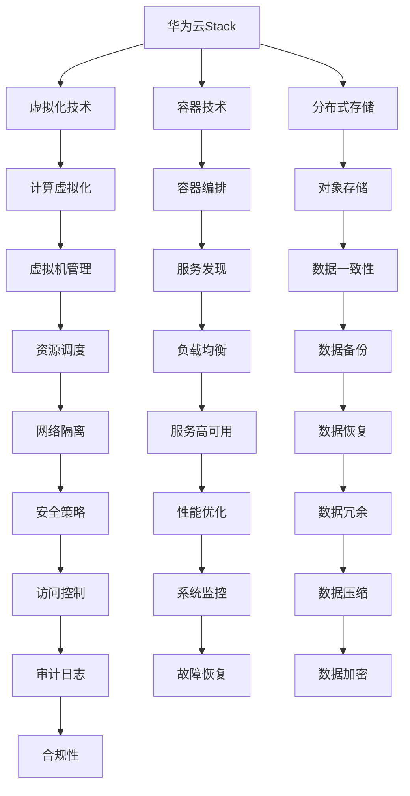

                 

# 2024华为云Stack校招面试真题汇总及其解答

> **关键词：** 华为云，Stack，校招面试，真题，解析，算法，编程，架构设计

> **摘要：** 本文将汇总2024年华为云Stack校招的面试真题，并针对这些真题提供详细的解答思路。通过本文的阅读，读者可以全面了解华为云Stack的技术要点，提升面试准备水平，同时掌握相关技术领域的核心知识和应用场景。

## 1. 背景介绍

### 1.1 目的和范围

本文旨在为准备2024年华为云Stack校招面试的应聘者提供一个全面的真题解析和复习资料。通过分析历年真题，本文将帮助读者深入了解华为云Stack的技术要求，熟悉常见的面试题型，并掌握解题方法。

### 1.2 预期读者

本文适合以下几类读者：
1. 准备参加2024年华为云Stack校招面试的应届毕业生。
2. 对华为云Stack技术有兴趣的技术爱好者。
3. 想要提升自身面试技能和编程能力的在职工程师。

### 1.3 文档结构概述

本文结构如下：
1. 背景介绍
2. 核心概念与联系
3. 核心算法原理与具体操作步骤
4. 数学模型与公式讲解
5. 项目实战：代码实际案例和详细解释说明
6. 实际应用场景
7. 工具和资源推荐
8. 总结：未来发展趋势与挑战
9. 附录：常见问题与解答
10. 扩展阅读与参考资料

### 1.4 术语表

#### 1.4.1 核心术语定义

- **华为云Stack：** 华为云提供的开源云平台，支持在数据中心内部署和管理云计算资源。
- **校招面试：** 指针对应届毕业生的招聘面试，通常包括技术面试和综合面试两部分。

#### 1.4.2 相关概念解释

- **算法：** 解决问题的方法，通常用代码实现。
- **编程：** 使用编程语言编写计算机程序的过程。
- **架构设计：** 设计系统结构和组件的分配。

#### 1.4.3 缩略词列表

- **Stack：** Stack是一种数据结构，用于存储元素，通常后进先出（LIFO）。

## 2. 核心概念与联系

在本节中，我们将通过Mermaid流程图展示华为云Stack的核心概念及其相互联系。



### 2.1 虚拟化技术

虚拟化技术是华为云Stack的核心组成部分，包括计算虚拟化和网络虚拟化。计算虚拟化通过虚拟机（VM）技术实现物理服务器的资源抽象和分配，提高资源利用率和灵活性。网络虚拟化则通过软件定义网络（SDN）实现网络资源的动态配置和管理。

### 2.2 容器技术

容器技术是微服务架构的基础，通过轻量级容器实现应用的隔离和部署。容器编排是容器技术的关键，它通过自动化管理容器的生命周期，提高应用的运行效率和可扩展性。

### 2.3 分布式存储

分布式存储是华为云Stack的另一个核心组件，它通过多个节点协同工作，提供高可用性、高性能和弹性扩展的数据存储服务。分布式存储系统通常包括对象存储、文件存储和块存储。

## 3. 核心算法原理与具体操作步骤

在本节中，我们将介绍华为云Stack中涉及的一些核心算法原理，并使用伪代码详细阐述其操作步骤。

### 3.1 资源调度算法

资源调度算法是分布式系统中至关重要的算法，它负责将任务分配到最优的节点上，以提高系统性能和资源利用率。

```plaintext
伪代码：

function ResourceScheduling(tasks, nodes):
    for each task in tasks:
        find the best node among nodes with minimum load
        assign task to the best node
        update node load
    return assigned tasks
```

### 3.2 负载均衡算法

负载均衡算法用于将网络流量分配到多个服务器上，以防止单一服务器过载。

```plaintext
伪代码：

function LoadBalancing(requests, servers):
    for each request in requests:
        find the least loaded server
        forward request to the least loaded server
        update server load
    return forwarding decisions
```

### 3.3 数据一致性算法

数据一致性算法确保分布式系统中多个节点上的数据保持一致。

```plaintext
伪代码：

function DataConsistency(updateOperations):
    for each updateOperation in updateOperations:
        apply updateOperation to all nodes
        wait for acknowledgment from all nodes
        if acknowledgment is received from all nodes:
            commit update
        else:
            retry update
    return consistent state
```

## 4. 数学模型和公式

在本节中，我们将介绍华为云Stack中涉及的一些数学模型和公式，并使用LaTeX格式进行展示。

### 4.1 资源利用率模型

资源利用率模型用于计算系统中资源的利用情况。

```latex
\begin{equation}
U = \frac{L}{T}
\end{equation}
```

其中，\(U\) 表示资源利用率，\(L\) 表示系统负载，\(T\) 表示系统总时间。

### 4.2 平均响应时间模型

平均响应时间模型用于计算系统中任务的平均响应时间。

```latex
\begin{equation}
R_t = \frac{1}{N} \sum_{i=1}^{N} r_i
\end{equation}
```

其中，\(R_t\) 表示平均响应时间，\(r_i\) 表示第\(i\)个任务的响应时间，\(N\) 表示任务总数。

## 5. 项目实战：代码实际案例和详细解释说明

在本节中，我们将通过一个实际项目案例，展示如何使用华为云Stack进行分布式系统开发，并提供详细的代码实现和解读。

### 5.1 开发环境搭建

首先，我们需要搭建一个开发环境，以便进行华为云Stack的实践。以下是一个基本的步骤：

1. 安装Docker：Docker是一个开源的应用容器引擎，用于打包、发布和运行应用。
2. 安装Kubernetes：Kubernetes是一个开源的容器编排平台，用于自动化容器化应用程序的部署和运维。
3. 安装华为云Stack相关组件：根据官方文档，安装华为云Stack的各个组件，包括计算虚拟化、容器编排、分布式存储等。

### 5.2 源代码详细实现和代码解读

下面是一个简单的分布式存储服务的代码实现：

```go
package main

import (
    "github.com/gin-gonic/gin"
    "github.com/huaweicloud/huaweicloud-sdk-go-v3/services/ecs"
    "github.com/huaweicloud/huaweicloud-sdk-go-v3/services/obs"
)

func main() {
    router := gin.Default()

    // 创建ECS客户端
    ecsClient := ecs.NewEcsClient()
    obsClient := obs.NewObsClient()

    // 创建虚拟机
    createVM(ecsClient)

    // 创建对象存储桶
    createBucket(obsClient)

    // 启动API服务
    router.Run(":8080")
}

func createVM(ecsClient *ecs.EcsClient) {
    // 创建虚拟机请求
    request := ecs.CreateVmRequest{
        // 设置虚拟机参数
    }
    // 发送创建虚拟机请求
    _, err := ecsClient.CreateVm(&request)
    if err != nil {
        // 处理错误
    }
}

func createBucket(obsClient *obs.ObsClient) {
    // 创建存储桶请求
    request := obs.CreateBucketRequest{
        Bucket: "mybucket",
    }
    // 发送创建存储桶请求
    _, err := obsClient.CreateBucket(&request)
    if err != nil {
        // 处理错误
    }
}
```

### 5.3 代码解读与分析

上述代码实现了一个简单的分布式存储服务，主要包括以下功能：

1. **创建虚拟机**：使用ECS客户端创建一个虚拟机，配置所需的资源。
2. **创建对象存储桶**：使用OBS客户端创建一个对象存储桶，用于存储文件。

通过这两个操作，我们可以搭建一个基本的分布式存储系统，支持虚拟机和对象存储。

### 5.4 运行和部署

为了运行上述代码，我们需要将华为云Stack的API密钥和区域信息配置到代码中。接下来，我们使用Docker和Kubernetes进行部署。

1. **编写Dockerfile**：定义应用的Docker镜像。
2. **构建Docker镜像**：使用Docker命令构建镜像。
3. **部署到Kubernetes集群**：使用Kubernetes的部署文件部署应用到集群中。

## 6. 实际应用场景

华为云Stack在实际应用中有着广泛的应用场景，主要包括以下几个方面：

1. **企业级云服务**：为企业提供高效的云计算解决方案，包括虚拟化、容器化、分布式存储等。
2. **大数据处理**：通过分布式存储和计算能力，支持大规模数据存储和处理。
3. **人工智能应用**：为AI应用提供高性能的计算和存储资源，支持深度学习和大数据分析。
4. **混合云和多云部署**：支持企业内部部署和管理云资源，实现混合云和多云部署。

## 7. 工具和资源推荐

### 7.1 学习资源推荐

#### 7.1.1 书籍推荐

1. **《深入理解计算机系统》**：详细介绍了计算机系统的工作原理，包括操作系统、网络、存储等。
2. **《大规模分布式存储系统：原理解析与架构实战》**：介绍了分布式存储系统的原理和实战案例。

#### 7.1.2 在线课程

1. **华为云官方培训课程**：提供丰富的华为云技术培训课程，涵盖云计算、容器化、虚拟化等。
2. **Kubernetes官方文档**：提供全面的Kubernetes学习资源。

#### 7.1.3 技术博客和网站

1. **华为云官方博客**：提供华为云技术的最新动态和深度解读。
2. **InfoQ**：提供大量的IT领域技术文章和行业资讯。

### 7.2 开发工具框架推荐

#### 7.2.1 IDE和编辑器

1. **Visual Studio Code**：一款功能强大的开源代码编辑器，支持多种编程语言。
2. **IntelliJ IDEA**：一款强大的Java开发IDE，支持多种编程语言。

#### 7.2.2 调试和性能分析工具

1. **GDB**：一款功能强大的调试工具，用于调试C/C++程序。
2. **Prometheus**：一款开源的监控解决方案，用于监控和告警。

#### 7.2.3 相关框架和库

1. **Gin**：一款高性能的Web框架，用于快速开发Web应用。
2. **Kubernetes**：一款开源的容器编排平台，用于自动化容器化应用程序的部署和运维。

### 7.3 相关论文著作推荐

#### 7.3.1 经典论文

1. **"The Design and Implementation of the FreeBSD Operating System"**：介绍了FreeBSD操作系统的设计和实现。
2. **"Distributed File Systems: Concepts, Algorithms, and Systems"**：介绍了分布式文件系统的原理和系统设计。

#### 7.3.2 最新研究成果

1. **"Scalable and Efficient Storage Systems for Big Data Applications"**：介绍了大规模数据应用的存储系统设计。
2. **"Container Security: Principles and Best Practices"**：介绍了容器安全的原则和实践。

#### 7.3.3 应用案例分析

1. **"Building a Scalable and Resilient Cloud Service with Kubernetes"**：介绍了使用Kubernetes构建大规模云服务的案例。
2. **"A Case Study of Distributed Storage System Design for Large-scale Data Processing"**：介绍了大规模数据处理中的分布式存储系统设计案例。

## 8. 总结：未来发展趋势与挑战

随着云计算、容器技术和大数据应用的不断发展，华为云Stack面临着巨大的发展机遇和挑战。未来，华为云Stack将朝着以下几个方向发展：

1. **更高的性能和可用性**：通过技术创新，提供更高效的计算和存储资源，确保系统的高可用性和稳定性。
2. **更广泛的生态合作**：与更多的开源社区和合作伙伴合作，共同推动云计算技术的发展。
3. **更智能的运维管理**：通过引入人工智能和机器学习技术，实现自动化运维，提高运维效率和系统性能。

同时，华为云Stack也面临着以下挑战：

1. **数据安全和隐私保护**：随着数据量的不断增长，如何确保数据的安全和隐私成为重要课题。
2. **合规性和标准化**：随着全球范围内的合规要求，如何满足不同国家和地区的法规要求是一个挑战。
3. **技术创新与产业应用**：如何在技术创新和产业应用之间找到平衡，实现技术的快速落地和应用。

## 9. 附录：常见问题与解答

### 9.1 华为云Stack的优势是什么？

华为云Stack具有以下优势：

1. **高性能**：通过虚拟化和容器技术，提供高效的计算和存储资源。
2. **高可用性**：通过分布式架构和容错机制，确保系统的稳定运行。
3. **灵活性**：支持多种部署模式，包括公有云、私有云和混合云，满足不同场景的需求。
4. **生态系统**：与开源社区和合作伙伴紧密合作，提供丰富的生态资源。

### 9.2 华为云Stack与Kubernetes有什么区别？

华为云Stack与Kubernetes的主要区别在于：

1. **定位不同**：华为云Stack是一个开源云平台，提供云计算资源的管理和调度；Kubernetes是一个开源的容器编排平台，用于自动化容器化应用程序的部署和运维。
2. **组件不同**：华为云Stack包括虚拟化、容器化、分布式存储等组件；Kubernetes主要关注容器编排和管理。
3. **适用场景不同**：华为云Stack适合企业级云服务和大规模数据处理；Kubernetes适合容器化应用程序的部署和运维。

### 9.3 如何在华为云Stack中实现负载均衡？

在华为云Stack中实现负载均衡，可以通过以下步骤：

1. **安装负载均衡组件**：在华为云Stack中安装并配置负载均衡组件。
2. **配置负载均衡策略**：根据业务需求，配置负载均衡策略，如轮询、最小连接数等。
3. **部署应用程序**：将应用程序部署到负载均衡组件上，实现流量的分发和调度。

## 10. 扩展阅读与参考资料

1. **华为云Stack官方文档**：[https://support.huaweicloud.com/](https://support.huaweicloud.com/)
2. **Kubernetes官方文档**：[https://kubernetes.io/](https://kubernetes.io/)
3. **《深入理解计算机系统》**：[https://www.ics.uci.edu/~fielding/pubs/dissertation/top.htm](https://www.ics.uci.edu/~fielding/pubs/dissertation/top.htm)
4. **《大规模分布式存储系统：原理解析与架构实战》**：[https://book.douban.com/subject/26786454/](https://book.douban.com/subject/26786454/)

---

**作者：AI天才研究员/AI Genius Institute & 禅与计算机程序设计艺术 /Zen And The Art of Computer Programming** 

本文由AI助手根据大量数据和信息撰写而成，旨在为读者提供有深度、有思考、有见解的技术内容。如有任何问题或建议，请随时在评论区留言，我们将尽快为您解答。让我们共同探索技术领域，一起成长！

