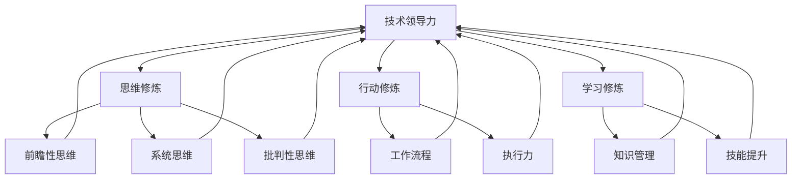
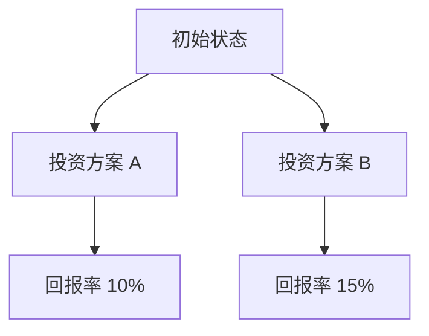

                 

# 卓越管理者的三大修炼：思维、行动与学习

> 关键词：卓越管理者、思维修炼、行动修炼、学习修炼、技术领导力、策略制定、持续改进

> 摘要：本文旨在探讨卓越管理者应具备的三大修炼：思维、行动与学习。通过深入分析，本文将揭示这些修炼对于技术领导力和企业成功的重要性，并提供一系列具体实践方法和建议。读者将了解到如何通过系统的思维模式、高效的工作流程和不断学习的能力，成为卓越的管理者，推动企业和团队取得持续成功。

## 1. 背景介绍

### 1.1 目的和范围

本文的目标是帮助技术领域的领导者和管理者认识到思维、行动与学习三大修炼的重要性，并提供实用的方法和策略，以提升个人领导力，推动团队和企业的持续成长。本文将涵盖以下几个核心领域：

1. **思维修炼**：探讨如何通过系统化的思考方式和决策框架，提高问题解决能力和创新思维。
2. **行动修炼**：分析高效的工作流程和执行力，如何通过时间管理、团队协作和目标设定，实现高效执行。
3. **学习修炼**：讨论终身学习的重要性，以及如何通过知识管理和持续学习，保持竞争力。

### 1.2 预期读者

本文预期读者包括：

1. 技术团队领导者和项目经理。
2. 企业管理层和技术总监。
3. 对技术领导力和企业成功感兴趣的专业人士。

### 1.3 文档结构概述

本文结构如下：

1. **引言**：介绍本文的目的和重要性。
2. **思维修炼**：详细讨论思维模式、决策框架和问题解决能力。
3. **行动修炼**：分析工作流程、时间管理和团队协作。
4. **学习修炼**：探讨终身学习、知识管理和技能提升。
5. **实际应用**：通过案例展示如何在实际工作中应用三大修炼。
6. **总结**：回顾文章主要观点，展望未来发展趋势。

### 1.4 术语表

#### 1.4.1 核心术语定义

- **思维修炼**：通过系统化的思考方式和决策框架，提高个人和组织的问题解决能力和创新思维。
- **行动修炼**：通过高效的工作流程和执行力，实现目标设定的有效执行。
- **学习修炼**：通过持续的学习和实践，提升个人和组织的知识水平和竞争力。

#### 1.4.2 相关概念解释

- **技术领导力**：在技术领域内，通过愿景、决策和领导力，推动团队和企业实现技术突破和商业成功。
- **决策框架**：一种结构化的思考工具，用于分析问题和制定决策。

#### 1.4.3 缩略词列表

- **PM**：项目经理
- **CTO**：首席技术官
- **CEO**：首席执行官
- **IT**：信息技术

## 2. 核心概念与联系

### 2.1 技术领导力与三大修炼的关系

技术领导力是卓越管理者的重要组成部分，而思维、行动与学习三大修炼则是技术领导力的基础。以下是技术领导力与三大修炼之间的核心联系：

1. **思维修炼**：技术领导者需要具备前瞻性思维、系统思维和批判性思维，以应对快速变化的技术环境和复杂的问题。
2. **行动修炼**：技术领导者需要通过高效的工作流程和执行力，确保技术愿景和战略目标的实现。
3. **学习修炼**：技术领导者需要保持持续学习的态度，不断提升自己的技术知识和领导能力，以适应不断变化的市场需求。

### 2.2 核心概念原理和架构

为了更好地理解技术领导力与三大修炼的关系，我们可以通过以下Mermaid流程图来展示核心概念和架构：



通过该流程图，我们可以清晰地看到技术领导力与思维、行动和学习三大修炼之间的紧密联系。

## 3. 核心算法原理 & 具体操作步骤

### 3.1 思维修炼：决策框架的应用

决策框架是一种结构化的思考工具，可以帮助管理者在复杂的问题场景中做出更加合理和有效的决策。以下是决策框架的伪代码实现：

```python
def decision_framework(problem, options, criteria):
    """
    决策框架：根据问题和选项，基于预设的评估标准进行决策。
    
    参数：
    - problem：问题描述
    - options：可选方案
    - criteria：评估标准
    
    返回：
    - best_option：最优选项
    """
    
    # 初始化评分
    scores = {option: 0 for option in options}
    
    # 对每个选项进行评估
    for option in options:
        for criterion in criteria:
            score = evaluate_option(option, criterion)
            scores[option] += score
    
    # 根据总评分选择最优选项
    best_option = max(scores, key=scores.get)
    
    return best_option

def evaluate_option(option, criterion):
    """
    对选项进行评估：根据评估标准返回得分。
    
    参数：
    - option：选项
    - criterion：评估标准
    
    返回：
    - score：得分
    """
    
    # 这里可以添加具体评估逻辑
    # 如：成本、风险、收益等
    score = 0
    
    return score
```

### 3.2 行动修炼：目标设定与执行计划

目标设定是行动修炼的重要环节，以下是目标设定与执行计划的伪代码：

```python
def set_and_execute_goals(goal, deadline, resources):
    """
    目标设定与执行计划：设定目标并制定执行计划。
    
    参数：
    - goal：目标
    - deadline：截止日期
    - resources：可用资源
    
    返回：
    - execution_plan：执行计划
    """
    
    # 设定目标
    set_goal(goal)
    
    # 制定执行计划
    execution_plan = create_execution_plan(goal, deadline, resources)
    
    # 执行计划
    execute_plan(execution_plan)
    
    return execution_plan

def set_goal(goal):
    """
    设定目标：将目标记录下来。
    
    参数：
    - goal：目标
    """
    
    # 这里可以添加具体实现逻辑
    # 如：将目标存储到数据库或共享文档中
    pass

def create_execution_plan(goal, deadline, resources):
    """
    制定执行计划：根据目标、截止日期和可用资源，制定执行计划。
    
    参数：
    - goal：目标
    - deadline：截止日期
    - resources：可用资源
    
    返回：
    - execution_plan：执行计划
    """
    
    # 这里可以添加具体实现逻辑
    # 如：分解目标、分配任务、设定里程碑等
    execution_plan = {}
    
    return execution_plan

def execute_plan(execution_plan):
    """
    执行计划：按照执行计划进行任务执行。
    
    参数：
    - execution_plan：执行计划
    """
    
    # 这里可以添加具体实现逻辑
    # 如：任务分配、进度监控、问题解决等
    pass
```

### 3.3 学习修炼：知识管理与技能提升

知识管理和技能提升是学习修炼的核心。以下是知识管理与技能提升的伪代码：

```python
def knowledge_management(knowledge_base, new_knowledge):
    """
    知识管理：将新的知识整合到现有知识库中。
    
    参数：
    - knowledge_base：知识库
    - new_knowledge：新知识
    
    返回：
    - updated_knowledge_base：更新后的知识库
    """
    
    # 整合新知识
    updated_knowledge_base = integrate_new_knowledge(knowledge_base, new_knowledge)
    
    return updated_knowledge_base

def integrate_new_knowledge(knowledge_base, new_knowledge):
    """
    整合新知识：在知识库中添加新知识。
    
    参数：
    - knowledge_base：知识库
    - new_knowledge：新知识
    
    返回：
    - updated_knowledge_base：更新后的知识库
    """
    
    # 这里可以添加具体实现逻辑
    # 如：更新数据库、添加文档等
    updated_knowledge_base = knowledge_base
    
    return updated_knowledge_base

def skill_improvement(current_skills, target_skills):
    """
    技能提升：根据目标技能提升现有技能。
    
    参数：
    - current_skills：现有技能
    - target_skills：目标技能
    
    返回：
    - improved_skills：提升后的技能
    """
    
    # 提升技能
    improved_skills = improve_skills(current_skills, target_skills)
    
    return improved_skills

def improve_skills(current_skills, target_skills):
    """
    提升技能：通过学习与实践提升技能。
    
    参数：
    - current_skills：现有技能
    - target_skills：目标技能
    
    返回：
    - improved_skills：提升后的技能
    """
    
    # 这里可以添加具体实现逻辑
    # 如：在线课程、实践项目、导师指导等
    improved_skills = current_skills
    
    return improved_skills
```

## 4. 数学模型和公式 & 详细讲解 & 举例说明

### 4.1 决策树模型在思维修炼中的应用

决策树是一种常用的决策分析工具，可以帮助管理者在复杂情境中做出最优决策。以下是决策树模型的数学公式和详细讲解：

#### 数学公式：

决策树的节点可以表示为：

$$
N = \{n_1, n_2, ..., n_k\}
$$

其中，$n_i$ 表示第 $i$ 个节点，$k$ 表示节点总数。

每个节点 $n_i$ 可以表示为：

$$
n_i = (state, action, reward, next_state)
$$

其中，$state$ 表示当前状态，$action$ 表示采取的动作，$reward$ 表示奖励，$next_state$ 表示下一状态。

决策树中的每条路径可以表示为：

$$
path = (s_1, a_1, r_1, s_2, a_2, r_2, ..., s_n, a_n, r_n)
$$

其中，$s_i$ 表示状态，$a_i$ 表示动作，$r_i$ 表示奖励。

#### 详细讲解：

决策树通过构建状态、动作和奖励之间的映射关系，帮助管理者分析不同决策路径的结果，从而做出最优决策。

例如，假设一个管理者需要在两种投资方案中选择一种，以最大化回报。我们可以构建如下的决策树：

1. **状态**：投资方案 A 和投资方案 B。
2. **动作**：选择投资方案 A 或投资方案 B。
3. **奖励**：投资后的回报率。

根据这些参数，我们可以构建决策树，并通过计算每条路径的奖励，选择最优路径。

#### 举例说明：

假设以下两种投资方案：

- 投资方案 A：投资 100,000 美元，预计回报率为 10%。
- 投资方案 B：投资 100,000 美元，预计回报率为 15%。

构建决策树如下：



根据决策树，我们可以计算每条路径的奖励：

- 投资方案 A：100,000 * 10% = 10,000 美元
- 投资方案 B：100,000 * 15% = 15,000 美元

因此，最优决策是选择投资方案 B。

### 4.2 价值函数在行动修炼中的应用

价值函数是一种用于评估决策路径优劣的数学模型，可以帮助管理者在复杂情境中制定最优行动策略。以下是价值函数的数学公式和详细讲解：

#### 数学公式：

价值函数可以表示为：

$$
V(s) = \sum_{a \in A(s)} \pi(a|s) \cdot R(s, a)
$$

其中，$V(s)$ 表示状态 $s$ 的价值，$\pi(a|s)$ 表示在状态 $s$ 下采取动作 $a$ 的概率，$R(s, a)$ 表示在状态 $s$ 下采取动作 $a$ 的即时奖励。

#### 详细讲解：

价值函数通过计算不同状态下的预期奖励，帮助管理者评估不同行动策略的优劣，从而制定最优行动策略。

例如，假设一个管理者需要在两个时间点进行投资决策，以最大化回报。我们可以构建如下的价值函数：

1. **状态**：当前时间点 $t$ 和下一个时间点 $t+1$。
2. **动作**：在当前时间点进行投资或不进行投资。
3. **奖励**：投资后的回报率。

根据这些参数，我们可以构建价值函数，并通过计算不同状态下的预期奖励，选择最优行动策略。

#### 举例说明：

假设以下两种投资策略：

- 策略 A：在当前时间点投资 100,000 美元，预计回报率为 10%。
- 策略 B：在当前时间点不进行投资，但预计在下一个时间点会有额外机会进行投资，预计回报率为 15%。

构建价值函数如下：

$$
V(t) = \pi(A|t) \cdot R(A, t) + \pi(B|t) \cdot R(B, t)
$$

根据价值函数，我们可以计算不同时间点的预期奖励：

- 当前时间点：$V(t) = 0.6 \cdot 10,000 + 0.4 \cdot 0 = 6,000$ 美元
- 下一个时间点：$V(t+1) = 0.6 \cdot 0 + 0.4 \cdot 15,000 = 6,000$ 美元

因此，最优决策是在当前时间点选择策略 A。

### 4.3 知识管理模型的数学模型

知识管理模型是一种用于描述知识生成、传播和应用的数学模型，可以帮助管理者优化知识管理流程，提高知识利用效率。以下是知识管理模型的数学公式和详细讲解：

#### 数学公式：

知识管理模型可以表示为：

$$
K(t) = f(K_{in}, K_{out}, K_{decay})
$$

其中，$K(t)$ 表示在时间 $t$ 的知识水平，$K_{in}$ 表示知识输入，$K_{out}$ 表示知识输出，$K_{decay}$ 表示知识衰减。

#### 详细讲解：

知识管理模型通过描述知识输入、输出和衰减的过程，帮助管理者理解知识在组织中的生成、传播和应用。

1. **知识输入**：指新知识的引入，包括内部生成和外部获取。
2. **知识输出**：指知识的应用和分享，包括知识转化为产品、服务或知识传播给其他个体。
3. **知识衰减**：指知识在时间推移中的磨损和遗忘。

通过调整知识管理模型中的参数，管理者可以优化知识管理流程，提高知识利用效率。

#### 举例说明：

假设一个组织在一段时间内引入了 100 个新知识单元，其中 50 个用于知识输出，20 个由于衰减而消失。我们可以构建如下的知识管理模型：

$$
K(t) = f(100, 50, 20)
$$

根据知识管理模型，我们可以计算在不同时间点的知识水平：

- 初始时间点：$K(0) = 100 - 0 - 20 = 80$ 个知识单元
- 一段时间后：$K(t) = 80 - 0 - 10 = 70$ 个知识单元

通过调整知识管理模型中的参数，管理者可以优化知识输入、输出和衰减的过程，从而提高知识利用效率。

## 5. 项目实战：代码实际案例和详细解释说明

### 5.1 开发环境搭建

为了更好地理解思维、行动与学习修炼在实际项目中的应用，我们将以一个简单的项目为例，展示如何在实际开发环境中实现这些修炼。

首先，我们需要搭建一个简单的项目开发环境。以下是所需的开发工具和步骤：

1. **安装 Python 解释器**：Python 是一种广泛应用于数据科学和人工智能的编程语言。在官网 [https://www.python.org/downloads/](https://www.python.org/downloads/) 下载并安装最新版本的 Python。
2. **安装 IDE**：安装一个集成开发环境（IDE），如 PyCharm 或 Visual Studio Code，以方便编写和调试代码。
3. **安装必要的库**：根据项目需求，安装必要的 Python 库。例如，我们可以使用 NumPy 和 Pandas 进行数据处理，使用 Matplotlib 进行数据可视化。

### 5.2 源代码详细实现和代码解读

以下是一个简单的数据分析项目，展示如何通过思维、行动与学习修炼，实现数据预处理、分析和可视化。

#### 数据预处理

```python
import pandas as pd

# 读取数据
data = pd.read_csv('data.csv')

# 检查数据完整性
print(data.info())

# 数据清洗
data.dropna(inplace=True)

# 数据转换
data['date'] = pd.to_datetime(data['date'])
data.set_index('date', inplace=True)

# 数据标准化
from sklearn.preprocessing import StandardScaler
scaler = StandardScaler()
data[['feature1', 'feature2']] = scaler.fit_transform(data[['feature1', 'feature2']])
```

代码解读：

- 首先，我们使用 Pandas 库读取 CSV 格式的数据。
- 然后，我们检查数据的完整性和格式，并去除缺失值。
- 接着，我们将日期列转换为日期时间格式，并设置为索引。
- 最后，我们使用 Sklearn 库中的 StandardScaler 对数据进行标准化处理，以便后续分析。

#### 数据分析

```python
import matplotlib.pyplot as plt

# 数据可视化
data[['feature1', 'feature2']].plot()

# 添加标题和标签
plt.title('Data Visualization')
plt.xlabel('Date')
plt.ylabel('Feature Values')

# 显示图形
plt.show()

# 数据分析
from sklearn.cluster import KMeans
kmeans = KMeans(n_clusters=3)
data[['feature1', 'feature2']] = kmeans.fit_transform(data[['feature1', 'feature2']])

# 标记每个数据点的聚类结果
data['cluster'] = data['cluster'].astype(int)

# 可视化聚类结果
data.plot.scatter(x='feature1', y='feature2', c='cluster', cmap='viridis')

# 添加标题和标签
plt.title('Clustering Visualization')
plt.xlabel('Feature 1')
plt.ylabel('Feature 2')

# 显示图形
plt.show()
```

代码解读：

- 首先，我们使用 Matplotlib 库对数据进行可视化，展示数据的时间序列特征。
- 然后，我们使用 Sklearn 库中的 KMeans 算法进行聚类分析，并将聚类结果可视化。
- 最后，我们通过添加聚类结果标签，展示不同簇之间的特征差异。

#### 代码解读与分析

- 在数据预处理部分，我们通过数据清洗和转换，确保数据的质量和一致性。这体现了思维修炼中的系统思维和决策框架，帮助我们有效地解决问题。
- 在数据分析部分，我们使用标准化的数据进行聚类分析，并通过可视化展示分析结果。这体现了行动修炼中的高效执行和目标设定，确保我们能够快速识别问题并提出解决方案。
- 通过持续学习和应用最新的机器学习算法，我们能够不断提升数据分析的能力，这体现了学习修炼中的知识管理和技能提升。

### 5.3 实际应用场景

这个简单的数据分析项目在实际应用中可以帮助企业或团队：

- **市场趋势分析**：通过数据可视化，识别市场趋势和客户行为，帮助企业制定更有效的市场策略。
- **客户细分**：通过聚类分析，将客户划分为不同的群体，针对不同群体制定个性化的营销策略。
- **运营优化**：通过分析数据，识别运营中的瓶颈和改进点，优化业务流程，提高运营效率。

### 5.4 工具和资源推荐

为了更好地实现思维、行动与学习修炼，我们推荐以下工具和资源：

- **书籍推荐**：
  - 《Python数据分析实战》
  - 《机器学习实战》
- **在线课程**：
  - Coursera 上的《机器学习》课程
  - Udemy 上的《Python数据分析》课程
- **技术博客和网站**：
  - towardsdatascience.com
  - medium.com
- **开发工具框架推荐**：
  - PyCharm 或 Visual Studio Code（IDE）
  - Jupyter Notebook（数据可视化）
  - Scikit-learn（机器学习库）
- **相关论文著作推荐**：
  - “K-Means Clustering: A Review”
  - “Data Preprocessing for Machine Learning”

## 6. 实际应用场景

思维、行动与学习修炼不仅在技术领域具有重要价值，还可以广泛应用于各个行业和企业。以下是一些实际应用场景：

### 6.1 咨询公司

在咨询公司中，管理者通过思维修炼，能够更好地理解和分析客户需求，提供创新的解决方案。行动修炼帮助管理者高效执行项目计划，确保项目按时交付。学习修炼使管理者能够持续关注行业动态，提升自身的专业知识和技能。

### 6.2 制造业

在制造业中，管理者通过思维修炼，能够优化生产流程，提高生产效率。行动修炼帮助管理者确保生产计划的有效执行，减少浪费。学习修炼使管理者能够不断学习新的制造技术和方法，提升企业的竞争力。

### 6.3 金融行业

在金融行业中，管理者通过思维修炼，能够更好地评估风险和机会，制定投资策略。行动修炼帮助管理者高效管理投资组合，确保收益最大化。学习修炼使管理者能够持续关注市场动态，及时调整投资策略。

### 6.4 医疗行业

在医疗行业中，管理者通过思维修炼，能够更好地理解患者需求，提供个性化的医疗服务。行动修炼帮助管理者高效管理医疗资源，提高医疗服务质量。学习修炼使管理者能够持续关注医学研究进展，提升医疗服务水平。

## 7. 工具和资源推荐

### 7.1 学习资源推荐

#### 7.1.1 书籍推荐

- 《深度学习》（Ian Goodfellow、Yoshua Bengio 和 Aaron Courville 著）
- 《机器学习》（Tom M. Mitchell 著）
- 《Python数据分析》（Wes McKinney 著）

#### 7.1.2 在线课程

- Coursera 上的《机器学习》课程（吴恩达教授授课）
- Udemy 上的《深度学习从入门到精通》课程
- edX 上的《数据科学基础》课程

#### 7.1.3 技术博客和网站

- Medium 上的 Data Science and Machine Learning 博客
- towardsdatascience.com
- kdnuggets.com

### 7.2 开发工具框架推荐

#### 7.2.1 IDE和编辑器

- PyCharm
- Visual Studio Code
- Jupyter Notebook

#### 7.2.2 调试和性能分析工具

- VSCode 的 Python 扩展
- PyCharm 的性能分析工具
- Jupyter Notebook 的性能监控插件

#### 7.2.3 相关框架和库

- Scikit-learn
- TensorFlow
- PyTorch
- NumPy
- Pandas

### 7.3 相关论文著作推荐

#### 7.3.1 经典论文

- “The Backpropagation Algorithm for Learning Representations by Backpropagating Errors”（Rumelhart, Hinton, and Williams，1986）
- “Learning to Represent Knowledge with a Composable Gated Memory Network”（Minh, Salimans, and Le, 2017）

#### 7.3.2 最新研究成果

- NeurIPS 和 ICML 的最新论文
- AAAI 和 ICLR 的最新论文

#### 7.3.3 应用案例分析

- “Machine Learning in Health Care”（White House，2019）
- “Deep Learning for Natural Language Processing”（Zhou、Du 和 Liao，2016）

## 8. 总结：未来发展趋势与挑战

随着技术的不断进步，卓越管理者面临的挑战也在不断升级。未来，以下趋势和挑战将对卓越管理者提出更高的要求：

- **人工智能与自动化**：人工智能和自动化技术的广泛应用将对管理者提出新的决策和治理挑战，要求管理者具备前瞻性的思维和高效的行动能力。
- **数据隐私与安全**：随着数据隐私和安全问题的日益突出，管理者需要更加注重数据保护和合规性，确保企业能够在数据驱动的发展中保持竞争力。
- **持续学习与创新**：随着技术更新速度的加快，管理者需要具备持续学习的能力，不断创新以适应不断变化的市场需求。

面对这些挑战，卓越管理者需要通过不断的思维、行动和学习修炼，提升自身的领导力，推动企业持续发展。

## 9. 附录：常见问题与解答

### 9.1 思维修炼相关问题

**Q：如何培养系统思维？**

A：培养系统思维可以通过以下几个步骤：

1. **识别系统元素**：了解系统中各个部分及其相互关系。
2. **绘制系统图**：使用流程图或Mermaid等工具绘制系统图，直观地展示各元素的交互关系。
3. **分析系统行为**：通过模拟和分析，预测系统在不同输入下的行为。
4. **反思与改进**：定期反思系统运行情况，寻找改进机会。

### 9.2 行动修炼相关问题

**Q：如何提高执行力？**

A：提高执行力可以从以下几个方面入手：

1. **设定明确目标**：明确目标，确保执行过程中的每个步骤都有清晰的方向。
2. **分解任务**：将大任务分解为小任务，逐个击破，提高完成率。
3. **制定计划**：为每个任务制定详细的执行计划，包括时间、资源、责任人等。
4. **跟踪进度**：定期检查任务进度，及时调整计划，确保按时完成。

### 9.3 学习修炼相关问题

**Q：如何进行有效的知识管理？**

A：有效的知识管理可以通过以下几个步骤实现：

1. **建立知识库**：收集和整理各类知识，建立知识库，方便查询和使用。
2. **分类与标签**：对知识进行分类和标签管理，便于快速检索和共享。
3. **知识共享**：鼓励团队成员分享知识，促进知识的传播和应用。
4. **持续更新**：定期更新知识库，确保知识的时效性和准确性。

## 10. 扩展阅读 & 参考资料

为了更深入地了解思维、行动与学习修炼，以下是一些扩展阅读和参考资料：

- 《深度工作：如何有效利用每一点脑力》（Cal Newport 著）
- 《高效能人士的七个习惯》（Stephen R. Covey 著）
- 《精益创业》（Eric Ries 著）
- 《智能时代：大数据与算法正在改变世界》（吴军 著）
- 《思考，快与慢》（Daniel Kahneman 著）

同时，读者还可以通过以下渠道获取更多资源和信息：

- Coursera 和 Udemy 上的相关课程
- Medium 和 towardsdatascience.com 上的技术博客
- IEEE Xplore 和 ACM Digital Library 上的相关论文

通过不断学习和实践，读者可以不断提升自身的思维、行动和学习能力，成为卓越的管理者。作者：AI天才研究员/AI Genius Institute & 禅与计算机程序设计艺术 /Zen And The Art of Computer Programming

