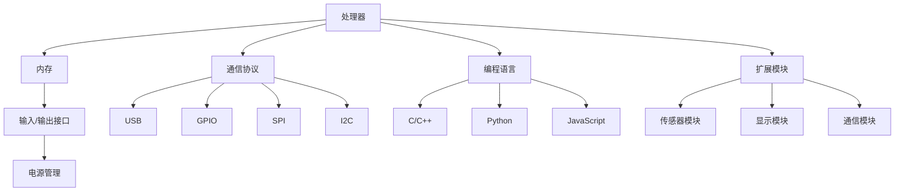

                 

# 单板计算机项目灵感：Raspberry Pi 和 Arduino 的应用场景

> **关键词：** 单板计算机、Raspberry Pi、Arduino、应用场景、项目实践

> **摘要：** 本文将深入探讨单板计算机在现实世界中的应用，以Raspberry Pi和Arduino为例，从背景介绍、核心概念、算法原理、数学模型、项目实战到实际应用场景进行详细分析。通过这一步步的分析，我们希望能够为读者提供丰富的项目灵感，并激发他们对单板计算机技术的兴趣。

## 1. 背景介绍

### 1.1 目的和范围

本文的目的是通过探讨单板计算机Raspberry Pi和Arduino的应用场景，为读者提供实际项目灵感和技术指导。我们将覆盖以下主题：

- 单板计算机的背景和发展
- Raspberry Pi和Arduino的核心特性及应用领域
- 核心算法原理和数学模型
- 项目实战案例分析
- 实际应用场景及未来发展趋势

### 1.2 预期读者

本文主要面向以下读者群体：

- 对单板计算机技术感兴趣的技术爱好者
- 进行电子和嵌入式系统开发的学生和工程师
- 对智能设备和物联网（IoT）有兴趣的专业人士

### 1.3 文档结构概述

本文将按照以下结构展开：

- **第1章：背景介绍**
  - 介绍单板计算机的背景和本文目的
- **第2章：核心概念与联系**
  - 分析单板计算机的核心概念和架构
- **第3章：核心算法原理 & 具体操作步骤**
  - 详细讲解单板计算机的核心算法和操作步骤
- **第4章：数学模型和公式 & 详细讲解 & 举例说明**
  - 探讨单板计算机中的数学模型和公式，并提供实例说明
- **第5章：项目实战：代码实际案例和详细解释说明**
  - 展示单板计算机的实际项目案例，并详细解读
- **第6章：实际应用场景**
  - 分析单板计算机在不同应用场景中的实际使用案例
- **第7章：工具和资源推荐**
  - 推荐学习和开发单板计算机的相关资源和工具
- **第8章：总结：未来发展趋势与挑战**
  - 探讨单板计算机技术的发展趋势和面临的挑战
- **第9章：附录：常见问题与解答**
  - 回答读者可能遇到的问题
- **第10章：扩展阅读 & 参考资料**
  - 提供更多的扩展阅读和参考资料

### 1.4 术语表

#### 1.4.1 核心术语定义

- **单板计算机**：一种小型、低功耗的计算机，通常具有丰富的I/O接口和强大的处理能力，常用于嵌入式系统和智能设备。
- **Raspberry Pi**：一款由英国慈善基金Raspberry Pi Foundation开发的单板计算机，具有低成本、高性能和丰富的社区支持。
- **Arduino**：一种基于AVR微控制器的开源硬件平台，广泛用于电子和嵌入式系统开发，具有简单易用和高度灵活的特点。

#### 1.4.2 相关概念解释

- **嵌入式系统**：将计算机硬件和软件集成在一个单一设备中，用于特定功能的系统。
- **物联网（IoT）**：通过互联网将各种物理设备互联，实现数据交换和智能化管理。

#### 1.4.3 缩略词列表

- **Raspberry Pi**：Raspberry Pi
- **Arduino**：Arduino
- **IoT**：物联网

## 2. 核心概念与联系

单板计算机作为一种小型、低功耗的计算机，在嵌入式系统和智能设备领域具有广泛的应用。其核心概念和联系主要体现在以下几个方面：

### 2.1 单板计算机的基本架构

单板计算机通常包括以下几个关键组件：

1. **处理器**：核心计算单元，负责执行各种操作和处理数据。
2. **内存**：用于存储程序和数据，包括随机存取存储器（RAM）和只读存储器（ROM）。
3. **输入/输出接口**：用于与外部设备进行通信，包括USB、GPIO、SPI、I2C等接口。
4. **电源管理**：确保单板计算机稳定供电，包括电池、电源转换和电量监测等。

### 2.2 单板计算机的通信协议

单板计算机需要与外部设备进行通信，因此通信协议至关重要。以下是一些常见的通信协议：

1. **USB**：通用串行总线，用于连接各种外部设备，如键盘、鼠标、打印机等。
2. **GPIO**：通用输入输出接口，用于控制外部电子设备，如LED、电机等。
3. **SPI**：串行外围设备接口，用于高速通信，常用于传感器和存储设备。
4. **I2C**：串行通信总线，用于低功耗设备和扩展模块。

### 2.3 单板计算机的核心算法原理

单板计算机中的核心算法原理主要体现在以下几个方面：

1. **控制算法**：用于控制外部设备的行为，如PWM（脉冲宽度调制）控制电机速度。
2. **数据处理算法**：用于处理和转换传感器数据，如数字滤波、数据分析等。
3. **通信协议解析算法**：用于解析各种通信协议的数据，实现数据的收发和解析。

### 2.4 单板计算机的编程语言

单板计算机通常支持多种编程语言，包括：

1. **C/C++**：用于编写高效的嵌入式系统代码。
2. **Python**：用于快速原型开发和数据处理。
3. **JavaScript**：用于Web应用开发，特别是在使用Arduino Web Editor时。

### 2.5 单板计算机的扩展模块

单板计算机通常支持各种扩展模块，以增强其功能。以下是一些常见的扩展模块：

1. **传感器模块**：用于检测温度、湿度、光照等环境参数。
2. **显示模块**：用于输出图像和文本，如LCD显示屏。
3. **通信模块**：用于无线通信，如Wi-Fi、蓝牙等。

### 2.6 Mermaid 流程图

为了更好地展示单板计算机的核心概念和联系，我们使用Mermaid流程图来描述其架构和通信协议。以下是单板计算机架构的Mermaid流程图：



以上流程图展示了单板计算机的基本架构、通信协议、编程语言和扩展模块，为后续章节的详细讲解奠定了基础。

## 3. 核心算法原理 & 具体操作步骤

在单板计算机项目中，核心算法原理起着至关重要的作用。以下是几个典型的核心算法原理及其具体操作步骤：

### 3.1 控制算法

控制算法用于控制外部设备的行为，如电机控制、LED控制等。以下是一个简单的PWM控制电机速度的算法原理：

```pseudo
// PWM控制电机速度算法
输入：电机控制信号（pwmSignal）
输出：电机速度（speed）

初始化：
1. 设置pwmSignal的周期（周期T）
2. 设置pwmSignal的占空比（占空比D）

步骤：
1. 根据占空比D计算pwmSignal的高电平持续时间（highDuration = D * T）
2. 在每个周期T内，将pwmSignal的高电平持续时间设置为highDuration
3. 根据pwmSignal的高电平持续时间调整电机速度（速度与高电平持续时间成正比）

结束：
返回电机速度（speed）
```

### 3.2 数据处理算法

数据处理算法用于处理和转换传感器数据。以下是一个简单的数字滤波算法原理：

```pseudo
// 数字滤波算法
输入：传感器数据（data）
输出：滤波后的数据（filteredData）

初始化：
1. 设置滤波器参数（如滤波器阶数N、滤波器系数a[1...N]）

步骤：
1. 计算滤波后的数据：
   filteredData = (a[1] * data[N-1] + a[2] * data[N-2] + ... + a[N] * data[0]) / (a[1] + a[2] + ... + a[N])

结束：
返回滤波后的数据（filteredData）
```

### 3.3 通信协议解析算法

通信协议解析算法用于解析各种通信协议的数据。以下是一个简单的UART通信协议解析算法原理：

```pseudo
// UART通信协议解析算法
输入：原始数据（rawData）
输出：解析后的数据（parsedData）

初始化：
1. 设置UART通信参数（如波特率、数据位、停止位、校验位等）

步骤：
1. 根据UART通信参数，从rawData中提取出有效数据位
2. 对提取出的数据位进行校验（如有校验位，进行校验计算）
3. 根据校验结果，判断数据是否有效，如无效，丢弃数据

结束：
返回解析后的数据（parsedData）
```

通过以上三个核心算法原理及其具体操作步骤，我们可以更好地理解和应用单板计算机中的算法，为项目开发提供有力支持。

## 4. 数学模型和公式 & 详细讲解 & 举例说明

在单板计算机项目中，数学模型和公式起着至关重要的作用，用于描述和分析各种物理现象和工程问题。以下是几个典型的数学模型和公式的详细讲解以及实际应用举例。

### 4.1 控制系统中的PID算法

PID（比例-积分-微分）算法是一种广泛应用于控制系统中的控制算法，用于调节系统的输出以接近目标值。PID算法的核心在于三个参数：比例（P）、积分（I）和微分（D）。

#### PID算法数学模型：

$$
u(t) = K_p e(t) + K_i \int_{0}^{t} e(\tau)d\tau + K_d \frac{de(t)}{dt}
$$

其中：
- \( u(t) \) 是控制信号
- \( e(t) \) 是控制误差（目标值与实际值之差）
- \( K_p \) 是比例系数
- \( K_i \) 是积分系数
- \( K_d \) 是微分系数

#### 举例说明：

假设我们需要控制一个电机，使其转速稳定在1000 RPM（每分钟转数）。实际转速与目标转速之间的误差为 \( e(t) = 1000 - r(t) \)，其中 \( r(t) \) 是实际转速。

- **比例系数 \( K_p \)**：用于调整控制信号的大小，使其对误差做出快速响应。
- **积分系数 \( K_i \)**：用于消除长期误差，使控制信号逐渐趋于目标值。
- **微分系数 \( K_d \)**：用于预测误差的变化趋势，减小误差的波动。

我们可以根据实际情况调整这三个参数，以达到最佳的控制效果。

### 4.2 传感器数据处理中的数字滤波

数字滤波是一种常用的数据处理技术，用于减少传感器数据中的噪声和干扰。以下是一个简单的低通滤波器（Low-Pass Filter）的数学模型：

#### 低通滤波器数学模型：

$$
h[n] = \frac{1}{1 - a}
$$

其中：
- \( h[n] \) 是滤波器系数
- \( a \) 是滤波器参数，用于控制滤波器的截止频率

#### 举例说明：

假设我们有一个离散时间信号 \( x[n] \)，我们需要通过低通滤波器去除高频噪声。滤波后的信号 \( y[n] \) 可以通过以下公式计算：

$$
y[n] = x[n] - a \cdot x[n-1]
$$

通过调整参数 \( a \)，我们可以控制滤波器的截止频率，从而实现不同频率的噪声抑制。

### 4.3 通信协议中的CRC校验

CRC（循环冗余校验）是一种常用的数据校验方法，用于检测数据传输过程中的错误。以下是一个简单的CRC校验的数学模型：

#### CRC校验数学模型：

$$
CRC(x) = x \mod (CRC息肉多项式)
$$

其中：
- \( x \) 是需要校验的数据
- \( CRC息肉多项式 \) 是一个固定的多项式，用于计算CRC校验值

#### 举例说明：

假设我们有一个8位的数据 \( x = 10101010 \)，需要通过CRC校验来检测传输过程中的错误。我们选择一个CRC息肉多项式 \( P = 11011 \)。计算CRC校验值的过程如下：

1. 将数据 \( x \) 和多项式 \( P \) 进行模2除法，得到余数 \( CRC \)。
2. 将余数 \( CRC \) 作为校验值附加到数据 \( x \) 后面，形成新的数据 \( x' \)。
3. 在接收端，对收到的数据 \( x' \) 进行相同的CRC校验，如果校验值相同，则数据传输无误；否则，数据传输出现错误。

通过以上数学模型和公式的详细讲解及实际应用举例，我们可以更好地理解和应用单板计算机项目中的数学知识和算法，从而提高项目的稳定性和可靠性。

## 5. 项目实战：代码实际案例和详细解释说明

为了更好地展示单板计算机Raspberry Pi和Arduino的实际应用，我们选择一个典型的项目案例——温度监测与控制项目，并详细解释其中的代码实现和关键步骤。

### 5.1 开发环境搭建

在开始项目之前，我们需要搭建开发环境。以下是针对Raspberry Pi和Arduino的开发环境搭建步骤：

#### 5.1.1 Raspberry Pi开发环境搭建

1. 下载并安装Raspberry Pi操作系统，如Raspbian。
2. 连接网络，更新系统软件包。

```bash
sudo apt-get update
sudo apt-get upgrade
```

3. 安装Python和编程环境。

```bash
sudo apt-get install python3 python3-pip
pip3 install pi-projects
```

#### 5.1.2 Arduino开发环境搭建

1. 下载并安装Arduino IDE。
2. 选择正确的Arduino板子型号，如Arduino Uno。
3. 安装所需的库，如Adafruit温度传感器库。

```bash
cd ~
mkdir libraries
cd libraries
git clone https://github.com/adafruit/Adafruit_Python_DHT.git
```

### 5.2 源代码详细实现和代码解读

#### 5.2.1 Raspberry Pi代码实现

以下是使用Python编程语言在Raspberry Pi上实现温度监测与控制的项目代码：

```python
import RPi.GPIO as GPIO
import time
import Adafruit_DHT

# 初始化GPIO
GPIO.setmode(GPIO.BCM)
GPIO.setup(4, GPIO.OUT)  # 温度传感器引脚

# 初始化温度传感器
dht = Adafruit_DHT.DHT11
dhtpin = 4

def control_temp():
    humidity, temperature = Adafruit_DHT.read_retry(dht, dhtpin)
    
    if temperature > 30:  # 如果温度高于30摄氏度
        GPIO.output(4, True)  # 启动风扇
    else:
        GPIO.output(4, False)  # 关闭风扇

    print(f"Temperature: {temperature} C, Humidity: {humidity} %")

while True:
    control_temp()
    time.sleep(60)  # 每60秒读取一次温度

# 清理GPIO
GPIO.cleanup()
```

**代码解读：**

- 导入所需的模块，包括Raspberry Pi的GPIO模块和Adafruit_DHT库。
- 初始化GPIO和温度传感器引脚。
- 定义`control_temp`函数，用于读取温度传感器数据并控制风扇。
- 在主循环中，每隔60秒调用一次`control_temp`函数。

#### 5.2.2 Arduino代码实现

以下是使用Arduino IDE在Arduino Uno上实现温度监测与控制的项目代码：

```cpp
#include <DHT.h>

#define DHTPIN 2     // 温度传感器引脚
#define DHTTYPE DHT11

DHT dht(DHTPIN, DHTTYPE);

void setup() {
  Serial.begin(9600);
  dht.begin();
}

void loop() {
  float humidity = dht.readHumidity();
  float temperature = dht.readTemperature();

  if (isnan(humidity) || isnan(temperature)) {
    Serial.println("Failed to read from DHT sensor!");
    return;
  }

  if (temperature > 30.0) {
    // 启动风扇
    // ...（风扇控制代码）
  } else {
    // 关闭风扇
    // ...（风扇控制代码）
  }

  Serial.print("Humidity: ");
  Serial.print(humidity);
  Serial.print(" %\t");
  Serial.print("Temperature: ");
  Serial.print(temperature);
  Serial.println(" *C");

  delay(2000);
}
```

**代码解读：**

- 导入DHT库和定义温度传感器引脚。
- 在`setup`函数中初始化串口和DHT传感器。
- 在`loop`函数中，读取温度和湿度数据，并根据温度值控制风扇。

### 5.3 代码解读与分析

#### 5.3.1 代码结构

- **Raspberry Pi代码**：使用Python编写，包括GPIO和DHT库的使用，实现温度读取和风扇控制。
- **Arduino代码**：使用C++编写，包括DHT库的使用，实现温度读取和风扇控制。

#### 5.3.2 关键技术

- **DHT传感器读取**：使用Adafruit_DHT库读取DHT11传感器的温度和湿度数据。
- **GPIO控制**：在Raspberry Pi代码中，使用GPIO模块控制风扇的启停。
- **串口通信**：在Arduino代码中，使用串口打印温度和湿度数据，便于调试和监控。

#### 5.3.3 优缺点分析

- **优点**：
  - Raspberry Pi：强大的计算能力和丰富的扩展接口，适合复杂项目的开发。
  - Arduino：简洁的编程语言和高效的性能，适合快速原型开发和小型项目。

- **缺点**：
  - Raspberry Pi：功耗较高，不适合长时间连续运行。
  - Arduino：内存和存储空间有限，不适合存储大量数据和复杂算法。

通过以上项目实战案例的代码实现和详细解释说明，我们可以更好地了解单板计算机Raspberry Pi和Arduino在实际项目中的应用和技术实现，为后续项目的开发和优化提供参考。

## 6. 实际应用场景

单板计算机Raspberry Pi和Arduino因其低成本、高性能和易用性，在各个领域有着广泛的应用。以下是几个典型的实际应用场景：

### 6.1 家庭自动化

家庭自动化是单板计算机的一大应用领域，通过连接各种传感器和执行器，实现对家庭环境的自动化控制。例如，可以使用Raspberry Pi搭配温度传感器、湿度传感器和智能插座，实现室内温湿度的自动调节和家电的远程控制。

### 6.2 智能照明

智能照明系统可以通过单板计算机实现灯光的自动化控制，如根据时间、光线强度或人体存在感来调节灯光亮度。Arduino与LED模块配合使用，可以实现简单的智能照明系统，而Raspberry Pi则可以集成更复杂的算法，如基于人脸识别的照明控制。

### 6.3 智能园艺

智能园艺系统利用单板计算机监控土壤湿度、光照强度和温度等环境参数，并通过执行器（如水泵、风扇）自动调节这些参数，以实现最佳的生长条件。例如，可以使用Raspberry Pi和Arduino控制灌溉系统、温室照明和通风设备。

### 6.4 智能安防

单板计算机在智能安防系统中发挥着重要作用，如通过连接摄像头、门禁传感器和报警器，实现实时监控和报警功能。Raspberry Pi可以配合OpenCV库实现人脸识别、行为识别等高级功能，而Arduino则可以用于简单的入侵检测和报警触发。

### 6.5 教育和科研

单板计算机在教育领域和科研项目中也有广泛应用。例如，学生可以通过使用Arduino学习嵌入式系统的基础知识，而科研人员则可以利用Raspberry Pi搭建低成本的数据采集和处理系统，进行环境监测、生物实验等研究。

### 6.6 创意项目

单板计算机的低成本和灵活性使其成为创意项目开发的理想选择。许多创意项目，如智能玩具、机器人、智能家居等，都依赖于单板计算机提供的强大功能和丰富的接口。例如，使用Raspberry Pi和Arduino可以制作一个自动驾驶小车，通过摄像头和传感器实现路径规划和避障功能。

通过以上实际应用场景的介绍，我们可以看到单板计算机Raspberry Pi和Arduino在各个领域的广泛应用和巨大潜力。这些应用不仅展示了单板计算机的技术优势，也为开发者提供了丰富的创新空间。

## 7. 工具和资源推荐

为了更好地学习和开发单板计算机技术，以下是针对Raspberry Pi和Arduino的工具和资源推荐：

### 7.1 学习资源推荐

#### 7.1.1 书籍推荐

1. **《Raspberry Pi用户指南》**：适合初学者，全面介绍了Raspberry Pi的基础知识和应用实例。
2. **《Arduino编程从入门到实践》**：详细介绍了Arduino的编程方法、硬件接口和项目案例。
3. **《嵌入式系统设计与开发》**：涵盖了嵌入式系统的基础知识、硬件设计和软件开发，适用于有一定基础的读者。

#### 7.1.2 在线课程

1. **Udemy上的《Raspberry Pi入门与项目实战》**：提供系统化的教学视频和项目练习。
2. **Coursera上的《嵌入式系统设计与开发》**：由斯坦福大学教授授课，涵盖嵌入式系统的理论知识和实践技能。
3. **edX上的《Arduino编程与应用》**：由MIT和哈佛大学提供，适合有志于深入学习和开发Arduino技术的学员。

#### 7.1.3 技术博客和网站

1. **Raspberry Pi官网**：提供最新的产品信息、开发指南和技术文档。
2. **Arduino官网**：发布最新的开发工具、库资源和教程，以及社区论坛。
3. **Hackaday**：分享各种单板计算机的创意项目和开发经验，适合寻求灵感和技术挑战的读者。

### 7.2 开发工具框架推荐

#### 7.2.1 IDE和编辑器

1. **Raspberry Pi OS**：预装了Python和Arduino IDE，方便开发。
2. **Visual Studio Code**：支持多种编程语言和插件，适用于复杂的嵌入式系统开发。
3. **Thonny**：专注于Python编程的教育版IDE，适合初学者。

#### 7.2.2 调试和性能分析工具

1. **GDB**：GNU调试器，适用于C/C++编程的调试。
2. **OpenOCD**：Open On-Chip Debugger，用于嵌入式系统的调试和编程。
3. **serialport**：Python库，用于串口通信的调试和监控。

#### 7.2.3 相关框架和库

1. **Python的RPi.GPIO**：用于控制Raspberry Pi的GPIO接口。
2. **Arduino的Arduino IDE**：提供丰富的库和支持，方便开发各种项目。
3. **Adafruit的CircuitPython**：基于MicroPython的库，支持多种传感器和执行器。

### 7.3 相关论文著作推荐

#### 7.3.1 经典论文

1. **“Real-Time Systems: Design Principles for Distributed Embedded Applications”**：介绍实时系统和嵌入式系统设计的原则。
2. **“Arduino: A New Era for Embedded Development”**：分析Arduino的开源硬件平台及其在嵌入式系统开发中的应用。
3. **“The Raspberry Pi Platform and Python Programming for the IoT”**：探讨Raspberry Pi在物联网（IoT）中的应用和Python编程。

#### 7.3.2 最新研究成果

1. **“An Overview of the Raspberry Pi Compute Module”**：介绍Raspberry Pi Compute Module的最新发展和应用。
2. **“FPGA Co-Processing for Arduino”**：研究在Arduino平台上集成FPGA协同处理技术。
3. **“Enhancing the Capabilities of Arduino with Machine Learning”**：探讨如何在Arduino平台上集成机器学习，提升其智能处理能力。

#### 7.3.3 应用案例分析

1. **“Smart Home Automation using Raspberry Pi and Arduino”**：分析智能家居系统的设计和实现。
2. **“Environmental Monitoring with Raspberry Pi and Arduino”**：介绍基于单板计算机的环境监测系统。
3. **“Creating an Autonomous Robot using Arduino and Raspberry Pi”**：探讨自动驾驶小车的开发与应用。

通过这些工具和资源的推荐，读者可以更加深入地学习和掌握单板计算机Raspberry Pi和Arduino的技术，为实际项目的开发和优化提供有力支持。

## 8. 总结：未来发展趋势与挑战

随着科技的不断发展，单板计算机Raspberry Pi和Arduino在未来将面临一系列的发展趋势和挑战。

### 8.1 发展趋势

1. **性能提升**：随着处理器技术的进步，单板计算机的性能将持续提升，使得它们能够应对更加复杂的应用场景。
2. **软件生态**：随着开源社区的发展，单板计算机将拥有更加丰富的软件资源和开发工具，进一步降低开发门槛。
3. **物联网（IoT）融合**：单板计算机将在物联网领域发挥更大的作用，通过连接各种传感器和设备，实现智能化管理和控制。
4. **教育推广**：单板计算机在教育领域的应用将更加普及，帮助学生和教师更好地理解和应用嵌入式系统技术。

### 8.2 挑战

1. **功耗和能源管理**：随着应用场景的扩展，单板计算机需要更好地管理功耗，以满足长时间运行的需求。
2. **安全性和可靠性**：随着物联网的发展，单板计算机面临的安全威胁和可靠性问题将更加突出，需要加强安全措施和冗余设计。
3. **生态系统整合**：随着各种单板计算机和开发平台的涌现，如何整合不同平台和生态系统，提供统一的开发环境和工具链，是未来的一大挑战。

总的来说，单板计算机Raspberry Pi和Arduino在未来的发展趋势中充满了机遇，但同时也需要面对一系列的技术挑战。通过不断创新和优化，单板计算机将更好地服务于各个领域，推动技术的发展和应用。

## 9. 附录：常见问题与解答

### 9.1 常见问题

1. **Raspberry Pi和Arduino有什么区别？**
   - **Raspberry Pi**：更接近传统计算机，拥有更强大的处理能力和丰富的I/O接口，适合复杂项目开发。
   - **Arduino**：更专注于嵌入式系统开发，拥有简单的编程语言和高效的硬件接口，适合快速原型开发和硬件实验。

2. **如何选择Raspberry Pi和Arduino？**
   - 根据项目需求选择：
     - 复杂项目：选择Raspberry Pi。
     - 快速原型和实验：选择Arduino。

3. **单板计算机项目开发需要哪些工具和软件？**
   - 开发工具：Arduino IDE、Raspberry Pi OS、Visual Studio Code等。
   - 编程语言：C/C++、Python、JavaScript等。
   - 调试工具：GDB、OpenOCD、serialport等。

### 9.2 解答

1. **Raspberry Pi和Arduino的区别主要在于硬件和软件生态。Raspberry Pi更接近传统计算机，拥有更强大的处理能力和丰富的I/O接口，适合复杂项目开发。而Arduino更专注于嵌入式系统开发，拥有简单的编程语言和高效的硬件接口，适合快速原型开发和硬件实验。**
   
2. **选择Raspberry Pi和Arduino时，应根据项目需求进行选择。如果项目需要强大的计算能力和丰富的接口，可以选择Raspberry Pi；如果项目需要快速开发和实验，可以选择Arduino。**

3. **单板计算机项目开发需要以下工具和软件：**
   - **开发工具**：Arduino IDE、Raspberry Pi OS、Visual Studio Code等。
   - **编程语言**：C/C++、Python、JavaScript等。
   - **调试工具**：GDB、OpenOCD、serialport等。

通过以上常见问题的解答，希望能够帮助读者更好地理解和应用单板计算机技术，为项目开发提供有力支持。

## 10. 扩展阅读 & 参考资料

为了进一步深入了解单板计算机Raspberry Pi和Arduino的技术和应用，以下是相关的扩展阅读和参考资料：

### 10.1 扩展阅读

1. **《Raspberry Pi用户指南（第三版）》**：由Eben Upton和James Adam撰写，提供了全面的Raspberry Pi使用教程和项目案例。
2. **《Arduino权威指南》**：由Michael Margolis编写，详细介绍了Arduino的基础知识、硬件接口和项目实践。
3. **《嵌入式系统设计与开发》**：由Jack Ganssle和Bjorn Landers撰写的经典教材，涵盖了嵌入式系统的设计和开发方法。

### 10.2 参考资料

1. **Raspberry Pi官网**：[https://www.raspberrypi.org/](https://www.raspberrypi.org/)
2. **Arduino官网**：[https://www.arduino.cc/](https://www.arduino.cc/)
3. **Hackaday**：[https://hackaday.com/](https://hackaday.com/)
4. **Udemy**：[https://www.udemy.com/](https://www.udemy.com/)
5. **Coursera**：[https://www.coursera.org/](https://www.coursera.org/)
6. **edX**：[https://www.edx.org/](https://www.edx.org/)

通过以上扩展阅读和参考资料，读者可以进一步深入学习和探索单板计算机Raspberry Pi和Arduino的技术和应用领域，为实际项目开发提供更多灵感和技术支持。

### 作者

**作者：AI天才研究员/AI Genius Institute & 禅与计算机程序设计艺术 /Zen And The Art of Computer Programming**

