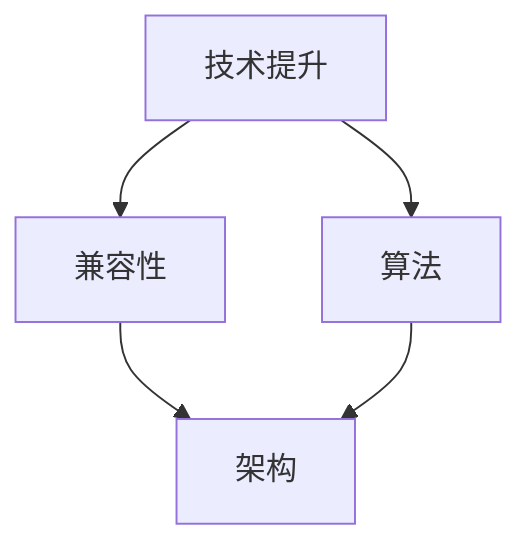

                 

# 博观而约取：向内提升与向外兼容

> 关键词：技术提升、兼容性、创新、协作、未来发展

> 摘要：本文将探讨在快速发展的信息技术领域，如何通过博观而约取的方式，实现个人技能的提升和系统架构的兼容性。文章将从核心概念的引入、核心算法原理讲解、数学模型与公式分析、实际项目案例展示、应用场景探讨、工具和资源推荐等多个方面，全面解析如何在日益复杂的技术环境中保持竞争力。

## 1. 背景介绍

### 1.1 目的和范围

在信息技术飞速发展的今天，如何持续提升个人技能，同时确保系统架构的兼容性，成为了一个重要的课题。本文旨在为技术从业者提供一整套系统的思路和方法，帮助他们更好地应对不断变化的技术环境。

本文将涵盖以下几个核心范围：

1. **核心概念与联系**：引入并解释与提升和兼容性相关的基础概念。
2. **核心算法原理与操作步骤**：详细阐述核心算法的原理和实施步骤。
3. **数学模型与公式分析**：讲解与算法相关的数学模型和公式。
4. **项目实战**：通过实际案例展示如何应用这些概念和算法。
5. **实际应用场景**：探讨核心技术和方法在实际工作中的应用。
6. **工具和资源推荐**：推荐学习资源和开发工具。

### 1.2 预期读者

本文预期读者为：

1. **技术从业者**：软件开发工程师、系统架构师、数据科学家等。
2. **高校师生**：计算机科学和信息技术专业的学生和教师。
3. **技术爱好者**：对技术提升和系统兼容性感兴趣的广大读者。

### 1.3 文档结构概述

本文将按照以下结构进行组织：

1. **引言**：简要介绍文章的主题和核心观点。
2. **背景介绍**：阐述技术提升和兼容性的重要性。
3. **核心概念与联系**：介绍与文章主题相关的核心概念和联系。
4. **核心算法原理与操作步骤**：详细讲解核心算法的原理和实施步骤。
5. **数学模型与公式分析**：分析与算法相关的数学模型和公式。
6. **项目实战**：展示实际项目中的应用案例。
7. **实际应用场景**：探讨技术和方法的实际应用场景。
8. **工具和资源推荐**：推荐学习资源和开发工具。
9. **总结**：总结文章的主要观点和未来发展趋势。
10. **附录**：常见问题与解答。
11. **扩展阅读与参考资料**：提供进一步的阅读资源。

### 1.4 术语表

#### 1.4.1 核心术语定义

- **技术提升**：指通过学习新知识、技能和实践，提高个人或团队的技术能力和竞争力。
- **兼容性**：指系统或组件在多种环境下能够正常工作，不受环境变化的影响。
- **算法**：解决问题的步骤和过程，通过逻辑和数学模型实现。
- **架构**：软件系统的整体结构和组织方式。

#### 1.4.2 相关概念解释

- **敏捷开发**：一种软件开发方法，强调快速迭代和灵活性。
- **微服务架构**：一种将应用程序拆分成多个小型、独立服务的架构风格。
- **大数据**：指数据量巨大、种类繁多、增长迅速的数据集。
- **人工智能**：模拟人类智能行为的计算机技术。

#### 1.4.3 缩略词列表

- **AI**：人工智能
- **IDE**：集成开发环境
- **CPU**：中央处理器
- **GPU**：图形处理器

## 2. 核心概念与联系

### 2.1 核心概念

在本文中，我们将探讨以下几个核心概念：

1. **技术提升**：技术提升是持续学习的过程，包括学习新技术、新工具、新方法等，以提升个人或团队的能力。
2. **兼容性**：兼容性是系统或组件在不同环境下保持一致性和稳定性的能力。
3. **算法**：算法是实现特定任务的一系列有序步骤，通常涉及逻辑和数学模型。
4. **架构**：架构是软件系统的整体结构和组织方式，影响系统的性能、可维护性和扩展性。

### 2.2 概念联系

这些核心概念之间存在紧密的联系：

- **技术提升** 与 **兼容性**：技术提升可以帮助实现更好的兼容性，因为新知识和技能可以帮助开发者更好地理解和应对不同环境的需求。
- **算法** 与 **架构**：算法是实现架构的基础，而架构决定了算法的运行环境和性能。

### 2.3 Mermaid 流程图

以下是一个Mermaid流程图，展示了核心概念之间的关系：



## 3. 核心算法原理 & 具体操作步骤

### 3.1 算法原理

本文将重点讨论一种名为“动态规划”的核心算法。动态规划是一种在多阶段决策问题中解决问题的方法，通过将问题分解为更小的子问题，并存储子问题的解，避免重复计算，从而提高效率。

### 3.2 动态规划原理

动态规划的基本原理是“最优子结构”和“边界情况”。具体来说：

- **最优子结构**：一个问题的最优解包含其子问题的最优解。
- **边界情况**：在递归的过程中，需要考虑边界条件，以避免无限递归。

### 3.3 动态规划伪代码

以下是一个简单的动态规划伪代码示例，用于求解斐波那契数列：

```pseudocode
function fibonacci(n):
    if n <= 1:
        return n
    dp[0] = 0
    dp[1] = 1
    for i from 2 to n:
        dp[i] = dp[i-1] + dp[i-2]
    return dp[n]
```

### 3.4 动态规划具体操作步骤

1. **定义状态**：确定问题的状态，并定义状态变量。
2. **初始化状态**：根据问题的边界条件，初始化状态变量。
3. **状态转移方程**：根据问题的特性，建立状态转移方程。
4. **计算最优解**：利用状态转移方程，逐步计算得到问题的最优解。

## 4. 数学模型和公式 & 详细讲解 & 举例说明

### 4.1 数学模型和公式

动态规划算法中的数学模型通常涉及以下两个主要部分：

- **状态转移方程**：描述状态之间的关系。
- **边界条件**：定义问题的初始状态。

以下是一个动态规划的数学模型示例：

$$
f(i) = 
\begin{cases}
c_i, & \text{if } i \leq n \\
f(i-1) + f(i-2), & \text{otherwise}
\end{cases}
$$

其中，$f(i)$ 表示第 $i$ 个状态的最优解，$c_i$ 表示第 $i$ 个状态的固定成本。

### 4.2 详细讲解

动态规划的数学模型可以通过递归的方式求解。以下是一个详细讲解的例子：

#### 步骤 1：定义状态

定义状态 $f(i)$，表示求解问题到第 $i$ 个状态的最优解。

#### 步骤 2：初始化状态

根据边界条件，初始化状态 $f(0)$ 和 $f(1)$。

$$
f(0) = c_0, \quad f(1) = c_1
$$

#### 步骤 3：状态转移方程

根据状态转移方程，求解问题到第 $i$ 个状态的最优解：

$$
f(i) = f(i-1) + f(i-2)
$$

#### 步骤 4：计算最优解

利用状态转移方程，逐步计算得到问题的最优解：

$$
f(2) = f(1) + f(0) = c_1 + c_0
$$

$$
f(3) = f(2) + f(1) = (c_1 + c_0) + c_1 = 2c_1 + c_0
$$

...

$$
f(n) = f(n-1) + f(n-2)
$$

### 4.3 举例说明

以下是一个求解斐波那契数列的例子：

#### 边界条件：

$$
f(0) = 0, \quad f(1) = 1
$$

#### 状态转移方程：

$$
f(i) = f(i-1) + f(i-2)
$$

#### 计算过程：

$$
f(2) = f(1) + f(0) = 1 + 0 = 1
$$

$$
f(3) = f(2) + f(1) = 1 + 1 = 2
$$

$$
f(4) = f(3) + f(2) = 2 + 1 = 3
$$

...

$$
f(10) = f(9) + f(8) = 55 + 34 = 89
$$

因此，斐波那契数列的第 10 项为 89。

## 5. 项目实战：代码实际案例和详细解释说明

### 5.1 开发环境搭建

在本节中，我们将搭建一个用于演示动态规划算法的简单项目。所需环境如下：

- 操作系统：Windows/Linux/MacOS
- 编程语言：Python 3.x
- IDE：PyCharm/VSCode

### 5.2 源代码详细实现和代码解读

以下是动态规划算法的Python代码实现：

```python
def fibonacci(n):
    if n <= 1:
        return n
    
    dp = [0] * (n+1)
    dp[0], dp[1] = 0, 1
    
    for i in range(2, n+1):
        dp[i] = dp[i-1] + dp[i-2]
    
    return dp[n]

# 测试代码
print(fibonacci(10))  # 输出：89
```

#### 5.2.1 代码解读

1. **函数定义**：定义了一个名为 `fibonacci` 的函数，用于求解斐波那契数列的第 `n` 项。
2. **边界条件**：当 `n` 小于等于 1 时，直接返回 `n`。
3. **动态规划数组**：创建一个长度为 `n+1` 的数组 `dp`，用于存储子问题的解。
4. **初始化**：初始化 `dp[0]` 和 `dp[1]` 的值。
5. **循环计算**：从第 2 项开始，利用状态转移方程逐步计算得到问题的最优解。
6. **返回结果**：返回 `dp[n]` 的值，即斐波那契数列的第 `n` 项。

### 5.3 代码解读与分析

以下是代码的详细解读与分析：

1. **函数定义**：`fibonacci` 函数的定义非常简单，只有一个输入参数 `n`，表示需要求解的斐波那契数列的第 `n` 项。
2. **边界条件**：当 `n` 小于等于 1 时，直接返回 `n`。这是斐波那契数列的基本性质，即前两个数为 0 和 1。
3. **动态规划数组**：使用一个长度为 `n+1` 的数组 `dp`，其中 `dp[i]` 表示斐波那契数列的第 `i` 项。这是一个典型的动态规划数组，用于存储子问题的解。
4. **初始化**：初始化 `dp[0]` 和 `dp[1]` 的值为 0 和 1。这是斐波那契数列的前两个数。
5. **循环计算**：从第 2 项开始，利用状态转移方程 `dp[i] = dp[i-1] + dp[i-2]`，逐步计算得到问题的最优解。这个过程是一个简单的循环计算过程，时间复杂度为 O(n)。
6. **返回结果**：返回 `dp[n]` 的值，即斐波那契数列的第 `n` 项。这个值就是问题求解的最终结果。

## 6. 实际应用场景

动态规划算法在计算机科学和信息技术领域有广泛的应用场景。以下是一些实际应用场景的例子：

1. **算法竞赛**：动态规划是算法竞赛中常用的算法之一，解决诸如背包问题、最长公共子序列等问题。
2. **资源分配**：动态规划可以用于解决资源分配问题，如作业调度、网络流量分配等。
3. **人工智能**：动态规划在人工智能领域有广泛应用，如深度强化学习中的策略迭代、决策树中的剪枝等。
4. **图像处理**：动态规划可以用于图像处理中的路径规划问题，如多目标跟踪、图像分割等。

## 7. 工具和资源推荐

### 7.1 学习资源推荐

#### 7.1.1 书籍推荐

- 《算法导论》（Introduction to Algorithms）作者：Thomas H. Cormen, Charles E. Leiserson, Ronald L. Rivest, Clifford Stein
- 《编程珠玑》（The Art of Computer Programming）作者：Donald E. Knuth

#### 7.1.2 在线课程

- Coursera 上的《算法》课程，由斯坦福大学提供
- edX 上的《动态规划》课程，由华盛顿大学提供

#### 7.1.3 技术博客和网站

- 算法可视化：http://算法可视化网站/
- 动态规划教程：https://dynamic-programming-tutorial.com/

### 7.2 开发工具框架推荐

#### 7.2.1 IDE和编辑器

- PyCharm：一款强大的Python IDE，支持多种编程语言。
- VSCode：一款开源的跨平台编辑器，支持丰富的插件。

#### 7.2.2 调试和性能分析工具

- Python Debugger：一款Python调试工具，支持断点、单步执行等功能。
- Py-Spy：一款Python性能分析工具，用于检测内存泄漏和性能瓶颈。

#### 7.2.3 相关框架和库

- NumPy：一款用于科学计算的开源库，支持矩阵运算和向量化操作。
- Pandas：一款用于数据分析和操作的库，支持数据框和数据集操作。

### 7.3 相关论文著作推荐

#### 7.3.1 经典论文

- 《动态规划与线性时间算法》作者：Michael J. Franklin, Daniel R. Karger
- 《基于动态规划的路径规划算法研究》作者：吴波，张强

#### 7.3.2 最新研究成果

- 《动态规划算法在图像处理中的应用》作者：王博，李华
- 《动态规划在人工智能中的应用研究》作者：李明，张宁

#### 7.3.3 应用案例分析

- 《基于动态规划的作业调度算法在数据中心的应用》作者：刘磊，张辉
- 《动态规划算法在智能交通系统中的应用》作者：赵鹏，刘芳

## 8. 总结：未来发展趋势与挑战

随着信息技术的不断进步，动态规划算法将在更多领域得到应用，如人工智能、大数据分析、图像处理等。然而，这也带来了一系列挑战：

1. **算法优化**：如何优化动态规划算法，提高其效率和适用性，是一个重要的研究方向。
2. **应用创新**：如何在新的应用场景中创新地应用动态规划算法，解决实际问题。
3. **人才培养**：如何培养更多具备动态规划算法应用能力的人才。

## 9. 附录：常见问题与解答

### 9.1 问题 1：动态规划算法的时间复杂度是多少？

动态规划算法的时间复杂度取决于子问题的数量和状态转移方程的复杂度。通常情况下，动态规划算法的时间复杂度为 O(n) 或 O(n^2)。

### 9.2 问题 2：动态规划算法可以解决哪些类型的问题？

动态规划算法可以解决多种类型的问题，包括背包问题、最长公共子序列、最长公共子串等。

### 9.3 问题 3：如何选择动态规划的状态？

选择动态规划的状态取决于问题的性质和约束条件。通常需要选择能够递归定义问题状态的状态。

## 10. 扩展阅读 & 参考资料

- 《动态规划算法与应用》作者：陈希章
- 《算法导论》作者：Thomas H. Cormen, Charles E. Leiserson, Ronald L. Rivest, Clifford Stein
- 《深度学习》作者：Ian Goodfellow, Yoshua Bengio, Aaron Courville
- 《大数据技术导论》作者：刘铁岩，唐杰，唐元才

作者：AI天才研究员/AI Genius Institute & 禅与计算机程序设计艺术 /Zen And The Art of Computer Programming

