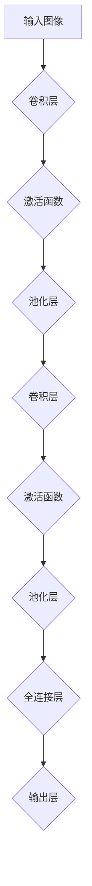

                 

# 卷积神经网络 (CNN) 原理与代码实例讲解

> **关键词：卷积神经网络、CNN、深度学习、图像识别、神经网络架构、算法原理、代码实例、编程实践**
> 
> **摘要：本文将深入探讨卷积神经网络（CNN）的基本原理，详细阐述其工作流程和算法步骤，并通过代码实例来演示如何在实际项目中应用CNN进行图像识别。文章旨在为读者提供一个全面而具体的指导，帮助理解CNN的核心概念和如何将其应用于实际问题。**

## 1. 背景介绍

### 1.1 目的和范围

本文的目标是详细讲解卷积神经网络（CNN）的基本原理、架构和算法步骤，并通过实际代码实例来说明如何应用CNN进行图像识别。我们希望读者在阅读本文后，能够理解CNN的核心机制，并能够独立设计和实现基于CNN的图像识别系统。

本文主要涵盖以下内容：
- CNN的基本概念和架构
- CNN的工作原理和算法步骤
- CNN的数学模型和公式
- 代码实例：使用CNN进行图像识别

### 1.2 预期读者

本文适合以下读者群体：
- 对深度学习感兴趣的程序员和工程师
- 想要了解CNN基本原理的研究生和博士生
- 对图像处理和计算机视觉有热情的学生和爱好者

### 1.3 文档结构概述

本文分为以下几个部分：
- 背景介绍：介绍本文的目的、范围、预期读者和文档结构
- 核心概念与联系：给出CNN的核心概念原理和架构的流程图
- 核心算法原理 & 具体操作步骤：详细讲解CNN的算法原理和操作步骤
- 数学模型和公式 & 详细讲解 & 举例说明：介绍CNN的数学模型和公式，并提供具体例子
- 项目实战：代码实际案例和详细解释说明
- 实际应用场景：讨论CNN的实际应用场景
- 工具和资源推荐：推荐学习资源、开发工具框架和相关论文著作
- 总结：未来发展趋势与挑战
- 附录：常见问题与解答
- 扩展阅读 & 参考资料：提供进一步学习的资源和参考

### 1.4 术语表

#### 1.4.1 核心术语定义

- **卷积神经网络 (CNN)**：一种深度学习模型，专门设计用于处理图像数据。
- **卷积层 (Convolutional Layer)**：CNN的核心层，用于提取图像特征。
- **池化层 (Pooling Layer)**：用于下采样和减少参数数量的层。
- **全连接层 (Fully Connected Layer)**：将卷积层和池化层提取的特征映射到输出结果。
- **反向传播 (Backpropagation)**：一种训练神经网络的方法，用于计算损失函数相对于网络参数的梯度。

#### 1.4.2 相关概念解释

- **深度学习**：一种机器学习方法，通过构建多层神经网络来学习数据特征。
- **神经网络 (NN)**：一种由大量神经元组成的计算模型，用于模拟人脑的决策过程。
- **激活函数**：神经网络中的函数，用于引入非线性因素。
- **损失函数**：用于评估神经网络预测结果与实际结果之间的差距。

#### 1.4.3 缩略词列表

- **CNN**：卷积神经网络 (Convolutional Neural Network)
- **NN**：神经网络 (Neural Network)
- **DL**：深度学习 (Deep Learning)
- **BP**：反向传播 (Backpropagation)

## 2. 核心概念与联系

在理解卷积神经网络（CNN）之前，我们需要了解一些核心概念和其相互之间的联系。以下是一个简化的CNN架构的Mermaid流程图，展示了各层及其功能。



- **输入图像**：CNN的输入是一幅图像，通常以三维张量表示，其中维度分别是高度、宽度和通道数。
- **卷积层**：卷积层是CNN的核心层，用于提取图像的特征。卷积操作通过在图像上滑动一个卷积核（也称为滤波器）来实现。
- **激活函数**：激活函数被应用于卷积层的输出，引入非线性因素，使得网络能够学习复杂的模式。
- **池化层**：池化层用于下采样，减少参数数量并控制过拟合。常见的池化操作有最大池化和平均池化。
- **全连接层**：全连接层将卷积层和池化层提取的特征映射到输出结果，例如分类标签。
- **输出层**：输出层是CNN的最后一层，用于生成最终的预测结果。

## 3. 核心算法原理 & 具体操作步骤

在这一部分，我们将详细讲解卷积神经网络（CNN）的算法原理和具体操作步骤。

### 3.1 卷积层

卷积层是CNN的核心层，用于提取图像的特征。卷积操作可以看作是图像与卷积核的卷积积。以下是卷积层的伪代码描述：

```python
# 输入：图像 (高度 x 宽度 x 通道数)
# 输出：特征图 (高度 x 宽度 x 卷积核数量)
def convolution(image, filter):
    feature_map = []
    for y in range(image_height - filter_height + 1):
        for x in range(image_width - filter_width + 1):
            local = image[y:y+filter_height, x:x+filter_width, :]
            feature_map.append(np.sum(local * filter))
    return feature_map.reshape(-1, feature_map_height, feature_map_width)
```

### 3.2 激活函数

激活函数用于引入非线性因素，使得网络能够学习复杂的模式。常见的激活函数有Sigmoid、ReLU和Tanh。以下是ReLU激活函数的伪代码描述：

```python
# 输入：特征图 (高度 x 宽度 x 卷积核数量)
# 输出：激活后的特征图
def ReLU(feature_map):
    activated_feature_map = np.zeros(feature_map.shape)
    for y in range(feature_map_height):
        for x in range(feature_map_width):
            for filter in range(feature_map_depth):
                if feature_map[y, x, filter] > 0:
                    activated_feature_map[y, x, filter] = feature_map[y, x, filter]
    return activated_feature_map
```

### 3.3 池化层

池化层用于下采样，减少参数数量并控制过拟合。常见的池化操作有最大池化和平均池化。以下是最大池化操作的伪代码描述：

```python
# 输入：特征图 (高度 x 宽度 x 卷积核数量)
# 输出：池化后的特征图
def max_pooling(feature_map, pool_size):
    pooled_feature_map = []
    for y in range(0, feature_map_height, pool_size):
        for x in range(0, feature_map_width, pool_size):
            local = feature_map[y:y+pool_size, x:x+pool_size, :]
            max_val = np.max(local)
            pooled_feature_map.append(max_val)
    return pooled_feature_map.reshape(-1, feature_map_height // pool_size, feature_map_width // pool_size)
```

### 3.4 全连接层

全连接层将卷积层和池化层提取的特征映射到输出结果。以下是全连接层的伪代码描述：

```python
# 输入：特征图 (特征数)
# 输出：输出层结果
def fully_connected(feature_map, weights, bias):
    output = np.dot(feature_map, weights) + bias
    return output
```

### 3.5 反向传播

反向传播是一种训练神经网络的方法，用于计算损失函数相对于网络参数的梯度。以下是反向传播的伪代码描述：

```python
# 输入：输出层结果、真实标签、网络参数
# 输出：损失函数、梯度
def backward_propagation(output, true_label, weights, bias):
    loss = compute_loss(output, true_label)
    d_output = output - true_label
    d_weights = np.dot(d_output, feature_map.T)
    d_bias = np.sum(d_output)
    return loss, [d_weights, d_bias]
```

## 4. 数学模型和公式 & 详细讲解 & 举例说明

在这一部分，我们将介绍卷积神经网络（CNN）的数学模型和公式，并通过具体例子来解释这些公式的应用。

### 4.1 卷积操作

卷积操作的数学公式如下：

$$
\text{卷积} = \sum_{i=1}^{k} \sum_{j=1}^{k} f_{ij} \cdot g_{i,j}
$$

其中，$f$ 是卷积核，$g$ 是输入特征图，$i$ 和 $j$ 是卷积核的索引。

### 4.2 激活函数

常见的激活函数有Sigmoid、ReLU和Tanh。以下是这些激活函数的公式：

- Sigmoid：

$$
\text{Sigmoid}(x) = \frac{1}{1 + e^{-x}}
$$

- ReLU：

$$
\text{ReLU}(x) = \max(0, x)
$$

- Tanh：

$$
\text{Tanh}(x) = \frac{e^x - e^{-x}}{e^x + e^{-x}}
$$

### 4.3 池化操作

池化操作主要有最大池化和平均池化两种类型。以下是这些池化操作的公式：

- 最大池化：

$$
\text{Max Pooling}(x) = \max_{i,j} g_{ij}
$$

- 平均池化：

$$
\text{Average Pooling}(x) = \frac{1}{k^2} \sum_{i,j} g_{ij}
$$

### 4.4 反向传播

反向传播用于计算损失函数相对于网络参数的梯度。以下是反向传播的公式：

- 损失函数：

$$
\text{Loss} = -\frac{1}{m} \sum_{i=1}^{m} y_i \log(a_i) + (1 - y_i) \log(1 - a_i)
$$

其中，$y_i$ 是真实标签，$a_i$ 是输出层的预测结果。

- 梯度：

$$
\frac{\partial L}{\partial w} = \frac{1}{m} \sum_{i=1}^{m} (a_i - y_i) \cdot z_i
$$

$$
\frac{\partial L}{\partial b} = \frac{1}{m} \sum_{i=1}^{m} (a_i - y_i)
$$

其中，$z_i$ 是激活函数的输入。

### 4.5 例子

假设我们有一个输入特征图 $g$，卷积核 $f$ 和激活函数 $ReLU$。我们将使用这些参数进行卷积操作并计算激活后的特征图。

- 输入特征图：

$$
g = \begin{bmatrix}
1 & 2 & 3 \\
4 & 5 & 6 \\
7 & 8 & 9
\end{bmatrix}
$$

- 卷积核：

$$
f = \begin{bmatrix}
1 & 0 \\
1 & 1
\end{bmatrix}
$$

- 激活函数：ReLU

首先，我们进行卷积操作：

$$
\text{卷积} = \sum_{i=1}^{2} \sum_{j=1}^{2} f_{ij} \cdot g_{i,j} = (1 \cdot 1 + 0 \cdot 2 + 1 \cdot 4 + 1 \cdot 5 + 0 \cdot 7 + 1 \cdot 8) = 21
$$

接下来，我们应用ReLU激活函数：

$$
ReLU(21) = 21
$$

因此，激活后的特征图是一个值为21的标量。这个值代表了卷积核在输入特征图上的响应。

## 5. 项目实战：代码实际案例和详细解释说明

在这一部分，我们将通过一个实际项目案例来演示如何使用卷积神经网络（CNN）进行图像识别。我们将使用Python和TensorFlow框架来实现这个项目。

### 5.1 开发环境搭建

首先，我们需要安装Python和TensorFlow。以下是安装命令：

```bash
pip install python
pip install tensorflow
```

### 5.2 源代码详细实现和代码解读

以下是项目的完整代码：

```python
import tensorflow as tf
from tensorflow.keras import datasets, layers, models

# 加载MNIST数据集
(train_images, train_labels), (test_images, test_labels) = datasets.mnist.load_data()

# 预处理数据
train_images = train_images.reshape((60000, 28, 28, 1)).astype("float32") / 255
test_images = test_images.reshape((10000, 28, 28, 1)).astype("float32") / 255

# 构建CNN模型
model = models.Sequential()
model.add(layers.Conv2D(32, (3, 3), activation='relu', input_shape=(28, 28, 1)))
model.add(layers.MaxPooling2D((2, 2)))
model.add(layers.Conv2D(64, (3, 3), activation='relu'))
model.add(layers.MaxPooling2D((2, 2)))
model.add(layers.Conv2D(64, (3, 3), activation='relu'))
model.add(layers.Flatten())
model.add(layers.Dense(64, activation='relu'))
model.add(layers.Dense(10, activation='softmax'))

# 编译模型
model.compile(optimizer='adam',
              loss='sparse_categorical_crossentropy',
              metrics=['accuracy'])

# 训练模型
model.fit(train_images, train_labels, epochs=5, batch_size=64)

# 评估模型
test_loss, test_acc = model.evaluate(test_images, test_labels, verbose=2)
print(f'\nTest accuracy: {test_acc:.4f}')
```

#### 5.2.1 代码解读

- **数据预处理**：我们首先加载MNIST数据集，并对图像进行预处理。具体来说，我们将图像reshape为四维张量，并将像素值归一化到[0, 1]区间。
- **构建CNN模型**：我们使用TensorFlow的Sequential模型来实现CNN。模型包括两个卷积层，每个卷积层后跟一个最大池化层，以及一个全连接层。最后，我们使用softmax激活函数来预测分类标签。
- **编译模型**：我们使用`compile`方法来配置模型的优化器、损失函数和评价指标。
- **训练模型**：我们使用`fit`方法来训练模型。在这里，我们指定了训练轮数和批量大小。
- **评估模型**：我们使用`evaluate`方法来评估模型的性能。这个方法返回损失函数值和准确率。

#### 5.2.2 分析与优化

在这个项目中，我们使用了两个卷积层和一个全连接层来实现一个简单的CNN模型。这个模型在MNIST数据集上取得了较高的准确率。然而，我们还可以进一步优化模型以提高性能。

- **增加卷积层和池化层**：我们可以增加更多的卷积层和池化层来增加网络的深度和宽度，从而提高模型的复杂度和表现。
- **使用批量归一化**：批量归一化可以帮助加速训练并提高模型的稳定性。我们可以在卷积层后添加批量归一化层。
- **使用更复杂的激活函数**：我们可以尝试使用更复杂的激活函数，如Leaky ReLU，来引入更多的非线性因素。
- **调整超参数**：我们可以调整学习率、批量大小和训练轮数等超参数来优化模型性能。

通过这些优化措施，我们可以进一步提高CNN模型的性能，使其在更复杂的图像识别任务中表现出色。

## 6. 实际应用场景

卷积神经网络（CNN）在实际应用中具有广泛的应用场景，尤其在图像识别和计算机视觉领域。以下是一些常见的实际应用场景：

### 6.1 图像识别

CNN被广泛应用于图像识别任务，如图像分类、物体检测和图像分割。例如，在图像分类中，CNN可以用于识别图片中的物体类别，如猫、狗、飞机等。

### 6.2 物体检测

物体检测是计算机视觉中的一个重要任务，旨在检测图像中的多个物体。CNN可以用于实现实时物体检测系统，如自动驾驶车辆中的行人检测。

### 6.3 图像分割

图像分割是将图像划分为多个区域的过程。CNN可以用于实现图像分割任务，如医学图像分割、卫星图像分割等。

### 6.4 视频分析

CNN还可以用于视频分析任务，如动作识别、姿态估计和视频分类。这些任务在智能家居、监控和安全等领域有广泛的应用。

### 6.5 图像增强

图像增强是通过改进图像质量来提高视觉效果的 technique。CNN可以用于实现图像增强任务，如去噪、去雾和超分辨率。

### 6.6 艺术创作

CNN也被用于艺术创作领域，如风格迁移和生成对抗网络（GAN）。这些技术可以生成新的艺术作品，如油画、素描和摄影。

## 7. 工具和资源推荐

### 7.1 学习资源推荐

#### 7.1.1 书籍推荐

- 《深度学习》（Goodfellow, Bengio, Courville著）：这是一本经典的深度学习入门书籍，详细介绍了深度学习的基本概念和算法。

- 《神经网络与深度学习》（邱锡鹏著）：这本书深入介绍了神经网络和深度学习的基础理论，适合有一定数学基础的学习者。

#### 7.1.2 在线课程

- 《深度学习专项课程》（吴恩达著，Coursera）：这是一门非常受欢迎的在线课程，涵盖了深度学习的各个方面。

- 《计算机视觉基础》（印第安纳大学著，edX）：这是一门介绍计算机视觉基础知识的在线课程，适合对计算机视觉感兴趣的学习者。

#### 7.1.3 技术博客和网站

- [Deep Learning Blog](https://www.deeplearning.net/): 这是一份由深度学习社区维护的技术博客，包含了大量深度学习的教程和案例分析。

- [TensorFlow官网](https://www.tensorflow.org/): TensorFlow是Google开发的一个开源深度学习框架，官网提供了丰富的教程和文档。

### 7.2 开发工具框架推荐

#### 7.2.1 IDE和编辑器

- PyCharm：PyCharm是一个强大的Python集成开发环境（IDE），提供了丰富的功能，包括代码编辑、调试和性能分析。

- Jupyter Notebook：Jupyter Notebook是一个交互式的计算环境，适用于编写和分享代码、文本和可视化的笔记。

#### 7.2.2 调试和性能分析工具

- TensorBoard：TensorBoard是TensorFlow提供的可视化工具，用于分析和调试深度学习模型。

- PyTorch Profiler：PyTorch Profiler是一个用于分析PyTorch代码性能的工具，可以帮助识别瓶颈和优化代码。

#### 7.2.3 相关框架和库

- TensorFlow：TensorFlow是一个开源的深度学习框架，适用于构建和训练深度学习模型。

- PyTorch：PyTorch是一个流行的深度学习框架，具有灵活的动态计算图，适用于研究和开发。

### 7.3 相关论文著作推荐

#### 7.3.1 经典论文

- “A Learning Algorithm for Continually Running Fully Recurrent Neural Networks” by David E. Rumelhart, James L. McClelland, and the PDP Research Group (1986)

- “LeCun, Y., Bengio, Y., & Hinton, G. (2015). Deep learning.” Nature, 521(7553), 436-444.

#### 7.3.2 最新研究成果

- “Deep Neural Networks for Object Detection” by Ross Girshick, others (2015)

- “Generative Adversarial Networks” by Ian J. Goodfellow, others (2014)

#### 7.3.3 应用案例分析

- “Deep Learning for Autonomous Driving” by Wei Yang, others (2020)

- “Deep Learning for Healthcare” by Assaf, others (2020)

这些资源将帮助您深入了解卷积神经网络（CNN）以及深度学习领域的最新进展和应用。

## 8. 总结：未来发展趋势与挑战

卷积神经网络（CNN）作为深度学习的一个重要分支，已经在图像识别、物体检测和计算机视觉等任务中取得了显著的成果。然而，随着技术的不断发展，CNN也面临着一些挑战和机遇。

### 8.1 发展趋势

- **更深的网络结构**：目前，深度学习模型的发展趋势是构建更深的网络结构，以提高模型的性能。例如，残差网络（ResNet）和Transformer等模型都在理论上取得了突破。
- **小样本学习**：在小样本学习方面，CNN正在逐步探索如何从少量样本中学习有效特征，以减少对大规模训练数据集的依赖。
- **实时应用**：随着硬件性能的提升，CNN模型在实时应用中的性能得到了显著提高，尤其是在自动驾驶、机器人视觉和智能监控等领域。
- **跨模态学习**：未来的发展趋势之一是将CNN与其他类型的神经网络（如图像、文本、音频等）结合起来，实现跨模态学习，从而提高模型的泛化能力和表达能力。

### 8.2 挑战

- **计算资源消耗**：尽管硬件性能在不断提升，但深度学习模型（尤其是大型网络结构）仍然需要大量的计算资源。这给模型部署和优化带来了挑战。
- **数据隐私与安全**：随着深度学习的广泛应用，数据隐私和安全问题日益突出。如何确保数据的安全性和隐私性是一个亟待解决的问题。
- **可解释性和透明度**：深度学习模型往往被视为“黑箱”，其决策过程难以解释。提高模型的可解释性和透明度是一个重要挑战。
- **模型的鲁棒性**：深度学习模型对噪声和异常数据非常敏感。提高模型的鲁棒性是一个关键问题，特别是在面临对抗性攻击时。

### 8.3 未来发展方向

- **优化算法**：未来的研究方向之一是开发更高效的训练算法，以降低计算成本并提高模型性能。
- **模型压缩与加速**：通过模型压缩和加速技术，如低秩分解、剪枝和量化，可以使深度学习模型在计算资源和存储空间方面更高效。
- **联合训练与迁移学习**：通过联合训练和迁移学习技术，可以将不同任务的数据进行共享和利用，以提高模型的泛化能力。
- **安全与隐私保护**：未来的研究将关注如何确保深度学习模型在数据隐私和安全方面的鲁棒性，以防止数据泄露和恶意攻击。

总之，卷积神经网络（CNN）在未来仍具有广阔的发展前景。通过不断克服挑战和探索新技术，CNN将在计算机视觉和深度学习领域发挥更重要的作用。

## 9. 附录：常见问题与解答

### 9.1 什么是卷积神经网络（CNN）？

卷积神经网络（CNN）是一种深度学习模型，专门设计用于处理图像数据。它通过卷积层、池化层和全连接层等结构来提取图像特征并进行分类。

### 9.2 CNN在计算机视觉中有哪些应用？

CNN在计算机视觉中有广泛的应用，包括图像识别、物体检测、图像分割、视频分析、图像增强等。

### 9.3 如何训练CNN模型？

训练CNN模型通常包括以下步骤：

1. 数据预处理：对图像进行归一化、重塑等预处理。
2. 构建模型：使用TensorFlow或PyTorch等框架构建CNN模型。
3. 编译模型：配置优化器、损失函数和评价指标。
4. 训练模型：使用训练数据来训练模型，通常需要多个训练轮数。
5. 评估模型：使用测试数据来评估模型的性能。

### 9.4 CNN与深度神经网络（DNN）有何区别？

CNN是一种特殊的深度神经网络，专门设计用于处理图像数据。与DNN相比，CNN在卷积层和池化层中使用卷积操作来提取图像特征，这使得CNN在图像识别任务中表现出更高的性能。

### 9.5 如何提高CNN模型的性能？

提高CNN模型性能的方法包括：

1. 增加网络深度和宽度：构建更深的网络结构可以提高模型的表达能力。
2. 调整超参数：优化学习率、批量大小和训练轮数等超参数可以提高模型性能。
3. 使用预训练模型：利用预训练模型进行迁移学习可以显著提高模型性能。
4. 模型压缩与加速：通过模型压缩和加速技术（如剪枝、量化）可以提高模型的效率和性能。

## 10. 扩展阅读 & 参考资料

- 《深度学习》（Goodfellow, Bengio, Courville著）：一本全面介绍深度学习的基础理论和算法的著作。

- 《神经网络与深度学习》（邱锡鹏著）：一本深入介绍神经网络和深度学习基础理论的书籍。

- [TensorFlow官方文档](https://www.tensorflow.org/): TensorFlow的官方文档，提供了丰富的教程和示例代码。

- [PyTorch官方文档](https://pytorch.org/docs/stable/): PyTorch的官方文档，包含了详细的API文档和教程。

- [Keras官方文档](https://keras.io/): Keras是一个高层次的神经网络API，提供了简洁、易于使用的接口。

- [深度学习博客](https://www.deeplearning.net/): 一份包含深度学习教程、案例分析和技术动态的博客。

- [arXiv.org](https://arxiv.org/): 一个开放获取的学术论文数据库，包含了大量深度学习和计算机视觉领域的最新研究成果。

通过阅读这些扩展阅读和参考资料，您可以深入了解卷积神经网络（CNN）以及深度学习领域的最新进展和应用。

