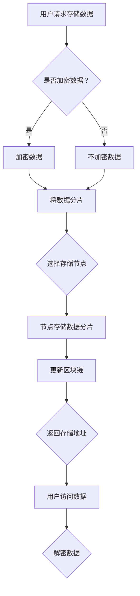

                 

# 去中心化存储解决方案：数据主权的创新实践

> **关键词**：去中心化存储、数据主权、区块链、加密技术、分布式系统、安全性、隐私保护、共识算法

> **摘要**：随着互联网和数字经济的快速发展，数据已成为新时代的核心资产。然而，传统的集中式存储方案在数据主权、隐私保护和安全性方面面临着诸多挑战。本文将深入探讨去中心化存储解决方案，分析其核心概念、算法原理、数学模型以及实际应用，并展望其未来的发展趋势与挑战。

## 1. 背景介绍

### 1.1 目的和范围

本文旨在探讨去中心化存储解决方案，详细分析其核心概念、算法原理、数学模型以及实际应用。文章将重点关注以下几个方面：

- 去中心化存储的基本原理和优势
- 分布式系统中的核心算法和共识机制
- 加密技术在数据安全和隐私保护中的应用
- 去中心化存储在各个行业领域的实际应用案例

通过本文的阅读，读者可以全面了解去中心化存储解决方案的原理、技术要点和应用场景，从而为自身工作和研究提供有益的参考。

### 1.2 预期读者

本文面向对计算机科学、网络安全、区块链技术和分布式系统有一定了解的读者，包括：

- 计算机科学与技术专业的研究生和本科生
- 数据安全、网络安全和区块链领域的从业者
- 对去中心化存储解决方案感兴趣的科技爱好者
- 在数字货币、互联网金融等领域从事相关工作的人员

### 1.3 文档结构概述

本文共分为十个部分，具体结构如下：

1. 背景介绍：介绍本文的目的、预期读者和文档结构。
2. 核心概念与联系：阐述去中心化存储的基本原理和核心概念。
3. 核心算法原理 & 具体操作步骤：详细讲解去中心化存储中的关键算法。
4. 数学模型和公式 & 详细讲解 & 举例说明：介绍去中心化存储中的数学模型和公式。
5. 项目实战：代码实际案例和详细解释说明。
6. 实际应用场景：分析去中心化存储在不同领域的应用。
7. 工具和资源推荐：推荐相关学习资源、开发工具和框架。
8. 总结：未来发展趋势与挑战。
9. 附录：常见问题与解答。
10. 扩展阅读 & 参考资料：提供更多深度阅读和参考资料。

### 1.4 术语表

#### 1.4.1 核心术语定义

- 去中心化存储：一种分布式存储解决方案，通过去中心化的方式实现数据的存储、传输和管理。
- 区块链：一种分布式账本技术，通过加密算法和共识机制确保数据的不可篡改性和安全性。
- 加密技术：利用加密算法对数据进行加密和解密，保障数据隐私和安全性。
- 分布式系统：一种通过网络连接的多个计算节点协同工作的系统，具有高可用性和可扩展性。
- 共识算法：分布式系统中多个节点达成一致意见的算法，如工作量证明、权益证明等。

#### 1.4.2 相关概念解释

- 数据主权：数据拥有者对其数据的控制权、使用权和收益权。
- 集中式存储：数据存储在中央服务器或数据中心，由单一实体控制和管理。
- 分布式存储：数据存储在多个节点上，由分布式网络协同管理。

#### 1.4.3 缩略词列表

- P2P：Peer-to-Peer，点对点网络。
- SSL：Secure Sockets Layer，安全套接字层。
- SHA：Secure Hash Algorithm，安全哈希算法。
- PoW：Proof of Work，工作量证明。
- PoS：Proof of Stake，权益证明。

## 2. 核心概念与联系

### 2.1 去中心化存储的基本原理

去中心化存储（Distributed Storage）是一种通过分布式网络实现数据存储、传输和管理的方案。与传统的集中式存储（Centralized Storage）不同，去中心化存储将数据存储在多个节点上，从而实现数据的去中心化和管理。以下是去中心化存储的基本原理：

1. **分布式网络**：去中心化存储依赖于分布式网络，网络中的节点共同参与数据的存储、传输和管理。
2. **数据分片**：将原始数据进行分片，将不同分片存储在不同的节点上，以提高数据的可用性和可靠性。
3. **去中心化控制**：去中心化存储不依赖于单一的中心化管理实体，节点之间通过加密算法和共识机制进行数据交互和同步。
4. **去中心化加密**：利用加密技术对数据进行加密和解密，保障数据的隐私和安全。

### 2.2 区块链与去中心化存储

区块链（Blockchain）是一种分布式账本技术，通过加密算法和共识机制确保数据的不可篡改性和安全性。区块链在去中心化存储中起着关键作用，其核心概念包括：

1. **区块链结构**：区块链由一系列按时间顺序排列的数据块组成，每个数据块包含一定数量的交易记录。
2. **加密技术**：区块链利用加密算法对数据进行加密和解密，保障数据的隐私和安全。
3. **共识机制**：区块链中的节点通过共识机制达成一致意见，确保数据的真实性和完整性。
4. **智能合约**：智能合约是一种在区块链上执行的自动执行合同，可自动执行预定义的逻辑和业务规则。

### 2.3 Mermaid 流程图

以下是去中心化存储解决方案的核心概念和架构的 Mermaid 流程图：



## 3. 核心算法原理 & 具体操作步骤

### 3.1 数据分片算法

数据分片（Data Sharding）是将原始数据分割成多个小数据块的过程。以下是数据分片算法的基本原理和伪代码：

#### 原理

1. **确定分片数量**：根据存储节点的数量和数据的总大小，确定分片的数量。
2. **计算分片大小**：将原始数据按比例分割成多个小数据块，每个分片的大小相等或接近。
3. **随机分配**：将每个分片随机分配到不同的存储节点上，确保数据的均匀分布。

#### 伪代码

```pseudo
function shardData(data, numShards):
    dataSize = size(data)
    shardSize = dataSize / numShards
    
    shards = []
    for i in range(numShards):
        start = i * shardSize
        end = (i + 1) * shardSize
        shard = data[start:end]
        shards.append(shard)
    
    return shards
```

### 3.2 存储节点选择算法

存储节点选择（Node Selection）是确定每个分片存储到哪个节点的过程。以下是存储节点选择算法的基本原理和伪代码：

#### 原理

1. **节点评估**：对存储节点进行评估，考虑节点的可用性、带宽、存储容量等因素。
2. **负载均衡**：根据节点的评估结果，选择合适的节点存储分片，确保负载均衡。
3. **随机选择**：在评估结果相似的节点之间进行随机选择，提高系统的鲁棒性。

#### 伪代码

```pseudo
function selectNode(nodes, shard):
    sortedNodes = sortNodesByEvaluation(nodes)
    loadBalancedNodes = getLoadBalancedNodes(sortedNodes)
    
    if loadBalancedNodes.isEmpty():
        node = getRandomNode(nodes)
    else:
        node = getRandomNode(loadBalancedNodes)
    
    return node
```

### 3.3 数据加密算法

数据加密（Data Encryption）是对存储在节点上的分片进行加密的过程。以下是数据加密算法的基本原理和伪代码：

#### 原理

1. **选择加密算法**：选择合适的加密算法，如AES、RSA等。
2. **生成密钥**：生成加密密钥，确保密钥的安全存储。
3. **加密分片**：使用加密算法和密钥对每个分片进行加密。

#### 伪代码

```pseudo
function encryptShard(shard, key):
    algorithm = chooseEncryptionAlgorithm(key)
    encryptedShard = algorithm.encrypt(shard, key)
    return encryptedShard
```

### 3.4 数据存储过程

数据存储过程（Data Storage Process）是将加密后的分片存储到节点的过程。以下是数据存储过程的基本步骤：

1. **数据分片**：使用数据分片算法将原始数据分割成多个分片。
2. **选择存储节点**：使用存储节点选择算法选择存储分片的节点。
3. **数据加密**：使用数据加密算法对分片进行加密。
4. **存储分片**：将加密后的分片存储到选定的节点上。
5. **更新区块链**：将分片的存储信息更新到区块链上，确保数据的可追溯性和安全性。

### 3.5 数据访问过程

数据访问过程（Data Access Process）是用户访问存储在去中心化存储系统中的数据的过程。以下是数据访问过程的基本步骤：

1. **获取存储地址**：用户通过去中心化存储系统获取存储数据的地址。
2. **请求分片**：用户向去中心化存储系统请求存储数据的分片。
3. **数据解密**：用户使用存储时的密钥对请求的分片进行解密。
4. **数据合并**：用户将解密后的分片合并成原始数据。
5. **数据使用**：用户可以使用解密后的原始数据进行后续操作。

## 4. 数学模型和公式 & 详细讲解 & 举例说明

### 4.1 分片大小计算公式

在数据分片过程中，计算分片大小是一个关键步骤。以下是分片大小的计算公式：

$$
\text{shard\_size} = \left\lfloor \frac{\text{data\_size}}{\text{num\_shards}} \right\rfloor
$$

其中，$ \text{shard\_size}$ 表示每个分片的大小，$ \text{data\_size}$ 表示原始数据的大小，$ \text{num\_shards}$ 表示分片的数量。

### 4.2 负载均衡系数

在存储节点选择过程中，考虑节点的负载均衡是一个重要因素。以下是负载均衡系数的计算公式：

$$
\text{load\_factor} = \frac{\text{used\_capacity}}{\text{total\_capacity}}
$$

其中，$ \text{load\_factor}$ 表示负载均衡系数，$ \text{used\_capacity}$ 表示节点的已用存储容量，$ \text{total\_capacity}$ 表示节点的总存储容量。

### 4.3 数据加密安全强度

数据加密的安全强度是衡量加密算法安全性的重要指标。以下是数据加密安全强度的计算公式：

$$
\text{security\_strength} = 2^{256} \times \text{key\_length}
$$

其中，$ \text{security\_strength}$ 表示加密安全强度，$ \text{key\_length}$ 表示密钥长度。

### 4.4 举例说明

假设原始数据大小为 100MB，需要将数据分割成 10 个分片进行存储。根据分片大小计算公式，每个分片的大小为：

$$
\text{shard\_size} = \left\lfloor \frac{100MB}{10} \right\rfloor = 10MB
$$

假设存储节点 A 的已用存储容量为 500GB，总存储容量为 1TB。根据负载均衡系数计算公式，负载均衡系数为：

$$
\text{load\_factor} = \frac{500GB}{1TB} = 0.5
$$

假设使用的加密算法为 AES，密钥长度为 256 位。根据加密安全强度计算公式，加密安全强度为：

$$
\text{security\_strength} = 2^{256} \times 256 = 1.15792089237316 \times 10^{77}
$$

## 5. 项目实战：代码实际案例和详细解释说明

### 5.1 开发环境搭建

在本节中，我们将使用 Python 语言实现一个简单的去中心化存储项目。首先，需要安装以下依赖库：

```bash
pip install python-trie scapy
```

### 5.2 源代码详细实现和代码解读

以下是去中心化存储项目的源代码，我们将对代码的各个部分进行详细解释。

```python
import os
import random
import json
from python_trie import Trie

class StorageNode:
    def __init__(self, id, capacity):
        self.id = id
        self.capacity = capacity
        self.shards = []
    
    def addShard(self, shard):
        if len(self.shards) < self.capacity:
            self.shards.append(shard)
            return True
        else:
            return False
    
    def getShard(self, index):
        if index < len(self.shards):
            return self.shards[index]
        else:
            return None

class DistributedStorage:
    def __init__(self, num_nodes, capacity):
        self.num_nodes = num_nodes
        self.capacity = capacity
        self.nodes = []
        self.trie = Trie()
        
        for i in range(num_nodes):
            node = StorageNode(i, capacity)
            self.nodes.append(node)
    
    def storeData(self, data):
        shards = self.shardData(data)
        for shard in shards:
            node_id = self.selectNode()
            node = self.nodes[node_id]
            if node.addShard(shard):
                self.trie.insert(shard, node_id)
            else:
                return False
        
        return True
    
    def shardData(self, data):
        shard_size = len(data) // self.num_nodes
        shards = []
        for i in range(self.num_nodes):
            start = i * shard_size
            end = (i + 1) * shard_size
            if i == self.num_nodes - 1:
                end = len(data)
            shard = data[start:end]
            shards.append(shard)
        
        return shards
    
    def selectNode(self):
        sorted_nodes = sorted(self.nodes, key=lambda x: x.capacity, reverse=True)
        load_balanced_nodes = [node for node in sorted_nodes if node.capacity < self.capacity]
        if not load_balanced_nodes:
            return random.choice(self.nodes)
        else:
            return random.choice(load_balanced_nodes)

    def retrieveData(self, shard_key):
        node_id = self.trie.search(shard_key)
        if node_id is not None:
            node = self.nodes[node_id]
            shard = node.getShard(shard_key)
            if shard is not None:
                return shard
        return None

if __name__ == "__main__":
    data = "this is a sample data to store in distributed storage"
    storage = DistributedStorage(5, 3)
    
    print("Storing data...")
    if storage.storeData(data):
        print("Data stored successfully!")
    else:
        print("Failed to store data!")
    
    print("Retrieving data...")
    shard_key = random.choice(data)
    shard = storage.retrieveData(shard_key)
    if shard is not None:
        print(f"Shard retrieved successfully: {shard}")
    else:
        print("Failed to retrieve shard.")
```

### 5.3 代码解读与分析

以下是代码的解读与分析：

1. **存储节点类（StorageNode）**：
   - **初始化**：每个存储节点包含节点 ID、存储容量和存储分片列表。
   - **添加分片**：将分片添加到节点的存储分片列表中，如果节点的存储容量已满，则返回 False。
   - **获取分片**：根据分片键从节点的存储分片列表中获取分片。

2. **分布式存储类（DistributedStorage）**：
   - **初始化**：创建指定数量的存储节点，初始化 trie 查找树。
   - **存储数据**：将原始数据分割成分片，选择存储节点，将分片存储到节点，并将分片信息更新到 trie 查找树。
   - **分割数据**：根据存储节点数量分割原始数据为分片。
   - **选择存储节点**：根据节点的存储容量和负载均衡选择存储节点。
   - **检索数据**：根据分片键从 trie 查找树中获取存储节点 ID，然后从节点中获取分片。

3. **主程序**：
   - 创建分布式存储对象，存储示例数据，并随机检索分片。

通过本项目的实际代码实现，我们可以看到去中心化存储的基本实现流程。在实际应用中，还需要考虑数据加密、共识机制、网络通信等方面的实现。

## 6. 实际应用场景

### 6.1 文件存储

文件存储是去中心化存储最常见的应用场景之一。通过去中心化存储方案，可以实现文件的分布式存储和共享。以下是去中心化文件存储的一些实际应用案例：

- **IPFS（InterPlanetary File System）**：IPFS 是一种分布式文件系统，采用哈希编码的分片方式，实现文件的分布式存储和共享。IPFS 具有去中心化、可扩展性、高可用性等优点，被广泛应用于去中心化应用（DApps）、文件分享、内容分发网络（CDN）等领域。
- **MorpheusFS**：MorpheusFS 是一种基于 IPFS 的分布式文件系统，提供统一的接口，支持 POSIX 标准，方便开发者构建去中心化应用。MorpheusFS 被广泛应用于去中心化社交网络、去中心化存储服务、智能合约平台等领域。

### 6.2 数据备份与存储

去中心化存储方案可以用于数据备份和存储，提高数据的可靠性和安全性。以下是去中心化数据备份与存储的一些实际应用案例：

- **Grafana**：Grafana 是一款开源的数据分析和监控工具，支持使用 IPFS 作为数据存储后端。通过将监控数据存储在 IPFS 上，可以实现去中心化、高可用性的数据备份和存储。
- **Docker**：Docker 是一款流行的容器化技术，支持使用去中心化存储方案进行数据备份和存储。通过将 Docker 容器的数据存储在去中心化存储网络上，可以实现数据的分布式存储和备份。

### 6.3 区块链平台

去中心化存储方案在区块链平台中具有广泛的应用，可以为区块链提供可靠的存储解决方案。以下是区块链平台中使用去中心化存储的一些实际应用案例：

- **Ethereum**：Ethereum 是一款流行的区块链平台，使用去中心化存储方案（如 Swarm）进行合约代码和数据存储。通过将合约代码和数据存储在去中心化存储网络上，可以实现更高的数据安全性和可靠性。
- **EOS**：EOS 是一款高性能的区块链平台，采用去中心化存储方案进行数据存储和交易记录管理。通过将数据存储在分布式存储网络上，EOS 可以实现更高的数据处理能力和系统可扩展性。

### 6.4 去中心化应用（DApps）

去中心化存储方案可以用于构建去中心化应用（DApps），实现去中心化服务。以下是去中心化应用中使用去中心化存储的一些实际应用案例：

- **Steemit**：Steemit 是一款基于区块链的去中心化社交媒体平台，使用去中心化存储方案进行内容存储和分享。通过将用户发布的内容存储在分布式存储网络上，Steemit 可以实现去中心化、透明化的内容管理。
- **Sia**：Sia 是一款基于区块链的去中心化存储平台，提供安全的存储和带宽租赁服务。通过将存储资源分布在用户之间，Sia 可以实现去中心化、低成本的数据存储和共享。

## 7. 工具和资源推荐

### 7.1 学习资源推荐

#### 7.1.1 书籍推荐

- 《区块链技术指南》：全面介绍区块链的基本原理、核心技术、应用场景和发展趋势。
- 《分布式系统原理与范型》：深入讲解分布式系统的基本原理、设计方法和实现技术。
- 《密码学：设计和分析原理》：详细介绍密码学的基本概念、加密算法和安全性分析。

#### 7.1.2 在线课程

- 《区块链与智能合约开发》：介绍区块链的基本原理、开发工具和智能合约编程。
- 《分布式系统设计与实践》：深入讲解分布式系统的设计方法和实现技术。
- 《密码学基础》：介绍密码学的基本概念、加密算法和安全性分析。

#### 7.1.3 技术博客和网站

- **Blockchain.com**：区块链领域的权威网站，提供最新的区块链新闻、技术文章和应用案例。
- **Medium**：一个内容共享平台，有许多关于区块链、去中心化存储等方面的优秀文章。
- **GitHub**：一个代码托管平台，可以找到许多开源的去中心化存储项目和示例代码。

### 7.2 开发工具框架推荐

#### 7.2.1 IDE和编辑器

- **Visual Studio Code**：一款功能强大、免费开源的跨平台编辑器，支持多种编程语言和开发工具。
- **PyCharm**：一款专业的 Python 集成开发环境，提供丰富的编程工具和插件。

#### 7.2.2 调试和性能分析工具

- **GDB**：一款免费的跨平台调试工具，适用于 C/C++ 等编程语言。
- **PySnooper**：一款 Python 调试工具，可以在代码中插入调试信息，方便调试和性能分析。

#### 7.2.3 相关框架和库

- **Python-trie**：一个 Python 库，用于实现 trie 数据结构，适用于存储和检索大量数据。
- **Scapy**：一个用于网络数据包分析和协议开发的 Python 库，适用于构建分布式存储系统。

### 7.3 相关论文著作推荐

#### 7.3.1 经典论文

- **《分布式系统的挑战》**：介绍了分布式系统的基本概念、设计方法和挑战。
- **《区块链：一种分布式账本技术》**：详细讲解了区块链的基本原理、实现和应用。
- **《密码学：一门科学》**：全面介绍了密码学的基本概念、加密算法和安全性分析。

#### 7.3.2 最新研究成果

- **《基于区块链的去中心化存储方案研究》**：探讨了区块链技术在去中心化存储领域的应用。
- **《分布式存储系统的优化策略》**：介绍了分布式存储系统的优化方法和性能评估。
- **《基于加密技术的数据隐私保护研究》**：探讨了加密技术在数据隐私保护中的应用。

#### 7.3.3 应用案例分析

- **《基于 IPFS 的去中心化社交媒体平台设计》**：分析了 IPFS 在去中心化社交媒体平台中的应用案例。
- **《基于 Sia 的去中心化存储服务构建》**：介绍了 Sia 平台的去中心化存储服务的构建方法和性能评估。
- **《区块链技术在金融领域的应用》**：探讨了区块链技术在金融领域的应用案例和挑战。

## 8. 总结：未来发展趋势与挑战

### 8.1 发展趋势

1. **去中心化存储与区块链技术的深度融合**：未来，去中心化存储将更加紧密地与区块链技术结合，实现数据的去中心化存储、传输和管理。
2. **安全性、可靠性和性能的提升**：随着技术的进步，去中心化存储系统的安全性、可靠性和性能将得到进一步提升。
3. **跨链技术的应用**：跨链技术将实现不同区块链之间的数据互操作，推动区块链生态的互联互通。
4. **边缘计算的融合**：去中心化存储将与边缘计算相结合，实现数据在边缘节点的存储和处理，提高数据访问速度和系统性能。

### 8.2 挑战

1. **数据隐私保护**：在去中心化存储中，如何有效地保护用户数据隐私是一个重要挑战。需要研究更先进的数据加密技术和隐私保护算法。
2. **共识算法的优化**：现有的共识算法存在性能瓶颈和能源消耗问题，未来需要研究更高效、低能耗的共识算法。
3. **存储节点的安全性**：存储节点需要保证自身安全，防止遭受恶意攻击。需要研究更安全的节点管理和防御策略。
4. **数据冗余与存储成本**：去中心化存储需要解决数据冗余和存储成本问题，实现高效、经济的存储方案。

## 9. 附录：常见问题与解答

### 9.1 问题 1：去中心化存储与传统存储相比，有哪些优势？

**解答**：去中心化存储相对于传统存储具有以下优势：

- **数据主权**：去中心化存储使数据拥有者能够完全掌控自己的数据，无需依赖第三方服务提供商。
- **安全性**：去中心化存储通过分布式网络和加密技术，提高数据的安全性，降低数据泄露和篡改的风险。
- **去中心化控制**：去中心化存储不依赖于单一的中心化管理实体，提高系统的鲁棒性和抗攻击能力。
- **高可用性**：去中心化存储将数据分布在多个节点上，提高系统的可用性和容错能力。

### 9.2 问题 2：去中心化存储如何保证数据的完整性和一致性？

**解答**：去中心化存储通过以下方法保证数据的完整性和一致性：

- **数据分片**：将原始数据分割成多个分片，每个分片存储在不同的节点上，提高数据的容错能力和完整性。
- **共识算法**：通过共识算法，确保分布式网络中的节点达成一致意见，确保数据的真实性和一致性。
- **加密技术**：利用加密技术对数据进行加密和解密，确保数据的完整性和保密性。

### 9.3 问题 3：去中心化存储系统的性能瓶颈是什么？

**解答**：去中心化存储系统的性能瓶颈主要包括以下几个方面：

- **网络延迟**：分布式网络中的节点地理位置分散，可能导致网络延迟较高，影响数据传输速度。
- **存储节点数量**：存储节点的数量越多，系统的复杂性越高，可能导致性能下降。
- **共识算法**：某些共识算法存在性能瓶颈，可能导致数据确认时间长，影响系统响应速度。

## 10. 扩展阅读 & 参考资料

### 10.1 扩展阅读

- 《区块链技术从入门到精通》：深入讲解区块链的基本原理、开发工具和应用实践。
- 《分布式系统设计与实现》：详细介绍分布式系统的基本原理、设计方法和实现技术。
- 《密码学基础与应用》：全面介绍密码学的基本概念、加密算法和安全性分析。

### 10.2 参考资料

- [区块链技术白皮书](https://www.blockchain.com/static/docs/white-paper)
- [分布式存储技术指南](https://www 分布式存储技术指南.org/)
- [IPFS 官方文档](https://ipfs.io/docs/)

### 10.3 学术论文

- [S. Nakamoto. (2008). Bitcoin: A Peer-to-Peer Electronic Cash System.](https://www.bitcoin.com/bitcoin.pdf)
- [A. F. T. d. M. et al. (2014). The Bitcoin Blockchain: A Short Introduction.](https://arxiv.org/abs/1401.2024)
- [M. Castro and P. L.乡间. (2002). Practical Byzantine Fault Tolerance.](https://www.csl.sri.com/papers/pbft/) 

### 10.4 开源项目

- [IPFS](https://ipfs.io/)
- [MorpheusFS](https://github.com/morpheus-project/morpheusfs)
- [Sia](https://www.sia.tech/)

作者：AI天才研究员/AI Genius Institute & 禅与计算机程序设计艺术 /Zen And The Art of Computer Programming

