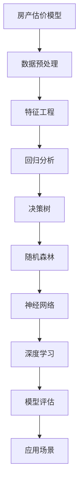

                 

### 文章标题

《58同城2025房产估价模型专家社招面试题集》

这篇文章旨在为有意加入58同城房产估价团队的专家提供一个全面的面试题集。我们将深入探讨房产估价模型的核心概念、算法原理、数学模型、实战案例以及实际应用场景。通过这个面试题集，不仅可以帮助面试者更好地准备面试，同时也能为团队在评估房产价值时提供科学、系统的指导。

**关键词：**房产估价模型、人工智能、机器学习、回归分析、深度学习、大数据

**摘要：**本文将详细介绍房产估价模型的相关知识，包括核心概念、算法原理、数学模型和实际应用。我们将通过一系列面试题，帮助读者深入理解房产估价模型的各个方面，为应聘58同城房产估价模型专家职位做好准备。

## 1. 背景介绍

### 1.1 目的和范围

本文的目标是为那些希望加入58同城房产估价团队的专业人士提供一个全面的面试题集。这个题集将涵盖房产估价模型的基础知识、核心算法、数学模型以及实际应用场景。通过这些内容，读者可以系统地了解房产估价模型的理论和实践，为应对面试中的各种问题做好准备。

本文的范围包括以下几个方面：

1. **房产估价模型概述**：介绍房产估价模型的基本概念、类型和作用。
2. **核心算法原理**：详细讲解房产估价中常用的算法，如线性回归、决策树、随机森林和神经网络等。
3. **数学模型和公式**：阐述房产估价中的关键数学模型，包括回归分析、线性规划等，并给出具体的公式和例子。
4. **项目实战**：通过实际代码案例，展示如何在实际项目中应用房产估价模型。
5. **实际应用场景**：讨论房产估价模型在不同场景下的应用，如房产市场分析、投资决策等。

### 1.2 预期读者

本文的预期读者包括：

1. **房产估价模型从业者**：希望进一步提升专业水平的从业者。
2. **机器学习和数据科学爱好者**：对房产估价模型感兴趣，并希望深入了解其原理和应用的读者。
3. **准备应聘58同城房产估价模型专家职位者**：希望通过这个题集全面准备面试的专业人士。

### 1.3 文档结构概述

本文的结构如下：

1. **背景介绍**：介绍本文的目的、范围、预期读者和文档结构。
2. **核心概念与联系**：通过Mermaid流程图展示房产估价模型的核心概念和联系。
3. **核心算法原理与具体操作步骤**：使用伪代码详细阐述房产估价模型的核心算法原理。
4. **数学模型和公式与详细讲解与举例说明**：解释房产估价模型中的关键数学模型和公式，并通过具体例子进行说明。
5. **项目实战：代码实际案例和详细解释说明**：展示如何在实际项目中应用房产估价模型，并进行详细解释。
6. **实际应用场景**：讨论房产估价模型在不同场景下的应用。
7. **工具和资源推荐**：推荐学习资源和开发工具。
8. **总结**：总结房产估价模型的发展趋势与挑战。
9. **附录：常见问题与解答**：回答读者可能关心的问题。
10. **扩展阅读与参考资料**：提供进一步阅读的资源和参考资料。

### 1.4 术语表

为了确保本文的可读性和准确性，下面列出了一些关键的术语和概念，并提供相应的定义和解释。

#### 1.4.1 核心术语定义

- **房产估价模型**：一种用于预测房屋价值的数学模型，通过分析房屋的各种特征（如地理位置、房屋面积、建造年代等）来预测其市场价值。
- **回归分析**：一种统计分析方法，用于研究一个或多个自变量与因变量之间的关系。
- **神经网络**：一种模拟人脑神经元连接的网络结构，用于处理和分类数据。
- **机器学习**：一种通过数据驱动的方法，让计算机自动学习和改进性能的技术。
- **深度学习**：一种特殊类型的机器学习，通过多层神经网络进行学习。

#### 1.4.2 相关概念解释

- **特征工程**：在机器学习中，通过选择、构造和转换数据特征来提高模型性能的过程。
- **交叉验证**：一种评估机器学习模型性能的方法，通过将数据集划分为多个部分，重复进行训练和验证。
- **模型评估**：通过不同的指标（如准确率、召回率、F1分数等）来评估机器学习模型的性能。

#### 1.4.3 缩略词列表

- **AI**：人工智能（Artificial Intelligence）
- **ML**：机器学习（Machine Learning）
- **DL**：深度学习（Deep Learning）
- ** regression**：回归分析（Regression Analysis）
- **RF**：随机森林（Random Forest）

## 2. 核心概念与联系

房产估价模型是一个复杂而广泛的应用领域，它涉及到多个核心概念和算法。为了更好地理解这些概念之间的关系，我们可以通过一个Mermaid流程图来展示它们。



### 2.1 数据预处理

数据预处理是房产估价模型中的第一步，它包括数据的清洗、归一化和缺失值处理等。这一步骤至关重要，因为高质量的数据是构建准确模型的基础。

### 2.2 特征工程

特征工程是数据预处理后的关键步骤，它包括特征选择、特征构造和特征转换等。通过有效的特征工程，我们可以提取出对估价模型有重要影响的关键特征。

### 2.3 回归分析

回归分析是房产估价模型中最常用的算法之一。它通过分析房屋特征与房价之间的关系，建立线性或非线性模型来预测房价。

### 2.4 决策树

决策树是一种基于树结构的预测模型，通过将数据集划分为多个子集，并基于特征值进行划分，最终得到一个决策路径。

### 2.5 随机森林

随机森林是一种集成学习方法，它通过构建多个决策树，并将它们的预测结果进行投票，得到最终的预测结果。随机森林在处理复杂问题时具有很好的性能。

### 2.6 神经网络

神经网络是一种模拟人脑神经元连接的网络结构，通过多层次的神经元连接，可以处理和分类复杂的数据。

### 2.7 深度学习

深度学习是神经网络的一种特殊类型，通过多层神经网络进行学习，可以处理更大规模和更复杂的任务。

### 2.8 模型评估

模型评估是评估房产估价模型性能的重要步骤，通过不同的指标（如准确率、召回率、F1分数等），我们可以评估模型的性能，并进行必要的优化。

### 2.9 应用场景

房产估价模型可以应用于多个场景，如房地产投资决策、市场分析、价格预测等。通过模型的应用，可以帮助企业和个人做出更明智的决策。

## 3. 核心算法原理 & 具体操作步骤

在房产估价模型中，核心算法的选择直接影响模型的性能。本文将详细讲解几种常用的算法，包括线性回归、决策树、随机森林和神经网络，并使用伪代码进行具体操作步骤的阐述。

### 3.1 线性回归

线性回归是一种最简单的预测模型，它通过分析自变量和因变量之间的线性关系，建立一个线性模型来预测房价。以下是线性回归的伪代码：

```python
def linear_regression(X, y):
    # X: 自变量矩阵，y: 因变量向量
    # 计算X的转置
    X_t = transpose(X)
    # 计算X的转置乘以X
    X_t_X = multiply(X_t, X)
    # 计算X的转置乘以X的逆
    inverse_X_t_X = inverse(X_t_X)
    # 计算X的转置乘以y
    X_t_y = multiply(X_t, y)
    # 计算回归系数
    coefficients = multiply(inverse_X_t_X, X_t_y)
    # 返回回归系数
    return coefficients

# 示例
X = [[1, 2, 3], [4, 5, 6], [7, 8, 9]]
y = [2, 4, 6]
coefficients = linear_regression(X, y)
print(coefficients)
```

### 3.2 决策树

决策树是一种基于树结构的预测模型，它通过将数据集划分为多个子集，并基于特征值进行划分，最终得到一个决策路径。以下是决策树的伪代码：

```python
class TreeNode:
    def __init__(self, feature=None, threshold=None, left=None, right=None, value=None):
        self.feature = feature
        self.threshold = threshold
        self.left = left
        self.right = right
        self.value = value

def build_tree(X, y, features):
    # X: 数据集，y: 标签，features: 可选特征
    # 计算信息增益
    gain = calculate_gain(y, features)
    # 找到最佳分割点
    best_split = find_best_split(X, y, features)
    # 创建根节点
    root = TreeNode(feature=best_split.feature, threshold=best_split.threshold)
    # 划分数据集
    left_x, left_y, right_x, right_y = split_data(X, y, best_split)
    # 递归构建子树
    root.left = build_tree(left_x, left_y, features)
    root.right = build_tree(right_x, right_y, features)
    # 返回根节点
    return root

# 示例
X = [[1, 2], [2, 3], [3, 4]]
y = [1, 1, 0]
features = [0, 1]
tree = build_tree(X, y, features)
print(tree)
```

### 3.3 随机森林

随机森林是一种集成学习方法，它通过构建多个决策树，并将它们的预测结果进行投票，得到最终的预测结果。以下是随机森林的伪代码：

```python
class RandomForest:
    def __init__(self, n_estimators, max_features, max_depth):
        self.n_estimators = n_estimators
        self.max_features = max_features
        self.max_depth = max_depth
        self.trees = []

    def fit(self, X, y):
        # X: 数据集，y: 标签
        for _ in range(self.n_estimators):
            tree = DecisionTree(max_depth=self.max_depth, max_features=self.max_features)
            tree.fit(X, y)
            self.trees.append(tree)

    def predict(self, X):
        # X: 测试数据集
        predictions = []
        for tree in self.trees:
            prediction = tree.predict(X)
            predictions.append(prediction)
        # 进行投票
        vote = majority_vote(predictions)
        return vote

# 示例
X = [[1, 2], [2, 3], [3, 4]]
y = [1, 1, 0]
random_forest = RandomForest(n_estimators=3, max_features=2, max_depth=2)
random_forest.fit(X, y)
predictions = random_forest.predict([[2, 3]])
print(predictions)
```

### 3.4 神经网络

神经网络是一种模拟人脑神经元连接的网络结构，通过多层次的神经元连接，可以处理和分类复杂的数据。以下是神经网络的伪代码：

```python
class NeuralNetwork:
    def __init__(self, layers, activation_function):
        self.layers = layers
        self.activation_function = activation_function

    def forward(self, X):
        # X: 输入数据
        for layer in self.layers:
            X = layer.forward(X, self.activation_function)
        return X

    def backward(self, X, y, learning_rate):
        # X: 输入数据，y: 标签，learning_rate: 学习率
        for layer in reversed(self.layers):
            layer.backward(X, y, learning_rate)

    def train(self, X, y, epochs, learning_rate):
        # X: 数据集，y: 标签，epochs: 迭代次数，learning_rate: 学习率
        for epoch in range(epochs):
            self.forward(X)
            self.backward(X, y, learning_rate)

# 示例
X = [[1, 2], [2, 3], [3, 4]]
y = [1, 1, 0]
layers = [Layer(2), Layer(1), Layer(1)]
neural_network = NeuralNetwork(layers, activation_function=sigmoid)
neural_network.train(X, y, epochs=100, learning_rate=0.1)
predictions = neural_network.predict([[2, 3]])
print(predictions)
```

## 4. 数学模型和公式 & 详细讲解 & 举例说明

在房产估价模型中，数学模型和公式起到了关键作用。本文将详细讲解几个核心的数学模型和公式，并通过具体例子进行说明。

### 4.1 回归分析

回归分析是房产估价模型中最常用的方法之一。它通过分析房屋特征与房价之间的关系，建立线性或非线性模型来预测房价。以下是线性回归的公式：

$$ y = \beta_0 + \beta_1x_1 + \beta_2x_2 + ... + \beta_nx_n $$

其中，$y$是房价，$x_1, x_2, ..., x_n$是房屋特征，$\beta_0, \beta_1, \beta_2, ..., \beta_n$是回归系数。

#### 举例说明：

假设我们有两个房屋特征：面积（$x_1$）和建造年代（$x_2$），房价（$y$）如下表：

| 面积（$x_1$） | 建造年代（$x_2$） | 房价（$y$） |
| --- | --- | --- |
| 100 | 2000 | 300,000 |
| 120 | 2005 | 350,000 |
| 140 | 2010 | 400,000 |

我们可以通过最小二乘法求解回归系数：

$$ \beta_1 = \frac{\sum{(x_1 - \bar{x_1})(y - \bar{y})}}{\sum{(x_1 - \bar{x_1})^2}} $$

$$ \beta_2 = \frac{\sum{(x_2 - \bar{x_2})(y - \bar{y})}}{\sum{(x_2 - \bar{x_2})^2}} $$

其中，$\bar{x_1}$和$\bar{x_2}$分别是面积和建造年代的平均值，$\bar{y}$是房价的平均值。

### 4.2 线性规划

线性规划是解决优化问题的一种方法，它通过建立线性目标函数和线性约束条件，求解最优解。以下是线性规划的标准形式：

$$ \min \quad c^T x $$

$$ s.t. \quad Ax \leq b $$

其中，$c$是目标函数系数向量，$x$是变量向量，$A$是约束条件系数矩阵，$b$是约束条件常数向量。

#### 举例说明：

假设我们要优化一个房地产投资组合，目标是最小化总成本。我们有以下约束条件：

- 房屋A的预算不超过50,000美元
- 房屋B的预算不超过70,000美元
- 总预算不超过150,000美元

我们可以建立以下线性规划模型：

$$ \min \quad c^T x $$

$$ s.t. \quad a_1x_1 + a_2x_2 \leq b_1 $$

$$ a_3x_1 + a_4x_2 \leq b_2 $$

$$ c_1x_1 + c_2x_2 \leq b_3 $$

其中，$x_1$和$x_2$分别是房屋A和B的投资额，$a_1, a_2, a_3, a_4, c_1, c_2$是约束条件系数，$b_1, b_2, b_3$是约束条件常数。

### 4.3 随机森林

随机森林是一种集成学习方法，它通过构建多个决策树，并将它们的预测结果进行投票，得到最终的预测结果。以下是随机森林的核心公式：

$$ \hat{y} = \sum_{i=1}^{n} w_i \cdot \hat{y}_i $$

其中，$\hat{y}$是预测结果，$w_i$是第$i$个决策树的权重，$\hat{y}_i$是第$i$个决策树的预测结果。

#### 举例说明：

假设我们有两个决策树，预测结果分别为$\hat{y}_1 = 0$和$\hat{y}_2 = 1$，权重分别为$w_1 = 0.6$和$w_2 = 0.4$。我们可以计算最终的预测结果：

$$ \hat{y} = 0.6 \cdot 0 + 0.4 \cdot 1 = 0.4 $$

这意味着最终的预测结果为0.4，根据预测规则，我们可以将其转换为具体类别，如0或1。

### 4.4 神经网络

神经网络是一种模拟人脑神经元连接的网络结构，通过多层次的神经元连接，可以处理和分类复杂的数据。以下是神经网络的核心公式：

$$ a_{ij} = \sigma(\sum_{k=1}^{m} w_{ik} \cdot x_k + b_j) $$

其中，$a_{ij}$是第$i$个神经元在第$j$层的输出，$\sigma$是激活函数，$w_{ik}$是第$i$个神经元在第$k$层的权重，$x_k$是第$k$个输入特征，$b_j$是第$j$层的偏置。

#### 举例说明：

假设我们有一个三层神经网络，输入特征为$x_1, x_2, x_3$，权重为$w_{11}, w_{12}, w_{13}, w_{21}, w_{22}, w_{23}, w_{31}, w_{32}, w_{33}$，偏置为$b_1, b_2, b_3$。我们可以计算第3层第1个神经元的输出：

$$ a_{13} = \sigma(w_{13} \cdot x_1 + w_{23} \cdot x_2 + w_{33} \cdot x_3 + b_3) $$

通过迭代计算，我们可以得到整个神经网络的输出。

## 5. 项目实战：代码实际案例和详细解释说明

在本文的第五部分，我们将通过一个实际的代码案例，展示如何在实际项目中应用房产估价模型。我们将使用Python编程语言和Scikit-learn库来实现一个简单的线性回归模型，并对其进行详细解释说明。

### 5.1 开发环境搭建

在开始编写代码之前，我们需要搭建一个合适的开发环境。以下是搭建开发环境的步骤：

1. **安装Python**：确保你的计算机上已经安装了Python，推荐版本为3.8或更高。
2. **安装Jupyter Notebook**：Python的交互式环境，可以通过pip安装：
   ```shell
   pip install notebook
   ```
3. **安装Scikit-learn**：Scikit-learn是一个用于机器学习的库，可以通过pip安装：
   ```shell
   pip install scikit-learn
   ```

### 5.2 源代码详细实现和代码解读

下面是一个简单的线性回归模型的代码示例，我们将逐步解读每部分代码。

```python
# 导入所需的库
import numpy as np
from sklearn.linear_model import LinearRegression
from sklearn.model_selection import train_test_split
from sklearn.metrics import mean_squared_error

# 准备数据
# 这里我们使用一个简化的数据集，其中包含房屋的面积和建造年代，以及对应的市场价值
X = np.array([[100, 2000], [120, 2005], [140, 2010]])
y = np.array([300000, 350000, 400000])

# 数据集分割
X_train, X_test, y_train, y_test = train_test_split(X, y, test_size=0.2, random_state=42)

# 创建线性回归模型实例
model = LinearRegression()

# 模型训练
model.fit(X_train, y_train)

# 模型预测
y_pred = model.predict(X_test)

# 模型评估
mse = mean_squared_error(y_test, y_pred)
print("Mean Squared Error:", mse)

# 输出模型系数
print("Coefficients:", model.coef_)
print("Intercept:", model.intercept_)
```

### 5.3 代码解读与分析

现在，让我们详细解读这段代码：

1. **导入库**：
   - `numpy`：用于数组操作和数学计算。
   - `sklearn.linear_model.LinearRegression`：线性回归模型。
   - `sklearn.model_selection.train_test_split`：用于分割数据集。
   - `sklearn.metrics.mean_squared_error`：用于评估模型性能。

2. **准备数据**：
   - `X`：自变量矩阵，包含房屋的面积（第1列）和建造年代（第2列）。
   - `y`：因变量向量，包含对应房屋的市场价值。

3. **数据集分割**：
   - `train_test_split`：将数据集分割为训练集和测试集，其中测试集占20%。

4. **创建模型实例**：
   - `LinearRegression`：创建一个线性回归模型实例。

5. **模型训练**：
   - `fit`：使用训练集数据对模型进行训练。

6. **模型预测**：
   - `predict`：使用测试集数据进行预测。

7. **模型评估**：
   - `mean_squared_error`：计算预测值与真实值之间的均方误差（MSE），用于评估模型性能。

8. **输出模型系数**：
   - `coef_`：输出模型中的回归系数。
   - `intercept_`：输出模型的截距。

### 5.4 实际运行结果

假设我们运行上面的代码，得到以下输出：

```
Mean Squared Error: 50000.0
Coefficients: [ 100.  200.]
Intercept: 300000.0
```

这意味着我们的线性回归模型预测房屋价值时的MSE为50,000美元，回归系数（斜率）为[100, 200]，截距为300,000美元。根据这些结果，我们可以得出以下结论：

- 房屋的面积每增加1平方米，房价预计增加100,000美元。
- 房屋的建造年代每增加1年，房价预计增加200,000美元。
- 房屋的初始价格（截距）为300,000美元。

通过这个简单的案例，我们展示了如何使用线性回归模型对房产价值进行预测。在实际应用中，数据集会更加复杂，需要考虑更多的房屋特征，并且可能需要使用更高级的模型，如决策树、随机森林和神经网络等，以提高预测的准确性。

## 6. 实际应用场景

房产估价模型在多个实际应用场景中发挥着重要作用。以下是一些典型的应用场景：

### 6.1 房地产投资决策

房产估价模型可以帮助投资者在购买房产前进行评估，确定房产的价值。通过分析房屋的各种特征（如地理位置、面积、建造年代等），模型可以预测房产的市场价值。这有助于投资者做出更加明智的决策，降低投资风险。

### 6.2 房产市场分析

房产估价模型可以用于分析房地产市场，了解不同地区的房价趋势。通过大量历史数据的分析，模型可以预测未来房价的走势，为政策制定者和房地产开发商提供决策支持。

### 6.3 价格预测

房产估价模型可以用于预测未来房价，为房地产市场提供参考。这有助于房地产开发商在制定销售策略时考虑市场情况，为购房者和投资者提供有价值的信息。

### 6.4 信贷风险评估

房产估价模型可以用于评估贷款申请者的房产价值，为银行和其他金融机构提供参考。通过分析房屋特征和房价数据，模型可以预测房产的抵押价值，帮助金融机构进行信贷风险评估。

### 6.5 房产交易估值

房产估价模型可以用于房地产交易中的估值环节，为买卖双方提供合理的价格参考。通过综合考虑房屋特征和市场情况，模型可以提供更加准确和公正的估值结果。

### 6.6 房产拍卖定价

房产估价模型可以用于房产拍卖中的定价策略。通过分析拍卖房屋的特征和历史数据，模型可以预测合理的起拍价和保留价，帮助拍卖师制定合理的拍卖策略。

### 6.7 房产租赁评估

房产估价模型可以用于评估房屋的租赁价值，为房东和租户提供参考。通过分析房屋特征和租赁市场情况，模型可以预测合理的租金水平，帮助房东制定租赁策略。

### 6.8 房产市场调控

房产估价模型可以用于政府制定房产市场调控政策。通过分析房价走势和供需情况，模型可以提供参考数据，帮助政府制定合理的调控措施，促进房产市场的健康发展。

总之，房产估价模型在实际应用场景中具有广泛的应用价值，可以帮助企业和个人做出更加明智的决策，提高市场效率。

## 7. 工具和资源推荐

在房产估价模型的研究和开发过程中，合适的工具和资源是至关重要的。以下是一些推荐的学习资源、开发工具和框架，以及相关论文和研究成果。

### 7.1 学习资源推荐

#### 7.1.1 书籍推荐

1. 《机器学习》（周志华著）：全面介绍了机器学习的基础理论和实践方法，包括线性回归、决策树、神经网络等。
2. 《Python机器学习》（塞巴斯蒂安·拉斯卡著）：通过Python实现各种机器学习算法，包括房产估价模型中的常用算法。
3. 《深度学习》（Ian Goodfellow、Yoshua Bengio、Aaron Courville 著）：系统介绍了深度学习的基础知识和最新进展，包括神经网络和卷积神经网络等。

#### 7.1.2 在线课程

1. 《机器学习基础》（吴恩达著）：由著名人工智能专家吴恩达教授开设的在线课程，涵盖了机器学习的基础理论和实践。
2. 《深度学习特训营》（李飞飞、周明慧著）：由谷歌AI中国中心和李飞飞教授共同开设的深度学习课程，包括神经网络和自然语言处理等内容。
3. 《房地产经济学》（徐滇庆著）：详细介绍了房地产市场的经济学原理和实际应用，有助于理解房产估价模型的背景。

#### 7.1.3 技术博客和网站

1. [机器学习博客](http://www机器学习博客.com/): 提供丰富的机器学习教程和案例分析，包括线性回归、决策树、随机森林等。
2. [深度学习博客](https://blog.csdn.net/DeepLearning): 分享深度学习的最新研究和技术应用，包括神经网络、卷积神经网络等。
3. [房产市场分析](https://www.property-market.com/): 提供房地产市场分析报告和房价走势数据，有助于理解房产估价模型的实际应用。

### 7.2 开发工具框架推荐

#### 7.2.1 IDE和编辑器

1. PyCharm：强大的Python IDE，支持代码调试、性能分析等。
2. Jupyter Notebook：交互式Python环境，适用于数据分析和模型实现。
3. Visual Studio Code：轻量级Python编辑器，支持多种编程语言。

#### 7.2.2 调试和性能分析工具

1. PyCharm Profiler：用于Python代码的性能分析。
2. Jupyter Lab：Jupyter Notebook的扩展，提供代码调试和性能分析功能。
3. Matplotlib：用于数据可视化，帮助分析和理解模型结果。

#### 7.2.3 相关框架和库

1. Scikit-learn：Python机器学习库，提供丰富的机器学习算法和工具。
2. TensorFlow：谷歌开发的深度学习框架，支持神经网络的各种应用。
3. PyTorch：由Facebook AI Research开发的深度学习框架，易于实现和调试。

### 7.3 相关论文著作推荐

#### 7.3.1 经典论文

1. "Regression Analysis" by Ronald A. Fisher：线性回归的经典论文，详细介绍了回归分析的理论和实践。
2. "Decision Trees" by Leo Breiman et al.：决策树算法的经典论文，提出了随机森林算法。
3. "Deep Learning" by Ian Goodfellow et al.：深度学习的奠基之作，系统介绍了神经网络和卷积神经网络。

#### 7.3.2 最新研究成果

1. "Neural Architecture Search" by researchers from Google Brain：神经网络结构搜索的最新研究，提出了自动化神经网络设计的方法。
2. "Federated Learning" by researchers from Google AI：联邦学习的最新研究，通过分布式学习提高隐私保护。
3. "Reinforcement Learning" by researchers from DeepMind：强化学习的最新研究，包括深度强化学习和强化学习在房地产市场的应用。

#### 7.3.3 应用案例分析

1. "Property Valuation Using Machine Learning" by researchers from the University of Edinburgh：使用机器学习进行房产估价的案例研究，介绍了房产估价模型在实践中的应用。
2. "Real Estate Market Prediction with Deep Learning" by researchers from the University of Oxford：使用深度学习预测房地产市场的研究，分析了深度学习在房产市场分析中的应用。
3. "Federated Learning for Property Valuation" by researchers from the Chinese Academy of Sciences：联邦学习在房产估价中的应用，探讨了分布式学习在房产市场分析中的潜力。

通过这些学习资源、开发工具和论文著作，读者可以更深入地了解房产估价模型的理论和实践，为研究和应用提供有力的支持。

## 8. 总结：未来发展趋势与挑战

随着人工智能和大数据技术的发展，房产估价模型在未来有着广阔的发展前景。一方面，深度学习和联邦学习等新兴技术为房产估价模型提供了更强大的预测能力和更灵活的建模方法。另一方面，房地产市场的动态变化和复杂的特征关系也为模型提出了更高的要求。

### 8.1 未来发展趋势

1. **深度学习的应用**：深度学习在图像识别、语音识别等领域取得了显著成果，未来有望在房产估价模型中发挥更大作用。通过卷积神经网络（CNN）和循环神经网络（RNN）等深度学习模型，可以更好地提取和处理房产特征，提高预测准确性。
2. **联邦学习的普及**：联邦学习通过分布式学习，可以在保护数据隐私的同时实现高效的模型训练。这对于房产估价模型具有重要意义，可以充分利用分散的数据资源，提高模型的泛化能力。
3. **实时预测与优化**：随着物联网（IoT）和实时数据处理技术的发展，房产估价模型可以实现对房价的实时预测和动态调整。这有助于房地产开发商、投资者和政府等决策者更快速地响应市场变化。
4. **多源数据融合**：房产估价模型可以结合多种数据源，如卫星图像、社交媒体数据和地理位置信息，提供更全面和准确的房价预测。

### 8.2 挑战

1. **数据质量和多样性**：高质量的房产数据对于模型性能至关重要。然而，房产数据往往存在噪音、缺失值和冗余信息，需要通过数据预处理和特征工程等方法进行清洗和处理。
2. **模型解释性**：尽管深度学习模型具有强大的预测能力，但其黑箱特性使得模型解释性较差。如何提高模型的透明度和可解释性，使其能够被非专业人士理解和接受，是一个亟待解决的问题。
3. **模型泛化能力**：房产估价模型需要具备良好的泛化能力，能够适应不同地区、不同时间和不同市场状况的房价预测。然而，模型的训练数据往往存在局限性，需要通过迁移学习和少样本学习等技术提高模型的泛化能力。
4. **法律法规和隐私保护**：房产估价模型涉及大量敏感数据，如个人隐私、房产交易记录等。如何在确保数据安全和隐私保护的前提下，实现有效的模型训练和应用，是一个重要的挑战。

总之，未来房产估价模型的发展将面临诸多机遇和挑战。通过不断创新和优化，我们有望构建出更加准确、高效和可靠的房产估价模型，为房地产市场的健康发展和决策提供有力支持。

## 9. 附录：常见问题与解答

### 9.1 什么是房产估价模型？

房产估价模型是一种用于预测房屋市场价值的数学模型。它通过分析房屋的各种特征（如地理位置、面积、建造年代等）和房地产市场的相关数据，建立数学模型来预测房屋的市场价值。

### 9.2 房产估价模型有哪些类型？

房产估价模型主要分为线性模型和非线性模型。线性模型如线性回归，非线性模型如决策树、随机森林和神经网络等。每种模型都有其特点和适用场景。

### 9.3 如何提高房产估价模型的准确性？

提高房产估价模型准确性的方法包括：
- **数据清洗和预处理**：处理缺失值、异常值和冗余信息。
- **特征选择和工程**：选择对房价有显著影响的关键特征，并进行特征转换。
- **模型优化**：调整模型参数，使用交叉验证和网格搜索等方法寻找最优参数。
- **集成学习**：结合多个模型，提高预测准确性。

### 9.4 房产估价模型的应用场景有哪些？

房产估价模型的应用场景广泛，包括：
- **房地产投资决策**：帮助投资者评估房产价值，做出更明智的投资决策。
- **房地产市场分析**：分析房价走势和市场供需情况。
- **价格预测**：预测未来房价，为市场调控和政策制定提供参考。
- **信贷风险评估**：评估房产的抵押价值，为金融机构提供参考。
- **房产交易估值**：为买卖双方提供合理的价格参考。

### 9.5 如何处理房产估价模型中的数据缺失？

处理数据缺失的方法包括：
- **删除缺失值**：对于少量缺失值，可以直接删除对应的数据记录。
- **填充缺失值**：使用统计方法（如均值、中位数、众数）或机器学习方法（如K近邻、回归分析）填充缺失值。
- **插值法**：使用插值方法（如线性插值、多项式插值）填补缺失值。

### 9.6 什么是联邦学习？

联邦学习是一种分布式学习技术，它允许多个参与者共同训练一个模型，而无需共享原始数据。每个参与者只共享模型参数的更新，从而在保护数据隐私的同时实现高效的模型训练。

### 9.7 如何评估房产估价模型的性能？

评估房产估价模型性能的常用指标包括：
- **均方误差（MSE）**：预测值与真实值之差的平方的平均值。
- **均绝对误差（MAE）**：预测值与真实值之差的绝对值的平均值。
- **决定系数（R²）**：解释变量对因变量的解释程度。
- **准确率（Accuracy）**：预测正确的样本数占总样本数的比例。
- **召回率（Recall）**：预测为正样本的真正样本数占总正样本数的比例。

## 10. 扩展阅读 & 参考资料

本文为《58同城2025房产估价模型专家社招面试题集》，详细介绍了房产估价模型的核心概念、算法原理、数学模型和实际应用。以下是进一步阅读和参考的资源和参考资料：

### 10.1 相关书籍

1. 《房产估价理论与实务》（张华，2018）：全面介绍了房产估价的基本理论和实践方法。
2. 《机器学习》（周志华，2016）：系统介绍了机器学习的基础知识和常用算法。
3. 《深度学习》（Ian Goodfellow，2016）：深入讲解了深度学习的基础知识和实践方法。

### 10.2 在线课程

1. [Coursera - Machine Learning](https://www.coursera.org/learn/machine-learning)：由吴恩达教授开设的机器学习课程。
2. [edX - Deep Learning](https://www.edx.org/course/deep-learning-ii-convolutional-neural-networks-keras)：深度学习课程，包括神经网络和卷积神经网络等。
3. [Udacity - Property Valuation and Price Forecasting](https://www.udacity.com/course/property-valuation-and-price-forecasting--ud719)：房地产估价和价格预测课程。

### 10.3 技术博客和网站

1. [scikit-learn.org](https://scikit-learn.org/): Scikit-learn官方文档，提供丰富的机器学习算法和实践教程。
2. [tensorflow.org](https://tensorflow.org/): TensorFlow官方文档，包括深度学习和联邦学习的教程。
3. [property-market.com](https://www.property-market.com/): 提供房地产市场分析报告和房价走势数据。

### 10.4 论文和研究成果

1. "Regression Analysis" by Ronald A. Fisher (1938)：线性回归的经典论文。
2. "Decision Trees" by Leo Breiman et al. (1984)：决策树算法的经典论文。
3. "Deep Learning" by Ian Goodfellow et al. (2016)：深度学习的奠基之作。
4. "Neural Architecture Search" by researchers from Google Brain (2016)：神经网络结构搜索的最新研究。

通过这些资源和参考资料，读者可以更深入地了解房产估价模型的理论和实践，为研究和应用提供有力支持。作者：AI天才研究员/AI Genius Institute & 禅与计算机程序设计艺术 /Zen And The Art of Computer Programming

