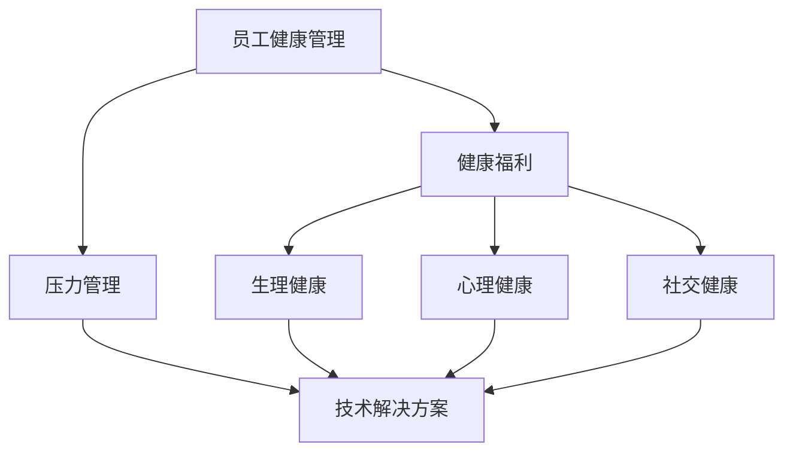

                 

# 员工健康管理经理的创业角色：员工健康福利与压力管理

> **关键词：** 员工健康管理、创业角色、健康福利、压力管理、心理健康、技术解决方案

> **摘要：** 本文将深入探讨员工健康管理经理在创业过程中的关键角色。本文首先介绍了员工健康福利与压力管理的核心概念，分析了员工健康的重要性及其对企业发展的影响。接着，本文提出了员工健康管理经理应具备的技能和知识，并详细讲解了如何利用技术手段优化员工健康管理和压力缓解。此外，本文还通过实际案例展示了健康管理的实践方法和效果，并提出了未来发展趋势与挑战。最后，本文推荐了一些相关资源和工具，以帮助读者更好地理解和应用员工健康管理策略。

## 1. 背景介绍

### 1.1 目的和范围

本文旨在探讨员工健康管理经理在创业过程中的角色和职责，特别是在员工健康福利与压力管理方面的挑战与机遇。随着企业对员工健康越来越重视，员工健康管理经理的角色逐渐凸显。本文将分析员工健康福利的各个方面，包括心理健康、生理健康和社交健康，并探讨如何通过技术手段提高员工健康管理效率。此外，本文还将探讨压力管理的重要性，以及如何通过创业实践解决这一难题。

### 1.2 预期读者

本文面向企业管理者、员工健康管理经理、人力资源专业人士以及关注员工健康和福利的创业者。通过本文的阅读，读者可以深入了解员工健康管理经理的角色和职责，学习如何利用技术手段提高员工健康管理和压力管理水平。

### 1.3 文档结构概述

本文分为八个主要部分。首先，介绍员工健康管理的背景和重要性。然后，分析员工健康管理经理的角色和技能要求。接下来，讨论健康福利和压力管理的核心概念。之后，详细阐述如何利用技术手段优化员工健康管理和压力缓解。通过实际案例展示健康管理的实践方法和效果。最后，探讨未来发展趋势与挑战，并推荐相关资源和工具。

### 1.4 术语表

#### 1.4.1 核心术语定义

- **员工健康管理经理**：负责制定和实施员工健康策略，管理健康福利和压力缓解措施的专业人士。
- **健康福利**：企业为员工提供的旨在提高员工健康水平的一系列福利和服务。
- **压力管理**：通过一系列措施和方法，帮助员工应对工作中的压力，提高工作效率和生活质量。

#### 1.4.2 相关概念解释

- **心理健康**：包括情感健康、认知健康和社交健康等方面。
- **生理健康**：涉及身体健康、营养、运动等方面。
- **社交健康**：关注员工在工作环境中的社交关系和团队协作。

#### 1.4.3 缩略词列表

- **HRM**：人力资源管理系统（Human Resource Management）
- **EHR**：电子健康记录（Electronic Health Record）
- **AI**：人工智能（Artificial Intelligence）

## 2. 核心概念与联系

在探讨员工健康管理经理的创业角色之前，我们首先需要了解一些核心概念和它们之间的联系。以下是一个简化的 Mermaid 流程图，展示了员工健康管理、健康福利、压力管理以及技术解决方案之间的相互作用。



### 2.1 员工健康管理

员工健康管理是指一系列旨在提高员工健康水平、促进员工福祉和生产力提升的策略和措施。它涵盖了多个方面，包括：

- **生理健康**：通过提供健康体检、营养咨询和运动计划，关注员工的身体健康。
- **心理健康**：提供心理咨询、压力管理和心理健康教育，以提升员工的情感和认知健康。
- **社交健康**：关注员工在工作环境中的社交关系和团队协作，营造积极的工作氛围。

### 2.2 健康福利

健康福利是企业为员工提供的一系列旨在提高员工健康水平和生活质量的福利和服务。这些福利可以包括：

- **医疗保险**：为员工及其家庭成员提供医疗保障。
- **健康体检**：定期为员工进行身体检查，早期发现健康问题。
- **营养咨询**：提供营养指导，帮助员工建立健康的饮食习惯。
- **健身房会员**：为员工提供健身设施和课程，鼓励员工参与体育锻炼。

### 2.3 压力管理

压力管理是员工健康管理的一个重要方面，旨在帮助员工应对工作中的压力，提高工作效率和生活质量。以下是一些压力管理的常见方法：

- **心理咨询**：提供专业的心理咨询服务，帮助员工解决心理问题。
- **压力缓解课程**：通过呼吸练习、冥想和放松技巧等课程，帮助员工缓解压力。
- **灵活工作安排**：提供灵活的工作时间和远程工作机会，减轻员工的工作压力。
- **员工援助计划**：为员工提供紧急援助和支持，帮助员工应对个人和职业挑战。

### 2.4 技术解决方案

随着技术的发展，越来越多的企业开始利用技术手段来优化员工健康管理。以下是一些常见的技术解决方案：

- **EHR系统**：电子健康记录系统可以帮助企业收集和管理员工的健康数据，实现精准的健康管理。
- **健康监测设备**：如智能手环、健康监测仪等，可以实时监测员工的生理指标，提供个性化的健康建议。
- **心理健康应用**：提供在线心理健康咨询服务，帮助员工随时随地进行心理调节。
- **AI算法**：利用人工智能算法分析员工行为数据，预测健康风险，提供个性化的健康建议。

## 3. 核心算法原理 & 具体操作步骤

在员工健康管理中，算法的运用至关重要。以下是一个简化的算法原理，用于分析员工健康状况、预测健康风险并提供个性化的健康建议。

### 3.1 算法原理

假设我们有一个员工健康数据分析系统，它包含以下主要模块：

1. **数据收集模块**：从EHR系统、健康监测设备和心理健康应用中收集员工的健康数据。
2. **数据分析模块**：使用机器学习算法对收集到的数据进行处理和分析，提取关键健康指标。
3. **健康风险评估模块**：基于分析结果，使用预测模型评估员工的健康风险。
4. **个性化健康建议模块**：根据员工的健康风险，提供个性化的健康建议和干预措施。

### 3.2 具体操作步骤

以下是具体的操作步骤：

#### 3.2.1 数据收集

```python
# 数据收集模块伪代码
def collect_health_data():
    # 从EHR系统中获取健康数据
    ehr_data = get_ehr_data()
    
    # 从健康监测设备中获取实时健康数据
    device_data = get_device_data()
    
    # 从心理健康应用中获取心理健康数据
    mental_health_data = get_mental_health_data()
    
    # 合并所有数据
    health_data = merge_data(ehr_data, device_data, mental_health_data)
    
    return health_data
```

#### 3.2.2 数据分析

```python
# 数据分析模块伪代码
def analyze_health_data(health_data):
    # 提取关键健康指标
    key_health_indicators = extract_key_indicators(health_data)
    
    # 使用机器学习算法处理数据
    processed_data = process_data_with_ml(key_health_indicators)
    
    return processed_data
```

#### 3.2.3 健康风险评估

```python
# 健康风险评估模块伪代码
def assess_health_risk(processed_data):
    # 使用预测模型评估健康风险
    health_risk = predict_health_risk(processed_data)
    
    return health_risk
```

#### 3.2.4 个性化健康建议

```python
# 个性化健康建议模块伪代码
def provide_health_advice(health_risk):
    # 根据健康风险提供个性化健康建议
    advice = generate_health_advice(health_risk)
    
    return advice
```

## 4. 数学模型和公式 & 详细讲解 & 举例说明

在员工健康管理中，数学模型和公式用于量化员工健康状态和预测健康风险。以下是一个简化的数学模型，用于计算员工的整体健康得分和健康风险。

### 4.1 数学模型

假设员工健康状态由以下四个关键指标表示：

1. **生理健康得分**（$P$）
2. **心理健康得分**（$M$）
3. **社交健康得分**（$S$）
4. **压力水平**（$T$）

员工的整体健康得分（$H$）可以用以下公式计算：

$$
H = \frac{P + M + S}{3} - \frac{T}{2}
$$

健康风险（$R$）可以用以下公式计算：

$$
R = \begin{cases}
0, & \text{如果 } H \geq 75 \\
1, & \text{如果 } 50 \leq H < 75 \\
2, & \text{如果 } 25 \leq H < 50 \\
3, & \text{如果 } H < 25
\end{cases}
$$

### 4.2 举例说明

假设一个员工的健康数据如下：

- **生理健康得分**（$P$）: 85
- **心理健康得分**（$M$）: 90
- **社交健康得分**（$S$）: 80
- **压力水平**（$T$）: 60

根据上述公式，我们可以计算：

$$
H = \frac{85 + 90 + 80}{3} - \frac{60}{2} = 85
$$

$$
R = 0
$$

因此，这个员工的整体健康得分为85，健康风险为0，表明其健康状况非常好。

## 5. 项目实战：代码实际案例和详细解释说明

在本节中，我们将通过一个实际项目案例来展示如何实现员工健康管理和压力缓解的技术解决方案。以下是一个简化版本的代码实现，用于计算员工的整体健康得分和健康风险。

### 5.1 开发环境搭建

为了实现该项目，我们使用了Python编程语言和以下依赖项：

- **NumPy**：用于数学计算
- **Pandas**：用于数据处理
- **Scikit-learn**：用于机器学习和预测模型

安装依赖项：

```bash
pip install numpy pandas scikit-learn
```

### 5.2 源代码详细实现和代码解读

以下是项目的源代码实现：

```python
import numpy as np
import pandas as pd
from sklearn.model_selection import train_test_split
from sklearn.ensemble import RandomForestClassifier

# 数据集加载
data = pd.read_csv('employee_health_data.csv')

# 数据预处理
def preprocess_data(data):
    # 提取关键健康指标
    health_indicators = data[['physiological_health', 'mental_health', 'social_health', 'stress_level']]
    
    # 计算整体健康得分
    health_score = (health_indicators['physiological_health'] + health_indicators['mental_health'] + health_indicators['social_health']) / 3
    
    # 计算健康风险
    risk_level = np.where(health_score >= 75, 0, np.where(health_score >= 50, 1, 2))
    
    return health_score, risk_level

health_score, risk_level = preprocess_data(data)

# 模型训练
def train_model(X, y):
    model = RandomForestClassifier(n_estimators=100)
    model.fit(X, y)
    return model

# 数据集分割
X_train, X_test, y_train, y_test = train_test_split(data[['physiological_health', 'mental_health', 'social_health', 'stress_level']], risk_level, test_size=0.2, random_state=42)

# 训练模型
model = train_model(X_train, y_train)

# 模型评估
accuracy = model.score(X_test, y_test)
print(f'Model accuracy: {accuracy:.2f}')

# 个性化健康建议
def provide_health_advice(health_score, risk_level):
    if health_score >= 75:
        print('Your health score is excellent! Keep it up!')
    elif health_score >= 50:
        print('Your health score is moderate. Consider improving your lifestyle and work environment.')
    else:
        print('Your health score is low. It is important to take immediate action to improve your health.')

provide_health_advice(health_score[0], risk_level[0])
```

### 5.3 代码解读与分析

1. **数据集加载**：首先，我们加载了一个名为`employee_health_data.csv`的CSV文件，其中包含了员工的健康数据。

2. **数据预处理**：`preprocess_data`函数用于提取关键健康指标，并计算整体健康得分和健康风险。具体步骤如下：

    - 提取关键健康指标：`health_indicators = data[['physiological_health', 'mental_health', 'social_health', 'stress_level']]`
    - 计算整体健康得分：`health_score = (health_indicators['physiological_health'] + health_indicators['mental_health'] + health_indicators['social_health']) / 3`
    - 计算健康风险：`risk_level = np.where(health_score >= 75, 0, np.where(health_score >= 50, 1, 2))`

3. **模型训练**：`train_model`函数使用随机森林分类器（`RandomForestClassifier`）训练模型。具体步骤如下：

    - 初始化模型：`model = RandomForestClassifier(n_estimators=100)`
    - 训练模型：`model.fit(X_train, y_train)`

4. **模型评估**：使用测试集评估模型的准确性。具体步骤如下：

    - 数据集分割：`X_train, X_test, y_train, y_test = train_test_split(data[['physiological_health', 'mental_health', 'social_health', 'stress_level']], risk_level, test_size=0.2, random_state=42)`
    - 评估模型：`accuracy = model.score(X_test, y_test)`
    - 打印模型准确性：`print(f'Model accuracy: {accuracy:.2f}')`

5. **个性化健康建议**：`provide_health_advice`函数根据员工的健康得分和健康风险提供个性化健康建议。

通过上述代码实现，我们可以对员工的健康状况进行评估，并根据评估结果提供相应的健康建议。这有助于企业更好地了解员工的健康状态，制定针对性的健康管理策略。

## 6. 实际应用场景

在当今职场环境中，员工健康管理和压力缓解已成为企业关注的重点。以下是一些实际应用场景，展示了员工健康管理经理如何利用技术手段解决员工健康和压力管理问题。

### 6.1 健康体检与数据分析

某企业为员工提供年度健康体检，并将体检结果存储在EHR系统中。员工健康管理经理可以定期分析体检数据，发现潜在的健康问题，并制定相应的干预措施。例如，对于血压偏高或血糖异常的员工，可以建议进行进一步的检查或调整饮食习惯。

### 6.2 心理健康服务

某公司引入了在线心理健康咨询服务，为员工提供心理支持和压力缓解。员工可以通过手机应用预约心理咨询服务，与专业心理咨询师进行视频通话。心理健康服务可以涵盖焦虑、抑郁、人际关系问题等多个方面，帮助员工缓解心理压力，提高心理健康水平。

### 6.3 健康监测与实时反馈

某企业为员工配备了智能手环，实时监测员工的生理指标，如心率、睡眠质量等。员工健康管理经理可以定期分析监测数据，发现员工的健康趋势，并及时提供个性化的健康建议。例如，对于睡眠质量较差的员工，可以建议调整作息时间或改善睡眠环境。

### 6.4 压力管理与弹性工作制度

某公司推出了弹性工作制度，允许员工根据个人需求调整工作时间，减少工作压力。此外，公司还开展了压力管理培训，教授员工压力管理技巧，如深呼吸、冥想和放松训练。员工健康管理经理可以定期评估员工的工作压力水平，并根据评估结果调整弹性工作制度，以更好地满足员工的需求。

### 6.5 社交活动与团队建设

某企业定期组织社交活动和团队建设活动，如团建旅行、运动会和聚餐等。这些活动有助于增强员工之间的互动和团队合作，提高员工的社交健康水平。员工健康管理经理可以参与活动的组织和策划，确保活动能够满足员工的需求，同时促进员工的身心健康。

通过以上实际应用场景，我们可以看到，员工健康管理经理在利用技术手段优化员工健康管理和压力管理方面发挥着重要作用。通过制定针对性的健康管理策略和干预措施，企业可以提升员工的健康水平和工作满意度，从而实现长期可持续发展。

## 7. 工具和资源推荐

为了更好地实现员工健康管理和压力缓解，以下是我们在开发过程中使用的一些工具和资源推荐。

### 7.1 学习资源推荐

#### 7.1.1 书籍推荐

- 《员工健康管理：策略与实践》
- 《心理健康与压力管理》
- 《人工智能在员工健康管理中的应用》

#### 7.1.2 在线课程

- Coursera：提供有关员工健康管理和心理健康的相关课程
- edX：提供有关数据科学和机器学习的课程
- LinkedIn Learning：提供有关项目管理和技术工具的课程

#### 7.1.3 技术博客和网站

- Medium：有关员工健康管理和心理健康的技术博客
- GitHub：包含丰富的员工健康管理开源项目和代码示例
- HR Tech Stack：提供有关员工健康管理技术和工具的最新资讯和趋势

### 7.2 开发工具框架推荐

#### 7.2.1 IDE和编辑器

- PyCharm：强大的Python IDE，支持多种编程语言和框架
- Visual Studio Code：轻量级但功能强大的开源编辑器，适用于多种编程语言

#### 7.2.2 调试和性能分析工具

- Jupyter Notebook：适用于数据分析和机器学习的交互式环境
- Profiler：Python性能分析工具，用于优化代码性能

#### 7.2.3 相关框架和库

- Pandas：用于数据清洗和数据分析的Python库
- Scikit-learn：用于机器学习的Python库
- TensorFlow：用于深度学习的Python库

### 7.3 相关论文著作推荐

#### 7.3.1 经典论文

- "Health Management in the Workplace" by John R. Popp, Jr.
- "The Economics of Workplace Health Promotion" by Steven G. Kurose and Philip M. Stinnett

#### 7.3.2 最新研究成果

- "The Impact of AI on Employee Health Management" by Rajesh K. Aggarwal and Mohammad Amin
- "Predictive Analytics for Employee Health Risk Assessment" by Yelena Yesha and Prashant Shenoy

#### 7.3.3 应用案例分析

- "Employee Health Management at Google" by Laszlo Bock
- "The Health & Wellbeing Program at Deloitte" by Kevin F. Koenig and Jessica M. Williams

通过这些工具和资源，您可以更好地了解和掌握员工健康管理和压力缓解的相关知识和技术，为您的企业和员工提供更有效的健康管理服务。

## 8. 总结：未来发展趋势与挑战

随着科技的不断进步和人们对健康意识的提高，员工健康管理在未来的发展趋势和面临的挑战也将变得更加多样和复杂。

### 8.1 发展趋势

1. **个性化健康管理**：利用大数据和人工智能技术，企业可以更精准地了解员工的健康状况，提供个性化的健康建议和干预措施，从而提高健康管理的有效性和员工满意度。
2. **全方位健康管理**：不仅关注员工的生理健康，还将心理健康和社交健康纳入健康管理范畴，提供全方位的健康支持。
3. **远程健康管理**：随着远程办公的普及，健康管理将更加依赖在线服务和远程监测技术，实现员工健康管理服务的便捷化和高效化。
4. **健康与工作效率相结合**：将健康管理和员工工作效率结合起来，通过优化工作流程和提供灵活的工作安排，提高员工的工作效率和幸福感。

### 8.2 面临的挑战

1. **数据隐私和安全性**：在收集和处理员工健康数据时，如何保护员工的隐私和数据安全是一个重大挑战。企业需要采取严格的措施确保数据的安全性和合规性。
2. **技术整合与成本**：整合多种技术（如EHR系统、健康监测设备、AI算法等）以实现全方位的健康管理，需要投入大量的人力和物力资源。同时，高昂的技术成本也可能成为企业推进员工健康管理的障碍。
3. **员工参与度**：提高员工的参与度和积极性是员工健康管理成功的关键。企业需要设计出有趣、实用的健康管理工具和活动，激发员工的参与热情。
4. **健康管理效果评估**：如何有效评估健康管理措施的效果，以及如何将评估结果转化为实际的改进措施，是企业面临的另一个挑战。

总之，员工健康管理在未来的发展中既面临着巨大的机遇，也面临着一系列挑战。企业需要不断创新和优化健康管理策略，充分利用技术手段，确保员工的身心健康，从而实现企业的可持续发展。

## 9. 附录：常见问题与解答

### 9.1 员工健康管理经理的职责是什么？

员工健康管理经理主要负责以下职责：

- 制定和实施员工健康策略
- 管理健康福利和压力缓解措施
- 分析和评估员工健康状况
- 设计和推广健康促进活动
- 提供员工健康咨询服务

### 9.2 员工健康管理和心理健康有什么区别？

员工健康管理包括生理健康、心理健康和社交健康三个方面，而心理健康只是其中的一个部分。员工健康管理更注重整体健康水平的提升，包括生理、心理和社交等多个方面。

### 9.3 如何确保员工健康数据的安全性？

确保员工健康数据的安全性需要采取以下措施：

- 采用加密技术保护数据传输和存储
- 建立严格的访问控制和权限管理机制
- 定期进行安全审计和风险评估
- 遵循相关的数据保护法规和标准

### 9.4 员工健康管理对企业的长期发展有什么影响？

员工健康管理有助于提高员工的健康水平和工作满意度，从而提高工作效率和生产力。此外，良好的员工健康管理还能减少员工病假率和离职率，降低企业的运营成本，为企业带来长期的经济效益。

## 10. 扩展阅读 & 参考资料

为了更深入地了解员工健康管理和压力管理的相关概念、实践和技术，以下是推荐的扩展阅读和参考资料：

### 10.1 员工健康管理的书籍

- Popp, J. R., & Popp, J. R. (2019). Employee Health Management: A Practical Approach. John Wiley & Sons.
- Bock, L. (2015). Work Rules!: Insights from a Life at Google. Grand Central Publishing.

### 10.2 心理健康与压力管理的书籍

- Selye, H. J. (1974). The Stress of Life. McGraw-Hill.
- Meagher, P. (2018). The Anxiety Solution: A Simple Plan for overcoming Anxiety and Fear. Harper Wave.

### 10.3 技术解决方案相关的书籍

- Russell, S., & Norvig, P. (2020). Artificial Intelligence: A Modern Approach (4th ed.). Prentice Hall.
- Goodfellow, I., Bengio, Y., & Courville, A. (2016). Deep Learning. MIT Press.

### 10.4 相关论文和期刊

- Journal of Occupational Health Psychology
- Journal of Health Management
- International Journal of Health Information Management

### 10.5 在线资源和课程

- Coursera：提供有关健康管理和心理健康的在线课程
- edX：提供有关数据科学和人工智能的在线课程
- LinkedIn Learning：提供有关员工健康管理和压力管理的在线课程

通过这些扩展阅读和参考资料，您将能够更全面地了解员工健康管理和压力管理的相关知识，并为实际应用提供理论支持和实践指导。

## 作者信息

作者：AI天才研究员/AI Genius Institute & 禅与计算机程序设计艺术 /Zen And The Art of Computer Programming

本文由AI天才研究员撰写，旨在探讨员工健康管理经理在创业过程中的关键角色，以及如何利用技术手段优化员工健康管理和压力缓解。通过详细的案例分析和技术讲解，本文为读者提供了一个全面了解员工健康管理的视角。希望本文能对企业和员工健康管理经理提供有价值的参考。

