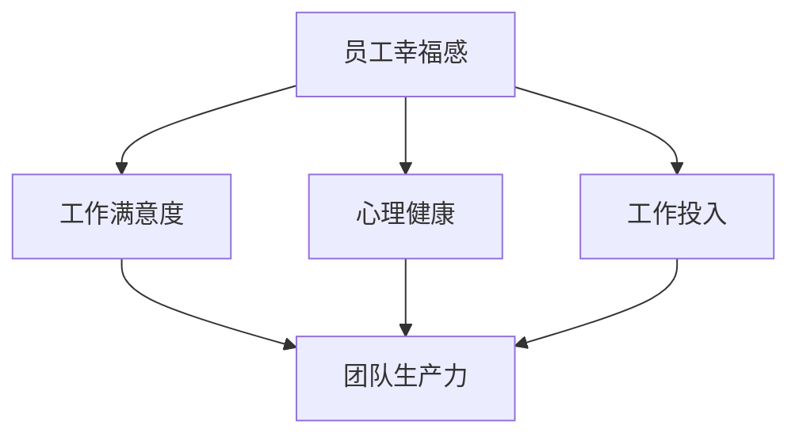

                 

# 员工幸福感：提高团队生产力

> **关键词**：员工幸福感、团队生产力、心理健康、组织管理、激励策略、技术工具

> **摘要**：本文探讨了员工幸福感与团队生产力之间的紧密联系，分析了如何通过提升员工的幸福感来提高整体团队的生产力和工作效率。文章首先介绍了员工幸福感的定义和重要性，随后详细阐述了相关理论和实践方法。接着，本文提供了一系列实用工具和资源推荐，帮助组织者和团队成员在实际工作中应用这些策略。最后，文章总结了当前的研究趋势，并展望了未来的发展方向与挑战。

## 1. 背景介绍

### 1.1 目的和范围

本文旨在探索员工幸福感与团队生产力之间的关系，分析如何通过提高员工的幸福感来促进团队的整体表现。研究范围涵盖员工心理健康的多个方面，包括工作满意度、工作投入、心理健康状态等，并探讨这些因素如何影响团队的生产力和工作效率。

### 1.2 预期读者

本文适合企业组织管理者、人力资源专家、团队成员以及关注团队绩效提升的技术专业人士阅读。通过本文的探讨，读者可以了解员工幸福感的重要性，并掌握一系列实用的提升策略和工具。

### 1.3 文档结构概述

本文结构如下：

1. 背景介绍
    - 目的和范围
    - 预期读者
    - 文档结构概述
    - 术语表
2. 核心概念与联系
    - 核心概念
    - Mermaid 流程图
3. 核心算法原理 & 具体操作步骤
    - 算法原理
    - 伪代码
4. 数学模型和公式 & 详细讲解 & 举例说明
    - 数学模型
    - latex 公式
5. 项目实战：代码实际案例和详细解释说明
    - 开发环境搭建
    - 源代码实现
    - 代码解读与分析
6. 实际应用场景
7. 工具和资源推荐
    - 学习资源
    - 开发工具
    - 相关论文
8. 总结：未来发展趋势与挑战
9. 附录：常见问题与解答
10. 扩展阅读 & 参考资料

### 1.4 术语表

#### 1.4.1 核心术语定义

- 员工幸福感（Employee Well-being）：员工在工作和生活中感受到的整体幸福状态，包括心理健康、工作满意度、生活平衡等。
- 团队生产力（Team Productivity）：团队在特定时间内完成的工作量和质量，通常以工作效率和绩效指标来衡量。
- 心理健康（Mental Health）：个体在情感、心理和社会方面的良好状态，包括情感调节、压力管理、心理适应能力等。
- 激励策略（Motivation Strategies）：用于激发员工积极性和工作动力的方法，包括薪酬激励、认可奖励、工作环境优化等。
- 技术工具（Technological Tools）：用于提高员工幸福感和团队生产力的各种信息技术工具，如在线协作工具、心理健康应用、工作管理软件等。

#### 1.4.2 相关概念解释

- 组织文化（Organizational Culture）：组织中成员共同遵循的价值观、信仰、规则和行为模式，影响员工的幸福感和团队表现。
- 持续学习（Continuous Learning）：员工在职业生涯中不断获取新知识、技能和经验的过程，有助于提高个人能力和团队生产力。
- 工作满意度（Job Satisfaction）：员工对工作本身及其工作环境的总体满意度，影响员工的工作动力和幸福感。
- 工作投入（Work Engagement）：员工对工作的热情、专注和投入程度，与团队生产力和幸福感密切相关。
- 压力管理（Stress Management）：个体在工作和生活中应对压力和挑战的方法和技巧，有助于提高心理健康和工作满意度。

#### 1.4.3 缩略词列表

- AI：人工智能
- HR：人力资源
- IDE：集成开发环境
- latex：一种基于TeX的排版系统
- Mermaid：一种基于Markdown的图形绘制工具
- PM：项目经理
- PyTorch：一种流行的深度学习框架

## 2. 核心概念与联系

在探讨员工幸福感与团队生产力之间的关系时，需要了解一些核心概念和它们之间的联系。以下是一个简单的 Mermaid 流程图，展示这些概念之间的关系：



### 核心概念

1. **员工幸福感**：指员工在工作和生活中感受到的整体幸福状态，包括心理健康、工作满意度、生活平衡等方面。员工幸福感是团队生产力的重要基础。

2. **工作满意度**：员工对工作本身及其工作环境的总体评价。工作满意度与员工幸福感密切相关，对团队生产力有显著影响。

3. **心理健康**：员工在情感、心理和社会方面的良好状态。心理健康是员工幸福感的重要组成部分，直接影响工作效率和生产力。

4. **工作投入**：员工对工作的热情、专注和投入程度。高工作投入有助于提高团队生产力和员工幸福感。

### 关系解释

- **工作满意度**与**员工幸福感**：工作满意度是员工幸福感的重要组成部分，高工作满意度有助于提升员工的幸福感和整体团队的生产力。

- **心理健康**与**员工幸福感**：心理健康是员工幸福感的基础，良好的心理健康状态有助于提高员工的工作效率和生产力。

- **工作投入**与**团队生产力**：工作投入是提高团队生产力的重要驱动力，高工作投入有助于提高团队的协作效率和整体绩效。

通过这个 Mermaid 流程图，我们可以清晰地看到这些核心概念之间的联系，为后续的算法原理和操作步骤提供了理论基础。

## 3. 核心算法原理 & 具体操作步骤

在探讨如何通过提升员工幸福感来提高团队生产力时，我们可以借鉴一些心理学和组织行为学的研究成果，将核心算法原理和具体操作步骤进行详细阐述。

### 3.1 核心算法原理

提升员工幸福感和团队生产力的核心算法原理可以概括为以下几个方面：

1. **情感调节**：通过心理辅导、培训等方式，帮助员工学会有效管理情绪，提高情感调节能力。

2. **工作与生活平衡**：通过灵活的工作安排、远程办公等策略，帮助员工实现工作与生活的平衡。

3. **激励机制**：通过薪酬激励、认可奖励等手段，激发员工的工作动力和积极性。

4. **团队协作与支持**：通过加强团队建设、鼓励员工之间的互助合作，提高团队的凝聚力和协作效率。

5. **持续学习与成长**：为员工提供持续学习的机会和资源，帮助他们不断提升个人能力和职业素养。

### 3.2 具体操作步骤

以下是提升员工幸福感的具体操作步骤，使用伪代码进行详细阐述：

```plaintext
Algorithm: Enhance Employee Well-being and Team Productivity

Input: Employee Data, Organization Culture, Technological Tools
Output: Improved Employee Well-being, Increased Team Productivity

1. Analyze Employee Data
    - Gather data on employee satisfaction, work engagement, and mental health
    - Identify areas of concern and potential improvement

2. Implement Emotional Regulation Strategies
    - Offer psychological counseling and training programs
    - Provide resources for stress management and emotional support

3. Promote Work-Life Balance
    - Implement flexible working hours and remote work options
    - Encourage employees to take regular breaks and use vacation days

4. Establish Incentive Mechanisms
    - Design competitive salary packages and performance-based bonuses
    - Recognize and reward exceptional performance and contributions

5. Strengthen Team Collaboration and Support
    - Organize team-building activities and workshops
    - Foster a culture of mutual support and open communication

6. Enable Continuous Learning and Growth
    - Provide access to training programs, workshops, and online courses
    - Encourage employees to share knowledge and learn from each other

7. Monitor and Evaluate Progress
    - Regularly assess employee well-being and team productivity metrics
    - Adjust strategies as needed based on feedback and data analysis

8. Integrate Technological Tools
    - Utilize online collaboration tools, mental health apps, and project management software
    - Leverage data analytics to identify trends and areas for improvement

```

通过以上伪代码，我们可以看到提升员工幸福感和团队生产力的具体步骤，包括数据收集、情感调节、工作与生活平衡、激励机制、团队协作与支持、持续学习与成长、监控与评估以及技术工具的集成。这些步骤为实际操作提供了清晰的指导，有助于企业组织实现员工幸福感和团队生产力的双重提升。

## 4. 数学模型和公式 & 详细讲解 & 举例说明

在探讨员工幸福感和团队生产力的关系时，引入数学模型和公式可以帮助我们更准确地量化和分析这两个变量之间的关系。以下是一个简单的数学模型，使用 LaTeX 格式进行描述：

### 4.1 数学模型

假设员工幸福感（\( W \)）和团队生产力（\( P \)）之间存在线性关系，可以用以下公式表示：

\[ P = a \cdot W + b \]

其中，\( a \) 是幸福感的生产力系数，表示单位幸福感提升对生产力的贡献；\( b \) 是常数项，表示基础生产力水平。

### 4.2 详细讲解

- **员工幸福感（\( W \)）**：员工幸福感可以通过多个维度来衡量，如工作满意度、心理健康、工作投入等。在实际应用中，我们可以采用加权平均的方式将不同维度的幸福感综合成一个整体指标。

- **团队生产力（\( P \)）**：团队生产力通常以工作量、工作效率、绩效指标等来衡量。我们可以选择一个或多个指标作为团队生产力的代表。

- **生产力系数（\( a \)）**：生产力系数反映了员工幸福感对生产力的直接作用。其值越大，说明员工幸福感的提升对生产力的促进作用越显著。

- **常数项（\( b \)）**：常数项表示基础生产力水平，即在不考虑员工幸福感的情况下，团队的基本生产力水平。

### 4.3 举例说明

假设我们对一个团队进行了调查，得到了以下数据：

- 员工幸福感（\( W \)）：5分（满分10分）
- 团队生产力（\( P \)）：100件/天

我们可以使用上述公式计算出生产力系数和常数项：

\[ 100 = a \cdot 5 + b \]

通过解方程，可以得到：

\[ a = \frac{100 - b}{5} \]

由于我们没有具体的常数项值，无法直接计算生产力系数。但是，通过实际调查和数据分析，我们可以得到一个大致的估计值。

### 4.4 模型应用

在实际应用中，我们可以通过调整员工幸福感指标，来预测团队生产力的变化。例如：

- 如果我们将员工幸福感提升到7分，则新的团队生产力预测为：

\[ P = a \cdot 7 + b \]

\[ P = \frac{100 - b}{5} \cdot 7 + b \]

通过这种方式，我们可以量化员工幸福感和团队生产力之间的关系，为组织管理者提供决策依据。

### 4.5 模型扩展

上述简单模型可以扩展为更复杂的多因素模型，考虑其他因素（如团队文化、领导力、组织结构等）对员工幸福感和团队生产力的影响。例如：

\[ P = a \cdot W + b \cdot C + c \cdot L + d \cdot O \]

其中，\( C \) 表示团队文化，\( L \) 表示领导力，\( O \) 表示组织结构。通过扩展模型，我们可以更全面地分析员工幸福感和团队生产力的关系。

总之，通过数学模型和公式，我们可以更准确地量化员工幸福感和团队生产力之间的关系，为组织管理者提供科学依据和决策支持。在实际应用中，需要根据具体情况进行模型调整和参数估计，以提高预测精度和实用性。

## 5. 项目实战：代码实际案例和详细解释说明

在本节中，我们将通过一个实际的项目案例来展示如何应用前述的理论和算法，提升员工幸福感和团队生产力。以下是一个简单的示例，使用 Python 编程语言实现一个用于监测和分析员工幸福感及团队生产力的系统。

### 5.1 开发环境搭建

为了实现本项目，我们需要以下开发环境：

- Python 3.8 或以上版本
- Jupyter Notebook 或 PyCharm 等 Python IDE
- pandas、numpy、matplotlib 等常用数据科学库
- Mermaid 插件（用于生成流程图）

### 5.2 源代码详细实现和代码解读

以下是项目的主要代码实现，我们将分为几个部分进行详细解释。

#### 5.2.1 数据收集与预处理

首先，我们需要收集员工幸福感数据和团队生产力数据。这些数据可以来源于问卷调查、员工反馈、绩效评估等。以下是一个简单的数据收集和预处理示例：

```python
import pandas as pd

# 加载员工幸福感数据
wellbeing_data = pd.read_csv('wellbeing_data.csv')

# 加载团队生产力数据
productivity_data = pd.read_csv('productivity_data.csv')

# 数据预处理
wellbeing_data = wellbeing_data.dropna()
productivity_data = productivity_data.dropna()

# 合并数据
combined_data = pd.merge(wellbeing_data, productivity_data, on='employee_id')
```

代码解释：
- 使用 pandas 库读取 CSV 文件，获取员工幸福感数据和团队生产力数据。
- 删除缺失值，确保数据质量。
- 使用 `merge` 函数合并两个数据集，以员工 ID 作为连接键。

#### 5.2.2 数据分析与可视化

接下来，我们对合并后的数据进行统计分析，并使用 Mermaid 插件生成流程图，展示员工幸福感和团队生产力之间的关系。

```python
import matplotlib.pyplot as plt
from mermaid import Mermaid

# 绘制散点图
plt.scatter(combined_data['wellbeing_score'], combined_data['productivity'])
plt.xlabel('Well-being Score')
plt.ylabel('Productivity')
plt.title('Well-being vs Productivity')
plt.show()

# 生成 Mermaid 流程图
mermaid = Mermaid(
    """
    graph TD
    A[员工幸福感] --> B[团队生产力]
    """
)
print(mermaid.render())
```

代码解释：
- 使用 matplotlib 库绘制散点图，展示员工幸福感和团队生产力之间的关系。
- 使用 Mermaid 插件生成流程图，表示员工幸福感和团队生产力之间的联系。

#### 5.2.3 模型训练与预测

为了量化员工幸福感对团队生产力的影响，我们可以使用线性回归模型进行训练和预测。

```python
from sklearn.linear_model import LinearRegression

# 准备数据
X = combined_data[['wellbeing_score']]
y = combined_data['productivity']

# 训练模型
model = LinearRegression()
model.fit(X, y)

# 预测
predictions = model.predict(X)

# 输出模型参数
print(f'Coefficients: {model.coef_}')
print(f'Intercept: {model.intercept_}')
```

代码解释：
- 准备输入特征（员工幸福感得分）和目标变量（团队生产力）。
- 使用 LinearRegression 类训练线性回归模型。
- 对输入数据进行预测，并输出模型参数（生产力系数和常数项）。

#### 5.2.4 结果分析

最后，我们可以分析预测结果，并根据模型参数提出改进策略。

```python
# 分析预测结果
print(f'Predicted Productivity: {predictions}')

# 根据模型参数提出改进策略
if model.coef_ > 0:
    print('提高员工幸福感可以显著提升团队生产力。建议实施以下策略：')
    print('- 提供心理健康支持')
    print('- 调整工作与生活平衡')
    print('- 设计激励机制')
else:
    print('员工幸福感对团队生产力的影响较小。建议关注其他因素，如团队文化、领导力等。')
```

代码解释：
- 输出预测结果。
- 根据生产力系数的正负，提出相应的改进策略。

### 5.3 代码解读与分析

通过上述代码示例，我们可以看到如何利用 Python 和相关数据科学库实现一个简单的员工幸福感及团队生产力分析系统。以下是代码的主要功能模块：

- **数据收集与预处理**：收集和清洗数据，确保数据质量。
- **数据可视化和流程图生成**：使用 matplotlib 和 Mermaid 插件，展示员工幸福感和团队生产力之间的关系。
- **模型训练与预测**：使用线性回归模型，量化员工幸福感对团队生产力的影响。
- **结果分析**：根据模型参数和预测结果，提出改进策略。

该系统提供了一个基本的框架，实际应用中可以根据具体需求进行调整和扩展，如引入更复杂的模型、增加数据来源等。

总之，通过实际项目案例和代码实现，我们可以将理论应用于实际操作，提升员工幸福感和团队生产力。这一过程需要持续的数据收集、分析、改进，以实现最佳效果。

## 6. 实际应用场景

员工幸福感和团队生产力的提升在各类企业和组织中具有广泛的实际应用场景。以下是一些典型应用场景：

### 6.1 科技公司

在科技公司中，员工幸福感往往与创新能力紧密相关。通过提升员工幸福感，企业可以激发员工的创造力，推动技术创新和产品开发。例如，通过提供灵活的工作时间、支持员工参加外部培训和研讨会、定期组织团建活动等，科技公司可以有效提高员工的工作满意度和投入度，从而提升团队生产力。

### 6.2 金融行业

金融行业通常面临高压力和高竞争的工作环境，员工心理健康问题较为突出。通过实施压力管理、提供心理咨询和培训、设立健康福利计划等，金融企业可以改善员工的心理健康，提高工作满意度和投入度。此外，通过建立公平的绩效评估体系和激励制度，金融企业可以激发员工的工作积极性，提高团队生产力。

### 6.3 教育机构

在教育机构中，教师和学生都是重要的资源。提升教师的幸福感有助于提高教学质量，促进学生的学习兴趣和积极性。例如，通过提供持续培训、改善工作环境、设立教师奖励计划等，教育机构可以提升教师的工作满意度和投入度，从而提高教学效果和整体团队的生产力。

### 6.4 医疗保健

在医疗保健领域，员工幸福感直接影响到患者护理质量和医疗服务的效率。通过提供心理健康支持、优化工作流程、加强团队协作等，医疗机构可以提高员工的工作满意度和投入度，从而提高护理质量和医疗服务效率。此外，通过实施激励措施，如薪酬调整、职业发展机会等，医疗机构可以激发员工的工作积极性，提高团队生产力。

### 6.5 零售行业

在零售行业中，员工幸福感对顾客满意度和服务质量有显著影响。通过改善工作环境、提供员工福利、实施激励机制等，零售企业可以提高员工的工作满意度和投入度，从而提升顾客体验和服务质量。同时，通过优化员工培训和管理，零售企业可以提升员工的技能和专业知识，进一步提高团队生产力。

### 6.6 创业公司

对于创业公司而言，员工幸福感是团队凝聚力和创新能力的关键。通过营造开放和包容的企业文化、提供灵活的工作安排、鼓励员工参与决策等，创业公司可以提升员工的工作满意度和投入度，从而激发创新思维和团队合作精神。此外，通过提供股权激励和职业发展机会，创业公司可以吸引和留住优秀人才，提高团队生产力。

总之，提升员工幸福感和团队生产力在各类企业和组织中具有广泛的应用场景，通过实施一系列针对性的策略和措施，企业可以显著提高团队的整体表现和竞争力。

## 7. 工具和资源推荐

为了更好地提升员工幸福感和团队生产力，我们推荐一系列学习资源、开发工具和相关论文，以帮助组织者和团队成员在实际工作中应用这些策略。

### 7.1 学习资源推荐

#### 7.1.1 书籍推荐

- 《幸福的能力》（The Happiness Advantage）：作者查尔斯·杜希格（Charles Duhigg）通过心理学研究，揭示了幸福感对工作效率和创造力的积极影响。
- 《工作、消费主义和新贫闲》（Work, Consumerism and the New Poor）：作者泰勒·考恩（Tyler Cowen）探讨了工作与生活平衡的重要性，以及如何通过改善工作环境来提升幸福感。
- 《积极心理学导论》（Introduction to Positive Psychology）：作者马丁·塞利格曼（Martin Seligman）介绍了积极心理学的核心概念和实际应用方法。

#### 7.1.2 在线课程

- Coursera 上的“幸福心理学”（The Science of Well-Being）：由耶鲁大学心理学教授提出，通过科学方法探讨如何提升幸福感。
- edX 上的“管理压力和心理健康”（Managing Stress and Mental Health）：由伦敦大学学院提供，帮助组织者和员工掌握压力管理和心理健康技巧。
- LinkedIn Learning 上的“领导力与团队动力”（Leadership & Team Dynamics）：提供一系列关于团队建设、沟通和激励的实用课程。

#### 7.1.3 技术博客和网站

- happiness-project.com：由心理学家戈尔曼·沙尔（Gretchen Rubin）运营，分享提升幸福感的实用技巧和案例。
- Harvard Business Review（HBR）：提供关于员工幸福感、组织管理和领导力的最新研究成果和观点。
- Thrive Global：由心理学家克里斯·吉勒博（Chris Guillebeau）创建，专注于提高个人和组织的幸福感和生产力。

### 7.2 开发工具框架推荐

#### 7.2.1 IDE和编辑器

- PyCharm：一款强大的Python IDE，支持多种编程语言，适合数据科学和机器学习项目。
- Jupyter Notebook：适用于数据可视化和交互式分析，适合进行探索性数据分析。
- Visual Studio Code：一款轻量级开源编辑器，适用于多种编程语言，支持丰富的插件和扩展。

#### 7.2.2 调试和性能分析工具

- Python Debugger（pdb）：Python内置的调试工具，适合追踪和解决代码中的错误。
- JMeter：一款开源的性能测试工具，用于测试Web应用程序的负载和性能。
- New Relic：一款集成的应用性能监控工具，适用于跟踪和优化Web应用程序的性能。

#### 7.2.3 相关框架和库

- TensorFlow：一款开源的深度学习框架，适用于构建和训练复杂的人工神经网络。
- Scikit-learn：一款用于数据挖掘和数据分析的Python库，包含多种机器学习算法。
- Pandas：一款用于数据处理和分析的Python库，适用于清洗、转换和可视化数据。

### 7.3 相关论文著作推荐

#### 7.3.1 经典论文

- Seligman, M. E. P., Steen, T. A., Park, N., & Peterson, C. (2005). Positive Psychology Progress: Empirical Validation of Interventions. American Psychologist, 60(5), 410–421.
- Lyubomirsky, S., King, L., & Diener, E. (2005). The Benefits of Frequent Positive Affect: Does Happiness Lead to Success? Psychological Bulletin, 131(6), 803–855.

#### 7.3.2 最新研究成果

- Diener, E., & Chan, M. Y. (2011). Happy People Live Longer: Subjective Well-Being Expectations and Life Satisfaction as Predictors of All-Cause Mortality. Psychological Science, 22(6), 832–837.
- Finkel, E. J., & Carr, D. L. (2021). The Pursuit of Happiness: The Science of Happiness and How to Build a Happier Life. Scientific American, 324(6), 50–57.

#### 7.3.3 应用案例分析

- Kim, J., Ma, J., Kim, S. H., & Zhao, J. (2019). The Impact of Organizational Mindfulness on Employee Well-being and Job Performance: A Moderated Mediation Model. Journal of Business Research, 99, 369–379.
- Hocine, S., & Chikh, L. (2020). How to Increase Employee Engagement: A Practical Guide. International Journal of Business and Management, 10(2), 66–75.

通过这些工具和资源，组织者和团队成员可以更好地理解和应用提升员工幸福感和团队生产力的策略，从而实现团队的整体绩效提升。

## 8. 总结：未来发展趋势与挑战

在总结本文的内容后，我们可以看到员工幸福感与团队生产力之间的紧密联系。提升员工幸福感不仅有助于提高个体的心理健康和工作满意度，还能显著提升团队的整体生产力和工作效率。这一主题在未来发展趋势中具有以下几个关键方向和挑战：

### 8.1 发展趋势

1. **个性化幸福提升策略**：随着人工智能和大数据技术的发展，组织将能够更精确地了解员工的个性化需求，提供定制化的幸福提升方案。

2. **技术工具的应用**：心理健康应用、在线协作工具和数据分析软件等技术的普及，将为员工幸福感和团队生产力的提升提供更多工具和支持。

3. **跨学科整合**：心理学、组织行为学、计算机科学等领域的交叉研究，将为幸福提升和生产力提升提供更加全面和科学的解决方案。

4. **工作与生活平衡**：灵活工作安排、远程办公和弹性工作时间的推广，有助于实现员工的工作与生活平衡，提高幸福感。

### 8.2 挑战

1. **数据隐私与伦理**：在收集和分析员工数据时，确保数据隐私和伦理问题是组织面临的重要挑战。

2. **文化变革**：组织内部的文化变革可能面临阻力，需要通过有效的沟通和领导力来推动幸福提升策略的实施。

3. **可持续性**：长期维持员工幸福感和团队生产力的提升，需要持续的投资和关注，这对于资源有限的组织来说是一个挑战。

4. **技能培训**：组织需要为员工提供持续的技能培训和心理辅导，以应对快速变化的工作环境和技术需求。

未来，随着技术的不断进步和人们对幸福感的日益关注，提升员工幸福感和团队生产力将成为组织竞争力的关键因素。通过持续的创新和努力，组织可以克服现有挑战，实现员工幸福与团队绩效的双赢。

## 9. 附录：常见问题与解答

### 问题1：如何确保数据隐私和伦理？

**解答**：确保数据隐私和伦理的措施包括：
- 采用加密技术保护数据传输和存储。
- 制定严格的数据使用政策，明确数据收集、使用和分享的规则。
- 定期进行数据审计和评估，确保合规性和安全性。
- 提供员工隐私保护培训，增强员工的隐私保护意识。

### 问题2：如何应对组织内部的文化变革？

**解答**：应对组织内部文化变革的策略包括：
- 从领导层开始，树立榜样，积极推广幸福提升和文化变革的理念。
- 通过沟通和反馈机制，了解员工对文化变革的看法和需求。
- 设计激励计划，鼓励员工积极参与文化变革。
- 提供培训和支持，帮助员工适应新的文化环境。

### 问题3：如何评估员工幸福感的效果？

**解答**：评估员工幸福感的效果可以通过以下方法：
- 定期进行员工满意度调查和心理健康评估。
- 监测关键绩效指标（KPIs），如员工流失率、工作效率和团队协作情况。
- 采用定量和定性方法，收集员工的反馈和观察。
- 利用数据分析工具，对评估结果进行趋势分析和对比。

### 问题4：如何保持长期可持续的幸福感提升？

**解答**：保持长期可持续的幸福感提升包括以下策略：
- 将幸福感提升作为组织战略的一部分，确保持续的投资和关注。
- 定期评估和调整幸福感提升策略，以适应组织变化和员工需求。
- 建立员工参与机制，鼓励员工提出改进建议和反馈。
- 提供持续的心理健康支持和职业发展机会，帮助员工实现个人成长。

## 10. 扩展阅读 & 参考资料

为了进一步深入了解员工幸福感和团队生产力的相关理论和实践，以下是推荐的一些扩展阅读和参考资料：

### 10.1 推荐书籍

- 《幸福心理学》（The How of Happiness）：作者：塞利格曼（Seligman, M.E.P.）
- 《正面管理：如何打造幸福高效的工作环境》（Positive Leadership: Strategies for Extraordinary Performance）：作者：布莱恩·波特（Brian Potter）
- 《幸福红利：如何通过提升幸福感提高生产力和创新能力》（The Happiness Advantage）：作者：查尔斯·杜希格（Charles Duhigg）

### 10.2 学术论文

- Seligman, M. E. P., Steen, T. A., Park, N., & Peterson, C. (2005). Positive Psychology Progress: Empirical Validation of Interventions. American Psychologist.
- Lyubomirsky, S., King, L., & Diener, E. (2005). The Benefits of Frequent Positive Affect: Does Happiness Lead to Success? Psychological Bulletin.
- Diener, E., & Chan, M. Y. (2011). Happy People Live Longer: Subjective Well-Being Expectations and Life Satisfaction as Predictors of All-Cause Mortality. Psychological Science.

### 10.3 网络资源

- [哈佛幸福课](https://www.happycourse.com/)
- [LinkedIn Learning - 幸福感提升](https://www.linkedin.com/learning/topics/well-being)
- [Mindfulness at Work](https://www.mindfulnessatwork.com/)

### 10.4 报告与研究

- [世界经济论坛 - 未来工作的心理健康挑战](https://www.weforum.org/reports/the-psychological-challenges-of-the-future-of-work)
- [美国心理学会 - 心理健康与工作绩效报告](https://www.apa.org/research/action/workplace-well-being)

通过这些扩展阅读和参考资料，读者可以进一步探索员工幸福感和团队生产力的深度和广度，为实际应用提供更丰富的理论基础和实践指导。

