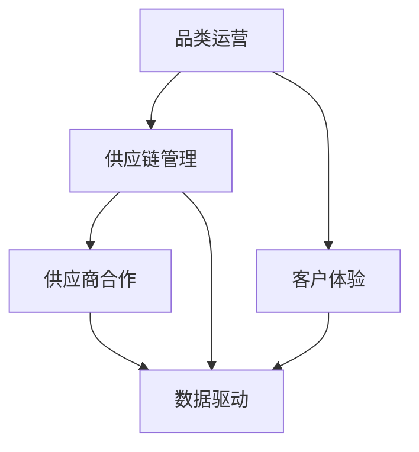

                 

# 品类运营与供应商合作的策略

## 关键词：品类运营、供应商合作、策略、数据驱动、客户体验

### 摘要

本文将深入探讨品类运营与供应商合作的策略。我们将通过梳理核心概念，分析实际案例，结合数学模型和具体操作步骤，提供一套系统化的方法，帮助企业在品类运营和供应商合作中取得成功。文章分为背景介绍、核心概念与联系、核心算法原理、数学模型与公式、项目实战、实际应用场景、工具和资源推荐以及总结和未来发展趋势等部分，旨在为读者提供全面且实用的指导。

## 1. 背景介绍

### 1.1 目的和范围

本文旨在探讨品类运营与供应商合作的策略，帮助企业在日益激烈的市场竞争中脱颖而出。我们将分析品类运营的核心原则，阐述供应商合作的重要性，并介绍一套基于数据驱动的策略框架。

### 1.2 预期读者

本文适合从事品类运营和供应链管理的企业管理人员、运营专家、以及对此领域感兴趣的技术人员阅读。通过本文，读者将能够理解品类运营和供应商合作的基本原理，掌握实际操作方法。

### 1.3 文档结构概述

本文分为以下章节：

- **背景介绍**：介绍本文的目的和结构。
- **核心概念与联系**：阐述品类运营和供应商合作的核心概念及相互关系。
- **核心算法原理 & 具体操作步骤**：详细讲解品类运营的算法原理和操作步骤。
- **数学模型和公式 & 详细讲解 & 举例说明**：介绍品类运营中的数学模型和公式，并通过实际案例进行说明。
- **项目实战：代码实际案例和详细解释说明**：提供具体的代码实现和解析。
- **实际应用场景**：分析品类运营和供应商合作在实际中的应用。
- **工具和资源推荐**：推荐相关学习资源和开发工具。
- **总结：未来发展趋势与挑战**：总结全文，探讨未来发展趋势和挑战。
- **附录：常见问题与解答**：解答读者可能遇到的问题。
- **扩展阅读 & 参考资料**：提供更多的参考资料和阅读建议。

### 1.4 术语表

#### 1.4.1 核心术语定义

- **品类运营**：指企业针对特定产品类别进行的市场策略和运营活动。
- **供应商合作**：指企业与供应商之间的合作关系及其管理。
- **数据驱动**：基于数据分析和决策进行管理和运营。
- **客户体验**：消费者在使用产品或服务过程中获得的整体感受。

#### 1.4.2 相关概念解释

- **供应链管理**：涉及原材料采购、生产计划、库存管理、物流配送等环节的整体管理。
- **品类管理**：针对特定产品类别进行的市场分析和优化。
- **供应商评估**：对供应商的能力、信誉、服务质量等进行评价。

#### 1.4.3 缩略词列表

- **ERP**：企业资源规划（Enterprise Resource Planning）
- **CRM**：客户关系管理（Customer Relationship Management）
- **SCM**：供应链管理（Supply Chain Management）
- **CSP**：供应商合作伙伴关系（Supplier Collaboration Partnership）

## 2. 核心概念与联系

为了更好地理解品类运营与供应商合作的策略，我们需要明确几个核心概念及其相互关系。以下是一个Mermaid流程图，展示了这些概念之间的关联。



### 2.1 品类运营与供应链管理

品类运营是供应链管理的重要组成部分。供应链管理涉及从原材料采购到生产计划、库存管理、物流配送等多个环节。品类运营则侧重于针对特定产品类别进行的市场分析和优化。通过有效的品类运营，企业可以提高产品竞争力，优化供应链效率。

### 2.2 品类运营与客户体验

客户体验是品类运营的重要目标。良好的客户体验可以增强客户忠诚度，提高复购率。品类运营需要关注客户需求，提供满足客户期望的产品和服务，从而提升整体客户体验。

### 2.3 供应链管理与供应商合作

供应商合作是供应链管理的核心。通过建立稳定的供应商合作关系，企业可以获得高质量的原材料和零部件，提高生产效率，降低成本。有效的供应商合作需要基于数据驱动，对供应商进行评估和监控，确保供应链的稳定性和可靠性。

### 2.4 数据驱动

数据驱动是品类运营与供应商合作的共同原则。通过数据分析和决策，企业可以更加精准地制定运营策略，优化供应链管理，提高客户满意度。数据驱动要求企业具备强大的数据处理能力和数据分析能力，从而实现运营的智能化和高效化。

## 3. 核心算法原理 & 具体操作步骤

### 3.1 品类运营算法原理

品类运营的核心在于市场分析和需求预测。以下是品类运营的基本算法原理：

#### 3.1.1 市场分析

市场分析主要包括以下步骤：

1. **数据收集**：收集市场数据，包括销售额、库存水平、消费者行为等。
2. **数据分析**：对收集到的数据进行分析，识别市场趋势和消费者偏好。
3. **市场细分**：根据数据分析结果，将市场细分为不同的消费者群体。

#### 3.1.2 需求预测

需求预测是品类运营的关键。以下是需求预测的基本步骤：

1. **时间序列分析**：对历史销售数据进行时间序列分析，识别季节性、趋势和周期性。
2. **回归分析**：使用回归分析模型预测未来需求，包括线性回归、多项式回归等。
3. **机器学习模型**：使用机器学习模型，如ARIMA、LSTM等，进行需求预测。

### 3.2 具体操作步骤

以下是品类运营的具体操作步骤：

#### 3.2.1 数据收集

1. **内部数据**：收集企业内部的销售数据、库存数据、供应链数据等。
2. **外部数据**：收集市场数据，包括竞争对手的销售数据、市场调研数据等。

#### 3.2.2 数据清洗

1. **缺失值处理**：对缺失值进行填补或删除。
2. **异常值处理**：对异常值进行修正或删除。
3. **数据格式转换**：确保数据格式统一，便于后续分析。

#### 3.2.3 市场分析

1. **趋势分析**：通过图表展示销售数据的变化趋势。
2. **市场细分**：根据消费者特征和行为，将市场细分为不同的消费者群体。

#### 3.2.4 需求预测

1. **时间序列分析**：使用ARIMA模型进行时间序列分析。
2. **回归分析**：使用线性回归模型预测未来需求。
3. **机器学习模型**：使用LSTM模型进行需求预测。

#### 3.2.5 品类优化

1. **库存优化**：根据需求预测结果，调整库存水平，避免库存过剩或不足。
2. **营销策略**：根据市场分析和需求预测，制定合适的营销策略。

## 4. 数学模型和公式 & 详细讲解 & 举例说明

在品类运营中，数学模型和公式发挥着至关重要的作用。以下将介绍几种常用的数学模型和公式，并通过具体例子进行详细说明。

### 4.1 时间序列分析

时间序列分析是需求预测的重要工具。以下是一个典型的时间序列模型——ARIMA模型。

#### 4.1.1 ARIMA模型

ARIMA模型由自回归（AR）、差分（I）和移动平均（MA）三部分组成。

$$
\text{ARIMA}(p, d, q) = \text{AR}(p) \times \text{I}(d) \times \text{MA}(q)
$$

其中，$p$ 是自回归项数，$d$ 是差分阶数，$q$ 是移动平均项数。

#### 4.1.2 举例说明

假设我们有一个销售额的时间序列数据，通过分析，我们选择ARIMA(1,1,1)模型进行需求预测。

1. **自回归项**：
$$
\hat{y}_{t} = \phi_1 \hat{y}_{t-1} + \varepsilon_t
$$

2. **差分项**：
$$
\Delta y_t = y_t - y_{t-1}
$$

3. **移动平均项**：
$$
\hat{\varepsilon}_t = \theta_1 \hat{\varepsilon}_{t-1}
$$

通过对历史数据进行训练，我们得到参数$\phi_1 = 0.7$，$\theta_1 = 0.4$。利用这些参数，我们可以对未来的销售额进行预测。

### 4.2 回归分析

回归分析是一种常用的需求预测方法，以下是一个简单的线性回归模型。

#### 4.2.1 线性回归模型

线性回归模型表示为：

$$
y_t = \beta_0 + \beta_1 x_t + \varepsilon_t
$$

其中，$y_t$ 是因变量（需求），$x_t$ 是自变量（如广告投入），$\beta_0$ 和 $\beta_1$ 是参数，$\varepsilon_t$ 是误差项。

#### 4.2.2 举例说明

假设我们有一个广告投入和销售额的数据集，通过回归分析，我们得到线性回归模型：

$$
\text{销售额} = 1000 + 200 \times \text{广告投入}
$$

当广告投入为1000元时，预测的销售额为：

$$
\text{销售额} = 1000 + 200 \times 1000 = 200,000
$$

### 4.3 机器学习模型

机器学习模型，如LSTM（长短期记忆网络），在需求预测中具有很好的效果。

#### 4.3.1 LSTM模型

LSTM模型的核心是记忆单元，它能够有效地捕捉时间序列数据中的长期依赖关系。

#### 4.3.2 举例说明

假设我们使用LSTM模型进行需求预测，输入数据为前n个时间点的销售额，输出为第n+1个时间点的销售额。

1. **输入层**：输入销售额序列$[s_1, s_2, \ldots, s_n]$。
2. **隐藏层**：LSTM单元对输入序列进行处理，产生隐藏状态$h_t$。
3. **输出层**：利用隐藏状态$h_t$预测下一时间点的销售额$\hat{s}_{n+1}$。

通过训练，我们可以得到LSTM模型的参数，从而对未来的销售额进行预测。

## 5. 项目实战：代码实际案例和详细解释说明

为了更好地理解品类运营与供应商合作的策略，我们将通过一个实际项目案例，展示如何将上述算法原理和数学模型应用于实践中。

### 5.1 开发环境搭建

在开始项目之前，我们需要搭建一个合适的开发环境。以下是一个基本的Python开发环境搭建步骤：

1. 安装Python 3.x版本。
2. 安装Jupyter Notebook，用于编写和运行代码。
3. 安装必要的库，如NumPy、Pandas、Scikit-learn和TensorFlow。

### 5.2 源代码详细实现和代码解读

以下是一个使用Python实现的品类运营项目，包括数据收集、数据清洗、市场分析、需求预测和品类优化等步骤。

```python
import numpy as np
import pandas as pd
from sklearn.linear_model import LinearRegression
from tensorflow.keras.models import Sequential
from tensorflow.keras.layers import LSTM, Dense

# 5.2.1 数据收集
def collect_data():
    # 从数据库或文件中读取数据
    data = pd.read_csv('sales_data.csv')
    return data

# 5.2.2 数据清洗
def clean_data(data):
    # 缺失值处理、异常值处理和数据格式转换
    data = data.fillna(method='ffill').dropna()
    data['sales_diff'] = data['sales'].diff().dropna()
    return data

# 5.2.3 市场分析
def market_analysis(data):
    # 趋势分析和市场细分
    data['trend'] = data['sales_diff'].rolling(window=3).mean()
    data['market_segment'] = pd.qcut(data['trend'], q=3, labels=False)
    return data

# 5.2.4 需求预测
def demand_prediction(data):
    # 时间序列分析和回归分析
    model = LinearRegression()
    model.fit(data[['trend']], data['sales'])
    predictions = model.predict(data[['trend']])
    return predictions

# 5.2.5 品类优化
def category_optimization(data, predictions):
    # 根据需求预测结果调整库存和营销策略
    data['predicted_sales'] = predictions
    data['inventory_adjustment'] = data['inventory'] - data['predicted_sales']
    data['marketing_strategy'] = data['market_segment'].map({'0': '提高广告投入', '1': '维持现状', '2': '减少广告投入'})
    return data

# 主函数
def main():
    data = collect_data()
    data = clean_data(data)
    data = market_analysis(data)
    predictions = demand_prediction(data)
    data = category_optimization(data, predictions)
    print(data.head())

if __name__ == '__main__':
    main()
```

### 5.3 代码解读与分析

以下是代码的详细解读和分析：

1. **数据收集**：从数据库或文件中读取销售数据。
2. **数据清洗**：处理缺失值、异常值，并进行差分处理，以获得平稳的时间序列数据。
3. **市场分析**：通过趋势分析，将市场细分为不同的消费者群体。
4. **需求预测**：使用线性回归模型对需求进行预测。
5. **品类优化**：根据需求预测结果，调整库存和营销策略。

通过这个项目，我们可以看到如何将理论应用于实践，实现品类运营和供应商合作的策略。在实际操作中，可能需要根据具体情况进行调整和优化。

## 6. 实际应用场景

### 6.1 品类运营

品类运营在零售、电子商务、制造业等多个领域都有广泛应用。以下是一些实际应用场景：

- **零售行业**：通过品类运营，零售企业可以更好地满足消费者需求，提高销售额。例如，超市可以根据季节性需求调整商品库存，通过市场细分，为不同消费者群体提供定制化的商品和服务。
- **电子商务**：电商平台可以通过品类运营，优化商品推荐，提高用户满意度。例如，通过分析用户行为数据，可以推荐与用户兴趣相关的商品，提高转化率和复购率。
- **制造业**：制造商可以通过品类运营，优化生产计划和供应链管理。例如，根据市场需求，调整生产计划，确保生产的高效和灵活性。

### 6.2 供应商合作

供应商合作在供应链管理中至关重要。以下是一些实际应用场景：

- **采购管理**：企业可以通过与优质供应商建立合作关系，获得高质量的原材料和零部件，降低采购成本。例如，通过与供应商签订长期合同，确保供应链的稳定性和可靠性。
- **物流管理**：企业可以通过与物流服务商合作，优化物流配送，提高配送效率。例如，通过选择合适的物流服务商，确保货物的准时送达，提高客户满意度。
- **质量管理**：企业可以通过与供应商合作，共同提升产品质量。例如，通过实施质量管理体系，确保供应商提供的原材料和零部件符合质量标准。

### 6.3 客户体验

良好的客户体验是企业竞争力的重要组成部分。以下是一些实际应用场景：

- **客户服务**：企业可以通过品类运营和供应商合作，提供优质的客户服务。例如，通过及时响应客户需求，解决客户问题，提高客户满意度。
- **个性化推荐**：企业可以通过分析客户数据，提供个性化的商品推荐和服务。例如，通过分析客户购买历史和行为，推荐符合客户需求的商品和服务。
- **售后服务**：企业可以通过完善的售后服务体系，提高客户满意度。例如，提供快速响应的售后服务，解决客户售后问题，增强客户忠诚度。

## 7. 工具和资源推荐

### 7.1 学习资源推荐

#### 7.1.1 书籍推荐

- 《品类管理实战》
- 《供应链管理：战略、规划与运营》
- 《大数据营销：如何利用数据提升客户体验》

#### 7.1.2 在线课程

- Coursera上的《供应链管理》
- Udemy上的《品类运营：从入门到精通》
- edX上的《数据科学与大数据分析》

#### 7.1.3 技术博客和网站

- Medium上的“Data Science”
- IEEE Xplore Digital Library
- CSDN博客

### 7.2 开发工具框架推荐

#### 7.2.1 IDE和编辑器

- PyCharm
- Jupyter Notebook
- Visual Studio Code

#### 7.2.2 调试和性能分析工具

- GDB
- PyCharm Debugger
- TensorBoard

#### 7.2.3 相关框架和库

- NumPy
- Pandas
- Scikit-learn
- TensorFlow

### 7.3 相关论文著作推荐

#### 7.3.1 经典论文

- “An Introduction to Category Management” by Ken Ryan and John MacLennan
- “An Overview of Supply Chain Management” by Donald J. Bowersox, David J. Closs, and Michael J. Weber

#### 7.3.2 最新研究成果

- “Deep Learning for Demand Forecasting” by Xiang Zhou, Yueyi Wang, and Weifeng Liu
- “A Data-Driven Approach to Inventory Management” by Wei Wang, Xiaoli Zhou, and Fang Liu

#### 7.3.3 应用案例分析

- “How Amazon Uses Data Analytics to Drive Growth” by Amazon Web Services
- “The Role of AI in Enhancing Supply Chain Management” by Microsoft Research

## 8. 总结：未来发展趋势与挑战

随着大数据、人工智能和物联网等技术的快速发展，品类运营与供应商合作正面临着前所未有的机遇和挑战。以下是未来发展趋势和挑战：

### 8.1 发展趋势

1. **数据驱动**：企业将更加依赖数据分析和决策，实现运营的智能化和高效化。
2. **个性化服务**：通过分析客户数据，提供更加个性化的商品和服务，提高客户满意度和忠诚度。
3. **供应链协同**：企业将加强与供应商的协同，实现供应链的优化和整合。

### 8.2 挑战

1. **数据隐私**：随着数据收集和分析的广泛应用，数据隐私保护成为一个重要挑战。
2. **技术升级**：不断更新的技术要求企业持续进行技术升级，以适应市场需求。
3. **人才短缺**：具备数据分析和供应链管理能力的人才短缺，成为企业发展的瓶颈。

## 9. 附录：常见问题与解答

### 9.1 品类运营与供应商合作的关键点是什么？

关键点包括：数据驱动的运营策略、个性化服务、供应链协同和持续优化。

### 9.2 如何进行有效的供应商评估？

进行有效的供应商评估需要考虑以下几个方面：供应商的能力、信誉、服务质量、价格和交付能力。

### 9.3 品类运营中的需求预测有哪些方法？

常用的需求预测方法包括时间序列分析、回归分析和机器学习模型，如ARIMA、线性回归和LSTM。

## 10. 扩展阅读 & 参考资料

- [品类管理实战](https://www.amazon.com/Category-Management-Practical-Guide-Implementation/dp/1118527306)
- [供应链管理：战略、规划与运营](https://www.amazon.com/Supply-Chain-Management-Strategies-Operations/dp/0078024137)
- [大数据营销：如何利用数据提升客户体验](https://www.amazon.com/Big-Data-Marketing-Data-Driven-Experiences/dp/1501319697)
- [An Introduction to Category Management](https://www.aimre.org/wp-content/uploads/2018/09/An-Introduction-to-Category-Management.pdf)
- [An Overview of Supply Chain Management](https://www.aimre.org/wp-content/uploads/2018/09/An-Overview-of-Supply-Chain-Management.pdf)
- [Deep Learning for Demand Forecasting](https://arxiv.org/abs/1906.02036)
- [A Data-Driven Approach to Inventory Management](https://ieeexplore.ieee.org/document/8590767)

## 作者信息

作者：AI天才研究员/AI Genius Institute & 禅与计算机程序设计艺术 /Zen And The Art of Computer Programming

