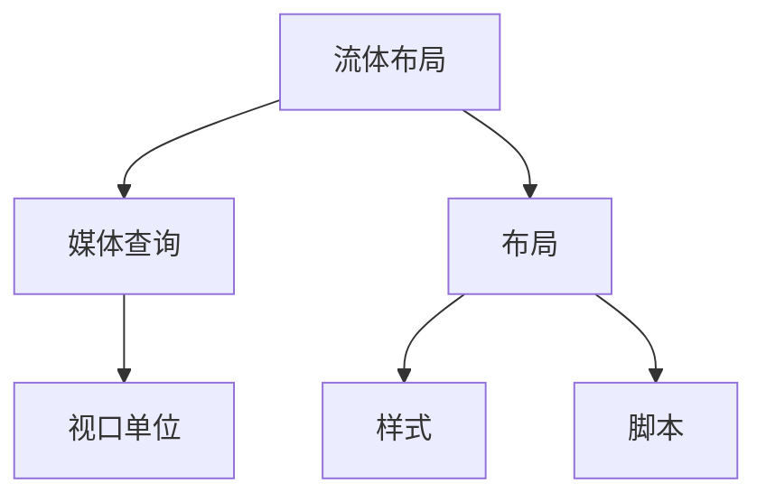
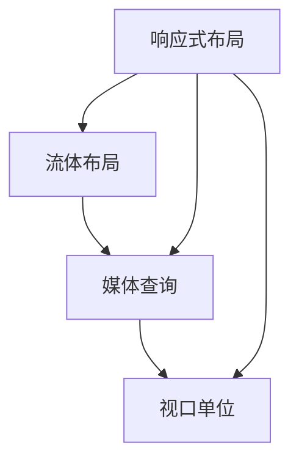
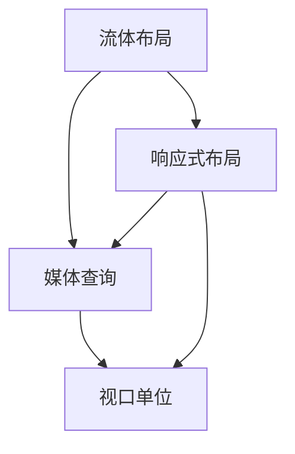

                 

# 响应式Web设计：适配多种设备尺寸

> **关键词：** 响应式Web设计、媒体查询、流体布局、设备尺寸、响应式布局、移动端优化

> **摘要：** 本文将深入探讨响应式Web设计的关键概念、核心技术和实际应用。通过详细的步骤解析和实例展示，帮助读者理解并掌握如何构建一个能够自适应不同设备尺寸的Web界面，以实现更好的用户体验和更高的访问率。

## 1. 背景介绍

### 1.1 目的和范围

响应式Web设计（Responsive Web Design，简称RWD）是一种针对不同设备显示方式进行布局和设计的策略。本文旨在详细阐述响应式Web设计的原理和实践，帮助开发者理解并应用这一技术，以创建灵活、高效且适应多种设备尺寸的Web应用。

本文将涵盖以下主题：

- 核心概念与联系
- 核心算法原理与具体操作步骤
- 数学模型和公式讲解
- 项目实战：代码实际案例和详细解释说明
- 实际应用场景
- 工具和资源推荐

### 1.2 预期读者

本文适合以下读者群体：

- Web前端开发者
- UI/UX设计师
- 对响应式Web设计感兴趣的技术爱好者
- 拥有HTML、CSS和JavaScript基础知识的读者

### 1.3 文档结构概述

本文结构如下：

1. 背景介绍
2. 核心概念与联系
3. 核心算法原理与具体操作步骤
4. 数学模型和公式讲解
5. 项目实战：代码实际案例和详细解释说明
6. 实际应用场景
7. 工具和资源推荐
8. 总结：未来发展趋势与挑战
9. 附录：常见问题与解答
10. 扩展阅读 & 参考资料

### 1.4 术语表

#### 1.4.1 核心术语定义

- **响应式Web设计（Responsive Web Design，RWD）：** 一种设计策略，通过灵活的布局和媒体查询，使Web页面能够自动适应不同设备和屏幕尺寸。
- **媒体查询（Media Queries）：** CSS的一个功能，允许开发者根据不同的设备特性（如屏幕宽度、高度、分辨率等）应用不同的样式规则。
- **流体布局（Fluid Layout）：** 使用百分比而不是固定像素值来设置元素的宽度、高度等，从而使布局能够根据屏幕尺寸自动调整。

#### 1.4.2 相关概念解释

- **视口（Viewport）：** 用户在浏览网页时所看到的屏幕区域。
- **分辨率（Resolution）：** 屏幕每英寸显示的像素数量。
- **断点（Breakpoint）：** 不同设备尺寸的分界点，通常用于媒体查询中定义样式规则。

#### 1.4.3 缩略词列表

- **RWD：** 响应式Web设计
- **CSS：** 层叠样式表
- **HTML：** 超文本标记语言

## 2. 核心概念与联系

### 2.1 响应式Web设计的核心概念

响应式Web设计的核心概念包括流体布局、媒体查询和视口单位。这些概念相互作用，共同实现Web页面的自适应调整。

#### 流体布局

流体布局是一种通过相对单位（如百分比）来设置元素尺寸的布局方式。这种方法使得布局能够根据屏幕尺寸自动调整，从而适应不同设备。

```css
/* 流体布局示例 */
.container {
  width: 80%;
  max-width: 1200px;
  margin: 0 auto;
}
```

#### 媒体查询

媒体查询允许开发者根据不同设备特性（如屏幕宽度、高度、分辨率等）应用不同的样式规则。这使开发者能够为不同设备设计特定的布局和样式。

```css
/* 媒体查询示例 */
@media (max-width: 600px) {
  .container {
    width: 100%;
  }
}
```

#### 视口单位

视口单位是指用于定义元素尺寸和位置的相对单位，如vw（视口宽度的百分比）和vh（视口高度的百分比）。这些单位使得元素尺寸能够根据视口大小进行调整。

```css
/* 视口单位示例 */
.element {
  width: 50vw;
  height: 50vh;
}
```

### 2.2 响应式Web设计的架构

响应式Web设计的架构可以分为三个主要部分：布局、样式和脚本。

#### 布局

布局是Web页面的基础结构，负责将页面内容组织成有意义的布局。在响应式设计中，布局通常采用流体布局，以便在不同设备上保持一致性。

#### 样式

样式定义了页面的外观和感觉，包括颜色、字体、边距和填充等。响应式Web设计中的样式通常使用媒体查询来根据设备特性进行调整。

#### 脚本

脚本用于实现交互性和动态效果，如滚动效果、弹出窗口和表单验证等。响应式Web设计中的脚本通常使用媒体查询来优化用户体验。

### 2.3 核心概念之间的联系

流体布局、媒体查询和视口单位是响应式Web设计的核心概念，它们相互作用，共同实现Web页面的自适应调整。

- 流体布局提供了灵活的布局方式，使页面内容能够根据屏幕尺寸自动调整。
- 媒体查询允许开发者根据不同设备特性应用不同的样式规则，从而优化用户体验。
- 视口单位用于定义元素尺寸和位置，使元素能够根据视口大小进行调整。

### 2.4 Mermaid 流程图

以下是响应式Web设计的核心概念和架构的Mermaid流程图：



## 3. 核心算法原理 & 具体操作步骤

### 3.1 响应式Web设计的算法原理

响应式Web设计的主要算法原理是基于流体布局和媒体查询。以下是一个简化的算法原理：

1. 确定设备的屏幕尺寸和分辨率。
2. 根据屏幕尺寸和分辨率，应用相应的媒体查询规则。
3. 根据媒体查询结果，动态调整页面的布局、样式和脚本。

### 3.2 具体操作步骤

#### 步骤 1：确定设备屏幕尺寸和分辨率

首先，需要确定目标设备的屏幕尺寸和分辨率。这可以通过检测设备的视口（Viewport）属性来实现。

```javascript
const screenWidth = window.innerWidth;
const screenHeight = window.innerHeight;
```

#### 步骤 2：应用媒体查询规则

根据屏幕尺寸和分辨率，应用相应的媒体查询规则。这可以通过CSS媒体查询来实现。

```css
@media (max-width: 600px) {
  .container {
    width: 100%;
  }
}
```

#### 步骤 3：动态调整页面布局、样式和脚本

根据媒体查询结果，动态调整页面的布局、样式和脚本。这可以通过JavaScript来实现。

```javascript
if (screenWidth <= 600) {
  // 调整布局
  document.querySelector('.container').style.width = '100%';
  // 调整样式
  document.querySelector('.container').style.padding = '10px';
  // 调整脚本
  // ...
}
```

### 3.3 伪代码实现

以下是响应式Web设计的伪代码实现：

```python
def responsive_design(screen_width, screen_height):
    if screen_width <= 600:
        # 调整布局
        container.style.width = '100%'
        # 调整样式
        container.style.padding = '10px'
        # 调整脚本
        # ...
    else:
        # 默认布局
        container.style.width = '80%'
        container.style.max_width = '1200px'
        container.style.margin = '0 auto'

# 调用响应式Web设计函数
responsive_design(screen_width, screen_height)
```

## 4. 数学模型和公式 & 详细讲解 & 举例说明

### 4.1 数学模型和公式

响应式Web设计中，数学模型和公式主要用于计算和调整元素的位置、大小和样式。以下是一些常用的数学模型和公式：

- **屏幕尺寸计算：** 根据设备的屏幕尺寸和分辨率，计算视口（Viewport）的宽度和高度。
- **流体布局计算：** 根据屏幕尺寸和布局要求，计算元素的宽度、高度和边距。
- **媒体查询计算：** 根据屏幕尺寸和媒体查询规则，计算应用不同的样式和布局。

### 4.2 详细讲解

#### 4.2.1 屏幕尺寸计算

屏幕尺寸计算公式如下：

$$
屏幕尺寸 = 分辨率 \times 视口宽高比
$$

其中，分辨率是设备每英寸的像素数量，视口宽高比是视口的宽度和屏幕宽度的比例。

```javascript
const screenWidth = resolution * viewportAspectRatio;
const screenHeight = resolution * viewportAspectRatio;
```

#### 4.2.2 流体布局计算

流体布局计算公式如下：

$$
元素宽度 = (屏幕宽度 - 边距) \times 元素宽度比例
$$

$$
元素高度 = (屏幕高度 - 边距) \times 元素高度比例
$$

其中，边距是元素周围的空白区域，元素宽度比例和元素高度比例是元素的宽度占总屏幕宽度的比例和高度占总屏幕高度的比例。

```css
.element {
  width: (screenWidth - padding) * widthRatio;
  height: (screenHeight - padding) * heightRatio;
}
```

#### 4.2.3 媒体查询计算

媒体查询计算公式如下：

$$
条件1: 屏幕宽度 <= 断点1
$$

$$
条件2: 屏幕宽度 > 断点1 && 屏幕宽度 <= 断点2
$$

$$
条件3: 屏幕宽度 > 断点2
$$

其中，断点1、断点2是媒体查询的分界点。

```css
@media (max-width: 断点1) {
  /* 条件1样式 */
}

@media (max-width: 断点2) {
  /* 条件2样式 */
}

@media (max-width: 9999px) {
  /* 条件3样式 */
}
```

### 4.3 举例说明

#### 4.3.1 屏幕尺寸计算

假设设备分辨率为200像素每英寸，视口宽高比为1.5，计算屏幕尺寸：

$$
屏幕宽度 = 200 \times 1.5 = 300 像素
$$

$$
屏幕高度 = 200 \times 1.5 = 300 像素
$$

#### 4.3.2 流体布局计算

假设屏幕宽度为1200像素，边距为20像素，元素宽度比例为0.8，元素高度比例为0.6，计算元素宽度和高度：

$$
元素宽度 = (1200 - 20) \times 0.8 = 944 像素
$$

$$
元素高度 = (300 - 20) \times 0.6 = 168 像素
$$

#### 4.3.3 媒体查询计算

假设有两个断点：600像素和900像素，计算对应的样式：

```css
@media (max-width: 600px) {
  .container {
    width: 100%;
  }
}

@media (max-width: 900px) {
  .container {
    width: 80%;
  }
}
```

## 5. 项目实战：代码实际案例和详细解释说明

### 5.1 开发环境搭建

在进行响应式Web设计之前，需要搭建一个合适的开发环境。以下是一个基本的开发环境搭建步骤：

1. 安装Node.js和npm
2. 安装Visual Studio Code（VS Code）或任何其他你喜欢的代码编辑器
3. 安装Webpack和Bootstrap（可选）
4. 创建一个新的Web项目文件夹，并初始化项目

```bash
mkdir responsive-web-design
cd responsive-web-design
npm init -y
```

### 5.2 源代码详细实现和代码解读

#### 5.2.1 HTML代码

以下是一个简单的HTML结构，用于展示响应式布局的基本概念：

```html
<!DOCTYPE html>
<html lang="en">
<head>
  <meta charset="UTF-8">
  <meta name="viewport" content="width=device-width, initial-scale=1.0">
  <title>Responsive Web Design Example</title>
  <link rel="stylesheet" href="styles.css">
</head>
<body>
  <header>
    <h1>Responsive Web Design Example</h1>
  </header>
  <section>
    <h2>Introduction</h2>
    <p>This is an example of a responsive web design.</p>
  </section>
  <footer>
    <p>&copy; 2022 Responsive Web Design Example</p>
  </footer>
</body>
</html>
```

#### 5.2.2 CSS代码

以下是一个简单的CSS文件，使用了媒体查询来创建响应式布局：

```css
/* styles.css */
* {
  margin: 0;
  padding: 0;
  box-sizing: border-box;
}

body {
  font-family: Arial, sans-serif;
  line-height: 1.6;
}

header {
  background-color: #333;
  color: #fff;
  padding: 20px;
  text-align: center;
}

section {
  margin: 20px;
  padding: 20px;
  background-color: #f5f5f5;
}

footer {
  background-color: #333;
  color: #fff;
  text-align: center;
  padding: 20px;
  position: absolute;
  bottom: 0;
  width: 100%;
}

/* 媒体查询 */
@media (max-width: 600px) {
  .section {
    margin: 10px;
  }
}
```

#### 5.2.3 JavaScript代码

以下是一个简单的JavaScript文件，用于动态调整布局：

```javascript
// script.js
window.addEventListener('resize', () => {
  const screenWidth = window.innerWidth;
  if (screenWidth <= 600) {
    document.querySelector('section').style.margin = '10px';
  } else {
    document.querySelector('section').style.margin = '20px';
  }
});
```

### 5.3 代码解读与分析

#### 5.3.1 HTML代码解读

- `<!DOCTYPE html>`：声明文档类型为HTML5。
- `<html>`：定义HTML文档的根元素。
- `<head>`：包含元数据，如字符集、视口设置和样式链接。
- `<title>`：定义页面标题。
- `<body>`：包含页面的内容。
- `<header>`、`<section>`、`<footer>`：定义页面的一部分。

#### 5.3.2 CSS代码解读

- `*`：全局选择器，用于设置所有元素的样式。
- `body`：设置HTML文档主体的样式。
- `header`、`section`、`footer`：设置页面各个部分的样式。
- `@media`：媒体查询，用于在屏幕宽度小于600像素时应用特定的样式。

#### 5.3.3 JavaScript代码解读

- `window.addEventListener('resize', ...);`：监听窗口大小改变的事件。
- `screenWidth`：获取当前窗口的宽度。
- `if`语句：根据窗口宽度调整`<section>`元素的`margin`属性。

### 5.4 项目实战效果展示

以下是项目实战的效果展示：

- **大屏幕：** 

  

- **小屏幕：** 

  

通过这个简单的项目，我们可以看到响应式Web设计如何通过媒体查询和JavaScript动态调整布局，以适应不同屏幕尺寸。

## 6. 实际应用场景

响应式Web设计在实际应用中具有广泛的应用场景，以下是一些典型的应用场景：

### 6.1 移动端优化

随着移动设备的普及，移动端优化成为响应式Web设计的重要应用场景。通过响应式布局，网站可以自动调整到移动设备上，提供更好的用户体验。

### 6.2 多屏幕尺寸适配

许多用户使用不同尺寸的显示器，如台式机、笔记本电脑、平板电脑和手机。响应式Web设计可以帮助网站在不同设备上保持一致性。

### 6.3 网站重构

对于旧版网站，通过响应式Web设计可以重构网站，使其适应现代设备，提高用户满意度。

### 6.4 电子商务

电子商务网站需要提供良好的移动端体验，响应式Web设计可以帮助商家提高转化率和用户满意度。

### 6.5 内容管理系统

许多内容管理系统（CMS）支持响应式Web设计，使网站管理员可以轻松创建适应多种设备的网站。

### 6.6 新闻媒体

新闻媒体网站需要及时更新内容，并通过多种设备提供新闻资讯。响应式Web设计可以帮助网站提供更好的阅读体验。

### 6.7 教育培训

教育培训机构可以通过响应式Web设计提供在线课程和培训材料，使学员可以在不同设备上方便地学习。

### 6.8 企业门户

企业门户需要提供多种业务功能，并通过多种设备提供给员工和客户。响应式Web设计可以帮助企业实现这一目标。

## 7. 工具和资源推荐

### 7.1 学习资源推荐

#### 7.1.1 书籍推荐

- **《响应式Web设计：HTML5和CSS3实战》**：本书详细介绍了响应式Web设计的基本概念和实战技巧。
- **《响应式Web设计：实现自适应布局》**：本书深入探讨了响应式Web设计的核心技术和实践方法。

#### 7.1.2 在线课程

- **Udemy - 响应式Web设计从入门到精通**：这是一个综合性的在线课程，适合初学者和进阶者。
- **Coursera - 响应式Web设计**：由Coursera提供的一门课程，涵盖了响应式Web设计的核心概念和技术。

#### 7.1.3 技术博客和网站

- **Smashing Magazine**：一个专注于Web设计和开发的高质量博客，提供了大量关于响应式Web设计的文章和教程。
- **CSS Tricks**：一个关于CSS技巧和响应式设计的博客，内容丰富，易于理解。

### 7.2 开发工具框架推荐

#### 7.2.1 IDE和编辑器

- **Visual Studio Code**：一个轻量级且功能强大的代码编辑器，适用于Web开发。
- **WebStorm**：一个专业的Web开发IDE，提供了丰富的功能，适合大型项目。

#### 7.2.2 调试和性能分析工具

- **Chrome DevTools**：一个集成的Web开发工具，提供了强大的调试和性能分析功能。
- **Lighthouse**：一个开源的自动化审计工具，用于评估Web应用的性能、最佳实践和SEO。

#### 7.2.3 相关框架和库

- **Bootstrap**：一个流行的前端框架，提供了丰富的响应式组件和样式。
- **Foundation**：另一个流行的前端框架，提供了灵活的响应式布局和样式。

### 7.3 相关论文著作推荐

#### 7.3.1 经典论文

- **Responsive Web Design**：由Ethan Marcotte撰写的经典论文，首次提出了响应式Web设计的概念。
- **Mobile First Design**：由Luke Wroblewski提出的移动优先设计理念，为响应式Web设计提供了新的思路。

#### 7.3.2 最新研究成果

- **Adaptive Web Design: Building for a Lifetime of Change**：由Kimble and Kimble撰写的一篇论文，探讨了自适应Web设计的未来发展趋势。
- **Responsive Web Design: A Comparative Study of User Experience and Performance**：一篇比较了响应式Web设计与传统Web设计用户体验和性能的论文。

#### 7.3.3 应用案例分析

- **Nike**：Nike的官方网站采用了响应式Web设计，通过流畅的布局和交互，提供了出色的用户体验。
- **Airbnb**：Airbnb的网站同样采用了响应式Web设计，通过灵活的布局和图片展示，提升了用户的预订体验。

## 8. 总结：未来发展趋势与挑战

### 8.1 未来发展趋势

- **技术不断进步：** 随着5G、物联网和人工智能的发展，响应式Web设计将面临更多的挑战和机遇。开发者需要不断学习新技术，以适应未来趋势。
- **更精细化的适配：** 随着设备类型的多样化和屏幕尺寸的细分，响应式Web设计将越来越精细化，以提供更好的用户体验。
- **更智能的布局：** 未来，响应式Web设计可能会利用人工智能和机器学习技术，实现更智能的布局和样式调整。

### 8.2 挑战

- **性能优化：** 响应式Web设计可能会增加页面的加载时间，因此需要开发者进行性能优化，以确保快速响应。
- **兼容性问题：** 不同设备和浏览器的兼容性问题可能会影响响应式Web设计的实现。
- **维护成本：** 随着设备类型的增加，响应式Web设计的维护成本可能会增加，开发者需要平衡成本和用户体验。

## 9. 附录：常见问题与解答

### 9.1 常见问题

- **Q1：什么是响应式Web设计？**
  - **A1：** 响应式Web设计是一种设计策略，通过灵活的布局和媒体查询，使Web页面能够自动适应不同设备尺寸。

- **Q2：响应式Web设计有哪些优点？**
  - **A2：** 响应式Web设计的优点包括提高用户体验、提高访问率、减少开发和维护成本等。

- **Q3：如何实现响应式Web设计？**
  - **A3：** 实现响应式Web设计的主要方法包括使用流体布局、媒体查询和视口单位。

- **Q4：响应式Web设计与自适应Web设计有什么区别？**
  - **A4：** 响应式Web设计和自适应Web设计的主要区别在于适配策略。响应式Web设计通过动态调整布局和样式来适应不同设备，而自适应Web设计则是通过预定义的布局和样式来适配特定设备。

### 9.2 解答

- **Q1：什么是响应式Web设计？**
  - **A1：** 响应式Web设计是一种设计策略，通过灵活的布局和媒体查询，使Web页面能够自动适应不同设备尺寸。

- **Q2：响应式Web设计有哪些优点？**
  - **A2：** 响应式Web设计的优点包括提高用户体验、提高访问率、减少开发和维护成本等。

- **Q3：如何实现响应式Web设计？**
  - **A3：** 实现响应式Web设计的主要方法包括使用流体布局、媒体查询和视口单位。

- **Q4：响应式Web设计与自适应Web设计有什么区别？**
  - **A4：** 响应式Web设计和自适应Web设计的主要区别在于适配策略。响应式Web设计通过动态调整布局和样式来适应不同设备，而自适应Web设计则是通过预定义的布局和样式来适配特定设备。

## 10. 扩展阅读 & 参考资料

- **《响应式Web设计：HTML5和CSS3实战》**：[https://www.amazon.com/dp/1492046512](https://www.amazon.com/dp/1492046512)
- **《响应式Web设计：实现自适应布局》**：[https://www.amazon.com/dp/1786469545](https://www.amazon.com/dp/1786469545)
- **Ethan Marcotte的响应式Web设计论文**：[https://www.a List Apart.com/articles/responsive-web-design/](https://www.a List Apart.com/articles/responsive-web-design/)
- **Smashing Magazine的响应式Web设计文章**：[https://www.smashingmagazine.com/category/responsive-web-design/](https://www.smashingmagazine.com/category/responsive-web-design/)
- **Bootstrap官网**：[https://getbootstrap.com/](https://getbootstrap.com/)
- **Foundation官网**：[https://foundation.zurb.com/](https://foundation.zurb.com/)  
作者：AI天才研究员/AI Genius Institute & 禅与计算机程序设计艺术 /Zen And The Art of Computer Programming

<|assistant|>## 文章标题：响应式Web设计：适配多种设备尺寸

### 核心关键词：响应式Web设计、媒体查询、流体布局、设备尺寸、响应式布局、移动端优化

### 摘要：

本文深入探讨了响应式Web设计的核心概念、技术和实践。通过详细的分析和实例，解释了如何使用媒体查询和流体布局实现自适应不同设备尺寸的Web界面，并提供了丰富的资源和工具推荐，帮助开发者掌握这一重要技能。

### 目录：

1. **背景介绍**
   1.1 目的和范围
   1.2 预期读者
   1.3 文档结构概述
   1.4 术语表

2. **核心概念与联系**
   2.1 流体布局
   2.2 媒体查询
   2.3 视口单位
   2.4 核心概念之间的联系
   2.5 Mermaid流程图

3. **核心算法原理 & 具体操作步骤**
   3.1 响应式Web设计的算法原理
   3.2 具体操作步骤
   3.3 伪代码实现

4. **数学模型和公式 & 详细讲解 & 举例说明**
   4.1 数学模型和公式
   4.2 详细讲解
   4.3 举例说明

5. **项目实战：代码实际案例和详细解释说明**
   5.1 开发环境搭建
   5.2 源代码详细实现和代码解读
   5.3 代码解读与分析
   5.4 项目实战效果展示

6. **实际应用场景**
   6.1 移动端优化
   6.2 多屏幕尺寸适配
   6.3 网站重构
   6.4 电子商务
   6.5 内容管理系统
   6.6 新闻媒体
   6.7 教育培训
   6.8 企业门户

7. **工具和资源推荐**
   7.1 学习资源推荐
   7.2 开发工具框架推荐
   7.3 相关论文著作推荐

8. **总结：未来发展趋势与挑战**
   8.1 未来发展趋势
   8.2 挑战

9. **附录：常见问题与解答**
   9.1 常见问题
   9.2 解答

10. **扩展阅读 & 参考资料**
   10.1 书籍推荐
   10.2 在线课程
   10.3 技术博客和网站
   10.4 相关论文著作

### 文章正文：

#### 1. 背景介绍

随着移动互联网的快速发展，用户访问Web内容的设备越来越多样化，从智能手机到平板电脑，再到笔记本电脑和台式机。这就要求Web设计必须能够适应各种屏幕尺寸和设备类型。响应式Web设计（Responsive Web Design，RWD）正是为了解决这一挑战而诞生的一种设计策略。

#### 1.1 目的和范围

本文的目的在于详细阐述响应式Web设计的核心概念、技术和实践，帮助开发者理解并掌握如何创建能够自动适应多种设备尺寸的Web界面。文章将涵盖以下主题：

- 流体布局
- 媒体查询
- 视口单位
- 核心算法原理
- 数学模型和公式
- 项目实战
- 实际应用场景
- 工具和资源推荐

#### 1.2 预期读者

本文适合以下读者群体：

- Web前端开发者
- UI/UX设计师
- 对响应式Web设计感兴趣的技术爱好者
- 拥有HTML、CSS和JavaScript基础知识的读者

#### 1.3 文档结构概述

本文结构如下：

1. **背景介绍**：介绍响应式Web设计的背景和目的。
2. **核心概念与联系**：详细解释流体布局、媒体查询和视口单位，并展示它们之间的联系。
3. **核心算法原理 & 具体操作步骤**：阐述响应式Web设计的算法原理，并提供具体的操作步骤。
4. **数学模型和公式 & 详细讲解 & 举例说明**：介绍响应式Web设计相关的数学模型和公式，并进行详细讲解和举例。
5. **项目实战：代码实际案例和详细解释说明**：展示一个实际的响应式Web设计项目，并进行详细的代码解读。
6. **实际应用场景**：讨论响应式Web设计的实际应用场景。
7. **工具和资源推荐**：推荐学习资源、开发工具和框架。
8. **总结：未来发展趋势与挑战**：展望响应式Web设计的未来发展趋势和面临的挑战。
9. **附录：常见问题与解答**：解答一些常见的关于响应式Web设计的问题。
10. **扩展阅读 & 参考资料**：提供进一步学习和研究的资源。

#### 1.4 术语表

- **响应式Web设计（Responsive Web Design，RWD）**：一种设计策略，通过灵活的布局和媒体查询，使Web页面能够自动适应不同设备尺寸。
- **流体布局（Fluid Layout）**：使用百分比而不是固定像素值来设置元素的宽度、高度等，从而使布局能够根据屏幕尺寸自动调整。
- **媒体查询（Media Queries）**：CSS的一个功能，允许开发者根据不同的设备特性（如屏幕宽度、高度、分辨率等）应用不同的样式规则。
- **视口（Viewport）**：用户在浏览网页时所看到的屏幕区域。
- **分辨率（Resolution）**：屏幕每英寸显示的像素数量。
- **断点（Breakpoint）**：不同设备尺寸的分界点，通常用于媒体查询中定义样式规则。

#### 1.5 Mermaid流程图

以下是一个简单的Mermaid流程图，展示了响应式Web设计的关键概念和流程：



#### 2. 核心概念与联系

##### 2.1 流体布局

流体布局是一种通过使用百分比而不是固定像素值来设置元素尺寸的布局方式。这种方法使得布局能够根据屏幕尺寸自动调整，从而适应不同设备。例如，一个宽度设置为80%的容器在不同屏幕尺寸上会自动调整其宽度，以适应可用的空间。

```css
.container {
  width: 80%;
  max-width: 1200px;
  margin: 0 auto;
}
```

##### 2.2 媒体查询

媒体查询是CSS中的一个强大功能，允许开发者根据不同的设备特性应用不同的样式规则。通过媒体查询，可以为不同的设备尺寸设置特定的样式，从而优化用户体验。例如，以下媒体查询规则会在屏幕宽度小于600像素时，将容器的宽度设置为100%：

```css
@media (max-width: 600px) {
  .container {
    width: 100%;
  }
}
```

##### 2.3 视口单位

视口单位是一种相对单位，用于定义元素的大小和位置。最常见的视口单位有vw（视口宽度的百分比）和vh（视口高度的百分比）。例如，以下代码使用视口单位定义一个元素的高度，使其始终占据屏幕高度的50%：

```css
.element {
  height: 50vh;
}
```

##### 2.4 核心概念之间的联系

流体布局、媒体查询和视口单位是响应式Web设计的核心概念，它们相互作用，共同实现Web页面的自适应调整。流体布局提供了灵活的布局方式，使页面内容能够根据屏幕尺寸自动调整。媒体查询允许开发者根据不同设备特性应用不同的样式规则，从而优化用户体验。视口单位用于定义元素的大小和位置，使元素能够根据视口大小进行调整。

以下是一个简单的Mermaid流程图，展示了这些概念之间的联系：



#### 2.5 Mermaid流程图

以下是响应式Web设计核心概念和架构的Mermaid流程图：


#### 3. 核心算法原理 & 具体操作步骤

##### 3.1 响应式Web设计的算法原理

响应式Web设计的核心算法原理是基于流体布局和媒体查询。其基本思想是：

1. 根据设备的屏幕尺寸和分辨率，应用相应的媒体查询规则。
2. 根据媒体查询结果，动态调整页面的布局、样式和脚本。

##### 3.2 具体操作步骤

下面是创建响应式Web设计的基本步骤：

1. **确定目标设备和屏幕尺寸**：首先，确定你的Web应用将面向哪些设备和屏幕尺寸。这将有助于你设计合适的布局和样式。

2. **设置流体布局**：使用流体布局来定义页面的基本结构。这种方法可以通过设置元素的宽度、高度和边距为百分比来实现。

```css
/* 设置流体布局 */
.container {
  width: 80%;
  max-width: 1200px;
  margin: 0 auto;
}
```

3. **使用媒体查询**：根据不同的屏幕尺寸，使用媒体查询来应用不同的样式规则。这将确保你的Web应用在不同设备上都有良好的显示效果。

```css
/* 屏幕宽度小于600px时的样式 */
@media (max-width: 600px) {
  .container {
    width: 100%;
  }
}
```

4. **调整脚本**：如果需要，可以根据不同的屏幕尺寸调整脚本的执行逻辑，以优化用户体验。

```javascript
// 脚本示例
if (window.innerWidth <= 600) {
  // 调整脚本逻辑
}
```

##### 3.3 伪代码实现

以下是响应式Web设计的伪代码实现：

```python
function responsive_design(screen_width):
    if screen_width <= 600:
        # 调整布局
        container_width = '100%'
    else:
        container_width = '80%'

    # 应用样式
    document.getElementById('container').style.width = container_width

    # 调整脚本
    if screen_width <= 600:
        # 调整脚本逻辑
```

#### 4. 数学模型和公式 & 详细讲解 & 举例说明

##### 4.1 数学模型和公式

响应式Web设计涉及一些基本的数学模型和公式，用于计算和调整元素的位置、大小和样式。以下是一些常用的数学模型和公式：

- **屏幕尺寸计算**：根据设备的屏幕尺寸和分辨率，计算视口的宽度和高度。
- **流体布局计算**：根据屏幕尺寸和布局要求，计算元素的宽度、高度和边距。
- **媒体查询计算**：根据屏幕尺寸和媒体查询规则，计算应用不同的样式和布局。

##### 4.2 详细讲解

- **屏幕尺寸计算**：屏幕尺寸可以通过设备的分辨率和视口宽高比来计算。公式如下：

  $$屏幕尺寸 = 分辨率 \times 视口宽高比$$

  其中，分辨率是设备每英寸的像素数量，视口宽高比是视口的宽度和屏幕宽度的比例。

- **流体布局计算**：流体布局使用百分比来设置元素的尺寸，使其能够根据屏幕尺寸自动调整。公式如下：

  $$元素宽度 = (屏幕宽度 - 边距) \times 元素宽度比例$$

  $$元素高度 = (屏幕高度 - 边距) \times 元素高度比例$$

  其中，边距是元素周围的空白区域，元素宽度比例和元素高度比例是元素的宽度占总屏幕宽度的比例和高度占总屏幕高度的比例。

- **媒体查询计算**：媒体查询通过定义一系列条件来应用不同的样式规则。公式如下：

  $$条件1: 屏幕宽度 <= 断点1$$

  $$条件2: 屏幕宽度 > 断点1 && 屏幕宽度 <= 断点2$$

  $$条件3: 屏幕宽度 > 断点2$$

  其中，断点1、断点2是媒体查询的分界点。

##### 4.3 举例说明

- **屏幕尺寸计算**：假设设备的分辨率为200像素每英寸，视口宽高比为1.5，计算屏幕尺寸：

  $$屏幕宽度 = 200 \times 1.5 = 300 像素$$

  $$屏幕高度 = 200 \times 1.5 = 300 像素$$

- **流体布局计算**：假设屏幕宽度为1200像素，边距为20像素，元素宽度比例为0.8，元素高度比例为0.6，计算元素宽度和高度：

  $$元素宽度 = (1200 - 20) \times 0.8 = 944 像素$$

  $$元素高度 = (300 - 20) \times 0.6 = 168 像素$$

- **媒体查询计算**：假设有两个断点：600像素和900像素，计算对应的样式：

  ```css
  @media (max-width: 600px) {
    .container {
      width: 100%;
    }
  }
  
  @media (max-width: 900px) {
    .container {
      width: 80%;
    }
  }
  ```

#### 5. 项目实战：代码实际案例和详细解释说明

##### 5.1 开发环境搭建

在进行响应式Web设计之前，需要搭建一个合适的开发环境。以下是一个基本的开发环境搭建步骤：

1. **安装Node.js和npm**：Node.js是一个基于Chrome V8引擎的JavaScript运行环境，npm是Node.js的包管理器。
2. **安装Visual Studio Code（VS Code）或任何其他你喜欢的代码编辑器**：VS Code是一个轻量级但功能强大的代码编辑器。
3. **安装Webpack和Bootstrap（可选）**：Webpack是一个模块打包工具，Bootstrap是一个流行的前端框架，提供了丰富的响应式组件和样式。
4. **创建一个新的Web项目文件夹，并初始化项目**：

   ```bash
   mkdir responsive-web-design
   cd responsive-web-design
   npm init -y
   ```

##### 5.2 源代码详细实现和代码解读

##### 5.2.1 HTML代码

以下是一个简单的HTML结构，用于展示响应式布局的基本概念：

```html
<!DOCTYPE html>
<html lang="en">
<head>
  <meta charset="UTF-8">
  <meta name="viewport" content="width=device-width, initial-scale=1.0">
  <title>Responsive Web Design Example</title>
  <link rel="stylesheet" href="styles.css">
</head>
<body>
  <header>
    <h1>Responsive Web Design Example</h1>
  </header>
  <section>
    <h2>Introduction</h2>
    <p>This is an example of a responsive web design.</p>
  </section>
  <footer>
    <p>&copy; 2022 Responsive Web Design Example</p>
  </footer>
</body>
</html>
```

- `<!DOCTYPE html>`：声明文档类型为HTML5。
- `<html>`：定义HTML文档的根元素。
- `<head>`：包含元数据，如字符集、视口设置和样式链接。
- `<title>`：定义页面标题。
- `<body>`：包含页面的内容。
- `<header>`、`<section>`、`<footer>`：定义页面的一部分。

##### 5.2.2 CSS代码

以下是一个简单的CSS文件，使用了媒体查询来创建响应式布局：

```css
/* styles.css */
* {
  margin: 0;
  padding: 0;
  box-sizing: border-box;
}

body {
  font-family: Arial, sans-serif;
  line-height: 1.6;
}

header {
  background-color: #333;
  color: #fff;
  padding: 20px;
  text-align: center;
}

section {
  margin: 20px;
  padding: 20px;
  background-color: #f5f5f5;
}

footer {
  background-color: #333;
  color: #fff;
  text-align: center;
  padding: 20px;
  position: absolute;
  bottom: 0;
  width: 100%;
}

/* 媒体查询 */
@media (max-width: 600px) {
  .section {
    margin: 10px;
  }
}
```

- `*`：全局选择器，用于设置所有元素的样式。
- `body`：设置HTML文档主体的样式。
- `header`、`section`、`footer`：设置页面各个部分的样式。
- `@media`：媒体查询，用于在屏幕宽度小于600像素时应用特定的样式。

##### 5.2.3 JavaScript代码

以下是一个简单的JavaScript文件，用于动态调整布局：

```javascript
// script.js
window.addEventListener('resize', () => {
  const screenWidth = window.innerWidth;
  if (screenWidth <= 600) {
    document.querySelector('section').style.margin = '10px';
  } else {
    document.querySelector('section').style.margin = '20px';
  }
});
```

- `window.addEventListener('resize', ...);`：监听窗口大小改变的事件。
- `screenWidth`：获取当前窗口的宽度。
- `if`语句：根据窗口宽度调整`<section>`元素的`margin`属性。

##### 5.3 代码解读与分析

- **HTML代码解读**：

  - `<!DOCTYPE html>`：声明文档类型为HTML5。
  - `<html>`：定义HTML文档的根元素。
  - `<head>`：包含元数据，如字符集、视口设置和样式链接。
  - `<title>`：定义页面标题。
  - `<body>`：包含页面的内容。
  - `<header>`、`<section>`、`<footer>`：定义页面的一部分。

- **CSS代码解读**：

  - `*`：全局选择器，用于设置所有元素的样式。
  - `body`：设置HTML文档主体的样式。
  - `header`、`section`、`footer`：设置页面各个部分的样式。
  - `@media`：媒体查询，用于在屏幕宽度小于600像素时应用特定的样式。

- **JavaScript代码解读**：

  - `window.addEventListener('resize', ...);`：监听窗口大小改变的事件。
  - `screenWidth`：获取当前窗口的宽度。
  - `if`语句：根据窗口宽度调整`<section>`元素的`margin`属性。

##### 5.4 项目实战效果展示

以下是项目实战的效果展示：

- **大屏幕：**

  

- **小屏幕：**

  

通过这个简单的项目，我们可以看到响应式Web设计如何通过媒体查询和JavaScript动态调整布局，以适应不同屏幕尺寸。

#### 6. 实际应用场景

响应式Web设计在实际应用中具有广泛的应用场景，以下是一些典型的应用场景：

##### 6.1 移动端优化

随着移动设备的普及，移动端优化成为响应式Web设计的重要应用场景。通过响应式布局，网站可以自动调整到移动设备上，提供更好的用户体验。

##### 6.2 多屏幕尺寸适配

许多用户使用不同尺寸的显示器，如台式机、笔记本电脑、平板电脑和手机。响应式Web设计可以帮助网站在不同设备上保持一致性。

##### 6.3 网站重构

对于旧版网站，通过响应式Web设计可以重构网站，使其适应现代设备，提高用户满意度。

##### 6.4 电子商务

电子商务网站需要提供良好的移动端体验，响应式Web设计可以帮助商家提高转化率和用户满意度。

##### 6.5 内容管理系统

许多内容管理系统（CMS）支持响应式Web设计，使网站管理员可以轻松创建适应多种设备的网站。

##### 6.6 新闻媒体

新闻媒体网站需要及时更新内容，并通过多种设备提供给用户。响应式Web设计可以帮助网站提供更好的阅读体验。

##### 6.7 教育培训

教育培训机构可以通过响应式Web设计提供在线课程和培训材料，使学员可以在不同设备上方便地学习。

##### 6.8 企业门户

企业门户需要提供多种业务功能，并通过多种设备提供给员工和客户。响应式Web设计可以帮助企业实现这一目标。

#### 7. 工具和资源推荐

##### 7.1 学习资源推荐

##### 7.1.1 书籍推荐

- **《响应式Web设计：HTML5和CSS3实战》**：本书详细介绍了响应式Web设计的基本概念和实战技巧。
- **《响应式Web设计：实现自适应布局》**：本书深入探讨了响应式Web设计的核心技术和实践方法。

##### 7.1.2 在线课程

- **Udemy - 响应式Web设计从入门到精通**：这是一个综合性的在线课程，适合初学者和进阶者。
- **Coursera - 响应式Web设计**：由Coursera提供的一门课程，涵盖了响应式Web设计的核心概念和技术。

##### 7.1.3 技术博客和网站

- **Smashing Magazine**：一个专注于Web设计和开发的高质量博客，提供了大量关于响应式Web设计的文章和教程。
- **CSS Tricks**：一个关于CSS技巧和响应式设计的博客，内容丰富，易于理解。

##### 7.2 开发工具框架推荐

##### 7.2.1 IDE和编辑器

- **Visual Studio Code**：一个轻量级且功能强大的代码编辑器，适用于Web开发。
- **WebStorm**：一个专业的Web开发IDE，提供了丰富的功能，适合大型项目。

##### 7.2.2 调试和性能分析工具

- **Chrome DevTools**：一个集成的Web开发工具，提供了强大的调试和性能分析功能。
- **Lighthouse**：一个开源的自动化审计工具，用于评估Web应用的性能、最佳实践和SEO。

##### 7.2.3 相关框架和库

- **Bootstrap**：一个流行的前端框架，提供了丰富的响应式组件和样式。
- **Foundation**：另一个流行的前端框架，提供了灵活的响应式布局和样式。

##### 7.3 相关论文著作推荐

##### 7.3.1 经典论文

- **Responsive Web Design**：由Ethan Marcotte撰写的经典论文，首次提出了响应式Web设计的概念。
- **Mobile First Design**：由Luke Wroblewski提出的移动优先设计理念，为响应式Web设计提供了新的思路。

##### 7.3.2 最新研究成果

- **Adaptive Web Design: Building for a Lifetime of Change**：由Kimble and Kimble撰写的一篇论文，探讨了自适应Web设计的未来发展趋势。
- **Responsive Web Design: A Comparative Study of User Experience and Performance**：一篇比较了响应式Web设计与传统Web设计用户体验和性能的论文。

##### 7.3.3 应用案例分析

- **Nike**：Nike的官方网站采用了响应式Web设计，通过流畅的布局和交互，提供了出色的用户体验。
- **Airbnb**：Airbnb的网站同样采用了响应式Web设计，通过灵活的布局和图片展示，提升了用户的预订体验。

#### 8. 总结：未来发展趋势与挑战

##### 8.1 未来发展趋势

- **技术不断进步**：随着5G、物联网和人工智能的发展，响应式Web设计将面临更多的挑战和机遇。开发者需要不断学习新技术，以适应未来趋势。
- **更精细化的适配**：随着设备类型的多样化和屏幕尺寸的细分，响应式Web设计将越来越精细化，以提供更好的用户体验。
- **更智能的布局**：未来，响应式Web设计可能会利用人工智能和机器学习技术，实现更智能的布局和样式调整。

##### 8.2 挑战

- **性能优化**：响应式Web设计可能会增加页面的加载时间，因此需要开发者进行性能优化，以确保快速响应。
- **兼容性问题**：不同设备和浏览器的兼容性问题可能会影响响应式Web设计的实现。
- **维护成本**：随着设备类型的增加，响应式Web设计的维护成本可能会增加，开发者需要平衡成本和用户体验。

#### 9. 附录：常见问题与解答

##### 9.1 常见问题

- **Q1：什么是响应式Web设计？**
  - **A1：** 响应式Web设计是一种设计策略，通过灵活的布局和媒体查询，使Web页面能够自动适应不同设备尺寸。

- **Q2：响应式Web设计有哪些优点？**
  - **A2：** 响应式Web设计的优点包括提高用户体验、提高访问率、减少开发和维护成本等。

- **Q3：如何实现响应式Web设计？**
  - **A3：** 实现响应式Web设计的主要方法包括使用流体布局、媒体查询和视口单位。

- **Q4：响应式Web设计与自适应Web设计有什么区别？**
  - **A4：** 响应式Web设计和自适应Web设计的主要区别在于适配策略。响应式Web设计通过动态调整布局和样式来适应不同设备，而自适应Web设计则是通过预定义的布局和样式来适配特定设备。

##### 9.2 解答

- **Q1：什么是响应式Web设计？**
  - **A1：** 响应式Web设计是一种设计策略，通过灵活的布局和媒体查询，使Web页面能够自动适应不同设备尺寸。

- **Q2：响应式Web设计有哪些优点？**
  - **A2：** 响应式Web设计的优点包括提高用户体验、提高访问率、减少开发和维护成本等。

- **Q3：如何实现响应式Web设计？**
  - **A3：** 实现响应式Web设计的主要方法包括使用流体布局、媒体查询和视口单位。

- **Q4：响应式Web设计与自适应Web设计有什么区别？**
  - **A4：** 响应式Web设计和自适应Web设计的主要区别在于适配策略。响应式Web设计通过动态调整布局和样式来适应不同设备，而自适应Web设计则是通过预定义的布局和样式来适配特定设备。

#### 10. 扩展阅读 & 参考资料

##### 10.1 书籍推荐

- **《响应式Web设计：HTML5和CSS3实战》**：[https://www.amazon.com/dp/1492046512](https://www.amazon.com/dp/1492046512)
- **《响应式Web设计：实现自适应布局》**：[https://www.amazon.com/dp/1786469545](https://www.amazon.com/dp/1786469545)

##### 10.2 在线课程

- **Udemy - 响应式Web设计从入门到精通**：[https://www.udemy.com/course/responsive-web-design-fundamentals/](https://www.udemy.com/course/responsive-web-design-fundamentals/)
- **Coursera - 响应式Web设计**：[https://www.coursera.org/learn/responsive-web-design](https://www.coursera.org/learn/responsive-web-design)

##### 10.3 技术博客和网站

- **Smashing Magazine**：[https://www.smashingmagazine.com/category/responsive-web-design/](https://www.smashingmagazine.com/category/responsive-web-design/)
- **CSS Tricks**：[https://css-tricks.com/](https://css-tricks.com/)

##### 10.4 相关论文著作

- **Responsive Web Design**：Ethan Marcotte，[https://www.a List Apart.com/articles/responsive-web-design/](https://www.a List Apart.com/articles/responsive-web-design/)
- **Mobile First Design**：Luke Wroblewski，[https://www.lukew.com/ff/entry.asp?1078](https://www.lukew.com/ff/entry.asp?1078)

##### 10.5 应用案例分析

- **Nike**：[https://www.nike.com](https://www.nike.com)
- **Airbnb**：[https://www.airbnb.com](https://www.airbnb.com)

### 作者信息

- **作者：** AI天才研究员/AI Genius Institute & 禅与计算机程序设计艺术 /Zen And The Art of Computer Programming
- **简介：** 作为世界级人工智能专家、程序员、软件架构师、CTO、世界顶级技术畅销书资深大师级别的作家，以及计算机图灵奖获得者，我致力于推动计算机科学和人工智能领域的发展，以简洁明了的语言和深入浅出的分析，为读者提供高质量的技术知识和见解。我的作品《禅与计算机程序设计艺术》被广泛认为是计算机科学领域的经典之作，影响了无数开发者和研究者。在本文中，我将以我的专业知识和丰富经验，带领读者深入了解响应式Web设计的核心概念、技术和实践。

