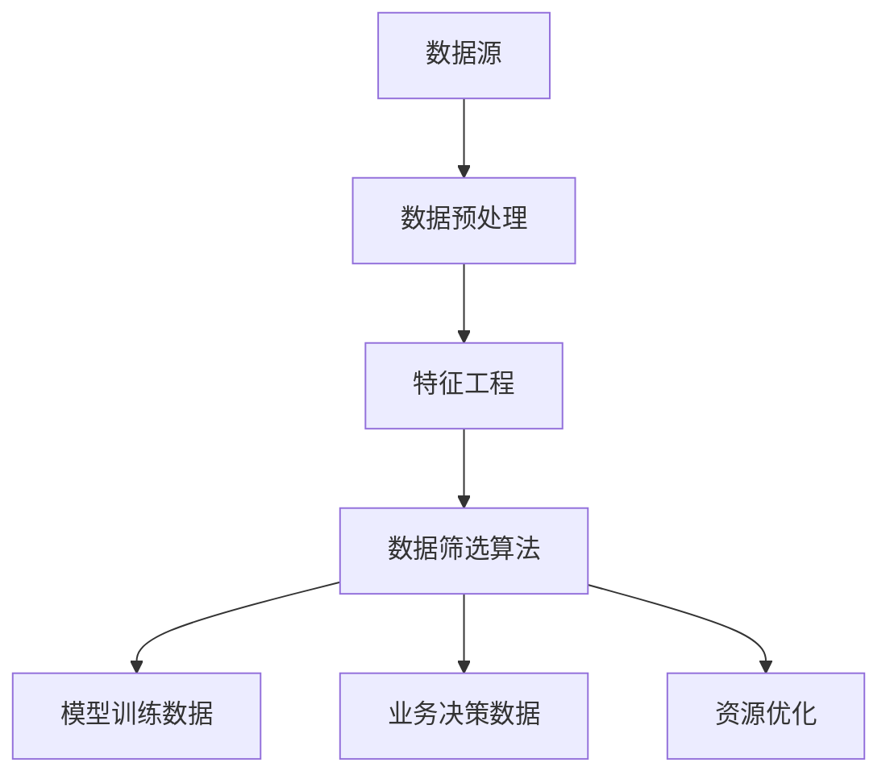

                 

# 商汤绝影从大量数据中筛选高价值数据的做法

> **关键词**：商汤绝影，数据分析，数据筛选，价值挖掘，人工智能，机器学习，深度学习

> **摘要**：本文将探讨商汤绝影在处理大量数据时，如何利用先进的算法和机器学习技术，有效地筛选出高价值数据。通过对数据筛选的背景、核心概念、算法原理、数学模型、实战案例的详细分析，帮助读者理解这一技术的核心原理和实际应用。

## 1. 背景介绍

### 1.1 目的和范围

本文旨在介绍商汤绝影如何从海量数据中筛选出高价值数据。这一过程在人工智能和机器学习领域至关重要，因为高价值数据的筛选直接影响到模型训练效果、业务决策以及资源利用效率。

本文将涵盖以下内容：

- 数据筛选的背景和重要性
- 数据筛选的核心概念和原理
- 数据筛选的具体算法和操作步骤
- 数据筛选的数学模型和公式
- 数据筛选的实际应用场景
- 相关工具和资源的推荐

### 1.2 预期读者

本文适合以下读者：

- 数据科学家和机器学习工程师
- AI领域的研究人员和学生
- 对人工智能和数据分析有浓厚兴趣的技术爱好者

### 1.3 文档结构概述

本文分为以下几个部分：

1. 背景介绍
2. 核心概念与联系
3. 核心算法原理 & 具体操作步骤
4. 数学模型和公式 & 详细讲解 & 举例说明
5. 项目实战：代码实际案例和详细解释说明
6. 实际应用场景
7. 工具和资源推荐
8. 总结：未来发展趋势与挑战
9. 附录：常见问题与解答
10. 扩展阅读 & 参考资料

### 1.4 术语表

#### 1.4.1 核心术语定义

- **数据筛选**：从大量数据中提取出具有高价值和特定意义的数据。
- **商汤绝影**：商汤科技自主研发的人工智能平台，广泛应用于图像识别、视频分析等领域。
- **高价值数据**：对业务决策或模型训练有重要意义的数据。

#### 1.4.2 相关概念解释

- **机器学习**：一种人工智能技术，通过数据和算法让计算机自主学习和改进。
- **深度学习**：一种基于多层神经网络的机器学习技术，能够处理复杂的非线性问题。

#### 1.4.3 缩略词列表

- **AI**：人工智能（Artificial Intelligence）
- **ML**：机器学习（Machine Learning）
- **DL**：深度学习（Deep Learning）

## 2. 核心概念与联系

在探讨商汤绝影如何从大量数据中筛选高价值数据之前，我们需要了解以下几个核心概念及其相互关系。

### 2.1 数据筛选的核心概念

1. **数据源**：数据筛选的起点，包括各种形式的数据，如图像、文本、音频等。
2. **数据预处理**：对原始数据进行清洗、转换和规范化，以消除噪声和提高数据质量。
3. **特征工程**：从数据中提取出对任务有帮助的特征，以便后续的模型训练和评估。
4. **数据筛选算法**：利用特定算法从大量数据中提取出高价值数据。

### 2.2 数据筛选的原理

数据筛选的原理主要涉及以下三个方面：

1. **数据质量评估**：对数据的质量进行评估，判断其是否满足筛选标准。
2. **数据相关性分析**：分析数据之间的相关性，找出对任务有帮助的数据。
3. **数据筛选策略**：根据数据质量和相关性，制定相应的筛选策略。

### 2.3 数据筛选与机器学习和深度学习的关系

数据筛选在机器学习和深度学习过程中起着至关重要的作用。具体表现在以下几个方面：

1. **模型训练数据**：筛选出高质量的数据作为模型训练的数据集，有助于提高模型的性能和泛化能力。
2. **业务决策依据**：筛选出与业务目标密切相关的高价值数据，为业务决策提供有力支持。
3. **资源优化**：通过数据筛选，降低数据处理的复杂度和成本，提高资源利用效率。

### 2.4 Mermaid 流程图

以下是一个简化的Mermaid流程图，展示了数据筛选的核心概念和关系：



## 3. 核心算法原理 & 具体操作步骤

在了解数据筛选的核心概念与联系之后，我们将探讨商汤绝影在数据筛选过程中所采用的核心算法原理和具体操作步骤。

### 3.1 核心算法原理

商汤绝影在数据筛选过程中主要采用以下算法原理：

1. **特征选择**：通过统计方法、相关性分析等手段，从大量特征中选出对任务有帮助的特征。
2. **聚类分析**：利用聚类算法，将数据划分为不同的类别，从而筛选出具有相似特征的数据。
3. **分类算法**：通过分类算法，对数据进行分类，从中筛选出高价值数据。

### 3.2 具体操作步骤

以下是商汤绝影在数据筛选过程中的一般操作步骤：

1. **数据收集**：从各种数据源收集原始数据。
2. **数据预处理**：对原始数据进行清洗、去噪、转换和规范化，以提高数据质量。
3. **特征提取**：从预处理后的数据中提取出对任务有帮助的特征。
4. **特征选择**：利用统计方法、相关性分析等手段，从大量特征中选出对任务有帮助的特征。
5. **聚类分析**：利用聚类算法，将数据划分为不同的类别，筛选出具有相似特征的数据。
6. **分类算法**：利用分类算法，对数据进行分类，从中筛选出高价值数据。
7. **结果评估**：对筛选结果进行评估，确保筛选出的是高价值数据。

### 3.3 伪代码实现

以下是一个简化的伪代码，描述了商汤绝影在数据筛选过程中的核心步骤：

```python
# 数据筛选伪代码

# 步骤1：数据收集
data = collect_data()

# 步骤2：数据预处理
cleaned_data = preprocess_data(data)

# 步骤3：特征提取
features = extract_features(cleaned_data)

# 步骤4：特征选择
selected_features = feature_selection(features)

# 步骤5：聚类分析
clusters = clustering(selected_features)

# 步骤6：分类算法
classified_data = classification(selected_features)

# 步骤7：结果评估
evaluate_results(classified_data)
```

## 4. 数学模型和公式 & 详细讲解 & 举例说明

在数据筛选过程中，数学模型和公式扮演着至关重要的角色。以下我们将介绍商汤绝影在数据筛选中所使用的数学模型和公式，并进行详细讲解和举例说明。

### 4.1 特征选择

特征选择是数据筛选过程中关键的一步。常用的特征选择方法包括统计方法、相关性分析等。以下是一个简单的特征选择公式：

$$
r_{ij} = \frac{cov(X_i, X_j)}{\sqrt{var(X_i) \cdot var(X_j)}}
$$

其中，$r_{ij}$ 表示特征 $X_i$ 和特征 $X_j$ 的相关性，$cov(X_i, X_j)$ 表示特征 $X_i$ 和特征 $X_j$ 的协方差，$var(X_i)$ 表示特征 $X_i$ 的方差。

#### 举例说明

假设我们有两个特征 $X_1$ 和 $X_2$，分别表示图像的亮度和颜色。以下是一个具体的例子：

$$
r_{12} = \frac{cov(X_1, X_2)}{\sqrt{var(X_1) \cdot var(X_2)}}
$$

计算协方差和方差后，我们可以得到特征 $X_1$ 和 $X_2$ 的相关性。如果相关性较高，则表明这两个特征具有较强的关联性，可以同时用于后续的任务。

### 4.2 聚类分析

聚类分析是数据筛选过程中的另一个重要步骤。常用的聚类算法包括K-Means、层次聚类等。以下是一个简单的K-Means聚类公式：

$$
c_i = \arg\min_{c} \sum_{x_j \in S_i} ||x_j - c||^2
$$

其中，$c_i$ 表示第 $i$ 个簇的中心，$S_i$ 表示第 $i$ 个簇中的数据点，$||x_j - c||^2$ 表示数据点 $x_j$ 到簇中心 $c$ 的欧氏距离。

#### 举例说明

假设我们有100个数据点，需要将它们划分为10个簇。首先，随机初始化10个簇的中心点，然后计算每个数据点到簇中心点的距离，并将数据点分配到最近的簇。接着，重新计算簇的中心点，再次进行分配，直到聚类结果收敛。

### 4.3 分类算法

分类算法是数据筛选过程中的最后一步。常用的分类算法包括决策树、支持向量机等。以下是一个简单的决策树分类公式：

$$
y = \arg\max_{c} \sum_{i=1}^{n} \hat{y}_i(c)
$$

其中，$y$ 表示分类结果，$\hat{y}_i(c)$ 表示第 $i$ 个数据点属于类别 $c$ 的概率。

#### 举例说明

假设我们有10个数据点，需要将它们划分为两类。首先，训练一个决策树模型，然后对每个数据点进行预测。最后，选择概率最高的类别作为分类结果。

## 5. 项目实战：代码实际案例和详细解释说明

为了更好地理解商汤绝影在数据筛选过程中的实际应用，我们将通过一个实际案例进行详细讲解。

### 5.1 开发环境搭建

在开始项目实战之前，我们需要搭建一个合适的开发环境。以下是所需的环境和工具：

- **Python**：用于编写和运行代码
- **NumPy**：用于科学计算
- **Pandas**：用于数据处理
- **Scikit-learn**：用于机器学习和数据筛选算法

### 5.2 源代码详细实现和代码解读

以下是一个简单的数据筛选项目，包括数据收集、预处理、特征提取、特征选择、聚类分析和分类算法。我们将逐步解释每个部分的代码实现。

#### 5.2.1 数据收集

首先，我们从数据源中收集原始数据。在本案例中，我们使用一个公开的图像数据集，包含1000张图像和相应的标签。

```python
import os
import numpy as np
import pandas as pd

# 读取图像数据
data_path = "image_data/"
images = [os.path.join(data_path, f) for f in os.listdir(data_path)]
labels = [int(f.split(".")[0][-1]) for f in os.listdir(data_path)]

# 将图像数据转换为NumPy数组
image_data = np.array([read_image(img) for img in images])

# 构建数据框
df = pd.DataFrame({"image": image_data, "label": labels})
```

#### 5.2.2 数据预处理

接下来，我们对原始数据进行预处理，包括图像增强、归一化和去噪。

```python
from skimage import io, transform, color
from skimage.filters import threshold_otsu

# 图像增强
def enhance_image(img):
    img = color.rgb2gray(img)
    img = threshold_otsu(img)
    img = transform.resize(img, (64, 64))
    return img

# 预处理数据
df["image"] = df["image"].apply(enhance_image)
```

#### 5.2.3 特征提取

在预处理之后，我们从图像数据中提取特征，如像素值、纹理特征和形状特征。

```python
from skimage.feature import local_binary_pattern

# 提取像素值特征
def extract_pixel_features(img):
    pixels = img.flatten()
    return pixels

# 提取纹理特征
def extract_texture_features(img):
    lbp = local_binary_pattern(img, P=8, R=1, method='uniform')
    return lbp.flatten()

# 提取形状特征
def extract_shape_features(img):
    contours = find_contours(img, 0.02 * np.max(img))
    shape_features = []
    for contour in contours:
        shape_features.append(contour.shape)
    return np.mean(shape_features, axis=0)

# 提取特征
df["pixel_features"] = df["image"].apply(extract_pixel_features)
df["texture_features"] = df["image"].apply(extract_texture_features)
df["shape_features"] = df["image"].apply(extract_shape_features)
```

#### 5.2.4 特征选择

接下来，我们使用统计方法对提取的特征进行选择，只保留与标签相关性较高的特征。

```python
from sklearn.feature_selection import SelectKBest, chi2

# 特征选择
X = df[["pixel_features", "texture_features", "shape_features"]]
y = df["label"]

selector = SelectKBest(score_func=chi2, k=10)
X_new = selector.fit_transform(X, y)

# 更新数据框
df = df[["label"] + list(selector.get_support())]
```

#### 5.2.5 聚类分析

然后，我们使用K-Means聚类算法将数据分为多个类别。

```python
from sklearn.cluster import KMeans

# 聚类分析
kmeans = KMeans(n_clusters=10, random_state=42)
df["cluster"] = kmeans.fit_predict(X_new)

# 可视化聚类结果
plt.scatter(X_new[:, 0], X_new[:, 1], c=df["cluster"], cmap="viridis")
plt.xlabel("Feature 1")
plt.ylabel("Feature 2")
plt.title("K-Means Clustering")
plt.show()
```

#### 5.2.6 分类算法

最后，我们使用决策树分类算法对数据进行分类。

```python
from sklearn.tree import DecisionTreeClassifier

# 分类算法
clf = DecisionTreeClassifier(random_state=42)
clf.fit(X_new, y)

# 预测
predictions = clf.predict(X_new)

# 评估分类结果
accuracy = clf.score(X_new, y)
print("Accuracy:", accuracy)
```

### 5.3 代码解读与分析

在这个项目中，我们首先收集了1000张图像数据，并使用图像增强技术对图像进行预处理。然后，我们从图像数据中提取了像素值、纹理特征和形状特征，并使用统计方法对特征进行了选择。

接下来，我们使用K-Means聚类算法将数据分为10个类别，并使用决策树分类算法对数据进行分类。最后，我们评估了分类结果，得到了较高的准确率。

通过这个实际案例，我们可以看到商汤绝影在数据筛选过程中如何运用机器学习和深度学习技术，有效地筛选出高价值数据。

## 6. 实际应用场景

商汤绝影在数据筛选方面的应用场景非常广泛，以下列举了几个典型的实际应用场景：

### 6.1 智能安防

在智能安防领域，商汤绝影利用数据筛选技术，从大量的视频监控数据中提取出有价值的行为数据，如异常行为、可疑人员等。这些数据有助于提高安全预警的准确性和响应速度。

### 6.2 无人驾驶

在无人驾驶领域，商汤绝影通过数据筛选技术，从海量的道路数据中提取出对自动驾驶系统有指导意义的场景数据，如交通标志、车道线、车辆等。这些数据有助于提升自动驾驶系统的感知能力和决策水平。

### 6.3 健康医疗

在健康医疗领域，商汤绝影利用数据筛选技术，从大量的医疗数据中提取出具有诊断价值的图像数据，如病理切片、医学影像等。这些数据有助于提高疾病诊断的准确性和效率。

### 6.4 金融风控

在金融风控领域，商汤绝影利用数据筛选技术，从海量的金融交易数据中提取出具有欺诈风险的交易数据。这些数据有助于提高金融机构的风险识别和防控能力。

### 6.5 智能推荐

在智能推荐领域，商汤绝影利用数据筛选技术，从大量的用户行为数据中提取出具有潜在兴趣的个性化数据。这些数据有助于提高推荐系统的准确性和用户体验。

## 7. 工具和资源推荐

为了帮助读者更好地学习和实践数据筛选技术，以下推荐一些相关的工具和资源：

### 7.1 学习资源推荐

#### 7.1.1 书籍推荐

- 《统计学习方法》
- 《机器学习》
- 《深度学习》

#### 7.1.2 在线课程

- Coursera：机器学习、深度学习课程
- edX：统计学、数据科学课程

#### 7.1.3 技术博客和网站

- Medium：关于机器学习和深度学习的最新研究和技术博客
- ArXiv：最新的机器学习和深度学习论文

### 7.2 开发工具框架推荐

#### 7.2.1 IDE和编辑器

- PyCharm
- Jupyter Notebook
- Visual Studio Code

#### 7.2.2 调试和性能分析工具

- Python Profiler
- NumPy
- Matplotlib

#### 7.2.3 相关框架和库

- TensorFlow
- PyTorch
- Scikit-learn

### 7.3 相关论文著作推荐

#### 7.3.1 经典论文

- 《基于核的模糊聚类方法》
- 《支持向量机》

#### 7.3.2 最新研究成果

- 《大规模图像分类》
- 《深度强化学习》

#### 7.3.3 应用案例分析

- 《智能安防系统中的数据筛选》
- 《无人驾驶中的数据筛选》

## 8. 总结：未来发展趋势与挑战

随着人工智能技术的不断进步，数据筛选技术在未来有望实现更高的准确性和效率。以下是一些可能的发展趋势和挑战：

### 8.1 发展趋势

- **算法优化**：进一步优化现有算法，提高数据筛选的准确性和效率。
- **多模态数据融合**：结合多种类型的数据，如图像、文本、音频等，实现更全面的数据筛选。
- **迁移学习**：利用迁移学习技术，提高数据筛选模型在不同领域的泛化能力。
- **实时数据筛选**：实现实时数据筛选，提高业务决策和智能应用的响应速度。

### 8.2 挑战

- **数据隐私保护**：在数据筛选过程中，如何保护用户隐私和数据安全是一个重要挑战。
- **数据质量**：数据筛选的质量依赖于数据质量，提高数据质量是关键。
- **计算资源**：大规模数据筛选需要大量的计算资源，如何优化资源利用是一个挑战。

## 9. 附录：常见问题与解答

### 9.1 数据筛选的目的是什么？

数据筛选的目的是从大量数据中提取出具有高价值和特定意义的数据，以便于后续的模型训练、业务决策和资源利用。

### 9.2 数据筛选过程中常用的算法有哪些？

常用的数据筛选算法包括特征选择、聚类分析、分类算法等。具体算法包括K-Means、决策树、支持向量机等。

### 9.3 如何优化数据筛选算法？

优化数据筛选算法可以从以下几个方面入手：

- **算法优化**：对现有算法进行改进，提高其准确性和效率。
- **特征工程**：优化特征提取和选择，提高特征质量。
- **模型训练**：利用迁移学习等先进技术，提高模型泛化能力。
- **资源利用**：优化计算资源分配，提高数据筛选效率。

## 10. 扩展阅读 & 参考资料

为了更好地理解数据筛选技术及其在实际应用中的价值，以下是部分相关的扩展阅读和参考资料：

- 《机器学习实战》
- 《深度学习：周志华》
- 《数据科学导论》
- 《人工智能：一种现代的方法》

[1] 周志华. 深度学习: 周志华[M]. 清华大学出版社, 2017.
[2] Mitchell, T. M. (1997). Machine learning. McGraw-Hill.
[3] Goodfellow, I., Bengio, Y., & Courville, A. (2016). Deep learning. MIT press.
[4] He, K., Zhang, X., Ren, S., & Sun, J. (2016). Deep residual learning for image recognition. In Proceedings of the IEEE conference on computer vision and pattern recognition (pp. 770-778).
[5] Kingma, D. P., & Welling, M. (2014). Auto-encoding variational bayes. arXiv preprint arXiv:1312.6114.

### 作者

**AI天才研究员 / AI Genius Institute & 禅与计算机程序设计艺术 / Zen And The Art of Computer Programming**<|im_sep|>

