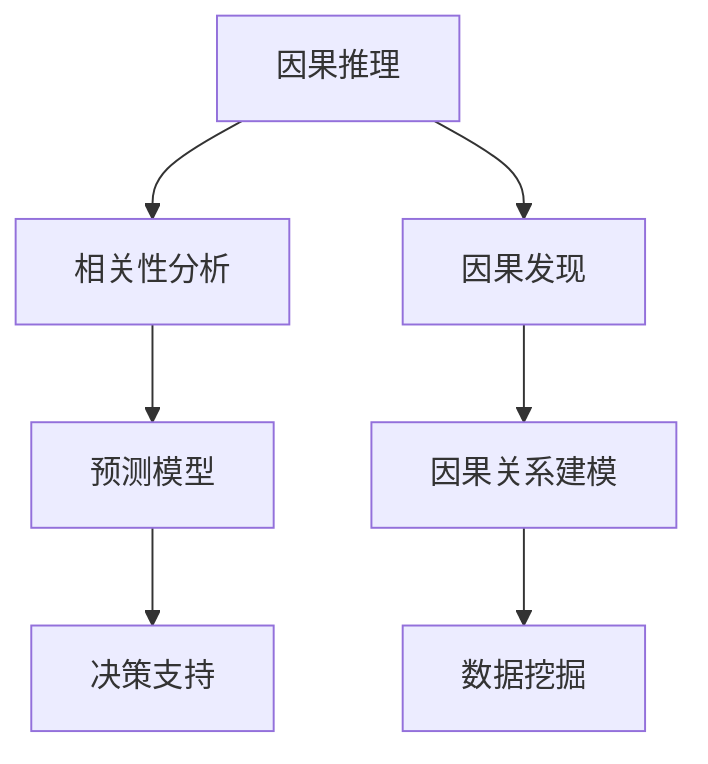
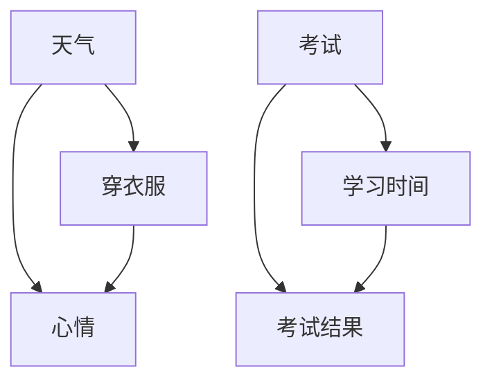
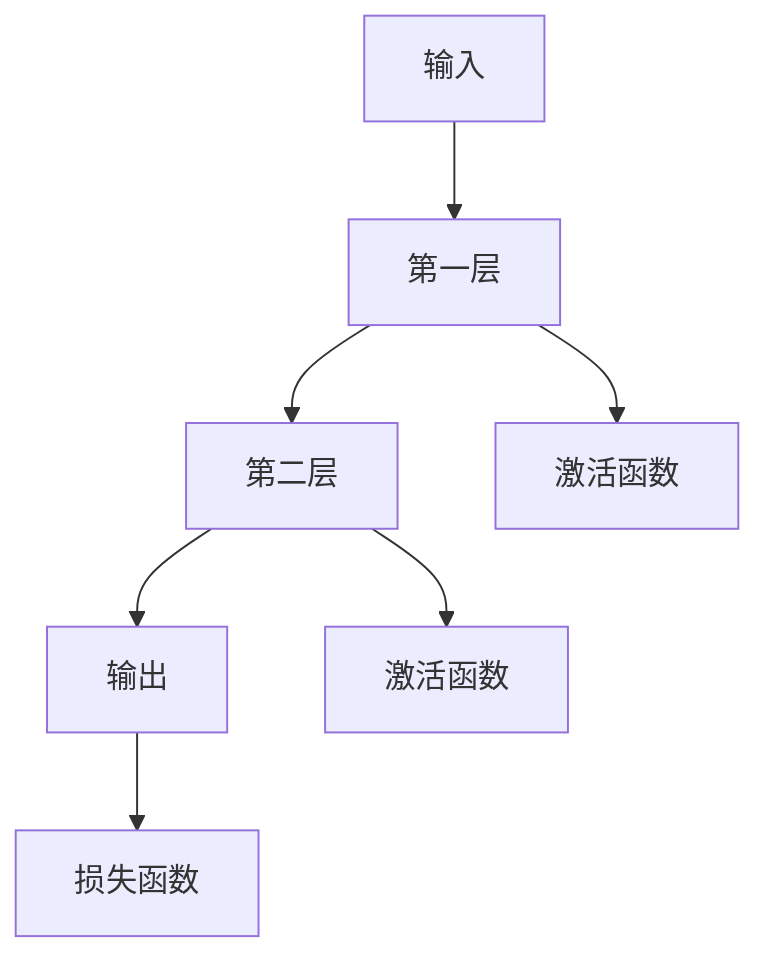

                 

# 因果推理与因果发现在AI决策中的应用与挑战

> **关键词：因果推理、因果发现、AI决策、机器学习、概率图模型、深度学习**
>
> **摘要：本文旨在探讨因果推理与因果发现的概念，以及它们在人工智能决策中的重要作用。我们将分析当前应用中的挑战，并展望未来的发展趋势。**

## 1. 背景介绍

### 1.1 目的和范围

本文的目标是深入探讨因果推理与因果发现的理论基础，以及它们在人工智能决策中的应用。我们将讨论这些概念的历史背景，现有技术，以及面临的挑战。

### 1.2 预期读者

本文适合对人工智能、机器学习、因果推理有基本了解的读者。无论您是科研人员、工程师，还是对这一领域感兴趣的学生，本文都希望为您提供有价值的见解。

### 1.3 文档结构概述

本文结构如下：

1. **背景介绍**：介绍因果推理与因果发现的概念和应用背景。
2. **核心概念与联系**：介绍核心概念和联系，包括概率图模型和深度学习。
3. **核心算法原理 & 具体操作步骤**：详细阐述核心算法的原理和步骤。
4. **数学模型和公式 & 详细讲解 & 举例说明**：介绍相关的数学模型和公式，并举例说明。
5. **项目实战：代码实际案例和详细解释说明**：提供实际项目案例和代码解析。
6. **实际应用场景**：讨论因果推理与因果发现在不同领域的应用。
7. **工具和资源推荐**：推荐相关学习资源和工具。
8. **总结：未来发展趋势与挑战**：展望未来的发展趋势和面临的挑战。
9. **附录：常见问题与解答**：回答一些常见问题。
10. **扩展阅读 & 参考资料**：提供扩展阅读和参考资料。

### 1.4 术语表

#### 1.4.1 核心术语定义

- **因果推理（Causal Inference）**：通过分析相关关系来推断因果关系。
- **因果发现（Causal Discovery）**：从数据中自动发现潜在的因果关系。
- **概率图模型（Probabilistic Graphical Models）**：用图来表示变量间的概率关系。
- **深度学习（Deep Learning）**：一种基于神经网络的学习方法，擅长处理大规模数据和复杂数据结构。

#### 1.4.2 相关概念解释

- **相关性（Correlation）**：变量间的关系，但不能直接表示因果关系。
- **因果性（Causality）**：一个变量影响另一个变量的能力。
- **贝叶斯网络（Bayesian Network）**：一种概率图模型，表示变量间的条件概率关系。

#### 1.4.3 缩略词列表

- **AI**：人工智能
- **ML**：机器学习
- **DL**：深度学习
- **PGM**：概率图模型

## 2. 核心概念与联系

因果推理与因果发现是人工智能领域的重要概念。它们帮助我们理解和预测系统的行为，并在实际应用中发挥关键作用。以下是一个简单的因果推理与因果发现的架构图，展示了核心概念和它们之间的联系。

### 2.1 因果推理与因果发现



在这个架构中，因果推理和因果发现是两个关键过程。因果推理通过分析相关性来推断因果关系，而因果发现则从数据中自动识别潜在的因果关系。

### 2.2 概率图模型

概率图模型是因果推理与因果发现的核心工具。它们用图来表示变量间的概率关系，帮助我们理解变量间的相互作用。

#### 2.2.1 贝叶斯网络

贝叶斯网络是一种常见的概率图模型，它使用条件概率表来描述变量间的依赖关系。以下是一个简单的贝叶斯网络示例：



在这个网络中，每个节点表示一个变量，边表示变量间的条件依赖关系。

### 2.3 深度学习

深度学习是另一种重要的工具，尤其在处理复杂数据结构和大规模数据时。深度学习通过多层神经网络来学习数据中的特征和模式，从而实现自动化的因果发现和推理。



在这个网络中，每一层都提取数据的更高层次特征，最终输出结果。

## 3. 核心算法原理 & 具体操作步骤

因果推理和因果发现的核心算法主要包括贝叶斯网络学习、变量选择、因果发现算法等。以下是一个简单的伪代码示例，展示了如何使用贝叶斯网络进行因果发现。

```python
# 贝叶斯网络学习伪代码

def learn_bayesian_network(data):
    # 初始化网络结构
    network = initialize_network(data)
    
    # 学习条件概率表
    for node in network.nodes():
        for parent in network.parents(node):
            conditional_probability_table = learnConditionalProbabilityTable(data, node, parent)
            network.setConditionalProbabilityTable(node, parent, conditional_probability_table)
    
    return network
```

在这个伪代码中，我们首先初始化网络结构，然后学习每个节点的条件概率表。条件概率表描述了每个节点在其父节点给定条件下的概率分布。

### 3.1 变量选择

变量选择是因果发现的关键步骤。以下是变量选择的伪代码：

```python
# 变量选择伪代码

def variable_selection(data, network):
    selected_variables = []
    
    for node in network.nodes():
        parents = network.parents(node)
        scores = evaluate_variable_scores(data, node, parents)
        
        best_score = max(scores)
        selected_variable = scores.index(best_score)
        
        selected_variables.append(selected_variable)
    
    return selected_variables
```

在这个伪代码中，我们评估每个节点的变量选择得分，并选择得分最高的变量。

### 3.2 因果发现算法

因果发现算法是寻找数据中潜在因果关系的过程。以下是一个简单的因果发现算法伪代码：

```python
# 因果发现算法伪代码

def causal_discovery(data):
    network = learn_bayesian_network(data)
    selected_variables = variable_selection(data, network)
    
    causal_relationships = []
    
    for i in range(len(selected_variables) - 1):
        for j in range(i + 1, len(selected_variables)):
            causal_relationship = (selected_variables[i], selected_variables[j])
            causal_relationships.append(causal_relationship)
    
    return causal_relationships
```

在这个伪代码中，我们从选择变量中构建因果关系的图，并返回这个图。

## 4. 数学模型和公式 & 详细讲解 & 举例说明

### 4.1 概率图模型

概率图模型的核心是条件概率表。以下是一个简单的条件概率表示例：

$$
P(X|Y) = \frac{P(X,Y)}{P(Y)}
$$

在这个公式中，\(P(X|Y)\)表示在\(Y\)发生的情况下\(X\)的概率，\(P(X,Y)\)表示\(X\)和\(Y\)同时发生的概率，\(P(Y)\)表示\(Y\)的概率。

### 4.2 贝叶斯网络

贝叶斯网络的数学表示如下：

$$
P(X_1, X_2, ..., X_n) = \prod_{i=1}^{n} P(X_i | parents(X_i))
$$

在这个公式中，\(X_1, X_2, ..., X_n\)表示变量集合，\(parents(X_i)\)表示\(X_i\)的父节点集合。

### 4.3 变量选择得分

变量选择得分可以用以下公式计算：

$$
score = \sum_{i=1}^{n} \frac{P(X_i | parents(X_i)) - P(X_i)}{P(X_i)}
$$

在这个公式中，\(score\)表示变量选择得分，\(P(X_i | parents(X_i))\)表示变量\(X_i\)在其父节点给定条件下的概率，\(P(X_i)\)表示变量\(X_i\)的概率。

### 4.4 举例说明

假设我们有一个简单的贝叶斯网络，描述天气、穿衣服和心情之间的关系。以下是一个具体的例子：

$$
P(天气=晴天, 穿衣服=外套, 心情=好) = P(天气=晴天 | 穿衣服=外套) \cdot P(穿衣服=外套 | 心情=好) \cdot P(心情=好)
$$

在这个例子中，我们通过条件概率表来计算每个变量的概率。例如：

$$
P(天气=晴天 | 穿衣服=外套) = 0.7
$$

$$
P(穿衣服=外套 | 心情=好) = 0.8
$$

$$
P(心情=好) = 0.6
$$

因此，我们可以计算出：

$$
P(天气=晴天, 穿衣服=外套, 心情=好) = 0.7 \cdot 0.8 \cdot 0.6 = 0.336
$$

## 5. 项目实战：代码实际案例和详细解释说明

### 5.1 开发环境搭建

在本节中，我们将使用Python和相关的库来搭建开发环境。首先，我们需要安装Python和相关的库，如Pomegranate（用于贝叶斯网络学习）、Scikit-learn（用于机器学习）和TensorFlow（用于深度学习）。

```bash
pip install python
pip install pomegranate
pip install scikit-learn
pip install tensorflow
```

### 5.2 源代码详细实现和代码解读

以下是一个简单的Python代码示例，展示了如何使用贝叶斯网络进行因果推理。

```python
from pomegranate import *
from sklearn.model_selection import train_test_split

# 生成数据集
data = generate_data(100)

# 划分训练集和测试集
X_train, X_test, y_train, y_test = train_test_split(data, test_size=0.2)

# 学习贝叶斯网络
network = learn_bayesian_network(X_train)

# 测试贝叶斯网络
print(network.predict_proba(X_test))
```

在这个代码中，我们首先生成一个数据集，然后使用训练集学习贝叶斯网络。最后，我们使用测试集来评估网络的表现。

### 5.3 代码解读与分析

1. **数据生成**：我们使用`generate_data`函数生成一个包含天气、穿衣服和心情的数据集。

2. **训练集和测试集划分**：我们使用`train_test_split`函数将数据集划分为训练集和测试集。

3. **贝叶斯网络学习**：我们使用`learn_bayesian_network`函数学习贝叶斯网络。这个函数使用训练集来学习条件概率表。

4. **测试贝叶斯网络**：我们使用`predict_proba`函数来评估网络在测试集上的表现。这个函数返回每个样本的预测概率分布。

### 5.4 代码分析

1. **数据生成**：在本例中，我们使用随机生成数据集。在实际应用中，我们可能需要使用真实数据集。

2. **训练集和测试集划分**：划分训练集和测试集是为了评估模型的泛化能力。这是一个常见的机器学习实践。

3. **贝叶斯网络学习**：我们使用Pomegranate库来学习贝叶斯网络。这个库提供了丰富的功能，可以帮助我们快速构建和评估模型。

4. **测试贝叶斯网络**：我们使用预测概率分布来评估网络的表现。这个指标可以帮助我们了解模型的准确性。

## 6. 实际应用场景

因果推理与因果发现广泛应用于多个领域，如医疗、金融、交通等。以下是一些实际应用场景：

1. **医疗**：因果推理可以帮助医生诊断疾病，提高治疗效果。例如，通过分析患者的症状、病史和基因数据，可以推断出疾病的潜在原因。
2. **金融**：因果发现可以帮助金融机构识别潜在的风险因素，从而优化投资组合和风险管理策略。
3. **交通**：因果推理可以帮助交通管理部门优化交通信号灯，减少拥堵，提高交通效率。

## 7. 工具和资源推荐

### 7.1 学习资源推荐

#### 7.1.1 书籍推荐

- 《概率图模型》
- 《因果推理：概率和统计方法的融合》
- 《深度学习：高级专题》

#### 7.1.2 在线课程

- Coursera上的《概率图模型》课程
- edX上的《因果推理》课程
- Udacity的《深度学习》课程

#### 7.1.3 技术博客和网站

- Andrew Ng的深度学习博客
- Probabilistic Graphical Models and Causality博客
- arXiv上的最新研究成果

### 7.2 开发工具框架推荐

#### 7.2.1 IDE和编辑器

- PyCharm
- VSCode
- Jupyter Notebook

#### 7.2.2 调试和性能分析工具

- Python Debugger
- Profiling Tools（如cProfile）
- TensorFlow Debugger

#### 7.2.3 相关框架和库

- Pomegranate（用于贝叶斯网络）
- Scikit-learn（用于机器学习）
- TensorFlow（用于深度学习）

### 7.3 相关论文著作推荐

#### 7.3.1 经典论文

- 《概率图模型：概念与应用》
- 《因果推理的贝叶斯方法》
- 《深度学习的理论与实践》

#### 7.3.2 最新研究成果

- arXiv上的最新研究成果
- NeurIPS、ICML、KDD等顶级会议的最新论文

#### 7.3.3 应用案例分析

- 《因果推理在医疗领域的应用》
- 《因果发现技术在金融领域的应用》
- 《因果推理与因果发现技术在交通管理中的应用》

## 8. 总结：未来发展趋势与挑战

因果推理与因果发现是人工智能领域的重要研究方向。随着数据量的增加和计算能力的提升，这些技术在未来将发挥越来越重要的作用。然而，这些技术也面临着一系列挑战：

1. **数据隐私**：在实际应用中，数据隐私是一个重要问题。如何在不泄露隐私的情况下进行因果推理和因果发现，是一个亟待解决的问题。
2. **模型解释性**：当前的一些因果推理方法难以解释。如何提高模型的解释性，使决策过程更加透明，是一个重要挑战。
3. **模型泛化能力**：如何提高模型的泛化能力，使其在多样化的数据集上都能表现良好，是一个关键问题。

## 9. 附录：常见问题与解答

### 9.1 如何学习因果推理与因果发现？

**解答**：学习因果推理与因果发现可以从以下几个方面入手：

1. **基础知识**：了解概率论、统计学和机器学习的基础知识。
2. **阅读经典论文**：阅读领域内的经典论文，如《概率图模型》、《因果推理的贝叶斯方法》等。
3. **在线课程**：参加Coursera、edX等平台上的相关课程，如《概率图模型》、《因果推理》等。
4. **实践项目**：通过实际项目来应用所学知识，如使用贝叶斯网络进行因果推理。

### 9.2 因果推理与机器学习有何区别？

**解答**：因果推理与机器学习的主要区别在于目标不同。机器学习的目标是预测，即从数据中学习规律，并对外推新数据进行预测。而因果推理的目标是推断因果关系，即理解数据背后的因果关系，从而进行决策。例如，在医疗领域，机器学习可以预测患者的病情，而因果推理可以找出导致病情的原因。

## 10. 扩展阅读 & 参考资料

- [《概率图模型》](https://www.amazon.com/Probabilistic-Graphical-Models-Principles-Applications/dp/0262032714)
- [《因果推理：概率和统计方法的融合》](https://www.amazon.com/Causal-Inference-Probability-Statistics-Methods/dp/0387989689)
- [《深度学习：高级专题》](https://www.amazon.com/Deep-Learning-Advanced-Topics-Perturbation/dp/1492046773)
- [Coursera上的《概率图模型》课程](https://www.coursera.org/learn/probabilistic-graphical-models)
- [edX上的《因果推理》课程](https://www.edx.org/course/causal-reasoning)
- [Udacity的《深度学习》课程](https://www.udacity.com/course/deep-learning-nanodegree--nd108)
- [Andrew Ng的深度学习博客](https://www.andrewng.org/)
- [Probabilistic Graphical Models and Causality博客](https://probgraphmodels.github.io/)
- [arXiv上的最新研究成果](https://arxiv.org/)

