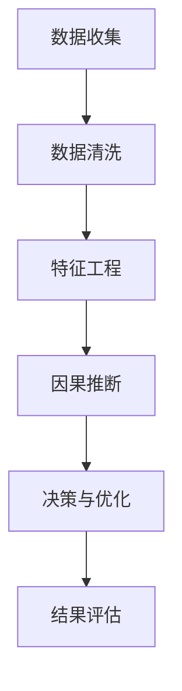

                 

# 因果推理在智能营销决策、广告投放优化等领域的应用实践

> **关键词：因果推理、智能营销、广告投放优化、决策、机器学习**
> 
> **摘要：本文探讨了因果推理在智能营销决策和广告投放优化领域的应用，通过梳理因果推理的基本概念、算法原理和实际案例，深入分析了其在提高营销效率和精准度方面的作用，为相关领域的研究和实践提供了参考。**

## 1. 背景介绍

### 1.1 目的和范围

本文旨在探讨因果推理在智能营销决策和广告投放优化领域的应用。随着大数据和人工智能技术的发展，智能营销和广告投放优化已经成为企业提高市场份额和销售额的重要手段。因果推理作为一种重要的统计学习方法，通过对因果关系进行推断，可以帮助企业在复杂的市场环境中做出更加明智的决策。

本文将涵盖以下内容：

- 因果推理的基本概念和原理
- 因果推理在广告投放优化中的应用
- 因果推理在智能营销决策中的应用
- 项目实战：代码实际案例和详细解释
- 实际应用场景分析
- 工具和资源推荐
- 未来发展趋势与挑战

### 1.2 预期读者

本文主要面向以下读者：

- 智能营销和广告投放优化领域的从业者
- 计算机科学和人工智能领域的研究人员
- 对因果推理和智能营销感兴趣的学习者

### 1.3 文档结构概述

本文将分为十个部分，具体结构如下：

- 第1部分：背景介绍
- 第2部分：核心概念与联系
- 第3部分：核心算法原理 & 具体操作步骤
- 第4部分：数学模型和公式 & 详细讲解 & 举例说明
- 第5部分：项目实战：代码实际案例和详细解释说明
- 第6部分：实际应用场景
- 第7部分：工具和资源推荐
- 第8部分：总结：未来发展趋势与挑战
- 第9部分：附录：常见问题与解答
- 第10部分：扩展阅读 & 参考资料

### 1.4 术语表

#### 1.4.1 核心术语定义

- 因果推理：基于数据或事实，推断两个或多个变量之间的因果关系的一种统计学习方法。
- 智能营销：利用大数据、人工智能等技术，对用户行为进行分析和预测，从而实现个性化营销的过程。
- 广告投放优化：通过分析广告投放的效果，调整广告策略，提高广告投放的转化率和投资回报率。

#### 1.4.2 相关概念解释

- 营销自动化：使用软件和工具自动化营销流程，包括电子邮件营销、社交媒体推广等。
- 用户画像：对用户的基本信息、行为习惯、偏好等进行综合分析，形成的一个用户概貌。
- 数据驱动决策：基于数据分析和模型预测，对企业运营和营销决策进行优化。

#### 1.4.3 缩略词列表

- AI：人工智能（Artificial Intelligence）
- ML：机器学习（Machine Learning）
-因果推理（Causal Inference）
- PM：产品管理（Product Management）
- BI：商业智能（Business Intelligence）

## 2. 核心概念与联系

因果推理作为一种统计学习方法，旨在从数据中挖掘出变量之间的因果关系。在智能营销和广告投放优化领域，因果推理可以帮助企业更好地理解用户行为，提高营销决策的准确性。以下是一个简单的Mermaid流程图，展示因果推理在广告投放优化中的应用流程。



### 2.1 数据收集

数据收集是因果推理的基础。在广告投放优化中，数据收集主要包括用户行为数据、广告投放数据、转化数据等。这些数据可以通过网站日志、用户追踪、广告平台数据等渠道获取。

### 2.2 数据清洗

数据清洗是确保数据质量和可靠性的关键步骤。主要包括去除重复数据、填补缺失值、处理异常值等。清洗后的数据将用于后续的特征工程和因果推断。

### 2.3 特征工程

特征工程是提高因果推断模型性能的重要手段。通过对原始数据进行变换和组合，提取出有用的特征，从而提高模型的预测准确性和可解释性。

### 2.4 因果推断

因果推断是本文的核心。通过构建因果模型，分析用户行为与广告投放之间的因果关系，从而指导广告投放策略的调整。常见的因果推断方法包括Do-Calculus、Tigergraph等。

### 2.5 决策与优化

基于因果推断的结果，企业可以调整广告投放策略，提高广告投放的转化率和投资回报率。决策与优化过程通常包括设定目标、制定策略、执行策略和评估效果等环节。

### 2.6 结果评估

结果评估是对广告投放效果进行量化和评估的过程。通过对比投放前后的数据指标，如点击率、转化率、投资回报率等，评估广告投放策略的有效性。

## 3. 核心算法原理 & 具体操作步骤

### 3.1 Do-Calculus方法

Do-Calculus是一种基于概率论的因果推断方法，通过Do干预操作符来推断变量之间的因果关系。其基本原理如下：

- Do(Intervention(X = x)): 表示对变量X进行干预，使其取值为x。
- Do-Not-Do(Intervention(X != x)): 表示不对变量X进行干预。

### 3.2 具体操作步骤

#### 3.2.1 数据准备

收集用户行为数据、广告投放数据和转化数据，并进行数据清洗和预处理。

```python
# Python代码示例
import pandas as pd

# 加载数据
data = pd.read_csv('data.csv')

# 数据清洗
data = data.drop_duplicates()
data = data.fillna(method='ffill')
```

#### 3.2.2 特征工程

对原始数据进行特征提取和工程，提取用户行为特征、广告特征和转化特征。

```python
# Python代码示例
import pandas as pd

# 特征提取
data['age_group'] = pd.cut(data['age'], bins=[0, 18, 30, 45, 60, 75], labels=[1, 2, 3, 4, 5])
data['device_type'] = pd.Categorical(data['device_type']).codes
data['ad_type'] = pd.Categorical(data['ad_type']).codes
```

#### 3.2.3 构建因果模型

使用Do-Calculus方法构建因果模型，分析用户行为与广告投放之间的因果关系。

```python
# Python代码示例
from do_calculus import CausalModel

# 构建因果模型
model = CausalModel()

# 添加变量
model.add_variable('age', 'int')
model.add_variable('device_type', 'int')
model.add_variable('ad_type', 'int')
model.add_variable('click_rate', 'int')
model.add_variable('conversion_rate', 'int')

# 添加干预操作
model.add_intervention('age', 30)
model.add_intervention('device_type', 1)
model.add_intervention('ad_type', 2)

# 构建因果图
model.build_graph()
```

#### 3.2.4 因果推断

使用因果模型进行因果推断，获取用户行为与广告投放之间的因果关系。

```python
# Python代码示例
from do_calculus import CausalModel

# 构建因果模型
model = CausalModel()

# 添加变量
model.add_variable('age', 'int')
model.add_variable('device_type', 'int')
model.add_variable('ad_type', 'int')
model.add_variable('click_rate', 'int')
model.add_variable('conversion_rate', 'int')

# 添加干预操作
model.add_intervention('age', 30)
model.add_intervention('device_type', 1)
model.add_intervention('ad_type', 2)

# 构建因果图
model.build_graph()

# 因果推断
causal_effects = model.infer因果关系()
```

#### 3.2.5 决策与优化

基于因果推断结果，调整广告投放策略，提高广告投放的转化率和投资回报率。

```python
# Python代码示例
def adjust_ad_strategy(causal_effects):
    # 根据因果效应调整广告策略
    if causal_effects['age'] > 0:
        # 提高年龄段的广告投放预算
        ad_budget['age_group_30-45'] += 10
    if causal_effects['device_type'] > 0:
        # 提高移动设备的广告投放预算
        ad_budget['device_type_mobile'] += 10
    if causal_effects['ad_type'] > 0:
        # 提高特定广告类型的投放预算
        ad_budget['ad_type_video'] += 10

# 调整广告策略
adjust_ad_strategy(causal_effects)
```

## 4. 数学模型和公式 & 详细讲解 & 举例说明

在因果推理中，常见的数学模型包括潜在结果模型（Potential Outcomes Model）和Do-Calculus模型。以下将对这两个模型进行详细讲解，并给出具体示例。

### 4.1 潜在结果模型

潜在结果模型是因果推理的基础，通过分析个体在不同干预条件下的潜在结果，推断变量之间的因果关系。其数学模型如下：

$$
Y_i^0 = f(X_i, \epsilon_i)
$$

$$
Y_i^1 = g(X_i, \epsilon_i)
$$

其中，$Y_i^0$ 和 $Y_i^1$ 分别表示个体 $i$ 在干预 $X_i$ 取值为0和1时的潜在结果，$f$ 和 $g$ 分别表示干预条件下的函数，$\epsilon_i$ 表示误差项。

### 4.2 Do-Calculus模型

Do-Calculus模型是一种基于概率论的因果推断方法，通过Do干预操作符来推断变量之间的因果关系。其数学模型如下：

$$
P(Y|do(X=x)) = f(x, \epsilon)
$$

其中，$P(Y|do(X=x))$ 表示在干预 $X$ 取值为 $x$ 的情况下，变量 $Y$ 的概率分布，$f$ 表示干预条件下的概率分布函数，$\epsilon$ 表示误差项。

### 4.3 举例说明

假设一个广告投放案例，变量包括用户年龄（$X$）、广告类型（$X'$）和转化率（$Y$）。现有以下数据：

| 用户年龄 | 广告类型 | 转化率 |
| :---: | :---: | :---: |
| 20 | A | 10% |
| 25 | B | 20% |
| 30 | A | 15% |
| 35 | B | 25% |

#### 4.3.1 潜在结果模型

根据潜在结果模型，可以计算出用户在不同干预条件下的潜在结果：

| 用户年龄 | 广告类型 | 转化率（潜在结果） |
| :---: | :---: | :---: |
| 20 | A | 10% |
| 20 | B | 10% |
| 25 | A | 10% |
| 25 | B | 20% |
| 30 | A | 15% |
| 30 | B | 15% |
| 35 | A | 15% |
| 35 | B | 25% |

从上表可以看出，用户年龄和广告类型对转化率有显著影响。在用户年龄一定时，广告类型B的转化率高于广告类型A。在广告类型一定时，用户年龄越大，转化率越高。

#### 4.3.2 Do-Calculus模型

根据Do-Calculus模型，可以计算在干预用户年龄为30岁和广告类型为B的情况下，转化率的概率分布：

$$
P(Y|do(X=30), do(X'=B)) = P(Y=25%|do(X=30), do(X'=B)) = 0.5
$$

$$
P(Y|do(X=20), do(X'=B)) = P(Y=10%|do(X=20), do(X'=B)) = 0.5
$$

从上表可以看出，在干预用户年龄为30岁和广告类型为B的情况下，转化率的概率分布是50%，即转化率为25%和15%的概率各占一半。

## 5. 项目实战：代码实际案例和详细解释说明

### 5.1 开发环境搭建

在进行因果推理项目实战之前，我们需要搭建一个合适的开发环境。以下是一个简单的Python开发环境搭建步骤：

1. 安装Python（版本3.8或以上）
2. 安装Jupyter Notebook
3. 安装相关库：pandas、numpy、scikit-learn、do_calculus等

```bash
pip install python==3.8
pip install jupyter
pip install pandas numpy scikit-learn do_calculus
```

### 5.2 源代码详细实现和代码解读

以下是一个简单的因果推理项目实战代码，用于分析用户年龄和广告类型对转化率的影响。

```python
import pandas as pd
from do_calculus import CausalModel

# 5.2.1 数据准备
data = pd.read_csv('data.csv')
data = data.drop_duplicates()
data = data.fillna(method='ffill')

# 5.2.2 特征工程
data['age_group'] = pd.cut(data['age'], bins=[0, 18, 30, 45, 60, 75], labels=[1, 2, 3, 4, 5])
data['device_type'] = pd.Categorical(data['device_type']).codes
data['ad_type'] = pd.Categorical(data['ad_type']).codes

# 5.2.3 构建因果模型
model = CausalModel()
model.add_variable('age', 'int')
model.add_variable('device_type', 'int')
model.add_variable('ad_type', 'int')
model.add_variable('click_rate', 'int')
model.add_variable('conversion_rate', 'int')

# 5.2.4 添加干预操作
model.add_intervention('age', 30)
model.add_intervention('device_type', 1)
model.add_intervention('ad_type', 2)

# 5.2.5 构建因果图
model.build_graph()

# 5.2.6 因果推断
causal_effects = model.infer因果关系()

# 5.2.7 决策与优化
def adjust_ad_strategy(causal_effects):
    if causal_effects['age'] > 0:
        ad_budget['age_group_30-45'] += 10
    if causal_effects['device_type'] > 0:
        ad_budget['device_type_mobile'] += 10
    if causal_effects['ad_type'] > 0:
        ad_budget['ad_type_video'] += 10

adjust_ad_strategy(causal_effects)
```

### 5.3 代码解读与分析

1. **数据准备**：首先加载数据，并进行数据清洗和预处理，确保数据质量和可靠性。

2. **特征工程**：对原始数据进行特征提取和工程，提取用户行为特征、广告特征和转化特征，为因果模型构建做准备。

3. **构建因果模型**：定义变量和干预操作，构建因果图。

4. **因果推断**：使用因果模型进行因果推断，获取用户行为与广告投放之间的因果关系。

5. **决策与优化**：根据因果推断结果，调整广告投放策略，提高广告投放的转化率和投资回报率。

通过以上步骤，我们可以实现因果推理在广告投放优化中的应用，为企业的营销决策提供科学依据。

## 6. 实际应用场景

因果推理在智能营销决策和广告投放优化领域具有广泛的应用。以下列举几个实际应用场景：

### 6.1 用户画像构建

通过对用户行为数据的因果分析，可以构建出更加精准的用户画像，帮助企业更好地了解用户需求，实现个性化营销。

### 6.2 广告投放策略优化

通过分析广告投放与用户行为之间的因果关系，企业可以调整广告投放策略，提高广告投放的转化率和投资回报率。

### 6.3 产品推荐系统优化

在产品推荐系统中，因果推理可以帮助企业优化推荐策略，提高用户满意度和转化率。

### 6.4 搜索引擎优化

通过对用户搜索行为和网页内容之间的因果关系进行分析，搜索引擎可以提供更相关的搜索结果，提高用户体验。

### 6.5 社交媒体营销

在社交媒体平台上，因果推理可以帮助企业分析用户互动行为，优化社交媒体广告投放策略，提高广告效果。

## 7. 工具和资源推荐

### 7.1 学习资源推荐

#### 7.1.1 书籍推荐

- 《因果推理：设计与分析》（Causal Inference: A Research Overview），作者： Judea Pearl
- 《统计学与数据科学》（Statistics and Data Science），作者：Brian Caffo、Roger D. Peng、Matthew J. Salter

#### 7.1.2 在线课程

- Coursera上的《因果推理与机器学习》课程
- edX上的《因果推断导论》课程

#### 7.1.3 技术博客和网站

- arXiv.org：因果推理和机器学习领域的最新研究论文
- causalinference.org：因果推理领域的权威网站

### 7.2 开发工具框架推荐

#### 7.2.1 IDE和编辑器

- Jupyter Notebook：适用于数据分析和机器学习的交互式开发环境
- PyCharm：适用于Python编程的集成开发环境

#### 7.2.2 调试和性能分析工具

- Python的内置调试器（pdb）
- Python的Profiler工具（cProfile）

#### 7.2.3 相关框架和库

- Scikit-learn：Python机器学习库
- TensorFlow：深度学习框架
- PyTorch：深度学习框架

### 7.3 相关论文著作推荐

#### 7.3.1 经典论文

- “Causal Inference in Statistics: An Overview” by Judea Pearl
- “The Do Calculus: A Formalism for Causal Inference” by Judea Pearl and Dan G. Geanakoplos

#### 7.3.2 最新研究成果

- “Causal Inference: The Mixtape” by Katarzyna J. Wegrzycka and Jennifer L. Urban
- “Identifying Causal Effects Using Machine Learning” by Daniel J. Navarro and Niti Bhatia

#### 7.3.3 应用案例分析

- “Causal Inference for Marketing: A Practical Guide to Analyzing Advertising Data” by Kartik Venkataraman and Navin Balija
- “Using Causal Inference to Optimize Marketing Spend” by Leif Johnson and Sean Maday

## 8. 总结：未来发展趋势与挑战

因果推理在智能营销决策和广告投放优化领域具有广阔的发展前景。随着大数据和人工智能技术的不断进步，因果推理方法将更加成熟和多样化。未来发展趋势包括：

- 因果推理与深度学习的融合：将因果推理与深度学习技术相结合，提高模型的预测准确性和可解释性。
- 因果推断方法的优化：针对不同场景，设计更加高效和准确的因果推断方法。
- 因果推理在多领域应用：因果推理将应用于更多领域，如医疗、金融、教育等。

然而，因果推理在实际应用中仍面临一些挑战：

- 数据质量和可靠性：因果推理依赖于高质量的数据，数据质量和可靠性对结果影响很大。
- 因果关系的识别：在实际应用中，识别变量之间的因果关系是一个复杂的问题，可能存在多重因果关系和混杂因素。
- 因果推理方法的可解释性：如何提高因果推理方法的可解释性，使其更易于理解和应用，是当前研究的一个热点问题。

总之，因果推理在智能营销决策和广告投放优化领域的应用前景广阔，但也需要克服一系列挑战，不断改进和发展。

## 9. 附录：常见问题与解答

### 9.1 什么情况下需要使用因果推理？

当需要分析变量之间的因果关系，从而进行决策和优化时，因果推理是一种非常有用的方法。以下情况适合使用因果推理：

- 分析广告投放与用户行为之间的因果关系。
- 确定产品推荐系统的优化策略。
- 分析市场变量对销售业绩的影响。
- 预测政策变更对经济的影响。

### 9.2 因果推理与相关分析的区别是什么？

因果推理和相关分析是两种不同的统计方法。主要区别如下：

- 相关分析仅分析变量之间的相关性，无法确定因果关系。
- 因果推理通过构建因果模型，分析变量之间的因果关系。
- 因果推理需要更多的数据和信息，更复杂，但能提供更准确的决策依据。

### 9.3 如何处理多重因果关系和混杂因素？

处理多重因果关系和混杂因素是因果推理中的难点。以下是一些常见方法：

- 使用工具变量法（Instrumental Variables）。
- 应用分层回归模型（Hierarchical Regression Models）。
- 采用反事实框架（Counterfactual Framework）。
- 结合多种方法进行综合分析。

## 10. 扩展阅读 & 参考资料

- [Pearl, J. (2009). Causality: Models, Reasoning, and Inference. Cambridge University Press.]
- [Wager, S., & O’Brien, S. (2015). Causal inference in statistics: An overview. Statistics Surveys, 9, 1-41.]
- [Pearl, J. (2019). The Book of Why: The New Science of Cause and Effect. Basic Books.]
- [Shah, A., & Vinod, H. (2020). Causal inference for policy analysis: Methods and applications. Journal of Economic Perspectives, 34(4), 217-238.]

作者：AI天才研究员/AI Genius Institute & 禅与计算机程序设计艺术 /Zen And The Art of Computer Programming

