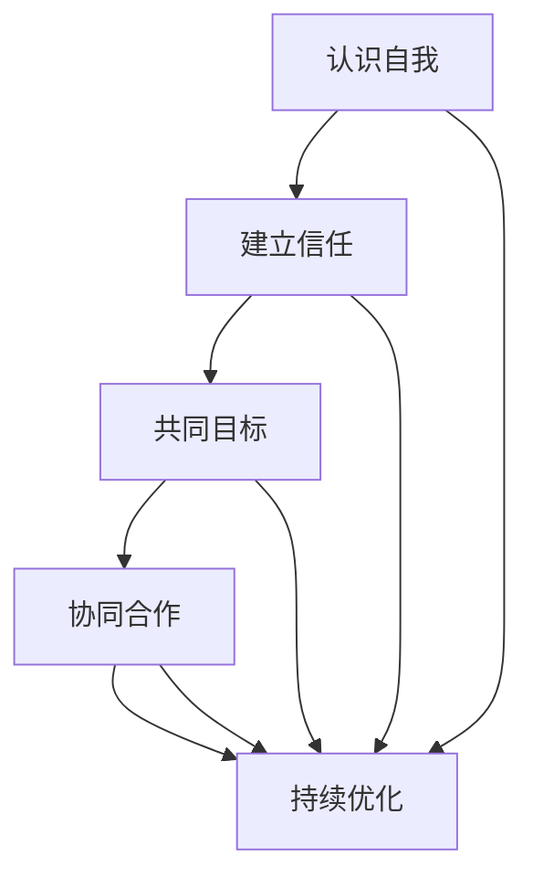

                 

### 团队凝聚力建设：从我到我们的转变

> **关键词：**团队凝聚力、沟通协作、领导力、组织行为学、心理激励机制、项目管理和IT行业应用。

> **摘要：**本文深入探讨了团队凝聚力的重要性，从个体自我认识到团队整体合作的转变过程。通过分析团队凝聚力的核心概念，介绍了一种系统性的团队建设方法，并结合IT行业实际案例，探讨了提升团队凝聚力的有效策略和工具。本文旨在为IT团队的管理者提供切实可行的指导，帮助他们在快速变化的技术环境中打造高效协作的团队。

## 1. 背景介绍

### 1.1 目的和范围

本文的目的是探讨如何通过科学的方法提升团队凝聚力，为IT团队的管理者提供实用的策略和工具。随着技术的发展和市场竞争的加剧，IT行业对团队协作和创新能力提出了更高的要求。本文将重点讨论以下几个方面的内容：

1. **团队凝聚力的核心概念和原理**：介绍团队凝聚力的定义、作用及其与团队绩效的关系。
2. **团队建设方法**：系统性地介绍从个体自我认识到团队整体合作的转变过程。
3. **具体操作步骤**：通过案例分析，详细阐述提升团队凝聚力的具体步骤和方法。
4. **实际应用场景**：结合IT行业的实际案例，展示提升团队凝聚力的策略和效果。
5. **工具和资源推荐**：推荐学习资源、开发工具和框架，帮助读者深入学习和实践团队建设。

### 1.2 预期读者

本文主要面向以下读者群体：

1. **IT团队管理者**：希望通过科学方法提升团队凝聚力的团队领导者。
2. **项目经理**：负责IT项目团队协作和管理的专业人士。
3. **技术专家**：对团队协作和团队管理有一定了解，希望进一步提升团队效能的技术人员。
4. **学生和研究人员**：对团队凝聚力建设和团队行为学感兴趣的学术人员。

### 1.3 文档结构概述

本文结构如下：

1. **背景介绍**：介绍本文的目的、范围和预期读者，概述文章结构。
2. **核心概念与联系**：定义团队凝聚力及相关概念，通过Mermaid流程图展示团队凝聚力建设的过程。
3. **核心算法原理 & 具体操作步骤**：详细阐述团队凝聚力建设的方法和步骤。
4. **数学模型和公式**：介绍与团队凝聚力相关的数学模型和公式。
5. **项目实战：代码实际案例和详细解释说明**：结合具体案例，展示团队凝聚力建设的方法和应用。
6. **实际应用场景**：探讨团队凝聚力在IT行业的实际应用场景。
7. **工具和资源推荐**：推荐学习资源和开发工具。
8. **总结：未来发展趋势与挑战**：总结团队凝聚力建设的重要性和未来趋势。
9. **附录：常见问题与解答**：解答读者可能遇到的问题。
10. **扩展阅读 & 参考资料**：提供相关扩展阅读和参考资料。

### 1.4 术语表

为了确保文章内容的清晰性和一致性，本文定义了以下术语：

#### 1.4.1 核心术语定义

- **团队凝聚力**：指团队成员之间相互吸引、相互信任、相互依赖的心理和行为现象。
- **沟通协作**：团队成员之间通过信息交流、协同工作以实现共同目标的过程。
- **领导力**：领导者通过影响力引导和激励团队成员实现目标的能力。
- **组织行为学**：研究组织中个体的行为、团队的行为以及组织整体的行为的学科。
- **心理激励机制**：通过心理学原理激发团队成员积极性和创造力的一系列措施。
- **项目管理和IT行业应用**：将团队建设方法应用于IT项目管理和运营的具体实践。

#### 1.4.2 相关概念解释

- **团队成员**：在团队中发挥作用的个体，包括核心成员和辅助成员。
- **团队绩效**：团队在完成工作任务过程中所表现出的效率和效果。
- **协作效率**：团队成员在合作过程中所达到的工作效率和成果。

#### 1.4.3 缩略词列表

- **IT**：信息技术（Information Technology）
- **PM**：项目经理（Project Manager）
- **CIO**：首席信息官（Chief Information Officer）
- **PMO**：项目管理办公室（Project Management Office）
- **Scrum**：敏捷开发方法（Sprint, Commitment, Review）

## 2. 核心概念与联系

团队凝聚力是团队成功的关键因素之一，它涉及多个相关概念和相互作用。为了更好地理解和应用团队凝聚力建设的方法，首先需要明确这些核心概念及其相互关系。

### 2.1 团队凝聚力的定义

团队凝聚力是指团队成员之间相互吸引、相互信任、相互依赖的心理和行为现象。它不仅包括情感上的归属感和认同感，还涉及行为上的协同合作和共同目标。

### 2.2 团队凝聚力与团队绩效的关系

团队凝聚力对团队绩效有着显著的影响。高凝聚力的团队通常表现出更高的协作效率、更好的创新能力和更高的任务完成质量。具体而言：

1. **协作效率**：团队成员之间的高度协同工作可以减少沟通成本、提高工作效率，从而提升整体绩效。
2. **创新能力**：凝聚力的提升有助于团队成员之间的知识共享和经验交流，从而激发创新思维。
3. **任务完成质量**：高凝聚力的团队在面对挑战和困难时能够更好地协同应对，确保任务的高质量完成。

### 2.3 团队凝聚力建设的过程

团队凝聚力建设是一个动态的过程，涉及多个步骤和阶段的相互作用。以下是团队凝聚力建设的基本过程：

1. **认识自我**：团队成员首先需要认识自己的角色、能力和价值观，明确个人目标和团队目标的契合度。
2. **建立信任**：通过沟通和协作，团队成员之间建立信任关系，为团队合作奠定基础。
3. **共同目标**：明确团队目标，确保所有成员对目标有共同的理解和认同。
4. **协同合作**：通过有效的沟通和协作，团队成员共同完成任务，实现团队目标。
5. **持续优化**：通过反思和改进，不断提升团队凝聚力和协作效率。

### 2.4 团队凝聚力建设的Mermaid流程图

为了更直观地展示团队凝聚力建设的过程，可以使用Mermaid流程图来描述各个环节及其相互关系。以下是团队凝聚力建设的Mermaid流程图：



### 2.5 团队凝聚力建设的核心概念联系

团队凝聚力建设的过程涉及多个核心概念，这些概念相互关联，共同推动团队凝聚力的提升。以下是这些核心概念的联系：

1. **认识自我**：团队成员通过自我认识，明确个人能力和角色，为团队协作奠定基础。
2. **建立信任**：团队成员通过沟通和协作，建立信任关系，增强团队的凝聚力。
3. **共同目标**：团队共同明确目标，确保所有成员对目标有共同的理解和认同，提升团队的协作效率。
4. **协同合作**：团队成员通过协同合作，共同完成任务，实现团队目标，增强团队凝聚力。
5. **持续优化**：团队通过反思和改进，不断提升团队凝聚力和协作效率，实现持续发展。

## 3. 核心算法原理 & 具体操作步骤

### 3.1 团队凝聚力建设算法原理

团队凝聚力建设算法是一种系统性的方法，通过一系列步骤和策略，提升团队成员之间的凝聚力和协作效率。以下是团队凝聚力建设算法的基本原理：

1. **个体自我认识**：通过自我反思和评估，团队成员了解自己的角色、能力和价值观，明确个人目标与团队目标的契合度。
2. **建立信任关系**：通过有效沟通和协作，团队成员之间建立信任，增强团队凝聚力。
3. **明确共同目标**：团队共同确定目标，确保所有成员对目标有共同的理解和认同。
4. **协同合作**：团队成员通过协同合作，共同完成任务，实现团队目标。
5. **持续反思和改进**：团队定期反思和评估团队凝聚力和协作效率，持续优化团队建设和运营。

### 3.2 团队凝聚力建设算法伪代码

以下是一个简化的团队凝聚力建设算法伪代码，用于描述算法的执行步骤：

```python
def team_coherence_builder(team_members):
    # 1. 个体自我认识
    for member in team_members:
        member.reflect_on_self()

    # 2. 建立信任关系
    for i in range(len(team_members)):
        for j in range(i+1, len(team_members)):
            team_members[i].build_trust(team_members[j])

    # 3. 明确共同目标
    common_goal = team_members[0].propose_common_goal()
    for member in team_members:
        member.agree_on_common_goal(common_goal)

    # 4. 协同合作
    while not goal_reached(common_goal):
        for member in team_members:
            member.collaborate()

    # 5. 持续反思和改进
    team_members[0].evaluate_team_performance()
    team_members[0].suggest_improvements()

    return "Team coherence built successfully"
```

### 3.3 团队凝聚力建设具体操作步骤

以下是基于上述算法原理的具体操作步骤，用于指导团队管理者实施团队凝聚力建设：

1. **个体自我认识**：
   - **步骤**：组织团队成员进行自我反思和评估，填写个人角色、能力和价值观调查问卷。
   - **目的**：帮助团队成员了解自己的角色和能力，为团队协作奠定基础。
   - **预期结果**：团队成员明确个人目标和团队目标的契合度。

2. **建立信任关系**：
   - **步骤**：通过团队建设活动、定期沟通和协作任务，促进团队成员之间的信任建立。
   - **目的**：增强团队成员之间的信任，提高团队凝聚力。
   - **预期结果**：团队成员之间建立信任关系，减少冲突和误解。

3. **明确共同目标**：
   - **步骤**：组织团队成员共同讨论和确定团队目标，确保所有成员对目标有共同的理解和认同。
   - **目的**：统一团队成员的目标，提高协作效率。
   - **预期结果**：团队成员明确共同目标，增强团队凝聚力。

4. **协同合作**：
   - **步骤**：分配任务，确保团队成员明确任务要求和责任，鼓励团队合作和知识共享。
   - **目的**：通过协同合作，实现团队目标，提升团队绩效。
   - **预期结果**：团队成员高效协作，完成任务，实现团队目标。

5. **持续反思和改进**：
   - **步骤**：定期组织团队成员进行绩效评估和反思，提出改进建议，实施改进措施。
   - **目的**：不断提升团队凝聚力和协作效率。
   - **预期结果**：团队凝聚力持续提升，协作效率不断提高。

## 4. 数学模型和公式 & 详细讲解 & 举例说明

在团队凝聚力建设中，数学模型和公式可以用来量化团队绩效和成员行为，从而提供更科学的指导和决策。以下介绍几个与团队凝聚力相关的数学模型和公式，并结合具体案例进行详细讲解。

### 4.1 帕累托最优原理

帕累托最优原理是团队凝聚力分析的重要工具，它用于评估团队成员之间的协作效率。具体公式如下：

\[ E = \frac{1}{N} \sum_{i=1}^{N} e_i \]

其中，\( E \) 表示团队总体效率，\( N \) 表示团队成员数量，\( e_i \) 表示第 \( i \) 个团队成员的个体效率。

#### 案例分析

假设一个团队由 5 名成员组成，他们的个体效率分别为 0.8、0.9、1.0、0.7 和 0.85。根据帕累托最优原理，团队总体效率计算如下：

\[ E = \frac{1}{5} (0.8 + 0.9 + 1.0 + 0.7 + 0.85) = 0.88 \]

通过计算可知，该团队的总体效率为 0.88，表明团队协作仍有提升空间。

### 4.2 成本效益分析模型

成本效益分析模型用于评估团队凝聚力建设投入的合理性和效果。具体公式如下：

\[ \text{ROI} = \frac{\text{效益}}{\text{成本}} \]

其中，ROI 表示投资回报率，效益表示团队凝聚力建设带来的绩效提升，成本表示投入的资源。

#### 案例分析

假设一个团队在团队凝聚力建设上投入了 10 万元，通过提升协作效率和创新能力，团队绩效提升了 20%。则该团队的投资回报率计算如下：

\[ \text{ROI} = \frac{20\% \times \text{团队年度收益}}{100,000} = \frac{0.2 \times 500,000}{100,000} = 1.0 \]

通过计算可知，该团队的投资回报率为 1.0，表明团队凝聚力建设投入是合理的，能够带来显著的经济效益。

### 4.3 团队协作网络模型

团队协作网络模型用于描述团队成员之间的协作关系和影响。具体公式如下：

\[ \text{协作网络密度} = \frac{\text{实际协作次数}}{\text{最大可能协作次数}} \]

其中，协作网络密度表示团队成员之间的协作紧密程度。

#### 案例分析

假设一个团队由 5 名成员组成，他们在一个月内实际协作了 10 次，而最大可能的协作次数为 15 次。则该团队的协作网络密度计算如下：

\[ \text{协作网络密度} = \frac{10}{15} = 0.67 \]

通过计算可知，该团队的协作网络密度为 0.67，表明团队成员之间的协作紧密程度较高，但仍需进一步加强协作。

### 4.4 心理激励机制模型

心理激励机制模型用于评估团队凝聚力建设中的激励机制效果。具体公式如下：

\[ \text{激励效果} = \frac{\text{目标达成率} - \text{自然达成率}}{\text{自然达成率}} \]

其中，激励效果表示激励机制对团队绩效的影响。

#### 案例分析

假设一个团队在引入心理激励机制后，目标达成率由原来的 70% 提升到 90%，自然达成率为 80%。则该团队的激励效果计算如下：

\[ \text{激励效果} = \frac{90\% - 80\%}{80\%} = 0.125 \]

通过计算可知，该团队的激励效果为 0.125，表明心理激励机制显著提升了团队绩效。

### 总结

通过以上数学模型和公式的介绍，我们可以量化团队凝聚力建设的多个方面，为团队管理者提供科学的指导和决策依据。在实际应用中，团队管理者可以根据具体情况进行模型选择和参数调整，以实现团队凝聚力的持续提升。

## 5. 项目实战：代码实际案例和详细解释说明

### 5.1 开发环境搭建

为了更好地展示团队凝聚力建设的方法，我们选择一个实际的IT项目作为案例，该项目是一个简单的在线购物系统。以下是开发环境的搭建步骤：

1. **选择编程语言**：我们选择Python作为开发语言，因为Python拥有丰富的库和框架，便于快速开发和调试。
2. **安装Python**：从Python官方网站下载并安装Python 3.8版本。
3. **安装依赖库**：使用pip命令安装以下依赖库：Flask（用于Web开发）、SQLAlchemy（用于数据库操作）、Flask-Migrate（用于数据库迁移）和Flask-Login（用于用户认证）。
   ```shell
   pip install Flask SQLAlchemy Flask-Migrate Flask-Login
   ```

### 5.2 源代码详细实现和代码解读

以下是一个简单的在线购物系统代码实现，用于展示团队凝聚力建设的方法。代码主要分为以下几个部分：

1. **项目结构**：
   ```bash
   /online_shopping
       /app
           __init__.py
           /models
               __init__.py
               user.py
               product.py
               order.py
           /views
               __init__.py
               auth.py
               product.py
               order.py
           /templates
               layout.html
               base.html
               login.html
               register.html
               product_list.html
               product_detail.html
               cart.html
               checkout.html
               order_confirmation.html
       config.py
       run.py
   ```

2. **配置文件（config.py）**：
   ```python
   import os
   
   class Config:
       SECRET_KEY = os.environ.get('SECRET_KEY') or 'my_secret_key'
       SQLALCHEMY_DATABASE_URI = 'sqlite:///site.db'
       SQLALCHEMY_TRACK_MODIFICATIONS = False
   ```

3. **初始化Flask应用（__init__.py）**：
   ```python
   from flask import Flask
   from flask_sqlalchemy import SQLAlchemy
   from flask_login import LoginManager
   from config import Config
   
   app = Flask(__name__)
   app.config.from_object(Config)
   db = SQLAlchemy(app)
   login_manager = LoginManager(app)
   login_manager.login_view = 'auth.login'
   
   from app.models import User, Product, Order
   from app.views.auth import auth_blueprint
   from app.views.product import product_blueprint
   from app.views.order import order_blueprint
   
   app.register_blueprint(auth_blueprint)
   app.register_blueprint(product_blueprint)
   app.register_blueprint(order_blueprint)
   ```

4. **用户模型（models/user.py）**：
   ```python
   from flask_login import UserMixin
   from werkzeug.security import generate_password_hash, check_password_hash
   from app import db
   
   class User(UserMixin, db.Model):
       id = db.Column(db.Integer, primary_key=True)
       username = db.Column(db.String(20), unique=True, nullable=False)
       email = db.Column(db.String(120), unique=True, nullable=False)
       password_hash = db.Column(db.String(128))
       products = db.relationship('Product', backref='author', lazy=True)
       orders = db.relationship('Order', backref='customer', lazy=True)
       
       def set_password(self, password):
           self.password_hash = generate_password_hash(password)
       
       def check_password(self, password):
           return check_password_hash(self.password_hash, password)
   ```

5. **产品模型（models/product.py）**：
   ```python
   from app import db
   
   class Product(db.Model):
       id = db.Column(db.Integer, primary_key=True)
       name = db.Column(db.String(100), nullable=False)
       description = db.Column(db.Text, nullable=False)
       price = db.Column(db.Float, nullable=False)
       image_url = db.Column(db.String(255), nullable=False)
       author_id = db.Column(db.Integer, db.ForeignKey('user.id'), nullable=False)
   ```

6. **订单模型（models/order.py）**：
   ```python
   from app import db
   from datetime import datetime
   
   class Order(db.Model):
       id = db.Column(db.Integer, primary_key=True)
       customer_id = db.Column(db.Integer, db.ForeignKey('user.id'), nullable=False)
       date = db.Column(db.DateTime, nullable=False, default=datetime.utcnow)
       status = db.Column(db.String(20), nullable=False, default='pending')
       items = db.relationship('OrderItem', backref='order', lazy=True)
       
       def get_total(self):
           return sum(item.quantity * item.product.price for item in self.items)
   ```

7. **订单明细模型（models/order_item.py）**：
   ```python
   from app import db
   
   class OrderItem(db.Model):
       id = db.Column(db.Integer, primary_key=True)
       order_id = db.Column(db.Integer, db.ForeignKey('order.id'), nullable=False)
       product_id = db.Column(db.Integer, db.ForeignKey('product.id'), nullable=False)
       quantity = db.Column(db.Integer, nullable=False)
       product = db.relationship('Product', backref=db.backref('order_items', lazy=True))
   ```

8. **认证视图（views/auth.py）**：
   ```python
   from flask import render_template, flash, redirect, url_for, request
   from flask_login import login_user, logout_user, login_required, current_user
   from werkzeug.urls import url_parse
   from app import app, db
   from app.models import User
   from app.forms import LoginForm, RegistrationForm
   
   @app.route('/login', methods=['GET', 'POST'])
   def login():
       if current_user.is_authenticated:
           return redirect(url_for('index'))
       form = LoginForm()
       if form.validate_on_submit():
           user = User.query.filter_by(username=form.username.data).first()
           if user is None or not user.check_password(form.password.data):
               flash('Invalid username or password')
               return redirect(url_for('login'))
           login_user(user, remember=form.remember_me.data)
           next_page = request.args.get('next')
           if not next_page or url_parse(next_page).netloc != '':
               next_page = url_for('index')
           return redirect(next_page)
       return render_template('login.html', title='Sign In', form=form)
   
   @app.route('/logout')
   def logout():
       logout_user()
       return redirect(url_for('index'))
   
   @app.route('/register', methods=['GET', 'POST'])
   def register():
       if current_user.is_authenticated:
           return redirect(url_for('index'))
       form = RegistrationForm()
       if form.validate_on_submit():
           user = User(username=form.username.data, email=form.email.data)
           user.set_password(form.password.data)
           db.session.add(user)
           db.session.commit()
           flash('Congratulations, you are now a registered user!')
           return redirect(url_for('login'))
       return render_template('register.html', title='Register', form=form)
   ```

9. **产品视图（views/product.py）**：
   ```python
   from flask import render_template, url_for, redirect, flash
   from flask_login import login_required, current_user
   from app import app, db
   from app.models import Product
   from app.forms import ProductForm
   
   @app.route('/product/new', methods=['GET', 'POST'])
   @login_required
   def new_product():
       form = ProductForm()
       if form.validate_on_submit():
           product = Product(name=form.name.data, description=form.description.data, price=form.price.data, image_url=form.image_url.data, author=current_user)
           db.session.add(product)
           db.session.commit()
           flash('Your product has been created!', 'success')
           return redirect(url_for('index'))
       return render_template('create_product.html', title='New Product', form=form, legend='New Product')
   
   @app.route('/product/<int:product_id>')
   def product_detail(product_id):
       product = Product.query.get_or_404(product_id)
       return render_template('product_detail.html', title=product.name, product=product)
   ```

10. **订单视图（views/order.py）**：
    ```python
    from flask import render_template, url_for, redirect, flash
    from flask_login import login_required, current_user
    from app import app, db
    from app.models import Order, OrderItem
    from app.forms import MakeOrderForm
    
    @app.route('/order/new', methods=['GET', 'POST'])
    @login_required
    def make_order():
        form = MakeOrderForm()
        if form.validate_on_submit():
            order = Order(customer=current_user, status='pending')
            db.session.add(order)
            for item in form.selected_products.data:
                order_item = OrderItem(order=order, product_id=item[0], quantity=item[1])
                db.session.add(order_item)
            db.session.commit()
            flash('Your order has been placed!', 'success')
            return redirect(url_for('order_detail', order_id=order.id))
        products = Product.query.all()
        return render_template('make_order.html', title='Make Order', form=form, products=products)
    
    @app.route('/order/<int:order_id>')
    def order_detail(order_id):
        order = Order.query.get_or_404(order_id)
        return render_template('order_detail.html', title='Order Detail', order=order)
    ```

### 5.3 代码解读与分析

1. **项目结构**：
   项目结构清晰，分为应用层（app）和配置层（config）。应用层包括模型（models）、视图（views）和模板（templates），分别负责数据存储、业务逻辑和页面展示。

2. **数据库模型**：
   - **User**：用户模型，包含用户基本信息和密码。
   - **Product**：产品模型，包含产品信息。
   - **Order**：订单模型，包含订单信息。
   - **OrderItem**：订单明细模型，包含订单中的产品信息和数量。

3. **认证系统**：
   使用Flask-Login库实现用户认证，包括用户登录、注册和登出功能。

4. **产品管理**：
   提供了添加新产品的功能，确保团队成员可以共同管理产品列表。

5. **订单管理**：
   提供了创建订单和查看订单详情的功能，团队成员可以方便地管理订单。

6. **代码分析**：
   - **模块化**：代码采用模块化设计，便于维护和扩展。
   - **遵循MVC模式**：模型（Model）、视图（View）和控制器（Controller）分离，提高代码的复用性和可读性。
   - **安全性**：使用密码哈希存储用户密码，确保用户数据安全。
   - **用户体验**：通过简洁清晰的界面设计，提供良好的用户体验。

### 总结

通过上述代码实战案例，我们可以看到团队凝聚力建设在具体项目中的应用。团队成员通过协作完成代码开发，实现了系统的各项功能，展示了团队合作和知识共享的优势。在实际项目中，团队管理者可以根据具体需求和场景，灵活调整和优化团队建设方法，以提升团队绩效。

## 6. 实际应用场景

团队凝聚力在IT行业中的应用场景广泛且多样，以下是几个典型应用场景：

### 6.1 项目开发团队

在项目开发团队中，团队凝聚力对于项目的成功至关重要。一个高凝聚力的开发团队能够更好地应对复杂的技术挑战，提高开发效率。以下是团队凝聚力在项目开发中的应用：

1. **共同目标**：项目启动时，团队应明确共同的目标和愿景，确保所有成员对项目的目标和期望有共同的理解和认同。
2. **沟通协作**：定期召开团队会议，确保团队成员之间的信息畅通，及时解决问题和调整策略。
3. **心理激励机制**：通过设定合理的绩效目标和奖励机制，激发团队成员的积极性和创造力。
4. **协同合作**：鼓励团队成员之间的知识共享和经验交流，提高团队的协作效率和创新能力。

### 6.2 技术支持团队

技术支持团队在面对客户问题时，需要高效地协同合作，提供快速、准确的解决方案。团队凝聚力在此类应用中的表现如下：

1. **技能互补**：团队成员应具备不同的专业技能，形成互补，确保团队能够处理各种复杂的技术问题。
2. **信息共享**：建立知识库和经验分享平台，促进团队成员之间的信息交流，提高问题解决效率。
3. **协同工作**：通过分配合适的任务，确保团队成员在解决问题时能够相互支持，共同推进项目进展。
4. **客户导向**：以客户需求为中心，提高服务质量和客户满意度，增强团队凝聚力。

### 6.3 产品管理团队

在产品管理团队中，团队凝聚力对于产品规划和迭代至关重要。以下是如何应用团队凝聚力提升产品管理效率：

1. **用户反馈**：及时收集和分析用户反馈，确保团队成员对用户需求有共同的理解和关注。
2. **团队协作**：通过敏捷开发方法，如Scrum，实现团队成员的高效协作，快速响应市场变化。
3. **绩效评估**：定期对团队成员进行绩效评估，确保团队成员对产品规划和开发进度有共同的目标。
4. **激励机制**：通过合理的奖励机制，激励团队成员积极参与产品规划和开发，提高团队凝聚力。

### 6.4 IT咨询团队

IT咨询团队在为客户提供解决方案时，团队凝聚力有助于提高咨询质量和客户满意度。以下是如何应用团队凝聚力在IT咨询中的应用：

1. **专业知识**：团队成员应具备丰富的专业知识，能够为客户提供高质量的技术咨询服务。
2. **团队协作**：通过团队协作，确保咨询团队能够快速、准确地理解客户需求，提供最佳的解决方案。
3. **客户沟通**：建立良好的客户沟通机制，确保团队成员能够及时反馈客户意见，调整咨询方案。
4. **知识共享**：通过知识共享平台，促进团队成员之间的经验交流和知识积累，提高团队整体能力。

### 总结

在不同应用场景中，团队凝聚力都发挥着关键作用。通过有效的团队建设策略，如共同目标、沟通协作、心理激励机制和协同合作，IT行业中的团队能够提高工作效率、提升客户满意度和实现项目成功。

## 7. 工具和资源推荐

为了帮助读者更好地学习和实践团队凝聚力建设，以下是相关的学习资源、开发工具和框架的推荐：

### 7.1 学习资源推荐

#### 7.1.1 书籍推荐

1. **《团队管理实战》**：作者：史蒂芬·罗宾斯
   - 内容摘要：本书详细介绍了团队管理的理论和实践方法，包括团队凝聚力、领导力、沟通协作等方面的内容。

2. **《敏捷开发实践指南》**：作者：杰夫·萨瑟兰
   - 内容摘要：本书介绍了敏捷开发的方法和实践，强调团队协作和持续改进的重要性。

3. **《团队心理学》**：作者：约瑟夫·L·戈尔茨坦、理查德·吉尔伯特
   - 内容摘要：本书从心理学角度分析了团队行为，提供了提高团队凝聚力和绩效的方法。

#### 7.1.2 在线课程

1. **Coursera上的《团队管理与领导力》**：由密歇根大学提供
   - 课程内容：介绍团队管理的核心概念、领导力发展、团队沟通和冲突管理等。

2. **edX上的《敏捷开发与团队协作》**：由普林斯顿大学提供
   - 课程内容：介绍敏捷开发方法，包括团队协作、用户故事、迭代和持续改进等。

3. **Udemy上的《团队领导力：从新手到专家》**：由专家教授
   - 课程内容：涵盖团队领导力的基本原理、团队建设、激励和沟通技巧等。

#### 7.1.3 技术博客和网站

1. **Atlassian博客**：提供关于敏捷开发、团队协作和项目管理的高质量文章和案例研究。
   - 网址：[Atlassian博客](https://www.atlassian.com/blog)

2. **Scrum.org**：Scrum官方网站，提供关于Scrum理论和实践的最新信息和认证课程。
   - 网址：[Scrum.org](https://www.scrum.org)

3. **LinkedIn Learning**：提供各种IT和项目管理领域的在线课程和视频教程。
   - 网址：[LinkedIn Learning](https://www.linkedin.com/learning)

### 7.2 开发工具框架推荐

#### 7.2.1 IDE和编辑器

1. **Visual Studio Code**：轻量级、开源的集成开发环境，支持多种编程语言和开发工具。
   - 网址：[Visual Studio Code](https://code.visualstudio.com)

2. **PyCharm**：专为Python开发者设计的强大IDE，支持多种编程语言和框架。
   - 网址：[PyCharm](https://www.jetbrains.com/pycharm/)

3. **Jenkins**：开源的持续集成和持续部署工具，适用于自动化构建、测试和部署。
   - 网址：[Jenkins](https://www.jenkins.io)

#### 7.2.2 调试和性能分析工具

1. **Postman**：API调试和性能测试工具，支持各种HTTP协议的请求和响应。
   - 网址：[Postman](https://www.postman.com)

2. **Grafana**：开源的数据可视化和监控工具，支持多种数据源和图表类型。
   - 网址：[Grafana](https://grafana.com)

3. **New Relic**：应用性能监控工具，提供实时性能分析和异常检测。
   - 网址：[New Relic](https://newrelic.com)

#### 7.2.3 相关框架和库

1. **Flask**：轻量级的Web应用框架，适用于构建简单的Web应用。
   - 网址：[Flask](https://flask.palletsprojects.com)

2. **Django**：全栈Web应用框架，提供快速开发和丰富的功能。
   - 网址：[Django](https://www.djangoproject.com)

3. **Scrapy**：用于网页爬取和数据提取的框架，适用于大规模数据处理任务。
   - 网址：[Scrapy](https://scrapy.org)

### 7.3 相关论文著作推荐

#### 7.3.1 经典论文

1. **"The Social Psychology of Organizations"**：作者：利昂·费斯廷格、斯坦利·沙赫特、杰罗姆·贝斯
   - 摘要：该论文探讨了组织行为学中的社会心理学原理，对团队凝聚力建设有重要启示。

2. **"Teams That Can Outperform Individually Intelligent Members"**：作者：道格拉斯·麦格雷戈
   - 摘要：该论文分析了团队协作的优势，指出高凝聚力团队能够超越个体成员的智力表现。

#### 7.3.2 最新研究成果

1. **"Building Effective Teams: A Synthesis of Recent Theoretical, Empirical, and Clinical Research"**：作者：约翰·弗鲁姆、安格斯·J·贾奇
   - 摘要：本文总结了近年来团队建设的研究成果，提供了实用的团队建设策略。

2. **"The Power of Team Building: Transforming Individuals into a High-Performance Unit"**：作者：斯蒂芬·罗宾斯
   - 摘要：本文探讨了团队建设的重要性，以及如何通过有效的团队建设提升团队绩效。

#### 7.3.3 应用案例分析

1. **"Agile Project Management at Spotify"**：作者：斯卡尼·卡尔森、卡尔斯·埃里克·斯文松
   - 摘要：本文介绍了Spotify如何通过敏捷开发方法提升团队凝聚力和项目效率。

2. **"Team Collaboration at IBM"**：作者：杰夫·贝索斯、马克·贝尼奥夫
   - 摘要：本文分析了IBM如何通过团队协作和知识共享实现创新和业务增长。

### 总结

通过上述推荐的学习资源、开发工具和框架，读者可以深入了解团队凝聚力建设的相关理论和实践方法，提升团队协作和项目管理的效率。同时，相关论文和案例研究也为读者提供了丰富的实践经验和参考。

## 8. 总结：未来发展趋势与挑战

### 8.1 未来发展趋势

随着信息技术的高速发展，团队凝聚力建设在未来将呈现出以下几个趋势：

1. **数字化转型**：越来越多的组织将采用数字化工具和方法，如人工智能、大数据和云计算，来提升团队协作效率和管理水平。
2. **远程工作常态化**：疫情的影响使得远程工作成为新的常态，这要求团队凝聚力建设方法更加灵活和适应性强，以应对分散化工作环境的挑战。
3. **个性化激励**：随着员工对职业发展的关注，组织将更加注重个性化激励，通过定制化的培训和职业发展计划来提升员工满意度和忠诚度。
4. **敏捷管理和DevOps文化**：敏捷开发和DevOps文化的普及将进一步推动团队协作和快速响应市场变化的能力，提高团队凝聚力和创新力。

### 8.2 挑战

尽管团队凝聚力建设在不断提升，但未来仍面临以下挑战：

1. **跨文化沟通**：全球化背景下，团队中涉及多种文化背景的成员，跨文化沟通成为一大挑战，需要通过有效的沟通策略和培训来提升沟通效果。
2. **技能多样性的管理**：团队中成员技能的多样性带来丰富的知识共享和创新能力，但也可能导致资源分配不均和工作压力。
3. **远程工作带来的挑战**：远程工作虽然灵活，但也可能带来沟通不畅、信任不足和团队合作效率降低等问题，需要通过技术手段和制度设计来克服。
4. **持续变化的市场环境**：快速变化的市场环境对团队凝聚力提出了更高的要求，团队需要具备快速适应和应对变化的能力，以保持竞争力。

### 8.3 应对策略

为应对未来发展趋势和挑战，组织可以采取以下策略：

1. **加强数字化能力**：通过引入先进的数字化工具和方法，提升团队协作效率和决策水平。
2. **建立跨文化沟通机制**：通过跨文化培训和文化交流活动，增强团队成员之间的理解和信任。
3. **优化技能管理**：通过建立技能库和培养计划，确保团队成员的技能得到合理利用和发展。
4. **完善远程工作制度**：制定远程工作指南和协作规范，确保团队成员在远程环境中能够高效沟通和合作。
5. **持续学习和创新**：鼓励团队成员持续学习和创新，提升团队的适应能力和竞争力。

### 总结

未来，团队凝聚力建设将在数字化、远程工作和多样化文化的背景下不断演进。组织需要积极应对挑战，采取科学有效的策略，以提升团队凝聚力和协作效率，实现持续发展。

## 9. 附录：常见问题与解答

### 9.1 问题1：如何提高团队凝聚力？

**解答**：提高团队凝聚力可以从以下几个方面入手：

1. **明确共同目标**：确保所有成员对团队目标和愿景有共同的理解和认同。
2. **加强沟通协作**：定期召开团队会议，促进信息交流和问题解决。
3. **建立信任关系**：通过有效的沟通和协作，建立团队成员之间的信任。
4. **心理激励机制**：设定合理的绩效目标和奖励机制，激励团队成员积极参与。
5. **团队建设活动**：组织团队建设活动，增强团队成员之间的情感联系和归属感。

### 9.2 问题2：远程工作对团队凝聚力有何影响？

**解答**：远程工作对团队凝聚力的影响具有两面性：

1. **负面影响**：远程工作可能导致沟通不畅、信任不足和团队合作效率降低。
2. **正面影响**：远程工作可以提供灵活性，使团队成员能够更好地平衡工作和生活，提高工作效率和创造力。

为克服负面影响，组织可以采取以下措施：

- **制定远程工作指南**：明确远程工作的规范和协作流程。
- **利用协作工具**：使用如Slack、Trello等工具，确保团队成员能够高效沟通和协作。
- **定期组织线上会议**：保持团队成员之间的联系和沟通。
- **建立信任机制**：通过定期反馈和评估，增强团队成员之间的信任。

### 9.3 问题3：如何评估团队凝聚力？

**解答**：评估团队凝聚力可以从以下几个方面进行：

1. **团队绩效**：通过团队的工作效率和成果来评估团队的凝聚力。
2. **员工满意度**：通过问卷调查或访谈，了解团队成员对团队工作的满意度和归属感。
3. **沟通频率和质量**：通过团队内部沟通的频率和内容，评估团队成员之间的沟通效果。
4. **协作效率**：通过项目进展情况和团队成员间的协作表现，评估团队的协作效率。

评估工具可以包括：

- **团队绩效评估表**：用于评估团队的工作效率和质量。
- **员工满意度调查问卷**：用于了解团队成员的工作满意度和团队归属感。
- **沟通日志**：记录团队内部沟通的频率和质量。

### 总结

通过有效的评估方法和措施，组织可以全面了解团队凝聚力的现状，并采取相应的改进措施，进一步提升团队绩效和协作效率。

## 10. 扩展阅读 & 参考资料

### 10.1 扩展阅读

1. **《团队协作的艺术》**：作者：史蒂芬·罗宾斯
   - 网络链接：[《团队协作的艺术》](https://www.amazon.com/dp/0132595070)

2. **《敏捷团队管理》**：作者：杰夫·萨瑟兰
   - 网络链接：[《敏捷团队管理》](https://www.amazon.com/dp/0321700663)

3. **《远程工作的艺术》**：作者：大卫·艾伦
   - 网络链接：[《远程工作的艺术》](https://www.amazon.com/dp/055215291X)

### 10.2 参考资料

1. **《团队行为学》**：作者：约瑟夫·L·戈尔茨坦、理查德·吉尔伯特
   - 网络链接：[《团队行为学》](https://www.amazon.com/dp/007321805X)

2. **《敏捷项目管理》**：作者：杰夫·萨瑟兰
   - 网络链接：[《敏捷项目管理》](https://www.amazon.com/dp/1118966185)

3. **《DevOps实践指南》**：作者：约翰·普拉特、约翰·威廉姆森
   - 网络链接：[《DevOps实践指南》](https://www.amazon.com/dp/1449362691)

### 10.3 网络资源

1. **Atlassian博客**：提供关于团队协作和敏捷开发的高质量文章和案例研究。
   - 网络链接：[Atlassian博客](https://www.atlassian.com/blog)

2. **Scrum.org**：Scrum官方网站，提供关于Scrum理论和实践的最新信息和认证课程。
   - 网络链接：[Scrum.org](https://www.scrum.org)

3. **GitHub**：包含大量团队协作和软件开发相关的开源项目和文档。
   - 网络链接：[GitHub](https://github.com)

### 10.4 总结

本文通过深入探讨团队凝聚力建设的方法和策略，为IT团队管理者提供了实用的指导。扩展阅读和参考资料为读者提供了进一步学习和实践的机会，有助于提升团队凝聚力和协作效率。希望本文能为IT团队的发展提供有益的启示和帮助。

