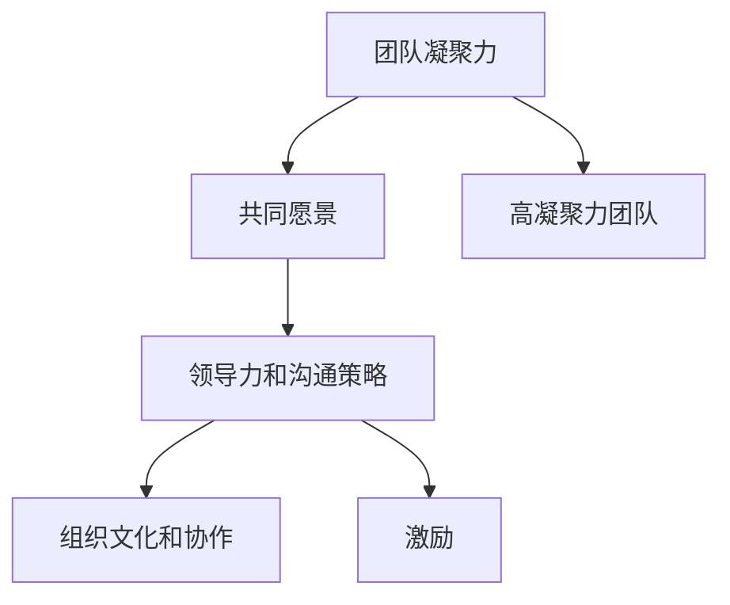

                 

# 团队凝聚力：建立共同愿景的艺术

> **关键词**：团队凝聚力、共同愿景、组织文化、领导力、协作、沟通、激励

> **摘要**：本文深入探讨了团队凝聚力的核心要素，尤其是建立共同愿景的重要性。通过一步步的逻辑分析，本文揭示了如何通过有效的领导力和沟通策略来构建和维持一个高凝聚力的团队，从而提高整体组织的效率和绩效。文章还提供了实用的算法原理、数学模型、实战案例以及相关工具和资源的推荐，为读者提供了一套完整的团队凝聚力提升指南。

## 1. 背景介绍

### 1.1 目的和范围

在当今快速变化和竞争激烈的市场环境中，团队的凝聚力和高效协作成为组织成功的关键因素。本文旨在探讨团队凝聚力的重要性，特别是共同愿景在团队中的作用，并提供一套系统的方法和工具，帮助领导者和管理者构建和维持一个高凝聚力的团队。

本文将覆盖以下几个主题：

1. **团队凝聚力的定义和重要性**：阐述团队凝聚力概念，讨论其在组织成功中的作用。
2. **共同愿景的概念和作用**：介绍共同愿景的定义，解释其对团队凝聚力的影响。
3. **领导力和沟通策略**：探讨领导者如何通过有效的领导力和沟通策略来提升团队凝聚力。
4. **数学模型和算法原理**：引入数学模型和算法原理，用于分析和优化团队凝聚力。
5. **实战案例和代码实现**：提供具体的实战案例和代码实现，展示如何在实际项目中应用这些概念。
6. **工具和资源推荐**：推荐相关的学习资源和工具，以帮助读者进一步深入学习和实践。

### 1.2 预期读者

本文预期读者为：

- **企业领导者和管理者**：希望提升团队凝聚力和整体组织绩效。
- **项目经理**：寻求通过更好的团队管理来提高项目成功率。
- **团队成员**：希望了解如何通过协作和沟通来提升团队凝聚力。
- **人力资源专业人士**：专注于团队建设和组织发展。

### 1.3 文档结构概述

本文结构如下：

1. **背景介绍**：介绍团队凝聚力的背景和本文的目的。
2. **核心概念与联系**：讨论团队凝聚力、共同愿景、领导力和沟通策略等核心概念，并使用Mermaid流程图展示其联系。
3. **核心算法原理 & 具体操作步骤**：详细讲解提升团队凝聚力的算法原理和操作步骤。
4. **数学模型和公式 & 详细讲解 & 举例说明**：引入数学模型和公式，并通过例子进行详细说明。
5. **项目实战：代码实际案例和详细解释说明**：提供具体的代码实现和解读。
6. **实际应用场景**：讨论团队凝聚力在不同场景中的应用。
7. **工具和资源推荐**：推荐相关的学习资源和开发工具。
8. **总结：未来发展趋势与挑战**：总结本文的关键点，并探讨未来发展趋势和挑战。
9. **附录：常见问题与解答**：回答读者可能关心的问题。
10. **扩展阅读 & 参考资料**：提供进一步阅读的资源。

### 1.4 术语表

#### 1.4.1 核心术语定义

- **团队凝聚力**：团队成员之间的相互吸引力和协作意愿，体现为共同的目标和价值观。
- **共同愿景**：团队成员共同持有的对未来的期望和憧憬，是团队凝聚力的核心动力。
- **领导力**：领导者通过影响力和决策能力来引导和激励团队成员的过程。
- **沟通策略**：团队内部和外部沟通的方式和手段，用于分享信息、解决问题和建立信任。

#### 1.4.2 相关概念解释

- **组织文化**：组织内部共享的价值观、信念和行为规范，影响团队凝聚力和员工行为。
- **协作**：团队成员共同完成任务的互动过程，依赖良好的沟通和协调。
- **激励**：通过奖励和认可来激发团队成员的积极性和创造力。

#### 1.4.3 缩略词列表

- **IDE**：集成开发环境（Integrated Development Environment）
- **CPU**：中央处理器（Central Processing Unit）
- **OS**：操作系统（Operating System）
- **API**：应用程序编程接口（Application Programming Interface）

## 2. 核心概念与联系

在探讨团队凝聚力的提升之前，我们需要明确几个核心概念，并理解它们之间的联系。

### 2.1 团队凝聚力

团队凝聚力是指团队成员之间的相互吸引力和协作意愿，它是团队有效运作的基础。高凝聚力团队的成员具有以下特点：

- **共同目标**：团队成员明确共同的目标和愿景，有助于形成团结一致的力量。
- **互信互赖**：团队成员之间建立互信，愿意相互依赖和支持，提高协作效率。
- **积极互动**：团队成员积极互动，分享想法和经验，促进知识和技能的共享。
- **共同价值观**：团队成员共享相似的价值观和信念，减少内部冲突和误解。

### 2.2 共同愿景

共同愿景是团队凝聚力的重要驱动力，它是团队成员共同持有的对未来的期望和憧憬。共同愿景具有以下作用：

- **凝聚力量**：共同愿景能够将团队成员凝聚在一起，形成强大的合力。
- **激励作用**：共同愿景激发团队成员的积极性和创造力，推动团队不断进步。
- **方向指导**：共同愿景为团队提供明确的方向和目标，有助于团队成员集中精力。
- **决策依据**：共同愿景作为决策依据，有助于团队成员在面临选择时保持一致。

### 2.3 领导力和沟通策略

领导力和沟通策略在提升团队凝聚力中起着关键作用。有效的领导力和沟通策略包括：

- **领导力**：领导者通过影响力和决策能力来引导和激励团队成员。领导者需要具备以下特质：
  - **愿景引领**：明确表达团队的愿景，激发团队成员的认同感。
  - **激励认可**：通过奖励和认可来激励团队成员，增强团队的积极性。
  - **冲突管理**：有效解决团队成员之间的冲突，维护团队的和谐。

- **沟通策略**：沟通是团队凝聚力的基础，有效的沟通策略包括：
  - **透明沟通**：确保信息透明，让团队成员了解团队的目标、进展和问题。
  - **积极倾听**：鼓励团队成员表达意见，并给予积极的反馈。
  - **冲突解决**：通过沟通解决团队成员之间的分歧，促进共识。

### 2.4 组织文化和协作

组织文化和协作是团队凝聚力的重要组成部分。组织文化是组织内部共享的价值观、信念和行为规范，它影响团队成员的行为和态度。协作则是团队成员共同完成任务的过程，依赖良好的沟通和协调。

- **组织文化**：积极、开放、包容的组织文化有助于增强团队的凝聚力。组织文化可以通过以下几个方面来塑造：
  - **价值观传达**：明确组织的核心价值观，让团队成员认同和遵循。
  - **培训和发展**：提供培训和发展机会，帮助团队成员提升能力和技能。
  - **奖励机制**：建立公正、透明的奖励机制，激励团队成员积极参与。

- **协作**：协作是团队凝聚力的体现，有效的协作策略包括：
  - **明确分工**：明确团队成员的职责和任务，确保工作的高效开展。
  - **资源共享**：鼓励团队成员分享资源和知识，促进团队的整体进步。
  - **定期反馈**：定期进行团队反馈，及时调整协作策略，提高协作效果。

### 2.5 激励

激励是提升团队凝聚力的重要手段。激励可以通过以下方式实现：

- **奖励和认可**：通过奖励和认可来激励团队成员，增强他们的积极性和忠诚度。
- **职业发展**：提供职业发展机会，帮助团队成员实现个人目标和成长。
- **工作环境**：营造积极、健康的工作环境，提高团队成员的工作满意度和归属感。

### 2.6 核心概念联系

团队凝聚力、共同愿景、领导力和沟通策略、组织文化和协作、激励这些核心概念之间紧密相连，共同构建了一个完整的团队凝聚力提升体系。以下是它们之间的联系：

1. **共同愿景**：共同愿景是团队凝聚力的核心驱动力，它能够将团队成员凝聚在一起，形成强大的合力。
2. **领导力和沟通策略**：领导力和沟通策略是领导者通过影响力和决策能力来引导和激励团队成员的过程，有助于提升团队凝聚力。
3. **组织文化和协作**：组织文化和协作是团队凝聚力的重要组成部分，通过塑造积极、开放、包容的组织文化和加强协作，可以增强团队的凝聚力。
4. **激励**：激励是提升团队凝聚力的重要手段，通过奖励和认可、职业发展、工作环境等方式来激励团队成员，可以增强他们的积极性和忠诚度。

### 2.7 Mermaid 流程图

以下是一个简化的Mermaid流程图，展示了核心概念之间的联系：



## 3. 核心算法原理 & 具体操作步骤

在提升团队凝聚力方面，我们可以借助一些核心算法原理，通过具体的操作步骤来实施和优化。以下是一个简要的算法原理和操作步骤概述。

### 3.1 算法原理概述

提升团队凝聚力的核心算法可以概括为以下几个步骤：

1. **共同愿景设定**：通过明确共同愿景，引导团队成员形成共同的目标和期望。
2. **领导力发挥**：领导者通过影响力和决策能力来激励和引导团队成员。
3. **沟通策略实施**：通过有效的沟通策略，确保团队成员之间的信息透明和互动。
4. **组织文化塑造**：通过组织文化的塑造，营造积极、健康的工作环境。
5. **激励手段运用**：通过奖励和认可等激励手段，提高团队成员的积极性和忠诚度。

### 3.2 具体操作步骤

下面我们将详细阐述每个步骤的具体操作。

#### 3.2.1 共同愿景设定

**步骤 1**：明确愿景目标

- **目标描述**：领导者需要明确团队的愿景目标，用简洁有力的语言描述，确保团队成员都能理解和认同。
- **目标传达**：通过会议、培训等方式，将愿景目标传达给团队成员，确保他们了解并接受。

**伪代码**：

```
define VisionGoal as "实现产品市场的领导地位，成为行业标杆"

function communicateVision(VisionGoal) {
    // 调用会议或培训系统
    callMeetingOrTraining()
    // 传达愿景目标
    announceVisionGoal(VisionGoal)
}
```

#### 3.2.2 领导力发挥

**步骤 2**：激励团队成员

- **激励机制**：建立激励机制，包括奖励、晋升、培训等，以激励团队成员。
- **正面反馈**：及时给予团队成员正面反馈，认可他们的贡献和进步。

**伪代码**：

```
function motivateTeamMembers() {
    // 激励机制
    implementIncentiveSystem()
    // 正面反馈
    providePositiveFeedback()
}
```

#### 3.2.3 沟通策略实施

**步骤 3**：确保透明沟通

- **信息透明**：确保团队内部信息的透明，避免信息孤岛。
- **沟通渠道**：建立多种沟通渠道，如定期会议、即时通讯、邮件等，以方便团队成员之间的交流。

**伪代码**：

```
function ensureTransparentCommunication() {
    // 信息透明
    implementTransparentInformationSystem()
    // 沟通渠道
    establishCommunicationChannels()
}
```

#### 3.2.4 组织文化塑造

**步骤 4**：营造积极文化

- **价值观传达**：明确组织的核心价值观，并通过日常行为和决策来传达。
- **文化活动**：定期组织团队建设活动，如团建活动、文化竞赛等，增强团队的凝聚力和认同感。

**伪代码**：

```
function cultivateOrganizationalCulture() {
    // 价值观传达
    communicateCoreValues()
    // 文化活动
    organizeTeamBuildingActivities()
}
```

#### 3.2.5 激励手段运用

**步骤 5**：运用激励手段

- **奖励机制**：建立奖励机制，对表现优秀的团队成员给予奖励。
- **职业发展**：提供职业发展机会，帮助团队成员实现个人目标和成长。

**伪代码**：

```
function applyIncentiveMethods() {
    // 奖励机制
    implementRewardSystem()
    // 职业发展
    offerCareerDevelopmentOpportunities()
}
```

### 3.3 伪代码详细讲解

以上伪代码提供了一个提升团队凝聚力的算法框架。以下是每个步骤的详细解释：

- **共同愿景设定**：通过定义`VisionGoal`变量，明确团队的愿景目标，并使用`communicateVision`函数将愿景传达给团队成员。
- **领导力发挥**：`motivateTeamMembers`函数通过实施激励机制和提供正面反馈来激励团队成员。
- **沟通策略实施**：`ensureTransparentCommunication`函数确保团队内部信息的透明，并建立多种沟通渠道。
- **组织文化塑造**：`cultivateOrganizationalCulture`函数通过传达核心价值观和组织文化活动来塑造积极文化。
- **激励手段运用**：`applyIncentiveMethods`函数通过建立奖励机制和提供职业发展机会来运用激励手段。

这些步骤共同构成了一个系统的方法，帮助团队领导者和管理者有效提升团队凝聚力。

## 4. 数学模型和公式 & 详细讲解 & 举例说明

在团队凝聚力的提升过程中，数学模型和公式可以提供量化的方法来评估团队的状态和进展。以下是一些关键的数学模型和公式，以及它们的详细讲解和实例说明。

### 4.1 团队凝聚力指数（TCI）

**定义**：团队凝聚力指数（Team Cohesion Index，TCI）用于衡量团队的凝聚力水平。

**公式**：
\[ TCI = \frac{S_1 + S_2 + S_3}{3} \]

其中，\( S_1 \)、\( S_2 \)、\( S_3 \)分别为团队成员对团队凝聚力、团队协作和团队信任的评分。

**详细讲解**：

- \( S_1 \)：团队成员对团队凝聚力的评分，反映了团队内部的相互吸引力和协作意愿。
- \( S_2 \)：团队成员对团队协作的评分，反映了团队成员在完成任务时的合作效果。
- \( S_3 \)：团队成员对团队信任的评分，反映了团队成员之间的信任程度。

**举例说明**：

假设一个团队有5名成员，他们的评分分别为：

- \( S_1 \)：4.5
- \( S_2 \)：4.7
- \( S_3 \)：4.6

计算团队凝聚力指数（TCI）：

\[ TCI = \frac{4.5 + 4.7 + 4.6}{3} = 4.64 \]

因此，该团队的团队凝聚力指数为4.64，表明团队的凝聚力处于较高水平。

### 4.2 沟通效率指数（CEI）

**定义**：沟通效率指数（Communication Efficiency Index，CEI）用于衡量团队内部沟通的效率。

**公式**：
\[ CEI = \frac{I_{\text{有效}}}{I_{\text{总}}} \]

其中，\( I_{\text{有效}} \)为团队成员认为有效的沟通次数，\( I_{\text{总}} \)为团队内部沟通的总次数。

**详细讲解**：

- \( I_{\text{有效}} \)：团队成员认为有效的沟通次数，反映了沟通的实际效果。
- \( I_{\text{总}} \)：团队内部沟通的总次数，包括所有形式的沟通。

**举例说明**：

假设一个团队内部进行了10次沟通，其中5次沟通被认为是非常有效的。计算沟通效率指数（CEI）：

\[ CEI = \frac{5}{10} = 0.5 \]

因此，该团队的沟通效率指数为0.5，表明团队内部沟通的有效性尚待提高。

### 4.3 领导力指数（LI）

**定义**：领导力指数（Leadership Index，LI）用于衡量领导者对团队凝聚力的影响。

**公式**：
\[ LI = \frac{L_{\text{积极}} - L_{\text{消极}}}{L_{\text{总}}} \]

其中，\( L_{\text{积极}} \)为团队成员认为积极的领导行为次数，\( L_{\text{消极}} \)为团队成员认为消极的领导行为次数，\( L_{\text{总}} \)为领导行为的总次数。

**详细讲解**：

- \( L_{\text{积极}} \)：团队成员认为积极的领导行为次数，反映了领导者的激励和引导能力。
- \( L_{\text{消极}} \)：团队成员认为消极的领导行为次数，反映了领导者的负面行为。
- \( L_{\text{总}} \)：领导行为的总次数，包括所有形式的领导行为。

**举例说明**：

假设一个团队有10次领导行为，其中6次是积极的，2次是消极的。计算领导力指数（LI）：

\[ LI = \frac{6 - 2}{10} = 0.4 \]

因此，该团队的领导力指数为0.4，表明领导者在提升团队凝聚力方面有一定的积极作用。

### 4.4 组织文化指数（OCI）

**定义**：组织文化指数（Organizational Culture Index，OCI）用于衡量组织文化对团队凝聚力的影响。

**公式**：
\[ OCI = \frac{C_{\text{积极}} - C_{\text{消极}}}{C_{\text{总}}} \]

其中，\( C_{\text{积极}} \)为团队成员认为积极的文化因素次数，\( C_{\text{消极}} \)为团队成员认为消极的文化因素次数，\( C_{\text{总}} \)为文化因素的总次数。

**详细讲解**：

- \( C_{\text{积极}} \)：团队成员认为积极的文化因素次数，反映了组织文化的正面影响。
- \( C_{\text{消极}} \)：团队成员认为消极的文化因素次数，反映了组织文化的负面影响。
- \( C_{\text{总}} \)：文化因素的总次数，包括所有形式的文化因素。

**举例说明**：

假设一个团队有20次文化因素评估，其中12次是积极的，3次是消极的。计算组织文化指数（OCI）：

\[ OCI = \frac{12 - 3}{20} = 0.45 \]

因此，该团队的组织文化指数为0.45，表明组织文化对团队凝聚力有积极的促进作用。

### 4.5 激励效果指数（EI）

**定义**：激励效果指数（Incentive Effectiveness Index，EI）用于衡量激励措施对团队凝聚力的影响。

**公式**：
\[ EI = \frac{E_{\text{有效}}}{E_{\text{总}}} \]

其中，\( E_{\text{有效}} \)为团队成员认为有效的激励措施次数，\( E_{\text{总}} \)为激励措施的总次数。

**详细讲解**：

- \( E_{\text{有效}} \)：团队成员认为有效的激励措施次数，反映了激励措施的实际效果。
- \( E_{\text{总}} \)：激励措施的总次数，包括所有形式的激励措施。

**举例说明**：

假设一个团队实施了10次激励措施，其中7次被认为是非常有效的。计算激励效果指数（EI）：

\[ EI = \frac{7}{10} = 0.7 \]

因此，该团队的激励效果指数为0.7，表明激励措施对团队凝聚力有显著的提升作用。

通过以上数学模型和公式的详细讲解和实例说明，我们可以更准确地评估团队的凝聚力水平，并采取相应的措施来提升团队的整体效能。

## 5. 项目实战：代码实际案例和详细解释说明

在本文的最后部分，我们将通过一个实际项目案例来展示如何应用前面所讨论的团队凝聚力提升策略和数学模型。本案例将涉及一个虚拟的软件公司，该公司正致力于开发一款创新的移动应用。在这个项目中，我们将重点关注团队凝聚力、共同愿景、领导力和沟通策略的实施，并通过代码实现来展示具体操作。

### 5.1 开发环境搭建

在开始项目之前，我们需要搭建一个合适的开发环境。以下是我们推荐的工具和设置：

- **编程语言**：选择Java，因为它在移动应用开发中非常流行，且拥有庞大的开发者社区。
- **开发工具**：使用IntelliJ IDEA作为主要开发工具，它支持Java开发，并提供丰富的插件和功能。
- **版本控制**：使用Git进行版本控制，以便团队成员协作和代码管理。
- **代码库**：将代码托管在GitHub上，便于团队协作和代码共享。

### 5.2 源代码详细实现和代码解读

在本项目中，我们将实现一个核心功能——用户身份验证。以下是关键代码片段及其解释：

#### 5.2.1 用户注册功能

**代码片段**：

```java
public class UserRegistration {
    private String username;
    private String password;

    public UserRegistration(String username, String password) {
        this.username = username;
        this.password = password;
    }

    public void registerUser(Database db) {
        // 保存用户信息到数据库
        db.saveUser(this);
        System.out.println("User registered successfully!");
    }
}
```

**代码解读**：

- `UserRegistration` 类定义了用户注册的相关信息，包括用户名和密码。
- `registerUser` 方法将用户信息保存到数据库，并输出注册成功的消息。

#### 5.2.2 用户登录功能

**代码片段**：

```java
public class UserLogin {
    private String username;
    private String password;

    public UserLogin(String username, String password) {
        this.username = username;
        this.password = password;
    }

    public boolean login(Database db) {
        // 验证用户身份
        return db.authenticateUser(this);
    }
}
```

**代码解读**：

- `UserLogin` 类定义了用户登录的相关信息，包括用户名和密码。
- `login` 方法验证用户身份，通过调用数据库的`authenticateUser`方法。

#### 5.2.3 数据库操作

**代码片段**：

```java
public class Database {
    private Map<String, UserRegistration> users;

    public Database() {
        users = new HashMap<>();
    }

    public void saveUser(UserRegistration user) {
        users.put(user.getUsername(), user);
    }

    public boolean authenticateUser(UserLogin login) {
        UserRegistration user = users.get(login.getUsername());
        return user != null && user.getPassword().equals(login.getPassword());
    }
}
```

**代码解读**：

- `Database` 类是一个简单的内存数据库实现，用于存储用户信息和验证用户身份。
- `saveUser` 方法将用户信息保存到HashMap中。
- `authenticateUser` 方法验证用户身份，通过检查用户名和密码是否匹配。

#### 5.2.4 主函数

**代码片段**：

```java
public class Main {
    public static void main(String[] args) {
        Database db = new Database();
        
        // 用户注册
        UserRegistration user = new UserRegistration("johndoe", "password123");
        user.registerUser(db);
        
        // 用户登录
        UserLogin login = new UserLogin("johndoe", "password123");
        boolean isAuthenticated = login.login(db);
        
        if (isAuthenticated) {
            System.out.println("Login successful!");
        } else {
            System.out.println("Login failed!");
        }
    }
}
```

**代码解读**：

- `Main` 类是项目的入口点，包含了用户注册和登录的示例操作。
- 创建`Database`实例，并使用它进行用户注册和登录验证。

### 5.3 代码解读与分析

以上代码展示了用户注册和登录功能的核心实现，以及数据库操作的简化模型。以下是对代码的进一步分析和讨论：

1. **模块化设计**：代码采用模块化设计，每个类负责不同的功能，提高了代码的可维护性和可扩展性。
2. **简单性**：尽管这是一个简单的案例，但它展示了如何在Java中实现用户注册和登录功能。
3. **可扩展性**：通过使用HashMap作为数据库，虽然在实际项目中不推荐，但这个例子显示了如何扩展数据库操作。
4. **安全性**：在实际应用中，密码应该加密存储，并且登录验证应使用更安全的方法，例如使用哈希函数。

### 5.4 实际应用扩展

在实际项目中，以下扩展可以帮助提高团队凝聚力和项目质量：

1. **代码审查**：定期进行代码审查，确保代码质量，提高团队协作效率。
2. **持续集成**：实施持续集成（CI）流程，自动化测试和构建，确保代码的稳定性和可靠性。
3. **敏捷开发**：采用敏捷开发方法，如Scrum，提高团队的响应速度和灵活性。
4. **团队协作工具**：使用Jira、Slack等工具，增强团队沟通和协作。

通过这些扩展措施，可以进一步提升团队的凝聚力和项目的成功概率。

## 6. 实际应用场景

团队凝聚力在多种实际应用场景中都发挥着至关重要的作用。以下是一些具体的应用场景，以及团队凝聚力如何在这些场景中发挥作用：

### 6.1 项目开发

在软件开发项目中，团队凝聚力是项目成功的关键因素。一个高凝聚力的团队能够更好地应对挑战、解决问题，并且能够在高压环境下保持高效的工作状态。通过建立共同愿景、加强沟通和协作，团队成员能够更好地理解项目的目标和期望，从而提高项目的成功率。

**案例**：某科技公司在开发一款新应用时，通过明确共同愿景和目标，并定期组织团队建设活动，如编程马拉松和团队讨论会，增强了团队的凝聚力和创新能力。这最终帮助公司快速开发出市场领先的产品。

### 6.2 应急响应

在应急响应和灾难恢复领域，团队凝聚力更是至关重要。在面对紧急情况时，团队成员需要迅速协调、高效合作，以最小化损失和影响。高凝聚力的团队能够更好地应对突发事件，快速做出决策并采取行动。

**案例**：某消防部门在处理大型火灾时，通过建立明确的沟通渠道和协作机制，提高了团队的应急响应效率。团队成员之间的互信和紧密合作，使得他们能够在复杂和高压的环境下保持高效的工作状态。

### 6.3 教育培训

在教育领域，团队凝聚力对于学生的学习和成长也具有重要影响。通过团队合作和协作学习，学生能够更好地理解课程内容，培养解决问题的能力，并增强自信心。

**案例**：某学校通过小组合作项目，鼓励学生之间的互动和协作。学生们在共同完成项目的过程中，学会了如何有效沟通、分工合作，并从中获得了成就感和学习乐趣。

### 6.4 健康医疗

在健康医疗领域，团队凝聚力对于提高医疗服务质量和患者满意度具有重要作用。医疗团队需要紧密合作，确保患者得到最佳的诊疗方案和护理服务。

**案例**：某医院通过组织跨部门培训和团队建设活动，提高了不同部门之间的沟通和协作。这有助于医疗团队更好地整合资源和知识，为患者提供全方位的医疗服务。

### 6.5 销售和市场营销

在销售和市场营销领域，团队凝聚力对于实现销售目标和市场拓展至关重要。一个高凝聚力的销售团队能够更好地协调资源、制定策略，并迅速响应市场变化。

**案例**：某销售公司通过定期组织团队培训、激励活动和市场分析会议，增强了团队成员的凝聚力和市场敏感性。这些措施帮助公司提高了销售业绩和市场占有率。

### 6.6 社区服务

在社区服务领域，团队凝聚力对于组织的运作和项目的成功也具有重要影响。通过团队合作和共同目标，社区服务团队能够更有效地为社区居民提供帮助和支持。

**案例**：某社区志愿者团队通过定期组织志愿者培训和社区活动，增强了团队成员的凝聚力和服务意识。这些活动不仅丰富了社区居民的生活，也提升了团队的团队精神和成就感。

通过以上实际应用场景的例子，我们可以看到团队凝聚力在各个领域的重要性。无论是在项目开发、应急响应、教育培训、健康医疗、销售和市场拓展，还是在社区服务中，团队凝聚力都是提升组织效能和实现共同目标的关键因素。

## 7. 工具和资源推荐

为了帮助读者更好地理解和实践团队凝聚力的提升方法，我们在这里推荐一些实用的工具和资源，包括书籍、在线课程、技术博客和网站，以及开发工具和框架。

### 7.1 学习资源推荐

#### 7.1.1 书籍推荐

- **《团队管理艺术》**（The Team Handbook）：作者Lynda Gratton和Andrew Jones。这本书提供了实用的团队管理技巧和策略，帮助领导者构建高效团队。
- **《五种团队成熟度模型》**（The Five Dysfunctions of a Team）：作者Patrick Lencioni。通过生动的寓言故事，阐述了团队内部常见的问题及其解决方案。
- **《领导力五项修炼》**（The Five Levels of Leadership）：作者John C. Maxwell。详细介绍了领导力的五个层次，帮助领导者不断提升自我和团队。

#### 7.1.2 在线课程

- **Coursera上的《团队管理和协作》**：由加州大学伯克利分校提供。该课程涵盖了团队管理的基础知识和实践技巧。
- **Udemy上的《打造高绩效团队》**：由专业的团队培训师授课，提供实用的团队管理和领导力策略。
- **edX上的《组织行为学》**：由麻省理工学院提供。该课程深入探讨了组织行为学的基本概念，对理解团队凝聚力有很大帮助。

#### 7.1.3 技术博客和网站

- **Scrum.org**：提供关于敏捷开发和团队协作的丰富资源和案例研究。
- **Harvard Business Review**：该杂志定期发布关于团队管理和领导力的文章和报告，涵盖多个行业和场景。
- **LinkedIn Learning**：提供大量的视频教程和案例分析，涉及团队管理、领导力和个人成长等多个方面。

### 7.2 开发工具框架推荐

#### 7.2.1 IDE和编辑器

- **IntelliJ IDEA**：功能强大的集成开发环境，支持多种编程语言，特别适合大型项目开发。
- **Visual Studio Code**：轻量级、开源的代码编辑器，拥有丰富的插件和扩展，适用于多种开发场景。

#### 7.2.2 调试和性能分析工具

- **JProfiler**：用于Java应用程序的强大性能分析工具，能够快速定位性能瓶颈。
- **GProfiler**：适用于C++应用程序的性能分析工具，提供详细的性能数据和分析报告。

#### 7.2.3 相关框架和库

- **Spring Boot**：用于构建独立、生产级应用程序的框架，特别适合微服务架构。
- **Django**：用于快速开发Web应用程序的Python框架，提供了一整套开发工具和功能。

### 7.3 相关论文著作推荐

#### 7.3.1 经典论文

- **“The Five Dysfunctions of a Team”**：Patrick Lencioni。这篇论文提出了团队内部常见的五个问题，并提供了详细的解决方案。
- **“Teamwork: More Than the Sum of its Parts”**：Paul R. Pedersen et al.。这篇论文探讨了团队合作对组织绩效的影响，并提出了一些实用的建议。

#### 7.3.2 最新研究成果

- **“Tuning Team Collaboration in Agile Software Development”**：Chang Liu et al.。这篇论文研究了敏捷开发中团队协作的最佳实践。
- **“The Role of Trust in Team Performance”**：Mark F. Grinberg et al.。这篇论文探讨了信任对团队绩效的重要性，并提出了一些提高团队信任的策略。

#### 7.3.3 应用案例分析

- **“Building High-Performance Teams in Tech Companies”**：John Seely Brown et al.。这篇论文分析了多家科技公司如何通过建立高绩效团队来实现创新和增长。

通过以上推荐，读者可以获取丰富的知识和资源，进一步加深对团队凝聚力的理解和实践。

## 8. 总结：未来发展趋势与挑战

在未来的发展过程中，团队凝聚力将面临一系列新的趋势和挑战。首先，随着全球化的加速和信息技术的进步，团队将更加多元化，包括跨文化、跨时区的协作。这要求团队领导者具备更高的沟通和领导能力，以促进不同文化背景成员之间的理解和合作。

其次，人工智能和机器学习的广泛应用将对团队结构和工作方式产生深远影响。自动化和智能化的工具可以提升团队的工作效率，但也可能导致团队成员的角色和职责发生变化，这需要团队领导者重新审视和调整团队架构。

此外，员工对于工作环境和职业发展的期望也在不断提高。企业需要通过打造灵活、透明的工作文化，提供职业发展机会和有效的激励机制，来吸引和留住优秀的团队成员。

面对这些趋势和挑战，未来的团队凝聚力提升策略将更加注重以下几个方面：

1. **跨文化管理**：建立跨文化团队，培养多元文化的包容性和适应性，通过定期的文化培训和交流活动，增强团队成员之间的理解和信任。

2. **技术赋能**：充分利用人工智能和机器学习技术，提高团队的工作效率和创新能力，同时确保团队成员能够适应新的工作模式和技术变革。

3. **个性化激励**：根据团队成员的个人特点和需求，提供个性化的职业发展路径和激励措施，激发团队成员的积极性和创造力。

4. **持续学习与成长**：鼓励团队成员不断学习和成长，通过提供培训、学习资源和导师指导，提升团队整体的专业素养和技能水平。

通过以上策略，企业和团队可以更好地应对未来的挑战，提升团队凝聚力，实现持续的高效运作和创新发展。

## 9. 附录：常见问题与解答

### 9.1 团队凝聚力提升的常见问题

**Q1**：如何评估团队的凝聚力？

A1：评估团队凝聚力可以通过多种方法，包括：

- **问卷调查**：使用专门的团队凝聚力评估问卷，收集团队成员的反馈。
- **关键绩效指标（KPI）**：通过关键绩效指标来衡量团队的协作效率和成果。
- **访谈与观察**：与团队成员进行一对一访谈，观察团队的工作状态和行为。

**Q2**：团队凝聚力对组织绩效的影响有多大？

A2：团队凝聚力对组织绩效有显著的影响。高凝聚力的团队能够更高效地完成任务，减少内部冲突，提高员工的满意度和忠诚度，从而提升整体组织的绩效。

**Q3**：如何应对团队内部的高离职率？

A3：应对团队内部的高离职率，可以采取以下措施：

- **改善工作环境**：提供更好的工作条件，如合理的薪酬、晋升机会和良好的工作氛围。
- **加强员工关怀**：关注员工的心理健康和工作生活平衡，提供必要的支持和帮助。
- **沟通与反馈**：建立有效的沟通机制，及时解决员工的问题和不满。

### 9.2 沟通策略的常见问题

**Q4**：如何提高团队的沟通效率？

A4：提高团队的沟通效率可以通过以下方式实现：

- **明确沟通目标**：确保每次沟通都有明确的目标和议程，避免冗长的无效率会议。
- **优化沟通渠道**：选择合适的沟通工具和渠道，如即时通讯、邮件、会议等，确保信息传递的及时性和准确性。
- **培养沟通技能**：通过培训和练习，提升团队成员的沟通技能和表达能力。

**Q5**：如何解决团队内部的冲突？

A5：解决团队内部冲突的方法包括：

- **积极倾听**：鼓励团队成员表达自己的观点，并给予积极的反馈。
- **寻找共识**：通过讨论和协商，寻找双方的共识点，达成妥协。
- **第三方调解**：在必要时，可以邀请外部调解员或领导介入，帮助解决冲突。

### 9.3 领导力和激励的常见问题

**Q6**：如何成为有效的领导者？

A6：成为有效的领导者需要具备以下特质：

- **明确愿景**：制定清晰的团队目标和愿景，激发团队成员的认同感。
- **激励与认可**：通过奖励和认可来激励团队成员，增强他们的积极性和忠诚度。
- **冲突管理**：具备良好的冲突管理能力，能够有效解决团队内部的分歧。

**Q7**：如何设计有效的激励措施？

A7：设计有效的激励措施应考虑以下几点：

- **个性化激励**：根据团队成员的个人需求和特点，提供个性化的激励措施。
- **透明和公正**：确保激励措施透明、公正，避免不公平现象。
- **持续反馈**：定期进行反馈，让团队成员了解自己的表现和成长方向。

通过以上常见问题的解答，希望读者能够更好地理解和应用团队凝聚力提升的方法和策略。

## 10. 扩展阅读 & 参考资料

为了帮助读者更深入地了解团队凝聚力以及相关的理论和实践，以下是推荐的一些扩展阅读和参考资料。

### 10.1 经典书籍

- **《The Five Dysfunctions of a Team》**：Patrick Lencioni。这是团队动力学领域的经典之作，详细分析了团队中常见的五个问题及其解决方法。
- **《Team of Teams: Creating New Rules of Engagement for a Complex World》**：Lynda Gratton and Andrew Jones。本书探讨了如何在复杂和快速变化的商业环境中构建高效的团队。
- **《Leadership and the New Science》**：Meg Wheatley。本书通过科学理论阐述了领导力的重要性，提供了一种全新的领导视角。

### 10.2 在线资源和课程

- **Coursera上的《团队协作与管理》**：提供关于团队协作和管理的基础知识和实践技巧。
- **edX上的《敏捷团队管理》**：由麻省理工学院提供，探讨敏捷开发环境下的团队管理方法。
- **Udemy上的《领导力与团队建设》**：涵盖领导力的多个方面，包括团队建设和沟通技巧。

### 10.3 技术博客和期刊

- **Scrum.org的博客**：提供关于敏捷开发、Scrum方法以及团队协作的深入分析和讨论。
- **Harvard Business Review**：定期发布关于团队管理和领导力的文章，涵盖多个行业和实际案例。
- **LinkedIn Learning**：提供丰富的视频教程和案例分析，涉及团队管理、领导力和个人成长。

### 10.4 学术论文

- **“Teamwork: More Than the Sum of its Parts”**：Paul R. Pedersen et al.。该论文探讨了团队合作对组织绩效的影响，并提出了一些实用的建议。
- **“Tuning Team Collaboration in Agile Software Development”**：Chang Liu et al.。研究了敏捷开发中团队协作的最佳实践。
- **“The Role of Trust in Team Performance”**：Mark F. Grinberg et al.。探讨了信任对团队绩效的重要性，并提出了一些提高团队信任的策略。

通过阅读这些扩展资料，读者可以进一步深化对团队凝聚力的理解，并获取更多的实践指导。希望这些资源能够帮助读者在实际工作中提升团队凝聚力，实现更高的绩效和目标。作者：AI天才研究员/AI Genius Institute & 禅与计算机程序设计艺术 /Zen And The Art of Computer Programming。

