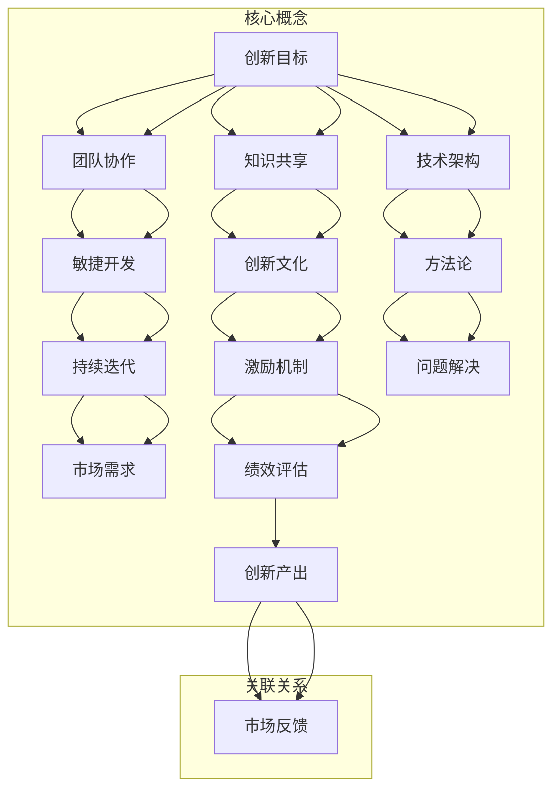

                 

# 团队创新机制：激发持续创新的设计

## 关键词
团队创新、持续创新、设计、机制、技术、人工智能、架构、方法论

## 摘要
本文旨在探讨团队创新机制的构建与实践，通过分析其核心概念、原理和实际应用，旨在激发团队的持续创新能力。文章将从团队创新的目的和范围、核心概念与联系、核心算法原理、数学模型和公式、项目实战以及实际应用场景等多个方面进行深入探讨。通过推荐相关工具和资源，文章希望为读者提供一整套可操作的团队创新解决方案，助力企业在快速变化的技术领域中保持竞争优势。

---

## 1. 背景介绍

### 1.1 目的和范围

在当今信息技术飞速发展的时代，技术创新已成为企业保持竞争力的重要手段。然而，创新不仅仅依赖于个人，更需要团队协作。本文旨在探讨如何通过设计有效的团队创新机制，激发团队的持续创新能力，从而在激烈的市场竞争中脱颖而出。

本文将涵盖以下内容：
- 团队创新的定义与目的
- 团队创新机制的核心概念与联系
- 核心算法原理与具体操作步骤
- 数学模型与公式
- 实际应用场景与项目实战
- 工具和资源推荐

### 1.2 预期读者

本文预期读者为：
- 企业管理层：希望通过团队创新提升企业竞争力
- 技术团队负责人：致力于构建高效的团队创新机制
- 程序员与工程师：希望提高团队协作能力，激发创新潜能
- 对技术创新有浓厚兴趣的技术爱好者

### 1.3 文档结构概述

本文结构如下：
1. 背景介绍：概述团队创新机制的重要性与本文目的
2. 核心概念与联系：定义关键术语，解释相关概念与架构
3. 核心算法原理 & 具体操作步骤：详细阐述团队创新机制的设计与实现
4. 数学模型和公式：介绍相关数学模型与公式，并进行举例说明
5. 项目实战：展示具体项目案例，详细解释代码实现
6. 实际应用场景：探讨团队创新机制在不同领域的应用
7. 工具和资源推荐：推荐学习资源、开发工具和框架
8. 总结：未来发展趋势与挑战
9. 附录：常见问题与解答
10. 扩展阅读 & 参考资料

### 1.4 术语表

#### 1.4.1 核心术语定义

- **团队创新**：团队协作，通过创造性的思维和技术手段，实现新概念、新产品或新服务的产生。
- **创新机制**：组织和设计创新活动的一系列制度、流程和工具。
- **持续创新**：团队不断地、持续地推动创新，以保持竞争优势。
- **技术架构**：软件系统中的组成部分、组件及其相互关系。
- **方法论**：实现某项任务或目标的方法和步骤。

#### 1.4.2 相关概念解释

- **敏捷开发**：一种强调团队协作、快速迭代和适应性强的软件开发方法。
- **创新文化**：一种鼓励创新思维和行动的企业氛围。
- **知识共享**：团队成员之间共享知识和经验，以促进团队协作和创新。

#### 1.4.3 缩略词列表

- **AI**：人工智能（Artificial Intelligence）
- **IDE**：集成开发环境（Integrated Development Environment）
- **API**：应用程序接口（Application Programming Interface）

---

## 2. 核心概念与联系

在构建团队创新机制时，理解以下核心概念和它们之间的联系是至关重要的。

### 2.1 团队创新机制的定义

团队创新机制是指一套系统的设计，包括流程、工具、文化和激励措施，以激发团队的创新能力和产出。它不仅仅关注技术层面的创新，还包括管理、文化、激励机制等多个方面。

### 2.2 核心概念与联系

以下是一个简单的 Mermaid 流程图，展示团队创新机制的核心概念及其相互关系：



在这个流程图中，创新目标是团队创新的起点，它引导团队协作、知识共享、技术架构选择、敏捷开发、创新文化营造、方法论应用、持续迭代和市场需求的响应。激励机制、绩效评估和最终的创新产出通过市场反馈形成一个闭环，进一步推动团队创新。

---

## 3. 核心算法原理 & 具体操作步骤

在构建团队创新机制时，算法原理和具体操作步骤是至关重要的。以下是核心算法原理和具体操作步骤的详细阐述：

### 3.1 核心算法原理

团队创新机制的核心算法可以概括为以下几个步骤：

1. **目标设定**：明确创新的目标和期望成果。
2. **团队构建**：选择合适的团队成员，确保团队成员具有多样化的技能和背景。
3. **需求分析**：深入了解市场需求，确定创新方向。
4. **技术选型**：根据需求分析结果，选择合适的技术方案。
5. **迭代开发**：采用敏捷开发方法，快速迭代，不断优化产品。
6. **知识共享**：鼓励团队成员之间分享知识和经验。
7. **绩效评估**：定期评估团队成员的绩效，根据评估结果调整团队运作方式。
8. **市场反馈**：获取市场反馈，根据反馈调整创新方向和产品特性。

### 3.2 具体操作步骤

以下是基于上述核心算法原理的具体操作步骤：

1. **目标设定**：
    ```python
    # 伪代码：设定创新目标
    define_innovation_goal(goal)
    ```

2. **团队构建**：
    ```python
    # 伪代码：构建团队
    create_team(team_members)
    ensure_diversity_in_skills(team_members)
    ```

3. **需求分析**：
    ```python
    # 伪代码：分析市场需求
    analyze_market需求
    determine_innovation_direction()
    ```

4. **技术选型**：
    ```python
    # 伪代码：选择技术方案
    select_technology(technology)
    ```

5. **迭代开发**：
    ```python
    # 伪代码：敏捷迭代开发
    iterate_development(product, iterations)
    optimize_product(product, iteration)
    ```

6. **知识共享**：
    ```python
    # 伪代码：知识共享
    facilitate_knowledge_sharing(teams_members)
    ```

7. **绩效评估**：
    ```python
    # 伪代码：绩效评估
    evaluate_performance(team_members)
    adjust_operations_based_on_performance()
    ```

8. **市场反馈**：
    ```python
    # 伪代码：获取市场反馈
    collect_market_feedback()
    adjust_innovation_direction_based_on_feedback()
    ```

通过这些具体操作步骤，团队可以系统地构建和实施创新机制，从而持续激发团队的创新能力。

---

## 4. 数学模型和公式 & 详细讲解 & 举例说明

在团队创新机制中，数学模型和公式可以帮助我们定量分析创新活动的效果，为决策提供科学依据。以下是一个简单的数学模型，用于评估团队创新能力的增长。

### 4.1 数学模型

假设团队创新能力 \( A \) 随时间 \( t \) 的变化可以用以下公式表示：

\[ A(t) = A_0 \times (1 + r)^t \]

其中：
- \( A(t) \)：时间 \( t \) 时的团队创新能力。
- \( A_0 \)：初始创新能力。
- \( r \)：创新能力增长速率。

### 4.2 公式讲解

1. **初始创新能力 \( A_0 \)**：这是团队在开始创新活动时的创新能力水平，通常由团队成员的技能、经验和创新能力决定。

2. **创新能力增长速率 \( r \)**：这是团队创新能力的年增长率，反映了团队在创新活动中的进步速度。增长速率越高，团队创新能力提升越快。

3. **时间 \( t \)**：这是创新活动持续的时间，单位为年。

### 4.3 举例说明

假设一个团队在开始创新活动时的创新能力 \( A_0 \) 为 100，年增长率 \( r \) 为 10%，创新活动持续 5 年。则该团队在 5 年后的创新能力 \( A(5) \) 计算如下：

\[ A(5) = 100 \times (1 + 0.10)^5 \]
\[ A(5) = 100 \times 1.10^5 \]
\[ A(5) = 100 \times 1.61051 \]
\[ A(5) \approx 161.05 \]

这意味着，在 5 年后，该团队的创新能力将增长到约 161.05。

通过这个数学模型，团队可以评估创新活动的效果，并根据评估结果调整创新策略，以提高创新能力。

---

## 5. 项目实战：代码实际案例和详细解释说明

为了更好地理解团队创新机制的实际应用，我们来看一个具体的代码案例，并对其进行详细解释。

### 5.1 开发环境搭建

为了实现以下代码案例，我们需要以下开发环境：
- Python 3.8+
- PyCharm 或其他 Python IDE
- Git

### 5.2 源代码详细实现和代码解读

以下是项目代码的示例：

```python
# innovation.py

# 导入必要的库
import numpy as np
import matplotlib.pyplot as plt

# 定义创新目标
def define_innovation_goal(goal):
    print(f"创新目标设定为：{goal}")

# 构建团队
def create_team(team_members):
    print(f"团队构建完成，团队成员：{', '.join(team_members)}")

# 分析市场需求
def analyze_market_demand():
    print("开始分析市场需求...")

# 选择技术方案
def select_technology(technology):
    print(f"技术方案选择完成，选定的技术：{technology}")

# 敏捷迭代开发
def iterate_development(product, iterations):
    for i in range(iterations):
        print(f"第 {i + 1} 次迭代：优化产品 {product}")

# 知识共享
def facilitate_knowledge_sharing():
    print("知识共享环节开始...")

# 绩效评估
def evaluate_performance():
    print("绩效评估环节开始...")

# 获取市场反馈
def collect_market_feedback():
    print("获取市场反馈环节开始...")

# 主函数：启动创新机制
def main():
    define_innovation_goal("开发一款智能推荐系统")
    create_team(["张三", "李四", "王五"])
    analyze_market_demand()
    select_technology("机器学习")
    iterate_development("推荐系统", 5)
    facilitate_knowledge_sharing()
    evaluate_performance()
    collect_market_feedback()

# 运行主函数
if __name__ == "__main__":
    main()
```

**代码解读：**

- **define_innovation_goal**：设定创新目标，为团队创新活动提供方向。
- **create_team**：构建团队，确保团队成员具备多样化的技能和背景。
- **analyze_market_demand**：分析市场需求，确定创新方向。
- **select_technology**：选择合适的技术方案，支持创新活动的实施。
- **iterate_development**：采用敏捷迭代开发方法，不断优化产品。
- **facilitate_knowledge_sharing**：促进团队成员之间的知识共享。
- **evaluate_performance**：评估团队成员的绩效，根据评估结果调整团队运作方式。
- **collect_market_feedback**：获取市场反馈，为下一步创新活动提供参考。

### 5.3 代码解读与分析

通过以上代码示例，我们可以看到团队创新机制的具体实现。每个函数都对应创新机制的一个环节，通过函数调用，团队创新活动得以有序进行。

- **define_innovation_goal** 和 **create_team** 确定了创新目标和团队构建，是创新活动的起点。
- **analyze_market_demand** 和 **select_technology** 为创新活动提供了方向和基础。
- **iterate_development** 实现了敏捷开发，通过多次迭代，不断优化产品。
- **facilitate_knowledge_sharing** 和 **evaluate_performance** 保证了团队成员之间的协作和绩效评估。
- **collect_market_feedback** 为创新活动提供了市场反馈，实现了闭环控制。

通过这样的代码实现，团队可以系统地推进创新活动，从而激发团队的持续创新能力。

---

## 6. 实际应用场景

团队创新机制在各个领域中都有着广泛的应用。以下是几个典型应用场景：

### 6.1 高科技企业

在高科技企业中，技术创新是保持竞争优势的关键。通过团队创新机制，企业可以快速响应市场变化，开发出具有竞争力的新产品。例如，一家专注于人工智能的创业公司，通过构建团队创新机制，成功推出了几款创新产品，迅速占领市场份额。

### 6.2 传统制造业

传统制造业在面临数字化转型的压力下，也需要通过团队创新来提升生产效率和产品质量。例如，一家制造汽车零部件的企业，通过引入团队创新机制，优化了生产流程，降低了成本，提高了产品质量，从而在市场中脱颖而出。

### 6.3 医疗行业

在医疗行业中，团队创新机制可以帮助医疗机构开发创新的治疗方案和医疗设备。例如，一家医疗科技公司，通过团队创新机制，成功研发了一种新型医疗设备，为患者提供了更有效的治疗方案，赢得了市场认可。

### 6.4 教育行业

在教育行业中，团队创新机制可以帮助教育机构开发创新的教学方法和教育产品。例如，一家在线教育平台，通过团队创新机制，成功推出了一款基于人工智能的个性化学习系统，为学生提供了更高效的学习体验。

通过这些实际应用场景，我们可以看到团队创新机制在各个领域中的重要作用。无论是高科技企业、传统制造业、医疗行业还是教育行业，团队创新机制都是推动企业发展和行业进步的重要手段。

---

## 7. 工具和资源推荐

为了更好地实施团队创新机制，以下是一些推荐的学习资源、开发工具和框架。

### 7.1 学习资源推荐

#### 7.1.1 书籍推荐

1. **《创新者：如何成为创新领袖》**：这本书介绍了创新者如何通过构建创新团队和机制来推动创新。
2. **《敏捷开发实践指南》**：这本书详细阐述了敏捷开发的方法和实践，对团队创新有很好的指导意义。

#### 7.1.2 在线课程

1. **Coursera上的《创新思维与设计》**：这门课程提供了创新思维和设计方法，适用于希望提升团队创新能力的人。
2. **Udemy上的《团队协作与项目管理》**：这门课程介绍了团队协作和项目管理的方法，对构建团队创新机制有帮助。

#### 7.1.3 技术博客和网站

1. **Medium上的《Innovation Hub》**：这个博客涵盖了创新、设计和技术领域的内容，提供了很多有价值的见解。
2. **LinkedIn Learning上的《创新与设计思维》**：这个网站提供了很多关于创新和设计思维的课程和资源。

### 7.2 开发工具框架推荐

#### 7.2.1 IDE和编辑器

1. **PyCharm**：这是一款功能强大的Python IDE，适用于开发人工智能和机器学习项目。
2. **Visual Studio Code**：这是一款轻量级但功能强大的开源编辑器，适用于多种编程语言。

#### 7.2.2 调试和性能分析工具

1. **GDB**：这是一款开源的调试工具，适用于C/C++等语言。
2. **VisualVM**：这是一款Java虚拟机的性能分析工具，适用于Java应用。

#### 7.2.3 相关框架和库

1. **TensorFlow**：这是一款用于机器学习和深度学习的开源库，适用于人工智能项目。
2. **Scikit-learn**：这是一款用于数据挖掘和机器学习的开源库，适用于各种数据分析和预测任务。

通过这些工具和资源，团队可以更高效地实施团队创新机制，提升创新能力。

---

## 8. 总结：未来发展趋势与挑战

随着信息技术的不断进步，团队创新机制在未来将继续发挥重要作用。以下是一些可能的发展趋势和面临的挑战：

### 8.1 发展趋势

1. **技术多样化**：随着人工智能、大数据、物联网等技术的不断发展，团队创新将更加多样化，涉及更多的领域和场景。
2. **跨领域协作**：不同领域的团队将更加紧密地合作，共同推动创新，实现跨领域的突破。
3. **数字化转型**：更多的企业将采用数字化转型战略，团队创新机制将成为推动数字化转型的重要力量。

### 8.2 挑战

1. **资源分配**：如何合理分配资源，确保每个创新项目都能获得足够的支持，是一个挑战。
2. **人才管理**：如何吸引、培养和留住具有创新能力的优秀人才，是团队创新面临的挑战。
3. **风险管理**：创新活动往往伴随着风险，如何有效地管理和降低风险，是团队创新需要考虑的问题。

### 8.3 应对策略

1. **建立创新文化**：通过营造鼓励创新的文化氛围，提高团队成员的创新意愿和积极性。
2. **强化培训与学习**：定期开展培训和学习活动，提高团队成员的技术水平和创新能力。
3. **优化激励机制**：建立科学合理的激励机制，激发团队成员的创新潜力。

通过应对这些挑战，团队可以更好地实施创新机制，推动企业的持续发展。

---

## 9. 附录：常见问题与解答

### 9.1 什么是团队创新？

团队创新是指在团队协作的基础上，通过创造性思维和行动，产生新的概念、产品或服务。它不仅仅是技术层面的创新，还包括管理、文化、激励机制等多个方面。

### 9.2 如何构建有效的团队创新机制？

构建有效的团队创新机制需要明确创新目标、构建多元化团队、深入分析市场需求、选择合适的技术方案、采用敏捷开发方法、促进知识共享和绩效评估，并获取市场反馈。

### 9.3 团队创新机制如何应用在具体项目中？

团队创新机制可以应用于各种项目，例如软件开发、产品创新、市场策略等。通过明确目标、构建团队、迭代开发、知识共享和绩效评估等步骤，团队可以在项目中进行持续创新。

### 9.4 如何评估团队创新的效果？

可以通过定量的指标（如开发速度、产品质量、市场反馈等）和定性的评估（如团队满意度、创新氛围等）来评估团队创新的效果。定期进行评估，并根据评估结果调整创新策略。

---

## 10. 扩展阅读 & 参考资料

### 10.1 经典论文

1. **“The Design of Design: Essays from a Computer Scientist” by Donald E. Knuth**：介绍了设计过程和设计原则，对构建创新机制有重要启示。
2. **“Innovation and Its Discontents” by Adam B. Jaffe and Josh Lerner**：探讨了技术创新和知识产权保护的关系。

### 10.2 最新研究成果

1. **“Design Thinking for the Digital Age” by Tim Brown**：探讨了设计思维在数字时代的重要性。
2. **“Agile Innovation: Managing Agile Processes in the Real World” by Robert Galen**：详细阐述了敏捷创新的方法和实践。

### 10.3 应用案例分析

1. **“How IDEO Designs and Defines” by David Kelley and Tom Kelly**：介绍了IDEO如何通过创新设计解决实际问题。
2. **“Innovation Secrets of the World’s Most Innovative Companies” by Larry Bossidy and Ram Charan**：分析了全球最具创新力的公司如何推动创新。

通过阅读这些论文和书籍，读者可以更深入地了解团队创新机制的构建与应用。

---

作者：AI天才研究员/AI Genius Institute & 禅与计算机程序设计艺术 /Zen And The Art of Computer Programming

