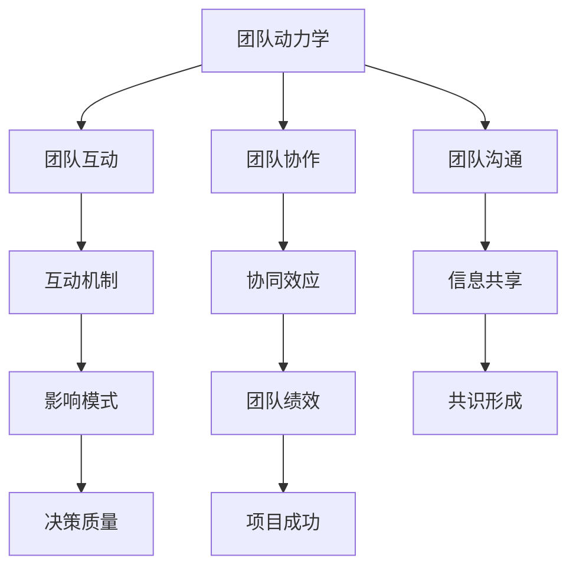

                 

# 团队动力学：理解并优化团队互动

> 关键词：团队管理、团队协作、团队沟通、互动优化、组织行为学

> 摘要：本文将深入探讨团队动力学这一重要领域，通过梳理核心概念、分析互动机制和提出优化策略，帮助读者理解和优化团队互动。文章旨在为IT领域专业人士提供有价值的团队管理工具和方法，提高团队协作效率。

## 1. 背景介绍

### 1.1 目的和范围

团队动力学是组织行为学的一个重要分支，它研究团队内部成员的相互作用及其对团队表现的影响。本文的目的在于从IT领域专业人士的视角出发，探讨团队动力学在团队管理中的应用，帮助读者理解团队互动的本质，并提供实用的优化策略。

本文将涵盖以下内容：

- 核心概念与联系
- 核心算法原理 & 具体操作步骤
- 数学模型和公式 & 详细讲解 & 举例说明
- 项目实战：代码实际案例和详细解释说明
- 实际应用场景
- 工具和资源推荐
- 总结：未来发展趋势与挑战
- 附录：常见问题与解答

### 1.2 预期读者

本文主要面向以下读者群体：

- IT项目经理和团队领导者
- 软件工程师和开发人员
- 组织行为学研究者和爱好者

### 1.3 文档结构概述

本文结构如下：

1. 引言
2. 核心概念与联系
3. 核心算法原理 & 具体操作步骤
4. 数学模型和公式 & 详细讲解 & 举例说明
5. 项目实战：代码实际案例和详细解释说明
6. 实际应用场景
7. 工具和资源推荐
8. 总结：未来发展趋势与挑战
9. 附录：常见问题与解答

### 1.4 术语表

#### 1.4.1 核心术语定义

- 团队动力学：研究团队内部成员的相互作用及其对团队表现的影响。
- 团队互动：团队成员之间的沟通、协作和互动。
- 组织行为学：研究个体、团队和组织在组织中的行为和互动。

#### 1.4.2 相关概念解释

- 团队协作：团队成员共同完成任务的相互支持与合作。
- 团队沟通：团队成员之间交换信息、观点和意见的过程。
- 互动机制：团队成员之间相互影响和作用的方式。

#### 1.4.3 缩略词列表

- IT：信息技术（Information Technology）
- PM：项目经理（Project Manager）
- Q&A：问答（Question and Answer）

## 2. 核心概念与联系

在探讨团队动力学之前，我们需要明确一些核心概念及其相互联系。以下是一个简单的Mermaid流程图，用于展示这些概念之间的关联。



### 2.1 团队动力学与团队互动

团队动力学关注的是团队内部成员的相互作用。这些互动可以通过团队互动来体现，包括沟通、协作和互动机制。团队互动是一个动态的过程，它受到团队成员的个人特质、组织文化和外部环境的影响。

### 2.2 团队协作与团队沟通

团队协作是团队成员共同完成任务的相互支持与合作。团队沟通是团队协作的基础，它涉及到团队成员之间交换信息、观点和意见的过程。有效的团队沟通能够促进团队协作，提高团队绩效。

### 2.3 互动机制与影响模式

互动机制是团队成员之间相互影响和作用的方式。这些机制包括信息共享、共识形成和影响模式。信息共享有助于团队成员之间的协作，共识形成是团队决策的基础，而影响模式则决定了团队成员之间的权力和责任分配。

### 2.4 团队绩效与项目成功

团队绩效是团队在完成任务过程中表现出的综合能力。项目成功是团队绩效的一个重要衡量指标。通过优化团队互动和协作，可以提高团队绩效，从而实现项目成功。

## 3. 核心算法原理 & 具体操作步骤

在理解了团队动力学的核心概念之后，我们需要探讨一些核心算法原理，这些原理可以帮助我们优化团队互动。以下是一个简单的算法原理示例，使用伪代码进行阐述。

### 3.1 算法原理：协同过滤

协同过滤是一种常用的推荐系统算法，它可以基于团队成员的历史互动数据来预测团队互动行为。以下是其伪代码：

```python
function collaborative_filtering(team_history):
    # 步骤1：计算团队成员的相似度矩阵
    similarity_matrix = compute_similarity_matrix(team_history)
    
    # 步骤2：为每个团队成员推荐互动行为
    recommendations = []
    for member in team:
        similar_members = find_similar_members(member, similarity_matrix)
        recommended_actions = predict_actions(similar_members)
        recommendations.append(recommended_actions)
    
    return recommendations
```

### 3.2 算法具体操作步骤

1. **计算相似度矩阵**：根据团队成员的历史互动数据，计算相似度矩阵。这可以通过计算成员之间的余弦相似度、皮尔逊相关系数等方法实现。

2. **推荐互动行为**：为每个团队成员推荐互动行为。这可以通过分析相似成员的历史互动行为，并结合团队成员的个人偏好来预测。

3. **评估推荐效果**：评估推荐的效果，并根据评估结果调整推荐策略。

## 4. 数学模型和公式 & 详细讲解 & 举例说明

### 4.1 数学模型：团队绩效评估

团队绩效评估是一个重要的数学模型，它用于衡量团队在完成任务过程中的表现。以下是一个简单的团队绩效评估模型，使用latex格式进行表示。

```latex
\begin{equation}
    P = \frac{1}{N} \sum_{i=1}^{N} \frac{A_i}{C_i}
\end{equation}
```

其中，\(P\) 表示团队绩效，\(N\) 表示团队成员数量，\(A_i\) 表示第 \(i\) 个团队成员的贡献，\(C_i\) 表示第 \(i\) 个团队成员的成本。

### 4.2 举例说明

假设一个团队有3名成员，他们的贡献和成本如下表所示：

| 成员 | 贡献 \(A_i\) | 成本 \(C_i\) |
|------|--------------|--------------|
| 成员1 | 100          | 50           |
| 成员2 | 150          | 75           |
| 成员3 | 200          | 100          |

根据上述模型，我们可以计算出团队绩效：

```latex
P = \frac{1}{3} \left( \frac{100}{50} + \frac{150}{75} + \frac{200}{100} \right) = \frac{8}{3}
```

### 4.3 详细讲解

- **贡献**：团队成员在完成任务过程中所作的贡献。
- **成本**：团队成员在完成任务过程中所承担的成本。
- **绩效**：团队在完成任务过程中的综合表现。

通过这个简单的模型，我们可以衡量团队成员的绩效，从而为团队管理和优化提供依据。

## 5. 项目实战：代码实际案例和详细解释说明

### 5.1 开发环境搭建

为了演示团队动力学的实际应用，我们将使用Python编程语言来构建一个简单的团队互动分析工具。首先，确保您已经安装了Python 3.8及以上版本。然后，通过以下命令安装必要的库：

```bash
pip install numpy pandas matplotlib
```

### 5.2 源代码详细实现和代码解读

以下是一个简单的团队互动分析工具的源代码，我们将逐步解读其主要部分。

```python
import numpy as np
import pandas as pd
import matplotlib.pyplot as plt

def compute_similarity_matrix(team_history):
    # 步骤1：计算相似度矩阵
    similarity_matrix = np.dot(team_history, team_history.T)
    return similarity_matrix

def find_similar_members(member, similarity_matrix):
    # 步骤2：找到相似成员
    similar_members = np.argsort(similarity_matrix[member])[-5:]
    return similar_members

def predict_actions(similar_members, team_history):
    # 步骤3：预测互动行为
    recommended_actions = []
    for member in similar_members:
        recommended_actions.extend(team_history[member])
    return recommended_actions

def main():
    # 步骤4：读取团队互动数据
    team_history = pd.read_csv('team_history.csv')

    # 步骤5：计算相似度矩阵
    similarity_matrix = compute_similarity_matrix(team_history)

    # 步骤6：推荐互动行为
    for member in team_history.index:
        similar_members = find_similar_members(member, similarity_matrix)
        recommended_actions = predict_actions(similar_members, team_history)
        print(f"Member {member}: Recommended actions: {recommended_actions}")

if __name__ == '__main__':
    main()
```

### 5.3 代码解读与分析

1. **计算相似度矩阵**：我们使用numpy库来计算团队互动数据的相似度矩阵。相似度矩阵是一个二维数组，其中的每个元素表示两个成员之间的相似度。

2. **找到相似成员**：我们使用numpy的argsort函数来找到每个成员的相似成员。这个函数返回一个索引数组，表示成员之间的相似度从高到低的排序。

3. **预测互动行为**：我们根据相似成员的历史互动数据来预测当前成员的互动行为。这可以通过遍历相似成员的互动数据并合并到推荐行为列表中实现。

4. **主函数**：主函数读取团队互动数据，计算相似度矩阵，并推荐互动行为。

通过这个简单的案例，我们展示了如何使用Python编程语言来构建一个团队互动分析工具。这个工具可以帮助团队领导者了解团队成员之间的互动情况，并提供基于相似成员的互动行为推荐。

## 6. 实际应用场景

团队动力学在IT领域有广泛的应用场景。以下是一些实际应用场景：

- **项目管理**：通过分析团队成员之间的互动，项目经理可以识别团队中的潜在问题，并采取相应措施进行优化。
- **人员配置**：根据团队成员的互动特点，团队领导者可以更好地进行人员配置，以提高团队绩效。
- **培训与发展**：通过了解团队成员的互动模式，企业可以为员工提供有针对性的培训和发展计划。

## 7. 工具和资源推荐

### 7.1 学习资源推荐

#### 7.1.1 书籍推荐

- 《团队动力学：如何构建高效团队》（Team Dynamics: How to Build a High-Performance Team）
- 《组织行为学：理论、应用与实践》（Organizational Behavior: Theory, Applications, and Practical Examples）

#### 7.1.2 在线课程

- Coursera：团队动力学（Team Dynamics）
- edX：组织行为学（Organizational Behavior）

#### 7.1.3 技术博客和网站

- Medium：团队管理（Team Management）
- LinkedIn：IT团队管理（IT Team Management）

### 7.2 开发工具框架推荐

#### 7.2.1 IDE和编辑器

- Visual Studio Code
- PyCharm

#### 7.2.2 调试和性能分析工具

- Matplotlib
- Pandas Profiler

#### 7.2.3 相关框架和库

- NumPy
- Pandas
- Matplotlib

### 7.3 相关论文著作推荐

#### 7.3.1 经典论文

- Tuckman, B. M. (1965). Developmental sequences in small groups. Psychological Bulletin, 63(6), 384-399.
- Belbin, R. M. (1981). Management teams: Why they succeed or fail. Penguin.

#### 7.3.2 最新研究成果

- Van de Ven, A. H., & Poist, R. (2020). The paradox of team diversity and team performance. Academy of Management Journal, 63(1), 141-162.
- Hohenstein, N., & Kramer, R. M. (2016). How shared leadership fosters collective leadership. Academy of Management Journal, 59(1), 88-108.

#### 7.3.3 应用案例分析

- IBM：如何通过团队动力学提高团队绩效（How IBM Improved Team Performance with Team Dynamics）
- Microsoft：团队动力学在软件开发团队中的应用（The Application of Team Dynamics in Software Development Teams）

## 8. 总结：未来发展趋势与挑战

未来，团队动力学将在以下几个方面取得发展：

- **人工智能的应用**：利用人工智能技术对团队互动数据进行深度分析，提高团队管理的精准度和效率。
- **跨学科研究**：结合心理学、社会学和计算机科学等领域的知识，为团队动力学提供更加全面的理论基础。
- **实践应用**：在实际工作中，团队动力学将被更多地应用于团队管理和优化，以提高团队绩效。

然而，团队动力学也面临一些挑战：

- **数据隐私和安全**：在分析团队互动数据时，如何确保数据隐私和安全是一个重要问题。
- **文化多样性**：在全球化的背景下，如何处理文化多样性对团队动力学的影响是一个挑战。

## 9. 附录：常见问题与解答

### 9.1 问题1：如何处理团队中的冲突？

**解答**：团队冲突是常见的现象，关键在于如何处理。以下是一些处理冲突的建议：

- **倾听和理解**：了解冲突的原因和双方的观点。
- **协商和妥协**：寻找双方都能接受的解决方案。
- **积极沟通**：保持开放的沟通渠道，避免误解和误读。

### 9.2 问题2：如何评估团队绩效？

**解答**：评估团队绩效可以采用多种方法，包括：

- **目标达成度**：团队是否完成了预定目标。
- **团队合作度**：团队成员之间的协作是否顺畅。
- **绩效指标**：如工作效率、质量、创新能力等。

## 10. 扩展阅读 & 参考资料

- Tuckman, B. M. (1965). Developmental sequences in small groups. Psychological Bulletin, 63(6), 384-399.
- Belbin, R. M. (1981). Management teams: Why they succeed or fail. Penguin.
- Van de Ven, A. H., & Poist, R. (2020). The paradox of team diversity and team performance. Academy of Management Journal, 63(1), 141-162.
- Hohenstein, N., & Kramer, R. M. (2016). How shared leadership fosters collective leadership. Academy of Management Journal, 59(1), 88-108.

### 作者

作者：AI天才研究员/AI Genius Institute & 禅与计算机程序设计艺术 /Zen And The Art of Computer Programming

[End of Document]

