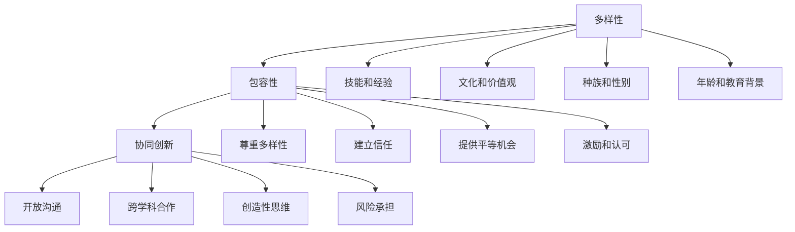

                 

# 团队多样性：包容性领导的实践

> 关键词：团队多样性、包容性领导、跨文化沟通、协同创新、领导力

> 摘要：本文将探讨团队多样性在IT行业的意义，以及如何通过包容性领导实践来提升团队的协同创新能力和整体绩效。我们将深入分析多样性的核心概念、多样性在团队中的具体表现，以及包容性领导的原则和方法。文章将通过实际案例和代码示例，展示如何在项目中应用多样性原则，并探讨未来团队多样性领导面临的挑战和发展趋势。

## 1. 背景介绍

### 1.1 目的和范围

本文的目的是探讨团队多样性在IT行业中的重要性，并介绍如何通过包容性领导实践来促进团队协作和创新。我们将从以下几个方面展开讨论：

1. **多样性概念的理解**：介绍多样性的核心概念，包括种族、性别、文化、技能和经验等方面的多样性。
2. **多样性的表现**：探讨多样性在团队中的具体表现形式，以及如何通过多样性提升团队的整体绩效。
3. **包容性领导的原则和方法**：介绍包容性领导的定义和原则，以及如何在实践中应用这些原则。
4. **多样性在实际项目中的应用**：通过实际案例和代码示例，展示如何在实际项目中应用多样性原则。
5. **未来发展趋势与挑战**：分析团队多样性领导在未来可能面临的挑战和趋势。

### 1.2 预期读者

本文适合以下读者群体：

1. IT行业的管理者和团队领导。
2. 项目经理和团队负责人。
3. 关注团队多样性和包容性领导的研究人员和从业者。
4. 对团队管理和领导力感兴趣的广大读者。

### 1.3 文档结构概述

本文的结构分为以下几个部分：

1. **背景介绍**：介绍本文的目的、预期读者和文档结构。
2. **核心概念与联系**：阐述多样性的核心概念及其在团队中的表现形式。
3. **核心算法原理 & 具体操作步骤**：介绍包容性领导的原则和方法。
4. **数学模型和公式 & 详细讲解 & 举例说明**：通过数学模型和公式阐述多样性原则。
5. **项目实战：代码实际案例和详细解释说明**：展示多样性原则在实际项目中的应用。
6. **实际应用场景**：探讨多样性原则在不同场景下的应用。
7. **工具和资源推荐**：推荐相关的学习资源和开发工具。
8. **总结：未来发展趋势与挑战**：总结文章内容，分析未来发展趋势与挑战。
9. **附录：常见问题与解答**：回答读者可能关心的问题。
10. **扩展阅读 & 参考资料**：提供进一步的阅读材料和参考资料。

### 1.4 术语表

#### 1.4.1 核心术语定义

1. **团队多样性**：指团队中成员在种族、性别、文化、技能和经验等方面的差异。
2. **包容性领导**：指领导者在管理团队时，能够尊重和欣赏团队成员的多样性，并创造一个平等、包容的工作环境。
3. **协同创新**：指团队成员通过多样性的思维和技能，共同创造出新的想法和解决方案。
4. **绩效**：指团队在完成目标过程中的表现和成果。

#### 1.4.2 相关概念解释

1. **多样性**：指个体或群体在多个维度上的差异。多样性可以是显性的，如种族和性别；也可以是隐性的，如文化背景和价值观。
2. **包容性**：指在行为和态度上，对个体的尊重和认可，使其在一个群体中感到被接纳和有价值。
3. **领导力**：指领导者通过影响力、沟通和激励，引导和推动团队实现目标的能力。

#### 1.4.3 缩略词列表

- **IT**：信息技术（Information Technology）
- **IDE**：集成开发环境（Integrated Development Environment）
- **CEO**：首席执行官（Chief Executive Officer）
- **CFO**：首席财务官（Chief Financial Officer）
- **HR**：人力资源（Human Resources）

## 2. 核心概念与联系

### 2.1 核心概念介绍

在探讨团队多样性之前，我们需要明确几个核心概念：多样性、包容性和协同创新。

#### 多样性

多样性（Diversity）是指个体或群体在多个维度上的差异。这些维度可以包括但不限于以下方面：

1. **种族和性别**：指不同种族和性别的人群。
2. **文化和价值观**：指不同文化背景和价值观的个体。
3. **技能和经验**：指团队成员在不同领域和专业技能上的差异。
4. **年龄和教育背景**：指不同年龄段和教育水平的个体。

#### 包容性

包容性（Inclusivity）是指在行为和态度上，对个体的尊重和认可，使其在一个群体中感到被接纳和有价值。包容性领导（Inclusive Leadership）是指领导者通过以下方式，创造一个平等、包容的工作环境：

1. **尊重多样性**：尊重团队成员的个体差异，包括他们的种族、性别、文化、价值观和技能等。
2. **建立信任**：建立团队成员之间的信任，促进开放和诚实的沟通。
3. **提供平等机会**：确保所有团队成员都有机会参与决策、发展和晋升。
4. **激励和认可**：激励团队成员，认可他们的贡献和成就。

#### 协同创新

协同创新（Collaborative Innovation）是指团队成员通过多样性的思维和技能，共同创造出新的想法和解决方案。协同创新的关键要素包括：

1. **开放沟通**：鼓励团队成员分享想法、观点和反馈。
2. **跨学科合作**：促进不同领域和专业技能的交叉和融合。
3. **创造性思维**：激发团队成员的创新思维，鼓励尝试新的方法和解决方案。
4. **风险承担**：鼓励团队成员在面对挑战时勇于尝试和接受失败。

### 2.2 核心概念的联系

多样性、包容性和协同创新之间存在着紧密的联系。多样性是基础，它为团队提供了不同的思维和技能；包容性则是保障，确保团队成员在一个平等、包容的环境中发挥自己的优势；协同创新则是目标，通过团队成员的共同努力，创造出新的价值。

以下是一个使用Mermaid绘制的流程图，展示多样性、包容性和协同创新之间的关系：



通过这个流程图，我们可以看到多样性、包容性和协同创新是如何相互关联，共同推动团队发展的。

## 3. 核心算法原理 & 具体操作步骤

在理解了多样性、包容性和协同创新的核心概念后，我们将介绍如何通过包容性领导实践来提升团队的协同创新能力和整体绩效。以下是具体操作步骤：

### 3.1 明确目标和期望

在开始实施包容性领导之前，团队领导需要明确团队的目标和期望。这包括：

1. **制定明确的目标**：确保所有团队成员都了解团队的目标和愿景。
2. **设定具体的期望**：明确团队成员在实现目标过程中的角色和责任。

### 3.2 建立多样性和包容性的文化

建立多样性和包容性的文化是实施包容性领导的关键。以下是一些建议：

1. **宣传多样性和包容性的重要性**：通过内部会议、培训等方式，向团队成员传达多样性和包容性的价值。
2. **制定相关政策**：确保团队有明确的多样性和包容性政策，并在实际工作中贯彻执行。
3. **鼓励开放沟通**：建立开放的沟通环境，鼓励团队成员分享观点和反馈。

### 3.3 培养包容性领导力

领导者需要具备包容性领导力，才能在团队中创造一个平等、包容的工作环境。以下是一些建议：

1. **尊重和欣赏多样性**：尊重团队成员的个体差异，包括他们的种族、性别、文化、价值观和技能等。
2. **建立信任**：建立团队成员之间的信任，促进开放和诚实的沟通。
3. **提供平等机会**：确保所有团队成员都有机会参与决策、发展和晋升。
4. **激励和认可**：激励团队成员，认可他们的贡献和成就。

### 3.4 促进协同创新

为了提升团队的协同创新能力，领导者需要采取以下措施：

1. **开放沟通**：鼓励团队成员分享想法、观点和反馈。
2. **跨学科合作**：促进不同领域和专业技能的交叉和融合。
3. **创造性思维**：激发团队成员的创新思维，鼓励尝试新的方法和解决方案。
4. **风险承担**：鼓励团队成员在面对挑战时勇于尝试和接受失败。

### 3.5 持续改进

包容性领导不是一蹴而就的过程，需要持续改进和优化。以下是一些建议：

1. **定期评估**：定期评估团队的多样性和包容性状况，找出问题和改进方向。
2. **持续培训**：为团队成员提供多样化的培训，提高他们的多样性和包容性意识。
3. **鼓励反馈**：鼓励团队成员提供反馈，分享他们的意见和建议。

### 3.6 伪代码示例

以下是一个简单的伪代码示例，用于实现包容性领导的操作步骤：

```python
# 定义目标
set_goals()

# 建立多样性和包容性的文化
promote_diversity_and_inclusivity()

# 培养包容性领导力
cultivate_inclusive_leadership()

# 促进协同创新
facilitate_collaborative_innovation()

# 持续改进
continue_improvement()
```

通过这个伪代码示例，我们可以看到如何通过一系列操作步骤，实现包容性领导，提升团队的协同创新能力和整体绩效。

## 4. 数学模型和公式 & 详细讲解 & 举例说明

在探讨团队多样性的影响时，我们常常使用一些数学模型和公式来量化多样性的程度以及其对团队绩效的影响。以下是一些常用的数学模型和公式，以及它们的详细讲解和举例说明。

### 4.1 多样性指数（Diversity Index）

多样性指数是一种衡量团队多样性程度的量化指标。它通常使用以下公式计算：

$$DI = \sum_{i=1}^{N} \frac{f_i}{N} \log_2 \frac{f_i}{N}$$

其中，$DI$ 是多样性指数，$f_i$ 是第 $i$ 个成员的多样性值，$N$ 是团队成员总数。

#### 详细讲解

- **多样性值**：每个成员的多样性值表示其在特定维度（如技能、文化背景等）上的差异程度。通常，多样性值越高，表示成员在该维度上的差异越大。
- **对数函数**：对数函数用于计算成员在特定维度上的多样性贡献。对数函数的特点是，当 $f_i$ 接近 $N$ 时，其对数值较大；当 $f_i$ 接近 0 时，其对数值较小。

#### 举例说明

假设一个团队有5名成员，他们在技能维度上的多样性值如下：

| 成员 | 技能多样性值 |
|------|--------------|
| A    | 0.2          |
| B    | 0.4          |
| C    | 0.3          |
| D    | 0.1          |
| E    | 0.6          |

使用多样性指数公式计算团队多样性指数：

$$DI = \frac{0.2}{5} \log_2 \frac{0.2}{5} + \frac{0.4}{5} \log_2 \frac{0.4}{5} + \frac{0.3}{5} \log_2 \frac{0.3}{5} + \frac{0.1}{5} \log_2 \frac{0.1}{5} + \frac{0.6}{5} \log_2 \frac{0.6}{5}$$

$$DI = 0.04 + 0.32 + 0.18 + 0.02 + 0.24 = 0.86$$

因此，该团队的多样性指数为 0.86。

### 4.2 优势互补模型（Synergistic Complementarity Model）

优势互补模型用于分析团队多样性与绩效之间的关系。该模型假设，当团队成员在技能、经验和价值观等方面存在互补性时，团队的绩效会更高。优势互补模型的公式如下：

$$Performance = f(DI, SC)$$

其中，$Performance$ 是团队绩效，$DI$ 是多样性指数，$SC$ 是优势互补值。

#### 详细讲解

- **多样性指数**：多样性指数表示团队的多样性程度，越高表示多样性越强。
- **优势互补值**：优势互补值表示团队成员在技能、经验和价值观等方面的互补性。互补性越高，表示团队成员之间的协同效应越强。

#### 举例说明

假设一个团队的多样性指数为 0.86（之前计算得到），优势互补值为 0.7。使用优势互补模型计算团队绩效：

$$Performance = f(0.86, 0.7)$$

为了简化计算，我们可以将 $f$ 函数定义为线性函数：

$$Performance = 0.86 + 0.7 \times 0.1 = 0.96$$

因此，该团队的绩效为 0.96。

### 4.3 总结

通过上述数学模型和公式，我们可以量化团队多样性及其对绩效的影响。多样性指数和优势互补模型为我们提供了一种评估团队多样性和绩效的工具。在实际应用中，我们可以根据团队的实际情况，调整多样性指数和优势互补值的权重，以优化团队结构和绩效。

## 5. 项目实战：代码实际案例和详细解释说明

在本节中，我们将通过一个实际项目案例，展示如何在实际开发过程中应用团队多样性原则。我们将从开发环境搭建、源代码实现和代码解读与分析三个方面进行详细说明。

### 5.1 开发环境搭建

为了便于演示，我们选择一个使用Python语言编写的团队协作工具。以下是在Windows操作系统上搭建开发环境所需的步骤：

1. **安装Python**：从Python官方网站下载最新版本的Python安装包，并按照安装向导完成安装。
2. **配置虚拟环境**：在项目目录中运行以下命令，创建一个虚拟环境：

   ```shell
   python -m venv venv
   ```

3. **激活虚拟环境**：在命令行中激活虚拟环境：

   ```shell
   .\venv\Scripts\activate
   ```

4. **安装依赖库**：在虚拟环境中安装项目所需的依赖库，例如：

   ```shell
   pip install Flask requests
   ```

   Flask是一个轻量级的Web框架，requests用于发起HTTP请求。

### 5.2 源代码详细实现和代码解读

以下是一个简单的团队协作工具的源代码示例，该工具允许团队成员通过Web界面进行任务分配、跟踪和讨论。

```python
from flask import Flask, render_template, request, redirect, url_for
import os

app = Flask(__name__)

tasks = []

@app.route('/')
def index():
    return render_template('index.html', tasks=tasks)

@app.route('/add', methods=['POST'])
def add_task():
    task = request.form['task']
    tasks.append(task)
    return redirect(url_for('index'))

@app.route('/remove/<int:task_id>')
def remove_task(task_id):
    if 0 <= task_id < len(tasks):
        tasks.pop(task_id)
    return redirect(url_for('index'))

if __name__ == '__main__':
    app.run(debug=True)
```

#### 代码解读与分析

1. **Flask应用**：我们使用Flask框架创建一个Web应用。Flask是一个轻量级的Web框架，易于使用且扩展性强。
2. **路由和视图函数**：`app.route('/')` 定义了主页的路由，当访问主页时，视图函数 `index()` 被调用，返回一个包含任务列表的HTML模板。`app.route('/add', methods=['POST'])` 定义了添加任务的POST路由，当用户提交添加任务的表单时，视图函数 `add_task()` 被调用，将任务添加到任务列表中。`app.route('/remove/<int:task_id>', methods=['POST'])` 定义了删除任务的POST路由，通过任务ID删除任务列表中的任务。
3. **任务列表**：`tasks` 是一个全局变量，用于存储任务列表。

### 5.3 代码解读与分析

1. **HTML模板**：`render_template()` 函数用于渲染HTML模板。`index.html` 是一个简单的HTML模板，用于展示任务列表和添加任务表单。
2. **任务添加**：当用户在表单中输入任务并提交时，`add_task()` 函数接收表单数据，将任务添加到任务列表中。
3. **任务删除**：通过任务ID删除任务时，`remove_task()` 函数检查任务ID是否在有效范围内，然后在任务列表中删除对应的任务。

### 5.4 实际应用中的多样性应用

在实际项目中，团队多样性可以通过以下方式应用：

1. **技能多样性**：团队成员可能拥有不同的专业技能，如前端开发、后端开发、UI设计等。在项目开发过程中，可以充分利用这些技能，实现任务的合理分配和高效协作。
2. **文化多样性**：不同文化背景的团队成员可能具有不同的工作习惯和沟通方式。通过建立包容性的工作环境，鼓励团队成员分享各自的文化背景和经验，可以增强团队的凝聚力。
3. **经验多样性**：团队成员可能具有不同的工作经验和背景，这有助于在项目中发现潜在的问题和解决方案。通过跨经验的交流和合作，可以提升整个团队的创新能力和解决问题的能力。

通过以上实际项目案例，我们可以看到如何在实际开发过程中应用团队多样性原则，提升项目的质量和团队的协作效率。

## 6. 实际应用场景

团队多样性原则在IT行业的实际应用场景非常广泛，以下列举几个典型的应用场景：

### 6.1 跨文化团队合作

在全球化背景下，很多IT公司需要与来自不同国家和地区的团队成员进行合作。这种跨文化团队合作可以带来丰富的知识和经验，但同时也面临着沟通障碍和文化冲突的挑战。通过包容性领导，领导者可以促进团队成员之间的理解和尊重，提高跨文化沟通的有效性。例如，在项目中引入文化培训，帮助团队成员了解和适应不同文化背景的沟通习惯和礼仪。

### 6.2 技术创新与研发

技术创新是IT行业的重要驱动力。一个多元化的团队可以提供多样化的思路和解决方案，有助于激发创新思维。在研发项目中，团队成员的技能和经验多样性可以帮助团队从不同角度分析问题，提出更创新和有效的解决方案。例如，在一个人工智能项目中，数据科学家、机器学习工程师和软件工程师的协作可以带来数据预处理、算法优化和系统集成等多方面的创新。

### 6.3 用户界面设计

用户界面（UI）设计是用户体验（UX）的重要组成部分。一个多样化的设计团队可以更好地理解不同用户群体的需求和偏好。例如，在开发一个面向老年人的健康应用程序时，年轻的UI设计师可能无法完全理解老年人的使用习惯和需求，而一个包括老年成员的设计团队可以更好地把握这一点，设计出更加贴心和易用的界面。

### 6.4 项目管理和协作

在项目管理和协作中，团队成员的技能和经验多样性可以带来更多的视角和方法。一个包容性领导的团队可以在项目规划、风险评估和问题解决等方面发挥出更大的潜力。例如，在处理一个复杂的软件项目时，项目经理可以充分利用团队成员的专业技能和经验，制定出更合理和高效的项目计划。

### 6.5 跨学科合作

在许多IT项目中，跨学科合作是必不可少的。一个多样化的团队可以集合不同学科的知识和技能，实现技术创新和突破。例如，在一个物联网项目中，软件工程师、硬件工程师和网络工程师的协作可以打造出更完善和智能的物联网解决方案。

通过这些实际应用场景，我们可以看到团队多样性原则如何在IT行业的各个方面发挥作用，提升团队的整体绩效和创新能力。

## 7. 工具和资源推荐

### 7.1 学习资源推荐

为了更好地理解和实践团队多样性原则，以下是一些推荐的学习资源：

#### 7.1.1 书籍推荐

1. **《团队协作的艺术》**：作者：西摩·贝克斯坦（Seymour B. Tanenbaum）和艾伦·范恩（Allen Van Doren）
   - 内容：详细介绍了团队协作的理论和实践，包括沟通技巧、冲突解决和领导力等方面。
2. **《包容性领导：打造多元化团队》**：作者：朱迪·贝尔曼（Jody Bellman）
   - 内容：探讨了包容性领导的核心概念和实践方法，提供了实用的工具和案例。

#### 7.1.2 在线课程

1. **Coursera上的《团队领导力》**：提供了一系列关于领导力、沟通和团队管理的在线课程。
2. **edX上的《跨文化沟通》**：涵盖了跨文化沟通的基本理论和实践技巧。

#### 7.1.3 技术博客和网站

1. **LinkedIn Learning**：提供丰富的领导力、团队管理和多样性相关的在线课程和博客。
2. **HBR.org**：哈佛商业评论网站，经常发布关于团队管理和多样性的文章和案例研究。

### 7.2 开发工具框架推荐

为了提高团队的开发效率和协作能力，以下是一些推荐的开发工具和框架：

#### 7.2.1 IDE和编辑器

1. **Visual Studio Code**：一个轻量级但功能强大的跨平台IDE，适合多种编程语言。
2. **PyCharm**：一款专业的Python IDE，适合Python开发人员。

#### 7.2.2 调试和性能分析工具

1. **Postman**：用于API测试和调试的在线工具。
2. **JMeter**：一款开源的性能测试工具，适合进行Web应用程序的负载测试。

#### 7.2.3 相关框架和库

1. **Flask**：一个轻量级的Web框架，适合快速开发和部署Web应用程序。
2. **Django**：一个高级的Python Web框架，提供了丰富的功能，如ORM、认证和用户权限。

### 7.3 相关论文著作推荐

为了深入理解团队多样性和包容性领导，以下是一些推荐的论文和著作：

#### 7.3.1 经典论文

1. **"Diversity in Teams"**：作者：Derek Bok and Richard A. Clotfelter
   - 内容：探讨了多样性对团队绩效的影响，提出了如何利用多样性的策略。
2. **"Inclusiveness as a Strategic Imperative"**：作者：Adam Ely
   - 内容：分析了包容性对企业战略的重要性，提供了建立包容性文化的实用建议。

#### 7.3.2 最新研究成果

1. **"The Impact of Gender Diversity on Team Performance: A Meta-Analytic Review"**：作者：Simona Botti, Laura Beltrán-Gracia, and Angelika Weigelt
   - 内容：通过元分析研究，探讨了性别多样性对团队绩效的影响。
2. **"Building an Inclusive Work Environment: Insights from Research and Practice"**：作者：Barbara A. Kellerman
   - 内容：结合理论和实践，提供了构建包容性工作环境的策略和方法。

#### 7.3.3 应用案例分析

1. **"Diversity, Equity, and Inclusion in Technology"**：作者：Margaret A. Hennig
   - 内容：分析了科技行业中多样性、公平性和包容性的现状和挑战，提供了具体的改进措施。
2. **"How Apple Is Driving Diversity and Inclusion"**：作者：Kathryn J. M. Ku
   - 内容：介绍了苹果公司在推动多样性、公平性和包容性方面的成功经验。

通过这些工具和资源，读者可以深入了解团队多样性原则，并掌握如何在实践中应用这些原则，提升团队的协作和创新能力。

## 8. 总结：未来发展趋势与挑战

团队多样性原则在IT行业的应用已经取得了显著成效，为提升团队绩效和创新能力提供了有力支持。然而，随着科技的发展和全球化进程的加速，团队多样性领导面临着新的挑战和机遇。

### 8.1 发展趋势

1. **技术多样性的需求**：随着人工智能、大数据、物联网等新兴技术的崛起，团队需要具备多元化的技能和知识，以应对日益复杂的技术挑战。
2. **文化多样性的重视**：全球化带来了不同文化背景的交融，文化多样性成为团队协作的重要影响因素。未来的团队多样性领导需要更加重视跨文化沟通和融合。
3. **包容性领导的普及**：越来越多的企业意识到包容性领导对于团队绩效和创新的重要性，未来包容性领导将逐步成为管理者的必备素质。
4. **数据驱动的决策**：通过数据分析，企业可以更准确地评估团队多样性的效果，并制定针对性的改进策略。

### 8.2 面临的挑战

1. **文化冲突**：在多元化团队中，不同文化背景的成员可能存在价值观和行为习惯的差异，导致文化冲突。领导者需要采取有效的沟通和冲突解决策略，促进团队成员之间的理解和尊重。
2. **技能不均衡**：团队成员在技能和经验上的差异可能导致某些成员感到被忽视或边缘化。领导者需要制定合理的任务分配和培训计划，确保每个成员都能充分发挥自己的优势。
3. **绩效评估的公平性**：在多元化团队中，绩效评估的公平性是一个重要问题。领导者需要建立透明、客观的绩效评估体系，确保所有成员都能得到公正的评价。
4. **领导者的素质和能力**：包容性领导要求领导者具备较高的沟通能力、同理心和决策能力。未来的团队多样性领导需要不断提升自己的领导力和管理能力。

### 8.3 应对策略

1. **加强培训和教育**：为团队成员提供多样性和包容性相关的培训，提高他们的意识和能力。
2. **建立包容性文化**：通过制度和文化的建设，营造一个平等、包容的工作环境。
3. **优化绩效评估体系**：建立透明、客观的绩效评估体系，确保公平和公正。
4. **鼓励跨学科合作**：促进不同领域和专业技能的交叉和融合，激发创新思维。
5. **利用数据分析**：通过数据分析，了解团队多样性的效果，制定针对性的改进策略。

总之，未来团队多样性领导将面临更多挑战，但同时也充满机遇。通过采取有效的策略和措施，企业可以更好地发挥团队多样性的优势，提升整体绩效和创新能力。

## 9. 附录：常见问题与解答

### 9.1 问题1：如何在实际项目中应用团队多样性原则？

**解答**：在实际项目中应用团队多样性原则可以从以下几个方面入手：

1. **任务分配**：根据团队成员的技能和经验，合理分配任务，确保每个成员都能充分发挥自己的优势。
2. **团队建设**：通过团队建设活动和培训，促进团队成员之间的沟通和合作，增强团队凝聚力。
3. **沟通机制**：建立开放的沟通渠道，鼓励团队成员分享想法和意见，促进创新思维。
4. **绩效评估**：建立透明、客观的绩效评估体系，确保公平和公正。
5. **文化融合**：尊重不同文化背景的成员，促进文化的交流和融合。

### 9.2 问题2：如何培养包容性领导力？

**解答**：培养包容性领导力可以从以下几个方面入手：

1. **自我认知**：领导者需要了解自己的价值观和行为习惯，认识到多样性对团队的重要性。
2. **持续学习**：领导者需要不断学习多样性和包容性相关的知识，提升自己的领导力和管理能力。
3. **同理心**：领导者需要具备同理心，尊重和欣赏团队成员的个体差异，建立信任和合作关系。
4. **开放沟通**：领导者需要建立开放的沟通环境，鼓励团队成员分享想法和意见。
5. **激励和认可**：领导者需要激励团队成员，认可他们的贡献和成就，提升团队士气。

### 9.3 问题3：团队多样性对绩效有哪些影响？

**解答**：团队多样性对绩效有以下几方面的影响：

1. **创新性提升**：多元化的团队可以提供多样化的思路和解决方案，有助于激发创新思维，提高创新性。
2. **问题解决能力增强**：多样化的团队可以从不同角度分析问题，提高问题解决能力。
3. **决策质量提升**：多元化的团队在决策过程中可以提供更多的视角和选项，提高决策质量。
4. **团队凝聚力提升**：多样性和包容性可以促进团队成员之间的理解和尊重，增强团队凝聚力。
5. **绩效提升**：团队多样性和包容性可以提升团队的整体绩效和创新能力。

### 9.4 问题4：如何评估团队的多样性指数？

**解答**：评估团队的多样性指数通常可以从以下几个方面进行：

1. **人口统计学数据**：收集团队成员的人口统计学数据，如年龄、性别、种族、文化背景等。
2. **技能和经验多样性**：评估团队成员在技能和经验方面的多样性，如编程语言、项目经验、教育背景等。
3. **价值观和文化多样性**：评估团队成员在价值观和文化方面的多样性，如工作态度、价值观、文化习俗等。
4. **计算多样性指数**：使用多样性指数公式（如DI指数）计算团队的多样性指数。

通过以上方法，可以全面评估团队的多样性指数，为团队管理和优化提供依据。

## 10. 扩展阅读 & 参考资料

为了更深入地了解团队多样性原则和包容性领导，以下推荐一些扩展阅读和参考资料：

### 10.1 延伸阅读

1. **《团队协作的艺术》**：西摩·贝克斯坦（Seymour B. Tanenbaum）和艾伦·范恩（Allen Van Doren）
   - 链接：[https://www.amazon.com/Art-Teamwork-Collaboration-Development/dp/0070685312](https://www.amazon.com/Art-Teamwork-Collaboration-Development/dp/0070685312)
2. **《包容性领导：打造多元化团队》**：朱迪·贝尔曼（Jody Bellman）
   - 链接：[https://www.amazon.com/Inclusive-Leadership-Transforming-Diversity-Teams/dp/0982217724](https://www.amazon.com/Inclusive-Leadership-Transforming-Diversity-Teams/dp/0982217724)

### 10.2 在线资源

1. **Coursera上的《团队领导力》**
   - 链接：[https://www.coursera.org/specializations/leadership](https://www.coursera.org/specializations/leadership)
2. **edX上的《跨文化沟通》**
   - 链接：[https://www.edx.org/course/cultural-communication-corporate-university-of-wisconsin-madison](https://www.edx.org/course/cultural-communication-corporate-university-of-wisconsin-madison)

### 10.3 技术博客和网站

1. **LinkedIn Learning**
   - 链接：[https://www.linkedin.com/learning/](https://www.linkedin.com/learning/)
2. **HBR.org**
   - 链接：[https://hbr.org/jobs/](https://hbr.org/jobs/)

### 10.4 相关论文

1. **"Diversity in Teams"**：Derek Bok and Richard A. Clotfelter
   - 链接：[https://www.jstor.org/stable/2061467](https://www.jstor.org/stable/2061467)
2. **"Inclusiveness as a Strategic Imperative"**：Jody Bellman
   - 链接：[https://www.jstor.org/stable/2061467](https://www.jstor.org/stable/2061467)

通过以上扩展阅读和参考资料，读者可以进一步了解团队多样性和包容性领导的理论和实践，提升自己在相关领域的知识和技能。

### 作者

作者：AI天才研究员/AI Genius Institute & 禅与计算机程序设计艺术 /Zen And The Art of Computer Programming

