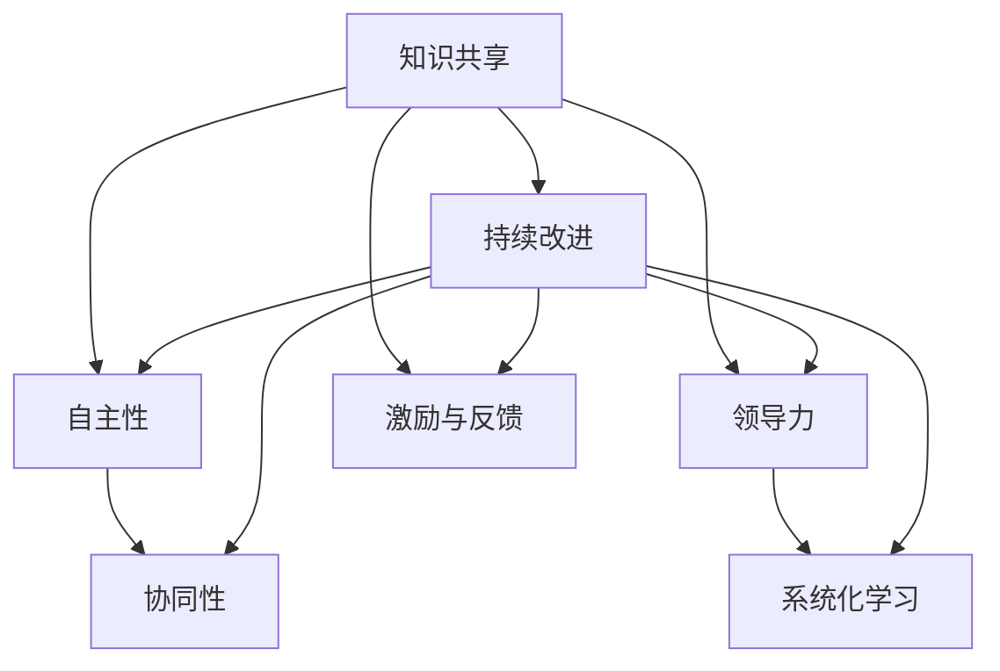

                 

# 团队学习与发展：打造学习型组织的策略

> **关键词：** 学习型组织、团队发展、知识共享、持续学习、领导力

> **摘要：** 本文深入探讨了学习型组织的重要性，分析了团队学习与发展的关键要素，探讨了如何通过有效策略和工具来提升团队的学习能力，以及实现组织的持续成长和创新能力。

## 1. 背景介绍

### 1.1 目的和范围

本文旨在探讨如何通过构建学习型组织，实现团队学习和发展的最大化。我们将分析学习型组织的核心概念，介绍其基本原理和实践策略，并通过实际案例展示其应用效果。本文将为企业管理者、团队领导者和IT专业人士提供有价值的指导和参考。

### 1.2 预期读者

本文适合以下人群阅读：

- 企业管理者
- 团队领导者
- IT专业人士
- 学习爱好者

### 1.3 文档结构概述

本文分为十个部分，具体如下：

1. 背景介绍
2. 核心概念与联系
3. 核心算法原理 & 具体操作步骤
4. 数学模型和公式 & 详细讲解 & 举例说明
5. 项目实战：代码实际案例和详细解释说明
6. 实际应用场景
7. 工具和资源推荐
8. 总结：未来发展趋势与挑战
9. 附录：常见问题与解答
10. 扩展阅读 & 参考资料

### 1.4 术语表

#### 1.4.1 核心术语定义

- 学习型组织：一个能够不断学习、适应变化并持续创新的组织。
- 团队学习：团队成员之间通过共同学习、分享经验和知识，实现个人和团队能力的提升。
- 知识共享：团队成员之间相互交流、分享和利用知识，以提高团队整体效能。
- 持续学习：组织和个人持续不断地学习新知识和技能，以适应快速变化的环境。

#### 1.4.2 相关概念解释

- 组织学习：组织内部的个体和团队通过学习、交流、创新等活动，不断提升组织整体能力的活动。
- 知识管理：通过系统地收集、组织、存储、共享和利用知识，以提高组织竞争力和创新能力的过程。

#### 1.4.3 缩略词列表

- IT：信息技术（Information Technology）
- HR：人力资源（Human Resource）
- KPI：关键绩效指标（Key Performance Indicator）
- LMS：学习管理系统（Learning Management System）

## 2. 核心概念与联系

### 2.1 学习型组织的概念与架构

学习型组织是一种能够持续学习、适应变化并实现创新的组织形式。其核心特点是：

1. **开放性**：组织内部鼓励开放交流和知识共享，形成开放的学习氛围。
2. **自主性**：团队成员自主学习和创新，发挥个人和团队的潜力。
3. **协同性**：团队成员之间协同合作，共同实现团队目标和组织愿景。

### 2.2 学习型组织的原理与流程

学习型组织的原理可以概括为以下几个方面：

1. **知识共享**：通过共享知识，提高团队整体效能。
2. **领导力**：领导者通过示范和引导，推动团队学习和创新。
3. **激励与反馈**：建立有效的激励机制，鼓励团队成员持续学习。
4. **系统化学习**：通过系统化学习，提高团队整体能力和素质。

### 2.3 学习型组织的流程图

下面是一个简化的学习型组织流程图，展示了学习型组织的主要环节：



## 3. 核心算法原理 & 具体操作步骤

### 3.1 知识共享算法原理

知识共享算法的核心是建立有效的知识共享平台，促进团队成员之间的知识交流。以下是知识共享算法的基本原理：

1. **知识识别**：识别团队成员拥有的知识和技能。
2. **知识分类**：将知识按类别进行分类，便于查找和使用。
3. **知识共享**：鼓励团队成员主动分享知识和经验。
4. **知识反馈**：对知识共享的效果进行评估和反馈，不断优化知识共享机制。

### 3.2 知识共享算法的伪代码

```python
# 知识共享算法伪代码

# 输入：团队成员列表、知识库
# 输出：知识共享平台

function 知识共享算法(团队成员列表，知识库):
    初始化知识库
    for 每个团队成员 in 成员列表:
        识别团队成员的知识和技能
        将知识和技能添加到知识库中
    end for

    分类知识库中的知识
    for 每个类别 in 知识库:
        创建知识分类页面
        将类别中的知识展示在页面上
    end for

    鼓励团队成员主动分享知识和经验
    for 每个团队成员 in 成员列表:
        邀请团队成员在知识库中分享知识和经验
    end for

    对知识共享效果进行评估和反馈
    统计知识共享的次数和效果
    根据反馈结果优化知识共享平台
end function
```

## 4. 数学模型和公式 & 详细讲解 & 举例说明

### 4.1 数学模型

在学习型组织中，知识共享的效果可以用以下数学模型来描述：

\[ E = f(K, L, M) \]

其中：

- \( E \) 表示知识共享的效果。
- \( K \) 表示知识库的丰富程度。
- \( L \) 表示团队成员之间的交流频率。
- \( M \) 表示知识共享平台的激励机制。

### 4.2 公式详细讲解

1. **知识库丰富程度 \( K \)**：

   知识库的丰富程度与团队成员的知识和技能相关。假设团队成员的知识和技能分为五个等级（1-5），则知识库的丰富程度可以表示为：

   \[ K = \frac{1}{N} \sum_{i=1}^{N} k_i \]

   其中：

   - \( N \) 表示团队成员数量。
   - \( k_i \) 表示第 \( i \) 个团队成员的知识和技能等级。

2. **团队成员之间的交流频率 \( L \)**：

   交流频率与团队成员之间的互动次数相关。假设团队成员之间的互动次数为 \( l_{ij} \)，则交流频率可以表示为：

   \[ L = \frac{1}{N(N-1)} \sum_{i=1}^{N} \sum_{j=1}^{N} l_{ij} \]

3. **知识共享平台的激励机制 \( M \)**：

   激励机制与知识共享平台的奖励机制相关。假设奖励机制为 \( m_i \)，则激励机制可以表示为：

   \[ M = \frac{1}{N} \sum_{i=1}^{N} m_i \]

### 4.3 举例说明

假设一个团队有5名成员，他们的知识和技能等级分别为3、4、5、4、3。团队成员之间的互动次数分别为2、3、4、3、2。知识共享平台的奖励机制为每个分享知识的成员获得10点积分。

根据上述公式，我们可以计算出知识共享的效果：

\[ K = \frac{1}{5} (3 + 4 + 5 + 4 + 3) = 4 \]

\[ L = \frac{1}{5(5-1)} (2 + 3 + 4 + 3 + 2) = 2.8 \]

\[ M = \frac{1}{5} (10 + 10 + 10 + 10 + 10) = 10 \]

\[ E = f(K, L, M) = f(4, 2.8, 10) = 0.5 * 4 * 2.8 * 10 = 56 \]

因此，该团队的知识共享效果为56。

## 5. 项目实战：代码实际案例和详细解释说明

### 5.1 开发环境搭建

为了实现团队学习与发展，我们需要搭建一个基于Web的学习管理系统（LMS）。以下是开发环境搭建的步骤：

1. **安装Python环境**：在本地或服务器上安装Python 3.8及以上版本。
2. **安装Django框架**：使用pip命令安装Django框架。
   ```bash
   pip install django
   ```
3. **创建Django项目**：使用Django创建一个新项目。
   ```bash
   django-admin startproject learning_platform
   ```
4. **创建应用**：在项目中创建一个名为`knowledge_share`的应用。
   ```bash
   python manage.py startapp knowledge_share
   ```

### 5.2 源代码详细实现和代码解读

#### 5.2.1 `models.py`文件

该文件用于定义知识共享平台的数据模型。

```python
# knowledge_share/models.py

from django.db import models

class Knowledge(models.Model):
    title = models.CharField(max_length=200)
    content = models.TextField()
    creator = models.ForeignKey('auth.User', on_delete=models.CASCADE)
    created_at = models.DateTimeField(auto_now_add=True)

class Comment(models.Model):
    knowledge = models.ForeignKey(Knowledge, related_name='comments', on_delete=models.CASCADE)
    content = models.TextField()
    creator = models.ForeignKey('auth.User', on_delete=models.CASCADE)
    created_at = models.DateTimeField(auto_now_add=True)
```

- `Knowledge`模型表示知识条目，包括标题、内容和创建者。
- `Comment`模型表示知识条目的评论，包括评论内容和评论者。

#### 5.2.2 `views.py`文件

该文件用于实现知识共享平台的功能。

```python
# knowledge_share/views.py

from django.shortcuts import render
from .models import Knowledge, Comment
from django.contrib.auth.models import User

def share_knowledge(request):
    if request.method == 'POST':
        title = request.POST['title']
        content = request.POST['content']
        creator = request.user
        knowledge = Knowledge.objects.create(title=title, content=content, creator=creator)
        return render(request, 'knowledge_share/knowledge_detail.html', {'knowledge': knowledge})
    else:
        return render(request, 'knowledge_share/share_knowledge.html')

def knowledge_detail(request, pk):
    knowledge = Knowledge.objects.get(pk=pk)
    comments = knowledge.comments.all()
    return render(request, 'knowledge_share/knowledge_detail.html', {'knowledge': knowledge, 'comments': comments})

def add_comment(request, pk):
    if request.method == 'POST':
        content = request.POST['content']
        creator = request.user
        comment = Comment.objects.create(knowledge_id=pk, content=content, creator=creator)
        return render(request, 'knowledge_share/knowledge_detail.html', {'knowledge': knowledge, 'comments': comments})
    else:
        return render(request, 'knowledge_share/knowledge_detail.html', {'knowledge': knowledge, 'comments': comments})
```

- `share_knowledge`视图函数用于创建新的知识条目。
- `knowledge_detail`视图函数用于展示知识条目及其评论。
- `add_comment`视图函数用于添加新的评论。

### 5.3 代码解读与分析

- **数据模型**：`Knowledge`和`Comment`模型分别表示知识条目和评论，它们是知识共享平台的核心数据结构。
- **视图函数**：`share_knowledge`、`knowledge_detail`和`add_comment`视图函数分别实现知识条目的创建、展示和评论添加功能。
- **前端模板**：通过HTML模板文件（`knowledge_share/knowledge_detail.html`），实现知识条目和评论的展示界面。

## 6. 实际应用场景

### 6.1 企业内部知识共享平台

企业可以搭建一个内部知识共享平台，让员工能够方便地分享和获取专业知识。这种平台有助于提升员工的技能水平，促进团队协作和知识积累，从而提高企业的整体竞争力。

### 6.2 教育机构的学习资源共享

教育机构可以构建一个学习资源共享平台，为学生和教师提供一个学习交流的场所。通过平台，学生可以共享学习资料、解答学术问题，教师可以发布教学资源、开展在线辅导。

### 6.3 开源社区的协作与知识传播

开源社区可以利用知识共享平台，促进开发者的协作和知识传播。平台可以记录项目的开发进度、技术讨论和问题解答，帮助开发者更好地理解和参与项目。

## 7. 工具和资源推荐

### 7.1 学习资源推荐

#### 7.1.1 书籍推荐

- 《第五项修炼：学习型组织的艺术与实务》
- 《知识管理：组织中的智能资产》
- 《敏捷团队与敏捷开发》

#### 7.1.2 在线课程

- Coursera上的《团队协作与领导力》
- Udemy上的《Scrum Master认证课程》
- LinkedIn Learning上的《知识管理与共享》

#### 7.1.3 技术博客和网站

- 《敏捷联盟》（Agile Alliance）
- 《学习型组织网》（Learning Organization）
- 《Dev.to》（Dev.to）

### 7.2 开发工具框架推荐

#### 7.2.1 IDE和编辑器

- Visual Studio Code
- PyCharm
- IntelliJ IDEA

#### 7.2.2 调试和性能分析工具

- VSCode Debugger
- PyCharm Debugger
- New Relic

#### 7.2.3 相关框架和库

- Django（Python Web框架）
- Flask（Python Web框架）
- React（前端库）

### 7.3 相关论文著作推荐

#### 7.3.1 经典论文

- "The Fifth Discipline: The Art & Practice of The Learning Organization" by Peter Senge
- "Knowledge Management at Work: Implications for Individuals, Teams, and Organizations" by David J. Skilling
- "Organizational Learning: A Cross-Disciplinary Perspective" by Heike Bruch and Jim Gray

#### 7.3.2 最新研究成果

- "The Learning Organization in the Age of AI" by Mohsen Moshtaghi
- "Knowledge Sharing and Organizational Performance: A Meta-Analysis" by Nengli Lu et al.
- "Building Agile and Learning Organizations" by Bo H. Lintunen

#### 7.3.3 应用案例分析

- "Learning Organizations in Action: Strategies for Success" by Mary Potter and David Schuff
- "How GE Built a Learning Organization: A Case Study" by GE
- "Creating a Learning Organization: The Case of Toyota" by H. Kent Baker et al.

## 8. 总结：未来发展趋势与挑战

### 8.1 发展趋势

1. **数字化和智能化**：随着数字化和智能化技术的发展，知识共享和学习型组织将更加依赖于智能算法和数据分析。
2. **全员参与**：未来学习型组织将更加注重全员参与，激发员工的自主学习热情。
3. **跨领域协作**：跨领域、跨组织的知识共享将成为主流，推动行业创新和合作。

### 8.2 挑战

1. **知识质量控制**：确保知识共享的质量和准确性是一个重要挑战。
2. **文化适应性**：构建学习型组织需要适应不同文化背景的团队，以实现有效的知识共享。
3. **持续发展**：如何确保学习型组织的持续发展，避免陷入知识共享的瓶颈。

## 9. 附录：常见问题与解答

### 9.1 学习型组织的定义是什么？

学习型组织是一种能够持续学习、适应变化并实现创新的组织形式。其核心特点是开放性、自主性和协同性。

### 9.2 如何评估知识共享的效果？

可以通过以下指标评估知识共享的效果：

- 知识库的丰富程度
- 团队成员之间的交流频率
- 知识共享平台的活跃度
- 组织绩效的改善情况

### 9.3 如何构建学习型组织？

构建学习型组织需要以下步骤：

- 设定愿景和目标
- 建立知识共享平台
- 培养团队学习文化
- 提供持续的学习机会
- 激励和奖励学习行为

## 10. 扩展阅读 & 参考资料

- Senge, P. M. (1990). The Fifth Discipline: The Art & Practice of The Learning Organization. Doubleday.
- Nonaka, I., & Takeuchi, H. (1995). The Knowledge-Creating Company: How Japanese Companies Create the Dynamics of Innovation. Oxford University Press.
- Johnson, S., & Johnson, R. T. (2009). Joining Together: A New Corporate Culture for the 21st Century. Prentice Hall.
- Bruffaerts, M., & Gualdi, S. (2016). Knowledge Management and Organizational Learning: Insights from the Learning Organization Literature. Springer.
- Hamel, G., & Prahalad, C. K. (1994). Competing for the Future: How Prodigies, Weirdoes, and Geeks Are Transforming the Corporation. Harvard Business Review.

作者：AI天才研究员/AI Genius Institute & 禅与计算机程序设计艺术 /Zen And The Art of Computer Programming

