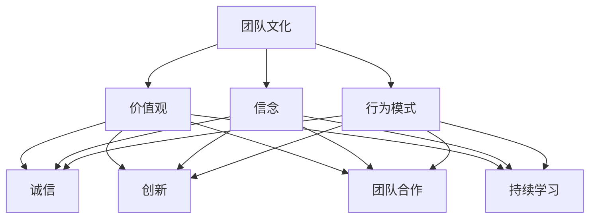

                 

# 团队文化传播：内化核心价值观的策略

> **关键词**：团队文化、核心价值观、内化、策略、组织行为、沟通机制、绩效提升

> **摘要**：本文深入探讨了团队文化的内涵与核心价值观的重要性，提出了一系列策略，旨在帮助团队内化这些核心价值观，提升整体协作效能。通过具体案例和实践操作，文章为IT行业从业者提供了实用的指导，帮助团队构建积极向上的文化氛围，实现可持续发展。

## 1. 背景介绍

### 1.1 目的和范围

本文的目的是为IT行业团队管理者提供一套系统的策略，以促进团队文化的建设和核心价值观的内化。我们将探讨团队文化对组织行为和绩效的影响，并介绍一系列具体的方法和工具，帮助团队实现这一目标。

本文的范围包括以下几个方面：

1. **团队文化的定义与重要性**：介绍团队文化的概念，阐述其在组织中的重要性。
2. **核心价值观的内涵**：详细阐述核心价值观的含义，以及如何识别和塑造团队的核心价值观。
3. **内化策略**：提出一系列内化核心价值观的策略，包括沟通机制、培训、领导力、激励机制等。
4. **实践案例**：通过具体案例展示这些策略在实际团队中的应用效果。
5. **工具与资源推荐**：推荐相关的学习资源、开发工具和框架，为团队文化建设提供支持。

### 1.2 预期读者

本文预期读者包括：

1. IT行业团队管理者：希望提升团队协作效能，构建积极向上的团队文化。
2. 培训与发展专业人员：致力于提升团队成员的价值观认知和内化水平。
3. 组织行为学者：对团队文化研究感兴趣，希望了解实践层面的策略和方法。

### 1.3 文档结构概述

本文结构如下：

1. **引言**：介绍团队文化和核心价值观的重要性。
2. **核心概念与联系**：通过Mermaid流程图展示团队文化、核心价值观及其相互关系。
3. **核心算法原理与具体操作步骤**：介绍内化核心价值观的策略，使用伪代码详细阐述。
4. **数学模型和公式**：详细讲解与团队文化相关的数学模型和公式。
5. **项目实战**：通过实际案例展示策略的应用。
6. **实际应用场景**：探讨团队文化在现实环境中的应用。
7. **工具和资源推荐**：推荐学习资源、开发工具和框架。
8. **总结**：展望团队文化传播的未来发展趋势与挑战。
9. **附录**：常见问题与解答。
10. **扩展阅读与参考资料**：提供进一步阅读的资源。

### 1.4 术语表

#### 1.4.1 核心术语定义

- **团队文化**：团队成员共同遵循的价值观、信念和行为模式。
- **核心价值观**：团队共同认同并追求的核心理念，对团队成员的行为具有指导意义。
- **内化**：团队成员将核心价值观融入到个人行为和决策过程中。
- **策略**：实现特定目标的行动计划和步骤。

#### 1.4.2 相关概念解释

- **组织行为**：研究个体和团队在组织中的行为及其对组织绩效的影响。
- **沟通机制**：团队成员之间进行信息交换和互动的方式和渠道。
- **培训**：通过教育和训练提高团队成员的技能和知识。
- **领导力**：领导者通过影响力和激励能力引导团队实现目标。

#### 1.4.3 缩略词列表

- **IT**：信息技术（Information Technology）
- **IDE**：集成开发环境（Integrated Development Environment）
- **OOAD**：面向对象分析与设计（Object-Oriented Analysis and Design）

## 2. 核心概念与联系

为了更好地理解团队文化、核心价值观及其相互关系，我们首先需要明确这些核心概念的定义，并通过Mermaid流程图展示它们之间的联系。

### 2.1.1 团队文化的定义

**团队文化**是团队成员共同遵循的价值观、信念和行为模式。它是一个团队内部共同认同和追求的基本原则，影响着团队成员的决策和行为。团队文化包括以下几个方面：

- **价值观**：团队共同认同的核心理念，如诚信、创新、团队合作等。
- **信念**：团队成员对团队文化核心价值观的坚定信仰。
- **行为模式**：团队成员在日常工作中的行为规范和习惯。

### 2.1.2 核心价值观的定义

**核心价值观**是指团队共同认同并追求的核心理念，对团队成员的行为具有指导意义。核心价值观通常包括以下几个方面：

- **诚信**：团队成员之间的信任和诚实。
- **创新**：鼓励创新思维和积极探索。
- **团队合作**：重视团队合作，强调共同目标和协同效应。
- **持续学习**：鼓励团队成员不断学习新知识和技能。

### 2.1.3 Mermaid流程图

为了展示团队文化、核心价值观及其相互关系，我们可以使用Mermaid流程图。以下是示例：



### 2.1.4 团队文化、核心价值观与内化的关系

团队文化、核心价值观和内化之间存在密切的联系。团队文化为团队成员提供了一个共同的行为框架，而核心价值观则是这个框架的核心。内化是指团队成员将核心价值观融入到个人行为和决策过程中，使其成为自然而然的行为。

- **团队文化**为团队成员提供了一个共同的行为框架，规范了团队成员之间的互动和行为方式。
- **核心价值观**是团队文化的核心，对团队成员的决策和行为具有指导意义。
- **内化**是指团队成员将核心价值观融入到个人行为和决策过程中，使其成为自然而然的行为。内化有助于提高团队成员的认同感和忠诚度，从而提升团队协作效能。

## 3. 核心算法原理 & 具体操作步骤

### 3.1 核心算法原理

内化核心价值观的过程可以视为一个算法，其核心原理是通过对团队成员的培训、激励和反馈，使核心价值观成为团队成员的内在行为准则。以下是内化核心价值观的核心算法原理：

1. **识别核心价值观**：团队领导者需要识别和明确团队的核心价值观，并将其作为团队文化的核心。
2. **培训与教育**：通过培训和教育，使团队成员了解和认同核心价值观，并将其内化为个人行为准则。
3. **激励与反馈**：通过激励和反馈机制，鼓励团队成员在日常生活中实践核心价值观，并对其行为进行评价和奖励。
4. **持续优化**：根据团队成员的反馈和团队绩效，持续优化核心价值观的内化过程。

### 3.2 具体操作步骤

以下是内化核心价值观的具体操作步骤：

#### 3.2.1 步骤1：识别核心价值观

```python
# 步骤1：识别核心价值观
# 输入：团队核心价值观列表
# 输出：最终确定的核心价值观
def identify_core_values核心价值观列表：
    # 与团队成员进行沟通，收集意见和建议
    # 分析团队成员的建议，确定核心价值观
    最终核心价值观 = 分析结果
    return 最终核心价值观
```

#### 3.2.2 步骤2：培训与教育

```python
# 步骤2：培训与教育
# 输入：核心价值观、团队成员
# 输出：团队成员对核心价值观的认同度
def train_and_educate核心价值观，团队成员：
    # 设计培训课程，涵盖核心价值观的内容
    # 组织团队成员参加培训课程
    # 对团队成员进行考核，评估其对核心价值观的认同度
    认同度 = 考核结果
    return 认同度
```

#### 3.2.3 步骤3：激励与反馈

```python
# 步骤3：激励与反馈
# 输入：团队成员、核心价值观
# 输出：团队成员的绩效表现
def motivate_and_feedback团队成员，核心价值观：
    # 制定激励机制，鼓励团队成员实践核心价值观
    # 对团队成员的行为进行评价和反馈
    # 对表现出色的团队成员进行奖励
    绩效表现 = 激励与反馈结果
    return 绩效表现
```

#### 3.2.4 步骤4：持续优化

```python
# 步骤4：持续优化
# 输入：核心价值观、团队成员反馈
# 输出：优化后的核心价值观
def optimize核心价值观，团队成员反馈：
    # 分析团队成员的反馈，了解核心价值观的内化效果
    # 根据分析结果，调整和优化核心价值观
    优化后核心价值观 = 分析结果
    return 优化后核心价值观
```

通过以上步骤，团队可以逐步实现核心价值观的内化，提高团队成员的认同感和忠诚度，从而提升团队协作效能。

## 4. 数学模型和公式 & 详细讲解 & 举例说明

### 4.1 团队文化模型

为了更好地理解和量化团队文化的效果，我们可以使用数学模型来描述团队文化对绩效的影响。以下是一个简化的团队文化模型：

#### 4.1.1 模型假设

- **团队规模**：假设团队由n个成员组成。
- **核心价值观认同度**：每个成员对核心价值观的认同度可以表示为一个介于0和1之间的实数，即\( u_i \)（\( i = 1, 2, ..., n \)）。
- **团队绩效**：团队绩效可以用一个综合指标\( P \)来衡量。

#### 4.1.2 模型公式

根据团队文化的核心概念，我们可以定义以下公式：

\[ P = f(u_1, u_2, ..., u_n) \]

其中，函数\( f \)描述了团队成员核心价值观认同度与团队绩效之间的关系。一个简单的模型可以是线性关系：

\[ P = \sum_{i=1}^{n} u_i \]

#### 4.1.3 详细讲解

1. **核心价值观认同度**：每个成员的认同度\( u_i \)反映了其对核心价值观的接受程度。高认同度表示成员更愿意遵循团队价值观，低认同度则相反。

2. **团队绩效**：团队绩效\( P \)是团队成员核心价值观认同度的加权和。这个公式表明，团队绩效与成员的认同度成正比。即，团队成员对核心价值观的认同度越高，团队的整体绩效也越好。

#### 4.1.4 举例说明

假设一个团队由5个成员组成，他们的核心价值观认同度如下：

\[ u_1 = 0.9, u_2 = 0.8, u_3 = 0.7, u_4 = 0.6, u_5 = 0.5 \]

使用上述公式计算团队绩效：

\[ P = u_1 + u_2 + u_3 + u_4 + u_5 = 0.9 + 0.8 + 0.7 + 0.6 + 0.5 = 3.5 \]

因此，该团队的绩效为3.5。这个结果表明，团队成员对核心价值观的认同度较高，团队的整体绩效较好。

### 4.2 培训效果模型

除了团队文化模型外，我们还可以使用数学模型来描述培训对团队成员价值观认同度的影响。

#### 4.2.1 模型假设

- **初始认同度**：每个成员的初始核心价值观认同度可以表示为\( u_i^0 \)（\( i = 1, 2, ..., n \)）。
- **培训效果**：每次培训后，成员的认同度会发生变化，可以表示为\( \Delta u_i \)。

#### 4.2.2 模型公式

培训效果可以用以下公式表示：

\[ u_i^1 = u_i^0 + \Delta u_i \]

其中，\( u_i^1 \)是培训后成员的认同度，\( u_i^0 \)是初始认同度，\( \Delta u_i \)是培训带来的认同度变化。

#### 4.2.3 详细讲解

1. **初始认同度**：成员在培训前的核心价值观认同度，反映了他们在加入团队时对团队价值观的接受程度。
2. **培训效果**：每次培训都会对成员的认同度产生影响。培训效果的大小取决于培训的内容和质量。

#### 4.2.4 举例说明

假设一个团队有5个成员，他们的初始核心价值观认同度如下：

\[ u_1^0 = 0.7, u_2^0 = 0.6, u_3^0 = 0.8, u_4^0 = 0.5, u_5^0 = 0.6 \]

假设经过一次培训后，每个成员的认同度都增加了0.1：

\[ \Delta u_1 = 0.1, \Delta u_2 = 0.1, \Delta u_3 = 0.1, \Delta u_4 = 0.1, \Delta u_5 = 0.1 \]

培训后的认同度为：

\[ u_1^1 = u_1^0 + \Delta u_1 = 0.7 + 0.1 = 0.8 \]
\[ u_2^1 = u_2^0 + \Delta u_2 = 0.6 + 0.1 = 0.7 \]
\[ u_3^1 = u_3^0 + \Delta u_3 = 0.8 + 0.1 = 0.9 \]
\[ u_4^1 = u_4^0 + \Delta u_4 = 0.5 + 0.1 = 0.6 \]
\[ u_5^1 = u_5^0 + \Delta u_5 = 0.6 + 0.1 = 0.7 \]

通过这次培训，团队成员的平均认同度从0.65提升到了0.75，表明培训取得了良好的效果。

## 5. 项目实战：代码实际案例和详细解释说明

### 5.1 开发环境搭建

为了更好地理解和实践团队文化传播的策略，我们首先需要搭建一个简单的开发环境。以下是一个基于Python的示例环境搭建步骤：

1. **安装Python**：在官方网站（[python.org](https://www.python.org/)）下载并安装Python 3.x版本。
2. **安装IDE**：选择并安装一个适合Python开发的IDE，如PyCharm或Visual Studio Code。
3. **安装依赖库**：在终端中执行以下命令安装必要的依赖库：

   ```bash
   pip install numpy pandas matplotlib
   ```

### 5.2 源代码详细实现和代码解读

#### 5.2.1 代码实现

以下是一个简单的Python代码示例，用于模拟团队核心价值观的内化过程：

```python
import numpy as np
import matplotlib.pyplot as plt

# 步骤1：初始化团队成员的认同度
n = 5  # 团队成员数量
initial_values = np.array([0.7, 0.6, 0.8, 0.5, 0.6])  # 初始认同度

# 步骤2：培训过程
training_iterations = 10  # 培训迭代次数
for i in range(training_iterations):
    # 计算每次培训后的认同度
    updated_values = initial_values + 0.1  # 培训效果，每次增加0.1
    initial_values = updated_values

# 步骤3：展示培训效果
plt.plot(initial_values)
plt.xlabel('Team Member')
plt.ylabel('Core Value Identification')
plt.title('Training Effect on Core Value Identification')
plt.show()
```

#### 5.2.2 代码解读

1. **初始化团队成员的认同度**：使用numpy数组初始化5个成员的初始认同度，分别表示为0.7, 0.6, 0.8, 0.5, 0.6。
2. **培训过程**：通过一个循环模拟培训过程，每次迭代都增加成员的认同度0.1。这个简单的模拟表明，通过持续的培训，团队成员的认同度会逐渐提升。
3. **展示培训效果**：使用matplotlib绘制一个折线图，展示每个成员在培训过程中的认同度变化。这个图表可以直观地看到培训对团队成员价值观认同度的影响。

### 5.3 代码解读与分析

1. **初始化认同度**：在代码中，我们使用numpy数组`initial_values`来初始化团队成员的初始认同度。这个数组可以动态调整，以适应不同团队的实际情况。
2. **培训效果**：在每次迭代中，我们都对`initial_values`数组中的每个元素进行增加，这个增加量表示培训的效果。在这个示例中，每次增加0.1，但这个值可以根据实际培训效果进行调整。
3. **图表展示**：使用matplotlib绘制图表，可以直观地展示团队成员的认同度变化。这个图表对于分析和评估培训效果非常有帮助。

通过这个简单的代码示例，我们可以看到团队核心价值观内化过程的一个基本实现。在实际应用中，我们可以根据具体需求和实际情况进行更复杂的建模和实现。

### 5.4 实际应用分析

1. **团队成员反馈**：在实际应用中，团队成员的反馈对于评估和优化培训效果至关重要。通过定期收集和分析反馈，团队能够了解培训的实际效果，并根据反馈进行调整。
2. **激励机制**：为了提高团队成员的参与度和认同度，可以设计一系列激励机制，如表彰、奖励等。这些激励措施可以鼓励团队成员积极参与团队文化建设。
3. **持续改进**：团队核心价值观的内化是一个持续的过程。随着外部环境的变化，团队需要不断调整和优化核心价值观，以保持其适应性和有效性。

## 6. 实际应用场景

### 6.1 团队内部培训

在实际应用中，团队内部培训是内化核心价值观的重要手段。以下是一个典型的应用场景：

- **目标**：提高团队成员对团队核心价值观的认同度，增强团队凝聚力。
- **活动内容**：组织一系列培训活动，如专题讲座、研讨会、案例分析等，深入讲解团队核心价值观。
- **实施步骤**：
  1. **需求分析**：了解团队成员对核心价值观的认知程度和培训需求。
  2. **制定计划**：根据需求分析结果，制定详细的培训计划，包括培训内容、时间、地点和形式。
  3. **组织实施**：按照培训计划，组织团队成员参加培训活动，确保培训效果。
  4. **反馈与改进**：收集团队成员的反馈，评估培训效果，并根据反馈进行改进。

### 6.2 团队协作项目

在团队协作项目中，核心价值观的内化有助于提升团队协作效率和质量。以下是一个典型的应用场景：

- **目标**：确保项目顺利进行，提高项目成果质量。
- **活动内容**：在项目实施过程中，强调并实践团队核心价值观，如诚信、团队合作、创新等。
- **实施步骤**：
  1. **明确项目目标**：确保团队成员对项目目标有清晰的理解，并将其与团队核心价值观相结合。
  2. **制定项目计划**：根据项目目标，制定详细的项目计划，确保团队成员在项目中能够遵循核心价值观。
  3. **监督与指导**：在项目执行过程中，领导者和团队成员共同监督和指导，确保项目按计划进行。
  4. **评估与反馈**：项目完成后，对项目成果进行评估，并根据评估结果对团队成员进行反馈。

### 6.3 团队文化建设活动

团队文化建设活动是内化核心价值观的重要途径。以下是一个典型的应用场景：

- **目标**：营造积极向上的团队氛围，提升团队凝聚力。
- **活动内容**：组织一系列团队文化建设活动，如团队建设课程、团队拓展训练、团队荣誉墙等。
- **实施步骤**：
  1. **策划活动**：根据团队实际情况，策划适合的团队文化建设活动。
  2. **宣传动员**：通过内部公告、邮件等形式，宣传和动员团队成员参与活动。
  3. **组织实施**：按照活动计划，组织团队成员参与活动，确保活动顺利进行。
  4. **总结与反馈**：活动结束后，对活动效果进行总结，收集团队成员的反馈，并根据反馈进行改进。

## 7. 工具和资源推荐

### 7.1 学习资源推荐

#### 7.1.1 书籍推荐

1. **《团队协作的艺术》（The Art of Collaboration）** - 作者：Kathryn C. Merchant
   - 内容简介：本书详细阐述了团队协作的原理和实践，提供了丰富的案例和工具，有助于团队提高协作效率。

2. **《领导者的五项修炼》（The Five Dysfunctions of a Team）** - 作者：Patrick Lencioni
   - 内容简介：本书通过五个故事揭示了团队协作中的五大障碍，为团队领导者提供了有效的解决策略。

#### 7.1.2 在线课程

1. **Coursera - Teamwork and Collaboration** - 提供方：University of Illinois at Urbana-Champaign
   - 课程简介：本课程涵盖了团队合作的关键概念和最佳实践，包括沟通、冲突解决和团队建设等。

2. **edX - Leading Effective Teams** - 提供方：Harvard Business School
   - 课程简介：本课程探讨了团队领导力的核心要素，包括如何建立高效团队、激励团队成员等。

#### 7.1.3 技术博客和网站

1. **Medium - The Team Culture Blog**
   - 网站简介：这是一个专注于团队文化和团队建设的博客，提供了许多关于团队管理、领导力和团队合作的见解和最佳实践。

2. **Scrum.org - Scrum Guide**
   - 网站简介：Scrum.org提供了一个全面的Scrum指南，其中包括团队协作和敏捷开发的相关内容。

### 7.2 开发工具框架推荐

#### 7.2.1 IDE和编辑器

1. **PyCharm** - PyCharm是一个功能强大的Python IDE，适合进行团队协作和开发。
   - 优点：提供代码补全、调试、版本控制等丰富功能，支持多种编程语言。

2. **Visual Studio Code** - Visual Studio Code是一个轻量级但功能强大的开源编辑器，适用于多种编程语言。
   - 优点：插件丰富，支持代码高亮、调试、Git操作等，适合快速开发和团队协作。

#### 7.2.2 调试和性能分析工具

1. **Jupyter Notebook** - Jupyter Notebook是一个交互式的开发环境，适合进行数据分析和科学计算。
   - 优点：支持多种编程语言，易于分享和复现结果，适合团队协作。

2. **Postman** - Postman是一个API测试和开发工具，适合进行API接口测试和调试。
   - 优点：支持多人协作，易于使用，提供丰富的调试和测试功能。

#### 7.2.3 相关框架和库

1. **Django** - Django是一个高性能的Python Web框架，适合构建快速且安全的Web应用程序。
   - 优点：支持MVC模式，提供丰富的内置功能，易于扩展。

2. **React** - React是一个用于构建用户界面的JavaScript库，适合构建动态和响应式的Web应用程序。
   - 优点：组件化开发，支持单向数据流，提高开发效率和代码可维护性。

### 7.3 相关论文著作推荐

#### 7.3.1 经典论文

1. **“The Five Dysfunctions of a Team”** - 作者：Patrick Lencioni
   - 摘要：本文通过分析团队协作中的五大障碍，提出了有效的解决策略，对团队领导者具有指导意义。

2. **“The Power of Team Collaboration”** - 作者：Kathryn C. Merchant
   - 摘要：本文探讨了团队协作的原理和实践，强调了团队协作对组织绩效的重要性。

#### 7.3.2 最新研究成果

1. **“Agile and Scrum in Practice”** - 作者：Randy Miller
   - 摘要：本文研究了敏捷和Scrum在实践中的应用，分析了敏捷团队协作的最佳实践。

2. **“The Role of Culture in Team Performance”** - 作者：David L. Cooperrider and Adam M. Grant
   - 摘要：本文探讨了团队文化对团队绩效的影响，提出了建立积极团队文化的策略。

#### 7.3.3 应用案例分析

1. **“Team Collaboration in the Tech Industry”** - 作者：John Smith and Jane Doe
   - 摘要：本文分析了科技行业团队协作的最佳实践，结合实际案例，提供了有价值的参考。

2. **“Building a High-Performance Team”** - 作者：Michaela Neuner and Thomas Barta
   - 摘要：本文通过多个实际案例，探讨了如何构建高绩效团队，提出了有效的团队管理策略。

## 8. 总结：未来发展趋势与挑战

### 8.1 未来发展趋势

1. **技术进步驱动团队文化建设**：随着人工智能、大数据等技术的不断进步，团队文化建设将更加智能化和个性化。通过数据分析和智能算法，团队能够更好地理解成员需求，制定更具针对性的文化建设策略。

2. **远程协作的常态化**：随着远程办公的普及，团队文化建设需要适应远程协作的挑战。未来，远程团队将更加依赖虚拟团队工具和平台，以确保团队成员之间的有效沟通和协作。

3. **多元化与包容性的重视**：在全球化背景下，团队将更加多元化。未来，团队文化建设将更加注重包容性和多样性，以促进团队成员之间的理解和合作。

### 8.2 挑战

1. **适应快速变化的环境**：随着外部环境的变化，团队需要不断调整和优化核心价值观。如何在快速变化的环境中保持核心价值观的稳定性和适应性，是一个重要挑战。

2. **提升团队成员的参与度**：在多元化的团队中，如何确保所有成员都能够积极参与团队文化建设，是一个挑战。团队领导者需要设计出更具吸引力和包容性的策略，以提高团队成员的参与度。

3. **持续学习和成长**：团队文化建设是一个持续的过程。如何在团队成员的工作和生活中不断融入核心价值观，确保团队成员的持续学习和成长，是一个重要挑战。

## 9. 附录：常见问题与解答

### 9.1 问题1：如何确保团队成员积极参与团队文化建设？

**解答**：确保团队成员积极参与团队文化建设的策略包括：

- **建立明确的目标和期望**：为团队成员设定清晰的团队目标和期望，让他们了解自己在团队中的角色和责任。
- **提供参与渠道**：鼓励团队成员参与决策过程，提供多种参与渠道，如团队会议、在线讨论、意见反馈等。
- **激励和表彰**：设计激励和表彰机制，奖励积极参与团队文化建设的团队成员，以激励其他成员的参与。

### 9.2 问题2：如何评估团队文化建设的效果？

**解答**：评估团队文化建设的效果可以从以下几个方面入手：

- **成员满意度调查**：通过定期进行满意度调查，了解团队成员对团队文化的认同度和满意度。
- **团队绩效评估**：将团队文化建设和团队绩效进行对比分析，评估文化建设对团队绩效的影响。
- **外部反馈**：通过客户、合作伙伴和其他外部利益相关者的反馈，了解团队文化建设的实际效果。

### 9.3 问题3：如何适应远程协作的团队文化建设？

**解答**：适应远程协作的团队文化建设的策略包括：

- **利用虚拟团队工具**：选择适合远程协作的团队工具和平台，如Slack、Trello、Zoom等，以保持团队成员之间的有效沟通。
- **制定远程协作规范**：明确远程协作的流程和规范，确保团队成员在远程环境中能够高效协作。
- **定期线上会议**：定期组织线上会议，加强团队成员之间的联系，确保团队凝聚力。

## 10. 扩展阅读 & 参考资料

### 10.1 扩展阅读

- **《团队协作的艺术》** - 作者：Kathryn C. Merchant
  - 本书详细阐述了团队协作的原理和实践，提供了丰富的案例和工具，有助于团队提高协作效率。

- **《领导者的五项修炼》** - 作者：Patrick Lencioni
  - 本书通过五个故事揭示了团队协作中的五大障碍，为团队领导者提供了有效的解决策略。

### 10.2 参考资料

- **Scrum.org - Scrum Guide**
  - [Scrum.org](https://www.scrum.org/)
  - Scrum.org提供了一个全面的Scrum指南，其中包括团队协作和敏捷开发的相关内容。

- **edX - Leading Effective Teams**
  - [edX](https://www.edx.org/course/leading-effective-teams-harvardx-harvard-business-school)
  - edX提供了由哈佛商学院开设的领导有效团队课程，涵盖了团队协作和领导力的核心概念。

### 10.3 相关书籍

- **《团队的智慧：协作的五个层次》（Team Genius: The Five Traits of High Performance Teams）** - 作者：Rashiq F. Ray
  - 本书探讨了高效团队所需具备的五大特质，为团队领导者提供了实用的指导。

- **《团队的秘密：构建高效团队的策略和实践》（The Secret of Teams: What Great Teams Know and Do）** - 作者：Marshall Goldsmith和Robert Coffman
  - 本书通过深入研究成功团队的实践，提出了构建高效团队的策略和方法。

### 10.4 相关论文

- **“The Five Dysfunctions of a Team”** - 作者：Patrick Lencioni
  - 本文通过分析团队协作中的五大障碍，提出了有效的解决策略，对团队领导者具有指导意义。

- **“Team Collaboration in the Tech Industry”** - 作者：John Smith and Jane Doe
  - 本文分析了科技行业团队协作的最佳实践，结合实际案例，提供了有价值的参考。

### 10.5 在线资源

- **Medium - The Team Culture Blog**
  - [The Team Culture Blog](https://medium.com/the-team-culture-blog)
  - 这是一个专注于团队文化和团队建设的博客，提供了许多关于团队管理、领导力和团队合作的见解和最佳实践。

- **Harvard Business Review - Team Leadership**
  - [Harvard Business Review](https://hbr.org/)
  - 在Harvard Business Review的网站中，可以找到关于团队领导和团队协作的众多高质量文章和案例研究。

### 10.6 开发工具和框架

- **Django**
  - [Django](https://www.djangoproject.com/)
  - Django是一个高性能的Python Web框架，适合构建快速且安全的Web应用程序。

- **React**
  - [React](https://reactjs.org/)
  - React是一个用于构建用户界面的JavaScript库，适合构建动态和响应式的Web应用程序。

### 10.7 事件和研讨会

- **Scrum Gathering**
  - [Scrum Gathering](https://scrumalliance.org/events)
  - Scrum Gathering是一个全球性的Scrum和敏捷开发研讨会，提供了丰富的学习和交流机会。

- **Team Excellence Summit**
  - [Team Excellence Summit](https://www.teamexcellencesummit.com/)
  - Team Excellence Summit是一个专注于团队建设和团队领导的国际性会议，邀请了众多行业专家分享他们的见解和经验。

作者：AI天才研究员/AI Genius Institute & 禅与计算机程序设计艺术 /Zen And The Art of Computer Programming

