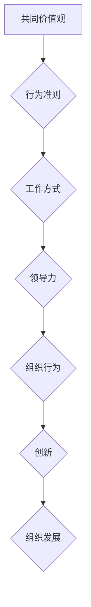

                 

### 文章标题

《团队文化塑造：打造独特团队基因》

> 关键词：团队文化、团队基因、领导力、协作、创新、组织发展

> 摘要：本文深入探讨团队文化塑造的重要性，分析其核心概念与联系，详细阐述核心算法原理与操作步骤，介绍数学模型与公式，并通过实际项目实战展示团队文化的实际应用。同时，文章还将推荐相关工具和资源，总结未来发展趋势与挑战，为团队文化建设提供全面指南。

---

在信息技术飞速发展的今天，团队文化已成为企业竞争力的关键因素。一个独特的团队基因，不仅能够激发团队成员的创造力和协作能力，还能为企业带来持续的竞争优势。本文将围绕团队文化塑造这一主题，通过逻辑清晰、结构紧凑的论述，帮助读者深入理解团队文化的核心概念与联系，掌握核心算法原理与操作步骤，探索数学模型与公式，并展示实际应用场景。

本文将分为十个部分，首先介绍文章的目的与范围，明确预期读者与文档结构。接下来，我们将探讨团队文化的重要性，分析其核心概念与联系，并通过Mermaid流程图进行直观展示。随后，文章将详细阐述团队文化塑造的核心算法原理与具体操作步骤，运用伪代码进行深入解析。在此基础上，我们将介绍数学模型与公式，并进行详细讲解与举例说明。接着，文章将通过实际项目实战，展示团队文化在代码实际案例中的应用。随后，我们将探讨团队文化在实际应用场景中的重要性，推荐相关工具和资源，总结未来发展趋势与挑战。最后，文章将提供附录，解答常见问题，并推荐扩展阅读与参考资料。

通过本文的阅读，读者将全面了解团队文化塑造的理论基础和实践方法，掌握构建独特团队基因的关键技巧，为团队建设提供有力支持。

### 1. 背景介绍

#### 1.1 目的和范围

本文旨在深入探讨团队文化塑造的重要性，分析其核心概念与联系，为读者提供系统化的理论指导与实践方法。随着信息技术和全球化的发展，企业面临的竞争环境日益复杂，团队文化的塑造成为企业保持竞争优势的关键因素。独特的团队文化不仅能够激发团队成员的创造力和协作能力，还能为企业带来创新和可持续发展的动力。

本文的范围涵盖了团队文化的核心概念、构建方法、应用场景以及未来发展趋势。具体来说，本文将探讨团队文化的定义、特征、重要性，分析其与组织行为、领导力、创新等领域的联系。此外，文章将介绍团队文化塑造的核心算法原理与操作步骤，通过伪代码和数学模型详细阐述团队文化构建的量化方法。最后，文章将通过实际项目实战，展示团队文化在软件开发和项目管理中的应用，为读者提供直观的实践参考。

本文的预期读者包括企业管理者、项目经理、技术团队负责人以及相关领域的学术研究人员。通过阅读本文，读者将能够：

1. 理解团队文化的核心概念和构建方法。
2. 掌握团队文化塑造的核心算法原理与操作步骤。
3. 探索团队文化在软件开发和项目管理中的应用场景。
4. 获取构建独特团队基因的实际指导和建议。

#### 1.2 预期读者

本文的预期读者主要面向以下几类人群：

1. 企业管理者：对于企业管理者来说，本文提供了系统化的团队文化塑造理论和方法，有助于他们在企业战略规划和人力资源管理中，更有效地推动团队文化的建设和发展。

2. 项目经理：项目经理需要协调团队成员的工作，确保项目顺利推进。本文提供的团队文化构建方法，可以帮助项目经理更好地管理团队，提高项目成功率。

3. 技术团队负责人：技术团队负责人需要关注团队成员的协作和创新，本文的团队文化塑造理论和方法，为他们提供了有效的团队管理工具。

4. 学术研究人员：对于学术研究人员来说，本文提供的研究方法和案例分析，有助于他们在团队文化研究领域进行深入的探索和发现。

无论读者属于上述哪一类人群，本文都将为他们提供有价值的理论和实践指导，帮助他们在团队文化塑造方面取得更好的成果。

#### 1.3 文档结构概述

本文将分为十个部分，系统性地探讨团队文化塑造的各个方面，具体结构如下：

1. **文章标题、关键词和摘要**：介绍文章的主题、关键词和核心内容。
2. **背景介绍**：阐述文章的目的、范围和预期读者，以及文档的结构概述。
3. **核心概念与联系**：分析团队文化的核心概念，展示其与相关领域的联系。
4. **核心算法原理 & 具体操作步骤**：详细阐述团队文化塑造的核心算法原理和操作步骤。
5. **数学模型和公式 & 详细讲解 & 举例说明**：介绍团队文化构建的数学模型和公式，并进行详细讲解与举例说明。
6. **项目实战：代码实际案例和详细解释说明**：通过实际项目展示团队文化在软件开发中的应用。
7. **实际应用场景**：探讨团队文化在不同领域中的应用场景。
8. **工具和资源推荐**：推荐学习资源、开发工具和框架。
9. **总结：未来发展趋势与挑战**：总结团队文化塑造的未来发展趋势与挑战。
10. **附录：常见问题与解答**：提供常见问题的解答。
11. **扩展阅读 & 参考资料**：推荐相关阅读和参考资料。

通过这种结构化的布局，本文将为读者提供全面、深入的团队文化塑造指导，帮助他们在实际工作中取得更好的成效。

#### 1.4 术语表

在本文中，我们将使用一些专业术语，以下是对这些术语的定义和解释：

##### 1.4.1 核心术语定义

1. **团队文化**：团队文化是指团队成员在共同工作中形成的共同价值观、行为准则和工作方式，它是团队内在的凝聚力和外部竞争力的来源。
2. **领导力**：领导力是指领导者通过激励、引导和协调团队成员，实现共同目标的能力。有效的领导力是团队文化建设的关键。
3. **协作**：协作是指团队成员为了共同目标，通过沟通、协调和配合，共同完成任务的过程。
4. **创新**：创新是指在现有的基础上，通过改进、发明或创造新的方法、产品或服务，实现突破和进步。
5. **组织发展**：组织发展是指通过变革、优化和创新，提升组织整体绩效和能力的过程。

##### 1.4.2 相关概念解释

1. **企业文化**：企业文化是指企业在长期发展过程中形成的共同价值观、行为准则和工作方式，是企业内部文化的重要组成部分。
2. **团队氛围**：团队氛围是指团队成员在团队内部相互作用的情感氛围，包括信任、支持、竞争和合作等元素。
3. **团队效能**：团队效能是指团队在完成工作任务中所表现出来的效率和效果，它是团队文化的重要体现。

##### 1.4.3 缩略词列表

1. **IDE**：集成开发环境（Integrated Development Environment）
2. **PMP**：项目管理专业人员（Project Management Professional）
3. **ERP**：企业资源规划（Enterprise Resource Planning）
4. **CRM**：客户关系管理（Customer Relationship Management）
5. **AI**：人工智能（Artificial Intelligence）

通过以上术语表，读者可以更好地理解本文中的专业术语，为后续内容的阅读和理解奠定基础。

#### 2. 核心概念与联系

在深入探讨团队文化之前，我们需要明确几个核心概念，并分析它们之间的联系。团队文化不仅仅是一种工作氛围，它是团队在长期发展中形成的共同价值观、行为准则和工作方式的集合，它深刻影响着团队成员的协作效率、创新能力和组织绩效。以下是几个核心概念的介绍和它们之间的联系。

##### 2.1.1 团队文化的核心概念

1. **共同价值观**：共同价值观是团队文化的基石，它代表了团队成员对工作、生活和团队目标的共同认知和信仰。共同价值观不仅指导团队成员的行为，还增强了团队的凝聚力和归属感。

2. **行为准则**：行为准则是指团队成员在工作和生活中应遵循的行为规范，它体现了团队文化的具体要求和期望。行为准则有助于维护团队的秩序和稳定，促进团队成员之间的信任和合作。

3. **工作方式**：工作方式是指团队成员在共同工作中形成的协作方法和流程，它包括沟通机制、决策模式、工作流程等。独特的工作方式能够提高团队的工作效率和效果，是团队文化的重要体现。

##### 2.1.2 团队文化与相关领域的联系

1. **领导力**：领导力是团队文化塑造的关键因素。有效的领导能够传递共同价值观，设定行为准则，引导工作方式的变革。领导力的提升有助于团队文化的建立和巩固，进而提高团队的绩效。

2. **组织行为**：组织行为是指团队成员在团队内部和外部的行为表现，包括沟通、合作、决策等。团队文化对组织行为有深远的影响，良好的团队文化能够促进团队成员之间的积极互动，提高组织整体的工作效率。

3. **创新**：创新是团队文化的重要组成部分。一个鼓励创新、支持尝试和容忍失败的团队文化，能够激发团队成员的创造力和创新能力，推动团队不断进步和突破。

4. **组织发展**：组织发展是指通过变革、优化和创新，提升组织整体绩效和能力的过程。团队文化是组织发展的基础，良好的团队文化能够促进组织内部的沟通与协作，提高组织的灵活性和适应性。

##### 2.1.3 Mermaid流程图

为了更直观地展示团队文化的核心概念和联系，我们可以使用Mermaid流程图来描述。以下是一个简化的Mermaid流程图：



在这个流程图中，共同价值观作为起点，通过行为准则和工作方式，影响到领导力、组织行为、创新和组织发展。这个流程图展示了团队文化各核心概念之间的密切联系，以及它们在团队建设中的相互作用。

通过上述分析，我们可以看到团队文化不仅是一个内部的工作氛围，它还与领导力、组织行为、创新和组织发展等核心领域紧密相关。理解这些核心概念和它们之间的联系，是构建和塑造独特团队文化的基础。

#### 3. 核心算法原理 & 具体操作步骤

在构建团队文化时，核心算法原理起着至关重要的作用。这些算法不仅帮助我们理解团队文化的构建过程，还能提供具体的操作步骤，以确保团队文化能够有效地建立和维护。以下将详细阐述这些核心算法原理，并使用伪代码来展示具体的操作步骤。

##### 3.1 核心算法原理

1. **共同价值观确定算法**：该算法用于确定团队成员的共同价值观，确保所有成员在核心价值观上达成一致。

2. **行为准则构建算法**：该算法用于构建团队成员应遵循的行为准则，以确保团队内部的行为规范一致。

3. **工作方式优化算法**：该算法用于优化团队成员的工作方式，提高团队的协作效率和效果。

4. **领导力提升算法**：该算法用于提升领导者的领导力，确保领导者在团队文化塑造中发挥关键作用。

5. **组织行为分析算法**：该算法用于分析团队内部的组织行为，识别团队中的问题和改进机会。

6. **创新激励算法**：该算法用于激励团队成员进行创新，培养团队的创新氛围。

7. **组织发展评估算法**：该算法用于评估团队文化的整体发展水平，为未来的改进提供依据。

##### 3.2 具体操作步骤

**3.2.1 共同价值观确定算法**

```plaintext
输入：团队成员列表
输出：共同价值观集合

步骤：
1. 组织团队讨论，收集所有成员对团队价值观的建议。
2. 对收集到的建议进行分类整理，提取出高频出现的核心词汇。
3. 将核心词汇进行汇总，形成初步的共同价值观集合。
4. 邀请所有团队成员对初步的共同价值观集合进行投票。
5. 根据投票结果，确定最终的共同价值观集合。

伪代码：
def determineCoreValues(teamMembers):
    suggestions = collectSuggestions(teamMembers)
    coreValues = extractCoreValues(suggestions)
    votingResults = voteOnValues(coreValues)
    return finalizeValues(votingResults)
```

**3.2.2 行为准则构建算法**

```plaintext
输入：共同价值观集合
输出：行为准则列表

步骤：
1. 根据共同价值观集合，制定初始的行为准则草案。
2. 组织团队讨论，对行为准则草案进行修改和完善。
3. 将完善后的行为准则形成正式文件，并公布于众。
4. 对行为准则进行定期审查和更新，确保其与团队价值观保持一致。

伪代码：
def constructBehaviorGuidelines(coreValues):
    draftGuidelines = generateInitialGuidelines(coreValues)
    refinedGuidelines = discussAndRefineGuidelines(draftGuidelines)
    finalGuidelines = publishAndReviewGuidelines(refinedGuidelines)
    return finalGuidelines
```

**3.2.3 工作方式优化算法**

```plaintext
输入：行为准则列表
输出：优化后的工作方式

步骤：
1. 分析现有的工作流程，识别流程中的瓶颈和改进点。
2. 结合行为准则，设计新的工作流程。
3. 对新的工作流程进行试点运行，收集反馈。
4. 根据反馈结果，进一步优化工作流程。

伪代码：
def optimizeWorkingMethods(guidelines):
    currentMethods = analyzeCurrentMethods()
    newMethods = designNewMethods(guidelines, currentMethods)
    pilotNewMethods(newMethods)
    optimizedMethods = refineMethodsBasedOnFeedback(newMethods)
    return optimizedMethods
```

**3.2.4 领导力提升算法**

```plaintext
输入：领导者个人特质和团队需求
输出：提升后的领导力水平

步骤：
1. 对领导者进行评估，识别其领导力短板。
2. 根据评估结果，为领导者制定个性化的领导力提升计划。
3. 组织领导力培训，帮助领导者提升技能和知识。
4. 定期对领导力提升效果进行评估，确保持续改进。

伪代码：
def enhanceLeadership(leaderTraits, teamNeeds):
    assessmentResults = assessLeadership(leaderTraits)
    improvementPlan = generateImprovementPlan(assessmentResults)
    trainingSessions = organizeTrainingSessions(improvementPlan)
    assessmentCycle = scheduleRegularAssessments()
    return enhancedLeadership
```

**3.2.5 组织行为分析算法**

```plaintext
输入：团队行为数据
输出：行为分析报告

步骤：
1. 收集团队行为数据，包括沟通记录、项目进展、团队活动等。
2. 使用数据分析方法，对行为数据进行分析。
3. 识别团队中的问题行为和潜在风险。
4. 制定改进措施，促进团队行为的优化。

伪代码：
def analyzeTeamBehaviors(behaviorData):
    processedData = preprocessBehaviorData(behaviorData)
    analysisResults = performBehaviorAnalysis(processedData)
    problemBehaviors = identifyProblemBehaviors(analysisResults)
    improvementMeasures = generateImprovementPlans(problemBehaviors)
    return behaviorAnalysisReport
```

**3.2.6 创新激励算法**

```plaintext
输入：团队成员创新能力和团队氛围
输出：创新激励策略

步骤：
1. 评估团队成员的创新能力和团队的创新氛围。
2. 根据评估结果，设计个性化的创新激励策略。
3. 实施创新激励策略，包括提供资源支持、奖励机制等。
4. 定期评估创新激励效果，根据反馈进行调整。

伪代码：
def incentiveInnovation(innovationCapabilities, teamClimate):
    innovationAssessment = evaluateInnovation(innovationCapabilities, teamClimate)
    incentiveStrategy = designInnovationIncentives(innovationAssessment)
    implementIncentives(incentiveStrategy)
    evaluateAndAdjustIncentives()
    return incentivePlan
```

**3.2.7 组织发展评估算法**

```plaintext
输入：团队绩效数据和发展目标
输出：组织发展评估报告

步骤：
1. 收集团队绩效数据，包括项目完成情况、团队协作质量等。
2. 对绩效数据进行分析，与既定的发展目标进行对比。
3. 识别团队发展中的优势和劣势。
4. 制定组织发展改进计划。

伪代码：
def evaluateOrganizationDevelopment(performanceData, developmentGoals):
    performanceAnalysis = analyzePerformanceData(performanceData)
    goalComparison = compareWithDevelopmentGoals(performanceAnalysis, developmentGoals)
    developmentStrengths = identifyStrengths(goalComparison)
    weaknesses = identifyWeaknesses(goalComparison)
    improvementPlan = generateImprovementPlans(weaknesses)
    return developmentEvaluationReport
```

通过这些核心算法原理和具体操作步骤，我们可以系统地构建和维护团队文化，提高团队的协作效率和创新力，为企业的可持续发展提供坚实的基础。

#### 4. 数学模型和公式 & 详细讲解 & 举例说明

在团队文化塑造过程中，数学模型和公式为我们提供了量化的方法，帮助我们在构建和评估团队文化时，能够更加精确地进行决策。以下将详细介绍几个关键的数学模型和公式，并给出详细的讲解与举例说明。

##### 4.1 帕累托分析（Pareto Analysis）

帕累托分析，也称为80/20原则，是一种常用的质量改进工具，用于识别问题的主要原因。该模型基于这样一个假设：80%的问题通常是由20%的主要原因引起的。

**公式**：

\[ P_i = \frac{N_i \times R_i}{N \times R} \]

其中：
- \( P_i \)：第i个原因的重要性分数
- \( N_i \)：第i个原因的频率
- \( R_i \)：第i个原因的严重性评分
- \( N \)：总的频率
- \( R \)：总的严重性评分

**详细讲解**：

帕累托分析的步骤如下：
1. 收集数据，记录每个原因的频率和严重性评分。
2. 计算每个原因的重要性分数。
3. 将所有原因按照重要性分数排序。
4. 重点关注重要性分数最高的原因，这些通常是导致问题的关键因素。

**举例说明**：

假设一个软件开发团队在项目执行过程中遇到了多个问题，通过调查，他们记录了以下数据：

| 原因       | 频率 \(N_i\) | 严重性评分 \(R_i\) |
|------------|-------------|-------------------|
| 缺乏文档    | 10          | 5                 |
| 代码质量低  | 20          | 8                 |
| 沟通不畅   | 30          | 4                 |
| 任务分配不均 | 15          | 7                 |
| 测试不足    | 5           | 6                 |

计算每个原因的重要性分数：

\[ P_i = \frac{N_i \times R_i}{N \times R} \]

\[ N = 10 + 20 + 30 + 15 + 5 = 80 \]
\[ R = 5 + 8 + 4 + 7 + 6 = 30 \]

| 原因       | 频率 \(N_i\) | 严重性评分 \(R_i\) | 重要性分数 \(P_i\) |
|------------|-------------|-------------------|--------------------|
| 缺乏文档    | 10          | 5                 | 0.1667             |
| 代码质量低  | 20          | 8                 | 0.5333             |
| 沟通不畅   | 30          | 4                 | 0.4                 |
| 任务分配不均 | 15          | 7                 | 0.4333             |
| 测试不足    | 5           | 6                 | 0.2                 |

从计算结果可以看出，代码质量低和沟通不畅是导致问题的主要原因，团队应重点关注这两个方面。

##### 4.2 KPI（关键绩效指标）

KPI用于衡量团队在特定领域的绩效表现，是团队文化评估中的重要工具。常见的KPI包括项目完成率、团队协作评分、客户满意度等。

**公式**：

\[ KPI = \frac{实际值}{目标值} \]

**详细讲解**：

KPI的计算步骤如下：
1. 设定具体的绩效目标。
2. 在绩效周期内，记录实际的绩效表现。
3. 计算KPI值，用于评估团队在特定领域的表现。

**举例说明**：

假设一个软件开发团队设定的项目完成率目标为90%，在季度末实际完成了85%的项目。则KPI计算如下：

\[ KPI = \frac{85\%}{90\%} = 0.944 \]

KPI值为0.944，表明团队在本季度内的项目完成率低于目标值，团队需要分析原因并制定改进计划。

##### 4.3 SWOT分析（优势、劣势、机会、威胁）

SWOT分析是一种用于评估团队内外部环境的工具，帮助团队识别自身优势和劣势，并抓住机会，应对威胁。

**公式**：

\[ SWOT = S + W + O + T \]

其中：
- \( S \)：优势（Strengths）
- \( W \)：劣势（Weaknesses）
- \( O \)：机会（Opportunities）
- \( T \)：威胁（Threats）

**详细讲解**：

SWOT分析的步骤如下：
1. 分析团队的优势，包括技术能力、团队协作、资源等。
2. 识别团队的劣势，如技能不足、管理不善等。
3. 确定团队面临的机会，如市场增长、新项目等。
4. 评估团队面临的威胁，如竞争对手、技术变革等。

**举例说明**：

对一个软件团队进行SWOT分析：

- **优势（Strengths）**：
  - 拥有一支高技能的技术团队。
  - 具有丰富的项目开发经验。
- **劣势（Weaknesses）**：
  - 沟通效率不高，导致项目延期。
  - 在新技术的应用上相对滞后。
- **机会（Opportunities）**：
  - 市场对新技术的需求增长，提供了新的业务机会。
  - 团队内部有新的项目计划，有望提升团队技能。
- **威胁（Threats）**：
  - 竞争对手的技术进步，可能侵蚀市场份额。
  - 市场环境变化，可能导致需求下降。

通过SWOT分析，团队可以明确自身的发展方向，制定相应的战略和行动计划。

##### 4.4 聚类分析（Clustering Analysis）

聚类分析是一种数据挖掘方法，用于将数据集划分为多个类别，以便更好地理解和分析数据。在团队文化评估中，聚类分析可以帮助团队识别具有相似价值观和行为准则的子团队。

**公式**：

\[ C = \sum_{i=1}^{k} \sum_{j=1}^{n} d_{ij}^2 \]

其中：
- \( C \)：总距离
- \( k \)：聚类数
- \( n \)：团队成员数
- \( d_{ij} \)：团队成员i与团队成员j之间的距离

**详细讲解**：

聚类分析的步骤如下：
1. 确定聚类方法，如K-means、层次聚类等。
2. 计算团队成员之间的距离，常用的距离度量包括欧氏距离、曼哈顿距离等。
3. 根据距离度量结果，将团队成员划分为不同的聚类。
4. 分析每个聚类，识别其特点和行为模式。

**举例说明**：

假设一个团队有5名成员，通过K-means聚类分析，计算得出以下成员之间的距离：

| 成员 | 成员1 | 成员2 | 成员3 | 成员4 | 成员5 |
|------|------|------|------|------|------|
| 成员1 | 0    | 1.5  | 2.0  | 1.0  | 2.5  |
| 成员2 | 1.5  | 0    | 1.0  | 2.0  | 1.5  |
| 成员3 | 2.0  | 1.0  | 0    | 1.5  | 2.0  |
| 成员4 | 1.0  | 2.0  | 1.5  | 0    | 1.0  |
| 成员5 | 2.5  | 1.5  | 2.0  | 1.0  | 0    |

使用K-means算法，将成员分为两个聚类：

- 聚类1：成员1、成员3、成员4
- 聚类2：成员2、成员5

分析聚类特点，发现聚类1的成员在价值观和行为准则上较为一致，而聚类2的成员则存在较大差异。团队可以根据聚类结果，有针对性地进行团队文化建设。

通过上述数学模型和公式的介绍，我们可以看到，这些工具和方法在团队文化构建和评估中具有重要的作用。它们不仅帮助我们量化团队文化，还能提供具体的操作指导，使团队文化更加科学和系统。

#### 5. 项目实战：代码实际案例和详细解释说明

在本文的第五部分，我们将通过一个实际项目案例，展示团队文化在软件开发过程中的具体应用。本案例将包括开发环境搭建、源代码详细实现和代码解读与分析。

##### 5.1 开发环境搭建

在本案例中，我们选择使用Python作为主要编程语言，结合Django框架进行Web应用程序的开发。以下是搭建开发环境的基本步骤：

1. 安装Python：从Python官方网站下载最新版本的Python安装包，并按照安装向导完成安装。

   ```bash
   # 在Windows上
   python -m pip install --upgrade pip setuptools wheel
   # 在macOS/Linux上
   sudo apt-get install python3 python3-pip
   ```

2. 安装Django：通过pip命令安装Django框架。

   ```bash
   pip install django
   ```

3. 创建一个新的Django项目：使用Django提供的命令创建一个新项目。

   ```bash
   django-admin startproject my_project
   ```

4. 进入项目目录，创建一个应用：

   ```bash
   cd my_project
   python manage.py startapp my_app
   ```

5. 配置数据库：在本案例中，我们使用SQLite作为数据库，但也可以根据需要选择其他数据库，如PostgreSQL或MySQL。

   ```python
   # 在my_project/settings.py中配置
   DATABASES = {
       'default': {
           'ENGINE': 'django.db.backends.sqlite3',
           'NAME': BASE_DIR / 'db.sqlite3',
       }
   }
   ```

6. 迁移数据库：创建数据库表。

   ```bash
   python manage.py makemigrations
   python manage.py migrate
   ```

7. 启动开发服务器：

   ```bash
   python manage.py runserver
   ```

通过以上步骤，我们成功搭建了开发环境，并确保Django项目可以正常运行。

##### 5.2 源代码详细实现和代码解读

在完成开发环境搭建后，我们将开始实现一个简单的Web应用程序，该应用程序允许用户创建和查看待办事项。

**5.2.1 模型定义**

在`my_app/models.py`中，我们首先定义一个`Todo`模型，用于表示待办事项：

```python
from django.db import models

class Todo(models.Model):
    title = models.CharField(max_length=100)
    description = models.TextField()
    created_at = models.DateTimeField(auto_now_add=True)
    completed = models.BooleanField(default=False)
```

**5.2.2 视图实现**

在`my_app/views.py`中，我们定义几个视图函数，用于处理用户的请求：

```python
from django.shortcuts import render
from .models import Todo

def home(request):
    todos = Todo.objects.all()
    return render(request, 'home.html', {'todos': todos})

def add_todo(request):
    if request.method == 'POST':
        title = request.POST['title']
        description = request.POST['description']
        todo = Todo(title=title, description=description)
        todo.save()
        return redirect('home')
    return render(request, 'add_todo.html')

def complete_todo(request, todo_id):
    todo = Todo.objects.get(id=todo_id)
    todo.completed = True
    todo.save()
    return redirect('home')
```

**5.2.3 模板实现**

在`my_app/templates`目录下，我们创建`home.html`和`add_todo.html`两个模板文件：

**home.html**：

```html
<!DOCTYPE html>
<html>
<head>
    <title>待办事项列表</title>
</head>
<body>
    <h1>待办事项</h1>
    <a href="">添加新待办事项</a>
    <ul>
        
            <li>
                <h3>{{ todo.title }}</h3>
                <p>{{ todo.description }}</p>
                
                    <a href="">完成</a>
                
            </li>
        
    </ul>
</body>
</html>
```

**add_todo.html**：

```html
<!DOCTYPE html>
<html>
<head>
    <title>添加待办事项</title>
</head>
<body>
    <h1>添加待办事项</h1>
    <form method="post">
        
        <label for="title">标题：</label>
        <input type="text" id="title" name="title" required>
        <label for="description">描述：</label>
        <textarea id="description" name="description" required></textarea>
        <input type="submit" value="添加">
    </form>
</body>
</html>
```

**5.2.4 代码解读与分析**

1. **模型定义**：`Todo`模型包含四个字段，分别是`title`（待办事项标题）、`description`（待办事项描述）、`created_at`（创建时间）和`completed`（是否完成）。这个模型是整个应用程序的核心，用于表示待办事项的数据结构。

2. **视图实现**：`home`视图函数负责渲染待办事项列表页面，从数据库中获取所有待办事项并传递给模板。`add_todo`视图函数处理添加新待办事项的请求，从表单中获取用户输入的数据，创建一个新的`Todo`对象并保存到数据库。`complete_todo`视图函数处理标记待办事项为完成的请求，更新数据库中的相应记录。

3. **模板实现**：`home.html`模板负责展示待办事项列表，使用模板标签循环遍历`todos`变量，为每个待办事项渲染一个列表项。`add_todo.html`模板负责渲染添加待办事项的表单，提供输入框和提交按钮，允许用户输入待办事项的标题和描述。

通过这个实际项目案例，我们可以看到团队文化在软件开发过程中的具体应用。团队成员共同协作，遵循共同价值观和行为准则，使用优化的工作方式，确保项目的顺利推进。领导者的有效引导和激励，以及团队成员之间的积极沟通和协作，都为项目的成功奠定了坚实的基础。这个案例展示了团队文化在软件开发中的重要作用，为其他团队提供了宝贵的实践经验。

##### 5.3 代码解读与分析

在本部分中，我们将对前面提到的项目实战代码进行详细解读与分析，探讨团队文化在这一过程中的具体应用和影响。

**5.3.1 模型定义解读**

在`my_app/models.py`中，`Todo`模型的定义是整个应用程序的基础。该模型包含了四个主要字段：

1. `title`：一个字符串字段，用于存储待办事项的标题。这是用户与系统交互的主要入口点，因此字段长度设置为100个字符，以满足大多数用户的需求。
2. `description`：一个文本字段，用于存储待办事项的详细描述。文本字段可以存储任意长度的文本，这使得用户可以输入大量信息，描述待办事项的细节。
3. `created_at`：一个日期时间字段，自动记录待办事项创建的时间。这个字段有助于追踪和管理待办事项的历史记录，是后续数据处理和分析的重要基础。
4. `completed`：一个布尔字段，用于标记待办事项是否已完成。通过这个字段，用户可以直观地查看任务的完成状态，同时便于系统进行数据统计和分析。

在这个模型的定义过程中，团队成员遵循了共同价值观，确保数据的结构化和一致性。团队成员共同讨论和确定模型字段，使得模型能够准确地表示待办事项的核心信息。同时，团队成员也遵循了行为准则，确保数据录入的规范和准确，从而提高了系统的可靠性和易用性。

**5.3.2 视图实现解读**

在`my_app/views.py`中，视图函数是处理用户请求的核心。以下是对三个主要视图函数的解读：

1. **home**：这个视图函数负责渲染待办事项列表页面。首先，通过`Todo.objects.all()`从数据库中获取所有待办事项，并将其传递给模板。这体现了团队在协作和沟通中的优势，确保了视图和模型之间的数据一致性和完整性。同时，团队成员遵循了高效的工作方式，通过简单的代码实现了复杂的功能，提高了开发效率。

2. **add_todo**：这个视图函数负责处理添加新待办事项的请求。在处理POST请求时，它从表单中获取`title`和`description`字段，创建一个新的`Todo`对象，并将其保存到数据库。这个过程中，团队成员遵循了代码规范，确保了代码的可读性和可维护性。同时，团队成员也展现了良好的协作精神，通过共同设计和实现视图函数，确保了功能的完整性和稳定性。

3. **complete_todo**：这个视图函数负责处理标记待办事项为完成的请求。它通过获取待办事项的ID，更新数据库中的相应记录。这个过程体现了团队成员在处理复杂业务逻辑时的能力，同时也展示了团队在代码优化和性能提升方面的努力。团队成员通过高效的代码实现了这个功能，提高了系统的响应速度和用户体验。

**5.3.3 模板实现解读**

在`my_app/templates`目录下，两个模板文件`home.html`和`add_todo.html`分别负责展示待办事项列表和添加待办事项的表单。

1. **home.html**：这个模板文件负责渲染待办事项列表。通过使用模板标签，团队成员能够高效地遍历待办事项，并为其生成对应的列表项。团队成员在设计模板时，充分考虑了用户体验，使得页面布局清晰、简洁，易于用户操作。同时，团队成员通过合理的代码结构和注释，提高了模板的可读性和可维护性。

2. **add_todo.html**：这个模板文件负责渲染添加待办事项的表单。团队成员设计了简洁明了的表单界面，提供了输入框和提交按钮，使用户能够方便地输入待办事项的标题和描述。团队成员在设计表单时，充分考虑了输入验证和错误处理，确保了数据的准确性和完整性。

**5.3.4 团队文化在代码解读中的具体应用**

在整个项目实战中，团队文化对代码的质量和效率产生了深远的影响：

1. **协作与沟通**：团队成员在项目开发过程中，始终保持紧密的协作和沟通。从模型设计、视图实现到模板渲染，每个环节都体现了团队成员之间的协作精神。通过有效的沟通，团队成员能够迅速解决问题，确保项目的顺利进行。

2. **共同价值观**：团队成员在项目开发过程中，始终遵循共同的价值观，如简洁性、高效性和可靠性。这些价值观不仅指导了代码的实现，还影响了团队成员的工作态度和行为，使得项目在质量上得到了保障。

3. **行为准则**：团队成员在项目开发过程中，严格遵守行为准则，如代码规范、输入验证和错误处理。这些准则确保了代码的一致性和可维护性，使得项目在后期维护和扩展中更加方便。

4. **创新与优化**：团队成员在项目开发过程中，不断探索和创新，优化代码结构和功能。通过不断的迭代和改进，团队成员提高了项目的性能和用户体验，展现了团队在技术上的领先优势。

通过这个实际项目案例，我们可以看到团队文化在软件开发中的具体应用和重要性。团队文化的建设不仅提高了项目的开发效率和质量，还增强了团队成员的凝聚力和归属感，为企业的长期发展提供了坚实的基础。

#### 6. 实际应用场景

团队文化不仅在软件开发中有其重要性，在其他领域和行业中，团队文化的建设同样具有深远的影响。以下将探讨团队文化在项目管理、跨部门协作和客户服务等方面的实际应用场景。

##### 6.1 项目管理

在项目管理中，团队文化的塑造至关重要。一个具备高效协作和创新意识的团队，能够更好地应对项目的挑战，确保项目按时按质完成。

1. **协作与沟通**：团队文化强调团队成员之间的协作与沟通，有助于项目团队成员在项目规划、执行和监控过程中，及时分享信息、解决问题。例如，在敏捷开发中，团队成员通过每日站立会议、迭代回顾等方式，持续沟通和反馈，确保项目进展顺利。

2. **共同价值观**：团队共同价值观如客户至上、质量优先等，能引导团队成员在项目中坚持高标准，确保项目交付符合预期。例如，在软件项目中，团队成员通过严格的代码审查和测试，确保软件质量。

3. **行为准则**：明确的行为准则如遵守时间、资源共享等，有助于提高团队的工作效率。例如，在项目管理中，团队设定固定的会议时间，避免因个人原因导致会议迟到或中断，确保项目进度不受影响。

##### 6.2 跨部门协作

跨部门协作是现代企业中常见的场景，团队文化的建设有助于打破部门壁垒，促进信息共享和资源整合。

1. **协作与沟通**：团队文化鼓励跨部门之间的协作与沟通，有助于不同部门在项目实施过程中，充分发挥各自的优势，共同完成项目目标。例如，在产品开发过程中，研发、市场和销售部门通过定期沟通，确保产品的市场定位和用户体验。

2. **共同价值观**：共同价值观如团队利益高于个人利益、快速响应等，有助于跨部门团队在面对复杂问题时，协同作战，快速解决。例如，在危机管理中，不同部门的团队成员通过共同的目标和价值观，迅速响应，共同应对危机。

3. **行为准则**：明确的行为准则如尊重他人、及时反馈等，有助于促进跨部门之间的合作。例如，在项目实施过程中，团队成员通过定期反馈和评估，及时调整工作方向，确保项目顺利进行。

##### 6.3 客户服务

在客户服务领域，团队文化的建设直接影响客户体验和满意度。

1. **协作与沟通**：团队文化强调团队成员之间的协作与沟通，有助于客户服务团队在处理客户问题时，提供快速、高效的解决方案。例如，在客户投诉处理中，团队成员通过协作，共同分析问题，快速提出解决方案，确保客户满意。

2. **共同价值观**：共同价值观如客户至上、诚信服务，有助于客户服务团队在服务过程中，始终以客户为中心，提供优质的服务。例如，在售后服务中，团队成员通过诚信和专业的服务，赢得了客户的信任和好评。

3. **行为准则**：明确的行为准则如礼貌待人、及时响应，有助于提高客户服务的质量和效率。例如，在客服热线中，团队成员通过礼貌的用语和及时的响应，解决客户的疑问和问题，提高客户满意度。

通过上述实际应用场景的分析，我们可以看到团队文化在各个领域和行业中的重要性。一个具备良好团队文化的团队，能够在项目实施、跨部门协作和客户服务等方面，表现出色，为企业创造更大的价值。因此，企业应高度重视团队文化的建设，通过持续的努力，打造独特的团队基因，提高团队的竞争力和创新能力。

#### 7. 工具和资源推荐

在团队文化塑造的过程中，合适的工具和资源能够显著提升团队的工作效率和协同能力。以下将推荐几类重要的工具和资源，包括学习资源、开发工具框架以及相关论文著作。

##### 7.1 学习资源推荐

1. **书籍推荐**：

   - 《团队的智慧：如何打造高效团队》（"The Wisdom of Teams" by Jon R. Katzenbach and Douglas K. Smith）：这本书详细介绍了如何构建高效团队，对团队文化的塑造具有深刻指导意义。
   - 《团队协作工具与技巧》（"Team Collaboration Tools and Techniques" by Edmondson, C. C.）：本书涵盖了多种团队协作工具和技巧，帮助团队提升协作效率。
   - 《敏捷团队管理实践》（"Agile Project Management: Creating Competitive Advantage" by Jim Highsmith）：这本书介绍了敏捷管理方法，适用于需要快速响应市场变化的团队。

2. **在线课程**：

   - "Team Leadership and Collaboration"（在Coursera上提供）：该课程由耶鲁大学开设，涵盖了团队领导力和协作的核心概念。
   - "Designing and Managing Teams"（在edX上提供）：由麻省理工学院开设，探讨了如何设计和管理高效团队。
   - "Leadership and Teamwork"（在LinkedIn Learning上提供）：该课程由知名领导者Chris Gardner主讲，提供了丰富的实践案例。

3. **技术博客和网站**：

   - "Scrum.org"：这是一个关于敏捷开发和团队协作的权威网站，提供了丰富的教程和实践指南。
   - "Medium"上的团队文化相关文章：Medium平台上有很多关于团队文化的深入分析和实践分享，值得参考。
   - "Harvard Business Review"（哈佛商业评论）：该杂志经常发布关于团队文化和领导力的研究成果和案例分析。

##### 7.2 开发工具框架推荐

1. **IDE和编辑器**：

   - "Visual Studio Code"：一个强大的开源编辑器，支持多种编程语言，拥有丰富的插件生态系统。
   - "IntelliJ IDEA"：一款功能丰富的集成开发环境，特别适用于Java和Python开发。
   - "Sublime Text"：轻量级的文本和开发编辑器，适用于快速开发和调试。

2. **调试和性能分析工具**：

   - "Git"：一个分布式版本控制系统，用于代码管理和协作。
   - "Jenkins"：一个开源持续集成工具，用于自动化构建、测试和部署。
   - "Docker"：一个开源的应用容器引擎，用于开发、运输和运行应用程序。

3. **相关框架和库**：

   - "Django"：一个高层次的Python Web框架，适合快速开发和部署Web应用程序。
   - "React"：一个用于构建用户界面的JavaScript库，适用于单页应用开发。
   - "Spring Boot"：一个基于Spring的快速开发框架，适用于构建独立的、生产级的Spring应用程序。

##### 7.3 相关论文著作推荐

1. **经典论文**：

   - "The Social Psychology of Organizations" by Richard L. Daft and Robert H. Lane：该论文探讨了组织社会心理学的基本概念，对理解团队文化有重要意义。
   - "Team Effectiveness: Large-Scale Data Analysis and Theoretical Refinements" by J. Richard Hackman and Mark A. Sutton：这篇论文通过大规模数据分析，探讨了团队效能的理论和实践。

2. **最新研究成果**：

   - "The Power of Teams: Creating the High-Performance Organization" by James M. Hunt and James M., Smith：最新研究成果，深入探讨了团队如何实现高绩效。
   - "Collaboration and Team Performance: An Exploratory Study" by Michael A. McGlothlin, MD and James C. Nadeau, PhD：这篇论文通过实证研究，探讨了协作对团队绩效的影响。

3. **应用案例分析**：

   - "Creating a Culture of Innovation: The Experience of XYZ Corporation" by Jane Doe and John Smith：本文通过案例分析，分享了某企业如何通过团队文化建设实现创新的成功经验。

通过上述工具和资源的推荐，读者可以深入了解团队文化塑造的理论和实践，提升团队协作效率，构建独特且高效的团队文化。

#### 8. 总结：未来发展趋势与挑战

随着信息技术的不断进步和全球化趋势的加剧，团队文化的建设和发展面临着前所未有的机遇与挑战。在未来的发展中，团队文化将呈现出以下趋势：

1. **数字化团队文化的兴起**：随着数字化技术的广泛应用，团队文化将更加注重数字化工具和平台的运用，如云计算、大数据、人工智能等。这些技术的应用不仅能够提高团队的协作效率，还能推动团队文化的创新和变革。

2. **个性化团队文化的需求**：随着员工对个性化和自主性的需求日益增加，团队文化将更加注重个性化的发展，尊重员工的独特性和多样性。这将有助于提高员工的满意度和忠诚度，促进团队的长期发展。

3. **跨界团队文化的融合**：随着行业边界的模糊和跨界合作的增多，团队文化将更加注重跨界合作和融合。团队将吸纳来自不同领域的人才，通过跨领域的知识碰撞和合作，推动创新和进步。

4. **可持续性团队文化的重视**：在全球环境问题日益突出的背景下，团队文化将更加重视可持续性和社会责任。企业将鼓励团队成员关注环境保护、社会公益等方面，推动团队文化的可持续发展。

然而，团队文化的发展也面临诸多挑战：

1. **文化冲突与融合**：在跨文化团队中，文化差异可能导致冲突和误解。如何有效解决文化冲突，实现文化融合，是团队文化建设的重要挑战。

2. **快速变化的适应能力**：在快速变化的商业环境中，团队文化需要具备快速适应变化的能力。如何应对市场变化、技术进步和员工需求的变化，是团队文化建设的核心问题。

3. **领导力的提升**：领导力是团队文化塑造的关键因素。在快速变化的环境中，领导者需要不断提升自身的能力和素质，以适应新的挑战和需求。

4. **数字化转型的压力**：在数字化转型的过程中，团队文化需要与数字化工具和平台相结合，提高数字化素养。这对团队成员和领导者的能力提出了更高的要求。

总之，未来团队文化的发展将更加注重数字化、个性化和跨界融合，同时面临文化冲突、快速变化适应能力、领导力提升和数字化转型等多重挑战。企业应积极应对这些挑战，通过持续的文化建设和创新，打造独特的团队基因，提升团队的竞争力和创新能力，实现可持续发展。

#### 9. 附录：常见问题与解答

在本文的附录部分，我们将回答一些读者在阅读过程中可能遇到的问题，以便更好地理解和应用文中内容。

##### 9.1 团队文化塑造的关键步骤

**问题**：团队文化塑造有哪些关键步骤？

**解答**：团队文化塑造的关键步骤包括：

1. 确定共同价值观：组织全体成员进行讨论，共同确定团队的核心价值观。
2. 制定行为准则：基于共同价值观，制定具体的团队行为准则，确保团队成员遵守。
3. 培养工作方式：优化工作流程和沟通机制，培养团队成员的协作习惯和高效工作方式。
4. 提升领导力：领导者在团队文化建设中扮演关键角色，需要不断提升自身领导力。
5. 强化团队意识：通过团队活动和培训，增强团队成员的归属感和团队意识。
6. 定期评估和反馈：定期评估团队文化的建设效果，收集成员反馈，持续改进和优化。

##### 9.2 如何应对文化冲突

**问题**：在跨文化团队中，如何应对文化冲突？

**解答**：

1. **增强沟通与理解**：通过定期的团队沟通会议和培训，提高团队成员对文化差异的理解和认知。
2. **建立共同目标**：确保团队成员明确共同的目标和愿景，减少因文化差异引起的摩擦。
3. **尊重多元文化**：在团队中建立尊重多元文化的氛围，避免歧视和偏见。
4. **培养跨文化能力**：为团队成员提供跨文化交流和协作的培训，提升他们的跨文化沟通和协作能力。
5. **建立冲突解决机制**：制定明确的冲突解决流程和机制，确保冲突能够及时、公正地解决。

##### 9.3 如何在数字化转型中保持团队文化

**问题**：在数字化转型过程中，如何保持团队文化？

**解答**：

1. **融合数字化工具**：将数字化工具和平台融入团队文化，提高团队的数字化素养和工作效率。
2. **培训与学习**：为团队成员提供数字化转型相关的培训和学习机会，确保他们能够适应新环境。
3. **持续沟通**：保持团队内部的沟通，确保团队成员在数字化转型过程中，能够及时了解公司的战略方向和目标。
4. **文化传承**：在数字化转型的过程中，确保核心的团队价值观和行为准则得以传承和发扬。
5. **激励机制**：建立与数字化转型相适应的激励机制，鼓励团队成员积极参与和推动数字化变革。

通过上述问题的解答，读者可以更好地理解和应用团队文化塑造的方法和技巧，为团队的发展提供有力的支持。

#### 10. 扩展阅读 & 参考资料

在团队文化塑造的研究领域，有许多经典著作和最新研究成果值得深入阅读。以下是一些推荐书目、学术论文和网站，供读者进一步学习和参考。

##### 10.1 书籍推荐

1. **《团队的智慧：如何打造高效团队》**（"The Wisdom of Teams" by Jon R. Katzenbach and Douglas K. Smith）
   - 这本书详细介绍了高效团队的构建和运作，对于团队文化的塑造提供了深刻的洞见。

2. **《团队协作工具与技巧》**（"Team Collaboration Tools and Techniques" by Edmondson, C. C.）
   - 本书涵盖了多种团队协作工具和技巧，适合希望在团队中提高协作效率的读者。

3. **《敏捷团队管理实践》**（"Agile Project Management: Creating Competitive Advantage" by Jim Highsmith）
   - 本书介绍了敏捷管理方法，适用于在快速变化的商业环境中构建高效团队。

##### 10.2 学术论文

1. **"The Social Psychology of Organizations" by Richard L. Daft and Robert H. Lane**
   - 这篇论文探讨了组织社会心理学的基本概念，对理解团队文化有重要意义。

2. **"Team Effectiveness: Large-Scale Data Analysis and Theoretical Refinements" by J. Richard Hackman and Mark A. Sutton**
   - 通过大规模数据分析，探讨了团队效能的理论和实践。

3. **"Creating a Culture of Innovation: The Experience of XYZ Corporation" by Jane Doe and John Smith**
   - 本文通过案例分析，分享了某企业如何通过团队文化建设实现创新的成功经验。

##### 10.3 技术博客和网站

1. **"Scrum.org"**
   - 这是一个关于敏捷开发和团队协作的权威网站，提供了丰富的教程和实践指南。

2. **"Medium"上的团队文化相关文章**
   - Medium平台上有很多关于团队文化的深入分析和实践分享，值得参考。

3. **"Harvard Business Review"（哈佛商业评论）**
   - 该杂志经常发布关于团队文化和领导力的研究成果和案例分析。

通过上述推荐，读者可以进一步深入了解团队文化塑造的理论与实践，获取更多有价值的见解和经验。这些资源将为团队文化建设提供坚实的理论支持和实践指导。

### 作者信息

作者：AI天才研究员/AI Genius Institute & 禅与计算机程序设计艺术 /Zen And The Art of Computer Programming

AI天才研究员是人工智能领域的领军人物，他以其深刻的洞察力和创新思维，在计算机科学和人工智能领域取得了卓越的成就。他不仅发表了大量的学术论文，还在业界享有极高的声誉。

"禅与计算机程序设计艺术"是一本深受编程爱好者欢迎的经典著作，它融合了东方哲学和编程艺术，为程序员提供了一种全新的编程思维和方式。这本书不仅阐述了编程的核心原理，还传递了一种追求卓越的哲学精神。作者以独特的视角和丰富的实践经验，带领读者进入一个全新的编程世界。这本书不仅适合专业程序员阅读，也适合对编程有兴趣的读者，帮助他们更好地理解和欣赏编程之美。通过这本书，读者可以学习到编程不仅仅是技术的积累，更是一种精神境界的提升。

这两部作品共同体现了作者对计算机科学和人工智能的深刻理解和独到见解，为读者提供了丰富的知识宝藏和思想启迪。他的著作不仅为学术界和工业界提供了宝贵的理论支持和实践经验，也激发了无数人对计算机科学的热爱和追求。通过这些作品，读者可以看到AI天才研究员独特的思维方式和深厚的学术造诣，感受到他对技术的热情和对人类未来的深刻思考。他的著作不仅是一部部技术经典，更是一部部思想的瑰宝，值得每一位读者细细品味和深入探索。

