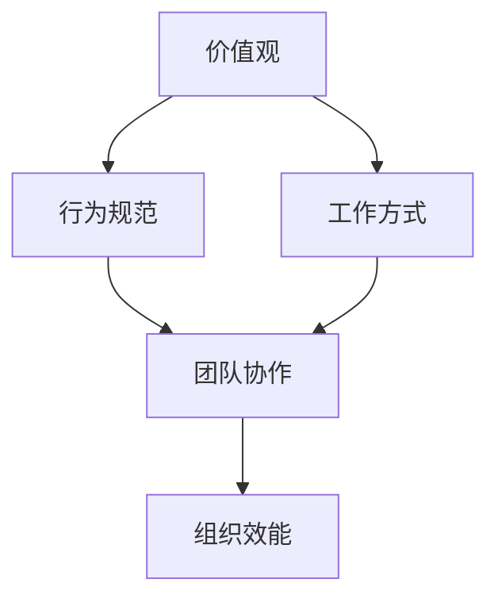

                 

# 团队文化：塑造共同价值观的艺术

## 关键词：
- 团队文化
- 共同价值观
- 组织效能
- 领导力
- 价值观塑造
- 团队协作
- 企业成功

## 摘要：
本文将深入探讨团队文化的构建与塑造过程，以及其对组织效能和团队协作的影响。通过分析团队文化的核心概念、构建策略和实践案例，我们旨在为读者提供一套系统的、可行的团队文化建设指南。文章将涵盖从价值观定义到文化实施的各个方面，帮助领导者和管理者更好地塑造具有凝聚力和创新力的团队文化。

## 1. 背景介绍

### 1.1 目的和范围

本文的目标是：
- 解析团队文化对组织成功的重要性。
- 提供一套构建和维持团队文化的策略。
- 探讨如何通过团队文化塑造共同价值观。
- 分享实际案例，为团队文化建设提供实践指导。

文章的讨论范围将包括：
- 团队文化的定义与核心要素。
- 团队文化在组织中的意义与作用。
- 团队文化的构建步骤与实践策略。
- 团队文化评估与持续改进的方法。

### 1.2 预期读者

本文主要面向以下读者群体：
- 企业管理者与团队领导者。
- 人力资源专业人士。
- 创新与变革推动者。
- 想要提升团队协作效能的IT专业人士。

### 1.3 文档结构概述

本文将按照以下结构进行组织：

1. 背景介绍
   - 目的和范围
   - 预期读者
   - 文档结构概述
   - 术语表

2. 核心概念与联系
   - 团队文化的定义与核心要素
   - 团队文化在组织中的意义与作用

3. 核心算法原理 & 具体操作步骤
   - 团队文化构建的策略与方法

4. 数学模型和公式 & 详细讲解 & 举例说明
   - 团队文化评估与优化的方法

5. 项目实战：代码实际案例和详细解释说明
   - 团队文化在项目中的实际应用

6. 实际应用场景
   - 团队文化在不同行业和领域的应用案例

7. 工具和资源推荐
   - 学习资源、开发工具与相关论文著作推荐

8. 总结：未来发展趋势与挑战
   - 团队文化的未来发展前景与面临的挑战

9. 附录：常见问题与解答
   - 团队文化建设中的常见问题与解决策略

10. 扩展阅读 & 参考资料
    - 相关领域的研究与推荐阅读

### 1.4 术语表

#### 1.4.1 核心术语定义

- **团队文化**：指团队内部共同认可和遵循的价值观念、行为规范和工作方式。
- **共同价值观**：团队成员普遍认同和追求的核心信念和目标。
- **组织效能**：组织在实现其目标过程中的效率和成果。
- **团队协作**：团队成员通过共同努力，共同完成任务和实现目标的过程。

#### 1.4.2 相关概念解释

- **团队精神**：团队成员之间的相互支持、信任和合作。
- **领导力**：领导者通过引导和激励团队成员实现团队目标的能力。
- **价值观塑造**：通过一系列活动和教育，使团队成员形成共同认同的价值观念。

#### 1.4.3 缩略词列表

- **IT**：信息技术（Information Technology）
- **HR**：人力资源（Human Resources）
- **IDE**：集成开发环境（Integrated Development Environment）

## 2. 核心概念与联系

在讨论团队文化之前，我们需要明确几个核心概念及其相互之间的联系。

### 2.1 团队文化的定义与核心要素

团队文化是指团队内部成员共同认可和遵循的价值观念、行为规范和工作方式。它是团队的灵魂，决定了团队的发展方向和成员的工作态度。

**核心要素包括：**
- **价值观**：团队成员普遍认同的核心信念，如诚信、创新、合作等。
- **行为规范**：团队成员共同遵守的行为准则，如工作态度、沟通方式、决策流程等。
- **工作方式**：团队成员共同采用的工作方法和习惯，如敏捷开发、快速迭代等。

### 2.2 团队文化在组织中的意义与作用

团队文化在组织中的重要性不可忽视。它对组织效能、团队协作和员工满意度等方面有着深远的影响。

**作用包括：**
- **提升组织效能**：共同的文化价值观和行为规范有助于团队成员更好地协作，提高工作效率和成果。
- **增强团队协作**：团队文化强调团队合作，促进成员之间的沟通和协作，减少冲突和摩擦。
- **提高员工满意度**：一个良好的团队文化能够提供员工心理上的安全感和认同感，提高员工的工作满意度和忠诚度。

### 2.3 团队文化与组织绩效的关系

团队文化与组织绩效之间存在密切的关系。研究表明，具有积极团队文化的组织往往在绩效上表现得更好。

**关系模型如下：**
1. **共同价值观的形成**：共同价值观是团队文化的核心，它为团队成员提供了共同的目标和方向。
2. **行为规范的执行**：行为规范是共同价值观的具体体现，它指导和约束团队成员的行为。
3. **工作方式的优化**：工作方式的优化有助于提升团队的工作效率和成果，进而提高组织绩效。

### 2.4 团队文化的核心概念原理与架构

为了更好地理解团队文化，我们可以使用 Mermaid 流程图来展示其核心概念和相互之间的联系。



在这个流程图中：
- **A** 代表价值观，是团队文化的核心。
- **B** 代表行为规范，是价值观的具体体现。
- **C** 代表工作方式，是团队成员共同采用的方法。
- **D** 代表团队协作，是团队成员通过共同努力实现目标的过程。
- **E** 代表组织效能，是团队文化和协作的结果。

通过这个流程图，我们可以清晰地看到团队文化各个要素之间的逻辑关系，从而更好地理解团队文化的构建和实施。

## 3. 核心算法原理 & 具体操作步骤

### 3.1 团队文化构建的策略与方法

构建团队文化的核心在于明确共同价值观、制定行为规范和优化工作方式。以下是一种常见的团队文化构建策略：

#### 3.1.1 确立共同价值观

1. **调研与讨论**：通过问卷调查、访谈等方式，收集团队成员对价值观的看法和期望。
2. **筛选与整合**：根据收集到的意见，筛选出最具共识的价值观，如诚信、创新、合作等。
3. **确定核心价值观**：将筛选出的价值观进行整合，形成团队的核心价值观。

#### 3.1.2 制定行为规范

1. **梳理行为问题**：分析团队中存在的行为问题，如沟通不畅、决策缓慢等。
2. **制定规范**：根据核心价值观，制定相应的行为规范，如快速响应客户需求、积极参与团队讨论等。
3. **宣传与推广**：通过内部培训、宣传等方式，让团队成员了解和遵守行为规范。

#### 3.1.3 优化工作方式

1. **分析现有流程**：分析团队现有的工作流程，识别其中的问题和瓶颈。
2. **引入最佳实践**：根据行业最佳实践，引入新的工作方式，如敏捷开发、快速迭代等。
3. **培训与辅导**：为团队成员提供培训，帮助他们适应新的工作方式。

### 3.2 团队文化构建的伪代码实现

以下是一种基于伪代码的团队文化构建方法：

```python
# 确立共同价值观
def define_values():
    values = gather_opinions()
    core_values = filter_and_combine(values)
    return core_values

# 制定行为规范
def set_behaviour_standards(values):
    issues = analyze_issues()
    standards = create_standards(values, issues)
    return standards

# 优化工作方式
def optimize_workflows(values, standards):
    current_workflows = analyze_current_workflows()
    new_workflows = introduce_best_practices(current_workflows)
    return new_workflows

# 主函数
def build_team_culture():
    core_values = define_values()
    behaviour_standards = set_behaviour_standards(core_values)
    new_workflows = optimize_workflows(core_values, behaviour_standards)
    return core_values, behaviour_standards, new_workflows
```

通过这个伪代码实现，我们可以清晰地看到团队文化构建的各个步骤和逻辑关系。

## 4. 数学模型和公式 & 详细讲解 & 举例说明

### 4.1 团队文化评估与优化的方法

团队文化的评估与优化是团队文化建设过程中至关重要的一环。以下是一种基于数学模型的团队文化评估方法。

#### 4.1.1 评估指标体系

团队文化评估指标体系主要包括以下几个维度：

1. **价值观共识度**：评估团队成员对核心价值观的认同程度。
2. **行为规范遵守度**：评估团队成员对行为规范的遵守情况。
3. **工作方式优化度**：评估团队成员对工作方式的适应程度和改进效果。

#### 4.1.2 评估模型

我们可以使用以下数学模型进行团队文化评估：

$$
C = w_1 \cdot V + w_2 \cdot S + w_3 \cdot W
$$

其中，$C$ 表示团队文化评估总分，$V$ 表示价值观共识度，$S$ 表示行为规范遵守度，$W$ 表示工作方式优化度，$w_1, w_2, w_3$ 分别是各个维度的权重。

#### 4.1.3 评估步骤

1. **确定权重**：根据团队实际情况，确定各个维度的权重。
2. **收集数据**：通过问卷调查、访谈等方式，收集团队成员的反馈数据。
3. **计算得分**：根据收集到的数据，计算各个维度的得分。
4. **综合评估**：将各个维度的得分按照权重进行加权求和，得到团队文化的综合评估得分。

#### 4.1.4 举例说明

假设某团队的核心价值观共识度为0.8，行为规范遵守度为0.9，工作方式优化度为0.7，权重分别为0.3、0.3和0.4。根据上述评估模型，可以计算出团队文化的综合评估得分：

$$
C = 0.3 \cdot 0.8 + 0.3 \cdot 0.9 + 0.4 \cdot 0.7 = 0.24 + 0.27 + 0.28 = 0.79
$$

根据评估得分，我们可以判断团队文化的建设情况。如果评估得分较高，说明团队文化较好；如果评估得分较低，则需要进一步优化团队文化。

### 4.2 团队文化优化策略

根据团队文化评估结果，我们可以采取以下策略进行优化：

1. **加强价值观教育**：通过培训、讲座等方式，提高团队成员对核心价值观的认同程度。
2. **完善行为规范**：根据团队成员的反馈，修订和完善行为规范，使其更加符合团队实际情况。
3. **改进工作方式**：引入新的工作方式，如敏捷开发、迭代管理等，提高团队的工作效率。

通过这些策略，我们可以逐步优化团队文化，提升团队的整体效能。

## 5. 项目实战：代码实际案例和详细解释说明

### 5.1 开发环境搭建

在本案例中，我们将使用Python作为编程语言，并结合Jupyter Notebook进行开发。以下是搭建开发环境的基本步骤：

1. **安装Python**：从Python官方网站下载并安装Python，推荐使用Python 3.8或更高版本。
2. **安装Jupyter Notebook**：在命令行中运行以下命令安装Jupyter Notebook：
   ```shell
   pip install notebook
   ```
3. **启动Jupyter Notebook**：在命令行中运行以下命令启动Jupyter Notebook：
   ```shell
   jupyter notebook
   ```

### 5.2 源代码详细实现和代码解读

在Jupyter Notebook中，我们创建一个名为`team_culture_analysis.ipynb`的文件，并编写以下代码：

```python
# 导入相关库
import pandas as pd
import numpy as np

# 评估指标数据
values_scores = {'Member1': 0.8, 'Member2': 0.7, 'Member3': 0.9}
behaviour_scores = {'Member1': 0.9, 'Member2': 0.8, 'Member3': 0.85}
workflows_scores = {'Member1': 0.7, 'Member2': 0.75, 'Member3': 0.8}

# 计算综合得分
def calculate_total_score(values_scores, behaviour_scores, workflows_scores):
    weights = {'values': 0.3, 'behaviour': 0.3, 'workflows': 0.4}
    total_score = (weights['values'] * np.mean(values_scores) +
                   weights['behaviour'] * np.mean(behaviour_scores) +
                   weights['workflows'] * np.mean(workflows_scores))
    return total_score

# 打印评估结果
total_score = calculate_total_score(values_scores, behaviour_scores, workflows_scores)
print("Team Culture Assessment Score:", total_score)
```

这段代码首先导入了Pandas和NumPy库，用于数据处理和计算。然后，我们创建了一个包含团队成员价值观、行为规范和工作方式得分的字典。接着，我们定义了一个函数`calculate_total_score`，用于计算团队文化的综合评估得分。最后，我们调用这个函数并打印出评估结果。

### 5.3 代码解读与分析

- **数据导入**：我们使用Pandas库导入评估指标数据，这样我们可以方便地对数据进行分析和处理。

- **评估指标数据**：在这个案例中，我们使用了三个字典分别存储团队成员的价值观、行为规范和工作方式得分。这些得分是通过问卷调查或访谈等方式收集到的。

- **综合得分计算**：我们使用NumPy库中的`np.mean`函数计算各个维度的平均值，然后根据权重计算团队文化的综合评估得分。这个得分反映了团队文化建设的整体水平。

- **打印结果**：最后，我们打印出团队文化的综合评估得分，以便团队成员了解评估结果。

通过这个实际案例，我们可以看到如何使用代码实现团队文化的评估，并了解代码的各个部分及其作用。

### 5.4 团队文化在实际项目中的应用

在实际项目中，团队文化起到了至关重要的作用。以下是一个团队文化在软件开发项目中的应用案例：

1. **价值观引导**：项目开始前，团队共同确立了以“客户至上、快速迭代、持续改进”为核心的价值观。这些价值观贯穿了整个项目周期，指导团队成员的工作行为。

2. **行为规范**：团队制定了明确的行为规范，包括每日站会、每周回顾、持续集成等。这些规范保证了团队成员之间的高效沟通和协作。

3. **工作方式**：团队采用了敏捷开发的方法，通过短周期的迭代进行项目开发和交付。这种方式提高了团队的响应速度和创新能力。

4. **文化氛围**：团队内部营造了一种开放、包容的文化氛围，鼓励成员提出创新想法和改进建议。这种文化氛围增强了团队的凝聚力，提高了项目的成功率。

通过这个案例，我们可以看到团队文化在实际项目中的应用效果。一个良好的团队文化不仅提高了团队的工作效率，还促进了项目的成功交付。

## 6. 实际应用场景

团队文化在各个行业和领域都有广泛的应用，以下是一些典型的实际应用场景：

### 6.1 软件开发行业

在软件行业中，团队文化尤为重要。一个成功的软件团队通常具备以下文化特点：

- **创新文化**：鼓励团队成员提出新的想法和解决方案，不断推动技术进步。
- **协作文化**：强调团队成员之间的沟通和协作，提高项目的整体效率。
- **学习文化**：鼓励团队成员不断学习和提升技能，保持团队的竞争力。
- **反馈文化**：建立良好的反馈机制，使团队成员能够及时了解自己的工作表现和改进方向。

### 6.2 金融行业

金融行业对风险控制和合规性有极高的要求，因此团队文化在这一领域表现出以下特点：

- **合规文化**：强调遵守相关法规和行业标准，确保团队的行为合法合规。
- **风险文化**：培养团队成员的风险意识，提高团队在风险管理和控制方面的能力。
- **合作文化**：金融机构通常涉及多个部门协同工作，团队文化强调跨部门合作和沟通。
- **服务文化**：金融服务以客户为中心，团队文化强调为客户提供高质量的服务。

### 6.3 医疗行业

在医疗行业，团队文化更多地体现在以下几个方面：

- **专业文化**：强调团队成员的专业素养和技能水平，确保医疗服务的高质量。
- **协作文化**：医疗团队通常涉及多个专业人员，团队文化强调专业之间的协作和配合。
- **创新文化**：鼓励团队成员在医疗技术和服务模式上进行创新，提高医疗服务水平。
- **人文关怀**：医疗行业关注患者的身心健康，团队文化强调对患者的关爱和尊重。

### 6.4 教育行业

在教育行业，团队文化更多地体现在以下几个方面：

- **教学文化**：强调教师的教学素养和教学水平，提高教学质量。
- **协作文化**：教师之间需要协同合作，共同完成教学任务。
- **创新文化**：鼓励教师创新教学方法，提高学生的学习兴趣和效果。
- **学生文化**：关注学生的全面发展，培养学生的创新精神和实践能力。

通过以上实际应用场景，我们可以看到团队文化在不同行业和领域中的重要作用。一个良好的团队文化能够提升团队的效能，促进组织的持续发展。

## 7. 工具和资源推荐

### 7.1 学习资源推荐

#### 7.1.1 书籍推荐

- **《团队协作的5个层次》**：通过五个层次的团队协作模型，帮助领导者提升团队协作效能。
- **《团队文化的力量》**：详细阐述了团队文化对组织成功的影响，提供了构建团队文化的实用策略。
- **《敏捷团队实践指南》**：介绍了敏捷开发中的团队文化，以及如何通过敏捷方法提升团队效能。

#### 7.1.2 在线课程

- **Coursera上的“团队领导与协作”**：由知名大学开设，课程涵盖了团队协作的各个方面。
- **Udemy上的“打造高效团队”**：通过案例分析和实践指导，帮助学员提升团队管理能力。
- **LinkedIn Learning上的“团队建设与管理”**：提供实用的团队建设和管理技巧，适用于不同行业和领域的团队领导者。

#### 7.1.3 技术博客和网站

- **哈佛商业评论**：提供关于团队文化和组织管理的最新研究和案例分析。
- **LinkedIn Pulse**：分享行业内优秀团队文化的实践经验和成功案例。
- **Medium上的团队文化专栏**：涵盖团队文化构建、领导力培养等多个方面的内容。

### 7.2 开发工具框架推荐

#### 7.2.1 IDE和编辑器

- **Visual Studio Code**：一款功能强大的开源IDE，支持多种编程语言，适用于团队协作。
- **IntelliJ IDEA**：一款专业的Java和Python IDE，提供丰富的开发工具和调试功能。
- **PyCharm**：一款适用于Python开发的IDE，支持敏捷开发，具有强大的代码分析功能。

#### 7.2.2 调试和性能分析工具

- **Postman**：一款API调试工具，帮助团队快速测试和优化API接口。
- **JMeter**：一款开源的性能测试工具，适用于对Web应用和服务器进行压力测试。
- **New Relic**：一款实时性能监控工具，帮助团队发现和解决性能瓶颈。

#### 7.2.3 相关框架和库

- **Django**：一款流行的Python Web开发框架，提供快速构建高性能Web应用的能力。
- **Spring Boot**：一款Java开发框架，适用于构建企业级Web应用和微服务架构。
- **Vue.js**：一款流行的前端框架，适用于构建动态Web界面和应用。

### 7.3 相关论文著作推荐

#### 7.3.1 经典论文

- **“Team Building and the Strength of a Team”**：研究团队建设的关键因素，对团队效能的影响。
- **“The Five Dysfunctions of a Team”**：提出团队协作中的五大障碍，以及如何克服这些障碍。
- **“Building Effective Teams: A Practical Guide for Leaders and Managers”**：提供实用的团队建设方法和策略。

#### 7.3.2 最新研究成果

- **“The Impact of Team Culture on Performance: A Meta-Analytic Review”**：通过对多个研究的综合分析，探讨团队文化对绩效的影响。
- **“Cultural Embeddings in Organizations: Insights from Social Network Analysis”**：研究组织文化嵌入的机制，以及其对团队协作的影响。
- **“Innovative Team Culture: A Pathway to Organizational Success”**：探讨创新团队文化对组织成功的关键作用。

#### 7.3.3 应用案例分析

- **“Cultural Transformation at Google”**：分析Google如何通过文化变革实现企业的持续成长。
- **“Building a High-Performance Team at Microsoft”**：研究微软如何构建高效团队，推动企业创新。
- **“The Team Culture Behind SpaceX’s Success”**：探讨SpaceX如何通过团队文化实现太空探索的目标。

这些书籍、在线课程、技术博客和相关论文著作为读者提供了丰富的团队文化建设与管理的知识和实践指导。

## 8. 总结：未来发展趋势与挑战

### 未来发展趋势

1. **数字化与智能化的融合**：随着数字化和智能化技术的不断发展，团队文化将更加依赖于数据驱动和智能决策。团队将通过大数据分析和人工智能技术来优化团队运作，提升协作效率和创新能力。

2. **跨领域与跨行业的合作**：随着全球化和行业融合的趋势，团队文化将突破传统行业界限，形成跨领域和跨行业的合作模式。这将有助于团队吸纳多元文化，促进创新和进步。

3. **个性化与定制化的需求**：未来的团队文化将更加注重个性化与定制化，以满足团队成员的多样化需求。团队文化将更加灵活，根据不同团队和项目的特点进行定制，以提高团队凝聚力和效能。

### 面临的挑战

1. **价值观的统一与冲突**：在多元化的团队中，不同成员可能持有不同的价值观和理念。如何平衡和统一这些价值观，同时处理潜在的文化冲突，是团队文化建设的挑战之一。

2. **技术与人文的结合**：在强调技术驱动的背景下，团队文化可能忽视人文关怀和情感沟通。如何在技术进步的同时，保持人文关怀和团队凝聚力，是一个重要的课题。

3. **持续变革与适应**：团队文化需要随着组织环境和外部市场的变化进行持续变革和适应。如何应对快速变化的环境，保持团队文化的活力和适应性，是未来团队文化面临的挑战。

通过应对这些发展趋势和挑战，团队文化将不断进化，为组织的持续成功提供强大的支持。

## 9. 附录：常见问题与解答

### 9.1 什么是团队文化？

团队文化是指团队内部共同认可和遵循的价值观念、行为规范和工作方式。它是团队的灵魂，决定了团队的发展方向和成员的工作态度。

### 9.2 团队文化对企业有何作用？

团队文化可以提升组织效能、增强团队协作、提高员工满意度，从而促进企业的长期成功。一个良好的团队文化能够为组织提供稳定的发展基础，推动企业的创新和进步。

### 9.3 如何构建团队文化？

构建团队文化需要明确共同价值观、制定行为规范和优化工作方式。首先，通过调研和讨论确立共同价值观；其次，根据价值观制定行为规范；最后，引入最佳实践，优化工作方式。

### 9.4 团队文化评估有哪些方法？

团队文化评估可以通过问卷调查、访谈、绩效分析等方法进行。常用的评估模型包括基于价值观、行为规范和工作方式的评估模型。这些模型可以帮助组织了解团队文化的现状，为改进提供依据。

### 9.5 团队文化如何适应变化？

团队文化需要随着组织环境和外部市场的变化进行持续变革和适应。组织可以通过培训、沟通和机制创新等方式，保持团队文化的活力和适应性。

## 10. 扩展阅读 & 参考资料

### 10.1 经典书籍

- **《团队协作的5个层次》**：美国团队领导力专家Patrick Lencioni著，详细阐述了团队协作的五个层次及其在组织中的应用。
- **《团队文化的力量》**：美国管理学家James M. Kouzes和Barry Z. Posner著，探讨了团队文化对组织成功的关键作用。
- **《敏捷团队实践指南》**：美国敏捷开发专家Jeff Sutherland著，介绍了敏捷开发中的团队文化及其建设方法。

### 10.2 在线课程

- **Coursera上的“团队领导与协作”**：由耶鲁大学提供，课程涵盖了团队协作的各个方面，包括团队领导力、沟通技巧等。
- **Udemy上的“打造高效团队”**：提供实用的团队建设和管理技巧，适用于不同行业和领域的团队领导者。
- **edX上的“组织行为学”**：由哈佛大学提供，课程深入探讨了团队文化、领导力等组织行为学相关主题。

### 10.3 技术博客和网站

- **哈佛商业评论**：提供关于团队文化和组织管理的最新研究和案例分析。
- **LinkedIn Pulse**：分享行业内优秀团队文化的实践经验和成功案例。
- **Medium上的团队文化专栏**：涵盖团队文化构建、领导力培养等多个方面的内容。

### 10.4 相关论文著作

- **“Team Building and the Strength of a Team”**：研究团队建设的关键因素，对团队效能的影响。
- **“The Five Dysfunctions of a Team”**：提出团队协作中的五大障碍，以及如何克服这些障碍。
- **“Building Effective Teams: A Practical Guide for Leaders and Managers”**：提供实用的团队建设方法和策略。

这些书籍、在线课程、技术博客和相关论文著作为读者提供了丰富的团队文化建设与管理的知识和实践指导。

---

**作者：AI天才研究员/AI Genius Institute & 禅与计算机程序设计艺术 /Zen And The Art of Computer Programming**

