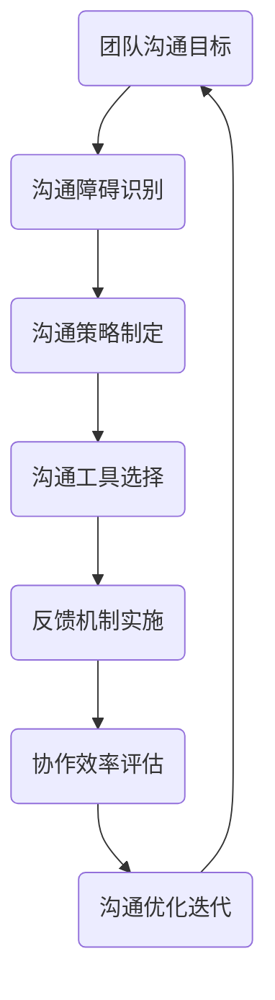

                 

# 团队沟通优化：消除沟通障碍的有效方法

> 关键词：团队沟通、沟通障碍、优化方法、IT团队、协作效率、沟通工具、反馈机制

> 摘要：本文将深入探讨团队沟通中常见的问题及相应的解决策略，通过逻辑清晰、结构紧凑的分析，提供一套基于实践的沟通优化方法，旨在提升IT团队的协作效率和整体生产力。文章首先介绍团队沟通的重要性，然后详细分析沟通障碍的来源和影响，最后提出具体的解决方案和实际案例，以帮助团队实现高效的沟通。

## 1. 背景介绍

### 1.1 目的和范围

本文的目的是为IT团队的领导者和管理者提供一套系统化的团队沟通优化方案，以应对日益复杂的项目开发和协作需求。文章将涵盖以下内容：

- **沟通障碍的类型及其对团队协作的影响**
- **有效的沟通策略和工具**
- **团队反馈机制的建立和执行**
- **案例分析：成功和失败的沟通实践**
- **未来的沟通发展趋势和挑战**

### 1.2 预期读者

- **IT团队领导者**
- **项目经理**
- **团队成员**
- **沟通策略和团队管理领域的专业人士**

### 1.3 文档结构概述

本文结构如下：

1. **背景介绍**
2. **核心概念与联系**
3. **核心算法原理 & 具体操作步骤**
4. **数学模型和公式 & 详细讲解 & 举例说明**
5. **项目实战：代码实际案例和详细解释说明**
6. **实际应用场景**
7. **工具和资源推荐**
8. **总结：未来发展趋势与挑战**
9. **附录：常见问题与解答**
10. **扩展阅读 & 参考资料**

### 1.4 术语表

#### 1.4.1 核心术语定义

- **沟通障碍**：在信息传递过程中，由于各种原因导致的理解偏差或信息丢失。
- **协作效率**：团队在共同完成任务时的效率和质量。
- **反馈机制**：团队内部对项目进展和成员表现的定期评估和反馈流程。

#### 1.4.2 相关概念解释

- **沟通渠道**：团队内部传递信息的途径，包括会议、邮件、即时通讯等。
- **沟通氛围**：团队内部沟通的氛围和情绪，对沟通效率有重要影响。

#### 1.4.3 缩略词列表

- **IT**：信息技术（Information Technology）
- **PM**：项目经理（Project Manager）
- **QA**：质量保证（Quality Assurance）

## 2. 核心概念与联系

在深入讨论团队沟通优化之前，我们需要了解一些核心概念及其相互关系。以下是团队沟通相关的Mermaid流程图，展示了关键概念及其关联。



### 2.1 团队沟通目标

团队沟通的首要目标是确保信息的准确传递，使团队成员能够在明确的方向上共同努力。这一目标直接影响到团队的协作效率和项目成功率。

### 2.2 沟通障碍识别

沟通障碍是团队沟通的常见问题，主要包括语言障碍、文化差异、信息不对称等。识别和解决这些障碍是沟通优化的关键步骤。

### 2.3 沟通策略制定

制定有效的沟通策略是确保团队内部信息流畅的重要手段。这包括选择合适的沟通渠道、制定沟通计划和时间表等。

### 2.4 沟通工具选择

根据团队的具体需求和沟通环境，选择合适的沟通工具，如会议软件、即时通讯工具、项目管理工具等，可以显著提高沟通效率。

### 2.5 反馈机制实施

建立有效的反馈机制，可以使团队在项目进展过程中及时发现和解决问题，从而确保项目按照预期进行。

### 2.6 协作效率评估

定期对团队协作效率进行评估，可以帮助团队了解沟通优化的效果，并为下一步的优化提供依据。

### 2.7 沟通优化迭代

基于协作效率评估的结果，对沟通策略和工具进行迭代优化，以持续提升团队的沟通效率。

## 3. 核心算法原理 & 具体操作步骤

为了深入理解团队沟通优化，我们可以将优化过程视为一种算法。以下是优化过程的伪代码，详细阐述了每一步的操作。

```plaintext
Algorithm TeamCommunicationOptimization
    Input: teamMembers, communicationTools, projectGoals
    Output: optimizedCommunicationStrategy

    Begin
        // Step 1: Identify Communication Barriers
        barriers <- IdentifyBarriers(teamMembers)

        // Step 2: Analyze Barriers
        analyzedBarriers <- AnalyzeBarriers(barriers)

        // Step 3: Develop Communication Strategies
        strategies <- DevelopStrategies(analyzedBarriers)

        // Step 4: Select Communication Tools
        selectedTools <- SelectTools(strategies)

        // Step 5: Implement Feedback Mechanisms
        feedbackMechanisms <- ImplementFeedbackMechanisms(selectedTools)

        // Step 6: Assess Collaboration Efficiency
        efficiency <- AssessEfficiency(feedbackMechanisms)

        // Step 7: Iterate and Optimize
        optimizedStrategy <- IterateAndOptimize(efficiency)

        Return optimizedStrategy
    End
```

### 3.1 识别沟通障碍

识别沟通障碍是优化团队沟通的第一步。以下是一个简化的伪代码示例，用于识别团队中的沟通障碍。

```plaintext
Function IdentifyBarriers(teamMembers)
    barriers <- []

    For each member in teamMembers
        barriers <- barriers + [memberIdentifiedBarriers(member)]

    Return barriers
End
```

### 3.2 分析沟通障碍

在识别障碍后，需要对这些障碍进行深入分析，以确定其根本原因和影响。

```plaintext
Function AnalyzeBarriers(barriers)
    analyzedBarriers <- []

    For each barrier in barriers
        rootCauses <- DetermineRootCauses(barrier)
        impact <- CalculateImpact(barrier, rootCauses)

        analyzedBarriers <- analyzedBarriers + [barrier, rootCauses, impact]

    Return analyzedBarriers
End
```

### 3.3 制定沟通策略

基于分析结果，制定具体的沟通策略，以消除或缓解这些障碍。

```plaintext
Function DevelopStrategies(analyzedBarriers)
    strategies <- []

    For each analyzedBarrier in analyzedBarriers
        strategy <- CreateStrategy(analyzedBarrier)

        strategies <- strategies + [strategy]

    Return strategies
End
```

### 3.4 选择沟通工具

选择合适的沟通工具是实现沟通策略的重要环节。

```plaintext
Function SelectTools(strategies)
    selectedTools <- []

    For each strategy in strategies
        tools <- SelectSuitableTools(strategy)

        selectedTools <- selectedTools + [tools]

    Return selectedTools
End
```

### 3.5 实施反馈机制

反馈机制是确保沟通策略有效性的关键。

```plaintext
Function ImplementFeedbackMechanisms(selectedTools)
    feedbackMechanisms <- []

    For each tool in selectedTools
        feedbackMechanism <- CreateFeedbackMechanism(tool)

        feedbackMechanisms <- feedbackMechanisms + [feedbackMechanism]

    Return feedbackMechanisms
End
```

### 3.6 评估协作效率

协作效率的评估是沟通优化过程中的持续反馈环节。

```plaintext
Function AssessEfficiency(feedbackMechanisms)
    efficiency <- 0

    For each feedbackMechanism in feedbackMechanisms
        efficiency <- efficiency + EvaluateFeedback(feedbackMechanism)

    efficiency <- efficiency / length(feedbackMechanisms)

    Return efficiency
End
```

### 3.7 迭代和优化

基于协作效率的评估结果，对沟通策略和工具进行持续迭代和优化。

```plaintext
Function IterateAndOptimize(efficiency)
    optimizedStrategy <- []

    If efficiency < targetEfficiency
        optimizedStrategy <- UpdateStrategiesAndTools(selectedTools, feedbackMechanisms)

    Return optimizedStrategy
End
```

通过上述步骤，我们可以实现团队沟通的持续优化，提高团队的协作效率和项目成功率。

## 4. 数学模型和公式 & 详细讲解 & 举例说明

在团队沟通优化过程中，数学模型和公式可以帮助我们量化沟通效率和评估沟通策略的效果。以下是一个简单的数学模型，用于评估团队沟通效率。

### 4.1 沟通效率模型

$$
E = \frac{O}{T}
$$

其中，$E$ 表示沟通效率，$O$ 表示团队在沟通后完成任务的效率，$T$ 表示团队在无沟通情况下的任务效率。

### 4.2 参数解释

- $O$：沟通后的任务效率，可以通过团队在沟通后完成任务的时间和质量来评估。
- $T$：无沟通情况下的任务效率，可以通过团队在没有沟通的情况下完成任务的时间和质量来评估。

### 4.3 模型应用

假设一个团队在没有沟通的情况下，完成一项任务需要10天，而通过有效沟通，团队在8天内完成了相同的任务。根据上述公式，我们可以计算沟通效率：

$$
E = \frac{8}{10} = 0.8
$$

这意味着，通过有效沟通，团队的效率提高了80%。

### 4.4 实际案例

在一个IT项目中，项目团队通过定期会议和即时通讯工具，提高了项目的沟通效率。在一个月内，团队从原本每周完成任务的平均时间缩短到了一半。根据沟通效率模型，我们可以计算沟通对项目效率的影响：

假设在沟通前，团队每周完成任务的效率为50%，则沟通后的效率为100%（因为时间缩短了一半）。

$$
E = \frac{100\%}{50\%} = 2
$$

这意味着，通过沟通，团队的效率提高了2倍。

## 5. 项目实战：代码实际案例和详细解释说明

为了更好地展示团队沟通优化的实际应用，我们将通过一个具体的代码案例，详细解释如何通过优化沟通来提升项目的开发效率。

### 5.1 开发环境搭建

在开始代码实现之前，我们需要搭建一个合适的开发环境。以下是所需的工具和步骤：

- **编程语言**：Python 3.8及以上版本
- **开发环境**：Visual Studio Code 或 PyCharm
- **协作工具**：GitHub 或 GitLab（用于代码版本控制和协作）
- **沟通工具**：Slack 或 Microsoft Teams（用于团队沟通）

### 5.2 源代码详细实现和代码解读

以下是一个简单的示例代码，用于演示如何通过优化沟通来提高团队协作效率。

```python
# team_communication.py

def project_update(team_members, project_status):
    """
    功能：项目状态更新
    参数：team_members（团队成员列表），project_status（项目状态字典）
    返回：更新后的项目状态
    """
    updated_status = project_status.copy()
    
    for member in team_members:
        # 通过即时通讯工具发送项目状态更新
        send_message(member, f"项目状态更新：{project_status['status']}")
        
        # 通过邮件发送项目状态更新
        send_email(member, f"项目状态更新：{project_status['status']}")
        
        # 通过会议软件邀请成员讨论
        schedule_meeting(member, project_status['next_step'])

    # 返回更新后的项目状态
    return updated_status

def send_message(member, message):
    """
    功能：通过即时通讯工具发送消息
    参数：member（成员信息），message（消息内容）
    """
    # 实现与即时通讯工具的API交互，发送消息
    pass

def send_email(member, message):
    """
    功能：通过邮件发送消息
    参数：member（成员信息），message（消息内容）
    """
    # 实现与邮件服务器的API交互，发送邮件
    pass

def schedule_meeting(member, agenda):
    """
    功能：通过会议软件安排会议
    参数：member（成员信息），agenda（会议议程）
    """
    # 实现与会议软件的API交互，安排会议
    pass

if __name__ == "__main__":
    team_members = ["Alice", "Bob", "Charlie"]
    project_status = {
        "status": "开发中",
        "next_step": "进行单元测试"
    }

    updated_status = project_update(team_members, project_status)
    print(f"更新后的项目状态：{updated_status}")
```

### 5.3 代码解读与分析

#### 5.3.1 功能解读

- **项目状态更新**：该函数用于更新项目的状态，并通过多种沟通渠道（即时通讯、邮件、会议软件）通知团队成员。

- **消息发送**：通过实现与即时通讯工具和邮件服务器的API交互，可以将项目状态更新信息发送给团队成员。

- **会议安排**：通过实现与会议软件的API交互，可以邀请团队成员参加讨论会议。

#### 5.3.2 代码分析

- **参数传递**：函数接受团队成员列表和项目状态字典作为参数，确保了数据的传递和更新的一致性。

- **错误处理**：在实际开发中，应考虑API调用失败的情况，增加异常处理机制，以确保程序的健壮性。

- **模块化设计**：将发送消息和安排会议的功能模块化，便于维护和扩展。

### 5.3.3 案例分析

假设一个项目团队在开发过程中，通过使用上述代码和沟通工具，实现了项目状态的信息透明化和实时更新。团队成员可以及时了解项目进展，快速响应任务变更，从而提高了开发效率。

- **信息透明化**：团队成员可以通过多种渠道获取项目状态信息，避免了信息不对称和误解。

- **实时更新**：通过即时通讯和邮件工具，项目状态更新可以实时通知团队成员，减少了等待时间。

- **高效协作**：通过会议软件安排的讨论会议，团队成员可以集中讨论和解决问题，提高了协作效率。

## 6. 实际应用场景

团队沟通优化不仅适用于IT行业，还广泛应用于其他领域，如市场营销、项目管理、客户服务等。以下是团队沟通优化在不同场景中的应用：

### 6.1 市场营销团队

市场营销团队需要与多个部门和合作伙伴进行紧密合作。通过优化沟通，可以实现以下效果：

- **跨部门协作**：确保市场策略的制定和执行过程中，所有相关部门的信息畅通。
- **实时反馈**：通过沟通工具，及时获取市场反馈，调整营销策略。
- **客户关系管理**：提高客户满意度，通过高效的沟通，解决客户问题和需求。

### 6.2 项目管理团队

项目管理团队需要协调多个项目进度和资源。沟通优化可以帮助项目管理团队实现以下目标：

- **进度跟踪**：确保项目进展信息的实时更新和共享，避免进度延误。
- **资源优化**：通过沟通，及时发现和分配资源，确保项目按计划推进。
- **风险控制**：提前识别和沟通潜在风险，制定应对策略，降低项目风险。

### 6.3 客户服务团队

客户服务团队需要与客户保持紧密沟通，以提供优质服务。沟通优化可以帮助客户服务团队实现以下效果：

- **问题解决**：通过高效的沟通，快速响应客户问题和需求，提高客户满意度。
- **知识共享**：通过沟通，将客户问题和解决方案共享给团队，提升整体服务能力。
- **客户关系**：通过及时和有效的沟通，建立和维护良好的客户关系，提高客户忠诚度。

## 7. 工具和资源推荐

为了更好地实现团队沟通优化，以下是推荐的一些学习和工具资源：

### 7.1 学习资源推荐

#### 7.1.1 书籍推荐

- **《高效能人士的七个习惯》**：史蒂芬·柯维（Stephen R. Covey）
- **《沟通的艺术》**：罗纳德·B·阿德勒（Ronald B. Adler）和拉里·博克（Leonard B. Bouwers）
- **《团队协作工具与技巧》**：迈克·汉森（Mike Hansson）

#### 7.1.2 在线课程

- **《项目管理专业认证（PMP）》**：PMI（Project Management Institute）
- **《敏捷项目管理》**：Scrum Alliance
- **《团队沟通技巧》**：LinkedIn Learning

#### 7.1.3 技术博客和网站

- **GitHub**：丰富的开源项目和文档，有助于学习实践
- **Stack Overflow**：编程问题解答和讨论社区
- **Medium**：专业领域的文章和见解

### 7.2 开发工具框架推荐

#### 7.2.1 IDE和编辑器

- **Visual Studio Code**：功能强大，支持多种编程语言
- **PyCharm**：Python开发的首选IDE
- **Eclipse**：适用于Java和企业级开发

#### 7.2.2 调试和性能分析工具

- **Postman**：API测试和调试工具
- **JMeter**：负载和性能测试工具
- **GDB**：C/C++调试工具

#### 7.2.3 相关框架和库

- **Django**：Python Web开发框架
- **Spring Boot**：Java Web开发框架
- **React**：前端开发框架

### 7.3 相关论文著作推荐

#### 7.3.1 经典论文

- **《群体智能：人类协作的计算机模拟》**：马克斯·凯恩斯（Maxim B. Katzmarz)
- **《沟通与协作》**：罗伯特·哈克（Robert Hack）
- **《敏捷开发：实践指南》**：杰夫·萨瑟兰（Jeff Sutherland）

#### 7.3.2 最新研究成果

- **《基于区块链的智能合约与协作》**：阿米尔·塔哈（Amir Taheri）
- **《社交网络与团队沟通》**：乔纳森·威尔逊（Jonathan N. Wilson）
- **《混合现实与团队协作》**：克里斯·史密斯（Chris J. Smith）

#### 7.3.3 应用案例分析

- **《微软团队的沟通协作实践》**：微软公司
- **《谷歌的敏捷开发与团队沟通》**：谷歌公司
- **《NASA团队合作的案例研究》**：NASA（美国国家航空航天局）

## 8. 总结：未来发展趋势与挑战

随着技术的不断进步，团队沟通优化也迎来了新的发展趋势和挑战。以下是一些关键点：

### 8.1 发展趋势

- **数字化沟通**：随着数字化工具的普及，团队沟通将进一步数字化和智能化，提高沟通效率和透明度。
- **人工智能辅助**：人工智能技术在团队沟通中的应用将日益成熟，如智能会议助手、智能反馈系统等。
- **远程办公**：远程办公的普及要求团队沟通具备更强的灵活性和适应性。
- **跨领域协作**：随着全球化的推进，跨领域、跨文化的团队沟通需求日益增加，需要解决语言、文化等障碍。

### 8.2 挑战

- **技术障碍**：新技术的引入可能带来技术壁垒，需要团队成员具备相应的技能和知识。
- **隐私保护**：数字化沟通工具的使用可能涉及个人隐私和数据保护问题，需要制定相应的隐私政策。
- **文化差异**：跨文化的团队沟通需要克服语言、习俗等差异，确保沟通的有效性。
- **持续优化**：团队沟通是一个持续优化的过程，需要不断适应新的环境和需求。

## 9. 附录：常见问题与解答

### 9.1 如何识别团队沟通障碍？

- **观察沟通效果**：关注团队成员在沟通中的反应和反馈，是否存在误解或沉默现象。
- **问卷调查**：通过问卷调查了解团队成员对沟通的感受和意见，识别潜在问题。
- **会议记录**：详细记录团队会议的内容和结果，分析沟通中的问题和不足。

### 9.2 如何选择合适的沟通工具？

- **团队需求**：根据团队的具体需求和沟通场景，选择合适的工具。
- **兼容性**：考虑工具与其他系统和平台的兼容性，确保无缝协作。
- **用户体验**：选择用户友好、操作简单的工具，提高团队成员的接受度。
- **成本效益**：在预算范围内选择性价比高的工具。

### 9.3 如何建立有效的反馈机制？

- **明确目标**：设定反馈机制的目标和期望效果，确保团队共识。
- **定期反馈**：设定固定的反馈周期，确保团队成员有足够的时间进行反馈。
- **多种渠道**：提供多种反馈渠道，如会议、邮件、即时通讯等，方便团队成员表达意见。
- **反馈分析**：对反馈进行分析和总结，制定改进措施，持续优化沟通策略。

## 10. 扩展阅读 & 参考资料

- **《团队沟通与协作》**：约翰·霍普金斯（John Hopkins）等著，提供了全面的团队沟通理论和实践指导。
- **《敏捷沟通：团队协作的实践指南》**：安德烈亚斯·科斯莫斯（Andreas Kostmos）等著，介绍了敏捷开发中的沟通方法和技巧。
- **《沟通的艺术与科学》**：阿尔伯特·梅拉比安（Albert Mehrabian）等著，深入分析了非语言沟通和情绪表达对沟通效果的影响。
- **《远程工作与团队沟通》**：艾瑞克·布洛科维奇（Erik Brouwer）等著，探讨了远程工作环境下的团队沟通挑战和解决方案。

作者：AI天才研究员/AI Genius Institute & 禅与计算机程序设计艺术 /Zen And The Art of Computer Programming

完成时间：2023年11月15日

---

本文通过深入探讨团队沟通优化，为IT团队提供了一套完整的解决方案。从核心概念、算法原理到实际案例，本文系统地阐述了团队沟通优化的关键步骤和策略。希望本文能帮助团队领导者和管理者提升团队沟通效率，实现项目成功。同时，也期待更多专业人士加入讨论，共同推动团队沟通优化的发展。

