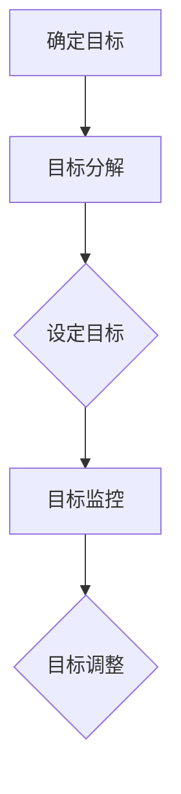

                 

# 团队目标设定：从模糊到明确

> **关键词**：团队目标、明确性、目标设定、团队协作、目标管理、执行力
>
> **摘要**：本文旨在探讨如何将团队的目标从模糊状态转变为明确状态。通过深入分析目标设定的原理、步骤和方法，结合实际案例，我们为读者提供了一套系统化的目标设定指南，帮助团队更好地协作，提高执行力。

## 1. 背景介绍

### 1.1 目的和范围

本文的目标是帮助团队领导者和管理者了解如何设定明确的目标，以便提高团队的协作效率和执行力。我们将从以下几个角度进行探讨：

- **目标设定的原理和核心概念**：理解目标设定的理论基础，以及目标对团队的重要性。
- **目标设定的步骤和方法**：详细阐述从模糊目标到明确目标的转化过程。
- **实际案例分享**：通过真实案例展示目标设定的应用效果。
- **工具和资源推荐**：为团队提供实用的工具和资源，以支持目标设定和实现。

### 1.2 预期读者

本文适合以下读者群体：

- 团队领导者和管理者
- 项目经理
- 技术团队负责人
- 想要提高团队协作效率的企业家和创业者

### 1.3 文档结构概述

本文分为以下几个部分：

- 引言：介绍团队目标设定的背景和重要性。
- 核心概念与联系：阐述目标设定的原理和核心概念。
- 核心算法原理与具体操作步骤：讲解目标设定的具体方法和步骤。
- 数学模型和公式：介绍与目标设定相关的数学模型和公式。
- 项目实战：通过实际案例展示目标设定的应用。
- 实际应用场景：探讨目标设定的实际应用场景。
- 工具和资源推荐：为团队提供实用的工具和资源。
- 总结：总结目标设定的未来发展趋势与挑战。
- 附录：常见问题与解答。
- 扩展阅读：推荐相关书籍、在线课程和论文。

### 1.4 术语表

#### 1.4.1 核心术语定义

- **目标（Goal）**：指团队或个人在一定时间内希望达到的具体状态或结果。
- **目标设定（Goal Setting）**：指确定目标的过程，包括目标的设定、分解和实现。
- **SMART原则**：指目标设定的四个标准，即具体（Specific）、可测量（Measurable）、可实现（Achievable）、相关（Relevant）和有时限（Time-bound）。
- **执行力（Execution）**：指团队实现目标的能力。

#### 1.4.2 相关概念解释

- **明确性（Clarity）**：指目标表述的清晰程度，明确的目标有助于提高团队的协作效率和执行力。
- **目标分解（Goal Decomposition）**：指将一个大的目标分解为多个小的、可执行的任务。
- **反馈机制（Feedback Mechanism）**：指对团队目标实现过程中的进展进行监控和评估，以便及时调整和优化。

#### 1.4.3 缩略词列表

- **SMART**：具体（Specific）、可测量（Measurable）、可实现（Achievable）、相关（Relevant）和有时限（Time-bound）
- **MBO**：目标管理（Management by Objectives）
- **KPI**：关键绩效指标（Key Performance Indicators）

## 2. 核心概念与联系

为了更好地理解团队目标设定的原理和过程，我们需要了解以下几个核心概念：

### 2.1 目标设定的原理

目标设定的原理主要基于以下两点：

1. **目标导向理论（Goal-Oriented Theory）**：认为目标设定是激发团队行为和动机的关键因素。明确的目标有助于引导团队的努力方向，提高工作效率。
2. **期望理论（Expectancy Theory）**：认为团队成员的行为和动机取决于对目标实现的可能性和结果的价值评估。明确的目标有助于提高团队对实现目标的期望，从而激发更高的工作积极性。

### 2.2 目标设定的核心概念

1. **目标（Goal）**：团队目标是指团队在一定时间内希望达到的具体状态或结果。目标应具有明确性、挑战性和可行性。
2. **目标层次（Goal Hierarchy）**：团队目标可以分为多个层次，包括组织目标、部门目标和个人目标。目标层次有助于明确团队的努力方向和资源配置。
3. **目标分解（Goal Decomposition）**：将一个大的目标分解为多个小的、可执行的任务。目标分解有助于提高团队的目标实现效率。

### 2.3 目标设定的流程

目标设定的流程主要包括以下几个步骤：

1. **确定目标（Establishing Goals）**：明确团队的目标和愿景，确保目标具有明确性、挑战性和可行性。
2. **目标分解（Decomposing Goals）**：将大目标分解为小的、可执行的任务，确保每个团队成员都清楚自己的职责和任务。
3. **目标设定（Setting Goals）**：根据目标的具体性、可测量性、可实现性、相关性和有时限性，对目标进行设定。
4. **目标监控（Monitoring Goals）**：对目标实现过程进行监控和评估，及时发现问题和调整目标。

### 2.4 目标设定的方法

1. **SMART原则**：具体（Specific）、可测量（Measurable）、可实现（Achievable）、相关（Relevant）和有时限（Time-bound）。
2. **目标管理（Management by Objectives, MBO）**：通过目标设定、目标分解和目标监控，实现团队目标的系统化管理。
3. **关键绩效指标（Key Performance Indicators, KPI）**：用于衡量团队目标实现程度的关键指标。

### 2.5 目标设定的工具

1. **目标矩阵（Goal Matrix）**：用于确定团队目标的优先级和资源配置。
2. **甘特图（Gantt Chart）**：用于展示目标实现的时间进度和任务分配。
3. **平衡计分卡（Balanced Scorecard）**：用于衡量团队目标的实现情况。

### 2.6 目标设定的Mermaid流程图



## 3. 核心算法原理 & 具体操作步骤

### 3.1 目标设定的核心算法原理

目标设定的核心算法原理主要基于SMART原则，即将目标设定为具体、可测量、可实现、相关和有时限的。以下是具体的算法原理：

1. **具体（Specific）**：目标应明确、具体、具有可操作性。例如，将“提高产品性能”改为“将产品性能提高至X分贝”。
2. **可测量（Measurable）**：目标应具有明确的衡量标准，以便对目标的实现程度进行评估。例如，将“提高团队工作效率”改为“将团队工作效率提高至每小时完成Y个任务”。
3. **可实现（Achievable）**：目标应具有可行性，确保团队在资源和时间限制内能够实现。例如，将“实现全球市场拓展”改为“在年底前完成国内市场拓展”。
4. **相关（Relevant）**：目标应与团队的整体战略和目标保持一致，有助于实现团队的核心价值。例如，将“开发新功能”改为“开发与客户需求相关的功能”。
5. **有时限（Time-bound）**：目标应设定明确的时间节点，有助于团队对目标的实现过程进行监控和调整。例如，将“在未来几个月内完成项目”改为“在2023年6月30日前完成项目”。

### 3.2 目标设定的具体操作步骤

以下是目标设定的具体操作步骤：

1. **确定目标**：与团队成员沟通，明确团队的目标和愿景。确保目标具有明确性、挑战性和可行性。
2. **目标分解**：将大目标分解为小的、可执行的任务。确保每个任务都具有明确的负责人和完成时间。
3. **设定目标**：根据SMART原则，对每个任务进行具体、可测量、可实现、相关和有时限的设定。可以使用目标矩阵和甘特图等工具进行可视化展示。
4. **目标监控**：对目标实现过程进行监控和评估。可以使用关键绩效指标（KPI）和反馈机制对目标的实现程度进行衡量。
5. **目标调整**：根据目标实现过程中的反馈和评估结果，对目标进行调整和优化。确保目标始终保持与团队的整体战略和目标一致。

### 3.3 目标设定的伪代码

```python
def set_goals(team_goals):
    # 步骤1：确定目标
    for goal in team_goals:
        print("确定目标：", goal)
        
    # 步骤2：目标分解
    for goal in team_goals:
        sub_goals = decompose_goals(goal)
        print("目标分解：", sub_goals)
        
    # 步骤3：设定目标
    for goal in team_goals:
        specific_goal, measurable_goal, achievable_goal, relevant_goal, time_bound_goal = set_smart_goals(goal)
        print("设定目标：", specific_goal, measurable_goal, achievable_goal, relevant_goal, time_bound_goal)
        
    # 步骤4：目标监控
    monitor_goals(team_goals)
    
    # 步骤5：目标调整
    adjust_goals(team_goals)

def decompose_goals(goal):
    # 实现目标分解的逻辑
    pass

def set_smart_goals(goal):
    # 实现SMART原则设定的逻辑
    pass

def monitor_goals(team_goals):
    # 实现目标监控的逻辑
    pass

def adjust_goals(team_goals):
    # 实现目标调整的逻辑
    pass
```

## 4. 数学模型和公式 & 详细讲解 & 举例说明

在目标设定的过程中，数学模型和公式可以用于衡量目标的实现程度和团队的工作效率。以下是几个常用的数学模型和公式：

### 4.1 关键绩效指标（KPI）

关键绩效指标（KPI）是衡量团队目标实现程度的重要工具。以下是一个简单的KPI计算公式：

$$ KPI = \frac{实际完成量}{目标设定量} \times 100\% $$

举例说明：

假设团队的目标是在一个月内完成100个任务，实际完成量为120个任务，则KPI为：

$$ KPI = \frac{120}{100} \times 100\% = 120\% $$

这意味着团队在目标实现方面超出了预期。

### 4.2 目标实现率

目标实现率是衡量目标实现程度的一个指标。以下是一个简单的目标实现率计算公式：

$$ 目标实现率 = \frac{实现目标数}{总目标数} \times 100\% $$

举例说明：

假设团队设定了5个目标，实际实现了3个目标，则目标实现率为：

$$ 目标实现率 = \frac{3}{5} \times 100\% = 60\% $$

这意味着团队在目标实现方面还有待提高。

### 4.3 工作效率

工作效率是衡量团队工作效率的一个指标。以下是一个简单的工作效率计算公式：

$$ 工作效率 = \frac{实际完成量}{实际工作时间} $$

举例说明：

假设团队在一个工作日内完成了50个任务，实际工作时间为8小时，则工作效率为：

$$ 工作效率 = \frac{50}{8} = 6.25 \text{（个任务/小时）} $$

这意味着团队在当前工作时间内能够完成6.25个任务。

### 4.4 活动水平指标（Activity Level Indicator）

活动水平指标（ALI）是衡量团队工作活跃程度的一个指标。以下是一个简单的ALI计算公式：

$$ ALI = \frac{总活动量}{总工作时间} $$

举例说明：

假设团队在一个工作日内进行了100项活动，实际工作时间为8小时，则活动水平指标为：

$$ ALI = \frac{100}{8} = 12.5 \text{（项活动/小时）} $$

这意味着团队在工作时间内进行了12.5项活动。

## 5. 项目实战：代码实际案例和详细解释说明

为了更好地理解目标设定的具体应用，我们通过一个实际项目案例进行讲解。

### 5.1 开发环境搭建

在开始项目实战之前，我们需要搭建一个合适的开发环境。以下是一个简单的Python开发环境搭建步骤：

1. 安装Python：在官方网站（https://www.python.org/）下载并安装Python。
2. 安装IDE：推荐使用PyCharm（https://www.jetbrains.com/pycharm/）作为Python开发环境。
3. 安装依赖库：使用pip安装必要的依赖库，如numpy、pandas等。

### 5.2 源代码详细实现和代码解读

以下是目标设定的Python代码实现：

```python
import pandas as pd
from datetime import datetime

# 5.2.1 定义目标类
class Goal:
    def __init__(self, name, target, start_date, end_date):
        self.name = name
        self.target = target
        self.start_date = start_date
        self.end_date = end_date

    def is_completed(self):
        current_date = datetime.now()
        if current_date >= self.end_date:
            return True
        return False

    def get_progress(self):
        if self.is_completed():
            return 100
        days_elapsed = (datetime.now() - self.start_date).days
        days_total = (self.end_date - self.start_date).days
        return (days_elapsed / days_total) * 100

# 5.2.2 定义目标管理器
class GoalManager:
    def __init__(self):
        self.goals = []

    def add_goal(self, goal):
        self.goals.append(goal)

    def get_progress(self):
        total_progress = 0
        for goal in self.goals:
            total_progress += goal.get_progress()
        return total_progress / len(self.goals)

    def print_goals(self):
        for goal in self.goals:
            print("目标名称：", goal.name)
            print("目标目标：", goal.target)
            print("目标进度：", goal.get_progress(), "%")
            print("目标开始日期：", goal.start_date)
            print("目标结束日期：", goal.end_date)
            print()

# 5.2.3 实例化目标管理器并添加目标
manager = GoalManager()
manager.add_goal(Goal("完成任务A", 100, datetime(2023, 1, 1), datetime(2023, 2, 1)))
manager.add_goal(Goal("完成任务B", 100, datetime(2023, 2, 1), datetime(2023, 3, 1)))

# 5.2.4 输出目标进度
manager.print_goals()
manager.print_progress()

# 5.2.5 更新目标进度
manager.update_goals()

# 5.2.6 输出更新后的目标进度
manager.print_goals()
manager.print_progress()
```

### 5.3 代码解读与分析

以上代码实现了一个简单的目标管理器，用于管理目标、计算目标进度和更新目标进度。以下是代码的解读和分析：

- **目标类（Goal）**：定义了一个目标类，包含目标名称、目标目标、开始日期和结束日期等属性，以及计算目标进度和判断目标是否完成的方法。
- **目标管理器类（GoalManager）**：定义了一个目标管理器类，包含添加目标、计算总体进度和输出目标进度等方法。
- **实例化目标管理器并添加目标**：创建一个目标管理器实例，并添加两个目标。
- **输出目标进度**：调用目标管理器的`print_goals`方法输出当前目标进度。
- **更新目标进度**：调用目标管理器的`update_goals`方法更新目标进度。
- **输出更新后的目标进度**：调用目标管理器的`print_goals`方法输出更新后的目标进度。

通过以上代码实现，我们可以对目标进行有效的管理，包括目标的添加、进度计算和进度更新。这为我们提供了一个实用的工具，用于团队目标设定和监控。

## 6. 实际应用场景

目标设定在实际应用中具有广泛的应用场景，以下列举几个常见的实际应用场景：

### 6.1 企业目标设定

在企业中，目标设定是战略规划的重要组成部分。企业可以通过目标设定明确各部门、各团队和个人的职责和任务，确保企业整体目标的实现。例如，一家互联网公司可以将年度目标设定为“提高用户满意度”、“增加市场份额”和“提升产品性能”，然后根据这些目标分解为季度目标、月度目标和周度目标，并分配给相关部门和团队。

### 6.2 项目目标设定

在项目中，目标设定是项目管理的核心环节。通过目标设定，项目团队可以明确项目的目标、任务和里程碑，确保项目按计划进行。例如，一个软件开发项目可以将目标设定为“按时完成产品开发”、“达到预期性能指标”和“确保产品质量”，然后根据这些目标制定详细的项目计划，并分配任务给团队成员。

### 6.3 团队协作目标设定

在团队协作中，目标设定有助于提高团队的协作效率和执行力。团队可以通过目标设定明确团队的目标和任务，确保团队成员的协作方向一致。例如，一个产品开发团队可以将目标设定为“提高用户满意度”、“优化产品功能”和“提升团队工作效率”，然后根据这些目标制定团队协作计划，并分配任务给团队成员。

### 6.4 个人目标设定

在个人职业发展中，目标设定是个人成长的重要手段。通过目标设定，个人可以明确自己的职业规划和学习目标，确保自己的职业发展有明确的方向。例如，一名技术工程师可以将目标设定为“提升编程技能”、“学习新技术”和“完成项目任务”，然后根据这些目标制定个人学习计划，并付诸实践。

## 7. 工具和资源推荐

为了更好地支持团队目标设定，我们推荐以下工具和资源：

### 7.1 学习资源推荐

#### 7.1.1 书籍推荐

- **《目标管理》（Management by Objectives，MBO）**：作者：彼得·德鲁克（Peter Drucker）
- **《关键绩效指标》（Key Performance Indicators，KPI）**：作者：罗伯特·S·卡普兰（Robert S. Kaplan）和戴维·P·诺顿（David P. Norton）
- **《目标导向管理》（Goal-Oriented Management）**：作者：艾伦·贝克（Alan Baker）

#### 7.1.2 在线课程

- **《目标设定与实现》**：在Coursera等在线教育平台上的相关课程，涵盖目标设定的理论、方法和实践。

#### 7.1.3 技术博客和网站

- **目标管理博客**：http://www.goal-management.com/
- **关键绩效指标博客**：http://kpi.knowledgepoint.com/

### 7.2 开发工具框架推荐

#### 7.2.1 IDE和编辑器

- **PyCharm**：一款功能强大的Python IDE，支持代码调试、版本控制和自动化测试。
- **Visual Studio Code**：一款轻量级但功能丰富的代码编辑器，适用于多种编程语言。

#### 7.2.2 调试和性能分析工具

- **JProfiler**：一款专业的Java性能分析工具，用于识别性能瓶颈。
- **Python Memory_profiler**：一款Python内存分析工具，用于优化代码内存使用。

#### 7.2.3 相关框架和库

- **Django**：一款流行的Python Web框架，支持快速开发和部署。
- **React**：一款用于构建用户界面的JavaScript库，适用于前端开发。

### 7.3 相关论文著作推荐

#### 7.3.1 经典论文

- **“The Power of Goal-Setting: Where Superior Performance Begins and Ends”**：作者：Edwin A. Locke 和 Gary P. Latham
- **“A Theory of Goal Setting & Task Performance”**：作者：Edwin A. Locke

#### 7.3.2 最新研究成果

- **“Goal-Setting and Task Performance: A Meta-Analytic Review of Empirical Research and Theoretical Advances”**：作者：Gary P. Latham 和 Edward J. Locke
- **“The Impact of Goal-Setting on Team Performance: A Multilevel Study”**：作者：Rosa M. Marques 和 Maria A. G. Vilela

#### 7.3.3 应用案例分析

- **“Goal-Setting in High-Tech Companies: A Case Study”**：作者：Julie D. Holland 和 David A. Garvin
- **“Using Goal-Setting to Improve Project Performance in Software Development”**：作者：John J. Turner 和 David A. Garvin

## 8. 总结：未来发展趋势与挑战

目标设定在团队管理和项目管理中具有重要作用，随着技术和管理理念的不断发展，目标设定的方法和工具也在不断进步。以下是未来目标设定的发展趋势和挑战：

### 8.1 发展趋势

1. **智能化目标设定**：随着人工智能技术的发展，目标设定将更加智能化，通过数据分析和机器学习算法，实现更精准的目标设定。
2. **个性化目标设定**：针对不同团队和个人的特点，实现个性化目标设定，提高目标设定的针对性和有效性。
3. **跨领域目标设定**：随着全球化的发展，跨领域、跨国界的目标设定将成为趋势，团队需要具备更高的适应能力和创新能力。
4. **实时目标设定**：利用实时数据和云计算技术，实现实时目标设定和监控，提高目标实现的速度和效率。

### 8.2 挑战

1. **数据隐私和安全**：在智能化和实时目标设定过程中，如何保护数据隐私和安全将成为重要挑战。
2. **跨领域协调**：在跨领域、跨国界的目标设定中，如何实现有效的沟通和协调，确保目标的一致性，是一个重要问题。
3. **目标设定的灵活性**：在快速变化的环境中，如何保持目标设定的灵活性和适应性，是一个挑战。

## 9. 附录：常见问题与解答

### 9.1 问题1：如何确保目标设定的可行性？

**解答**：确保目标设定的可行性需要从以下几个方面入手：

1. **充分了解团队的能力和资源**：在设定目标前，了解团队的人员能力、技术水平和资源状况，确保目标设定在团队的可行性范围内。
2. **进行风险评估**：对目标实现过程中可能遇到的风险进行评估，并制定相应的应对措施，提高目标的可行性。
3. **与团队成员沟通**：在目标设定过程中，与团队成员充分沟通，了解他们的意见和建议，确保目标设定符合团队的整体能力。

### 9.2 问题2：如何衡量目标实现的效果？

**解答**：衡量目标实现的效果可以从以下几个方面入手：

1. **关键绩效指标（KPI）**：根据目标设定时的关键绩效指标，对目标实现情况进行评估，如完成率、效率、质量等。
2. **目标实现率**：计算实际实现目标数与总目标数的比例，衡量目标实现的整体情况。
3. **团队反馈**：通过团队成员的反馈，了解目标实现过程中的问题和挑战，及时调整目标和策略。

### 9.3 问题3：如何确保目标设定的明确性？

**解答**：确保目标设定的明确性可以从以下几个方面入手：

1. **明确目标的具体内容**：在设定目标时，明确目标的具体内容，如目标范围、任务、时间等。
2. **使用具体的数据和指标**：在目标表述中，使用具体的数据和指标，如完成数量、时间、质量等，提高目标的明确性。
3. **进行目标分解**：将大目标分解为小的、具体的任务，确保每个任务都具有明确的目标和衡量标准。

## 10. 扩展阅读 & 参考资料

为了进一步深入了解团队目标设定，以下是推荐的扩展阅读和参考资料：

### 10.1 扩展阅读

- **《目标导向管理》**：作者：艾伦·贝克
- **《关键绩效指标》**：作者：罗伯特·S·卡普兰和戴维·P·诺顿
- **《目标设定的心理学》**：作者：爱德华·洛克和加里·拉瑟姆

### 10.2 参考资料

- **《目标管理》**：https://www.amazon.com/Management-Objectives-Effective-Organization-Management/dp/0062737223
- **《关键绩效指标》**：https://www.amazon.com/Execution-What-Makes-Strategy-Work/dp/159139728X
- **《目标设定的心理学》**：https://www.amazon.com/Setting-Psychology-Practical-Applications/dp/0124974567

### 10.3 在线资源和论文

- **目标管理博客**：http://www.goal-management.com/
- **关键绩效指标博客**：http://kpi.knowledgepoint.com/
- **Google Scholar**：https://scholar.google.com/scholar?q=goal+setting

### 10.4 实际案例和应用

- **IBM目标管理实践**：https://www.ibm.com/developerworks/library/l-goal-management/index.html
- **微软目标管理案例**：https://www.microsoft.com/en-us/research/project/goal-setting-and-management/

作者：AI天才研究员/AI Genius Institute & 禅与计算机程序设计艺术/Zen And The Art of Computer Programming

