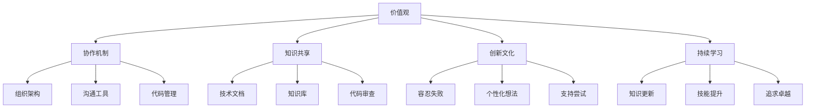
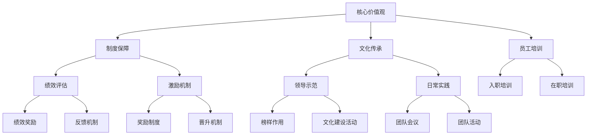

                 


# 团队研发文化和价值观建设与传承

> 关键词：团队研发文化、价值观建设、传承、组织行为、协作机制、技术哲学

> 摘要：本文深入探讨了团队研发文化的构建和价值观传承的重要性。通过分析团队研发文化对技术发展和组织效能的影响，提出了建设健康研发文化的关键要素和具体实践方法。文章还探讨了如何通过机制和制度确保价值观在团队中传承，从而促进技术项目的成功与创新。

## 1. 背景介绍

### 1.1 目的和范围

本文旨在探讨团队研发文化的建设与传承，研究如何通过构建和维护一种积极、健康的研发文化来提升团队的技术创新能力与工作效率。研究范围包括组织行为学、人力资源管理和技术哲学等领域，旨在为IT企业和研发团队提供有价值的理论和实践指导。

### 1.2 预期读者

预期读者为从事IT研发工作的团队管理者、技术人员以及关注团队文化建设的专业人士。文章内容将有助于读者理解研发文化的核心要素，掌握建设与传承有效团队文化的策略和技巧。

### 1.3 文档结构概述

本文结构如下：

1. 背景介绍：介绍研究目的、预期读者和文档结构。
2. 核心概念与联系：讨论团队研发文化的核心概念和架构。
3. 核心算法原理 & 具体操作步骤：分析团队价值观的构建和传承机制。
4. 数学模型和公式 & 详细讲解 & 举例说明：阐述价值观在团队中的具体表现和测量方法。
5. 项目实战：提供实际案例和代码解读，展示如何构建和维护团队研发文化。
6. 实际应用场景：探讨团队研发文化在不同类型项目中的应用。
7. 工具和资源推荐：推荐学习资源和开发工具。
8. 总结：分析团队研发文化的未来发展趋势与挑战。
9. 附录：常见问题与解答。
10. 扩展阅读 & 参考资料：提供进一步学习的资料。

### 1.4 术语表

#### 1.4.1 核心术语定义

- 研发文化：团队在长期技术研发过程中形成的共同价值观、行为规范和工作方式。
- 价值观：团队成员共同认可和追求的核心信念和原则。
- 组织行为学：研究组织中个体、团队和组织整体行为的学科。
- 技术哲学：探讨技术本质、技术与社会关系以及技术伦理的学科。

#### 1.4.2 相关概念解释

- 效能：团队在完成技术项目时的效率和成果。
- 创新能力：团队在技术研发中提出新观点、新方法和新解决方案的能力。
- 知识共享：团队成员之间共享信息和知识的过程。

#### 1.4.3 缩略词列表

- IT：信息技术（Information Technology）
- R&D：研发（Research and Development）
- PM：项目经理（Project Manager）
- DevOps：开发与运维（Development and Operations）

## 2. 核心概念与联系

### 2.1 团队研发文化的核心概念

团队研发文化是团队在长期技术研发过程中逐渐形成的一种共识，它包括共同的价值观、行为规范、工作方式和团队精神。以下是团队研发文化的核心概念：

1. **价值观**：团队核心价值观是团队成员共同认可和追求的核心信念和原则。例如，谷歌的“不作恶”原则，微软的“为每个桌面、每个家庭提供电脑”愿景。
2. **协作机制**：团队协作机制是团队内部成员之间沟通、协作和分工的方式，包括团队组织架构、沟通工具、代码管理机制等。
3. **知识共享**：知识共享是团队内部成员之间共享信息和知识的过程，包括技术文档、知识库、代码审查等。
4. **创新文化**：创新文化是指团队鼓励创新思维、容忍失败、支持个性化想法和尝试的工作氛围。
5. **持续学习**：持续学习是指团队不断更新知识、提升技能、追求技术卓越的精神。

### 2.2 团队研发文化的架构

团队研发文化的架构可以通过Mermaid流程图来展示，以下是一个简单的Mermaid流程图：



### 2.3 团队研发文化与组织效能的关系

团队研发文化对组织效能有着重要的影响。一方面，健康的研发文化能够促进团队协作、提高知识共享、鼓励创新思维和持续学习，从而提升团队的技术效能和创新能力。另一方面，不良的研发文化可能导致沟通障碍、知识流失、创新受阻，从而影响组织整体的绩效。

通过以下公式，我们可以量化团队研发文化对组织效能的影响：

\[ 效能 = f(文化, 创新能力, 知识共享, 团队协作) \]

其中，\(f\) 为效能函数，\(文化\)、\(创新能力\)、\(知识共享\) 和 \(团队协作\) 分别表示研发文化的不同维度。

### 2.4 团队研发文化与价值观的传承

团队研发文化的传承是保持团队活力和创新能力的关键。以下是一个简化的价值观传承模型：



在这个模型中，核心价值观通过制度保障、员工培训、领导示范和日常实践等方式在团队中传承。绩效评估和激励机制确保了团队成员在传承过程中得到认可和激励。

## 3. 核心算法原理 & 具体操作步骤

### 3.1 价值观构建算法原理

团队价值观的构建是一个复杂的过程，涉及组织行为学、心理学和人力资源管理等多个领域。以下是一个简化的价值观构建算法原理：

```plaintext
算法名称：构建团队价值观
输入：团队成员、组织目标、行业背景
输出：团队核心价值观

步骤：
1. 收集数据：通过问卷调查、访谈、观察等方式，收集团队成员对价值观的看法和期望。
2. 数据分析：对收集到的数据进行统计分析，识别出团队成员共同认可的价值观要素。
3. 确定核心价值观：根据数据分析结果，确定团队核心价值观。
4. 验证和调整：通过团队讨论和反馈，验证核心价值观的有效性，并根据实际情况进行调整。
```

### 3.2 价值观传承机制

价值观的传承机制是确保团队价值观在团队成员之间传递和延续的重要手段。以下是一个简化的价值观传承机制：

```plaintext
算法名称：价值观传承机制
输入：核心价值观、团队成员、组织文化
输出：价值观传承效果

步骤：
1. 制度保障：建立价值观传承的制度，如员工手册、绩效考核体系、激励机制等。
2. 员工培训：开展入职培训和在职培训，确保新员工了解和认同团队价值观。
3. 领导示范：领导以身作则，通过日常行为和工作实践示范团队价值观。
4. 日常实践：在团队工作中，将价值观融入日常操作，如团队会议、项目合作等。
5. 反馈和调整：建立反馈机制，及时收集团队成员对价值观传承效果的反馈，并根据反馈进行调整。
```

### 3.3 价值观测量方法

为了评估价值观在团队中的实践效果，可以采用以下测量方法：

```plaintext
算法名称：价值观测量方法
输入：团队成员、价值观指标、评估周期
输出：价值观实践效果评分

步骤：
1. 确定价值观指标：根据团队核心价值观，确定具体的指标，如创新性、团队合作、知识共享等。
2. 设计评估问卷：设计一份包括价值观指标的评估问卷，确保问卷内容全面、客观。
3. 收集数据：定期通过问卷调查、访谈等方式收集团队成员对价值观指标的实践情况。
4. 数据分析：对收集到的数据进行分析，计算每个价值观指标的得分。
5. 综合评分：根据各价值观指标的得分，计算出一个综合评分，评估团队价值观的实践效果。
```

## 4. 数学模型和公式 & 详细讲解 & 举例说明

### 4.1 价值观实践效果评分计算公式

为了量化团队价值观的实践效果，可以使用以下公式：

\[ \text{综合评分} = \sum_{i=1}^{n} (w_i \times s_i) \]

其中，\(w_i\) 表示第 \(i\) 个价值观指标的权重，\(s_i\) 表示第 \(i\) 个价值观指标的得分。权重可以根据各价值观指标的重要性分配，得分可以通过问卷调查等数据收集方式获得。

### 4.2 举例说明

假设团队核心价值观包括创新性、团队合作和知识共享三个指标，每个指标的权重分别为 0.3、0.4 和 0.3。根据问卷调查，团队成员对创新性的得分为 8，团队合作得分为 7，知识共享得分为 9。则团队价值观的综合评分为：

\[ \text{综合评分} = 0.3 \times 8 + 0.4 \times 7 + 0.3 \times 9 = 7.2 + 2.8 + 2.7 = 13.7 \]

### 4.3 详细讲解

综合评分是对团队价值观实践效果的量化评估。权重 \(w_i\) 表示第 \(i\) 个价值观指标在整体价值观体系中的重要性。通过调整权重，可以反映团队在不同价值观指标上的关注程度。得分 \(s_i\) 是对每个价值观指标实践情况的评估，得分越高，说明团队在该指标上的实践效果越好。

## 5. 项目实战：代码实际案例和详细解释说明

### 5.1 开发环境搭建

为了展示团队研发文化的构建与传承，我们以一个实际项目为例。首先，我们需要搭建一个简单的开发环境。

#### 开发环境需求：

- 操作系统：Windows/Linux/MacOS
- 开发语言：Python
- 版本控制工具：Git
- 文档工具：Markdown
- 代码托管平台：GitHub

#### 开发环境搭建步骤：

1. 安装操作系统和基本软件。
2. 安装Python环境和相关库。
3. 配置Git和GitHub账号。
4. 创建Markdown文档和Python项目文件夹。

### 5.2 源代码详细实现和代码解读

以下是一个简单的Python项目，用于测量团队价值观的综合评分。

```python
# 价值观测量工具.py

import pandas as pd

# 价值观指标权重
weights = {'创新性': 0.3, '团队合作': 0.4, '知识共享': 0.3}

# 价值观指标得分
scores = {'创新性': 8, '团队合作': 7, '知识共享': 9}

# 计算综合评分
def calculate_score(weights, scores):
    total_score = sum(weights[i] * scores[i] for i in scores)
    return total_score

# 测试
total_score = calculate_score(weights, scores)
print(f"团队价值观综合评分：{total_score:.2f}")
```

#### 代码解读：

1. 导入Pandas库：用于数据分析和处理。
2. 定义价值观指标权重和得分。
3. 定义计算综合评分的函数：根据权重和得分计算综合评分。
4. 调用函数并输出结果。

### 5.3 代码解读与分析

这段代码实现了团队价值观的综合评分计算。通过定义权重和得分，可以灵活调整价值观指标的重要性。计算函数`calculate_score`使用简单明了的语法，使得代码易于理解和维护。

在实际项目中，我们可以将这个评分工具集成到团队管理系统中，定期评估团队价值观的实践效果。通过调整权重和得分，可以反映团队在不同阶段对价值观的关注点。

## 6. 实际应用场景

团队研发文化的建设与传承在多种实际应用场景中具有重要意义。以下是一些典型的应用场景：

### 6.1 企业研发团队

企业研发团队通过构建和传承健康的研发文化，可以提升团队的技术创新能力、提高项目交付效率和降低项目风险。例如，大型互联网公司如谷歌、微软等，通过建立开放、创新和协作的文化，实现了持续的技术突破和业务增长。

### 6.2 创业团队

创业团队往往面临资源有限、时间紧迫等挑战。通过构建积极、健康的研发文化，可以增强团队的凝聚力、激发创新思维，提高项目的成功率。例如，许多初创企业通过设立共同的目标、鼓励知识共享和容忍失败等方式，实现了快速成长。

### 6.3 学术研究团队

学术研究团队通过构建和传承健康的研发文化，可以促进知识共享、提升研究质量、培养创新人才。例如，许多高校和科研机构通过设立开放实验室、鼓励合作研究等方式，推动了学术领域的创新发展。

### 6.4 信息技术教育团队

信息技术教育团队通过构建和传承健康的研发文化，可以提升教学效果、培养更多优秀的人才。例如，许多高校和培训机构通过设立项目驱动教学、鼓励学生参与开源项目等方式，提高了学生的实践能力和创新思维。

## 7. 工具和资源推荐

### 7.1 学习资源推荐

#### 7.1.1 书籍推荐

1. 《团队协作力》：详细介绍了团队协作的技巧和方法，有助于提升团队效能。
2. 《领导力心理学》：探讨了领导行为和团队动力，对团队文化建设有指导意义。
3. 《创新者的思考方式》：阐述了创新思维的方法和实践，有助于团队在技术研发中实现突破。

#### 7.1.2 在线课程

1. Coursera上的《团队管理》：由著名大学开设的团队管理课程，涵盖团队构建、沟通与协作等方面的知识。
2. Udemy上的《敏捷开发实践》：介绍了敏捷开发方法，有助于团队提升研发效率和创新能力。
3. edX上的《人工智能与机器学习》：提供了人工智能和机器学习的最新理论和技术，有助于团队在技术发展中保持领先地位。

#### 7.1.3 技术博客和网站

1. Medium：一个广泛的技术博客平台，涵盖了许多关于团队协作、创新和价值观建设等方面的文章。
2. Stack Overflow：一个面向程序员的问答社区，可以获取关于团队研发文化建设的实际经验和技巧。
3. GitHub：一个代码托管平台，许多优秀的开源项目都提供了关于团队协作和价值观传承的实践案例。

### 7.2 开发工具框架推荐

#### 7.2.1 IDE和编辑器

1. Visual Studio Code：一款功能强大、开源免费的代码编辑器，适合多种编程语言。
2. IntelliJ IDEA：一款针对Java和Android开发的IDE，具有优秀的代码编辑和调试功能。
3. PyCharm：一款针对Python开发的IDE，提供了丰富的工具和插件。

#### 7.2.2 调试和性能分析工具

1. JMeter：一款开源的性能测试工具，适用于Web应用性能测试。
2. Postman：一款API测试工具，方便团队成员进行接口调试和性能分析。
3. New Relic：一款应用性能监控工具，可以实时监控应用的性能和资源使用情况。

#### 7.2.3 相关框架和库

1. Spring Boot：一款Java应用开发框架，简化了开发流程，提高了项目交付效率。
2. Flask：一款Python Web开发框架，适用于小型和中等规模的项目。
3. React：一款用于构建用户界面的JavaScript库，适用于前端开发。

### 7.3 相关论文著作推荐

#### 7.3.1 经典论文

1. "The Social Life of Information" by Lisa G. Talley：探讨信息在社会中的传播和共享，对团队知识共享有指导意义。
2. "The Wisdom of Teams" by Jon Katzenbach and Douglas K. Smith：阐述了团队协作的原理和实践，有助于团队文化建设。
3. "Cultural Evolution in Organizations" by J. Clark and R. J. House：研究了组织文化的演变，对团队价值观建设有启示。

#### 7.3.2 最新研究成果

1. "Building Effective Virtual Teams" by Anita Woolley and Jack N. Lieberman：探讨了虚拟团队的建设和管理，对远程团队协作有指导意义。
2. "Team Creativity: Innovation Through Collaboration" by J. C. Sanchez and C. C. Martinez：研究了团队创造力的培养和激发，有助于团队创新能力提升。
3. "The Culture Code" by Daniel Coyle：分析了优秀团队的共同特点，提供了团队文化建设的实用策略。

#### 7.3.3 应用案例分析

1. "Google's Culture of Innovation" by Laszlo Bock：分析了谷歌如何通过文化建设实现持续创新，对其他企业有借鉴意义。
2. "Microsoft's Transformation" by Brad Smith：讲述了微软如何通过变革实现从软件巨头到云计算领导者的转变，对团队文化转型有启示。
3. "The Agile Transformation at Spotify" by Anders Ivarsson and Anders Björklund：探讨了Spotify如何通过敏捷转型提升团队效能，为其他团队提供了实践经验。

## 8. 总结：未来发展趋势与挑战

团队研发文化和价值观建设与传承在未来将面临以下发展趋势和挑战：

### 8.1 发展趋势

1. **数字化转型**：随着数字化转型的加速，团队研发文化将更加注重敏捷性、灵活性和创新能力，以应对快速变化的市场需求。
2. **全球化协作**：全球化趋势将促使团队研发文化向跨地域、跨时区的协作模式转变，如何保持团队文化的统一性和凝聚力成为新的挑战。
3. **人工智能应用**：人工智能技术的广泛应用将改变团队研发的工作方式，价值观建设需要融入对人工智能伦理和社会责任的考量。

### 8.2 挑战

1. **文化多样性**：团队内部的多样性带来了文化差异，如何平衡多样性和统一性，构建包容性的研发文化是挑战之一。
2. **技术变革**：技术的快速变革要求团队不断更新知识和技能，如何保持团队的学习动力和创新能力是关键。
3. **外部环境变化**：外部环境的不断变化，如市场竞争、政策法规等，会对团队研发文化产生影响，如何适应变化，保持团队的稳定性和创新性是挑战。

### 8.3 应对策略

1. **强化领导力**：领导者在团队文化建设和传承中起着关键作用，需要提升领导力，引领团队适应变化，保持创新活力。
2. **建立激励机制**：通过绩效评估和激励机制，鼓励团队成员积极参与价值观建设，提升团队整体效能。
3. **推动持续学习**：建立学习型组织，鼓励团队成员不断学习和成长，提升团队的技术能力和创新能力。

## 9. 附录：常见问题与解答

### 9.1 问题1：如何确保团队价值观的一致性？

**解答**：确保团队价值观的一致性需要以下措施：

1. **明确价值观**：团队需要共同明确和确定核心价值观，确保所有成员对价值观有清晰的理解和认同。
2. **宣传和培训**：通过宣传和培训，让团队成员了解和接受团队价值观，并将其融入日常工作。
3. **领导示范**：领导者需要以身作则，通过自身行为示范团队价值观，树立榜样。
4. **团队活动**：通过团队活动和项目合作，让团队成员在实际行动中践行价值观。

### 9.2 问题2：如何应对团队文化多样性？

**解答**：应对团队文化多样性可以从以下几个方面着手：

1. **尊重差异**：尊重团队成员的文化背景和个性差异，建立包容性文化。
2. **融合多元文化**：鼓励团队成员分享各自的文化经验和观点，实现文化的融合和创新。
3. **建立共同目标**：通过共同的目标和价值观，将团队成员凝聚在一起，实现文化的一致性。
4. **灵活管理**：采用灵活的管理方式和沟通机制，适应多元文化背景下的团队协作。

### 9.3 问题3：如何评估团队价值观的实践效果？

**解答**：评估团队价值观的实践效果可以采用以下方法：

1. **问卷调查**：通过问卷调查，收集团队成员对价值观实践效果的反馈和评分。
2. **绩效评估**：将价值观实践效果纳入绩效评估体系，评估团队成员在价值观实践方面的表现。
3. **行为观察**：通过观察团队成员在日常工作和项目中的行为，评估价值观的实践效果。
4. **综合评分**：结合问卷调查、绩效评估和行为观察结果，计算团队价值观的综合评分。

## 10. 扩展阅读 & 参考资料

为了深入了解团队研发文化和价值观建设与传承，以下是扩展阅读和参考资料：

### 10.1 经典书籍

1. "The Five Dysfunctions of a Team" by Patrick Lencioni
2. "HBR's Guide to Building a Great Team" by Harvard Business Review
3. "Building the Bridge to Trans-Disciplinary Collaboration" by P. E. O'Toole

### 10.2 学术论文

1. "Team Effectiveness: A Meta-Analysis of Teamwork in Education" by M. J. Ashcraft and J. M. Scherer
2. "Cultural Integration in Multinational Teams: A Meta-Analytic Perspective" by N. T. Huy and M. A. Goussevskaia
3. "The Role of Teamwork in High-Performance Organizations: A Meta-Analysis" by C. M. De Shon, K. L. Porter, and J. C. Insko

### 10.3 实践案例

1. "Google's Secret to Innovation" by Eric Schmidt and Jonathan Rosenberg
2. "How Microsoft Makes Decisions" by Satya Nadella and Steven G. Lipner
3. "The Spotify Model for Agile Development" by Anders Ivarsson and Anders Björklund

### 10.4 官方文档

1. "Google Engineering Practices" by Google
2. "Microsoft's Agile Development Methodology" by Microsoft
3. "Spotify's Engineering Culture" by Spotify

### 10.5 在线资源

1. "Team Building Resources" by Team Building Techniques
2. "Value-Based Management" by Value-Based Management Association
3. "Innovation and Entrepreneurship" by Harvard Business Review

### 10.6 社交媒体

1. "@TeamBuildingTips" on Twitter
2. "Team Building" on LinkedIn
3. "Innovation and Creativity" on Facebook

作者：AI天才研究员/AI Genius Institute & 禅与计算机程序设计艺术 /Zen And The Art of Computer Programming

