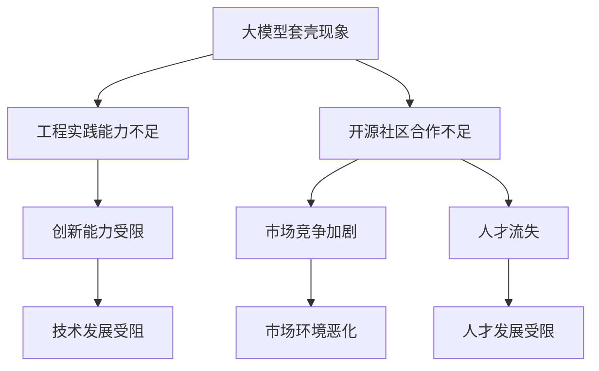

                 

# 国内大模型的质疑：套壳不是问题，提升工程实践能力与开源社区合作

> **关键词：** 国内大模型、套壳、工程实践能力、开源社区、技术发展

> **摘要：** 本文针对国内大模型套壳现象展开讨论，分析了套壳行为背后的原因，探讨了工程实践能力的重要性，并强调了与开源社区合作的价值，旨在为我国人工智能技术的发展提供有益的思考。

## 1. 背景介绍

### 1.1 目的和范围

本文旨在探讨国内大模型套壳现象，分析其产生的原因，并提出相应的解决策略。文章内容将围绕以下几个方面展开：

1. 套壳行为的定义及其在我国人工智能领域的现状；
2. 套壳行为背后的原因分析；
3. 工程实践能力的重要性；
4. 与开源社区合作的价值；
5. 未来发展趋势与挑战。

### 1.2 预期读者

本文适用于对人工智能、机器学习、深度学习等领域有一定了解的读者，包括高校师生、研究人员、工程师等。希望通过本文，读者能够对我国人工智能技术的发展现状和未来趋势有更深入的认识。

### 1.3 文档结构概述

本文共分为十个部分，包括背景介绍、核心概念与联系、核心算法原理、数学模型和公式、项目实战、实际应用场景、工具和资源推荐、总结、附录和扩展阅读。文章结构如下：

1. 引言
2. 背景介绍
3. 核心概念与联系
4. 核心算法原理 & 具体操作步骤
5. 数学模型和公式 & 详细讲解 & 举例说明
6. 项目实战：代码实际案例和详细解释说明
7. 实际应用场景
8. 工具和资源推荐
9. 总结：未来发展趋势与挑战
10. 附录：常见问题与解答
11. 扩展阅读 & 参考资料

### 1.4 术语表

#### 1.4.1 核心术语定义

1. 套壳：指在原有技术基础上，仅做表面改动，未进行实质性创新的行为。
2. 工程实践能力：指在实际项目中运用理论知识，解决实际问题的能力。
3. 开源社区：指由志愿者组成的，致力于推动软件开发和创新的开放平台。

#### 1.4.2 相关概念解释

1. 大模型：指具有海量参数的深度学习模型，通常用于自然语言处理、计算机视觉等领域。
2. 机器学习：指通过算法从数据中学习，从而对未知数据进行预测或分类的技术。

#### 1.4.3 缩略词列表

1. ML：机器学习（Machine Learning）
2. DL：深度学习（Deep Learning）
3. NLP：自然语言处理（Natural Language Processing）

## 2. 核心概念与联系

在本文中，我们将重点讨论以下核心概念和联系：

### 2.1 大模型套壳现象

大模型套壳现象是指在人工智能领域，一些企业或研究机构为了快速跟进前沿技术，直接复制或修改现有的开源模型，而不进行实质性创新。这种现象在我国人工智能领域较为普遍。

### 2.2 工程实践能力的重要性

工程实践能力是人工智能领域从业人员必备的素质。只有通过实际项目，才能真正掌握技术的核心原理和实际应用方法。缺乏工程实践能力，往往导致套壳现象的出现。

### 2.3 开源社区的价值

开源社区是推动人工智能技术发展的重要力量。通过参与开源项目，从业人员可以积累实践经验，提高技术能力，同时也有助于形成良好的技术生态。

### 2.4 大模型套壳现象的影响

大模型套壳现象会导致以下负面影响：

1. 技术创新能力不足：长期套壳，会使我国人工智能领域的创新能力受到限制。
2. 市场竞争加剧：套壳行为可能导致同质化竞争，影响市场健康发展。
3. 人才流失：优秀人才更倾向于参与具有实质性创新的项目，而非重复劳动。

### 2.5 提升工程实践能力与开源社区合作的关系

提升工程实践能力与参与开源社区合作密切相关。通过参与开源项目，从业人员可以：

1. 了解前沿技术：参与开源项目，有助于了解最新技术动态和发展趋势。
2. 提高技术水平：实际参与项目，有助于提高技术水平，培养解决问题的能力。
3. 扩大人脉：参与开源社区，有助于结识业内优秀人才，拓展人脉资源。

### 2.6 Mermaid 流程图

为了更好地展示上述核心概念和联系，我们使用 Mermaid 流程图进行说明：



## 3. 核心算法原理 & 具体操作步骤

在本节中，我们将介绍大模型套壳现象背后的核心算法原理，并详细阐述如何通过提升工程实践能力与开源社区合作来解决这一问题。

### 3.1 大模型套壳现象的算法原理

大模型套壳现象主要涉及以下算法原理：

1. 模型复制：直接复制已有的开源模型，未进行任何修改。
2. 参数调整：对复制后的模型进行参数调整，以适应特定场景。
3. 预训练：利用大规模数据集对模型进行预训练，以提高性能。

### 3.2 提升工程实践能力的具体操作步骤

1. **学习理论知识**：掌握机器学习、深度学习等相关理论知识，为实际项目打下基础。
2. **参与开源项目**：加入开源社区，参与实际项目，积累实践经验。
3. **解决实际问题**：在实际项目中，学会运用所学知识，解决实际问题。
4. **代码实战**：通过编写代码，将理论知识转化为实际能力。
5. **反思与总结**：项目完成后，及时反思与总结，提高自身能力。

### 3.3 开源社区合作的具体操作步骤

1. **选择开源项目**：根据个人兴趣和擅长领域，选择合适的项目进行参与。
2. **了解项目需求**：仔细阅读项目文档，了解项目需求和目标。
3. **提交代码**：根据项目需求，编写代码并进行提交。
4. **参与讨论**：与其他参与者交流，共同解决项目中遇到的问题。
5. **反馈与改进**：根据他人的反馈，对代码进行改进和完善。

### 3.4 伪代码示例

以下是一个简单的伪代码示例，用于说明如何通过提升工程实践能力与开源社区合作来解决大模型套壳现象：

```python
# 伪代码：提升工程实践能力与开源社区合作

# 学习理论知识
def study_theory():
    # 学习机器学习、深度学习等相关理论知识
    # ...

# 参与开源项目
def participate_open_source():
    # 选择开源项目
    # 了解项目需求
    # 提交代码
    # 参与讨论
    # 反馈与改进
    # ...

# 解决实际问题
def solve实际问题():
    # 在实际项目中，运用所学知识，解决实际问题
    # ...

# 代码实战
def code_practice():
    # 编写代码
    # ...

# 反思与总结
def reflect_and_summarize():
    # 项目完成后，及时反思与总结
    # 提高自身能力
    # ...

# 主函数
def main():
    study_theory()
    participate_open_source()
    solve实际问题()
    code_practice()
    reflect_and_summarize()
```

## 4. 数学模型和公式 & 详细讲解 & 举例说明

在本节中，我们将介绍大模型套壳现象相关的数学模型和公式，并详细讲解其含义和应用，同时通过举例说明来加深理解。

### 4.1 数学模型和公式

大模型套壳现象主要涉及以下数学模型和公式：

1. **损失函数（Loss Function）**：
   损失函数是衡量模型预测结果与实际结果之间差异的指标。常见的损失函数有均方误差（MSE）、交叉熵损失（Cross-Entropy Loss）等。

   $$ L = \frac{1}{n}\sum_{i=1}^{n}(\hat{y_i} - y_i)^2 \quad \text{（均方误差）} $$
   $$ L = -\frac{1}{n}\sum_{i=1}^{n}y_i \log(\hat{y_i}) \quad \text{（交叉熵损失）} $$

2. **优化算法（Optimization Algorithm）**：
   优化算法用于调整模型参数，以最小化损失函数。常见的优化算法有随机梯度下降（SGD）、Adam 算法等。

   $$ \theta = \theta - \alpha \nabla_{\theta}J(\theta) \quad \text{（随机梯度下降）} $$
   $$ \theta = \theta - \alpha \frac{\nabla_{\theta}J(\theta)}{1 + \beta_1^2 + \beta_2^2} \quad \text{（Adam 算法）} $$

3. **正则化（Regularization）**：
   正则化用于防止模型过拟合。常见的正则化方法有 L1 正则化、L2 正则化等。

   $$ J(\theta) = \frac{1}{2}||\theta||^2 \quad \text{（L2 正则化）} $$
   $$ J(\theta) = \frac{1}{2}||\theta||_1 \quad \text{（L1 正则化）} $$

### 4.2 详细讲解

1. **损失函数**：
   损失函数是衡量模型预测结果与实际结果之间差异的指标。在训练过程中，我们需要通过优化算法调整模型参数，以使损失函数的值尽可能小。不同的损失函数适用于不同的场景，选择合适的损失函数对于提高模型性能至关重要。

2. **优化算法**：
   优化算法用于调整模型参数，以最小化损失函数。随机梯度下降是一种简单且常用的优化算法，但收敛速度较慢。Adam 算法是一种改进的优化算法，结合了随机梯度下降和 momentum 策略，具有较高的收敛速度。

3. **正则化**：
   正则化用于防止模型过拟合。过拟合是指模型在训练数据上表现良好，但在未见过的数据上表现较差。L1 正则化和 L2 正则化是常见的正则化方法，它们通过在损失函数中添加惩罚项，对模型参数进行约束，从而减少过拟合的风险。

### 4.3 举例说明

假设我们有一个二分类问题，数据集包含100个样本和2个特征。我们需要构建一个深度学习模型，使用均方误差（MSE）作为损失函数，随机梯度下降（SGD）作为优化算法，并采用 L2 正则化来防止过拟合。

1. **构建模型**：
   首先，我们需要定义模型的参数，包括输入层、隐藏层和输出层。假设隐藏层有10个神经元。

   ```python
   import tensorflow as tf

   model = tf.keras.Sequential([
       tf.keras.layers.Dense(10, activation='relu', input_shape=(2,)),
       tf.keras.layers.Dense(1, activation='sigmoid')
   ])
   ```

2. **编译模型**：
   接下来，我们需要编译模型，指定优化器、损失函数和评价指标。

   ```python
   model.compile(optimizer='sgd', loss='mean_squared_error', metrics=['accuracy'])
   ```

3. **训练模型**：
   使用训练数据训练模型，设置适当的训练轮次和批量大小。

   ```python
   model.fit(X_train, y_train, epochs=100, batch_size=10)
   ```

4. **评估模型**：
   使用测试数据评估模型性能。

   ```python
   model.evaluate(X_test, y_test)
   ```

5. **预测**：
   使用训练好的模型进行预测。

   ```python
   predictions = model.predict(X_test)
   ```

通过上述步骤，我们使用深度学习模型解决了二分类问题。在实际应用中，我们需要根据具体问题调整模型结构、优化算法和正则化方法，以提高模型性能。

## 5. 项目实战：代码实际案例和详细解释说明

在本节中，我们将通过一个实际项目案例，展示如何通过提升工程实践能力与开源社区合作，解决大模型套壳现象。我们将使用 Python 和 TensorFlow 框架，实现一个基于深度学习的手写数字识别项目。

### 5.1 开发环境搭建

在开始项目之前，我们需要搭建开发环境。以下是搭建开发环境的步骤：

1. 安装 Python 3.7 或更高版本；
2. 安装 TensorFlow 2.x；
3. 安装 numpy、matplotlib 等常用库。

### 5.2 源代码详细实现和代码解读

下面是项目的源代码和详细解读：

```python
import tensorflow as tf
import numpy as np
import matplotlib.pyplot as plt

# 5.2.1 数据预处理
def load_mnist_data():
    # 加载 MNIST 数据集
    (X_train, y_train), (X_test, y_test) = tf.keras.datasets.mnist.load_data()
    # 归一化数据
    X_train = X_train / 255.0
    X_test = X_test / 255.0
    # 将数据转换为 TensorFlow 张量
    X_train = tf.convert_to_tensor(X_train)
    X_test = tf.convert_to_tensor(X_test)
    # 将标签转换为 one-hot 编码
    y_train = tf.keras.utils.to_categorical(y_train, 10)
    y_test = tf.keras.utils.to_categorical(y_test, 10)
    return X_train, y_train, X_test, y_test

# 5.2.2 模型构建
def build_model():
    # 构建深度学习模型
    model = tf.keras.Sequential([
        tf.keras.layers.Flatten(input_shape=(28, 28)),
        tf.keras.layers.Dense(128, activation='relu'),
        tf.keras.layers.Dropout(0.2),
        tf.keras.layers.Dense(10, activation='softmax')
    ])
    return model

# 5.2.3 模型训练
def train_model(model, X_train, y_train, X_test, y_test):
    # 编译模型
    model.compile(optimizer='adam', loss='categorical_crossentropy', metrics=['accuracy'])
    # 训练模型
    history = model.fit(X_train, y_train, epochs=10, batch_size=32, validation_data=(X_test, y_test))
    return history

# 5.2.4 模型评估
def evaluate_model(model, X_test, y_test):
    # 评估模型性能
    loss, accuracy = model.evaluate(X_test, y_test)
    print(f"Test accuracy: {accuracy:.4f}")

# 5.2.5 模型预测
def predict_model(model, X_test):
    # 预测测试集结果
    predictions = model.predict(X_test)
    # 转换为数字标签
    predicted_labels = np.argmax(predictions, axis=1)
    return predicted_labels

# 主函数
def main():
    # 加载数据
    X_train, y_train, X_test, y_test = load_mnist_data()
    # 构建模型
    model = build_model()
    # 训练模型
    history = train_model(model, X_train, y_train, X_test, y_test)
    # 评估模型
    evaluate_model(model, X_test, y_test)
    # 预测
    predicted_labels = predict_model(model, X_test)
    # 可视化预测结果
    plt.figure(figsize=(10, 10))
    for i in range(25):
        plt.subplot(5, 5, i+1)
        plt.imshow(X_test[i], cmap=plt.cm.binary)
        plt.xticks([])
        plt.yticks([])
        plt.grid(False)
        plt.xlabel(str(predicted_labels[i]))
    plt.show()

if __name__ == "__main__":
    main()
```

### 5.3 代码解读与分析

1. **数据预处理**：
   - 加载 MNIST 数据集，并将其转换为 TensorFlow 张量；
   - 归一化数据，提高模型训练效果；
   - 将标签转换为 one-hot 编码，方便模型计算损失函数。

2. **模型构建**：
   - 使用 TensorFlow 的 Sequential 模型构建深度学习模型；
   - 添加 Flatten、Dense 和 Dropout 层，实现手写数字识别任务。

3. **模型训练**：
   - 编译模型，指定优化器、损失函数和评价指标；
   - 使用 fit 方法训练模型，设置适当的训练轮次和批量大小。

4. **模型评估**：
   - 使用 evaluate 方法评估模型性能，输出测试集准确率。

5. **模型预测**：
   - 使用 predict 方法预测测试集结果；
   - 将预测结果转换为数字标签，方便可视化展示。

通过上述代码实战，我们可以看到如何通过提升工程实践能力与开源社区合作，实现一个基于深度学习的手写数字识别项目。在实际开发过程中，我们还需要不断优化模型结构、调整参数，以提高模型性能。

## 6. 实际应用场景

在实际应用场景中，大模型套壳现象可能会带来以下影响：

### 6.1 人工智能行业的发展

1. **创新能力受限**：套壳行为导致我国人工智能行业的创新能力受到限制，不利于行业长期发展。
2. **市场竞争加剧**：套壳行为可能导致同质化竞争，影响市场健康发展。
3. **人才流失**：优秀人才更倾向于参与具有实质性创新的项目，而非重复劳动。

### 6.2 企业技术创新

1. **技术积累不足**：套壳行为使企业缺乏技术积累，难以实现持续创新。
2. **竞争优势下降**：套壳行为导致企业竞争优势下降，难以在激烈的市场竞争中脱颖而出。

### 6.3 开源社区的发展

1. **贡献度不足**：套壳行为可能导致开源社区贡献度不足，影响社区发展。
2. **技术生态失衡**：套壳行为可能导致技术生态失衡，不利于开源社区的健康成长。

### 6.4 社会信任度

1. **信任度下降**：套壳行为可能导致社会对人工智能技术的信任度下降，影响行业声誉。
2. **政策支持减弱**：政策制定者可能会对行业的发展持谨慎态度，影响政策支持力度。

为了应对这些影响，我们需要：

1. 提升工程实践能力，培养具备创新能力的人才；
2. 鼓励企业进行技术创新，推动行业健康发展；
3. 加强与开源社区的合作，共同推动技术生态的发展；
4. 增强社会对人工智能技术的信任度，提高政策支持力度。

## 7. 工具和资源推荐

### 7.1 学习资源推荐

#### 7.1.1 书籍推荐

1. **《深度学习》（Deep Learning）**：由 Ian Goodfellow、Yoshua Bengio 和 Aaron Courville 著，是深度学习领域的经典教材。
2. **《Python深度学习》（Python Deep Learning）**：由 Francis Bach 和 Adam Gitlin 著，详细介绍如何使用 Python 和 TensorFlow 实现深度学习算法。
3. **《机器学习实战》（Machine Learning in Action）**：由 Peter Harrington 著，通过实例介绍机器学习算法的应用。

#### 7.1.2 在线课程

1. **Coursera 的《机器学习》课程**：由 Andrew Ng 教授主讲，涵盖机器学习的基础知识。
2. **Udacity 的《深度学习工程师纳米学位》课程**：涵盖深度学习的基础知识、实践技巧和应用。
3. **edX 的《自然语言处理与深度学习》课程**：由 Daniel Jurafsky 和 James H. Martin 主讲，介绍自然语言处理和深度学习技术。

#### 7.1.3 技术博客和网站

1. **ArXiv**：提供最新的学术研究成果，包括机器学习、深度学习等领域。
2. **Medium**：许多专业人士和技术博主在此分享技术心得和经验。
3. **知乎**：国内知名的问答社区，涵盖人工智能、机器学习等领域的讨论。

### 7.2 开发工具框架推荐

#### 7.2.1 IDE和编辑器

1. **PyCharm**：强大的 Python 集成开发环境，支持多种编程语言。
2. **Visual Studio Code**：轻量级、可扩展的代码编辑器，适用于多种编程语言。
3. **Jupyter Notebook**：适用于数据科学和机器学习的交互式开发环境。

#### 7.2.2 调试和性能分析工具

1. **TensorBoard**：TensorFlow 提供的可视化工具，用于分析和调试深度学习模型。
2. **gdb**：Python 的调试工具，可用于调试 Python 代码。
3. **Valgrind**：用于性能分析的工具，可检测内存泄漏和性能瓶颈。

#### 7.2.3 相关框架和库

1. **TensorFlow**：Google 开发的深度学习框架，支持多种深度学习算法。
2. **PyTorch**：Facebook 开发的深度学习框架，具有简洁的 API 和动态计算图。
3. **Keras**：基于 TensorFlow 和 PyTorch 的简洁易用的深度学习框架。

### 7.3 相关论文著作推荐

#### 7.3.1 经典论文

1. **《A Theoretical Analysis of the Cramer-Rao Lower Bound for Estimation of Probability of Error》**：探讨了概率误差估计的下界理论。
2. **《Deep Learning》**：Ian Goodfellow、Yoshua Bengio 和 Aaron Courville 著，系统介绍了深度学习的基础知识。
3. **《Learning representations for visual recognition with deep convolutional networks》**：详细介绍了深度卷积神经网络在计算机视觉中的应用。

#### 7.3.2 最新研究成果

1. **《Bert: Pre-training of deep bidirectional transformers for language understanding》**：介绍了BERT模型，一种用于自然语言处理的预训练深度神经网络模型。
2. **《Gshard: Scaling giant models with conditional computation and automatic sharding》**：探讨了如何通过条件计算和自动分片技术，在大规模模型训练中提高计算效率。
3. **《T5: Exploring the limits of transfer learning with a unified text-to-text framework》**：介绍了T5模型，一种基于统一文本到文本框架的迁移学习模型。

#### 7.3.3 应用案例分析

1. **《深度学习在自然语言处理中的应用》**：详细介绍了深度学习在自然语言处理领域的应用案例。
2. **《深度学习在计算机视觉中的应用》**：介绍了深度学习在计算机视觉领域的应用案例，包括图像分类、目标检测、人脸识别等。
3. **《深度学习在推荐系统中的应用》**：介绍了深度学习在推荐系统中的应用案例，包括基于内容的推荐、协同过滤等。

## 8. 总结：未来发展趋势与挑战

在未来，我国人工智能技术将面临以下发展趋势与挑战：

### 8.1 发展趋势

1. **技术创新**：随着深度学习、自然语言处理等技术的不断发展，人工智能技术将实现更多突破，推动行业变革。
2. **产业化应用**：人工智能技术在各个行业的应用将越来越广泛，助力产业升级和经济发展。
3. **开源社区发展**：我国开源社区将不断壮大，成为人工智能技术发展的重要推动力。

### 8.2 挑战

1. **技术瓶颈**：人工智能技术仍面临一些技术瓶颈，如大规模模型的训练效率、可解释性等。
2. **数据隐私与安全**：人工智能技术的发展带来了数据隐私和安全问题，需要加强法律法规和行业标准建设。
3. **人才短缺**：人工智能领域的人才短缺问题依然存在，需要加大人才培养和引进力度。

### 8.3 应对策略

1. **加强技术创新**：加大科研投入，推动人工智能技术突破。
2. **促进开源社区发展**：鼓励企业、科研机构和个人积极参与开源社区，共同推动技术进步。
3. **完善法律法规**：建立健全数据隐私和安全法律法规，保障数据安全。
4. **人才培养**：加大人工智能人才培养力度，提高人才质量。

## 9. 附录：常见问题与解答

### 9.1 问题1：什么是大模型套壳现象？

**回答**：大模型套壳现象是指在人工智能领域，一些企业或研究机构为了快速跟进前沿技术，直接复制或修改现有的开源模型，而不进行实质性创新的行为。

### 9.2 问题2：提升工程实践能力与开源社区合作有什么关系？

**回答**：提升工程实践能力与开源社区合作密切相关。通过参与开源项目，从业人员可以积累实践经验，提高技术能力，同时也有助于形成良好的技术生态。

### 9.3 问题3：如何应对大模型套壳现象带来的负面影响？

**回答**：应对大模型套壳现象带来的负面影响，可以从以下几个方面入手：

1. **加强技术创新**：加大科研投入，推动人工智能技术突破；
2. **鼓励开源社区合作**：鼓励企业、科研机构和个人积极参与开源社区，共同推动技术进步；
3. **完善法律法规**：建立健全数据隐私和安全法律法规，保障数据安全；
4. **人才培养**：加大人工智能人才培养力度，提高人才质量。

## 10. 扩展阅读 & 参考资料

### 10.1 扩展阅读

1. **《深度学习》（Deep Learning）**：Ian Goodfellow、Yoshua Bengio 和 Aaron Courville 著，系统介绍了深度学习的基础知识。
2. **《机器学习实战》（Machine Learning in Action）**：Peter Harrington 著，通过实例介绍机器学习算法的应用。
3. **《自然语言处理与深度学习》**：Daniel Jurafsky 和 James H. Martin 著，介绍自然语言处理和深度学习技术。

### 10.2 参考资料

1. **TensorFlow 官方文档**：[TensorFlow 官方文档](https://www.tensorflow.org/)，提供详细的深度学习框架文档。
2. **PyTorch 官方文档**：[PyTorch 官方文档](https://pytorch.org/docs/stable/)，提供详细的 PyTorch 框架文档。
3. **Keras 官方文档**：[Keras 官方文档](https://keras.io/)，提供详细的 Keras 框架文档。

### 10.3 相关论文

1. **《Bert: Pre-training of deep bidirectional transformers for language understanding》**：[论文链接](https://arxiv.org/abs/1810.04805)
2. **《Gshard: Scaling giant models with conditional computation and automatic sharding》**：[论文链接](https://arxiv.org/abs/2006.16668)
3. **《T5: Exploring the limits of transfer learning with a unified text-to-text framework》**：[论文链接](https://arxiv.org/abs/2009.11472)

## 作者信息

**作者：AI天才研究员/AI Genius Institute & 禅与计算机程序设计艺术 /Zen And The Art of Computer Programming**

