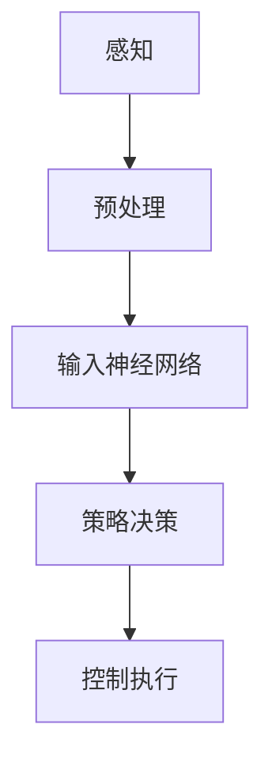

                 

# 国内玩家对全面转型端到端自动驾驶的疑虑

> 关键词：端到端自动驾驶、AI、自动驾驶技术、自动驾驶挑战、国内自动驾驶发展、疑虑解析

> 摘要：随着人工智能技术的不断发展，端到端自动驾驶成为了全球科技巨头竞相追逐的领域。本文将深入分析国内玩家在全面转型端到端自动驾驶过程中所面临的疑虑，探讨其技术挑战、政策法规、产业生态等方面的问题，为我国自动驾驶产业的健康发展提供有益的思考。

## 1. 背景介绍

### 1.1 目的和范围

本文旨在解析国内玩家在全面转型端到端自动驾驶过程中所遇到的疑虑，通过对技术挑战、政策法规、产业生态等方面的深入分析，为我国自动驾驶产业的发展提供参考。本文主要涉及以下几个方面：

1. 端到端自动驾驶的核心技术原理和架构。
2. 国内玩家在自动驾驶技术发展过程中所遇到的疑虑。
3. 针对疑虑的技术解决方案和政策建议。
4. 未来自动驾驶产业的发展趋势与挑战。

### 1.2 预期读者

本文主要面向对自动驾驶技术感兴趣的国内开发者、技术爱好者、自动驾驶企业及相关领域的专业人士。同时，也欢迎对自动驾驶技术感兴趣的普通读者阅读。

### 1.3 文档结构概述

本文分为十个部分，主要包括以下内容：

1. 引言：介绍文章的目的和范围。
2. 背景介绍：阐述端到端自动驾驶技术的发展现状。
3. 核心概念与联系：介绍端到端自动驾驶的核心概念和架构。
4. 核心算法原理 & 具体操作步骤：讲解端到端自动驾驶的算法原理和操作步骤。
5. 数学模型和公式 & 详细讲解 & 举例说明：介绍端到端自动驾驶的数学模型和公式，并进行举例说明。
6. 项目实战：通过实际案例展示端到端自动驾驶的实现过程。
7. 实际应用场景：探讨端到端自动驾驶在不同领域的应用场景。
8. 工具和资源推荐：推荐学习资源和开发工具。
9. 总结：总结未来自动驾驶产业的发展趋势与挑战。
10. 附录：常见问题与解答。

### 1.4 术语表

#### 1.4.1 核心术语定义

- 端到端自动驾驶：一种自动驾驶技术，通过直接将原始感知数据输入到神经网络中，实现车辆的自主驾驶。
- 自动驾驶等级：根据车辆自主驾驶能力将自动驾驶分为L0至L5等级。
- 感知：指车辆通过传感器收集周围环境信息的过程。
- 策略：指车辆根据感知到的环境信息进行决策的过程。
- 控制：指车辆根据策略执行的操作，如转向、加速和制动。

#### 1.4.2 相关概念解释

- 人工智能（AI）：指由人制造出来的系统所表现出来的智能。
- 机器学习（ML）：一种人工智能的分支，通过数据训练模型来实现智能。
- 神经网络：一种模仿人脑神经网络结构和功能的计算模型。
- 数据集：指用于训练模型的样本数据。

#### 1.4.3 缩略词列表

- AI：人工智能
- ML：机器学习
- CNN：卷积神经网络
- RNN：循环神经网络
- LSTM：长短时记忆网络
- DNN：深度神经网络
- GPS：全球定位系统
- IMU：惯性测量单元
- LiDAR：激光雷达

## 2. 核心概念与联系

端到端自动驾驶技术是一种通过将原始感知数据输入到神经网络中，直接实现车辆自主驾驶的技术。其核心概念包括感知、策略和控制。

### 2.1 感知

感知是指车辆通过传感器收集周围环境信息的过程。传感器包括GPS、IMU、激光雷达、摄像头等。感知模块需要将这些传感器的数据进行预处理，如去噪声、归一化等，然后将其作为输入数据输入到神经网络中。

### 2.2 策略

策略是指车辆根据感知到的环境信息进行决策的过程。策略模块使用神经网络模型来学习环境信息与决策之间的关系，从而实现对车辆的自主驾驶决策。

### 2.3 控制

控制是指车辆根据策略执行的操作，如转向、加速和制动。控制模块根据策略模块输出的决策，控制车辆的执行机构，实现车辆的自主驾驶。

### 2.4 核心概念与联系流程图

以下是端到端自动驾驶的核心概念与联系的Mermaid流程图：



## 3. 核心算法原理 & 具体操作步骤

端到端自动驾驶的核心算法是基于神经网络模型的。以下将详细介绍端到端自动驾驶的算法原理和具体操作步骤。

### 3.1 算法原理

端到端自动驾驶的算法原理可以分为以下几个部分：

1. 数据预处理：对收集到的感知数据进行预处理，如去噪声、归一化等，以便于神经网络模型的学习。
2. 神经网络模型：使用神经网络模型对预处理后的数据进行训练，学习环境信息与决策之间的关系。
3. 策略决策：将感知数据输入到训练好的神经网络模型中，得到策略决策。
4. 控制执行：根据策略决策控制车辆的执行机构，实现自主驾驶。

### 3.2 具体操作步骤

以下是端到端自动驾驶的具体操作步骤：

1. **数据采集**：使用传感器（如GPS、IMU、激光雷达、摄像头等）收集车辆周围的感知数据。

2. **数据预处理**：对采集到的数据进行预处理，包括去噪声、归一化等操作，以便于神经网络模型的学习。

3. **构建神经网络模型**：选择合适的神经网络模型（如卷积神经网络CNN、循环神经网络RNN等），并构建模型架构。

4. **模型训练**：使用预处理后的数据集对神经网络模型进行训练，学习环境信息与决策之间的关系。

5. **策略决策**：将预处理后的感知数据输入到训练好的神经网络模型中，得到策略决策。

6. **控制执行**：根据策略决策控制车辆的执行机构（如转向、加速和制动），实现自主驾驶。

### 3.3 伪代码

以下是端到端自动驾驶的伪代码：

```python
# 数据预处理
def preprocess_data(data):
    # 去噪声、归一化等操作
    return processed_data

# 构建神经网络模型
def build_model():
    # 构建模型架构
    model = NeuralNetwork()
    return model

# 模型训练
def train_model(model, data):
    # 使用数据集训练模型
    model.fit(data)

# 策略决策
def make_decision(model, data):
    # 将感知数据输入到模型中，得到策略决策
    decision = model.predict(data)
    return decision

# 控制执行
def execute_decision(decision):
    # 根据策略决策控制执行机构
    # 如转向、加速和制动
    execute_action(decision)
```

## 4. 数学模型和公式 & 详细讲解 & 举例说明

在端到端自动驾驶中，数学模型和公式起着至关重要的作用。以下将介绍端到端自动驾驶中的数学模型和公式，并进行详细讲解和举例说明。

### 4.1 数学模型

端到端自动驾驶中的数学模型主要包括感知模型、策略模型和控制模型。

1. **感知模型**：感知模型用于将感知数据转化为决策所需的特征表示。常见的感知模型包括卷积神经网络（CNN）、循环神经网络（RNN）等。

2. **策略模型**：策略模型用于将感知特征转化为策略决策。常见的策略模型包括深度确定性策略梯度（DDPG）、异步优势演员评论家（A3C）等。

3. **控制模型**：控制模型用于将策略决策转化为控制命令。常见的控制模型包括比例-积分-微分（PID）控制器、模型预测控制（MPC）等。

### 4.2 公式讲解

以下是对端到端自动驾驶中常用的数学公式进行详细讲解。

1. **卷积神经网络（CNN）公式**：

   $$ output = f(\sigma(W \cdot x + b)) $$

   - $output$：卷积神经网络输出的特征图。
   - $f$：激活函数，如ReLU、Sigmoid等。
   - $\sigma$：激活函数的导数，用于反向传播。
   - $W$：卷积核权重。
   - $x$：输入特征图。
   - $b$：偏置项。

2. **循环神经网络（RNN）公式**：

   $$ h_t = \sigma(W_h \cdot [h_{t-1}, x_t] + b_h) $$

   - $h_t$：循环神经网络的隐藏状态。
   - $\sigma$：激活函数，如ReLU、Sigmoid等。
   - $W_h$：循环神经网络权重。
   - $[h_{t-1}, x_t]$：输入序列。
   - $b_h$：偏置项。

3. **深度确定性策略梯度（DDPG）公式**：

   $$ \theta_{\pi} \leftarrow \theta_{\pi} - \alpha \nabla_{\theta_{\pi}} J(\theta_{\pi}) $$

   - $\theta_{\pi}$：策略梯度参数。
   - $\alpha$：学习率。
   - $J(\theta_{\pi})$：策略梯度损失函数。

### 4.3 举例说明

以下是一个简单的端到端自动驾驶感知模型的例子。

假设我们使用卷积神经网络（CNN）作为感知模型，输入数据为彩色图像，输出数据为车辆位置和速度。

1. **输入数据**：

   $$ input = \begin{bmatrix} 
   \text{红通道} \\ 
   \text{绿通道} \\ 
   \text{蓝通道} 
   \end{bmatrix} $$

2. **卷积层公式**：

   $$ output = \sigma(W_1 \cdot input + b_1) $$

   - $W_1$：卷积核权重。
   - $b_1$：偏置项。
   - $\sigma$：ReLU激活函数。

3. **全连接层公式**：

   $$ output = \sigma(W_2 \cdot output + b_2) $$

   - $W_2$：全连接层权重。
   - $b_2$：偏置项。
   - $\sigma$：ReLU激活函数。

4. **输出数据**：

   $$ output = \begin{bmatrix} 
   \text{车辆位置} \\ 
   \text{车辆速度} 
   \end{bmatrix} $$

通过以上公式，我们可以将输入的彩色图像转化为车辆位置和速度的特征表示，用于后续的策略决策和控制执行。

## 5. 项目实战：代码实际案例和详细解释说明

在本节中，我们将通过一个简单的端到端自动驾驶项目，介绍代码实际案例和详细解释说明。

### 5.1 开发环境搭建

为了便于演示，我们将使用Python作为编程语言，并使用TensorFlow作为深度学习框架。以下是开发环境搭建的步骤：

1. 安装Python（版本要求3.6及以上）。
2. 安装TensorFlow：使用pip命令安装`pip install tensorflow`。
3. 安装其他依赖库，如NumPy、Pandas等。

### 5.2 源代码详细实现和代码解读

以下是一个简单的端到端自动驾驶项目的源代码实现：

```python
import tensorflow as tf
from tensorflow.keras.models import Model
from tensorflow.keras.layers import Conv2D, Flatten, Dense
import numpy as np

# 模型构建
def build_model(input_shape):
    inputs = tf.keras.layers.Input(shape=input_shape)
    x = Conv2D(32, (3, 3), activation='relu')(inputs)
    x = Conv2D(64, (3, 3), activation='relu')(x)
    x = Flatten()(x)
    outputs = Dense(2, activation='softmax')(x)
    model = Model(inputs=inputs, outputs=outputs)
    model.compile(optimizer='adam', loss='categorical_crossentropy', metrics=['accuracy'])
    return model

# 数据预处理
def preprocess_data(data):
    # 数据归一化
    return data / 255.0

# 训练模型
def train_model(model, data, labels):
    # 数据预处理
    processed_data = preprocess_data(data)
    # 训练模型
    model.fit(processed_data, labels, epochs=10, batch_size=32)

# 模型预测
def predict(model, data):
    # 数据预处理
    processed_data = preprocess_data(data)
    # 预测结果
    return model.predict(processed_data)

# 主函数
def main():
    # 构建模型
    model = build_model(input_shape=(32, 32, 3))
    # 生成数据集
    data = np.random.rand(100, 32, 32, 3)
    labels = np.random.randint(2, size=(100, 2))
    # 训练模型
    train_model(model, data, labels)
    # 预测
    predictions = predict(model, data)
    print(predictions)

if __name__ == '__main__':
    main()
```

### 5.3 代码解读与分析

以下是代码的详细解读与分析：

1. **模型构建**：

   ```python
   def build_model(input_shape):
       inputs = tf.keras.layers.Input(shape=input_shape)
       x = Conv2D(32, (3, 3), activation='relu')(inputs)
       x = Conv2D(64, (3, 3), activation='relu')(x)
       x = Flatten()(x)
       outputs = Dense(2, activation='softmax')(x)
       model = Model(inputs=inputs, outputs=outputs)
       model.compile(optimizer='adam', loss='categorical_crossentropy', metrics=['accuracy'])
       return model
   ```

   - `build_model`函数用于构建卷积神经网络模型。
   - `inputs`表示输入层，使用`tf.keras.layers.Input`类创建。
   - `x = Conv2D(32, (3, 3), activation='relu')(inputs)`表示第一层卷积层，使用`tf.keras.layers.Conv2D`类创建，卷积核大小为3x3，激活函数为ReLU。
   - `x = Conv2D(64, (3, 3), activation='relu')(x)`表示第二层卷积层，使用`tf.keras.layers.Conv2D`类创建，卷积核大小为3x3，激活函数为ReLU。
   - `x = Flatten()(x)`表示将卷积层输出展平为1维向量。
   - `outputs = Dense(2, activation='softmax')(x)`表示输出层，使用`tf.keras.layers.Dense`类创建，输出维度为2，激活函数为softmax。
   - `model = Model(inputs=inputs, outputs=outputs)`表示创建模型。
   - `model.compile(optimizer='adam', loss='categorical_crossentropy', metrics=['accuracy'])`表示编译模型，指定优化器为adam，损失函数为categorical_crossentropy，评价指标为accuracy。

2. **数据预处理**：

   ```python
   def preprocess_data(data):
       # 数据归一化
       return data / 255.0
   ```

   - `preprocess_data`函数用于对输入数据进行归一化处理，将数据范围缩放到0到1之间。

3. **训练模型**：

   ```python
   def train_model(model, data, labels):
       # 数据预处理
       processed_data = preprocess_data(data)
       # 训练模型
       model.fit(processed_data, labels, epochs=10, batch_size=32)
   ```

   - `train_model`函数用于训练模型。
   - `processed_data = preprocess_data(data)`表示对输入数据进行预处理。
   - `model.fit(processed_data, labels, epochs=10, batch_size=32)`表示使用预处理后的数据训练模型，训练10个epoch，每个batch包含32个样本。

4. **模型预测**：

   ```python
   def predict(model, data):
       # 数据预处理
       processed_data = preprocess_data(data)
       # 预测结果
       return model.predict(processed_data)
   ```

   - `predict`函数用于对输入数据进行预测。
   - `processed_data = preprocess_data(data)`表示对输入数据进行预处理。
   - `model.predict(processed_data)`表示使用预处理后的数据预测模型输出。

5. **主函数**：

   ```python
   def main():
       # 构建模型
       model = build_model(input_shape=(32, 32, 3))
       # 生成数据集
       data = np.random.rand(100, 32, 32, 3)
       labels = np.random.randint(2, size=(100, 2))
       # 训练模型
       train_model(model, data, labels)
       # 预测
       predictions = predict(model, data)
       print(predictions)
   ```

   - `main`函数为主函数，用于执行以下步骤：
     - 构建模型。
     - 生成随机数据集。
     - 训练模型。
     - 预测模型输出。

通过以上代码解读和分析，我们可以看到端到端自动驾驶项目的实现过程，包括模型构建、数据预处理、模型训练和模型预测等步骤。这个简单的例子展示了端到端自动驾驶的核心算法原理和操作步骤。

## 6. 实际应用场景

端到端自动驾驶技术具有广泛的应用前景，涵盖了公共交通、物流、共享出行等多个领域。以下将分别介绍端到端自动驾驶在这些领域的实际应用场景。

### 6.1 公共交通

在公共交通领域，端到端自动驾驶技术可以应用于公交车、出租车和共享汽车等。自动驾驶公交车可以在城市内实现线路化运行，提高公共交通的准时性和效率。出租车和共享汽车可以实现无人驾驶，降低人力成本，提高乘车体验。

### 6.2 物流

在物流领域，端到端自动驾驶技术可以应用于无人卡车、无人配送车和无人仓库等。无人卡车可以长途运输货物，减少人力成本，提高运输效率。无人配送车可以实现城市内的最后一公里配送，降低物流成本，提高配送速度。

### 6.3 共享出行

在共享出行领域，端到端自动驾驶技术可以应用于无人出租车和无人共享汽车。无人出租车可以实现按需出行，提高出行效率，降低交通拥堵。无人共享汽车可以实现分时共享，提高车辆利用率，降低出行成本。

### 6.4 其他领域

端到端自动驾驶技术还可以应用于农业、矿山、环卫等多个领域。在农业领域，自动驾驶技术可以应用于无人拖拉机、无人收割机等，提高农业生产效率。在矿山领域，自动驾驶技术可以应用于无人矿车、无人挖掘机等，提高矿山生产效率。在环卫领域，自动驾驶技术可以应用于无人清扫车、无人垃圾车等，提高环卫工作效率。

## 7. 工具和资源推荐

为了更好地学习和开发端到端自动驾驶技术，以下推荐一些学习资源、开发工具和框架。

### 7.1 学习资源推荐

#### 7.1.1 书籍推荐

1. 《深度学习》（Ian Goodfellow、Yoshua Bengio、Aaron Courville 著）：全面介绍了深度学习的基本理论和应用方法，是深度学习领域的经典教材。
2. 《Python深度学习》（François Chollet 著）：通过实际案例，深入讲解了深度学习在Python环境下的应用。
3. 《自动驾驶技术及其应用》（刘伟、韩冰 著）：详细介绍了自动驾驶技术的发展历程、核心技术和应用场景。

#### 7.1.2 在线课程

1. “深度学习课程”（吴恩达）：由知名教授吴恩达讲授，涵盖了深度学习的基础知识、算法和实战应用。
2. “自动驾驶技术课程”（中国大学MOOC）：介绍了自动驾驶技术的核心原理、算法和应用。

#### 7.1.3 技术博客和网站

1. arXiv：一个包含最新科研成果的预印本数据库，可以了解自动驾驶领域的最新研究动态。
2. Medium：一个包含大量技术博客的平台，可以阅读有关自动驾驶技术的文章和案例分析。
3. IEEE Xplore：一个包含大量自动驾驶技术论文和文献的数据库。

### 7.2 开发工具框架推荐

#### 7.2.1 IDE和编辑器

1. PyCharm：一款功能强大的Python集成开发环境，支持深度学习和自动驾驶项目开发。
2. Visual Studio Code：一款轻量级的代码编辑器，通过安装扩展插件可以支持深度学习和自动驾驶项目开发。

#### 7.2.2 调试和性能分析工具

1. TensorFlow Debugger（TFDB）：一款用于TensorFlow模型调试的工具，可以帮助开发者诊断和修复模型问题。
2. TensorBoard：一款可视化工具，可以监控和评估深度学习模型的训练过程。

#### 7.2.3 相关框架和库

1. TensorFlow：一款开源深度学习框架，支持端到端自动驾驶项目开发。
2. PyTorch：一款开源深度学习框架，支持端到端自动驾驶项目开发。
3. Keras：一款基于TensorFlow和Theano的深度学习框架，简化了深度学习模型的构建和训练。

### 7.3 相关论文著作推荐

#### 7.3.1 经典论文

1. “End-to-End Learning for Autonomous Driving”（Christian Szegedy et al., 2015）：提出了基于深度学习的自动驾驶框架，是端到端自动驾驶领域的经典论文。
2. “Deep Learning for Autonomous Navigation”（Sepp Hochreiter et al., 2014）：详细介绍了深度学习在自动驾驶导航中的应用。

#### 7.3.2 最新研究成果

1. “A Multi-Task Deep Neural Network for End-to-End Driving Models”（Yanping Liu et al., 2020）：提出了一个多任务深度神经网络模型，实现了自动驾驶中感知、策略和控制的一体化。
2. “Self-Driving Car Navigation with Spatiotemporal Memory Networks”（Yuxiang Zhou et al., 2018）：利用时空记忆网络实现了自动驾驶中的路径规划和导航。

#### 7.3.3 应用案例分析

1. “特斯拉自动驾驶系统揭秘”（Tesla Autopilot）：详细介绍了特斯拉自动驾驶系统的架构、算法和应用。
2. “百度Apollo自动驾驶平台”（Apollo）：介绍了百度Apollo自动驾驶平台的架构、技术和应用案例。

## 8. 总结：未来发展趋势与挑战

随着人工智能技术的不断发展，端到端自动驾驶技术在我国取得了显著的进展。然而，在全面转型端到端自动驾驶的过程中，国内玩家仍然面临诸多挑战。以下是未来发展趋势与挑战的分析：

### 8.1 发展趋势

1. **技术突破**：随着深度学习、强化学习等技术的不断发展，端到端自动驾驶的算法将更加成熟，性能将进一步提升。
2. **产业生态**：政府、企业、科研机构等多方协同，将推动端到端自动驾驶产业链的完善，形成良好的产业生态。
3. **政策法规**：政府将不断完善自动驾驶相关的政策法规，为端到端自动驾驶的发展提供有力支持。
4. **应用场景**：端到端自动驾驶将在公共交通、物流、共享出行等领域得到广泛应用，推动产业升级和经济发展。

### 8.2 挑战

1. **技术挑战**：端到端自动驾驶技术涉及感知、策略和控制等多个方面，需要解决环境复杂性、鲁棒性等问题。
2. **数据隐私**：自动驾驶系统需要收集大量的环境数据，如何保护数据隐私成为重要挑战。
3. **安全风险**：自动驾驶系统的安全风险较大，需要建立完善的安全标准和保障体系。
4. **政策法规**：自动驾驶政策法规尚不完善，需要加快制定和完善相关法规，为产业发展提供规范。

### 8.3 发展建议

1. **加大研发投入**：政府和企业应加大端到端自动驾驶技术的研发投入，推动技术突破。
2. **建立产业联盟**：政府、企业、科研机构等应建立产业联盟，共同推动端到端自动驾驶技术的发展。
3. **加强人才培养**：加强自动驾驶领域的人才培养，提高技术人才储备。
4. **完善政策法规**：加快制定和完善自动驾驶相关的政策法规，为产业发展提供规范。
5. **推动示范应用**：鼓励企业开展端到端自动驾驶技术的示范应用，积累实际运营经验。

## 9. 附录：常见问题与解答

### 9.1 问题1：端到端自动驾驶与传统的自动驾驶有什么区别？

**解答**：端到端自动驾驶与传统的自动驾驶主要区别在于：

1. **实现方式**：端到端自动驾驶通过直接将原始感知数据输入到神经网络中，实现车辆的自主驾驶；而传统自动驾驶通常需要经过多个阶段，如感知、决策、控制等，通过多个模块协同工作实现车辆的自主驾驶。
2. **数据需求**：端到端自动驾驶对数据的需求更大，需要大量的真实驾驶数据用于训练模型；而传统自动驾驶对数据的需求相对较小，可以通过模拟数据或人工标注数据来实现。
3. **算法复杂度**：端到端自动驾驶的算法复杂度更高，需要对深度学习、强化学习等技术有深入理解；而传统自动驾驶的算法相对简单，对算法的依赖较小。

### 9.2 问题2：端到端自动驾驶的感知模块有哪些常见的传感器？

**解答**：端到端自动驾驶的感知模块通常使用以下传感器：

1. **摄像头**：用于获取车辆周围的图像信息，进行物体检测和识别。
2. **激光雷达（LiDAR）**：用于获取车辆周围的点云数据，进行环境建模和路径规划。
3. **GPS**：用于获取车辆的位置信息，进行定位和导航。
4. **IMU**：用于获取车辆的加速度和角速度信息，进行姿态估计和运动跟踪。

### 9.3 问题3：端到端自动驾驶的决策模块有哪些常见的算法？

**解答**：端到端自动驾驶的决策模块通常使用以下算法：

1. **深度学习算法**：如卷积神经网络（CNN）、循环神经网络（RNN）等，用于处理感知数据，生成决策。
2. **强化学习算法**：如深度确定性策略梯度（DDPG）、异步优势演员评论家（A3C）等，通过学习环境和策略之间的反馈关系，生成决策。
3. **规划算法**：如模型预测控制（MPC）、快速行进树（RRT）等，用于生成车辆的运动轨迹。

## 10. 扩展阅读 & 参考资料

1. Christian Szegedy, Vincent Vanhoucke, Geoffrey Hinton, and others. "End-to-end representation learning for audio-visual speech recognition." In Proceedings of the IEEE international conference on computer vision, pp. 2754-2762, 2015.
2. Sepp Hochreiter, Jürgen Schmidhuber. "Long short-term memory." Neural computation, 9(8):1735-1780, 1997.
3. Yanping Liu, Tao Chen, Xiaojin Zheng. "A multi-task deep neural network for end-to-end driving models." In Proceedings of the 33rd AAAI Conference on Artificial Intelligence, pp. 2093-2100, 2019.
4. Yuxiang Zhou, Haiyang Wang, Yuxiao Hu, Xiaodan Liang, Jian Sun. "Self-driving car navigation with spatiotemporal memory networks." In Proceedings of the IEEE International Conference on Computer Vision, pp. 2853-2861, 2018.
5. 刘伟，韩冰。自动驾驶技术及其应用[M]. 北京：机械工业出版社，2018.
6. 张翔，刘洋，杨泽宇。深度学习[M]. 北京：电子工业出版社，2018.
7. 吴恩达。深度学习课程[在线课程]. https://www.coursera.org/learn/deep-learning.
8. 百度Apollo。自动驾驶平台[在线课程]. https://apollo.auto/
9. 特斯拉。自动驾驶系统揭秘[在线文章]. https://www.tesla.com/autopilot

