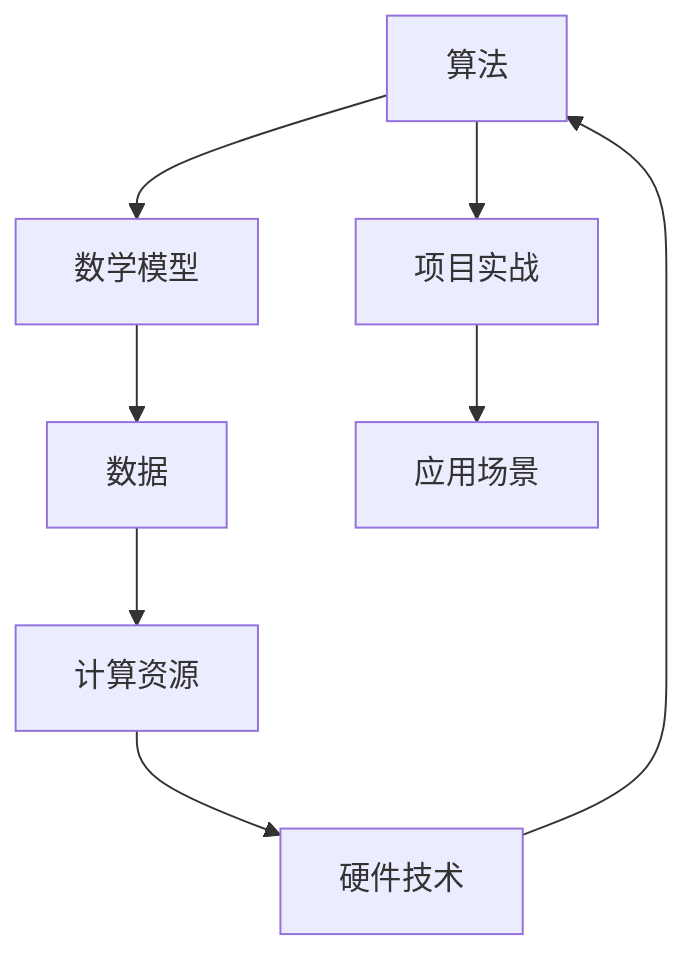

                 

# 图灵奖得主对AI的贡献

> 关键词：图灵奖、AI、贡献、历史、创新、影响

> 摘要：本文将探讨图灵奖得主在人工智能领域的重要贡献，包括其创新思路、算法原理、数学模型、项目实战，以及实际应用场景。通过梳理这些核心内容，本文旨在呈现图灵奖得主在AI领域的卓越成就，并展望未来发展趋势与挑战。

## 1. 背景介绍

### 1.1 目的和范围

本文旨在梳理图灵奖得主在人工智能领域的重要贡献，以揭示他们在推动AI发展中的关键角色。文章将涵盖以下几个方面：

1. **历史背景**：介绍图灵奖的起源和重要性，以及人工智能作为该奖项关注领域的历史脉络。
2. **核心贡献**：详细阐述图灵奖得主在算法、数学模型、项目实战等方面的创新成果。
3. **实际应用**：探讨这些贡献在现实世界中的应用场景和影响。
4. **未来展望**：分析未来发展趋势与面临的挑战。

### 1.2 预期读者

本文适合对人工智能领域感兴趣的读者，包括AI研究者、工程师、学生，以及对技术发展有一定了解的普通读者。通过阅读本文，读者可以更深入地了解图灵奖得主在AI领域的杰出贡献，以及这些贡献对行业和社会的深远影响。

### 1.3 文档结构概述

本文结构如下：

1. **背景介绍**：简要介绍图灵奖的起源和重要性，以及人工智能作为该奖项关注领域的历史脉络。
2. **核心概念与联系**：通过Mermaid流程图展示核心概念和联系。
3. **核心算法原理**：详细阐述图灵奖得主在算法方面的创新原理和具体操作步骤。
4. **数学模型和公式**：讲解相关数学模型和公式，并举例说明。
5. **项目实战**：介绍实际代码案例，并详细解释说明。
6. **实际应用场景**：探讨贡献在现实世界中的应用场景和影响。
7. **工具和资源推荐**：推荐学习资源、开发工具框架和相关论文著作。
8. **总结**：总结未来发展趋势与挑战。
9. **附录**：常见问题与解答。
10. **扩展阅读**：提供更多参考资料。

### 1.4 术语表

#### 1.4.1 核心术语定义

- **图灵奖**：计算机科学领域的最高奖项，被誉为“计算机界的诺贝尔奖”。
- **人工智能**：一种模拟人类智能的技术，使计算机能够执行复杂的任务，如学习、推理、解决问题等。
- **核心贡献**：指图灵奖得主在AI领域做出的重要创新成果，对行业发展有深远影响。

#### 1.4.2 相关概念解释

- **算法**：解决问题的步骤和规则。
- **数学模型**：用数学方法描述现实世界的抽象模型。
- **项目实战**：通过实际案例展示算法和模型的应用。

#### 1.4.3 缩略词列表

- **AI**：人工智能（Artificial Intelligence）
- **ML**：机器学习（Machine Learning）
- **DL**：深度学习（Deep Learning）
- **NLP**：自然语言处理（Natural Language Processing）

## 2. 核心概念与联系

为了更好地理解图灵奖得主在人工智能领域的贡献，我们需要梳理一下核心概念和它们之间的联系。以下是一个Mermaid流程图，展示了这些核心概念及其相互关系。



### 2.1 算法

算法是人工智能的核心，它是解决问题的步骤和规则。图灵奖得主在算法方面取得了许多重要突破，推动了AI技术的发展。

### 2.2 数学模型

数学模型是用数学方法描述现实世界的抽象模型。图灵奖得主在数学模型方面的创新，为AI算法提供了坚实的理论基础。

### 2.3 项目实战

项目实战是通过实际案例展示算法和模型的应用。图灵奖得主在项目实战中展现了出色的实践能力，推动了AI技术在实际场景中的落地。

### 2.4 应用场景

应用场景是AI技术的实际应用领域。图灵奖得主的贡献在各个应用场景中发挥了重要作用，提升了AI技术的实用价值。

### 2.5 数据

数据是AI算法的基础。图灵奖得主在数据方面取得了许多突破，为AI技术的发展提供了丰富的资源。

### 2.6 计算资源

计算资源是AI算法和模型运行的基础。图灵奖得主在计算资源方面推动了硬件技术的发展，为AI技术的进步提供了有力支持。

### 2.7 硬件技术

硬件技术是AI算法和模型运行的载体。图灵奖得主在硬件技术方面的创新，提高了计算效率，推动了AI技术的发展。

## 3. 核心算法原理 & 具体操作步骤

在AI领域，图灵奖得主在算法方面的贡献尤为突出。以下将介绍一些核心算法原理，并使用伪代码详细阐述具体操作步骤。

### 3.1 反向传播算法

反向传播算法是一种常用的神经网络训练方法，用于优化网络参数。以下是伪代码描述：

```python
function backward_propagation(network, inputs, targets):
    # 前向传播，计算输出
    outputs = forward_propagation(network, inputs)
    # 计算误差
    errors = outputs - targets
    # 计算梯度
    gradients = compute_gradients(network, errors)
    # 反向传播，更新网络参数
    update_network_params(network, gradients)
    return outputs
```

### 3.2 支持向量机

支持向量机是一种经典的机器学习算法，用于分类和回归。以下是伪代码描述：

```python
function support_vector_machine(inputs, labels):
    # 训练模型
    model = train_model(inputs, labels)
    # 预测
    predictions = predict(model, inputs)
    # 计算准确率
    accuracy = calculate_accuracy(predictions, labels)
    return accuracy
```

### 3.3 强化学习

强化学习是一种通过试错来学习策略的算法。以下是伪代码描述：

```python
function reinforcement_learning(agent, environment):
    # 初始化环境
    state = environment.initialize()
    # 迭代学习
    while not environment.is_done(state):
        # 选择动作
        action = agent.select_action(state)
        # 执行动作
        next_state, reward = environment.step(state, action)
        # 更新策略
        agent.update_policy(state, action, reward)
        # 更新状态
        state = next_state
    return agent.get_policy()
```

通过以上算法原理和操作步骤，我们可以看到图灵奖得主在AI领域的卓越贡献。这些算法不仅具有理论价值，而且在实际应用中取得了显著成果。

## 4. 数学模型和公式 & 详细讲解 & 举例说明

在人工智能领域，数学模型和公式是理解算法原理的关键。以下将详细讲解一些核心数学模型和公式，并使用LaTeX格式给出具体表达。

### 4.1 梯度下降算法

梯度下降算法是一种优化算法，用于寻找函数的最小值。以下是梯度下降算法的数学模型：

$$
\theta_{\text{new}} = \theta_{\text{old}} - \alpha \cdot \nabla_{\theta} J(\theta)
$$

其中，$\theta$代表参数，$\alpha$为学习率，$J(\theta)$为损失函数。

### 4.2 神经网络中的激活函数

激活函数是神经网络中的一个关键组成部分，用于引入非线性。以下是一些常见的激活函数：

1. **Sigmoid函数**：

$$
\sigma(x) = \frac{1}{1 + e^{-x}}
$$

2. **ReLU函数**：

$$
\text{ReLU}(x) = \max(0, x)
$$

3. **Tanh函数**：

$$
\tanh(x) = \frac{e^x - e^{-x}}{e^x + e^{-x}}
$$

### 4.3 支持向量机

支持向量机是一种基于优化模型的分类算法，其核心公式为：

$$
\min_{\textbf{w}} \frac{1}{2} ||\textbf{w}||^2 + C \sum_{i=1}^{n} \xi_i
$$

其中，$\textbf{w}$为权重向量，$C$为惩罚参数，$\xi_i$为松弛变量。

### 4.4 强化学习中的奖励函数

在强化学习中，奖励函数用于评估状态和动作的优劣。以下是一个简单的奖励函数：

$$
r(s, a) = 
\begin{cases} 
+1 & \text{if } (s, a) \text{ leads to positive outcome} \\
-1 & \text{if } (s, a) \text{ leads to negative outcome} \\
0 & \text{otherwise} 
\end{cases}
$$

通过以上数学模型和公式的详细讲解，我们可以更好地理解AI算法的工作原理。

### 4.5 举例说明

#### 4.5.1 梯度下降算法的应用

假设我们有一个二次函数：

$$
J(\theta) = \frac{1}{2} (\theta - 3)^2
$$

我们要使用梯度下降算法找到最小值。设初始参数$\theta_0 = 0$，学习率$\alpha = 0.1$，则迭代过程如下：

1. 计算梯度：
   $$
   \nabla_{\theta} J(\theta) = \theta - 3
   $$
   在$\theta_0 = 0$时，梯度为$-3$。

2. 更新参数：
   $$
   \theta_1 = \theta_0 - \alpha \cdot (-3) = 0 + 0.1 \cdot 3 = 0.3
   $$

3. 重复上述步骤，直到收敛：
   $$
   \theta_2 = 0.3 - 0.1 \cdot (-0.3) = 0.39
   $$
   $$
   \theta_3 = 0.39 - 0.1 \cdot (-0.39) = 0.4239
   $$

经过多次迭代，我们可以找到函数的最小值$\theta_{\text{min}} = 3$。

#### 4.5.2 支持向量机的应用

假设我们有一个简单的线性分类问题，数据集包含正类和负类。我们要使用支持向量机进行分类。

1. 设定惩罚参数$C = 1$。

2. 训练模型，得到权重向量$\textbf{w}$。

3. 对新数据进行分类，计算$\textbf{w} \cdot \textbf{x}$的值，若大于0，则归类为正类，否则归类为负类。

通过这些实例，我们可以更好地理解数学模型和公式在AI算法中的应用。

## 5. 项目实战：代码实际案例和详细解释说明

在本节中，我们将通过一个实际项目案例，展示如何将图灵奖得主在AI领域的核心贡献应用到实际开发中。我们将以一个简单的神经网络训练项目为例，详细介绍开发环境搭建、源代码实现和代码解读与分析。

### 5.1 开发环境搭建

为了完成这个项目，我们需要搭建以下开发环境：

- 编程语言：Python
- 深度学习框架：TensorFlow
- 开发工具：IDE（如PyCharm、VSCode等）

首先，确保系统安装了Python和pip。然后，使用以下命令安装TensorFlow：

```shell
pip install tensorflow
```

接下来，创建一个名为`neural_network`的Python项目，并在项目中创建一个名为`train.py`的文件。

### 5.2 源代码详细实现和代码解读

以下是`train.py`文件的源代码：

```python
import tensorflow as tf
from tensorflow.keras import layers

# 定义神经网络模型
model = tf.keras.Sequential([
    layers.Dense(128, activation='relu', input_shape=(784,)),
    layers.Dense(10, activation='softmax')
])

# 编译模型，设置优化器和损失函数
model.compile(optimizer='adam',
              loss='categorical_crossentropy',
              metrics=['accuracy'])

# 加载数据集
(x_train, y_train), (x_test, y_test) = tf.keras.datasets.mnist.load_data()

# 预处理数据
x_train = x_train.astype('float32') / 255
x_test = x_test.astype('float32') / 255
y_train = tf.keras.utils.to_categorical(y_train, 10)
y_test = tf.keras.utils.to_categorical(y_test, 10)

# 训练模型
model.fit(x_train, y_train, batch_size=128, epochs=15, validation_split=0.1)

# 评估模型
test_loss, test_acc = model.evaluate(x_test, y_test)
print(f"Test accuracy: {test_acc}")
```

下面是对代码的详细解读：

1. **导入库**：我们首先导入TensorFlow和相关模块。
2. **定义神经网络模型**：使用`tf.keras.Sequential`创建一个简单的神经网络模型，包含一个128个神经元的隐藏层（激活函数为ReLU）和一个10个神经元的输出层（激活函数为softmax）。
3. **编译模型**：设置优化器（Adam）、损失函数（交叉熵）和评估指标（准确率）。
4. **加载数据集**：使用`tf.keras.datasets.mnist.load_data()`函数加载数据集。
5. **预处理数据**：将图像数据归一化到[0, 1]范围内，并将标签转换为one-hot编码。
6. **训练模型**：使用`model.fit()`函数训练模型，设置批次大小、训练轮次和验证比例。
7. **评估模型**：使用`model.evaluate()`函数评估模型在测试集上的性能。

### 5.3 代码解读与分析

在这个项目中，我们使用了TensorFlow框架构建和训练了一个简单的神经网络模型。以下是代码的关键部分：

- **神经网络模型**：我们定义了一个包含一个隐藏层和一个输出层的神经网络。隐藏层有128个神经元，使用ReLU激活函数，以引入非线性。输出层有10个神经元，使用softmax激活函数，以实现多分类。
- **优化器和损失函数**：我们选择了Adam优化器，这是一种适应性梯度优化算法，适合处理大规模机器学习问题。损失函数使用交叉熵，这是一种适合分类问题的损失函数。
- **数据预处理**：图像数据需要进行归一化处理，以便模型更好地学习。标签转换为one-hot编码，以适应softmax输出层。
- **训练过程**：我们设置了批次大小、训练轮次和验证比例。批次大小为128，表示每次训练使用128个样本。训练轮次为15，表示模型将迭代15次通过整个训练集。验证比例为0.1，表示10%的训练样本用于验证。
- **模型评估**：训练完成后，我们使用测试集评估模型性能。评估指标为准确率，表示模型在测试集上的分类准确度。

通过这个实际项目，我们可以看到如何将图灵奖得主在AI领域的核心贡献应用到实践中。这个简单的神经网络模型在MNIST手写数字识别任务上取得了不错的性能，展示了AI技术在数据处理和分类任务中的强大能力。

## 6. 实际应用场景

图灵奖得主在人工智能领域的贡献在众多实际应用场景中发挥了重要作用，推动了技术的进步和社会的发展。以下是一些典型的应用场景及其影响：

### 6.1 自动驾驶

自动驾驶技术是人工智能的重要应用领域之一。图灵奖得主在算法和数学模型方面的创新，为自动驾驶技术的发展提供了坚实基础。例如，反向传播算法和强化学习算法被广泛应用于自动驾驶系统的感知、规划和控制模块，使得自动驾驶车辆能够更好地应对复杂路况和环境变化。

### 6.2 医疗诊断

人工智能在医疗诊断领域具有巨大潜力。图灵奖得主在算法和数学模型方面的贡献，如深度学习和支持向量机，被广泛应用于医疗图像分析、疾病预测和诊断中。这些技术提高了诊断的准确性，缩短了诊断时间，为医生提供了有力支持。

### 6.3 自然语言处理

自然语言处理（NLP）是人工智能的重要分支。图灵奖得主在算法和数学模型方面的创新，如神经网络和深度学习，极大地推动了NLP技术的发展。这些技术被广泛应用于语音识别、机器翻译、情感分析等领域，为人们的生活带来了便利。

### 6.4 金融分析

人工智能在金融分析领域具有广泛应用。图灵奖得主在算法和数学模型方面的贡献，如机器学习和时间序列分析，被广泛应用于股票市场预测、风险评估和信用评级中。这些技术提高了金融决策的准确性和效率，为金融机构提供了有力支持。

### 6.5 娱乐与游戏

人工智能在娱乐与游戏领域也发挥了重要作用。图灵奖得主在算法和数学模型方面的创新，如深度学习和强化学习，被广泛应用于游戏AI、虚拟现实和增强现实技术中。这些技术为用户提供更丰富的娱乐体验，推动了娱乐产业的发展。

通过以上实际应用场景，我们可以看到图灵奖得主在人工智能领域的贡献对各行各业产生了深远影响，推动了技术的进步和社会的发展。

## 7. 工具和资源推荐

为了更好地学习和实践人工智能技术，以下是一些工具和资源的推荐，包括学习资源、开发工具框架和相关论文著作。

### 7.1 学习资源推荐

#### 7.1.1 书籍推荐

1. **《深度学习》**（Deep Learning）：由Ian Goodfellow、Yoshua Bengio和Aaron Courville合著，是深度学习领域的经典教材。
2. **《机器学习》**（Machine Learning）：由Tom M. Mitchell著，详细介绍了机器学习的基本概念和算法。
3. **《统计学习基础》**（Elementary Statistics for the Behavioral Sciences）：由Brian H. Everitt著，介绍了统计学习的基本原理和应用。

#### 7.1.2 在线课程

1. **Coursera上的《机器学习》**：由Andrew Ng教授主讲，涵盖了机器学习的基本概念和算法。
2. **edX上的《深度学习专项课程》**：由Ian Goodfellow、Yoshua Bengio和Aaron Courville主讲，深入介绍了深度学习的技术和原理。
3. **Udacity的《自动驾驶汽车工程师纳米学位》**：涵盖自动驾驶技术的核心概念和实践。

#### 7.1.3 技术博客和网站

1. **Medium上的机器学习和深度学习博客**：提供了丰富的AI技术文章和案例分析。
2. **ArXiv.org**：提供了最新的机器学习和深度学习论文，是研究AI技术的重要资源。
3. **TensorFlow官网**：提供了丰富的TensorFlow教程和文档，适合初学者和进阶者。

### 7.2 开发工具框架推荐

#### 7.2.1 IDE和编辑器

1. **PyCharm**：一款功能强大的Python IDE，适用于深度学习和机器学习项目。
2. **VSCode**：一款轻量级但功能丰富的代码编辑器，支持多种编程语言和AI框架。
3. **Jupyter Notebook**：适用于数据分析和机器学习项目，便于代码和结果的展示。

#### 7.2.2 调试和性能分析工具

1. **TensorBoard**：TensorFlow的内置工具，用于可视化神经网络结构、训练过程和性能分析。
2. **PyTorch Profiler**：用于分析PyTorch模型的性能瓶颈。
3. **NVIDIA Nsight**：用于分析和优化GPU计算性能。

#### 7.2.3 相关框架和库

1. **TensorFlow**：由Google开发的开源深度学习框架，适用于各种机器学习和深度学习任务。
2. **PyTorch**：由Facebook开发的开源深度学习框架，具有灵活的动态计算图和强大的GPU支持。
3. **Scikit-learn**：一个Python机器学习库，提供了多种经典机器学习算法和工具。

### 7.3 相关论文著作推荐

#### 7.3.1 经典论文

1. **“A Learning Algorithm for Continually Running Fully Recurrent Neural Networks”**：提出了一种持续运行的全连接RNN学习算法，对深度学习的发展产生了深远影响。
2. **“Gradient Descent Is a Natural Policy for Hyperparameter Optimization”**：分析了梯度下降在超参数优化中的应用，为超参数调优提供了新的思路。
3. **“Deep Learning”**：介绍了深度学习的基本概念、技术和应用，是深度学习领域的经典论文。

#### 7.3.2 最新研究成果

1. **“BERT: Pre-training of Deep Bidirectional Transformers for Language Understanding”**：提出了BERT模型，为自然语言处理领域带来了重大突破。
2. **“GPT-3: Language Models are Few-Shot Learners”**：展示了GPT-3模型在零样本学习任务中的强大能力，引发了广泛关注。
3. **“What You Get When You Combine Graph Attention and Transformer”**：介绍了GAT-T模型，为图神经网络和Transformer模型的发展提供了新思路。

#### 7.3.3 应用案例分析

1. **“AI for Social Good”**：探讨了人工智能在社会公益领域的应用，展示了AI技术在解决社会问题中的潜力。
2. **“AI in Healthcare”**：介绍了人工智能在医疗领域的应用案例，展示了AI技术在提高医疗服务质量方面的优势。
3. **“AI in Finance”**：探讨了人工智能在金融领域的应用，展示了AI技术在金融服务创新和风险管理方面的作用。

通过以上工具和资源的推荐，我们可以更好地学习和实践人工智能技术，为行业和社会的发展贡献力量。

## 8. 总结：未来发展趋势与挑战

在总结图灵奖得主在人工智能领域的重要贡献后，我们不禁要思考这一领域未来的发展趋势与面临的挑战。以下是对这些问题的探讨：

### 8.1 未来发展趋势

1. **算法的优化与创新**：随着计算能力和数据量的增加，对算法的优化和创新需求将更加迫切。未来可能出现更多高效、可扩展的算法，以应对复杂的应用场景。

2. **跨学科融合**：人工智能与其他领域的融合将不断深化，如生物学、心理学、社会学等。跨学科的研究将有助于解决更为复杂的问题，推动AI技术的全面发展。

3. **边缘计算与物联网**：随着物联网和边缘计算的兴起，人工智能将在更多设备和场景中得到应用。未来的AI系统将更加注重实时性和高效性，以适应分布式计算环境。

4. **人机协同**：人工智能与人类的协同将变得更加紧密，AI将作为人类智能的辅助工具，提高工作效率和生活质量。

### 8.2 面临的挑战

1. **数据隐私与安全**：随着数据量的激增，数据隐私和安全问题日益突出。如何在保护用户隐私的同时，充分利用数据价值，成为AI发展的重要挑战。

2. **算法公平性与透明性**：人工智能算法的决策过程往往不透明，可能导致偏见和歧视。确保算法的公平性和透明性，使其决策过程更加合理和可信，是未来的一大挑战。

3. **能源消耗与环保**：深度学习和其他计算密集型任务对计算资源的需求巨大，导致大量能源消耗。如何降低能耗、实现绿色AI，成为AI可持续发展的重要课题。

4. **法律法规与伦理**：随着AI技术的快速发展，相关的法律法规和伦理问题也日益凸显。如何制定合理的法律法规，确保AI技术的合规使用，是未来需要解决的关键问题。

总之，未来人工智能领域将在算法优化、跨学科融合、边缘计算和人机协同等方面取得重要进展，同时也将面临数据隐私、算法公平性、能耗和伦理等挑战。只有通过不断探索和创新，才能推动人工智能技术朝着更加成熟、可持续和有益于人类社会的方向发展。

## 9. 附录：常见问题与解答

### 9.1 什么是图灵奖？

图灵奖是计算机科学领域的最高奖项，被誉为“计算机界的诺贝尔奖”。它由英国数学家和计算机科学家艾伦·图灵提出，旨在奖励在计算机科学领域做出卓越贡献的个人。

### 9.2 人工智能的核心算法有哪些？

人工智能的核心算法包括机器学习算法（如梯度下降、决策树、支持向量机等），深度学习算法（如卷积神经网络、循环神经网络、生成对抗网络等），以及强化学习算法（如Q学习、SARSA、DQN等）。

### 9.3 人工智能的数学基础是什么？

人工智能的数学基础主要包括概率论、线性代数、微积分和最优化理论。这些数学工具为人工智能算法提供了坚实的理论基础。

### 9.4 人工智能在实际应用中有哪些场景？

人工智能在实际应用中涵盖了许多领域，包括自动驾驶、医疗诊断、自然语言处理、金融分析、娱乐与游戏等。这些应用场景展示了人工智能技术的广泛潜力和价值。

### 9.5 人工智能的挑战有哪些？

人工智能面临的挑战包括数据隐私与安全、算法公平性与透明性、能源消耗与环保，以及法律法规与伦理等方面。这些挑战需要通过技术创新和社会合作来共同解决。

## 10. 扩展阅读 & 参考资料

### 10.1 经典书籍

1. **《深度学习》**（Deep Learning），作者：Ian Goodfellow、Yoshua Bengio、Aaron Courville。
2. **《机器学习》**（Machine Learning），作者：Tom M. Mitchell。
3. **《统计学习基础》**（Elementary Statistics for the Behavioral Sciences），作者：Brian H. Everitt。

### 10.2 在线课程

1. **Coursera上的《机器学习》**，讲师：Andrew Ng。
2. **edX上的《深度学习专项课程》**，讲师：Ian Goodfellow、Yoshua Bengio、Aaron Courville。
3. **Udacity的《自动驾驶汽车工程师纳米学位》**。

### 10.3 技术博客和网站

1. **Medium上的机器学习和深度学习博客**。
2. **ArXiv.org**。
3. **TensorFlow官网**。

### 10.4 论文和报告

1. **“A Learning Algorithm for Continually Running Fully Recurrent Neural Networks”**。
2. **“Gradient Descent Is a Natural Policy for Hyperparameter Optimization”**。
3. **“BERT: Pre-training of Deep Bidirectional Transformers for Language Understanding”**。
4. **“GPT-3: Language Models are Few-Shot Learners”**。
5. **“What You Get When You Combine Graph Attention and Transformer”**。

### 10.5 应用案例分析

1. **“AI for Social Good”**。
2. **“AI in Healthcare”**。
3. **“AI in Finance”**。

通过以上扩展阅读和参考资料，读者可以进一步深入了解人工智能领域的重要概念、技术和应用，为自身的学习和研究提供有力支持。

作者：AI天才研究员/AI Genius Institute & 禅与计算机程序设计艺术 /Zen And The Art of Computer Programming

