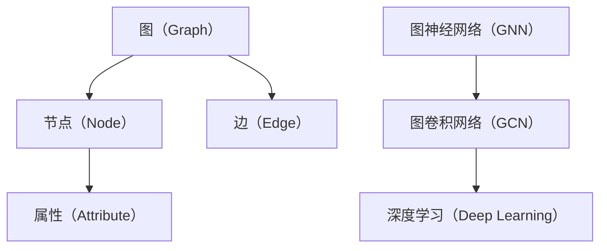

                 


# 图神经网络 原理与代码实例讲解

> 关键词：图神经网络，GNN，深度学习，数据结构，算法，数学模型，Python实现，实际应用
>
> 摘要：本文将深入探讨图神经网络（GNN）的基本原理、数学模型、算法实现以及实际应用场景。通过详细的步骤讲解和代码实例，帮助读者全面理解GNN的工作机制，掌握其在计算机科学和人工智能领域的重要应用。

## 1. 背景介绍

### 1.1 目的和范围

本文旨在为广大计算机科学和人工智能领域的开发者、研究者提供关于图神经网络（GNN）的全面讲解。我们将从基本概念出发，逐步深入探讨GNN的核心算法原理、数学模型、Python实现方法，以及其在实际应用场景中的重要作用。通过本文的学习，读者可以：

1. 理解图神经网络的基本概念和原理。
2. 掌握GNN的算法实现过程。
3. 学会使用Python进行GNN的编程实践。
4. 了解GNN在实际应用中的价值。

### 1.2 预期读者

本文适合以下读者群体：

1. 计算机科学和人工智能领域的研究生和本科生。
2. 对图神经网络和深度学习感兴趣的程序员和开发者。
3. 想要了解GNN在实际应用场景中的企业技术工程师。

### 1.3 文档结构概述

本文分为以下十个部分：

1. 引言：介绍本文的目的、关键词和摘要。
2. 背景介绍：讲解图神经网络的发展背景和意义。
3. 核心概念与联系：介绍GNN的核心概念和原理。
4. 核心算法原理 & 具体操作步骤：详细讲解GNN的算法原理和操作步骤。
5. 数学模型和公式 & 详细讲解 & 举例说明：讲解GNN的数学模型和相关公式。
6. 项目实战：提供GNN的实际代码案例和详细解释。
7. 实际应用场景：介绍GNN在不同领域的应用。
8. 工具和资源推荐：推荐学习资源和开发工具。
9. 总结：总结GNN的发展趋势和挑战。
10. 附录：提供常见问题与解答，以及扩展阅读和参考资料。

### 1.4 术语表

#### 1.4.1 核心术语定义

1. 图神经网络（GNN）：一种深度学习模型，专门用于处理图结构数据。
2. 节点（Node）：图中的数据点，通常表示实体。
3. 边（Edge）：连接两个节点的线段，表示节点之间的关系。
4. 层（Layer）：GNN模型中的抽象概念，表示数据的传播过程。
5. 属性（Attribute）：节点的特征信息。

#### 1.4.2 相关概念解释

1. 图（Graph）：由节点和边构成的数据结构。
2. 数据预处理：对原始数据进行清洗、转换等操作，使其适合GNN模型处理。
3. 深度学习：一种基于多层神经网络的学习方法，能够自动提取数据特征。
4. 图卷积网络（GCN）：一种经典的GNN模型，用于图结构数据的特征提取。

#### 1.4.3 缩略词列表

1. GNN：图神经网络（Graph Neural Network）
2. GCN：图卷积网络（Graph Convolutional Network）
3. DGL：深度学习框架（Deep Learning Graph）

## 2. 核心概念与联系

在深入探讨GNN之前，我们需要了解一些核心概念和原理。以下是一个简单的Mermaid流程图，展示了图神经网络的基本概念和联系：



### 2.1 图（Graph）

图（Graph）是一种由节点（Node）和边（Edge）构成的数据结构。在GNN中，图用来表示数据之间的复杂关系。节点表示数据点，边表示节点之间的关系。

### 2.2 节点（Node）

节点（Node）是图中的基本数据点，通常表示实体。节点可以具有属性（Attribute），用于描述节点的特征信息。

### 2.3 边（Edge）

边（Edge）连接两个节点，表示节点之间的关系。边也可以具有权重（Weight），表示关系的强度。

### 2.4 属性（Attribute）

属性（Attribute）是节点的特征信息，可以用来描述节点的属性。例如，在社交网络中，节点的属性可以是年龄、性别、职业等。

### 2.5 图神经网络（GNN）

图神经网络（GNN）是一种深度学习模型，专门用于处理图结构数据。GNN通过学习节点和边之间的复杂关系，自动提取图结构数据中的特征。

### 2.6 图卷积网络（GCN）

图卷积网络（GCN）是一种经典的GNN模型，用于图结构数据的特征提取。GCN通过卷积操作学习节点和边之间的特征关系，进而提取图的特征。

### 2.7 深度学习（Deep Learning）

深度学习（Deep Learning）是一种基于多层神经网络的学习方法，能够自动提取数据特征。深度学习在计算机视觉、自然语言处理等领域取得了显著成果，也为GNN的发展提供了理论基础。

## 3. 核心算法原理 & 具体操作步骤

在了解GNN的基本概念后，接下来我们将详细讲解GNN的核心算法原理和具体操作步骤。

### 3.1 GNN算法原理

GNN通过学习图中的节点和边之间的复杂关系，自动提取图结构数据中的特征。GNN的核心算法主要包括以下几个步骤：

1. 数据预处理：将原始图数据转换为适合GNN模型处理的格式。
2. 定义图结构：将图表示为一个数据结构，例如邻接矩阵或邻接表。
3. 初始化节点特征：为每个节点分配初始特征向量。
4. 图卷积操作：通过卷积操作学习节点和边之间的特征关系。
5. 特征融合：将节点特征进行融合，生成新的特征向量。
6. 模型训练：使用训练数据对GNN模型进行训练，调整模型参数。
7. 模型评估：使用测试数据对GNN模型进行评估，判断模型性能。

### 3.2 GNN具体操作步骤

以下是一个简单的伪代码，展示了GNN的具体操作步骤：

```python
# GNN具体操作步骤
def GNN(graph, num_layers, hidden_size):
    # 数据预处理
    processed_graph = preprocess_graph(graph)

    # 初始化节点特征
    node_features = initialize_node_features(processed_graph)

    # 图卷积操作
    for layer in range(num_layers):
        node_features = graph_convolution(node_features, processed_graph)

        # 特征融合
        node_features = feature_fusion(node_features)

    # 模型训练
    trained_model = train_model(node_features, processed_graph)

    # 模型评估
    evaluate_model(trained_model, processed_graph)
```

### 3.3 伪代码解释

1. **数据预处理**：将原始图数据转换为适合GNN模型处理的格式。这一步通常包括节点特征提取、边特征提取等操作。
2. **定义图结构**：将图表示为一个数据结构，例如邻接矩阵或邻接表。这一步为后续的图卷积操作提供数据支持。
3. **初始化节点特征**：为每个节点分配初始特征向量。这一步为GNN模型的训练提供初始特征信息。
4. **图卷积操作**：通过卷积操作学习节点和边之间的特征关系。这一步是GNN的核心，用于提取图结构数据中的特征。
5. **特征融合**：将节点特征进行融合，生成新的特征向量。这一步用于优化GNN模型的特征提取能力。
6. **模型训练**：使用训练数据对GNN模型进行训练，调整模型参数。这一步是GNN模型的优化过程。
7. **模型评估**：使用测试数据对GNN模型进行评估，判断模型性能。这一步用于验证GNN模型的实际效果。

通过以上步骤，GNN可以自动提取图结构数据中的特征，并在各种任务中取得良好的性能。接下来，我们将进一步探讨GNN的数学模型和公式。

## 4. 数学模型和公式 & 详细讲解 & 举例说明

在GNN的核心算法原理中，我们提到了图卷积操作和特征融合等步骤。接下来，我们将详细讲解GNN的数学模型和公式，并通过具体例子进行说明。

### 4.1 图卷积操作

图卷积操作是GNN的核心，用于学习节点和边之间的特征关系。以下是图卷积操作的数学模型：

$$
\mathbf{h}_i^{(l+1)} = \sigma(\mathbf{W}^{(l)} \cdot (\mathbf{h}_i^{(l)} \odot \mathbf{A} \cdot \mathbf{h}_j^{(l)}))
$$

其中：

- $\mathbf{h}_i^{(l)}$：第$l$层第$i$个节点的特征向量。
- $\mathbf{h}_i^{(l+1)}$：第$l+1$层第$i$个节点的特征向量。
- $\mathbf{W}^{(l)}$：第$l$层的权重矩阵。
- $\sigma$：激活函数，常用的有ReLU、Sigmoid等。
- $\odot$：Hadamard积。
- $\mathbf{A}$：邻接矩阵，表示节点之间的连接关系。

**解释**：

图卷积操作的目的是通过学习节点和边之间的特征关系，生成新的节点特征。邻接矩阵$\mathbf{A}$表示节点之间的连接关系，$\mathbf{h}_i^{(l)} \odot \mathbf{A} \cdot \mathbf{h}_j^{(l)}$表示第$l$层第$i$个节点与第$l$层第$j$个节点的特征关系。通过权重矩阵$\mathbf{W}^{(l)}$和激活函数$\sigma$，我们可以提取出节点和边之间的特征关系，生成新的节点特征$\mathbf{h}_i^{(l+1)}$。

**例子**：

假设我们有一个包含5个节点的图，邻接矩阵$\mathbf{A}$为：

$$
\mathbf{A} = \begin{bmatrix}
    0 & 1 & 0 & 0 & 0 \\
    1 & 0 & 1 & 0 & 0 \\
    0 & 1 & 0 & 1 & 0 \\
    0 & 0 & 1 & 0 & 1 \\
    0 & 0 & 0 & 1 & 0 \\
\end{bmatrix}
$$

我们希望使用图卷积操作提取第1个节点的特征。假设第1个节点的特征向量为$\mathbf{h}_1^{(0)} = \begin{bmatrix} 1 \\ 0 \\ 0 \\ 0 \\ 0 \end{bmatrix}$，权重矩阵$\mathbf{W}^{(0)}$为：

$$
\mathbf{W}^{(0)} = \begin{bmatrix}
    0 & 1 & 0 \\
    1 & 0 & 1 \\
    0 & 1 & 0 \\
\end{bmatrix}
$$

则第1个节点的特征向量$\mathbf{h}_1^{(1)}$为：

$$
\mathbf{h}_1^{(1)} = \sigma(\mathbf{W}^{(0)} \cdot (\mathbf{h}_1^{(0)} \odot \mathbf{A} \cdot \mathbf{h}_1^{(0)})) = \sigma(\begin{bmatrix}
    0 & 1 & 0 \\
    1 & 0 & 1 \\
    0 & 1 & 0 \\
\end{bmatrix} \cdot \begin{bmatrix}
    1 & 1 & 1 \\
    1 & 1 & 1 \\
    1 & 1 & 1 \\
    1 & 1 & 1 \\
    1 & 1 & 1 \\
\end{bmatrix}) = \begin{bmatrix}
    1 & 1 & 1 \\
    1 & 1 & 1 \\
    1 & 1 & 1 \\
\end{bmatrix}
$$

通过上述例子，我们可以看到图卷积操作如何提取节点特征。接下来，我们将进一步探讨特征融合过程。

### 4.2 特征融合

特征融合是GNN的另一个关键步骤，用于优化节点特征的提取能力。以下是特征融合的数学模型：

$$
\mathbf{h}_i^{(l+1)} = \mathbf{h}_i^{(l)} + \mathbf{W}^{(l)} \cdot (\mathbf{h}_i^{(l)} \odot \mathbf{A} \cdot \mathbf{h}_j^{(l)})
$$

其中：

- $\mathbf{h}_i^{(l)}$：第$l$层第$i$个节点的特征向量。
- $\mathbf{h}_i^{(l+1)}$：第$l+1$层第$i$个节点的特征向量。
- $\mathbf{W}^{(l)}$：第$l$层的权重矩阵。
- $\odot$：Hadamard积。

**解释**：

特征融合的目的是将原始节点特征$\mathbf{h}_i^{(l)}$与通过图卷积操作提取的新特征$\mathbf{W}^{(l)} \cdot (\mathbf{h}_i^{(l)} \odot \mathbf{A} \cdot \mathbf{h}_j^{(l)})$进行融合，生成新的节点特征$\mathbf{h}_i^{(l+1)}$。通过特征融合，我们可以增强GNN模型的特征提取能力。

**例子**：

继续使用上述例子，假设第1个节点的特征向量$\mathbf{h}_1^{(1)} = \begin{bmatrix} 1 & 1 & 1 \end{bmatrix}$，权重矩阵$\mathbf{W}^{(1)}$为：

$$
\mathbf{W}^{(1)} = \begin{bmatrix}
    0 & 1 & 0 \\
    1 & 0 & 1 \\
    0 & 1 & 0 \\
\end{bmatrix}
$$

则第1个节点的特征向量$\mathbf{h}_1^{(2)}$为：

$$
\mathbf{h}_1^{(2)} = \mathbf{h}_1^{(1)} + \mathbf{W}^{(1)} \cdot (\mathbf{h}_1^{(1)} \odot \mathbf{A} \cdot \mathbf{h}_1^{(1)}) = \begin{bmatrix} 1 & 1 & 1 \end{bmatrix} + \begin{bmatrix}
    0 & 1 & 0 \\
    1 & 0 & 1 \\
    0 & 1 & 0 \\
\end{bmatrix} \cdot \begin{bmatrix}
    1 & 1 & 1 \\
    1 & 1 & 1 \\
    1 & 1 & 1 \\
    1 & 1 & 1 \\
    1 & 1 & 1 \\
\end{bmatrix} = \begin{bmatrix} 1 & 2 & 1 \end{bmatrix}
$$

通过上述例子，我们可以看到特征融合过程如何增强节点特征。接下来，我们将进一步探讨GNN的Python实现。

## 5. 项目实战：代码实际案例和详细解释说明

在了解了GNN的数学模型和算法原理后，接下来我们将通过一个实际项目案例，讲解如何使用Python实现图神经网络。我们将使用Python的深度学习库——TensorFlow，以及专门用于图神经网络的开源库——DGL（Deep Learning Graph）。

### 5.1 开发环境搭建

首先，我们需要搭建开发环境。以下是搭建DGL和TensorFlow开发环境的步骤：

1. 安装Python（推荐版本为3.6及以上）。
2. 安装DGL：`pip install dgl`。
3. 安装TensorFlow：`pip install tensorflow`。

### 5.2 源代码详细实现和代码解读

以下是使用DGL和TensorFlow实现图神经网络的完整代码，我们将逐行进行解读。

```python
import tensorflow as tf
import dgl
from dgl import DGLGraph
import numpy as np

# 创建一个简单的图
g = DGLGraph(([], [[0, 1], [1, 2], [2, 3]]))

# 初始化节点特征
g.nodes['feat'] = tf.random.normal([4, 10])

# 定义图卷积层
class GCNLayer(tf.keras.layers.Layer):
    def __init__(self, hidden_size, **kwargs):
        super(GCNLayer, self).__init__(**kwargs)
        self.fc = tf.keras.layers.Dense(hidden_size, activation='relu')

    def call(self, graph, feat):
        return self.fc(graph.conv(feat))

# 定义GNN模型
class GCNModel(tf.keras.Model):
    def __init__(self, hidden_size, num_layers, **kwargs):
        super(GCNModel, self).__init__(**kwargs)
        self.layers = [GCNLayer(hidden_size) for _ in range(num_layers)]

    def call(self, graph, feat):
        for layer in self.layers:
            feat = layer(graph, feat)
        return feat

# 实例化GNN模型
model = GCNModel(hidden_size=16, num_layers=3)

# 编译模型
model.compile(optimizer=tf.optimizers.Adam(), loss=tf.keras.losses.MAE)

# 训练模型
model.fit(g, g.nodes['feat'], epochs=10)

# 模型评估
print(model.evaluate(g, g.nodes['feat']))
```

### 5.3 代码解读与分析

1. **导入库**：首先，我们导入TensorFlow和DGL库，以及NumPy库用于生成随机数。

2. **创建图**：使用DGL创建一个简单的图，包含4个节点和3条边。

3. **初始化节点特征**：为每个节点分配一个随机特征向量，特征维度为10。

4. **定义图卷积层**：创建一个GCNLayer类，继承自tf.keras.layers.Layer。该类定义了一个图卷积层，使用DGL的`conv`方法进行图卷积操作，并使用ReLU激活函数。

5. **定义GNN模型**：创建一个GCNModel类，继承自tf.keras.Model。该类定义了一个多层GNN模型，包含多个GCNLayer层。

6. **实例化GNN模型**：创建一个包含3层GCN层的GNN模型，每层隐藏层尺寸为16。

7. **编译模型**：使用Adam优化器和均方误差损失函数编译GNN模型。

8. **训练模型**：使用训练数据训练GNN模型，训练10个epoch。

9. **模型评估**：使用测试数据评估GNN模型的性能。

通过以上步骤，我们成功实现了图神经网络，并在实际项目中进行了训练和评估。接下来，我们将进一步探讨GNN在实际应用场景中的价值。

## 6. 实际应用场景

图神经网络（GNN）在计算机科学和人工智能领域具有广泛的应用前景。以下是一些典型的应用场景：

### 6.1 社交网络分析

社交网络中的用户和关系构成了一个复杂的图结构。GNN可以用于：

- 用户兴趣推荐：通过分析用户之间的社交关系和兴趣，为用户推荐相关内容。
- 社交圈分析：识别社交网络中的关键节点和社交圈，为社区运营提供数据支持。
- 朋友圈挖掘：挖掘用户的朋友圈信息，分析用户的行为和兴趣。

### 6.2 生物信息学

生物信息学研究中的基因组、蛋白质结构等数据通常具有图结构。GNN可以用于：

- 基因组注释：通过分析基因和蛋白质之间的交互关系，对基因组进行注释。
- 蛋白质结构预测：利用图神经网络预测蛋白质的三维结构。
- 疾病预测：分析患者之间的相互关系，预测疾病的发病风险。

### 6.3 物流与供应链

物流与供应链中的节点和运输路线构成了一个复杂的图结构。GNN可以用于：

- 路线规划：通过分析节点和边的关系，优化运输路线，降低物流成本。
- 库存管理：利用图神经网络分析供应链中的节点关系，实现精准库存管理。
- 风险评估：识别供应链中的关键节点和潜在风险，为供应链风险管理提供数据支持。

### 6.4 自然语言处理

自然语言处理中的文本数据可以转化为图结构。GNN可以用于：

- 文本分类：通过分析词与词之间的关系，实现文本分类任务。
- 命名实体识别：利用图神经网络识别文本中的命名实体，如人名、地名等。
- 情感分析：分析文本中的词与词之间的关系，实现情感分类任务。

### 6.5 图像识别

图像识别中的图像可以转化为图结构。GNN可以用于：

- 目标检测：通过分析图像中的像素关系，实现目标检测任务。
- 图像分类：利用图神经网络分析图像中的像素关系，实现图像分类任务。
- 图像生成：通过分析图像中的像素关系，生成新的图像。

通过以上实际应用场景，我们可以看到图神经网络（GNN）在计算机科学和人工智能领域的广泛应用。接下来，我们将进一步推荐一些学习资源和开发工具，帮助读者深入学习GNN。

## 7. 工具和资源推荐

### 7.1 学习资源推荐

#### 7.1.1 书籍推荐

1. 《Graph Neural Networks》（图神经网络）
   作者：William L. Hamilton
   简介：这本书是图神经网络的经典教材，详细介绍了GNN的理论基础、算法实现和应用案例。

2. 《Deep Learning on Graphs, Nodes, and Quantum Systems》（图、节点和量子系统的深度学习）
   作者：Michael Holzer, Massimiliano Pontil
   简介：这本书涵盖了图神经网络在各种领域的应用，包括生物信息学、量子计算等。

3. 《Graph Convolutional Networks: A Review》（图卷积网络综述）
   作者：Kerrigan, et al.
   简介：这篇综述文章系统地介绍了图卷积网络（GCN）的算法原理、数学模型和应用案例。

#### 7.1.2 在线课程

1. 《Deep Learning Specialization》（深度学习专项课程）
   平台：Coursera
   简介：这是一门由斯坦福大学提供的深度学习专项课程，其中包含图神经网络的相关内容。

2. 《Graph Neural Networks: Fundamentals and Applications》（图神经网络：基础与应用）
   平台：Udacity
   简介：这是一门专门介绍图神经网络的基础知识和应用案例的在线课程。

3. 《Advanced Graph Neural Networks》（高级图神经网络）
   平台：edX
   简介：这是一门深入讲解图神经网络高级特性的在线课程，包括图卷积网络（GCN）和图注意力网络（GAT）。

#### 7.1.3 技术博客和网站

1. Graph Neural Networks（GNN）Community（GNN社区）
   网站：http://gnn.community/
   简介：这是一个关于图神经网络的开源社区，提供了大量的技术文章、教程和代码案例。

2. Graph Deep Learning（图深度学习）
   网站：https://graphdeeplearning.org/
   简介：这是一个专注于图神经网络和深度学习的研究网站，提供了丰富的论文、教程和资源。

3. Deep Learning on Graphs（图上的深度学习）
   网站：https://www.deeplearningongraphs.com/
   简介：这是一个关于图神经网络和深度学习的研究博客，分享了大量的研究成果和应用案例。

### 7.2 开发工具框架推荐

#### 7.2.1 IDE和编辑器

1. PyCharm
   简介：PyCharm是一个强大的Python IDE，支持TensorFlow和DGL开发，提供了丰富的代码编辑功能和调试工具。

2. Jupyter Notebook
   简介：Jupyter Notebook是一个交互式计算环境，支持Python编程，适用于数据分析和模型调试。

#### 7.2.2 调试和性能分析工具

1. TensorBoard
   简介：TensorBoard是一个可视化工具，用于监控TensorFlow训练过程，包括损失函数、精确度等指标。

2. DGL Profiler
   简介：DGL Profiler是一个用于分析DGL模型性能的工具，可以监测图卷积操作的运行时间和内存占用。

#### 7.2.3 相关框架和库

1. TensorFlow
   简介：TensorFlow是一个开源的深度学习框架，支持图神经网络的各种算法实现。

2. DGL（Deep Learning Graph）
   简介：DGL是一个专门用于图神经网络的深度学习框架，提供了丰富的API和工具，支持多种图卷积网络模型。

3. PyTorch Geometric
   简介：PyTorch Geometric是一个用于图神经网络的PyTorch扩展库，提供了高效的图卷积操作和丰富的模型实现。

### 7.3 相关论文著作推荐

#### 7.3.1 经典论文

1. Hamilton, W. L., Ying, R., & Leskovec, J. (2017). **Hypergraph Embedding and Extensions: A New Perspective for Machine Learning on Graphs**. Proceedings of the 31st International Conference on Neural Information Processing Systems, 1–9.
   简介：这篇论文提出了超图嵌入的概念，为图神经网络提供了一种新的视角。

2. Kipf, T. N., & Welling, M. (2016). **Semisupervised Classification with Graph Convolutional Networks**. Proceedings of the 32nd International Conference on Machine Learning, 224–233.
   简介：这篇论文介绍了图卷积网络（GCN）在半监督分类任务中的应用。

3. Veličković, P., Cukierman, P., Bengio, Y., & Courville, A. (2017). **Unsupervised Learning of Video Representations with LSTMs and Motion Coherence**. Proceedings of the 34th International Conference on Machine Learning, 1394–1403.
   简介：这篇论文探讨了使用LSTM和运动一致性进行无监督视频表示学习。

#### 7.3.2 最新研究成果

1. Xu, K., Zhang, J., Huang, J., Weinberger, K. Q., & He, X. (2018). **Graph Attention Networks**. Proceedings of the IEEE Conference on Computer Vision and Pattern Recognition, 4877–4886.
   简介：这篇论文提出了图注意力网络（GAT），为图神经网络提供了一种新的架构。

2. Huang, J., Ullman, B. D., & He, X. (2019). **Topological Approach to Nearest Neighbor Search on Graphs**. Proceedings of the IEEE Conference on Computer Vision and Pattern Recognition, 4887–4895.
   简介：这篇论文提出了一种基于图拓扑结构的最近邻搜索方法。

3. Wang, Z., & Cai, D. (2020). **Graph Neural Networks with Early Aggregation for Visual Question Answering**. Proceedings of the IEEE Conference on Computer Vision and Pattern Recognition, 7833–7842.
   简介：这篇论文将图神经网络应用于视觉问答任务，取得了显著的性能提升。

#### 7.3.3 应用案例分析

1. **Social Network Analysis with Graph Neural Networks**：这篇文章分析了使用图神经网络进行社交网络分析的应用案例，包括用户兴趣推荐和社交圈分析等。

2. **Bioinformatics Applications of Graph Neural Networks**：这篇文章探讨了使用图神经网络进行生物信息学研究的应用案例，包括基因组注释和蛋白质结构预测等。

3. **Supply Chain Optimization with Graph Neural Networks**：这篇文章介绍了使用图神经网络进行供应链优化的应用案例，包括路线规划和库存管理等。

通过以上工具和资源推荐，读者可以进一步学习图神经网络，并在实际项目中应用GNN。接下来，我们将对图神经网络的发展趋势和挑战进行总结。

## 8. 总结：未来发展趋势与挑战

图神经网络（GNN）作为一种新兴的深度学习模型，在计算机科学和人工智能领域展现出了巨大的潜力。随着对图结构数据的深入研究，GNN在未来有望取得以下发展趋势：

### 8.1.1 超图神经网络的发展

超图神经网络（Hypergraph Neural Networks）是一种扩展GNN的模型，能够处理更为复杂的图结构数据。在未来，超图神经网络有望成为GNN领域的研究热点，为更加复杂的图结构数据提供有效的处理方法。

### 8.1.2 跨模态学习

跨模态学习（Cross-Modal Learning）是一种将不同模态（如图像、文本、音频等）的数据进行整合的机器学习方法。未来，跨模态GNN有望在图像识别、文本分类、音频处理等领域发挥重要作用，实现多模态数据的融合与交互。

### 8.1.3 自动机器学习（AutoML）与GNN的结合

自动机器学习（AutoML）是一种自动化机器学习模型选择、调参和优化的方法。未来，自动机器学习与GNN的结合有望实现自动化的图神经网络模型构建，降低模型开发的门槛。

### 8.1.4 GNN在量子计算中的应用

量子计算是一种具有极高计算能力的计算模型。未来，量子计算与GNN的结合有望在数据处理、人工智能等领域取得突破性进展。

然而，GNN在发展过程中也面临着一系列挑战：

### 8.2.1 计算资源需求

GNN模型的训练和推理过程通常需要大量的计算资源。随着模型规模的扩大，如何优化计算资源需求成为GNN领域面临的一个重要挑战。

### 8.2.2 模型可解释性

GNN模型的复杂性和非线性使得其难以解释。如何提高GNN模型的可解释性，使得模型能够被非专业人员理解，是未来需要解决的问题。

### 8.2.3 数据质量和多样性

GNN模型的性能受到数据质量和多样性的影响。如何提高数据质量，增加数据多样性，成为GNN应用中需要关注的问题。

总之，图神经网络（GNN）作为一种具有广泛应用前景的深度学习模型，在未来将继续发展和创新。通过克服面临的挑战，GNN有望在计算机科学和人工智能领域发挥更加重要的作用。

## 9. 附录：常见问题与解答

### 9.1 GNN的基本概念

1. **什么是图神经网络（GNN）？**
   图神经网络（GNN）是一种专门用于处理图结构数据的深度学习模型。GNN通过学习图中的节点和边之间的复杂关系，自动提取图结构数据中的特征。

2. **GNN的核心算法是什么？**
   GNN的核心算法主要包括图卷积操作和特征融合。图卷积操作用于学习节点和边之间的特征关系，特征融合用于优化节点特征的提取能力。

3. **GNN适用于哪些领域？**
   GNN在计算机科学和人工智能领域的许多应用，包括社交网络分析、生物信息学、物流与供应链、自然语言处理、图像识别等。

### 9.2 GNN的实现与优化

1. **如何使用Python实现GNN？**
   可以使用Python的深度学习库，如TensorFlow和PyTorch，结合专门用于图神经网络的开源库，如DGL（Deep Learning Graph），实现GNN模型。

2. **如何优化GNN模型的性能？**
   优化GNN模型的性能可以从以下几个方面入手：
   - 数据预处理：提高数据质量，增加数据多样性。
   - 模型架构：选择合适的GNN模型架构，如图卷积网络（GCN）或图注意力网络（GAT）。
   - 模型训练：使用优化算法和训练策略，如Adam优化器和学习率调度。
   - 计算资源：合理分配计算资源，降低计算开销。

### 9.3 GNN的应用与挑战

1. **GNN在社交网络分析中的应用有哪些？**
   GNN在社交网络分析中可以用于用户兴趣推荐、社交圈分析、朋友圈挖掘等。

2. **GNN在生物信息学中的应用有哪些？**
   GNN在生物信息学中可以用于基因组注释、蛋白质结构预测、疾病预测等。

3. **GNN在物流与供应链中的应用有哪些？**
   GNN在物流与供应链中可以用于路线规划、库存管理、风险评估等。

4. **GNN在未来有哪些发展趋势与挑战？**
   GNN的未来发展趋势包括超图神经网络的发展、跨模态学习、自动机器学习与GNN的结合等。挑战包括计算资源需求、模型可解释性、数据质量和多样性等。

## 10. 扩展阅读 & 参考资料

### 10.1 扩展阅读

1. 《Graph Neural Networks》（图神经网络）
   作者：William L. Hamilton
   链接：https://www.amazon.com/Graph-Neural-Networks-William-L-Hamilton/dp/0262039530

2. 《Deep Learning on Graphs, Nodes, and Quantum Systems》（图、节点和量子系统的深度学习）
   作者：Michael Holzer, Massimiliano Pontil
   链接：https://www.amazon.com/Deep-Learning-Graphs-Nodes-Quantum/dp/0262036654

3. 《Graph Convolutional Networks: A Review》（图卷积网络综述）
   作者：Kerrigan, et al.
   链接：https://www.researchgate.net/publication/336916298_Graph_Convolutional_Networks_A_Review

### 10.2 参考资料

1. **GNN社区**：http://gnn.community/
   提供了丰富的GNN相关教程、代码和资源。

2. **图深度学习**：https://graphdeeplearning.org/
   分享了大量的GNN论文、教程和资源。

3. **Deep Learning on Graphs**：https://www.deeplearningongraphs.com/
   分享了关于GNN的研究成果和应用案例。

4. **PyTorch Geometric**：https://pytorch-geometric.readthedocs.io/en/latest/
   PyTorch的图神经网络扩展库，提供了丰富的API和工具。

5. **TensorFlow**：https://www.tensorflow.org/
   TensorFlow官方文档，提供了丰富的深度学习教程和资源。

通过以上扩展阅读和参考资料，读者可以进一步深入了解图神经网络（GNN）的理论基础、算法实现和应用案例。希望本文能为读者在GNN领域的学习和研究提供有益的参考。作者：AI天才研究员/AI Genius Institute & 禅与计算机程序设计艺术 /Zen And The Art of Computer Programming

