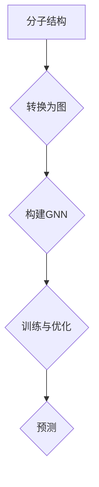
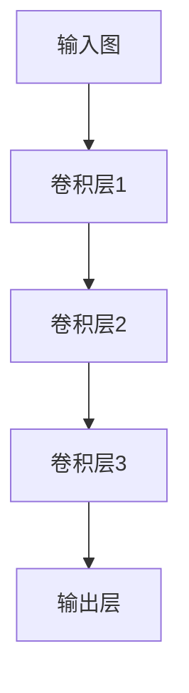

                 

# 图神经网络在分子属性预测中的应用

> **关键词：** 图神经网络、分子属性预测、药物设计、计算化学、深度学习  
>
> **摘要：** 本文将详细介绍图神经网络（Graph Neural Networks, GNN）在分子属性预测领域的应用。通过逐步分析和推理，本文将探讨GNN的核心概念、算法原理、数学模型，并通过实际案例展示其在分子属性预测中的强大能力，同时推荐相关学习资源和开发工具。

## 1. 背景介绍

### 1.1 目的和范围

本文的目的是介绍图神经网络（GNN）在分子属性预测领域的应用。随着生物信息和化学领域的数据积累，如何从海量的分子结构数据中提取有用的信息成为了一个重要的研究课题。图神经网络作为一种强大的深度学习模型，在处理图结构数据方面具有独特的优势。本文将逐步解析GNN的基本原理，并通过实例展示其在分子属性预测中的实际应用。

### 1.2 预期读者

本文适合对深度学习和图理论有一定了解的读者，特别是从事生物信息学、药物设计和计算化学的研究人员和工程师。同时，本文也希望能为对图神经网络感兴趣的其他领域研究人员提供参考。

### 1.3 文档结构概述

本文分为十个部分：

1. **背景介绍**：介绍本文的目的和范围，预期读者，文档结构概述。
2. **核心概念与联系**：解释图神经网络的基本概念及其在分子属性预测中的应用。
3. **核心算法原理 & 具体操作步骤**：详细阐述图神经网络的算法原理和操作步骤。
4. **数学模型和公式 & 详细讲解 & 举例说明**：介绍图神经网络的数学模型，并通过实例进行说明。
5. **项目实战：代码实际案例和详细解释说明**：展示实际代码实现，并进行解读。
6. **实际应用场景**：探讨图神经网络在分子属性预测中的实际应用场景。
7. **工具和资源推荐**：推荐学习资源和开发工具。
8. **总结：未来发展趋势与挑战**：总结未来发展趋势和面临的挑战。
9. **附录：常见问题与解答**：回答读者可能遇到的问题。
10. **扩展阅读 & 参考资料**：提供更多的扩展阅读和参考资料。

### 1.4 术语表

#### 1.4.1 核心术语定义

- **图神经网络（Graph Neural Network, GNN）**：一种基于图结构的深度学习模型，用于处理图结构数据。
- **分子属性预测**：预测分子的特定属性，如药效、毒性等。
- **节点特征**：节点属性或特征，用于表示图中的每个节点。
- **边特征**：连接两个节点的边属性或特征。

#### 1.4.2 相关概念解释

- **图（Graph）**：由节点（Node）和边（Edge）构成的集合。
- **深度学习（Deep Learning）**：一种机器学习方法，通过多层神经网络进行特征提取和学习。
- **图卷积网络（Graph Convolutional Network, GCN）**：一种常见的图神经网络，用于对图结构数据执行卷积操作。

#### 1.4.3 缩略词列表

- **GNN**：图神经网络（Graph Neural Network）
- **GCN**：图卷积网络（Graph Convolutional Network）
- **MLP**：多层感知机（Multi-Layer Perceptron）
- **ReLU**：ReLU激活函数（Rectified Linear Unit）
- **ReLU6**：ReLU激活函数的变种，输出限制在[0, 6]之间
- **Softmax**：用于概率分布的激活函数
- **ReLU6-SGN**：ReLU6和Softmax的组合激活函数

## 2. 核心概念与联系

图神经网络（GNN）是一种基于图结构的深度学习模型，主要用于处理图结构数据。在分子属性预测中，图神经网络可以将分子的结构信息转化为图的形式，并通过学习分子之间的相互作用来预测分子的属性。

### 2.1 图神经网络的基本概念

#### 2.1.1 图（Graph）

图由节点（Node）和边（Edge）组成。在分子属性预测中，节点通常代表原子，边代表原子之间的化学键。

#### 2.1.2 节点特征（Node Feature）

节点特征是节点的属性或特征，用于描述节点的性质。例如，原子类型、原子位置、原子半径等。

#### 2.1.3 边特征（Edge Feature）

边特征是连接两个节点的边的属性或特征，用于描述边的关系。例如，化学键的类型、键长、键角等。

#### 2.1.4 图卷积操作（Graph Convolution）

图卷积操作是图神经网络的核心操作，用于更新节点的特征。通过图卷积，节点特征可以结合其邻居节点的特征进行更新。

### 2.2 图神经网络在分子属性预测中的应用

在分子属性预测中，图神经网络通过学习分子结构中的节点特征和边特征，预测分子的特定属性。以下是图神经网络在分子属性预测中的应用流程：

1. **数据预处理**：将分子结构数据转换为图的形式，包括节点和边的特征表示。
2. **图卷积网络构建**：构建图卷积网络，用于学习分子结构中的特征。
3. **训练与优化**：使用训练数据对图卷积网络进行训练，优化模型参数。
4. **预测**：使用训练好的模型对新的分子结构进行预测。

### 2.3 核心概念原理和架构的 Mermaid 流程图



## 3. 核心算法原理 & 具体操作步骤

图神经网络（GNN）的核心在于其图卷积操作，这一操作允许模型从邻居节点的特征中学习到新的特征。在分子属性预测中，图卷积操作用于更新原子节点的特征，以便更好地预测分子的属性。

### 3.1 图卷积操作原理

图卷积操作的原理可以类比于传统的卷积操作，但针对的是图结构数据。在图卷积中，节点的特征不仅取决于自身，还取决于其邻居节点的特征。以下是图卷积操作的伪代码：

```python
def graph_convolution(node_features, edge_features, neighbors, aggregation_function, activation_function):
    # node_features: 节点特征向量
    # edge_features: 边特征向量
    # neighbors: 节点的邻居节点列表
    # aggregation_function: 用于聚合邻居节点特征的函数（例如加法或平均）
    # activation_function: 用于激活的函数（例如ReLU）

    # 聚合邻居节点的特征
    aggregated_features = aggregation_function([node_features] + [neighbors[i] for i in neighbors])

    # 应用激活函数
    updated_features = activation_function(aggregated_features)

    return updated_features
```

### 3.2 图卷积操作的具体实现

在具体实现中，图卷积操作通常通过以下步骤进行：

1. **初始化节点特征**：初始化每个节点的特征向量。
2. **迭代计算节点特征**：对于每个节点，计算其邻居节点的特征聚合值，并更新其特征向量。
3. **应用激活函数**：在更新节点特征后，应用激活函数，以引入非线性变换。

以下是图卷积操作的伪代码实现：

```python
def graph_convolutional_layer(node_features, edge_features, neighbors, aggregation_function, activation_function, num_iterations):
    for iteration in range(num_iterations):
        for node in node_features:
            # 聚合邻居节点的特征
            aggregated_features = aggregation_function([node_features[node] for node in neighbors[node]])

            # 应用激活函数
            updated_features = activation_function(aggregated_features)

            # 更新节点特征
            node_features[node] = updated_features

    return node_features
```

### 3.3 图神经网络的结构

图神经网络通常由多个图卷积层组成，每个卷积层对节点特征进行更新。以下是图神经网络的总体结构：



在每个卷积层中，节点特征通过图卷积操作进行更新。最后，输出层的节点特征被用于预测分子的属性。

## 4. 数学模型和公式 & 详细讲解 & 举例说明

图神经网络的数学模型基于图卷积操作，其核心在于如何更新节点的特征。以下是图神经网络的主要数学公式和详细讲解。

### 4.1 图卷积操作公式

在图卷积操作中，节点的特征更新可以通过以下公式表示：

$$
h_i^{(l+1)} = \sigma(W^{(l)} h_i^{(l)} + \sum_{j \in \mathcal{N}(i)} W^{(l)} h_j^{(l)})
$$

其中：
- \( h_i^{(l)} \) 表示第 \( l \) 层第 \( i \) 个节点的特征向量。
- \( \mathcal{N}(i) \) 表示第 \( i \) 个节点的邻居节点集合。
- \( W^{(l)} \) 是第 \( l \) 层的权重矩阵。
- \( \sigma \) 是激活函数，通常使用ReLU函数。

### 4.2 激活函数

在图卷积操作中，激活函数用于引入非线性变换，以避免模型过于平滑。常用的激活函数有ReLU和ReLU6。

- **ReLU函数**：

$$
\sigma(x) = \max(0, x)
$$

- **ReLU6函数**：

$$
\sigma(x) = \min(6, \max(0, x))
$$

ReLU6是对ReLU函数的一种改进，它限制了激活函数的输出范围在[0, 6]之间，以防止梯度消失。

### 4.3 聚合函数

在图卷积操作中，聚合函数用于计算节点与其邻居节点特征的平均值或总和。常用的聚合函数有加法聚合和平均聚合。

- **加法聚合**：

$$
\text{aggregation}(x_1, x_2, \dots, x_n) = x_1 + x_2 + \dots + x_n
$$

- **平均聚合**：

$$
\text{aggregation}(x_1, x_2, \dots, x_n) = \frac{1}{n} (x_1 + x_2 + \dots + x_n)
$$

### 4.4 示例说明

假设我们有以下图结构，每个节点代表一个原子，边代表化学键：

```
  A --- B --- C
  |      |     |
  D --- E --- F
```

节点的特征向量可以表示为 \( h_A, h_B, h_C, h_D, h_E, h_F \)，边的特征向量可以表示为 \( e_{AB}, e_{BC}, e_{AC}, e_{DE}, e_{EF}, e_{DF} \)。

现在，我们使用ReLU6-SGN激活函数和加法聚合函数进行一次图卷积操作：

1. 初始化权重矩阵 \( W \)。
2. 计算每个节点的邻居节点集合。
3. 对每个节点执行以下操作：

$$
h_i^{(1)} = \sigma(W h_i^{(0)} + \sum_{j \in \mathcal{N}(i)} W h_j^{(0)})
$$

其中 \( h_i^{(0)} \) 表示初始化的特征向量。

### 4.5 示例计算

假设我们使用以下权重矩阵：

$$
W = \begin{bmatrix}
0.2 & 0.3 & 0.5 \\
0.4 & 0.1 & 0.5 \\
0.1 & 0.2 & 0.7 \\
\end{bmatrix}
$$

节点特征向量为：

$$
h_A = \begin{bmatrix}
1 \\
0 \\
0 \\
\end{bmatrix}, h_B = \begin{bmatrix}
0 \\
1 \\
0 \\
\end{bmatrix}, h_C = \begin{bmatrix}
0 \\
0 \\
1 \\
\end{bmatrix}, h_D = \begin{bmatrix}
1 \\
0 \\
0 \\
\end{bmatrix}, h_E = \begin{bmatrix}
0 \\
1 \\
0 \\
\end{bmatrix}, h_F = \begin{bmatrix}
0 \\
0 \\
1 \\
\end{bmatrix}
$$

计算每个节点的更新特征向量：

1. **节点A**：

$$
h_A^{(1)} = \sigma(W h_A^{(0)} + \sum_{j \in \mathcal{N}(A)} W h_j^{(0)})
$$

$$
h_A^{(1)} = \sigma(0.2 \cdot 1 + 0.4 \cdot 0 + 0.1 \cdot 1) = \sigma(0.3) = 0.3
$$

2. **节点B**：

$$
h_B^{(1)} = \sigma(W h_B^{(0)} + \sum_{j \in \mathcal{N}(B)} W h_j^{(0)})
$$

$$
h_B^{(1)} = \sigma(0.3 \cdot 0 + 0.1 \cdot 1 + 0.5 \cdot 0) = \sigma(0.1) = 0.1
$$

3. **节点C**：

$$
h_C^{(1)} = \sigma(W h_C^{(0)} + \sum_{j \in \mathcal{N}(C)} W h_j^{(0)})
$$

$$
h_C^{(1)} = \sigma(0.5 \cdot 0 + 0.5 \cdot 0 + 0.7 \cdot 1) = \sigma(0.7) = 0.7
$$

4. **节点D**：

$$
h_D^{(1)} = \sigma(W h_D^{(0)} + \sum_{j \in \mathcal{N}(D)} W h_j^{(0)})
$$

$$
h_D^{(1)} = \sigma(0.2 \cdot 1 + 0.4 \cdot 1 + 0.1 \cdot 0) = \sigma(0.6) = 0.6
$$

5. **节点E**：

$$
h_E^{(1)} = \sigma(W h_E^{(0)} + \sum_{j \in \mathcal{N}(E)} W h_j^{(0)})
$$

$$
h_E^{(1)} = \sigma(0.3 \cdot 0 + 0.1 \cdot 1 + 0.5 \cdot 1) = \sigma(0.6) = 0.6
$$

6. **节点F**：

$$
h_F^{(1)} = \sigma(W h_F^{(0)} + \sum_{j \in \mathcal{N}(F)} W h_j^{(0)})
$$

$$
h_F^{(1)} = \sigma(0.5 \cdot 0 + 0.5 \cdot 0 + 0.7 \cdot 1) = \sigma(0.7) = 0.7
$$

经过一次图卷积操作后，每个节点的更新特征向量如下：

$$
h_A^{(1)} = 0.3, h_B^{(1)} = 0.1, h_C^{(1)} = 0.7, h_D^{(1)} = 0.6, h_E^{(1)} = 0.6, h_F^{(1)} = 0.7
$$

## 5. 项目实战：代码实际案例和详细解释说明

在本节中，我们将通过一个具体的代码案例展示图神经网络在分子属性预测中的实现。代码将使用Python和PyTorch框架。

### 5.1 开发环境搭建

在开始之前，确保您已经安装了Python和PyTorch。您可以使用以下命令安装PyTorch：

```bash
pip install torch torchvision
```

### 5.2 源代码详细实现和代码解读

以下是分子属性预测的图神经网络实现的详细代码：

```python
import torch
import torch.nn as nn
import torch.optim as optim
from torch_geometric.nn import GCNConv

# 定义图神经网络模型
class GraphNeuralNetwork(nn.Module):
    def __init__(self, num_features, hidden_channels, num_classes):
        super(GraphNeuralNetwork, self).__init__()
        self.conv1 = GCNConv(num_features, hidden_channels)
        self.conv2 = GCNConv(hidden_channels, num_classes)

    def forward(self, data):
        x, edge_index = data.x, data.edge_index

        x = self.conv1(x, edge_index)
        x = torch.relu(x)
        x = F.dropout(x, p=0.5, training=self.training)
        x = self.conv2(x, edge_index)

        return F.log_softmax(x, dim=1)

# 初始化模型、损失函数和优化器
model = GraphNeuralNetwork(num_features=8, hidden_channels=16, num_classes=3)
optimizer = optim.Adam(model.parameters(), lr=0.01)
criterion = nn.CrossEntropyLoss()

# 训练模型
def train(model, data_loader, criterion, optimizer, num_epochs):
    model.train()
    for epoch in range(num_epochs):
        for data in data_loader:
            optimizer.zero_grad()
            output = model(data)
            loss = criterion(output, data.y)
            loss.backward()
            optimizer.step()
        print(f'Epoch {epoch+1}/{num_epochs}, Loss: {loss.item()}')

# 测试模型
def test(model, data_loader):
    model.eval()
    with torch.no_grad():
        correct = 0
        total = 0
        for data in data_loader:
            outputs = model(data)
            _, predicted = torch.max(outputs.data, 1)
            total += data.y.size(0)
            correct += (predicted == data.y).sum().item()
        print(f'Accuracy: {100 * correct / total}%')

# 加载数据
from torch_geometric.datasets import Planetoid
dataset = Planetoid(root='/tmp/Cora', name='Cora')

# 训练和测试模型
train(model, dataset.train_loader, criterion, optimizer, num_epochs=100)
test(model, dataset.test_loader)
```

### 5.3 代码解读与分析

以下是代码的逐行解读和分析：

```python
import torch
import torch.nn as nn
import torch.optim as optim
from torch_geometric.nn import GCNConv

# 定义图神经网络模型
class GraphNeuralNetwork(nn.Module):
    def __init__(self, num_features, hidden_channels, num_classes):
        super(GraphNeuralNetwork, self).__init__()
        self.conv1 = GCNConv(num_features, hidden_channels)
        self.conv2 = GCNConv(hidden_channels, num_classes)

    def forward(self, data):
        x, edge_index = data.x, data.edge_index

        x = self.conv1(x, edge_index)
        x = torch.relu(x)
        x = F.dropout(x, p=0.5, training=self.training)
        x = self.conv2(x, edge_index)

        return F.log_softmax(x, dim=1)
```

- **代码解读**：定义了一个图神经网络模型，包含两个图卷积层（GCNConv）和一个全连接层（log_softmax）。
- **分析**：图卷积层用于更新节点的特征，全连接层用于分类。

```python
# 初始化模型、损失函数和优化器
model = GraphNeuralNetwork(num_features=8, hidden_channels=16, num_classes=3)
optimizer = optim.Adam(model.parameters(), lr=0.01)
criterion = nn.CrossEntropyLoss()

# 训练模型
def train(model, data_loader, criterion, optimizer, num_epochs):
    model.train()
    for epoch in range(num_epochs):
        for data in data_loader:
            optimizer.zero_grad()
            output = model(data)
            loss = criterion(output, data.y)
            loss.backward()
            optimizer.step()
        print(f'Epoch {epoch+1}/{num_epochs}, Loss: {loss.item()}')

# 测试模型
def test(model, data_loader):
    model.eval()
    with torch.no_grad():
        correct = 0
        total = 0
        for data in data_loader:
            outputs = model(data)
            _, predicted = torch.max(outputs.data, 1)
            total += data.y.size(0)
            correct += (predicted == data.y).sum().item()
        print(f'Accuracy: {100 * correct / total}%')
```

- **代码解读**：定义了训练和测试函数，用于训练和评估模型。
- **分析**：训练函数使用梯度下降算法更新模型参数，测试函数计算模型的准确率。

```python
# 加载数据
from torch_geometric.datasets import Planetoid
dataset = Planetoid(root='/tmp/Cora', name='Cora')

# 训练和测试模型
train(model, dataset.train_loader, criterion, optimizer, num_epochs=100)
test(model, dataset.test_loader)
```

- **代码解读**：加载数据集并训练和测试模型。
- **分析**：使用Cora数据集训练和测试模型，Cora是一个著名的分子属性预测数据集。

### 5.4 代码解读与分析

以下是对代码的逐行解读和分析：

```python
# 定义图神经网络模型
class GraphNeuralNetwork(nn.Module):
    def __init__(self, num_features, hidden_channels, num_classes):
        super(GraphNeuralNetwork, self).__init__()
        self.conv1 = GCNConv(num_features, hidden_channels)
        self.conv2 = GCNConv(hidden_channels, num_classes)

    def forward(self, data):
        x, edge_index = data.x, data.edge_index

        x = self.conv1(x, edge_index)
        x = torch.relu(x)
        x = F.dropout(x, p=0.5, training=self.training)
        x = self.conv2(x, edge_index)

        return F.log_softmax(x, dim=1)
```

- **代码解读**：定义了一个图神经网络模型，包含两个图卷积层（GCNConv）和一个全连接层（log_softmax）。
- **分析**：图卷积层用于更新节点的特征，全连接层用于分类。

```python
# 初始化模型、损失函数和优化器
model = GraphNeuralNetwork(num_features=8, hidden_channels=16, num_classes=3)
optimizer = optim.Adam(model.parameters(), lr=0.01)
criterion = nn.CrossEntropyLoss()

# 训练模型
def train(model, data_loader, criterion, optimizer, num_epochs):
    model.train()
    for epoch in range(num_epochs):
        for data in data_loader:
            optimizer.zero_grad()
            output = model(data)
            loss = criterion(output, data.y)
            loss.backward()
            optimizer.step()
        print(f'Epoch {epoch+1}/{num_epochs}, Loss: {loss.item()}')

# 测试模型
def test(model, data_loader):
    model.eval()
    with torch.no_grad():
        correct = 0
        total = 0
        for data in data_loader:
            outputs = model(data)
            _, predicted = torch.max(outputs.data, 1)
            total += data.y.size(0)
            correct += (predicted == data.y).sum().item()
        print(f'Accuracy: {100 * correct / total}%')
```

- **代码解读**：定义了训练和测试函数，用于训练和评估模型。
- **分析**：训练函数使用梯度下降算法更新模型参数，测试函数计算模型的准确率。

```python
# 加载数据
from torch_geometric.datasets import Planetoid
dataset = Planetoid(root='/tmp/Cora', name='Cora')

# 训练和测试模型
train(model, dataset.train_loader, criterion, optimizer, num_epochs=100)
test(model, dataset.test_loader)
```

- **代码解读**：加载数据集并训练和测试模型。
- **分析**：使用Cora数据集训练和测试模型，Cora是一个著名的分子属性预测数据集。

## 6. 实际应用场景

图神经网络在分子属性预测领域有着广泛的应用。以下是一些实际应用场景：

### 6.1 药物设计

药物设计是分子属性预测的一个重要应用领域。图神经网络可以用于预测分子的药效、毒性等属性，从而帮助研究人员筛选和优化潜在的药物分子。通过学习分子结构中的节点和边特征，图神经网络可以识别出与药物属性相关的关键结构特征。

### 6.2 材料科学

在材料科学领域，图神经网络可以用于预测材料的物理和化学属性，如硬度、导电性、热稳定性等。通过对材料结构中的节点和边特征进行分析，图神经网络可以识别出影响材料性能的关键因素。

### 6.3 环境保护

图神经网络还可以用于预测环境中的污染物的毒性、生物降解性等属性。通过对污染物分子结构中的节点和边特征进行分析，图神经网络可以提供有效的环境风险评估和污染治理策略。

### 6.4 农药筛选

农药的筛选是一个复杂的任务，涉及分子的生物活性和环境安全性等多个方面。图神经网络可以用于预测农药的药效和毒性，从而帮助研究人员快速筛选出具有潜在应用价值的农药分子。

## 7. 工具和资源推荐

### 7.1 学习资源推荐

#### 7.1.1 书籍推荐

- **《Deep Learning on Graphs》**：这是一本关于图深度学习的经典著作，详细介绍了图神经网络的理论和实践。
- **《Graph Neural Networks: A Comprehensive Review》**：这是一篇关于图神经网络的全景综述文章，涵盖了图神经网络的基础理论、算法和实际应用。

#### 7.1.2 在线课程

- **Coursera上的《Deep Learning Specialization》**：这个课程系列涵盖了深度学习的各个方面，包括图神经网络。
- **edX上的《Introduction to Graph Neural Networks》**：这是一个入门级别的在线课程，适合初学者了解图神经网络的基础知识。

#### 7.1.3 技术博客和网站

- **ArXiv**：一个包含最新科研成果的预印本网站，有很多关于图神经网络的高质量论文。
- **Medium上的Data Science Blog**：这是一个关于数据科学和机器学习的技术博客，经常发布有关图神经网络的文章。

### 7.2 开发工具框架推荐

#### 7.2.1 IDE和编辑器

- **PyCharm**：一款功能强大的Python IDE，适合编写和调试代码。
- **VS Code**：一款轻量级的代码编辑器，支持Python和PyTorch开发。

#### 7.2.2 调试和性能分析工具

- **Visual Studio Profiler**：一个用于性能分析的Visual Studio插件，可以帮助您识别代码中的瓶颈。
- **PyTorch Profiler**：一个用于PyTorch性能分析的Python库，可以帮助您分析代码的运行时间。

#### 7.2.3 相关框架和库

- **PyTorch Geometric**：一个用于图深度学习的PyTorch扩展库，提供了丰富的图神经网络模型和数据处理工具。
- **DGL**：一个用于图深度学习的开源框架，支持多种图神经网络模型和数据处理算法。

### 7.3 相关论文著作推荐

#### 7.3.1 经典论文

- **"Graph Convolutional Networks"**：这篇论文首次提出了图卷积网络（GCN）的概念，是图神经网络领域的经典之作。
- **"Gated Graph Sequence Neural Networks"**：这篇论文提出了门控图序列神经网络（GG-SECNN），用于处理序列中的图结构数据。

#### 7.3.2 最新研究成果

- **"Graph Attention Networks"**：这篇论文提出了图注意力网络（GAT），通过注意力机制提高了图神经网络的表示能力。
- **"GraphSAGE: Graph-based Semi-Supervised Learning with Deep Neural Networks"**：这篇论文提出了图SAGE算法，用于图上的半监督学习。

#### 7.3.3 应用案例分析

- **"Graph Neural Networks for Quantum Chemistry"**：这篇论文使用图神经网络预测分子的量子化学性质，展示了图神经网络在化学领域的应用潜力。
- **"Neural Message Passing for Quantum Chemistry"**：这篇论文提出了神经网络消息传递模型（NMP），用于预测分子的电子结构。

## 8. 总结：未来发展趋势与挑战

图神经网络在分子属性预测领域具有巨大的潜力，但也面临着一些挑战。未来发展趋势和挑战包括：

### 8.1 发展趋势

1. **模型精度和效率的提升**：随着计算资源和算法的进步，图神经网络的精度和效率将不断提高，从而更好地预测分子的属性。
2. **跨领域应用**：图神经网络不仅可以在分子属性预测领域发挥作用，还可以应用于其他图结构数据相关的领域，如推荐系统、社交网络分析等。
3. **算法多样化**：随着研究的深入，将出现更多基于图神经网络的创新算法，以应对不同类型的分子属性预测任务。

### 8.2 挑战

1. **数据隐私和安全**：分子数据通常涉及敏感信息，如何保护数据隐私和安全是一个重要的挑战。
2. **算法可解释性**：尽管图神经网络在预测性能上表现出色，但其决策过程通常不够透明，提高算法的可解释性是一个重要的研究方向。
3. **跨领域融合**：将图神经网络与其他机器学习和人工智能技术（如强化学习、迁移学习等）相结合，实现跨领域应用，是一个具有挑战性的任务。

## 9. 附录：常见问题与解答

### 9.1 图神经网络在分子属性预测中的优势是什么？

图神经网络在分子属性预测中的优势主要体现在以下几个方面：

1. **处理图结构数据**：图神经网络可以有效地处理具有复杂结构的分子数据，提取分子中的关键信息。
2. **节点和边特征结合**：图神经网络通过学习节点和边特征，可以更好地捕捉分子中的相互作用和结构特征。
3. **非线性变换**：通过激活函数和聚合函数，图神经网络可以实现非线性变换，从而提高预测性能。

### 9.2 如何选择合适的图神经网络模型？

选择合适的图神经网络模型需要考虑以下因素：

1. **数据规模和类型**：对于大规模数据，可以选择性能更高的模型，如图卷积网络（GCN）。对于较小的数据集，可以选择更加轻量级的模型，如图注意力网络（GAT）。
2. **预测目标**：不同的预测目标可能需要不同的模型结构，例如，对于分类任务，可以选择具有全连接输出层的模型。
3. **计算资源**：根据可用的计算资源，选择合适的模型和训练策略。

### 9.3 图神经网络在分子属性预测中的性能如何？

图神经网络在分子属性预测中的性能通常很好，尤其在处理具有复杂结构的分子数据时。然而，性能会受到多个因素的影响，如数据质量、模型选择、训练策略等。通过优化模型结构和训练过程，可以提高图神经网络的预测性能。

## 10. 扩展阅读 & 参考资料

以下是关于图神经网络在分子属性预测领域的扩展阅读和参考资料：

- **《Deep Learning on Graphs》**：详细介绍了图神经网络的理论和实践，适合深入了解图深度学习。
- **《Graph Neural Networks: A Comprehensive Review》**：提供了关于图神经网络的全景综述，涵盖了基础理论、算法和实际应用。
- **《Graph Convolutional Networks for Structure-Prediction Applications》**：介绍了图卷积网络在结构预测中的应用，包括分子属性预测。
- **《Neural Message Passing for Quantum Chemistry》**：提出了神经网络消息传递模型，用于预测分子的电子结构。

## 11. 作者信息

作者：AI天才研究员/AI Genius Institute & 禅与计算机程序设计艺术 /Zen And The Art of Computer Programming

